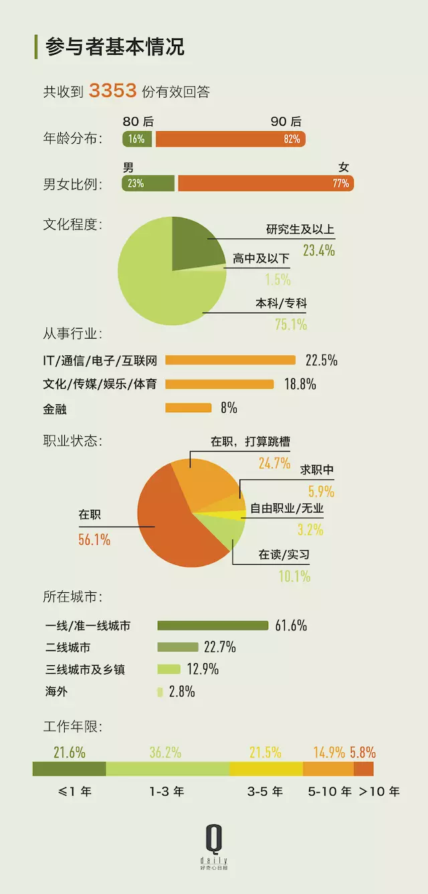
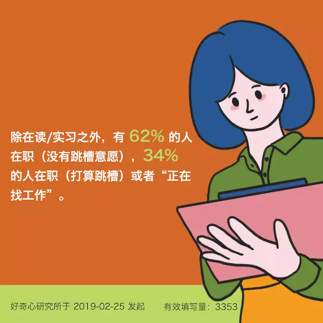
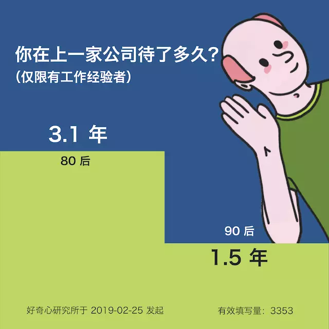
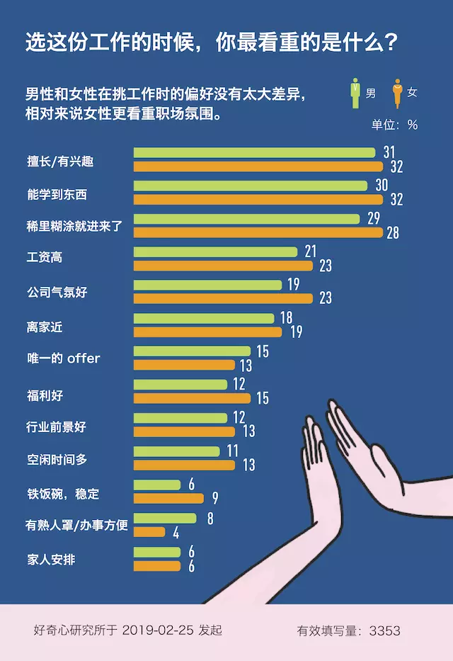
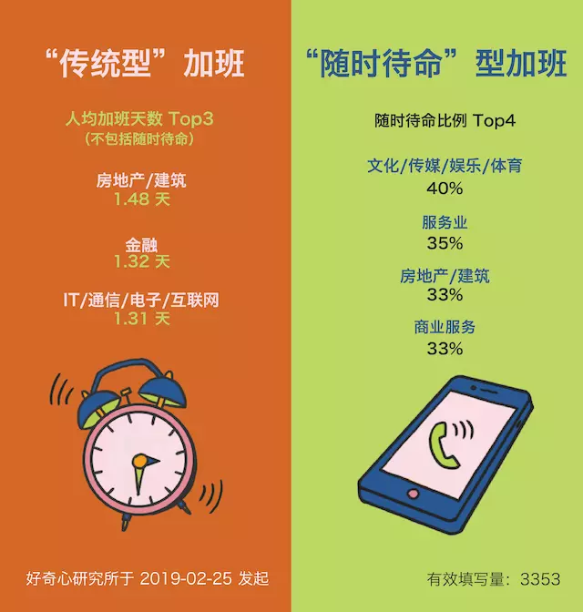
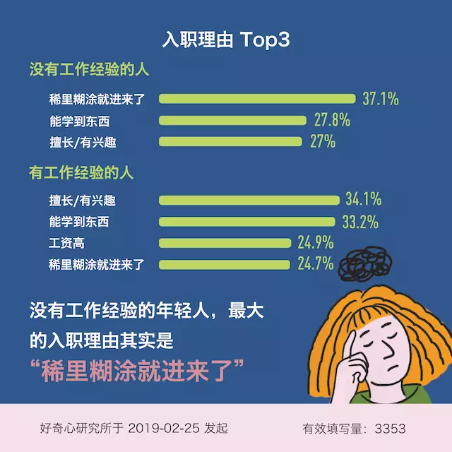
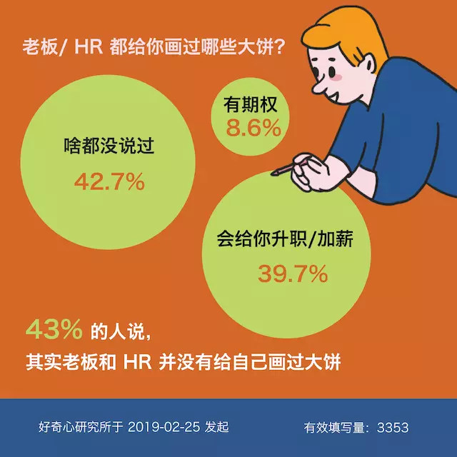
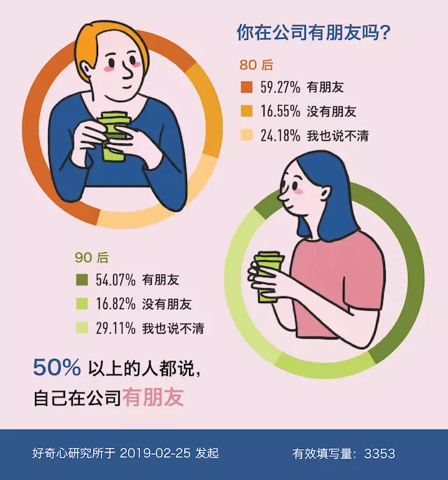

## 如果你讨厌 996，你不是一个人在战斗 | 好奇心年轻人职场报告

)

刘融

3 月 22 日

> [原文地址](http://www.qdaily.com/articles/62266.html#)

我们的调查显示，54% 的人找工作的时候会直接避开要求 996 的公司。

说到工作，一直以来，年轻人的态度是有一点点“矛盾”的。

一方面，[“敬业”“理想”](http://www.qdaily.com/articles/45521.html)这样的传统职场价值观已经不太能唤起他们的共鸣，另一方面，[“总觉得自己做的事情没什么意义”](http://www.qdaily.com/mobs/1263.html)又暗示着他们对工作依然有金钱之外的考量；[“工作就是拼杀”“职场是残酷的”](http://www.qdaily.com/articles/38349.html)之类的厚黑学让他们反感，但“三十岁还没做到中层就没戏了”“薪水不翻倍就是浪费跳槽机会”这样的公众号式职场箴言依然会引发他们对自己的质疑与不安；他们一边说着[“同事就是同事，职场莫谈友谊”](http://www.qdaily.com/articles/59958.html)，一边又不得不承认，公司社交圈始终是自己的人际关系里重要的一环。

关于职场，好奇心研究所曾经发布过多个开放式调研，包括[同事关系](http://www.qdaily.com/mobs/2334.html)、[工作和生活的界限](http://www.qdaily.com/tots/2496.html)、[办公语言](http://www.qdaily.com/articles/53037.html)、[公司招聘](http://www.qdaily.com/papers/319.html)[和福利](http://www.qdaily.com/papers/2833.html)、在校[学生与职场人的区别](http://www.qdaily.com/papers/1975.html)、[职场歧视](http://www.qdaily.com/mobs/1195.html)和[“办公室政治”](http://www.qdaily.com/mobs/1183.html)、[办公室里的微妙心态](http://www.qdaily.com/papers/815.html)、[面试经历](http://www.qdaily.com/papers/2341.html)、[辞职](http://www.qdaily.com/mobs/1493.html)/[进修](http://www.qdaily.com/mobs/1938.html)的动机……等等，每次都获得了数量可观、角度各异的表态。

在此基础上，我们又在 2019 年 2 月到 3 月发布了一份[调查问卷](https://wj.qq.com/s2/3263306/804d/)，希望能让年轻人展开来聊聊自己的上班体验，以“彰显个性”、[强调人与人之间的边界](http://www.qdaily.com/articles/38554.html)、差异和多样性著称的他们，在职场上可能会遇到什么，2018 年和 2019 年又是个变化众多的年份，这些变化是否对他们产生了影响。简而言之，我们想更系统地了解当代年轻人如何看待“工作”这件事。

这份问卷在社交媒体上发布之后，获得了 3353 次有效填写，受众以 90 后和 80 后为主，女性占了大多数；大部分是本科/专科及以上学历，全职在岗者超过八成，多数工作于一二线城市；工作经验普遍不超过十年，三成参与者还处于“尚在第一份工作”阶段（以下简称“职场新人”）；各个行业的从业者都有，比较多的三个是 IT/通信/电子/互联网（以下简称“互联网”）、文化/传媒/娱乐/体育（以下简称“文娱传媒”）和金融。

基本上，这是一份“城市年轻职场人（尤其是职场年轻女性）”属性比较强的样本。

### 关于年轻人的职场，你可能感兴趣的 8 个事实

在这份问卷里，我们得到了许多有意思的结论。

有一部分确实在我们的意料之内，比如：

**1. 有 1/3 的职场年轻人打算跳槽/正在找工作**

去掉正在读书/实习的学生，剩下的人里面，“在职，没有跳槽打算”的人占了 62%，“在职但打算跳槽”和“正在找工作”这两种状态分别占了 27%和 7%。换言之，在调查期间，每三个年轻职场人里，差不多就会有一个人打算/正在找工作。

**2. “三年换一份工作”挺常见**

考虑到有相当一部分问卷参与者还在做第一份工作，没有经历过完整的“求职-入职-离职”周期，我们以“在上一家公司呆的时间（至少换过一次工作）”作为估算指标，对比不同年龄段会在一个岗位待多久。

将每个选项的中位数以得票数进行加权平均，我们得到的在职时间近似值是：80 后 3.1 年，90 后 1.5 年。考虑到 90 后的工作年限普遍不是很长，不稳定因素更多（比如，只是短期实习/还在寻找方向/缺乏斗争经验等等），我们认为，跟 90 后相比，80 后的这个数字更有代表性一点。

此外，Linkedin 在 2014 年发布的《职场人士跳槽报告》也提到[，中国职场人的平均在职时间是 2.8 年（34 个月）](http://www.qdaily.com/articles/3192.html)。总的来说，3 年大概是当代人在一份工作上的普遍耐受期。 

**3. 男女挑工作的标准差不多，尽管女性对公司氛围更看重一点点**

因为调查参与者中女性占比非常高，在“最近这份工作，你为啥会选它？”这个问题上，我们重点对比了不同性别在选工作时的偏好。

结果显示，大多数指标都没有明显差异，比例差距超过 3 个点的几个选项分别是“公司气氛好”（女性 23%，男性 19%）、“有熟人罩/办事方便”（女性 4%，男性 8%）以及“铁饭碗，稳定”（女性 9%，男性 6%），但都不是最靠前的原因。

**4. 加班挺常见，但不同行业的加班方式不一样**

我们之前的一篇报告就提到，随着网络的发展，[“工作生活一体化”](http://www.qdaily.com/articles/57130.html)已经成为趋势。但是在不同的行业/岗位，加班（或变相加班）的类型也会有所不同：拿传统的“延时下班”来说，每周加班次数最多的三个行业是房地产/建筑（1.5 天）、金融（1.3 天）和互联网（1.3 天）；再拿新型的“随时待命”来说，standby 人数比例最高的行业则是文娱传媒（40%）、服务业（35%）、房地产/建筑和商业服务（都是 33%）。

当然了，我们的调查也证明了，有些职场传言，其实不是很准确，比如：

**5. “第一份工作，钱不重要”**

求职选择跟工作阅历确实有点关系：有工作经验的人（至少换过一次工作）入职的三个主要理由是“擅长/有兴趣”“能学到东西”以及“工资高”，而职场新人（还在做第一份工作）选得最多的其实是“稀里糊涂就进来了”，其次是“能学到东西”，“擅长/有兴趣”排在第三。

“第一份工作，钱不重要”这个说法，每个刚从学校毕业的年轻人应该都听过。但从我们的调查来看，它其实还应该有个后半句：在第一份工作的挑选上，与其说“钱不重要”，倒不如说“自己也不确定哪个才重要”；而且，虽然钱不可不谈，但无论是不是第一份工作，它都不是 top 1 的理由。

**6. “老板都喜欢跟员工谈理想、画大饼”**

可能是因为大多数公司都意识到了“这届年轻人没那么好糊弄”，在“老板/ HR 都给你画过哪些大饼”这题里，最多人选的其实是“啥都没说过”（43%），其次才是“给你升职加薪”（40%）。曾被我们多次[调侃](http://www.qdaily.com/articles/42370.html)的“有股份/期权”排在第三，但是比例很小，只有 9%。看起来，这些似是而非的“愿景式话术”，被采用的频率不如我们想得那么频繁，至少，公司并不常把这招用在年轻员工身上。

**7. “每家公司都热衷加班”**

事实上，在“你的岗位每周加班多久”这个问题上，最多人选择的答案是“不用加班”（35%），其次才是“没有固定时间，随时待命”（28%）和 1-2 天（21%）。更重要的是，在我们给出的 8 个常见加班理由中，“工作确实没做完”（64%）排在第一，比例远超排在后面的“领导/同事没走我也不敢走”（14%）和“我司提倡加班文化”（13%）——加班情况固然跟行业、岗位性质有关，但也没有到“所有公司都喜欢加班”的地步，“加班文化”总被吐槽不假，但忙不过来导致的加班更常见。

**8. “职场就别谈友谊了”**

好奇心研究所曾经发起过一次[“你遇到过哪些职场友谊难题”](http://www.qdaily.com/mobs/2334.html)的开放式问答，得到了 2410 次表态。排名最靠前的答案几乎都偏向于“职场没有友谊”“同事跟朋友要分清楚”。

但具体到操作层面，我们得到的答案却不是这样：本次调查中，不管是哪个年龄段，承认自己“在公司有朋友”的人都占了一半以上，真正确定“没在公司交到任何朋友”的人不到 30%。

### 关于一个职场诸多小细节，还有这 7 个数字

在“[那些不靠谱的职场秘笈](http://www.qdaily.com/articles/38349.html)”里，我们就曾经就一些“容易引发不必要恐慌的「职场经」”提出不同意见。这次，我们用以下这 7 个数字，希望进一步展现更多真实的、容易被忽视的职场细节：

**69%**

在“你的加班是有偿的吗”这个问题中，选择“无偿加班”的人数占比。“加班不给钱”的一个可能的原因是，“有时/总是要随时盯着工作情况”（78%）和“有时/总是要在非工作时间回复同事的消息”（84%）等“变相加班”太过常见。

**1/3**

受去年底开始的“经济下行”影响的个体比例。年轻人遇到最多的情况包括年终奖缩减（16%）、工作时间调整（5%）、降薪（4%）等等。至于“经济下行”对行业/公司的影响，波及范围就更广了：一共有 57%的人目睹/感受到了控制成本（35%）、调整人员/业务（27%）、取消/减少奖金（22%）等动向。

**1 个小时**

“从外环到市中心/从郊区到 CBD”的候鸟式（甚至双城式）通勤，并不是年轻职场人的日常： 77% 的人，每天在路上的时间不到一个小时。

**190 人**

“从不屏蔽同事的朋友圈，但也不让他们看到自己的朋友圈”的人数。相对地，只有 14 个人“对同事公开自己的每条朋友圈，但却不看他们的朋友圈”：年轻人对同事的关注，似乎比自己对他们的展示要多一些。

**3 个小时**

70%的人每天摸鱼 3 个小时以内，完全没空摸鱼的只有 17%。值得一提的是，因为“工作确实没做完”而加班的年轻人里，还是有 49%的人每天顽强摸鱼 1 小时以上。俗话说 deadline 是第一生产力，但没有摸鱼就没有 deadline，可见摸鱼才是当代职场基本人权。

**7.14**

当代年轻人的职场焦虑指数。“工作压力指数”是 6.47，“工作动力指数”则是 5.29（满分都是 10 分）。很显然，对年轻人来说，工作的焦虑和压力并未完全转化为动力，“社畜”比“职场战士”更多。

**64%**

拥有避开老板的“同事闲聊小群”的比例。其中三分之二的人说自己偶尔会活跃，剩余三分之一的人则基本都在潜水。问题是，加入了这些闲聊群的职场人里，有近一半的人（48%）同时表示自己“静音了所有公司群”——加群归加群，mute 起来也是不留情。

### 工作之后，你大概率要经历的 7 次小型“练级”

好奇心研究所此前做了一项名为[“从学校毕业之后，你最为什么事情感到焦虑”](http://www.qdaily.com/mobs/1263.html)的调查，在收到的 7304 次表态中，关于工作的选项“不喜欢现在的工作，又搞不清自己想做什么”得票第一，获得 1362 次认同。

但其实，“不知道自己在做什么、该做什么”只是职场困扰这个长篇故事的小小序章。办公室的练级打怪之路，结合大家在调查中的反馈，我们总结了这几个需要你做好心理准备的关卡：

**1. “风口”行业要不要去？**

风口行业被选择的原因往往都是那几个：“机会多”“收入高”“升职迅速”……如果单独看入职的理由，“工资高”被提得最多的三个行业是互联网、金融（都是 31%）和房地产/建筑（27%）。根据国家统计局最近一次公布的[数据](http://data.stats.gov.cn/easyquery.htm?cn=C01)，“信息传输、计算机服务和软件业”和“金融业”以 133150 元和 122851 元的行业年均工资分列前两位，“房地产业”以 69277 元排在第 13。论收入或话题度，它们确实是近年社交媒体上最有“存在感”的行当。

当然了，“风口”往往也伴随着风险。调查中，受“行业寒冬”影响人数比例最高的行业是互联网（40%）、交通物流（39%）、金融（38%）、房地产/建筑、加工制造（都是 37%），其中不乏热门行业。好奇心日报之前的[报道](http://www.qdaily.com/articles/59755.html)也提到了这个现象。

**2. “Gap Year /职场空窗期”算不算大件事？**

一直以来，年轻人都被认为是“一言不合就裸辞，待业一年都没在怕”的职场冲动型存在。但事实是，调查里 60% 以上的人空窗期都不超过三个月，真正做到“一年多都不工作”的人只有 2.8%；80 后的平均待业天数是 64 天，90 后甚至更短，只有 57 天（都不包括职场新人）。所谓的“Gap year” 几乎不存在，大家还是更愿意歇两个月就回去上班。

**3. 跟同事说话，要怎么平衡“热情”和“距离”？**

同样是回应同事，女性最爱用的句子是“好的~”（46%）“嗯嗯”（39%）和“哈哈哈哈哈”（30%），而男性最常说的是“好”（33%），其次才是“好的～”（32%）和“嗯嗯”（28%）：同样是职场假装老好人，男性和女性的画风并不完全相同。

**4. 如何在职场优雅说“不”？**

在“你的岗位如何优雅甩锅”这个问题里，理直气壮说“我从来没这样做过”的人只有 18%。可见对大部分人来讲，“在不破坏交情的前提下委婉 say no”始终是刚需。我们列出的职场[“非暴力不合作”常用](http://www.qdaily.com/articles/48232.html)句式里，“这个你去找那谁谁”（42%）“我得先问问老板”（34%）和“在走流程了”（31%）三板斧依然经久不衰，在当代[职场黑话](http://www.qdaily.com/articles/59198.html)红宝书里的地位，相当于四六级词汇表里的 abandon。

**5. 在公司应该“nice”一点吗？**

好奇心研究所之前就发现，[“在职场，nice 这种品质并不会让你很受用”](http://www.qdaily.com/articles/55614.html)，这点在调查中也得到了间接验证：“曾经在公司生气/情绪激动”的人超过一半（52%）。“忍气吞声、听话、小透明”的传统下属形象，在年轻人的职场中似乎没那么吃香。

**6. “跟同事聊工资”真有那么敏感？**

“跟同事聊工资”过去也许被描述成职场禁忌，但对年轻人来说，[它早已经不是个敏感话题](http://www.qdaily.com/articles/57793.html)：52%的人都跟老板/ HR 之外的同事谈过自己的收入。在扁平化管理、信息透明、同工同酬风气的影响下，[“谈钱没问题，沟通得当说不定还是感情加分项”](http://www.qdaily.com/articles/52390.html)这条法则，有延伸到办公室的趋势。

**7. 该不该下决心转行？**

我们刚才已经提到，年轻人的职场焦虑一大半都来自于“方向”问题，这个担忧随着年龄增长还会逐步累积：说到“工作上最担心的事”，90 后认为是“钱太少”（52%），而 80 后却说是“职业倦怠/天花板”（49%）。

既然说到了“职业方向”，我们也顺带问了问大家的转行意愿：“想转行”和“不想转行”的人比例旗鼓相当，都接近 40%。但是，在有意转行的人里面，真正采取行动的人只有 28%，其他的“我想转行”依然还停留在口头阶段。

### 最后，你可能用得上的 10 条职场小建议

我们从这份调查里，还归纳出了一些当代职场人的经验之谈。比如：

\1. 别光看公司给几天年假，“隐形”福利也很重要：不论是 80 后还是 90 后，他们觉得最有用的职场福利除了雷打不动的“年假”（77%）和“弹性工作制”（55%），还有“体检”（54%）和“租房补贴”（52%）这两项。软件公司 Qualtrics 和投资公司 Accel Partners 在 2017 年发布的[报告](http://www.qdaily.com/articles/42370.html)也说，“长久、稳定的保障”“灵活的工作时间”“职业培训的机会”是最得千禧一代认可的“职场关怀”。

\2. 不喜欢 996 工作制没问题，因为它确实不招人待见：54%的人都说找工作的时候会直接避开要求 996 的公司。如果你真的非常讨厌加班，“早点提出来”未必就没用：拒绝接受 996 的人里面，成功避开高强度/变相加班的人接近六成（59%）。

\3. 如果上级逼着你把微信昵称改成公司+名字，或命令你必须在三分钟之内回应 ta 的指令，有至少六成的人会跟你一样感到被冒犯（但你如果觉得“这俩我都 OK 啊”，也有至少 5%的人会附和你）。

\4. 为了不过早陷入日复一日的[通勤地狱](http://www.qdaily.com/articles/43009.html)，即使在北上广这样的超大都市，住在离公司来回车程 2 小时内的地方也是有必要的。调查中，通勤时间超过 2 小时的长途奔袭者只有 6%。公安部道路交通安全研究中心曾[公布](http://www.qdaily.com/articles/43009.html)过全国 36 大城市的平均通勤时间，即便是一线城市如上海，也只要 57.6 分钟。

\5. “超过 xx 岁才转行”并没有很可怕，“转行”缺的主要还是行动力：工作三年以上的群体里，“转行成功，而且不后悔”的人比例最高，一直维持在全体人数的 21%左右，比“转行失败”和“转行成功，但是后悔了”的人加一起还要多。

\6. [“在办公室哭”](http://www.qdaily.com/articles/58277.html)其实不算什么，调查里有 37% 的人都做过跟你一样的事。

\7. 如果有合得来的同事，离职后不妨再聊聊：有过离职经验的人里，76% 的人都会跟前同事联系，而且联系的原因一半都是“朋友私交”，“不联系”或“只为公事联系”的人，加在一起只有三成。“职场塑料情”并不是办公室的全部。

\8. “不想转发公司的软文”跟敬不敬业无关。44%的人都拒绝用自己的朋友圈给公司白打广告，而且 90 后的朋友们更希望守住这块私人社交领地（90 后拒绝的比例是 46%，80 后只有 35%）。

\9. 成年人也需要表扬，包括领导的夸奖：在好奇心研究所之前的[测试](http://www.qdaily.com/tots/1318.html)中，有 78% 的朋友都对直属领导的夸奖很在意。加拿大和韩国的研究者之前也做了项[调查](https://www.washingtonpost.com/business/2018/10/09/your-boss-has-huge-effect-your-happiness-even-when-youre-not-office/?utm_term=.736c378c1293)，发现成年人的心情很大程度上取决于跟老板的关系，而且，过了 40 岁之后影响更大。

\10. 没必要用“干一行爱一行”给自己心理包袱：调查中，职场人自评的“职业契合度”平均分是 5.84，“对工作的喜爱度”更低，只有 5.52（满分都是 10 分）。但如果你自己的分数比平均值低太多，那还是考虑换工作吧。

毫无疑问，职场是我们生活的一部分（有时甚至是占比最多的部分），年轻人在谈它的时候，理想跟现实必然有差距，乐观和悲观的想法当然也都存在。上面的那些结论，对你来说可能并不是多新鲜的观点，但如果它们能令你重新思考“工作”这件事，让你既不因为“这就是一份工”而把自己的感受看得过于渺小，也不因为“财务自由/人生赢家/同龄人正在抛弃你”之类的言论而把它看成人生唯一的可能性，或许才是我们做这个调查的更大意义所在。

> 题图、插图来自：郑舒雅

- [长文章](http://www.qdaily.com/tags/1068.html)
- [好奇心研究所](http://www.qdaily.com/tags/11405.html)
- [报告](http://www.qdaily.com/tags/3532.html)