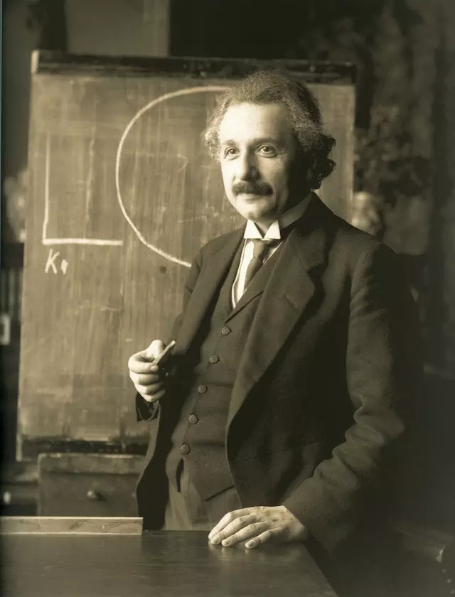
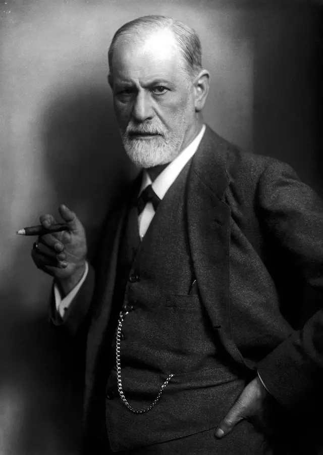

## 人类从此走向虚无主义，这要从一张日食照片证实“相对论”说起

保罗·约翰逊

5 月 26 日

> [地址](http://www.qdaily.com/articles/63960.html#)

世界上最著名的一次日全食出现在一百年前， 1919 年 5 月 29 日。

**爱因斯坦是个真正的科学家，在所有检验条件得到满足前，他拒绝承认自己的理论“相对论”是有效的。1919 年 5 月 29 日拍到的日全食是对“相对论”一次重要的检验，激起了全世界对****这种全新宇宙观****的兴趣。**

**保罗·约翰逊在《摩登时代》里指出了整件事的重大意义：**

**“爱因斯坦作为一个世界级的名人在 1919 年的出现，引人注目地说明了科学创新者对人类的双重影响。他们改变了我们对物质世界的认知，增强了我们对它的掌控。但他们也改变了我们的思想观念。第二个影响常常比第一个影响更激进。”**

**“1920 年代初，第一次在通俗层面上流传着这样一个信念：这个世界再也没有任何绝对的东西：时空，善恶，知识，尤其是价值。人们错误地，大概也是不可避免地把相对论跟相对主义混为一谈。”**

**本文经社会科学文献出版社•甲骨文授权，选自《摩登时代》**

现代世界始于 1919 年 5 月 29 日。那天，从西非的普林西比岛和巴西的索布拉尔拍到的日食照片证实了一种新的宇宙论是对的。在接下来的半个世纪里，有一点变得显而易见：建立在欧氏几何的直线和伽利略的绝对时间概念基础上的牛顿宇宙论必须做重大修改。牛顿宇宙论已经巍然屹立了 200 多年。它是一个宏大的架构，正是在这一架构之内，发生了欧洲的启蒙运动、工业革命，以及作为 19 世纪典型特征的人类知识、自由和繁荣的巨大扩张。可是，日益强大的望远镜揭示了一些异常现象。特别是，每隔一个世纪，水星的运行就会偏离根据牛顿物理学定律所预计的位置 43 角秒。这是为什么？

1905 年，当时在伯尔尼市瑞士专利局工作的 26 岁德国犹太人阿尔伯特·爱因斯坦发表了一篇论文，题为《论运动物体的电动力学》，文中提出的理论后来被称作“狭义相对论”。根据爱因斯坦的观察，在某些环境下，长度似乎缩短了，时钟似乎变慢了，这有点类似于绘画中的透视效果。事实上，就其对于我们对这个世界的感知所产生的影响而言，发现时间和空间是相对的而非绝对的度量条件，丝毫不亚于公元前 500~480 年希腊人最早把透视法用于绘画。

爱因斯坦的独创性堪称天才卓绝，其论证的路子奇特而优雅，被同行们比作一种艺术，这些在世界范围内唤起了人们日益强烈的兴趣。1907 年，他发表了一篇论文，证明一切物质皆有能量，并总结为一个公式：E=mc²，这个公式后来被视为核武竞赛的起跑点。就连第一次世界大战的爆发也没能阻止科学家们密切追踪爱因斯坦对包罗万象的广义相对论所做的探索，这一理论将涵盖引力场，并对牛顿物理学提出全面的修订。1915 年，爱因斯坦完成这一理论的消息传到了伦敦。次年春天，正当英国人准备对索姆河发起那场灾难性的大规模进攻的时候，爱因斯坦的那篇重要论文通过荷兰被偷带到了剑桥，天文学教授、皇家天文学会会长亚瑟·埃丁顿收到了这篇论文。

1918 年，埃丁顿在一篇提交给物理学会的论文中发表了爱因斯坦的成果，论文的题目叫作《万有引力与相对论原理》。但是，爱因斯坦方法论的本质在于：他坚持认为，他的公式必须得到实验性观察数据的验证，为此，他亲自设计了 3 项专门的检验条件。其中，关键的一项检验是：一束刚好掠过太阳表面的光线必定弯曲 1.745 角秒——两倍于古典牛顿理论所给出的引力弯曲。这个检验涉及拍摄日食，而下一次日食的时间要到 1919 年 5 月29日。在战争结束之前，皇家天文学家弗兰克·戴森爵士设法从早已山穷水尽的政府那里得到了一项承诺：政府答应拨出 1000 英镑，作为普林西比岛和索布拉尔观测探险的经费。

1919 年 3 月初，探险队启程前的那个晚上，天文学家们在格林尼治皇家天文台戴森爵士的书房里畅谈至深夜，这个天文台是雷恩爵士在 1675~1676 年设计的，当年，牛顿正在鼓捣他的万有引力理论。埃丁顿的助手 E.T.科廷汉将陪他同行，他问了一个十分要命的问题：如果这次日食拍摄的测量结果证明牛顿和爱因斯坦都错了，偏离量是爱因斯坦计算值的两倍，那将会发生什么？戴森说：“那样的话，埃丁顿就会疯掉，你就不得不独自一人打道回府了。”据埃丁顿的笔记说，5 月 29 日上午，普林西比岛雷电交加，暴雨倾盆。下午云开日出，刚好赶上 1 点 30 分的日食。埃丁顿只有 8 分钟时间操作他的拍摄器材。“我没工夫看日食，一直忙着换感光板……我们拍了 16 张照片。”之后，他以一夜两张的速度，用了 6 个晚上来冲印那些感光板。6 月 3 日，他用了一整天时间测量冲洗出来的照片，到晚上，埃丁顿转身对同事说：“科廷汉，你用不着一个人独自回家了。”爱因斯坦是对的。

> 1919 年 5 月 29 日，英国天体物理学家[亚瑟·埃丁顿](https://zh.wikipedia.org/wiki/亚瑟·爱丁顿)在普林西比岛拍摄的日全食。图片来自 [wikipedia](https://zh.wikipedia.org/wiki/File:1919_eclipse_positive.jpg)

这次远征满足了爱因斯坦的两项检验条件，而且，W.W.坎贝尔在 1922 年 9 月的日食期间再次予以了证实。正是爱因斯坦在科学上的一丝不苟，使得他拒绝承认自己的理论是有效的，除非第三项检验条件（“红移”）得到满足。1919 年 12 月 15 日，他写信给埃丁顿说：“如果事实证明，大自然中并不存在这一现象，那么，整个理论就不得不放弃。”事实上，“红移”现象在 1923 年被威尔逊山天文台所证实，而且，打这以后，相对论的实验证据稳步积累。其中，一个最引人注目的实例是 1979~1980 年发现的类星体的引力透镜效应。而在当时，爱因斯坦在专业上的英雄气概就得到了人们的赞赏。在年轻的哲学家卡尔·波普尔和他在维也纳大学的朋友们看来，“对我们来说，那是一次伟大的经历，对我的智力发展拥有持久的影响。”他后来写道：“给我留下最深印象的，是爱因斯坦自己明白无误地声称，如果自己的理论经不住某些检验，他会认为这一理论根本站不住脚……这样一种姿态，截然不同于马克思、弗洛伊德和阿德勒的教条主义，至于这些人的追随者，那就更不用说了。爱因斯坦一直在寻找关键性的实验，这些实验即使符合他的预言，也决不意味着他的理论就站得住脚；正如他最早强调的那样，只要有一次不符合，就足以证明他的理论是站不住脚的。我觉得，这才是真正的科学态度。”

爱因斯坦的理论，以及埃丁顿为验证这一理论而进行的那次大肆宣扬的远征，在1919 年激起了全世界的巨大兴趣。无论是此前，还是之后，都不曾有哪一次科学验证占据这么多的头版头条，成为一个广为谈论的话题。从 6 月开始，一直到 9 月在伦敦皇家协会的一次人头攒动的会议上正式宣布这一理论得到证实，其间，人们的紧张情绪稳步增长。在 A.N.怀特海（他当时在场）看来，那就像一出希腊戏剧：

我们就像合唱队一样，纷纷对一次至关重要的事件发展过程中所揭示出来的命运裁决发表评论。整场演出充满了戏剧色彩——传统的仪式，以及背景上悬挂的牛顿画像，无不提醒我们：眼下，在两百多年之后，历史上最伟大的科学归纳将接受它的第一次修正……思想领域的一场伟大冒险终于功德圆满。

打那以后，爱因斯坦便成了一个全球英雄，全世界每一所著名大学都邀请他去讲学，他走到哪儿都被人群所包围，他那怅然若失的面容被成千上万的人所熟悉，那是心不在焉的自然哲学家的典型模样。他的理论所带来的冲击是直接的，而且越来越不可估量。不过，这正好说明了波普尔后来提出的所谓“非预期后果律”。有无以数计的著作，试图清楚明白地解释广义相对论如何修改了牛顿的观念，以及它如何发挥作用，对普通的凡夫俗子来说，牛顿的那些观念构成了他们对周围世界的理解。爱因斯坦本人这样总结它：“就其最宽泛的意义而言，‘相对论’可以用这样一句话来概括：一切物理现象都具有这样一个特征，它没有给‘绝对运动’概念的引入提供任何基础，或者换一个更简短但并不那么准确的说法，就是：不存在绝对运动。”许多年后，巴克敏斯特·富勒给日本艺术家野口勇发去了一封著名电报，用 249 个单词解释了爱因斯坦的关键公式，堪称简洁凝练的杰作。

不过，对大多数人来说，大量使用直线和直角的牛顿物理学十分容易理解，可如今，相对论充其量不过是一个模模糊糊的不安之源。按照人们的理解，绝对时间和绝对长度已经被废黜了；运动是曲线的。突然之间，天体运动当中似乎没有什么东西是确定的。正如哈姆雷特所悲叹的那样：“这个世界脱节了。”这就仿佛不停旋转的地球脱了轴，在一个不再符合惯常度量标准的宇宙中漫无目标地漂泊。1920 年代初，第一次在通俗层面上流传着这样一个信念：这个世界再也没有任何绝对的东西：时空，善恶，知识，尤其是价值。人们错误地，大概也是不可避免地把相对论跟相对主义混为一谈。

对于公众的误解，最痛苦的莫过于爱因斯坦本人。不停地宣扬和误解让他困惑不已，而这些似乎都是他的工作所促成的。1920 年 9 月 9 日，他写信给他的同事马克斯·玻恩说：“就像童话故事里那个碰到什么都变成黄金的人，我现在也是这样，跟我有关的一切都成了报纸上小题大做的话题。”爱因斯坦不是一个遵循教规的犹太人，但他承认有一个上帝。他热情地相信对与错的绝对标准。他的专业生活奉献给了不懈的寻求，不仅寻求真理，而且寻求确信。他坚持认为，这个世界可以分为主观领域和客观领域，客观部分必定能够给予精确的陈述。在科学意义（而非哲学意义）上，他是一个决定论者。在 1920 年代，他发现，量子力学的测不准原理不仅让人无法接受，而且令人厌恶。终其余生，直至 1955 年去世，他都一直尝试着把物理学固定在统一场论中，试图借此驳倒量子力学的理论。他写信给玻恩说：“你相信有一个掷骰子的上帝，而我相信，在一个客观存在的世界上，在一个我试图以胡思乱想的方式去加以掌控的世界上，有完美的规则和秩序。我坚定地相信这一点，但我也希望，有人能够发现一条比我凭运气找到的方法更加实际的途径，或者更准确地说，是一个更加坚实的基础。”但爱因斯坦没能研究出统一场论，不管是在 1920 年代，还是之后。他在有生之年目睹了道德相对主义（这在他看来是一种疾病）成为社会流行病，正如他在有生之年眼睁睁地看着他那个要命的公式导致了核战争的出现。在生命的最后时刻，他说，有时候他真希望自己是个头脑简单的钟表匠。

1921 年演讲中的爱因斯坦，图片来自[ wikipedia](https://upload.wikimedia.org/wikipedia/commons/3/3e/Einstein_1921_by_F_Schmutzer_-_restoration.jpg)

爱因斯坦作为一个世界级名人在 1919 年的出现，引人注目地说明了科学创新者对人类的双重影响。他们改变了我们对物质世界的认知，增强了我们对它的掌控。但他们也改变了我们的思想观念。第二个影响常常比第一个影响更激进。科学天才对人类的影响，善也好，恶也罢，远远超过任何政治家或军阀。伽利略的实证主义创造了 17 世纪的自然哲学躁动，而后者正是科学革命和工业革命的先声。牛顿的物理学构成了 18 世纪启蒙运动的框架，也促成了现代民族主义和革命政治的产生。达尔文“适者生存”的观念，无论对于马克思主义的阶级斗争观念，还是对于造就了希特勒主义的种族主义哲学，都是一个关键性的因素。事实上，达尔文观念的政治和社会后果至今依然在塑造着我们自己，正如我们将在本书中看到的那样。公众对相对论的反应也是如此，它是 20 世纪历史进程的主要影响力之一。它是一把刀子，被它的创造者漫不经心地挥舞着，帮助割断了社会的缆索，使之漂离了传统的停泊地：犹太－基督教文化的信仰与道德。

相对论所带来的冲击，与公众对弗洛伊德学说的接受几乎同时，这使得它的冲击格外有力。到埃丁顿证实爱因斯坦相对论的那个时期，西格蒙德·弗洛伊德已经 50 多岁。他真正原创性的工作大部分是在世纪之交完成的。《梦的解析》（The Interpretation of Dreams）早在 1900 年就出版了。在医学和精神病学的专业圈子里，他是一个颇有争议的名人，在第一次世界大战之前，他就已经建立了自己的学派，并与他最重要的弟子卡尔·荣格发生了一场轰动一时的学术争论。但直到战争结束，他的观念才开始作为通用货币流通开来。

弗洛伊德学说流传开来的原因在于，旷日持久的堑壕战使得人们的注意力集中在那些由于压力所导致的精神紊乱的病例上：人们通俗地称之为“弹震症”（shell-shock）。一些出身军事世家的名门子弟志愿当兵服役，作战英勇，屡建功勋，突然间精神崩溃了。他们不可能是胆小鬼，也不是疯子。在治疗精神疾病上，除了像吃药、恐吓或电击疗法这些“英勇”的方法之外，弗洛伊德早就以精神分析的方法，提供了另外一种选择。前面说的那些治疗方法一直被大量使用，随着战争艰难地持续，所谓“治愈”变得越来越短命，剂量也就越来越大。当电流增加的时候，病人要么被治死了，要么宁愿自杀，也不愿像宗教裁判所的受害者那样勇敢面对。战后，亲属对病人在军事医院，尤其是维也纳总医院的精神病科所遭受的残酷折磨怒不可遏，从而导致奥地利政府在 1920 年成立了一个调查委员会，委员会请来了弗洛伊德。由此所导致的论战，尽管不了了之，却让弗洛伊德获得了他所需要的世界性名声。从专业上讲，1920 年对他来说是突破之年，那一年，他的第一家精神病诊所在柏林开张，他的弟子和后来的传记作者欧内斯特·琼斯创办了《国际精神分析杂志》（International Journal of Psycho-Analysis）。

但更加引人注目，从长远来看也更加重要的是：突然之间，弗洛伊德的著作和观念被知识分子和艺术家所发现。正如哈夫洛克·埃利斯当时所说的那样，弗洛伊德不是个科学家，而是个伟大的艺术家；这话让大师颇感愤怒。经过 80 年的实践检验，总的来说，他的治疗方法被证明是代价高昂的失败，只适合哄哄那些闷闷不乐的家伙，而不是治疗有病的人。如今我们知道，精神分析的核心观念在生理学上毫无根据。事实上，在弗洛伊德阐述这些方法的时候，人们还没有发现孟德尔定律和染色体遗传理论，还没有认识到先天性代谢缺陷，也不存在激素和神经刺激机制，这些东西联合起来证明他的治疗方法是无效的。正如彼得·梅达沃爵士所指出的那样，精神分析有点类似于催眠术和颅相学：它包含彼此孤立的真理碎片，但整个理论是错的。此外，正如年轻的卡尔·波普尔当时非常正确地指出的那样，弗洛伊德对待科学验证的态度完全不同于爱因斯坦，而更像马克思。他在阐述自己的理论时，不是使用经得起实验检验和反驳的具体内容，而是使之包罗万象，很难检验。而且，就像马克思的追随者一样，每当看上去能够驳倒其理论的证据出现，他就修改自己的理论，以迎合这些证据。因此，弗洛伊德的信念主体需要连续不断地扩张和渗透，就像一套处在形成时期的宗教体系。不难预料，像荣格那样的内部批评者总是被当作异议者来对待；而像哈夫洛克·埃利斯那样的外部批评者则被视为异教徒。弗洛伊德身上透露出了 20 世纪最糟糕的意识形态救世主的迹象——他有这样一种持续不断的趋势：把那些与自己有分歧的人视为精神上不稳定，需要治疗。埃利斯对其科学地位的贬低被斥为“一种高度升华的抵抗”。就在他和荣格关系破裂之前，弗洛伊德写信给荣格说：“我的倾向是，对待那些表现出抵抗的同行，完全就像对待那些处在相同情境中的病人。” 20 年后，把异议者视为一种必须强制住院治疗的精神疾病在苏联十分盛行，成为政治迫害的一种形式。

不过话说回来，就算弗洛伊德作品中真正的科学内容并不多，但它具有相当高的文学品质，并且富有想象力。他的德语文风极具魅力，为他赢得了这个国家最高的文学奖：法兰克福歌德奖。他的作品很适合翻译。把现有的弗洛伊德著作翻译成英文在 1920 年代成为一种产业。但是，由于弗洛伊德让自己的观念涵盖了一个不断拓宽的人类活动和人类经验的领域，新的文学作品也就不断涌现出来。弗洛伊德是个诺斯替教徒。他相信存在一个隐秘的知识结构，通过使用他所设计的一些技法，可以透过事物的表象洞察这一知识结构。梦是他的出发点。他写道，“梦与神经症状的构成并无不同。像后者一样，梦似乎稀奇古怪，毫无意义，但是，当我们借助一种技巧（这种技巧稍稍不同于精神分析中所使用的自由联想法）来仔细审视它的时候，就能从它的显在内容中得到它的隐含意义，或者说是它的潜在思想”。

诺斯替教总是吸引知识分子。弗洛伊德提供了它的一个特别新鲜有趣的例子。在一个所有受过教育的人都为自己的希腊文和拉丁文知识洋洋得意的时代，弗洛伊德对于古典的典故和意象有一种非凡的天才。他迅速领悟到了像詹姆斯·弗雷泽那样的新一代社会人类学家加诸古典神话之上的重要性，后者的《金枝》（The Golden Bough）一书在 1890 年开始面世。梦的意义，神话的作用——在这杯烈性酒中，弗洛伊德搅和进了无所不在的性的迷幻剂，这是他在几乎所有人类行为的根源中找到的。战争打开了关于性的话匣子；战后的那段时期，人们已经习惯了关于性的讨论登上媒体的大雅之堂。弗洛伊德的时代到了。除了文学天赋之外，他还有一些煽情记者的技巧。他能杜撰一些引人注目的口号。像比他更年轻一些的同时代人拉迪亚德·吉卜林一样，弗洛伊德也经常给现代语言增添一些词语和短语：“潜意识”，“幼儿性欲”，“俄狄浦斯情结”，“自卑情结”，“负罪情结”， “ 自我、本我和超我 ” ，“升华”，“深层心理学”，等等。他的某些重要观念，比如对梦进行性方面的解释，或者后来人们所说的“弗洛伊德失语”，有新鲜智力游戏的吸引力。弗洛伊德深知时事话题的价值。1920 年，在欧洲的自杀风潮余波未平的时候，他出版了《超越快乐原则》（Beyond the Pleasure Principle）一书，提出了“死亡本能”的概念，很快就被人们通俗化为“死亡愿望”。1920 年代见证了宗教信仰的进一步急剧衰退，尤其是在受过教育的人当中，这一时期，弗洛伊德有很多时间在致力于剖析宗教，他把宗教看作是纯粹的人类构想。在《幻想的未来》（The Future of an Illusion，1927）一书中，他论述了人类试图缓解愁苦的下意识努力。他写道：“有相当数量的普通人，试图通过妄想改造现实，来保护自己免遭痛苦。人类的宗教必须归类为这种大规模的群体错觉。不用说，任何一个拥有错觉的人从来都认识不到这一点。”

这似乎是新时代的声音。并非第一次，一个 50 多岁的先知，长期在荒漠中备受冷落，突然间在镀金的年轻一代中找到了痴迷的听众。关于弗洛伊德学说，格外引人注目的是它的变化多端，以及它的无处不在。对于每一件事情，它似乎都有一种新的、激动人心的解释。而且，弗洛伊德有一种特别的技巧，这就是简明扼要地总结范围广泛的学院学科中突然出现的新趋势，凭借这一技巧，他似乎以非凡的派头和专横的信心，把一些已经在精英阶层的头脑中酝酿的观念呈现出来。1920 年代初，很多知识分子发现，多年来，他们一直就是弗洛伊德的信徒，却并不知道这一点。这种吸引力在小说家当中尤其强大，范围从年轻的奥尔德斯·赫胥黎（他那部令人眼花缭乱的《克罗姆·耶娄》［Crome Yellow］出版于 1921 年），一直到忧郁而保守的托马斯·曼，对他来说，弗洛伊德就是一个“传神谕者”。

> 西格蒙德·弗洛伊德，1921年。图片来自 [Wikipedia](https://upload.wikimedia.org/wikipedia/commons/1/12/Sigmund_Freud_LIFE.jpg)

爱因斯坦和弗洛伊德对知识分子和艺术家的影响更大，即将到来的和平使他们意识到，一场根本性的变革一直在而且至今依然在整个文化界发生着，相对论的观念和弗洛伊德学说既是这场变革的先兆，也是它的回声。这场变革在战前就有很深的根源。它早在 1905 年就已经开始了，当时，一场公开演说为它吹响了号角，俄罗斯芭蕾舞团的演出经理谢尔盖·佳吉列夫再恰当不过地发表了这篇演说：

我们是历史上最伟大的总结性时刻的见证者，以一种新的未知文化的名义，这一文化将由我们来创造，也必将把我们席卷而去。正因为如此，我才毫不犹疑地向着美丽宫殿的残壁颓垣，也向着一种新美学的新戒律，举起我手中的酒杯。作为一个不可救药的享乐主义者，我能表达的唯一希望是，即将到来的这场战斗不要损害了生活中的赏心乐事，死亡就像复活一样美丽，一样明亮。

正如佳吉列夫所言，野兽派的第一次展览将在巴黎举行。1913 年，佳吉列夫把斯特拉文斯基的《春之祭》（Sacre du Printemps）搬上了舞台；到那时，勋伯格已经发表了他的无调性《三首钢琴曲》，奥尔本·贝尔格发表了他的《弦乐四重奏》（作品 3 号）；马蒂斯发明了“立体派”这个术语。也正是在 1909 年，未来派发表了他们的宣言，库尔特·希勒在柏林创办了他的“新俱乐部”，它是一场艺术运动的策源地，这场运动将在 1911 年首次被称作“表现主义”。1920 年代的几乎所有重要艺术人物都已经在 1914 年以前发表、展览或演出过自己的作品，在这个意义上，现代主义运动可以说是一个战前现象。但是，需要一场巨大斗争所带来的剧烈动荡，需要它所促成的政治体制的分崩离析，只有这样才能给现代主义带来它迄今为止所缺乏的激进的政治维度，并让它感知到一个已经土崩瓦解的世界，而它正是在这个旧世界的废墟上构建一个新的世界。因此，佳吉列夫在 1905 年奏响的那挽歌般的（甚至是不安的）音符引人注目地反映出敏锐的洞察力。这场变革的文化和政治两个方面密不可分，正如 1790~1830 年的革命和浪漫主义运动不可分割一样。我们注意到，1916 年，詹姆斯·乔伊斯、特里斯坦·查拉和列宁全都作为流亡者客居苏黎世，在等待他们的时机。

随着第一次世界大战的结束，现代主义在宣传的炫目强光中登上了一个似乎空荡荡的舞台。1918 年 11 月 9 日晚上，表现主义知识分子的一次会议在柏林的国会大厦召开，会议要求剧院国有化，政府补贴艺术行业，解散所有专业学会。超现实主义大概打算给予弗洛伊德的观念以视觉表达——尽管它的起源完全是独立的——它有自己的行动计划，正如未来主义和达达主义一样。但这只是表面的泡沫。更深层地看，正是相对论所导致的空间和时间的迷惑，正是弗洛伊德的性理论，在新的创造模式中被认为是典型特征。1919 年 6 月 23 日，马塞尔·普鲁斯特出版了《在少女们身旁》（à L’Ombre des jeunes filles），这是一次巨大实验的开始，其实验的领域是破碎的时间和隐秘的性情绪，而这些正是人们新的关注焦点的缩影。6 个月之后，12 月 10 日，普鲁斯特被授予龚古尔奖，法国文学的重心做出了一次决定性的转移，远离了幸存的 19 世纪大师。当然，迄今为止，这样的作品还只是在一些有影响力的少数人当中流传。普鲁斯特不得不自掏腰包印行这部作品的第一卷，并以生产成本的三分之一销售它们（甚至迟至 1956 年，全套《追忆似水年华》［A la recherche du temps perdu］每年的销售量也不足 10000 套）。詹姆斯·乔伊斯也在巴黎，他根本不可能在英伦诸岛发表作品。他的《尤利西斯》（Ulysses）完成于 1922 年，不得不由一家私营印刷所印行，然后偷运过边境。但它的意义并没有被人忽略。没有一部长篇小说比这部小说更清楚地说明了弗洛伊德的观念在何种程度上进入了文学的语言。也是在 1922 年，诗人 T.S.艾略特（他本人最近被认为是时代的先知）写道：它“摧毁了整个 19 世纪”。普鲁斯特和乔伊斯，这两位伟大的先驱和重心转移者，在他们无意间共享的宇宙观中都没有对方的位置。1922 年 5 月 18 日，他们在巴黎会面了，那是斯特拉文斯基的《狐狸》首演结束之后为佳吉列夫和全体演员举办的派对，作曲家和他的舞台设计师巴勃罗·毕加索也出席了这场派对。普鲁斯特此前已经冒犯过了斯特拉文斯基，他很不明智地让乔伊斯顺道搭乘他的出租车回家。这个醉醺醺的爱尔兰人告诉普鲁斯特，自己一个字都没读过他的作品，被激怒的普鲁斯特则回敬道，自己在驱车前往里兹饭店（他在那儿的夜晚随时都有约会）之前也从未读过乔伊斯的作品。6 个月之后，普鲁斯特去世，但在这之前，著名数学家卡米尔·韦塔德已经在一篇文章中把他奉为爱因斯坦的文学诠释者。乔伊斯在他的《芬尼根守灵夜》（Finnegans Wake）中用一句双关语“Prost bitte”把他给打发了。

有人认为，像普鲁斯特和乔伊斯这样一些作家（当然还包括爱因斯坦和弗洛伊德的观念）“摧毁”了 19 世纪，这个观点并不像看上去的那么异想天开。19 世纪见证了个人责任哲学——我们每个人都分别对自己的行为负有责任的观念——的高潮，那是犹太－基督教和古典世界的共同遗产。正如莱昂内尔·特里林在分析艾略特对《尤利西斯》的裁定时所指出的那样，在19世纪，像沃尔特·佩特（在《文艺复兴》［The Renaissance］一书中）这样重要的美学家完全可以把“以一束猛烈的、像宝石一样的火焰燃烧”的能力归类为“生活中的成功”。“在 19 世纪，”特里林写道，即使“像佩特那样优雅而超然的人，也可以理所当然地根据个人的生活做出成功或失败的判断。”19 世纪的长篇小说本质上都涉及个体在道德上或精神上的成功。《追忆似水年华》和《尤利西斯》不仅标志着反英雄的闪亮登场，而且标志着个人英雄主义作为想象性创造的核心元素的毁灭，以及不屑一顾地摒弃了对道德平衡和道德裁决的关切。个人自由的行使将不再是人类行为中极其有趣的特征。

这与塑造时代的新兴力量完全符合。马克思主义如今第一次小心翼翼地登上了权力的宝座，是诺斯替教的另一种形式，它声称自己能够透过事物的表象，从经验上洞察其背后隐藏的真理。马克思有一席话，引人注目地预示了我刚刚引用过的弗洛伊德的那段话，他说：“表面上看到的经济关系的最终模式……与其内在的然而却是隐藏着的根本模式有很大的不同，实际上完全相反。”表面上，人们似乎在行使他们的自由意志，做出判断，决定事件。但实际上，在那些熟悉辩证唯物主义方法的人看来，这样的个体，不管多么强大，都不过是一些漂浮物，被经济力量那无法抗拒的汹涌大潮冲来冲去。个体的表面行为只不过隐藏了他们几乎完全不知道的却又无力反抗的阶级模式。

同样，在弗洛伊德的分析中，个人良心（这是犹太－基督教伦理的核心，也是个人主义实现成功的主要发动机）被视为一种纯粹的安全装置，被集体创造出来，以保护文明秩序免遭人类存在的可怕攻击。弗洛伊德主义包括很多东西，但是，如果说它有一个本质的话，那就是对罪的描述。1920 年，弗洛伊德写道：“严酷无情的超我与服从于超我的自我之间存在着一种紧张的关系，我们把这一紧张称为‘负罪感’（the sense of guilt），文明已经通过弱化并消除这种负罪感，通过在其内部建立一个代理机构来监视它（就像在一座被征服的城市里派出一支驻军那样），从而控制了人们渴望攻击别人这样一种危险的欲望。”负罪感因此不是缺德的标志，而是美德的标志。超我或良心是个体为了保全文明而支付的昂贵代价，它在痛苦中投入的成本将会随着文明的进步而不可阻挡地增加：“先兆性的外在不幸……被转换为永久性的内在不幸，被转换为负罪感所带来的紧张。”弗洛伊德说，他旨在向人们展示：任何人性弱点都无法解释的负罪感是“文明发展中最重要的问题”。正如社会学家已经暗示的那样，就创造出那些使得犯罪和恶行变得不可避免的条件而言，社会很可能是共同犯罪的。但是，个人的负罪感是一种应当驱除的错觉。我们当中没有一个人是个别犯罪；我们全都有罪。

马克思、弗洛伊德和爱因斯坦全都把同样的信息传递给了 1920 年代：这个世界并不是它看上去的那个样子。意识的经验主义感知塑造了我们的很多观念：时间与距离，对与错，法律与正义，以及社会中人的行为的特性。但意识并不值得信赖。此外，马克思和弗洛伊德的分析，以它们各自不同的方式，联合起来侵蚀了高度发展的个人责任感以及一套既定的、客观上真实有效的道德法则的基础，而这些正是 19 世纪文明的核心。人们从爱因斯坦那里得到了这样一个印象：在这个宇宙中，一切价值衡量都是相对的，这个印象有助于证实他们对道德混乱的想象——这一想象既让人惊愕，又令人兴奋。

正如 W.B.叶芝所写的那样，“这个世界上所释放出来的”难道不是“纯粹的混乱”吗？在很多人看来，第一次世界大战似乎是罗马衰亡以来最大的灾难。德国出于恐惧和野心，而奥地利则出于顺从和绝望，都是以一种其他交战国不曾有过的方式想要这场战争。它标志着德国哲学中悲观主义浪潮的顶峰，这是战前时期它最显著的特征。德国的悲观主义与美国、英国、法国甚至还有俄国在 1914 年之前的那十年建立在政治变革基础上的乐观主义形成了鲜明对比，它不是知识界的财产，而是在德国社会的每一个阶层（尤其是顶级阶层）中都可以找到。在这场大决战爆发之前，贝特曼·霍尔维格的秘书和亲信库尔特·里茨勒就发出了有点阴郁的音符，他的主人正是以这样一种态度把德国和欧洲领入了深渊，里茨勒说：“总理预料，战争——不管它的结果如何——必将导致现存一切的连根拔除。现存的这个世界已经非常过时，没有理念。”7 月 27 日，他写道：“在劫难逃的厄运比高悬于欧洲和我们这个民族头上的人的权力更大。”贝特曼·霍尔维格和弗洛伊德出生于同一年，他仿佛就是“死亡本能”的化身，而后者正是在那个恐怖的十年结束时杜撰出了这个词。像大多数受过教育的德国人一样，霍尔维格也读过 1895 年出版的马克斯·诺尔道的《退化》（Degeneration），并熟悉意大利犯罪学家切萨雷·龙勃罗梭的退化理论。不管有没有战争，人类都在不可避免地退化；文明正在朝着毁灭迈进。这样的观念在中欧早已是陈词滥调，为人们认可奥斯瓦尔德·斯宾格勒的《西方的衰落》（Decline of the West）铺平了道路，而这本书碰巧出版于 1918 年，当时，那场预言中的自杀已经实现。

再往西边，在英国，约瑟夫·康拉德（他本人是个东欧人）是反映这种悲观主义的唯一一位重要作家，他围绕这一主题创作了一系列引人注目的长篇小说：《诺斯托罗莫》（Nostromo，1904），《密探》（The Secret Agent，1907），《在西方眼睛下》（Under Western Eyes，1911），《胜利》（Victory，1915）。这些绝望的政治布道词，披着小说的外衣，宣扬了一个预言，托马斯·曼将在 1924 年以他的《魔山》（The Magic Mountain）一书向中欧宣布这一预言，正如他两年后在《密探》德译本的序言中所承认的那样。在康拉德看来，这场战争只不过证实了人类困境的不可救药。从 60 年后的视角去看，一定有人说：康拉德是那个时代唯一其远见在每个细节上都依然清晰而真实的重要作家。他把马克思主义斥为恶毒的胡说八道，肯定会产生令人恐怖的暴政；而弗洛伊德的观念不过是一种“魔法秀”。这场战争证明了人的弱点，但在另外的方面，它不会解决任何问题，也不会产生任何东西。庞大的改革计划，包治百病的万灵药，一切“解决办法”，都是虚幻的。1922 年 10 月 23 日，康拉德写信给伯特兰·罗素（罗素不久前在他新近出版的一本书《中国问题》［The Problem of China］中提出了一些解决办法），他在信中坚持认为：“在任何人的书里或谈话中我都找不到任何东西足以对抗我根深蒂固的感觉：人类居住的这个世界在劫难逃……对中国人来说，对我们其余的人来说，唯一的疗救之道是内心的改变。但看看过去 2000 年的历史，没有太多的理由指望这种事情，就算人已经开始飞……他也不可能像鹰那样飞，他只能像虫子那样飞。”

在战争开始的时候，康拉德的怀疑论在盎格鲁－撒克逊的世界十分少见。有人把战争本身看作进步的一种形式。H.G.威尔斯在一本名为《终结战争的战争》（The War That Will End War）的书中宣布了这一观点。但是，到了停战的时候，维多利亚时代的人所理解的那种意义上的进步，就像某种连续不断的、几乎是不可阻挡的事物一样，也彻底消亡了。1920 年，伟大的古典学者 J.B.伯里在《进步的观念》（The Idea of Progress）一书中，宣布了它的死亡。“一种新的观念将会篡夺人类指导观念的位置……进步本身难道没有暗示这样一个观点吗：作为一种学说，它的价值仅仅是相对的，只不过是相对于某个不是很先进的文明阶段而言。” 

> 题图、长题图来自 unsplash

- [长文章](http://www.qdaily.com/tags/1068.html)
- [相对论](http://www.qdaily.com/tags/19407.html)
- [日全食](http://www.qdaily.com/tags/8081.html)
- [1919](http://www.qdaily.com/tags/53588.html)
- [一战](http://www.qdaily.com/tags/1665.html)
- [爱因斯坦](http://www.qdaily.com/tags/9786.html)