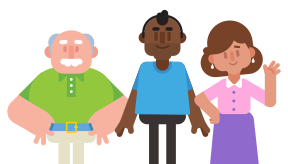

[TOC]

## 基础 1

### **学英文**

**Hello**

 

你知道吗？世界上以英语为外语的人比为母语的人多，其中一个就是你！欢迎来到多邻国，我们保证你学得轻松又正宗！

### **拼法**

同一个英文字母可能会有不同的发音；同一个发音也会有不同的拼法。看看下面的例子：

t**w**o 二

**Two** 里的 w 不发音。

**ph**one 电话

在英文里，**ph** 的发音跟 **f** （如 **佛**）一样。  我们当然明白，一开始学英语的时候会有点困难。别担心，我们相信你一定能学会！在这个阶段，大家千万别执着每个字母的发音。学习新单词发音时，**先把学习重点放在整个单词的发音上**。

## 基础 2

### **拥有**

在中文中，我们可以在**我**或者**你**的后面加上**的**，来表示**某东西属于某人**。在英语里却有独特的单词来表示这样的概念！

| **my** **car**    | **我的**车 |
| ----------------- | ---------- |
| **your** **book** | **你的**书 |
| **his** **cat**   | **他的**猫 |
| **her** **dog**   | **她的**狗 |

### **你喜欢什么？**

在英语里，我喜欢… 就是 **I like**...!

 

I like **my cat**
我喜欢我的猫。

