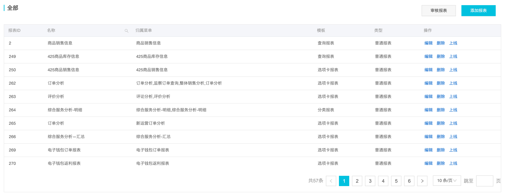

# 06.项目梳理-配置报表-1

[toc]

整个项目主要就是以配置报表为主，为了能够减少手动定制开发页面，提高生产效率，通过选择、填写不同的配置项来生成一个带有搜索控件和表格的报表页面。

## 初始页面

### 视图



- 这是配置页面的主页视图，很简单，右上角有两个按钮用于打开两个模态框从而进一步进行操作。
- 剩下的部分是显示已配置报表的表格信息，可以通过「操作」列所提供的编辑、删除、上线按钮进一步对每张报表进行操作。
- 这些页面中的按钮，「添加报表」和「编辑」按钮可以进入配置报表的页面。

### 代码

页面组件是位于 `./src/views/system/ReportManage`  的 `<ReportManage />` 组件中的 `<ReportList />`。

`<ReportManage/>` 的 `render` 部分渲染了如下内容：

```tsx
render() {
  return (
    <Fragment>
      {showModifyReport
        ? <ReportType                      /*报表配置界面*/
            />
        : <ReportList											/*报表配置列表界面*/
            /* ... */
            />}
      {/*选择报表模板*/}
      <ChoseTemplateModal
        /* ... */  
        />
    </Fragment>
  );
}
```

- 共渲染了三个组件：
  - `<ReportType />` —— 根据报表配置中的类型渲染报表配置界面的组件
  - `<ReportList />` —— 「报表管理」路径下的初始页面，任务如下：
    - 显示报表列表 —— 提供编辑、删除、上线报表等功能的按钮
    - 提供跳转到报表配置页面的入口 —— 「编辑」和「添加报表」
  - `<ChoseTemplateModal />` —— 通过点击「添加报表」打开的 modal，用于选择需添加报表的类型，根据不同的报表类型会显示不同的配置界面，而不同的界面也是不同的组件，但其中有部分是相同的，所以抽为单独组件共用。


