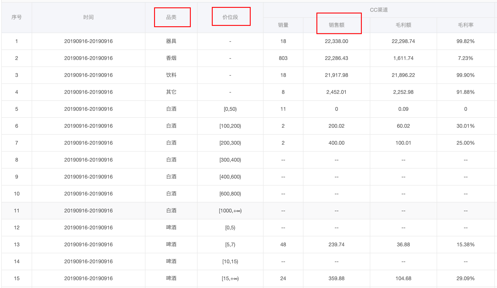

[TOC]

## 特殊排序

### 价位段特殊排序

这个是稍微比较复杂一点的功能的，先看图：



如图，我需要先将品类进行排序，也就是将相同品类的放在一起，然后再将每一种品类的销售额合计，然后再根据这个合计的销售额进行排序，之后再在每一个品类中根据「价位段」由低到高排序。

代码：

```tsx
export function priceSpecificSort(dataSource: any[], column: string) {
  let classObj: any = {}
  let classArr: any[] = []
  let res: any[] = []
  // 将表格数据中的条目以对象的方式分类存储，key 为 '品类' 的值
  dataSource.forEach(entry => {
    let classTemp = entry['品类'];
    let tempObj = classObj[entry['品类']]
    classObj[entry['品类']] = {
      sales: tempObj ? tempObj.sales + (entry[column] || 0) : (entry[column] || 0),
      entries: tempObj ? tempObj.entries.concat(entry) : [entry]
    }
  })
  // 遍历品类对象并用销量进行排序
  classArr = Object.values(classObj)
  classArr = _.orderBy(classArr, 'sales', 'desc')
  // 将对象数组 classArr 中的每一对象的 entries 以「价位段」进行排序
  classArr = classArr.map(obj => {
    return _.sortBy(obj.entries, function (o) {
      let PriceSegment = o['价位段']
      PriceSegment = PriceSegment ? PriceSegment : '0'
      return Number(PriceSegment.slice(1, PriceSegment.indexOf(',')))
    })
  })
  // 将 classArr 中的数组项展开，并返回给 res
  res = _.flatten(classArr)
  return res
}
```

- 在 7 到 13 行中，我利用对象的 `key` 来将类别进行了分类，并且每一个 key 所对应的对象中用 `sales` 来进行合计。
- 15 到 16 行，先将对象对象转换为对象数组，接着用 `sales` 对这个对象数组进行排序。
- 18 到 24 行，遍历每一个对象中的 `entries` 数组，对「价位段」进行排序，这里需要注意是要取到价位段的低区间值（22 行），还有需要注意返回的直接是数组了。
- 最后，将这个数组数组展开就可以了。

整个过程中，需要注意要有对数据做边界检测，比如地 10 行中 `(entry[column] || 0)` ，因为有可能 `entry[column]` 没有这个值，还有一处是第 21 行，`PriceSegment ? PriceSegment : '0'` ，因为 `PriceSegment` 也有可能不存在，但这里也有一个需要主要的点，就是如果不存在则返回 `'0'` ，因为接下来要调用字符串的方法，如果返回数字则会报错。

### 销售额特殊排序

其实这个就是对单一列进行排序，很简单，代码：

```tsx
/**
 * 销售额特殊排序
 * @param dataSource 列表数据
 * @param column 特殊传值
 */
export function saleSpecificSort(dataSource: any[], column: string) {
  return _.orderBy(dataSource, function (o) {
    let value;
    if (!_.isNumber(o['CC渠道,销售额'])) {
      value = -1
    } else {
      value = o['CC渠道,销售额']
    }
    return value
  }, 'desc')
}
```

- 利用了 `lodash` 的 `orderBy` 方法，能够很方便的对所传入的集合（数组 | 对象）进行排序，第二个参数可以传入很多种不同的参数，比如这个传入函数，就会以这个函数的返回值进行排序，第三个参数是排序方式，升序（desc）和降序（asc）。
- 需要注意的是，里面有数据可能是非数字（比如 `--` 这样的字符串），所以需要将其转换为 `-1` 返回，这样就可以使其排在 0 之后（在升序的方式下）

