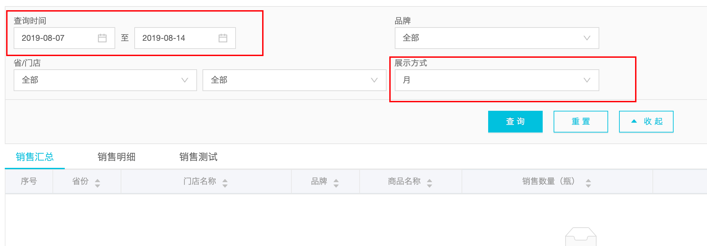
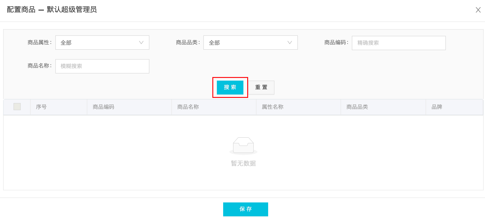

# 数智魔方开发中遇到的问题
[TOC]

## get 接口地址中不能存在 %
```jsx
http.get(`/platform-setting/points-deduction/list?value=10%`);
```
* 在接口地址的最后，传入 params value 值为 10%，但 % 在地址中有特殊含义不能用于传值，所以会访问到其他接口地址中，从而报错。
	

## 在配置字段时一定要给后端说明数据类型
```jsx
{
	description: {
		isDescription: false
	}
}
```
* 这是发送给后端的更改数据，但由于当时没有沟通清楚，后端以为 `description` 对象下的字段都为字符串类型，所以当我传布尔类型给后端，后端会转换为字符串保存，这样，当我请求这个数据时会收到字符串而不是布尔型。

## 还是别用 index 作为删除的 key 来传递
之前就在学习的过程中知道这个问题，但这次还是遇到了，先看代码：
```jsx
imageSettingList.map((setItem: any, index: number) => (
	//...
	{imageSettingList.length > 1 ? (
          <Icon
            className="dynamic-delete-button"
            type="minus-circle-o"
            onClick={() => { store.handleRemoveColumItem(index) }}
          />
        ) : null}
)

handleRemoveColumItem(index) {
  this.imageSettingList = this.imageSettingList.filter((item, i) => i !== index)
}
```
* 删除项的方法所传入的是数组的 `index`，现在假设有一个 `index` 数组为 [0,1,2,3]，当我们删除 `index` 为 2 的那项时, 数组剩余的 `index` 并非 [0,1,3] 而是 [0,1,2] 因为 `index` 是以数组中有多少项，从 0 开始的，所以，这里无论你删除哪一项都会删除最后一项。

## 为什么要使用 async await try catch 的方式
因为异步请求返回的数据是不确定的，这个不确定性主要是指数据类型，因此在处理数据的过程中，如果不对数据进行预检就很容易发生错误，比如你对返回的数据调用字符串方法 `slice`，然而后端返回的确实 `null` 类型，那就会报错从而阻塞程序的运行。为了避免这种情况的发生，我们可以通过 `try` `catch` 来捕获错误，至少能够做到不让程序崩溃。


## 数据大屏中切换动画的实现
视图：


代码：
```tsx
<div className="tag-list">
          <ul>
            {
              list.map((item: any, index: number) => {
                return (
                  <li className={`${(idx % 6) === index ? 'active' : ''}`} key={index}>{item}</li>
                );
              })
            }
          </ul>
        </div>

<div className=“goods-list-content”>
          <ul className=“goods-list” style={{
            transform: ‘translateX(-‘ + translateX + ‘px)’,
            transitionDuration: transitionDuration
          }}>
            {
              hotGoods.map((item: any, index: number) => {
                return (
                  <li key={index}>
                  </li>
                );
              })
            }
```
* 上部分视图是 `div.tag-list` 部分，切换每一个标签的样式来实现切换的，这里需要注意的代码部分是 `index % 6` 通过这个简单的求余可以省去一个一次判断，因为当 `idx` 为 6 时其对应的 `index` 应该为 0，这是由于下方的横向切换视图为了平滑，也就是最后一项切换到最前一项时也是相应的从左往右切换，第一项实际上是在整个区块中存在两项，位于此区块的最开始与最后。
* 那么，下方动画的实现，是利用 `div.goods-list` 宽度为 472 区块包裹一个宽度是 7 * 472 的区块 `ul.goods-list` ，然后让其使用 `translateX` 横向移动。

接下来是切换动画所使用的函数：
```tsx
poll = () => {
    this.timerPoll = setInterval(() => {
      const idx = (this.state.idx || 0) + 1;
      this.setState({
        idx: idx,
        translateX: idx * 472
      });
      if (idx >= (this.state.hotGoods as []).length) {
        setTimeout(() => {
          this.setState({
            idx: 0,
            transitionDuration: ‘0s’,
          });
        }, 400);
        setTimeout(() => {
          this.setState({ transitionDuration: ‘0.3s’ });
        }, 600);
      }
    }, 10 * 1000);
  };
```
* 这个函数的前半部分很好理解，就是每隔 10s，让 `idx` + 1，然后让 `translateX` 的值根据 `idx` 进行计算获得，这样视图中的标签高亮和下方的模块就会切换。
* 这里需要注意的，就是后面的判断逻辑，先判断 `idx` 是否大于等 6，实际上这这里是可以写死的，但这里用的 `this.state.hotGoods.length` 来进行判断也可以。当满足条件后，就会将 `idx` 赋值为 0，关键的关键在于将 `transitionDuration` 设为 0，这样在视觉层面上来说，就会不知不觉的将第七个模块切换到第一个，然后再将 `transitionDuration` 设置回来即可，然后又会接着出现动画的切换效果。


## 对于 .gitignore 无法忽略文件
> 如果你不慎在创建 .gitignore 文件之前就 push 了项目，那么即使你在.gitignore文件中写入新的过滤规则，这些规则也不会起作用，Git 仍然会对所有文件进行版本管理。

也就是说，你需要先将需要 ignore 的文件删除 push 一次，然后 .gitignore 的规则才会起作用。

## ts 的提示信息
ts 的提示是非常有用的，比如对于变量可能为 undefined 的情况，那么就需要预先对数据进行预检，而不是使用 `as` 进行断言。 

## antd-Form 组件实现双向绑定后
当使用 `Form.create()` 方法对组件进行包装并使用 `this.props.form.getFieldDecorator` 和表单进行双向绑定之后，表单的值就会受到其父组件的管理，也就是 `Form.create()` HOC，这时就会有一些问题，比如你并不想它改变某个值但改变了，这里举一个例子。

左边红框部分是一个级连的时间选择器，右边红框中是一个选择展示方式的下拉框，当选择月时，点击查询会向后端发送的时间是 `start: 2019-08-01` `end: 2019-08-31`  ，也就是所选月份的第一天和最后一天。
但这里存在一个问题，当点击 `查询` 的时候，时间选择器的值会被更改为发送给后端的值，可这不是我想要的。那问题是因为什么呢？先看处理时间更改的逻辑：

```tsx
form.validateFields((error, values) => {
 	for( key in values){
		if (values[isLinkSelectKey] === 'month' && key.includes('var_start_date')) {
          resParams['var_start_date'] = values[key].startOf('month').format('YYYYMMDD')
});
```
如果下拉框的值为 `’month’` ，并且 `From` 所对表单值的拼装 `values` 对象的某一个 `key`  有 `var_start_date` 字符，则将 `key` 所对应的值进行更改，更改为这个月的最开始的时候，并且以 `YYYYMMDD` 的格式显示。就是在这里会出现问题，因为当我们对 `values` 进行格式转换的时候，就会更改它，从而更改了 `Form` 所管理的表单，而使表单发生变化。因此，我们需要对 `values` 进行深拷贝，然后对改变拷贝后的值进行操作更改即可：
```tsx
form.validateFields((error, values) => {
	const cloneValues = _cloneDeep(values)
 	for( key in values){
		if (values[isLinkSelectKey] === 'month' && key.includes('var_start_date')) {
          resParams['var_start_date'] = cloneValues[key].startOf('month').format('YYYYMMDD')
});
```


## Select 组件的 Option 重复项

### 哪里出的问题？问题是什么？

在级联组件 `DynamicScade.tsx` 中当点击第三级组件之后会报错，报错提示有相同的 key ，而且错误有 1000 多条，说明相同 key 值的项也有 1000 多条。报错之后，如果点击一级菜单选择除「全部」之外的其他省份，第三级级联依然是全部的省份的数据，而非所选省份的数据。

### 问题分析

`<Select>` 组件中的 `<Option>` 的 `key` 值不能有重复项，这对于任何 React 组件来说都一样，同级组件中不能有完全相同的组件，需要使用 `key` 属性值来区分。但 `Option` 组件除了 `key` 不能重复之外， `value` 的值也不能重复。

出现显示重复 key 的问题，那当然一定是有重复的 key，而且有 1000 多条，则可能就有多余的 1000 多条数据。

### 解决方式

在迭代数组渲染 `<Option>` 组件之前，对数组进行去重处理，这里使用的是 `lodash` 的 `_.uniqBy` 方法，先看一下官方示例：

```tsx
_.uniqBy([2.1, 1.2, 2.3], Math.floor);
// => [2.1, 1.2]
 
// The `_.property` iteratee shorthand.
_.uniqBy([{ 'x': 1 }, { 'x': 2 }, { 'x': 1 }], 'x');
// => [{ 'x': 1 }, { 'x': 2 }]
```

可以看到，通过传入第二个参数来对对象数组中对象的某一属性进行去重，比如在这里我们需要甄别的去重属性是 `value`，那么如下：

去重之前：

```tsx
currentT.length > 0 &&
  currentT.map((o: any, i: number) => {
  return (
    <Option title={o.name} key={o && o.value} value={o && o.value}>{o.name}</Option>
  );
})
```

去重之后，对 `currenT` 进行处理：

```tsx
currentT.length > 0 &&
  _.uniqBy(currentT, 'value').map((o: any, i: number) => {
  return (
    <Option title={o.name} key={o && o.value} value={o && o.value}>{o.name}</Option>
  );
})
```

## 点击搜索按钮重新刷新页面

如图：



点击搜索按钮之后会刷新页面，原因是搜索按钮会触发 `<form>` 表单的 `submit` 事件，而 `submit` 事件默认会更新 url 从而刷新页面，搜索按钮代码如下：

```tsx
<Button loading={tableLoading} type="primary" htmlType="submit">
  搜索
</Button>
```

- 这里的 `htmlType="submit"` 属性值会使按钮点击事件触发时触发所在表单的 `submit` 事件

更改为：

```tsx
<Button loading={tableLoading} type="primary" onClick={this.handleSearch}>
  搜索
</Button>
```

- 搜索按钮被点击后直接调用查询后端商品列表函数

