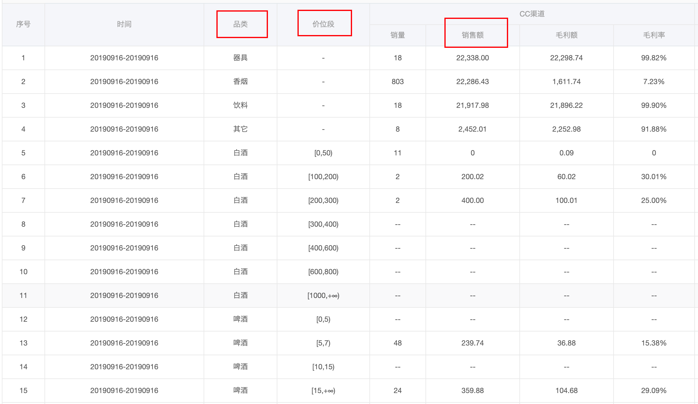
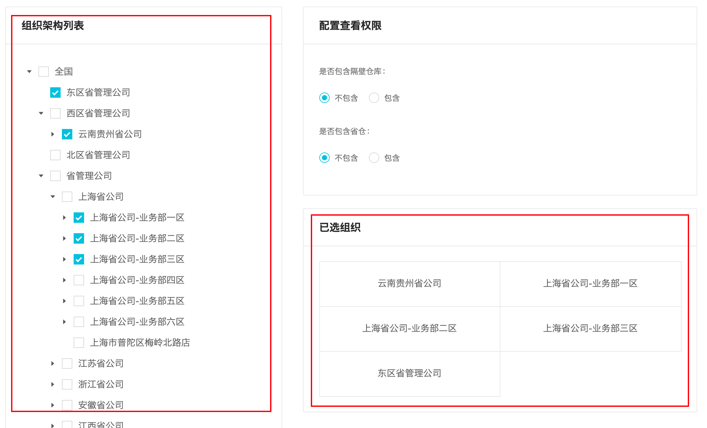

[TOC]

## 特殊排序

### 价位段特殊排序

这个是稍微比较复杂一点的功能的，先看图：



如图，我需要先将品类进行排序，也就是将相同品类的放在一起，然后再将每一种品类的销售额合计，然后再根据这个合计的销售额进行排序，之后再在每一个品类中根据「价位段」由低到高排序。

代码：

```tsx
export function priceSpecificSort(dataSource: any[], column: string) {
  let classObj: any = {}
  let classArr: any[] = []
  let res: any[] = []
  // 将表格数据中的条目以对象的方式分类存储，key 为 '品类' 的值
  dataSource.forEach(entry => {
    let classTemp = entry['品类'];
    let tempObj = classObj[entry['品类']]
    classObj[entry['品类']] = {
      sales: tempObj ? tempObj.sales + (entry[column] || 0) : (entry[column] || 0),
      entries: tempObj ? tempObj.entries.concat(entry) : [entry]
    }
  })
  // 遍历品类对象并用销量进行排序
  classArr = Object.values(classObj)
  classArr = _.orderBy(classArr, 'sales', 'desc')
  // 将对象数组 classArr 中的每一对象的 entries 以「价位段」进行排序
  classArr = classArr.map(obj => {
    return _.sortBy(obj.entries, function (o) {
      let PriceSegment = o['价位段']
      PriceSegment = PriceSegment ? PriceSegment : '0'
      return Number(PriceSegment.slice(1, PriceSegment.indexOf(',')))
    })
  })
  // 将 classArr 中的数组项展开，并返回给 res
  res = _.flatten(classArr)
  return res
}
```

- 在 7 到 13 行中，我利用对象的 `key` 来将类别进行了分类，并且每一个 key 所对应的对象中用 `sales` 来进行合计。
- 15 到 16 行，先将对象对象转换为对象数组，接着用 `sales` 对这个对象数组进行排序。
- 18 到 24 行，遍历每一个对象中的 `entries` 数组，对「价位段」进行排序，这里需要注意是要取到价位段的低区间值（22 行），还有需要注意返回的直接是数组了。
- 最后，将这个数组数组展开就可以了。

整个过程中，需要注意要有对数据做边界检测，比如地 10 行中 `(entry[column] || 0)` ，因为有可能 `entry[column]` 没有这个值，还有一处是第 21 行，`PriceSegment ? PriceSegment : '0'` ，因为 `PriceSegment` 也有可能不存在，但这里也有一个需要主要的点，就是如果不存在则返回 `'0'` ，因为接下来要调用字符串的方法，如果返回数字则会报错。

### 销售额特殊排序

其实这个就是对单一列进行排序，很简单，代码：

```tsx
/**
 * 销售额特殊排序
 * @param dataSource 列表数据
 * @param column 特殊传值
 */
export function saleSpecificSort(dataSource: any[], column: string) {
  return _.orderBy(dataSource, function (o) {
    let value;
    if (!_.isNumber(o['CC渠道,销售额'])) {
      value = -1
    } else {
      value = o['CC渠道,销售额']
    }
    return value
  }, 'desc')
}
```

- 利用了 `lodash` 的 `orderBy` 方法，能够很方便的对所传入的集合（数组 | 对象）进行排序，第二个参数可以传入很多种不同的参数，比如这个传入函数，就会以这个函数的返回值进行排序，第三个参数是排序方式，升序（desc）和降序（asc）。
- 需要注意的是，里面有数据可能是非数字（比如 `--` 这样的字符串），所以需要将其转换为 `-1` 返回，这样就可以使其排在 0 之后（在升序的方式下）


## 递归

> Tips：
>
> 1. 递归函数的定义尽量放在某个函数的内部，这样可以在内部创建一些变量用于接收递归函数中的值。
> 2. 递归有一个边界用于控制是否继续递归，一般是某个集合是否有元素。

递归大多数使用场景是针对树结构的，比如获取树结构中任意节点的属性。下面针对在项目中所遇到的问题，举三个递归最为常用的例子。

### 项目说明

视图：



左侧是组件架构树状结构视图，右侧的「已选组织」模块与其所选择项有相关性，会显示其节点文本。

这里要实现的一个功能是，当勾选某个节点时会取消其所有父子节点的勾选，而这个功能 antd 官方并没有提供，所以需要自己实现。具体的方式是获取这些父子节点的 key，然后再从已勾选的节点中将这些节点过滤掉。

### 递归获取所勾选节点的所有子节点 key

```tsx
/**
 * 获取所勾选节点所有子节点的 key
 * @param children 子节点集合
 */
export function getCheckedNodeChildrenKeys(children: any[]): string[] {
  let keys: string[] = [];
  const recurChildren = (children:any[]) => {
    for (let i = 0; i < children.length; i++) {
      const child = children[i];
      keys.push(child.key)
      if(child.props.children && child.props.children.length > 0){
        recurChildren(child.props.children)
      }
    }
  }
  recurChildren(children)
  return keys
}

// 调用时
e: AntTreeNodeCheckedEvent
let nodeChildren = e.node.props.children
let checkedNodeChildrenKeys = getCheckedNodeChildrenKeys(_.isArray(nodeChildren) ? nodeChildren : [])
```

- 很简单，拿到所勾选节点的子节点对象集合——`e.node.props.children`，传入 `getCheckedNodeChildrenKeys` 方法。
- `getCheckedNodeChildrenKeys` 方法的内部有一个用于接收递归得到的 `key` ，有一个用于递归的函数 `recurChildren` 
- 递归有一个边界，这里是子节点对象集合中的每一个对象的 `children` 集合是否有值，有则再将其传入 `recurChilren`  获取 `key` 并根据其边界判断是否应该继续递归。

### 递归所勾选节点的所有父节点 key

```ts
/**
 * 递归所勾选节点所有父节点的 key
 * @param CheckedNodeKey 勾选节点 key
 * @param menus 菜单树
 */
export function recurCheckedNodeParentKeys(CheckedNodeKey: string, menus: any[]): string[] {
  let allParentKeys: string[] = []; // 暂存递归过程中父母节点
  let resKeys: string[] = [];
  const recurMenus = (menus: any[]) => {
    // 如果已经匹配成功则不需要再继续递归
    if (resKeys.length > 0) return;
    for (let child of menus) {
      const { id, children } = child;
      if (id == CheckedNodeKey) {
        resKeys = [...allParentKeys];
        return;
      } else if (children && children.length > 0) {
        allParentKeys.push(id as string);
        recurMenus(children);
        allParentKeys.pop();
      }
    }
  };
  recurMenus(menus);
  return resKeys;
}

// 调用
let checkedNodeParentKeys = recurCheckedNodeParentKeys(checkedKey, menus)
```

- 这个就会相对复杂一些，主要的区别在于需要每一次将某父节点的子节点集合用于递归之前都需要将其 key 保存起来，也就是第 18 行代码 `allParentKeys.push(id as string)` ，并且递归执行完毕之后也需要将其推出 `allParentKeys.pop()` 。然后是，当所勾选节点的 key 匹配于某节点的 id 时，就将之前存起来的 keys 传给 `resKeys` ，这样就算获取到所勾选节点的所有父节点 key 了。并且 `reskeys` 也是作为是否还继续迭代的条件，如果有数据则说明已经获取到了父节点们，那就 `return` 吧。
- 父节点要用 `parent` 而不要用 `father` ，表示上一代（政治正确）