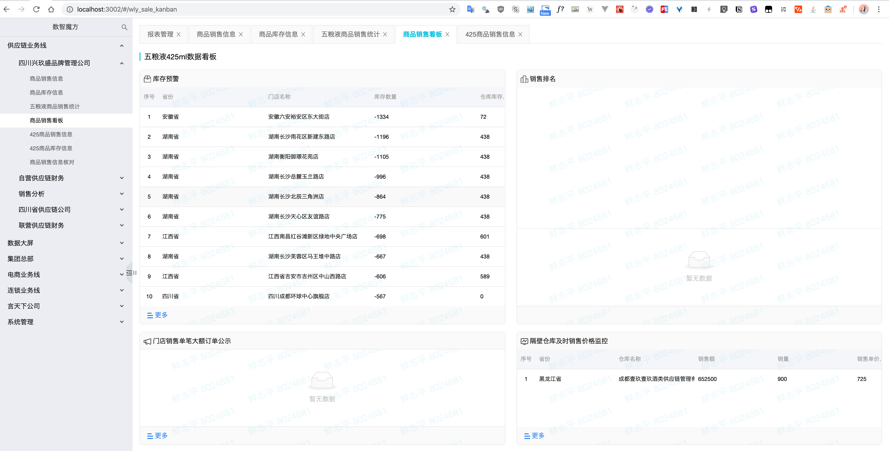

# Tabs 页面

[toc]

## 视图

## 描述

我们将页面布局分为左右两部分：

- 左边的 「AppSidebar」侧边栏，由三部分组成：
  - Title Header，显示应用名称及提供对导航菜单项的搜索
  - 导航菜单，提供多级结构及收纳帮助在不同的内容页面之间进行跳转
  - 侧边栏宽度控制，位于侧边栏右侧中间位置，显示隐藏及控制侧边栏的宽度
- 右边是页面内容，以前只由路由控制，而由于现在是以 Tab 的形式来显示，则通过点击不同的 Tab 也能控制。

Tabs 页面也就是我们要实现的功能，将每一个页面嵌入到 Tabs 组件的 Pane 中，并缓存起来。

## 功能

- **点击左侧导航菜单项**：
  - 更改路由（通过 `<Link to="XXX" />` ）
  - 添加 tab 及其内容，如果 tabs 中已存在此页面 tab，则激活该 tab，而非添加新的 tab
  - tab 的数量限制
- **点击非激活 tab** 会跳转到该 tab ，路由也会更改。
- **点击 tab 上的删除按钮**，删除该 tab，如果删除的是激活 tab，则将剩下 tabs 中的最后一个 tab 激活。
- 使用**浏览器对浏览记录的前进后退**功能在更改地址的同时能够切换 tab、恢复删除的 tab
- 通过**在浏览器地址栏输入地址**打开页面时，如果此页面存在则将此页面显示并放到一个 tab 之中。

## 问题

- 缓存问题，当我们在不同的 tab 页面之间切换时，要显示切换之前页面的状态。
- 如何在不通过点击菜单项添加 tab 时也能获取到 tab 的 title
- 某页面的子页面在当前 tab 页中显示而不是添加一个新的 tab，并且前进后退依然可以跳转（这里注意要将 `config_report` 这个特殊路径排除）

