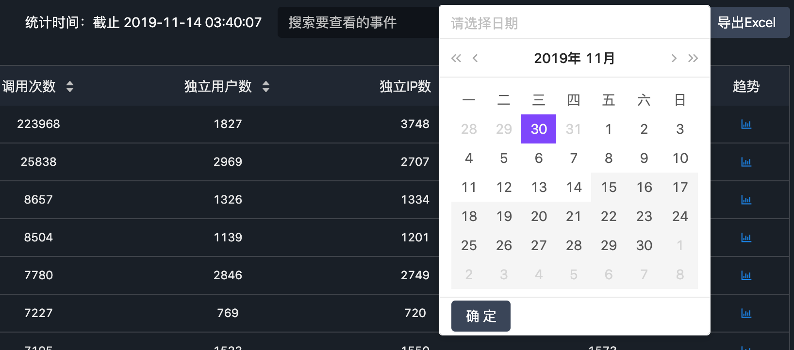

# Q2.数智看板项目中的问题

[toc]

## 思考「页面动态部分」

「页面动态部分」是指页面中根据不同的状态而呈现不同内容的地方（比如显示不同的字符或不同的图片或模块）。

页面动态部分可能有时候涉及的范围非常小，比如 input 中的输入；也可能非常大，比如整个页面的替换（当然针对整个页面的更改可能其内部并不是所有内容都是动态的）。那么，范围越大其有关联的变量及其逻辑就越多，某个需求的更改而引起更改的代码就越多，而且也很容易出错，所以就要思考怎么尽量减少这样的问题。

减少这样问题最直接的方式当然是减少动态部分相关变量的数量，我称为「变量最小化」，这里举一个简单的例子来说明一下，也是因为这个例子我才开始思考这个问题。

视图部分：


左侧红框中的时间会根据右侧紫框中所选择的时间按钮而更改，那么红框中的内容就可以被称为「页面动态部分」，当然右侧紫框中也是动态更改的部分，但由于红框是新添加的需求，所以这里说一下更改红框内容的过程。

一开始，我想到的方式是根据紫框点击之后的 `type` 状态来更改，这个时候用了函数来返回统计时间：

```ts
// 根据实时、日、周显示不同的统计时间
renderStatisticsTime = () => {
  const { startTime, endTime, confirmType } = this.state
  switch (confirmType) {
    case 1:
      return '截止 ' + moment().format('YYYY-MM-DD hh:mm:ss');
    case 2:
      return `${startTime} ~ ${startTime}`;
    case 3:
      return `${startTime} ~ ${endTime}`;
    default:
      ''
      break;
  }
}
```

但这样的方式限制了「统计时间」只能在这个函数中进行更改，并且更改只是受到 `confirmType` 影响的，但实际上我们需要更改「统计时间」时不只是要根据 `confirmType` 决定，而且也需要根据所点击的按钮类型，这里的类型并不是 `confirmType` 而是指「实时」与「日」、「周」按钮的不同类型，这里「实时」是不会弹出时间选择器的，而「日」和「月」则会，如下：



那么这里所说的「按钮类型」又可以称为「是否弹出时间选择器的按钮类型」，只有两种——月和日的「弹出」与实时的「不弹出」。

所以，如果只是通过这个函数来返回「统计时间」则会出现一些 bug，那就需要将「统计时间」抽成一个状态值，放到不同的类型所要执行的函数中去更改：

```ts
handleTypeClick = () => {
  setTimeout(() => {
    if (this.formData.type !== 1) {
      this.setState({ dateVisible: true });
    } else {
      this.formData.endTime = '';
      this.formData.startTime = '';
      this.clickDate = '';
      this.props.onChange(removeEmptyProps(this.formData));
    }
    if (this.formData.type === 1) {
      this.setState({ StatisticsTime: '截止 ' + moment().format('YYYY-MM-DD hh:mm:ss') })
    }
  });
};
```

- 这是每一个按钮点击之后都会执行的回调，在最后会根据是否是第一个按钮而更改为第一个按钮点击之后应该显示的时间。

```ts
confirmDateChange = () => {
  const { startTime, endTime, type } = this.formData
  this.closeDatePicker();
  const result = {
    ...this.formData,
    startTime: startTime ? startTime + ' 00:00:00' : '',
    endTime: endTime ? endTime + ' 00:00:00' : ''
  }
  this.setState({
    StatisticsTime: `${startTime} ~ ${type === 2 ? startTime : endTime}`
  })
  this.props.onChange(removeEmptyProps(result));
};
```

- 这是「时间选择器」中点击「确定」按钮执行的回调，在第 10 行更改「统计时间」状态时，会根据按钮类型状态显示不同的 ~ 之后的时间。

两个回调函数其实也区分开了「是否弹出时间选择器的按钮类型」，对于「实时」按钮不会执行 `confirmDateChange` 回调，而 「月」「日」则会，虽然都会执行 `handleTypeClick` ，但内部可以通过按钮类型来作为更改标示。我们只需要做的是，为「统计时间」添加一个状态，然后将它放到相应的更改位置即可，而不是像最开始那样，通过一个函数来返回，然后使用按钮类型来作为判断条件进行更改。当然，其实也可以将「是否弹出时间选择器的按钮类型」添加到 State 中，然后在`renderStatisticsTime` 函数中作为条件进行更改，只是这样会相对复杂一些，我们能够直接利用现有变量和逻辑来更改是最好的。

讲到这里，其实和标题就相差甚远了，发现设计到编程模式问题，怎么样是更加合理的组织代码的形式，怎么样能最简单有效的完成需求，这样的问题。