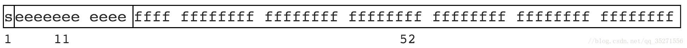

# 其他问题

[toc]

## 小数乘以 100 出现多位的问题

`0.0205 * 100` => `2.0500000000000003`


## JS数字太大导致的精度丢失问题原因及解决方案

> 原文地址：https://blog.csdn.net/qq_35271556/article/details/80137474

### JS 数字丢失精度的原因

计算机的二进制实现和位数限制有些数无法有限表示。就像一些无理数不能有限表示，如 圆周率 3.1415926…，1.3333… 等。JS 遵循 [IEEE 754](https://en.wikipedia.org/wiki/IEEE_754) 规范，采用双精度存储（double precision），占用 64 bit。如图


意义

- 1位用来表示符号位
- 11位用来表示指数
- 52位表示尾数

浮点数，比如

```
0.1 >> 0.0001 1001 1001 1001…（1001无限循环）
0.2 >> 0.0011 0011 0011 0011…（0011无限循环）12
```

此时只能模仿十进制进行四舍五入了，但是二进制只有 0 和 1 两个，于是变为 0 舍 1 入。这即是计算机中部分浮点数运算时出现误差，丢失精度的根本原因。

大整数的精度丢失和浮点数本质上是一样的，尾数位最大是 52 位，因此 JS 中能精准表示的最大整数是 Math.pow(2, 53)，十进制即 9007199254740992。

大于 9007199254740992 的可能会丢失精度。

```
9007199254740992     >> 10000000000000...000 // 共计 53 个 0
9007199254740992 + 1 >> 10000000000000...001 // 中间 52 个 0
9007199254740992 + 2 >> 10000000000000...010 // 中间 51 个 0123
```

实际上

```
9007199254740992 + 1 // 丢失
9007199254740992 + 2 // 未丢失
9007199254740992 + 3 // 丢失
9007199254740992 + 4 // 未丢失1234
```

结果如图



以上，可以知道看似有穷的数字, 在计算机的二进制表示里却是无穷的，由于存储位数限制因此存在“舍去”，精度丢失就发生了。
想了解更深入的分析可以看这篇论文：http://docs.oracle.com/cd/E19957-01/806-3568/ncg_goldberg.html

### 解决方案

对于整数，前端出现问题的几率可能比较低，毕竟很少有业务需要需要用到超大整数，只要运算结果不超过 Math.pow(2, 53) 就不会丢失精度。

对于小数，前端出现问题的几率还是很多的，尤其在一些电商网站涉及到金额等数据。解决方式：**把小数放到位整数（乘倍数），再缩小回原来倍数（除倍数），也就是说，尽量在业务中避免处理小数**

[来源：https://www.cnblogs.com/littlestart/p/6023976.html](https://www.cnblogs.com/littlestart/p/6023976.html)

### 个人总结

这是在我的业务中出现的一个问题，我们的业务后台是用18位int型id来标记数据条目的，因此返回到前端就经常会获取一个18位的number型变量，为了避免这个问题，我目前采用的方法就是与后台沟通，**统一采用string类型来传输此类数据，或者是在初始化数据时马上转化为字符串**，这样前端在业务中全程都是使用字符串来操作，就不会产生精度丢失问题。


