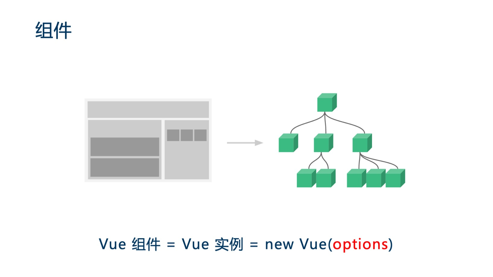
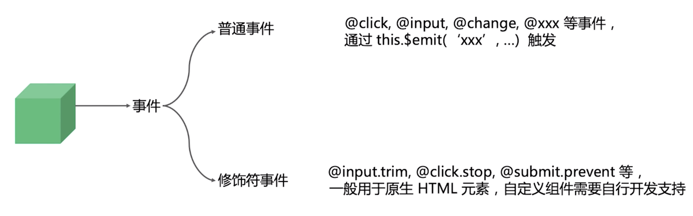
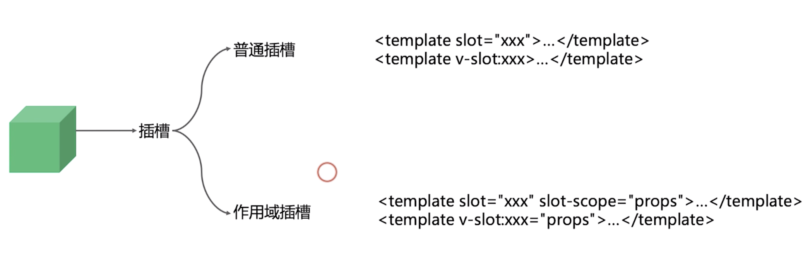
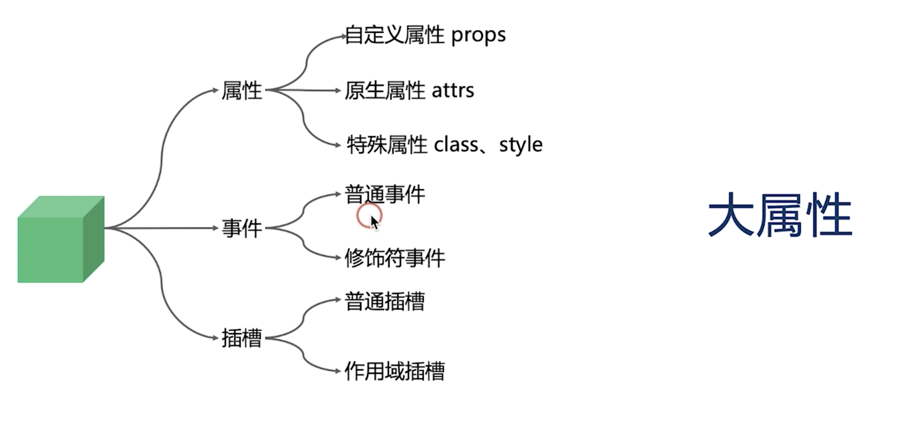
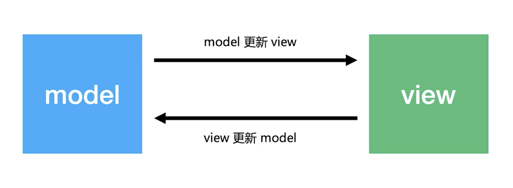
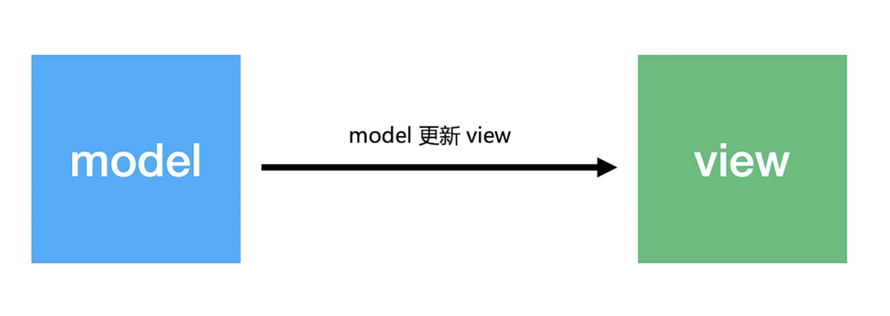

# 基础篇 | 第一部分

[TOC]

## 01 | 课程介绍

### 为什么要学习 Vue？

- 基于 HTML 的模版语法和响应式的更新机制可以让我们更快更高效地开发项目
- 渐进式的开发理念和繁荣的生态圈为我们提供了大量的最佳实践，无论开发简单的活动页还是复杂逻辑的中后台系统，Vue 都可以轻松的应对。

## 02 | Vue 简介

### 历史

- 2013 年由尤雨溪作为个人实验性质的项目发布

- Vue 的很多功能点和灵感都是来源于 Angular 和 React，这些框架要解决的问题是利用**数据驱动**避免我们去**手动操作 DOM**

### 特点

- 更加轻量 20kb min +  gzip
- 渐进式框架
  - 不需要学习完 vue 的所有知识即可使用到项目中，当你需要什么的时候再去学习
- 响应式的更新机制
  - 数据改变—视图刷新，不需要像 React 那样使用`shoudComponentUpdate`进行性能优化，框架已经帮助我们做了相应的处理。
- 学习成本低
  - 因为模版语法是基于 HTML

## 03 | 内容综述

### 内容概述

- 基础篇：Vue 核心知识点
  - 属性、事件、插槽等
- 生态篇：大型 Vue 项目所需的周边技术
  - vue-router 路由管理器
  - vuex 状态管理器
- 实战篇：开发基于 Vue 的 Ant Design Pro
- 福利篇：Vue 3.0 相关知识

## 04 | 第一个 Vue 程序

### 环境搭建

- 浏览器：Chrome
- IDE：Visual Studio Code 或者 WebStom
- Node.js 8.9+，npm

### todo list 代码

```html
<!DOCTYPE html>
<html lang="en">
  <head>
    <meta charset="UTF-8" />
    <meta name="viewport" content="width=device-width, initial-scale=1.0" />
    <meta http-equiv="X-UA-Compatible" content="ie=edge" />
    <script src="https://cdn.jsdelivr.net/npm/vue/dist/vue.js"></script>
    <title>Document</title>
    <style>
      .item {
        color: salmon;
      }
    </style>
  </head>
  <body>
    <!-- {{}} 为插值表达式 -->
    <div id="app">
      {{ msg }}
      <div>
        <!-- v-model 双向绑定，当 input 中的值发生变化时也会同步更新到 data 下的 info，当 info 发生改变时也会改变 input 中的值 -->
        <input type="text" v-model="info" />
        <!-- @click 绑定事件 -->
        <button @click="handleClick">添加</button>
      </div>
      <ul>
        <!-- 使用 :item="item" 将数据绑定到组件内部 -->
        <todo-item v-for="item in list" :item="item"></todo-item>
      </ul>
    </div>
    <script>
      Vue.component('todo-item', {
        props: ['item'],
        template: `<li class="item">{{item}}</li>`
      })
      new Vue({
        //让实例管理 #app 节点
        el: '#app',
        data() {
          return {
            msg: 'hello geekTime',
            info: '',
            list: [1, 2, 3]
          }
        },
        methods: {
          handleClick() {
            if (this.info === '') return
            this.list.push(this.info)
            this.info = ''
          }
        }
      })
    </script>
  </body>
</html>
```

### Vue.component 缺点

在很多 Vue 项目中，使用 `Vue.component` 来定义全局组件，紧接着用 `new Vue({ el: '#container '})` 在每个页面内指定一个容器元素。

这种方式在很多中小规模的项目中运作的很好，在这些项目里 JavaScript 只被用来加强特定的视图。但当在更复杂的项目中，或者前端完全由 JavaScript 驱动的时候，下面这些缺点将变得非常明显：

　　1、**全局定义 (Global definitions)** 强制要求每个 component 中的命名不得重复

　　2、**字符串模板 (String templates)** 缺乏语法高亮，在 HTML 有多行的时候，需要用到丑陋的 `\`

　　3、**不支持 CSS (No CSS support)** 意味着当 HTML 和 JavaScript 组件化时，CSS 明显被遗漏

　　4、**没有构建步骤 (No build step)** 限制只能使用 HTML 和 ES5 JavaScript, 而不能使用预处理器，如 Pug (formerly Jade) 和 Babel

文件扩展名为 `.vue` 的 **single-file components(单文件组件)** 为以上所有问题提供了解决方法，并且还可以使用 Webpack 或 Browserify 等构建工具。

 

## 05 | 初识单文件组件

### Vue CLI

这节课将使用 Vue-cli 来初始化项目从而能够使用到更多 vue 带给我们的开发优势。

```shell
npm install -g @vue/cli
vue create my-app
cd my-app
npm run serve
```

> 代码在 05-my-app 之中


## 06 | Vue 组件的核心概念(1) - 属性

### 组件的概念

小型的、独立的、可复用的 UI 模块，而大型项目就是由这些小型的模块拼接而成。比如以下这个图示：



如图中右侧所示，可以抽象的将整个「树」看作是一个项目，而这个「树」中的不同节点则为模块。

Vue 组件实际上也是 Vue 也是 Vue 的实例，不同的组件只不过是 option 的不同，项目开发的工作 90% 是围绕这个 option 进行的。

### 三大核心概念

- 属性
- 事件
- 插槽

### 组件的组成 - 属性


- 注意「原生属性」与「特殊属性」是挂载到组件的**根元素**上。「原生属性」可以通过设置 inheritAttrs 为 false 来关闭自动挂载，而「特殊属性」是不能关闭自动挂载的。
- 在「特殊属性」中无论是传入字符串、对象、数组，Vue 底层都会帮你把这些合并为字符串用于 DOM

#### props demo

这个 demo 基本上罗列了平时我们所会使用到的 props 的写法：

```jsx
export default {
  name: "PropsDemo",
  // inheritAttrs: false,
  // props: ['name', 'type', 'list', 'isVisible'],
  props: {
    name: String,
    type: {
      validator: function(value) {
        // 这个值必须匹配下列字符串中的一个
        return ["success", "warning", "danger"].includes(value);
      }
    },
    list: {
      type: Array,
      // 对象或数组默认值必须从一个工厂函数获取，否则会共用同一个对象
      default: () => []
    },
    isVisible: {
      type: Boolean,
      default: false
    },
    // onChange 这个名称不太推荐，因为与 JSX 中的部功能点有冲突
    onChange: {
      type: Function,
      default: () => {}
    }
  },
  methods: {
    handleClick() {
      // 不要这么做、不要这么做、不要这么做
      // 因为单项数据流的缘故，不能直接更改父组件传递过来的值，会报错
      // this.type = "warning";

      // 可以，还可以更好
      this.onChange(this.type === "success" ? "warning" : "success");
    }
  }
};
```

- 第 4 行中使用数组来接收 props 虽然很方便，但对于维护系统而言非常的不利。而更好的方式是使用对象，这样我们就可以对 props 使用**类型声明**（第 6 行）、 **自定义校验**（第 8 行）、**默认值**（第 16 行）

使用组件及向其传入 props，如下：

```jsx
<Props
  name="Hello Vue！"
  :type="type"
  :is-visible="false"
  :on-change="handlePropChange"
  title="属性Demo"
  class="test1"
  :class="['test2']"
  :style="{ marginTop: '20px' }"
  style="margin-top: 10px"
  />
```

生成的实际 DOM 如下：

```html
<div title="属性Demo" class="test1 test2" style="margin-top: 20px;">
  name: Hello Vue！
  <br>
  type: success
  <br>
  list: []
  <br>
  isVisible: false
  <br>
  <button>change type</button>
</div>
```

- `title` 属性被自动挂载到了根元素上，如果不想自动挂载可以在 `data` 字段下添加 `inheritAttrs: false` 属性

### 课后习题1

·子组件为何不可以修改父组件传递的 Prop，如果修改了，Vue 是如何监控到属性的修改并给出警告的？


## 07 | Vue 组件的核心概念(2) - 事件



### demo

```html
<template>
  <div>
    name: {{ name || "--" }}
    <br />
    <input :value="name" @change="handleChange" />
    <br />
    <br />
    <div @click="handleDivClick">
      <button @click="handleClick">重置成功</button>&nbsp;&nbsp;&nbsp;
      <button @click.stop="handleClick">重置失败</button>
    </div>
  </div>
</template>

<script>
export default {
  name: "EventDemo",
  props: {
    name: String
  },
  methods: {
    handleChange(e) {
      this.$emit("change", e.target.value);
    },
    handleDivClick() {
      this.$emit("change", "");
    },
    handleClick(e) {
      // 都会失败
      //e.stopPropagation();
    }
  }
};
</script>
```

- 注意：input输入框的 onchange 事件，要在 input 失去焦点的时候才会触发。
- 上面代码中，「重置成功」和「重置失败」按钮绑定了相同的事件和事件方法，区别在于「重置失败」按钮添加了修饰符 `.stop` 用于阻止冒泡，那么当点击时就不会触发其父元素 `div` 的 `click` 事件清空字符串。

### 课后习题 2

`this.$emit` 的返回值是什么？如何上层组件 return 一个值，`this.$emit` 是否能够接收到？


## 08 | Vue 组件的核心概念(3) - 插槽



- 严格意义上来说，2.0 之后已经不太区分这两类概念，因为其底层的实现基本上已经相同了。
- 现在推荐使用 2.6 的写法而不是 2.5 的写法，因为有更好的性能提升。

### demo

组件代码：

```jsx
<template>
  <div>
    <slot />
    <slot name="title" />
    <slot name="item" v-bind="{ value: 'vue' }" />
  </div>
</template>

<script>
export default {
  name: "SlotDemo"
};
</script>
```

父组件代码：

```jsx
<a-tab-pane key="slot" tab="插槽">
  <h2>2.6 新语法</h2>
  <SlotDemo>
    <p>default slot</p>
    <template v-slot:title>
      <p>title slot1</p>
      <p>title slot2</p>
    </template>
    <template v-slot:item="props">
      <p>item slot-scope {{ props }}</p>
    </template>
  </SlotDemo>
  <br />
  <h2>老语法</h2>
  <SlotDemo>
    <p>default slot</p>
    <p slot="title">title slot1</p>
    <p slot="title">title slot2</p>
    <p slot="item" slot-scope="props">item slot-scope {{ props }}</p>
  </SlotDemo>
</a-tab-pane>
```

- 第 9 行 `v-slot:item="props"` 中的 `props` 是用于接收内部通过 `v-bind` 传递出来的值命名空间

### 万物皆属性



可以看到，vue 的概念可以分的很细很多，比如这里，属性有 3 类，事件有两类，插槽也有两类。这样会觉得 vue 的概念稍微有点多，但其实可以都归为「大属性」，因为其都是通过父组件传递给自组件内容，子组件再根据内容来执行一些行为。

「大属性」的另外一个特点是，所有的功能（无论是事件还是插槽）都可以通过属性来完成。

#### 大属性 demo

父组件中：

```jsx
<BigProps
  :name="bigPropsName"
  :on-change="handleBigPropChange"
  :slot-default="getDefault()"
  :slot-title="getTitle()"
  :slot-scope-item="getItem"
  />

getDefault() {
  return [this.$createElement("p", "default slot")];
}

getTitle() {
  return [
    this.$createElement("p", "title slot1"),
    this.$createElement("p", "title slot2")
  ];
}
```

子组件：

```jsx
<template>
  <div>
    {{ name }}
    <br />
    <button @click="handleChange">change name</button>
    <br />
    <!-- {{ slotDefault }} -->
    <VNodes :vnodes="slotDefault" />
    <br />
    <VNodes :vnodes="slotTitle" />
    <br />
    <VNodes :vnodes="slotScopeItem({ value: 'vue' })" />
  </div>
</template>

<script>
export default {
  name: "BigProps",
  components: {
    VNodes: {
      functional: true,
      render: (h, ctx) => ctx.props.vnodes
    }
  },
  props: {
    name: String,
    onChange: {
      type: Function,
      default: () => {}
    },
    slotDefault: Array,
    slotTitle: Array,
    slotScopeItem: {
      type: Function,
      default: () => {}
    }
  },
  methods: {
    handleChange() {
      this.onChange("Hello vue!");
    }
  }
};
</script>
```

- 通过这个示例我们可以看到使用属性的方式来实现插槽的功能。

### 课后习题 3

相同名称的插槽是合并还是替换？（2.5 与 2.6 的行为不同）


## 09 | 双向绑定和单向数据流不冲突

### 什么是双向绑定



简单来说也就是 model（数据） 的更新会触发 view（视图）的更新，而 view 的更新也会触发 model 的更新

### 什么是单向数据流



也就是 model 的更新会触发 view 更新，而 view 的更新无法触发 model 的更新。

### 双向绑定 or 单向数据流

有些说法是 Vue 是双向绑定也是单向数据流，但这是冲突的，而真正的情况如下：

- Vue 是单向数据流，不是双向绑定
- Vue 的双向绑定不过是语法糖
- Object.defineProperty 是用来做响应式更新的，和双向绑定没关系

### demo

> 演示 DEMO 源码/src/views/1.2

**父组件：**

```jsx
<template>
  <div>
    <PersonalInfo v-model="phoneInfo" :zip-code.sync="zipCode" />

    <PersonalInfo
      :phone-info="phoneInfo"
      :zip-code="zipCode"
      @change="val => (phoneInfo = val)"
      @update:zipCode="val => (zipCode = val)"
    />

    phoneInfo： {{ phoneInfo }}
    <br />
    zipCode： {{ zipCode }}
  </div>
</template>
<script>
import PersonalInfo from "./PersonalInfo";
export default {
  components: {
    PersonalInfo
  },
  data() {
    return {
      phoneInfo: {
        areaCode: "+86",
        phone: ""
      },
      zipCode: ""
    };
  }
};
</script>
```

- 第 3 行的 `v-model` 绑定 `phoneInfo` 属性，实际上是第 6 行传入属性和第 8 行传入回调的语法糖，依然是通过内部触发 DOM 元素的事件来调用 `$emit` 触发组件事件从而调用父组件的回调来改变父组件的数据，而不是真正的双向绑定，由子组件直接改变父组件的数据。
- 第 3 行中除了使用 `v-model` 来实现双向绑定以外，也可以使用修饰符 `.sync`，它能够让其他的属性实现双向绑定。但其所调用的事件是 `update:zipCode` ，也就是说你在子组件内部需要使用 `this.$emit("update:zipCode", e.target.value)` 进行触发事件。

**子组件：**

```jsx
<template>
  <div>
    <select
      :value="phoneInfo.areaCode"
      placeholder="区号"
      @change="handleAreaCodeChange"
    >
      <option value="+86">+86</option>
      <option value="+60">+60</option>
    </select>
    <input
      :value="phoneInfo.phone"
      type="number"
      placeholder="手机号"
      @input="handlePhoneChange"
    />
    <input
      :value="zipCode"
      type="number"
      placeholder="邮编"
      @input="handleZipCodeChange"
    />
  </div>
</template>
<script>
export default {
  name: "PersonalInfo",
  model: {
    prop: "phoneInfo", // 默认 value
    event: "change" // 默认 input
  },
  props: {
    phoneInfo: Object,
    zipCode: String
  },
  methods: {
    handleAreaCodeChange(e) {
      // 注意这里是传入新的对象
      this.$emit("change", {
        ...this.phoneInfo,
        areaCode: e.target.value
      });
    },
    handlePhoneChange(e) {
      this.$emit("change", {
        ...this.phoneInfo,
        phone: e.target.value
      });
    },
    handleZipCodeChange(e) {
      this.$emit("update:zipCode", e.target.value);
    }
  }
};
</script>

```

- 在父组件中，我们通过 `@change` 来触发回调，这也是 `v-model` 所绑定的事件，默认情况下 vue 所默认的是 input 事件，而我们在第 28-31 行中通过 model 这个字段进行了设置，改变了其默认绑定的值与事件。

### 课后习题 4

扩展 PersonalInfo Demo，对手机号做非空合法校验，如不合法，则给出错误提示。

> vue 中 子组件怎么调用父组件的方法：
>
> 1. 用`$emit`向父组件触发一个事件，父组件监听这个事件就行了。
> 2. 直接用`this.$parent.xxxx`这样直接调用父组件的方法。
>
> vue 中 父组件怎么调用子组件的方法：
>
> `this.$refs.child1.handleParentClick("ssss");`

