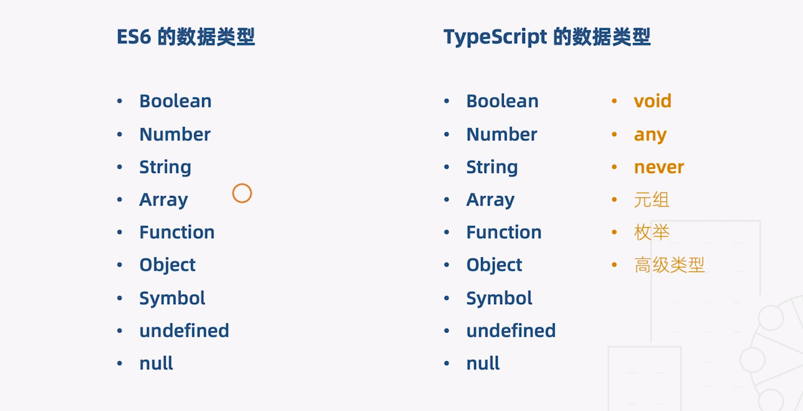

# 05 | 基本类型

[TOC]

## 数据类型



ES 6 有 6 种基本类型：

- Boolean
- Number
- String
- Symbol
- undefined
- null

除此之外 ES 还有引用类型：

- Array
- Function
- Object

TS 的数据类型在 ES 的基础上新增了一些类型，比如：

- Void
- any
- never
- 元祖
- 枚举

除此之外 TS 还有很多类型的高级玩法，本节课就从基础类型讲起。


## 类型注解

一个概念：类型注解

作用：相当于强类型语言中的类型声明，可以对变量起到约束作用

语法：(变量/函数) : type

- 在变量或函数后面加一个 `:`（冒号），然后再加上**类型名称**


## 工程中的代码

在 `src` 下创建一个新的文件 `datatypes.ts`，在 `index.ts` 中引入：

```tsx
import './datatype'

//...
```

在 `datatypes.ts` 中：

### 三种原始类型

```tsx
// 定义三种原始类型
let bool: boolean = true
let num: number = 32
let str: string = 'Good Night'

str = 12 //不能将类型“12”分配给类型“string”。ts(2322)
```


### 数组类型

定义数组类型有两种方式且等价，以下的意思是数组元素只能是 number 类型：

```ts
let arr1: number[] = [1,2,3] //第一种方式：类型名称 + []
let arr2: Array<number> = [1,2,3]//第二种方式：Array + <类型名称>，这里的 Array 是 TS 为我们定义的泛型接口
let arr3: number[] = [1,2,3,'4']  //不能将类型“string”分配给类型“number”。ts(2322)

```

如果想要一个数组中存储多种不同的类型就需要使用「**联合类型**」，语法是在类型之间加上 `|` 如：

```ts
let arr4: Array<number | string> = [1,'2']
let arr5: (number|string)[] = [3,'4']
```


### 元祖

元祖是一种特殊的数组，限定了数组元素的类型和个数，比如我们更改一下对应项的类型

```ts
//元祖
let tuple1: [number, string] = [0, '1']
//
let tuple2: [number, string] = ['0','1'] //不能将类型“string”分配给类型“number”。ts(2322)
//或者添加一个元素
let tuple3: [number, string] = [0,'1',2] //不能将类型“[number, string, number]”分配给类型“[number, string]” 属性“length”的类型不兼容。 ts(2322)
```

#### 元祖的越界问题

```ts
tuple1.push(2); //调用数据的 push 方法向元祖中添加 2
console.log('tuple1', tuple1); // [0,'1',2]，三个元素，这个时候 TS 允许我们向元祖中添加元素
// 但是并不允许我们进行访问，虽然可以通过 push 进行添加元素，但并不能越界访问，所以实际的开发过程中建议不要越界
tuple1[2]; // Tuple type '[number, string]' of length '2' has no element at index '2'.ts(2493)
```


### 函数

```ts
// 函数
let add1 = (x, y) => x + y; // 参数“x”和参数“y“隐式具有“any”类型。ts(7006)，也就是说我们需要为其加上注解
// 为 x, y 加上注解，并且在 () 之后加上函数返回值的类型，不过通常可以省略，其利用了 TS 的类型推断功能
let add2 = (x: number, y: number): number => x + y;
// 定义一个函数类型，但没有具体的实现（赋值）
let compute: (x: number, y: number) => number;
// 实现时的参数名称可以和定义时不同，并且不需要添加类型
compute = (a, b) => a + b;
```

### 对象

```ts
//对象
let obj1: object = {x: 1, y:2}
//在 js 中我们可以任意的修改对象的属性，比如修改 x 属性：
obj1.x = 3 //类型“object”上不存在属性“x”。ts(2339)， 这在 ts 中不被允许，因为我们只是简单的在 obj 中指定其为 object，并且没有具体的定义其应该包含哪些属性
// 正确的方法
let obj2: {x: number, y: number} = {x: 1, y:2}
obj2.x = 4 // 这样就没有问题
```

### Symbol

```ts
// symbol - 其含义是具有唯一的值
let s1: symbol = Symbol() // 显示的声明 symbol 类型
let s2 = Symbol() // 也可以简单的直接赋值 
```


以下是一些特殊的数据类型


### undefined null

```ts
//undefined, null
let un: undefined = undefined // 被声明为 undefined 类型，则不能被赋值任何其他数据类型
let nu: null = null // 被声明为 null 类型，则不能被赋值任何其他数据类型
// null 和 undefined 在 ts 中是其他类型的子类型，因此可以赋值给其他类型
// 不过需要在 tsconfig.json 中进行配置，将 strictNullChecks 设置为 false
num = undefined // 通过配置可以被允许赋值
num = null // 同上
// 当然，如果想要使用比较严格的语法，也可以将其设置为 true，或者注释掉
num = undefined // 不能将类型“undefined”分配给类型“number”。ts(2322)
num = null // 不能将类型“null”分配给类型“number”。ts(2322)
// 不过就算不配置，也可以通过设置联合类型的方式来让其可以赋值 undefined 和 null
```

### void

```ts
//void
//在 js 中 void 是一种操作符，可以让任何表达式返回 undefined
void 0 // 返回 undefined 的最便捷方式，为什么会有这样的设置？
//因为 js 中 undefined 不是一个保留字，我们可以定义一个 undefined 变量去覆盖全局的 undefined，比如：
;(function(){
  var undefined = 0
  console.log('undefined', undefined) // => 0
  // 这里 undefined 覆盖了全局的 undefined，而我们使用 void 就可以避免这种情况的发生，确保返回值为 undefined
})()
// TS 中 void 表示没有任何返回值的类型，比如一个没有返回值的函数，其返回值类型就是 void 类型
let noReturn = () => {} // () => void
```

### any

```ts
//any
//在 ts 中如果我们不指定一个变量类型，那么它默认就是 any 类型，那么就和 js 就没有了任何区别
let x
//可以任意的给其赋值
x = 1 
x = []
x = () => {}
// 所以如果不是特殊情况，不建议使用 any 类型，如果我们把所有类型都定义成 any，就没有必要使用 ts 了
```

### never

```ts
// never - 表示永远不会有返回值的类型（或者说是永远不会执行结束的函数）
// 比如有两种情况，一个函数抛出异常，这个函数则永远不会有返回值，那么它的返回值就是 never
let error = () => {
  throw new Error('error')
}
//还有一种情况，死循环函数
let endless = () => {
  while(true) {}
}
```


## 小结

今天学习了 TS 的基本数据类型，它完全覆盖的 ES6 的类型，并且通过 any 类型实现了对 js 的兼容，为变量或者函数声明类型是一个非常好的编程习惯，这对后端开发来讲稀松平常，但对于前端开发来讲却是建立类型思维的开始，正所谓良好的开端就是成功的一半，下一节将学习 TS 的枚举类型。


## 课后问答

> 老师，`let obj:object` 与 `let obj:Object` 和 `let obj:{}` 的区别？
>
> 
>
> 作者回复: `let obj: object` // 表示非原始类型(非string/boolean/number/symbol/null/undefined)
>
> `let obj: Object` // TypeScript定义的标准JavaScript Object接口(按ctr可查看)
>
> `let obj: {}` // 表示一个空对象类型


