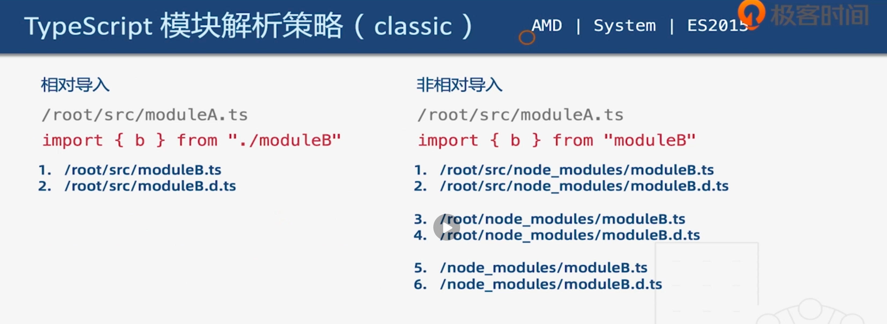
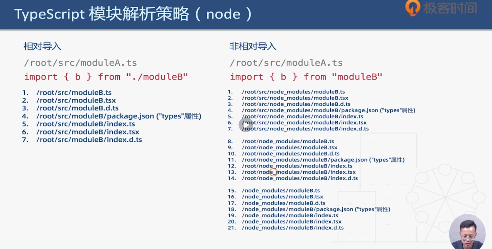

# 27 | 配置tsconfig.json（2）：编译选项

[TOC]

本节课我们将学习 `tsconfig` 中和编译相关的选项，这类选项有将近 100 个，可以说是非常的庞杂。本节课我们会介绍一些常用的选项，对于不常用的选项可以参考官方的文档。掌握本节课的编译选项就基本能够应对日常的开发工作了。

### incremental - 增量编译

Incremental 的含义是「增量编译」，也就是说 TS 编译器可以在第一次编译后生成一个存储编译信息的文件，然后在二次编译时会根据这个文件做增量编译，这样便可以提高编译的速度。

我们打开这个选项编译一下：

```json
{
  "compilerOptions": {
    "incremental": true, //增量编译
  }
}
```

运行 `tsc` 后会在根目录生成一个文件—— `tsconfig.tsbuildinfo` ，也就是和编译信息相关的文件。当我们再此次执行 `tsc` 进行编译的时候速度就会有所提升。

### diagnostics - 打印诊断信息

为了能够看到速度的差异，我们打开一个显示打印诊断信息的选项—— `diagnostics` ：

```json
{
  "compilerOptions": {
    "incremental": true, //增量编译
    "diagnostics": true, // 打印诊断信息
  }
}
```

我们先删除之前生成的 `tsconfig.tsbuildinfo` 文件，然后再重新编译一次，就可以看到在控制台中显示有关编译的信息：

```shell
Files:            88
Lines:         43662
Nodes:        185972
Identifiers:   62225
Symbols:       57908
Types:         16293
Memory used: 109268K
I/O read:      0.05s
I/O write:     0.00s
Parse time:    0.50s
Bind time:     0.21s
Check time:    0.94s
Emit time:     0.07s
Total time:    1.73s
```

可以看到第一次的编译时间是 1.73s，接着我们执行第二次 `tsc` ：

```shell
Files:           88
Lines:        43662
Nodes:       185972
Identifiers:  62225
Symbols:      45427
Types:           73
Memory used: 77811K
I/O read:     0.04s
I/O write:    0.00s
Parse time:   0.52s
Bind time:    0.20s
Check time:   0.00s
Emit time:    0.01s
Total time:   0.73s
```

第二次的时间是 0.73s，可以看到速度是有一定程度提升的。

### tsBuildInfoFile - 增量编译文件的存储位置和名称

`tsBuildInfoFile` 可以自定义增量编译文件的位置和名称，比如：

```json
{
  "compilerOptions": {
    "incremental": true, 							//增量编译
    "tsBuildInfoFile": "./buildFile", //增量编译文件的存储位置和名称
    "diagnostics": true, 							// 打印诊断信息
  }
}
```

这里我们指定增量编译文件在根目录中，名称为 `buildFile`，执行 `tsc` 之后就会在根目录中生成 `buildFile` 文件（没有后缀名）。

对于增量编译文件是可以随意删除的，对于工程并没有台太大的影响。

### target - 目标语言的版本

之前有过介绍

### module - 生成代码的模块标准

也是之前介绍过的

### outFile

`outFile` 是将多个相互依赖的文件生成一个文件，一般可以用在 AMD 模块中。

### lib

`lib` 这个选项是 TS 需要引用的库，即声明文件，es5 默认 "dom", "es5", "scripthost" ，比如：

```json
{
  "compilerOptions": {
    "lib": ["dom", "es5", "scripthost"]
  }
}
```

这里我们声明 TS 需要使用到的库有 `dom` `es5` 和 `scripthost` ，对于 `target` 选项是 `es5` 的配置来说，也会将 `lib` 默认设置有为这三个库。`dom` 是指和 DOM 相关的 API，`es5` 是指和 ES5 相关的 API，`scripthost` 是和宿主环境相关的 API，比如 activeX 控件就包含在 `scripthost` 之中。

如果我们想要程序中使用一些 ES 高级版本的特性就需要用到 `lib` 选项了。比如我们要用到 es2019 的特性：

```ts
//es2019
console.log([1,2,[3,4]].flat()) //会报错
```

这里我们想要打印出数组的扁平化，也就是调用数组的 `flat` 方法，这个方法是 es2019 的方法，由于在 `lib` 中并没有引入 es2019 的类库，所以会报错。那么在 `tsconfig.json` 中配置一下：

```json
{
  "compilerOptions": {
    "lib": ["dom", "es5", "scripthost","es2019.array"]
  }
}
```

当我们输入的时候会获得提示，这里我们导入 `es2019.array` 库，之后在不会有报错了。

### allowJs ： boolean

`allowJs` 允许编译器去编译 JS 文件，也就是以 `.js` 和 `.jsx` 结尾的文件。

### checkJs ：boolean

`checkJs` 通常和 `allowJs` 配合使用，它允许在 JS 文件中提示报错信息。比如我们在 `src` 下创建一个 `a.js` 文件：

```js
let a  = 1
```

然后试着编译一下，但是会报错，因为编译之后的文件也会在当前被编译文件所在目录下，这样就会有重名文件，所以我们配置 `outDir` 选项。

### outDir

它允许我们指定输出目录：

```json
{
  "compilerOptions": {
    "outDir": "./out" // 指定输出目录
  }
}
```

这里我们把输出的目录指定为 `./out` ，那么编译后的所有文件都会在 `./out` 目录下。 

### rootDir

`rootDir` 配置项是指定输入文件的目录（用于输出，控制输出目录结构）， 比如：

```json
{
  "compilerOptions": {
    "outDir": "./out", // 指定输出目录
 	  "rootDir": "./"
  }
}
```

这里指定为当前的根目录，接着执行 `tsc` 编译，会在 `./out` 目录中得到编译的目录结构如下：

```shell
./out
└── src
    ├── class.js
    ├── datatypes.js
    ├── enum.js
    ├── index.js
    └── interface.js
```

由于 `rootDir` 指定的是当前的目录，因此在输出目录中就会包含 `src` 目录。如果把输入文件的指定为 `./src` 的话：

```json
{
  "compilerOptions": {
    "outDir": "./out", // 指定输出目录
 	  "rootDir": "./src"
  }
}
```

输入结果：

```shell
./out
├── class.js
├── datatypes.js
├── enum.js
├── index.js
└── interface.js
```

那么输出的文件中就不包含 `src` 文件夹了，也就是说这个选项是**控制输出目录结构**的。


## 声明文件相关

接下来我们看关于声明文件相关的配置项。

### declaration：boolean

`declaration` 打开这个选项会为我们自动生成一个声明文件，也就是包含有 `declare` 关键字的 `.d.ts` 文件。

### declarationDir

`declarationDir` 是用于控制声明文件的路径的，比如：

```json
{
  "compilerOptions": {
    "declaration": true,
    "declarationDir": './d'
  }
}
```

比如这里我们声明在 `./d` 目录，那么自动生成的声明文件就会放在根目录的 d 目录下。

### emitDeclarationOnly：boolean

`emitDeclarationOnly`  表示是否只生成声明文件，当我们打开时（true），则只会生成声明文件，而不会生成 JS 文件。


## SourceMap 相关

### sourceMap：boolean

`sourceMap` 打开之后，就会自动帮我们生成目标文件的 sourceMap 文件（`.map`）

### inlineSourceMap：boolean

`inlineSourceMap` 也就是生成 inline sourceMap 的方式，其会包含在生成的 JS 文件之中。

###  declarationMap：boolean

`declarationMap` 为声明文件也生成 sourceMap

### typeRoots：[]

`typeRoots` 是用于控制声明文件目录的，默认编译器会查找 `node_modules/@types` 下的所有声明文件。

### types：[]

`types` 是指定需要加载的声明文件的包，它会在 `node_modules/@types` 中查找，如果我们在这里指定来某一个包，那么它就只会加载这个包的声明文件。


### removeComments：boolean

`removeComments` 删除注释


### noEmit：boolean

`noEmit` 开启之后不输出任何文件，相当于什么也没有做。

### noEmitOnError：boolean

`noEmitOnError` 开启之后，当发生错误时不输出任何文件。


### noEmitHelpers：boolean

`noEmitHelpers` 不生成 helper 函数，需额外安装 ts-helpers。这个选项涉及类的继承，比如：

```ts
class A {}
class B extends A {}
```

我们在这里定义一个类 `A` ，然后再定义一个 `A` 的子类 `B` 。

在编译结果中，除了我们的代码之外，它还引入了一些其他的工具库函数，也就是 `helpers` ，其副作用是使我们编译后的代码体积增大了。

那么，通过开启 `noEmitHelpers` 选项则可以不生成 `helpers` 函数。但是，这个时候虽然在编译的结果中没有了 `helpers` 函数，`__extends` 却是未定义的。在之前要解决这个问题，则需要额外安装 `ts-helpers` 包，现在不需要这种方式了，TS 为我们提供了另一种方式，也就是 `importHelpers`。

### importHelpers：boolean

`importHelpers` 打开这个选项之后，就可以通过 TS 内置的一个库把 `helpers` 函数引入进来。（通过 tslib 引入 helper 函数，文件必须是模块）（模块是指通过 `export` 导出的文件，也就是说只有其他文件能够引用的文件才能被称为模块）

 

### downlevelIteration：boolean

`downlevelIteration` 降级遍历器的实现（es3/5），含义是如果我们的目标语言是 es3 或者 es5 的话，就会被遍历器有一个比较低级的实现。比如：

```ts
let a = [1,2,3]
let b = [0, ...a]
```

这里先定一个数组，然后定义另一个数组使用扩展操作符。

编译之后可以看到，扩展操作符是通过一个 `helper` 函数来实现的。如果关闭这个选项之后，实现的方式就会以同级或更高级的方式来实现。


## 类型检查相关

### strict：boolean

`strict` 是否开启所有严格的类型检查。如果为 `true` 那么下面和「类型检查」相关的所有选项默认也都会为 `true`

### alwaysStrict：boolean

`alwaysStrict`  会默认的在代码中为我们注入 `"use strict"`

### noImplicitAny：boolean

`noImplicitAny` 开启则不允许有隐私的 any 类型，也就说我们的参数必须要有类型注解。

### strictNullChecks：boolean

`strictNullChecks` 不允许把 null、undefined 赋值给其他的类型变量

### strictFunctionTypes：boolean

`strictFunctionTypes` 不允许函数的双向协变。

> 用合适的术语来描述这个奇怪的表现，可以说我们允许一个函数类型中，返回值类型是*协变*的，而参数类型是*逆变*的。返回值类型是协变的，意思是 `A ≼ B` 就意味着 `(T → A) ≼ (T → B)` 。参数类型是逆变的，意思是 `A ≼ B` 就意味着 `(B → T) ≼ (A → T)` （ `A` 和 `B` 的位置颠倒过来了）。
>
> **一个有趣的现象**：在 `TypeScript` 中， [参数类型是双向协变的](https://github.com/Microsoft/TypeScript/wiki/FAQ#why-are-function-parameters-bivariant) ，也就是说既是协变又是逆变的，而这并不安全。但是现在你可以在 [`TypeScript 2.6`](https://www.typescriptlang.org/docs/handbook/release-notes/typescript-2-6.html) 版本中通过 `--strictFunctionTypes` 或 `--strict` 标记来修复这个问题。
>
> 来源：[协变与逆变](https://jkchao.github.io/typescript-book-chinese/tips/covarianceAndContravariance.html#协变与逆变)

### strictPropertyInitialization：boolean

`strictPropertyInitialization` 类的实例属性必须初始化

### strictBindCallApply：boolean

`strictBindCallApply` 执行严格的 bind/call/apply 检查，比如：

```ts
function add(x: number, y: number) {
  return x + y
}
add.call(undefined, 1, '2') // 报错
```

先定义一个函数 `add`，调用 `add.call` ，不将它绑定在任何对象上，所以第一个参数传入 `undefined` ，然后传入参数 `1` 和 `'2'` ，由于这里配置了 `strict: true` ，所以会报错，也就是调用 `call` 时检测到 `add` 函数的第二个参数应该是 `number` 而传入的却是 `string`，如果不想 TS 检测，可以配置 `strictBindCallApply: false` 

### noImplicitThis：boolean

`noImplicitThis` 不允许 `this` 有隐式的 `any` 类型，比如：

```ts
class A {
  a: number = 1
  getA () {
    return function() {
			console.log(this.a) // 报错
    }
  }
}
```

先定义一个类 `A`，有一个属性 `a`，然后为这个类定义一个方法 `getA`，方法中我们返回一个函数，在这个函数中，我们把这个类的成员打印出来。这个时候就会有报错，因为在某些环境下这个 `this` 是 `undefined` （这里如果返回箭头函数就不会报错了，而且是比较好的一种方式，这个提示是很有用的）


## 函数相关

函数相关的选项只会提示错误，但不会阻碍编译。

### noUnusedLocals：boolean

`noUnusedLocals` 不允许出现只声明但没有使用的局部变量。

### noUnusedParameters：boolean

`noUnusedParameters` 检查未使用的函数参数，如果没有使用也会给出提示

### noFallthroughCasesInSwitch：boolean

`noFallthroughCasesInSwitch` 防止 switch 语句贯穿。**贯穿**是指在 `switch` 语句中，如果某一个分支没有 `break` 语句那么之后的一系列语句都会执行。

### noImplicitReturns：boolean

`noImplicitReturns` 保证程序的每个分支都要有返回值。比如，我们有一个 `if...else` ，那么开启这个选项就要保证 `if` 分支或者 `else` 分支都要有返回值。


### esModuleInterop：boolean

`esModuleInterop` 之前有说到过，如果这个选项开启的话， 如果一个模块使用 `export = ` 的方法导出，那么既可以使用 `import form` 导入，也可以使用 `import() `的方式导入


### allowUmdGlobalAccess：boolean

`allowUmdGlobalAccess` 允许我们在模块中以全局变量的方式来访问一个 UMD 模块。


### moduleResolution：boolean

`moduleResolution` 模块的解析策略。TS 默认使用 `node` 的解析策略，还有一个是 `classic` 解析策略。下面看一下这两种解析策略的区别：



首先是 `classic` 策略，它会用于 AMD | System | ES2015

- 如果一个模块是使用相对的方式来导入的话，比如说上图左边那样导入的话，就会依次解析下面的文件 moduleB.ts 和 moduleB.d.ts。
- 如果采用非相对的方式来导入，就会从当前目录的 `node_modules` 目录中开始查找，然后如果本级目录没有就会依次向上级目录中的 `node_modules` 查找。

下面是 `node` 解析策略：



- 如果采用相对的方式，首先 TS 会检查 ts 文件，然后再检查 tsx，然后再检查声明文件，如果都没有找到就在当前的 `moduleB` 目录中继续找（注意，这里是 `from "./moduleB"` ，`moduleB` 可能是文件名，也可能是目录名），会首先查找目录中的 `package.json` 文件中是否有 `"types"` 属性，`types` 属性是指定一个声明文件，如果没有 `types` 属性，它会去默认查找 `index` 
- 如果采用非相对方式的导入，那么会首先查找当前目录下的 `node_modules` 目录，然后依次解析，策略和前面相同，当前目录没有则接着向上查找，直到查找到根目录的 `node_modules` 

这就是两种解析策略，TS 默认采用 `node` 解析策略。


### baseUrl 

`baseUrl` 这个选项是指定解析非相对模块的基地址，默认就是项目当前目录。


### paths

`paths` 是指路径映射，相对于 baseUrl。比如我们不想要导入 `jquery` 的默认版本，而是想导入一个精简的版本，那么就可以在这里指定，将 `jquery` 指定为 `node_modules` 下的一个精简版本的文件：

```json
{
  "compilerOptions":{
    "paths":{
      "jquery": ["node_modules/jquery/dist/jquery.slim.min.js"]
    }
  }
}
```

这个路径是相对 `baseUrl` 


### rootDirs

这个 `rootDirs` 和之前讲的 `rootDir` 是两个概念，这个是多个目录建立一个虚拟目录，用于运行时。具体的运用场景是这样，比如我们先在根目录下创建一个 `out` 目录用于存放构建之后的文件，在 `out` 下新建一个 `util.ts` 文件：

```ts
export const util = {}
```

然后单独的编译一下这个文件，同时需要生成一个声明文件，添加 `-d` 参数：

```shell
tsc ./out/util.ts -d
```

这样就生成了一个编译之后的 `util.js` 文件和 `util.d.ts` 声明文件。

有些时候我们构建好一个类库之后就不会再进行二次构建了，它会永远的放在输出目录中。那么如果我们想要在 `./src/index.ts` 中引用这个类库，则会这样引入：

```ts
import { util } from '../out/util'
```

这样会有一个问题，就是 `index.ts` 这个文件编译之后它也会放到这个 `out` 目录之中，那么引用的相对路径就发生了变化（从上一级变为了同级）。如果我们想在编译之后不改变这个路径的话，就需要这样做：

```ts
import { util } from './util'
```

我们先要认为 `util` 和 `index.ts` 就在一个目录下，然后配置一下 `rootDirs` 选项：

```json
{
  "compilerOptions":{
    "rootDirs": ["src", "out"]
  }
}
```

它的作用就是让 `src` 和 `out` 目录同属于一个虚拟目录，这样编译器就会认为它们在一个目录之下，从而不会收到错误提示。 那么当编译之后却是在同一目录时也不会发生引入错误。

这个就是 `rootDirs` 的应用场景。


### listEmittedFiles：boolean

`listEmittedFiles` 打印输出文件（.js）

### listFiles：boolean

`listFiles` 打印编译的文件（包括引用的声明文件）


## 小结

本节课我们介绍了很多编译配置项，全都记住不太可能，建议遵循这样的原则，就是**遇到问题解决问题**，如果在开发中遇到了不太清楚的报错，那么就去配置中找一找，也许你的报错可以通过一个配置项就能解决，同时也能发现你编码中不规范的地方。

