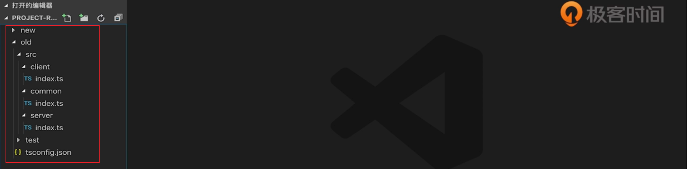
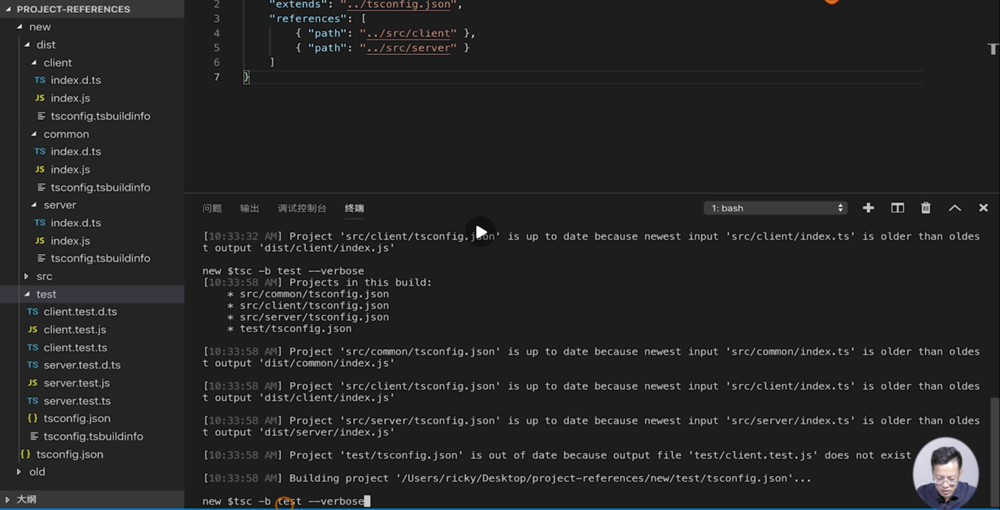
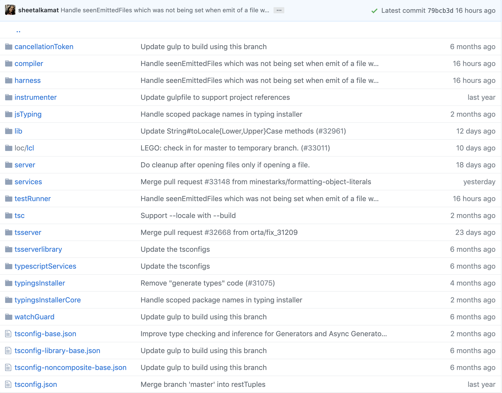

# 28 | 配置tsconfig.json（3）：工程引用

[TOC]

本节课我们来学习 TS 3.0 中引入的一个新特性——工程引用，下面我们来看一下这个特性引入的背景。

## old

有时候我们会在一个代码仓库中存放多个需要单独构建的工程，比如下面这个例子：



`old` 目录中是一个全栈的工程，客户端和服务端的代码会放在各自的目录下，此外前后端还会引用一些公用的代码，我们会提取出 `index.ts` 来放在 `common` 文件夹下：

```ts
export function getTime() {
	let time = new Date();
  return `$(time.getFullYear()}-${time.getMonth() + 1}-${time.getDate()}`
}
```

这个文件中我们定义了一个函数 `getTime` ，它简单的计算了一下当前的时间，然后在 `client` 端和 `server` 端我们都会把这个库引入进来然后打印出来。此外还有一些测试用例（在 `test` 目录中），`client.test.ts` 和 `server.test.ts` 它们都分别对 `client.ts` 和 `server.ts` 进行了引用。整个工程会通过一个 `tsconfig.json` 来配置：

```json
{
  "compilerOptions": {
    "target": "es5",
    "module": "commonjs",
    "strict": true,
    "outDir": "./dist"
  }
}
```

这个配置简单，这里指出了输出目录 `./dist` ，当我们进入 `old` 目录执行 `tsc` 命令进行构建后，就会在 `old` 目录下创建 `dist` 目录，`dist` 下也有 `src` 和 `test` 目录：


这里有一个问题，我们不希望在 `old` 目录下有 `src` 层级，我们想把 client | common | server 直接构建到 `dist` 目录下，这样的话，可以在配置中加入 `include` 来实现：

```json
{
  "compilerOptions": {
    "target": "es5",
    "module": "commonjs",
    "strict": true,
    "outDir": "./dist"
  },
  "include": ["src"]
}
```

这样配置之后，client | common | server 目录就直接构建到了 `dist` 目录下，但是这样会忽略 `test` 目录的编译。还有一些不方便的地方就是我们不能单独的构建客户端的应用或者是 server 端的应用，此外，我们也不想把测试用例构建到 `dist` 目录下。

以上的问题都是无法通过单个文件无法解决的，「工程引用」就是用来解决这一类问题的，它可以灵活的配置输出目录，还可以使工程之间产生依赖关系，有利于把一个大的项目拆分成小的项目，同时可以利用增量编译提升编译速度。下面我们来看一下使用「工程引用」改造过的项目。

## new

在 `new` 目录下，代码并没有更改，只是修改了配置文件：


我们将一个大的工程拆分成了四个小的工程—— client、common、server、test（test 中 tsconfig），并且为每一个工程都提供了一个 `tsconfig.json` 的配置。先来看一下位于 `new` 目录下的基础配置：

```json
{
  "compilerOptions": {
    "target": "es5",
    "module": "commonjs",
    "strict": true,
    "composite": true,
    "declaration": true
  }
}
```

在这里我们去掉了 `outDir`，输出的目录由各自的工程各自指定，然后添加了 `composite` 这个配置项，其含义是工程可以被引用，并且可以进行增量编译。然后配置了 `declaration` 用于生成声明文件，这是工程引用所必须的。接下来再看看不同的项目下的配置。

`src/client/tsconfig.json`：

```json
{
  "extends": "../../tsconfig.json",
  "compilerOptions": {
    "outDir": "../../dist/client".
  },
  "references": [
    { "path": "../common" }
  ]
}
```

在这里它们都是继承了位于 `new` 目录下的基础配置，然后指定了输出目录，然后使用 `references` 配置了所依赖的工程，这里是 `common` 。

`src/common/tsconfig.json`：

```json
{
  "extends": "../../tsconfig.json",
  "compilerOptions": {
    "outDir": "../../dist/client".
  }
}
```

`common` 也是继承了这个基础配置，然后指定了输出目录，它没有依赖。

`src/server/tsconfig.json`：

```json
{
  "extends": "../../tsconfig.json",
  "compilerOptions": {
    "outDir": "../../dist/server".
  },
  "references": [
    { "path": "../common" }
  ]
}
```

`server` 工程也是继承基础配置，指定输出目录，依赖了 `common` 工程。

`test/tsconfig.json`：

```json
{
  "extends": '../tsconfig.json',
  "references": [
    { "path": "../src/client" },
    { "path": "../src/server" }
  ]
}
```

这个工程分别依赖了 `client` 工程和 `server` 工程

来构建一下，TS 为了支持工程引用，为我们提供了一种新的构建模式，也就是 build 构建模式，它能够单独的构建一个工程，相关的依赖也会被自动的构建，使用简写 `-b` 参数，先来构建 `server` 端的工程：

```shell
 tsc -b src/server --verbose
```

`--verbose` 能够帮我们打印出一些构建信息。构建完成后，我们可以看到在 `new` 目录下有 `dist` 目录，其目录下有 `server` 和其所依赖的 `common` 目录。

接着用同样的方式构建 `client` 和 `test` ，在构建 `client` 时，可以从构建信息中看到 `common` 由于已经构建过所以不会被再次构建（当然这和增量编译有关，除非能够感知编译文件是否发生变化），这是编译之后的目录结构：



如果我们想要清空构建之后的文件，可以使用 `--clean` 参数，比如想要清空 `test` 构建之后的文件：

```shell
tsc -b test --clean
```


从以上我们可以看出工程引用的优点：

1. 解决了输出目录的结构问题
2. 解决了单个工程构建的问题
3. 通过增量编译提升了构建速度

其实 TS 项目本身已经用工程引用改造过了，来看一下：

来到 [TypeScript 项目的 Github 仓库](https://github.com/microsoft/TypeScript)的 src 目录中，可以看到有基础配置 `tsconfig.base.json` ：



然后其他的文件夹都是一个个的子工程，比如 `tsserver`，里面也有一个配置文件：

```json
{
    "extends": "../tsconfig-noncomposite-base",
 
    "compilerOptions": {
        "outFile": "../../built/local/tsserver.js",
        "types": [
            "node"
        ]
    },
    "files": [
        "server.ts"
    ],
    "references": [
        { "path": "../compiler", "prepend": true },
        { "path": "../services", "prepend": true },
        { "path": "../jsTyping", "prepend": true },
        { "path": "../server", "prepend": true }
    ]
}
```

首先继承了基础配置，然后在 `references` 中配置了它所引用的工程。


TS 官方的配置是一个很好的参照，建议去学习一下，看看它是如何利用「工程引用」这个特性来支撑着么一个庞大的项目构建的。

 

