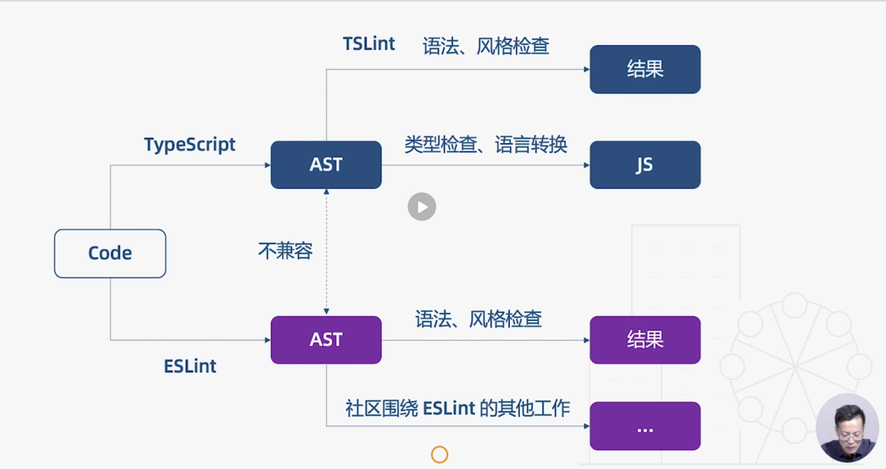

# 30 | 代码检查工具：从TSLint到ESLint

[TOC]

本节课我们来学习 TS 的代码检查工具。

目前围绕 TS 有两种代码检查工具——TSLint 和 ESLint，今年 1 月官方宣布它们将专注 ESLint 并且计划把 TS 仓库的代码检查工具从 TSLint 向 ESLint 迁移，做出这个决定主要有两个原因：

1. TSLint 执行规则的方式存在一些架构问题，从而影响性能，而修复这些问题会破坏现有的规则；
2. ESLint 的性能更好，并且社区用户通常拥有 ESLint 的规则配置（比如针对 React 和 Vue 的规则），而不会拥有 TSLint 的配置。

这个决定受到社区用户户的广泛欢迎，毕竟大家都不想学习那么的工具，同样的工具掌握一个好用的就可以了。

既然官方给出了方向，我们就不把 TSLint 作为本节课的主要内容，我们将重点学习 ESLint 在 TS 中的应用。


## 使用了 TypeScript，为什么还需要 ESLint？


从上一节中我们知道，TS 编译器主要做两件事情，一个是「类型检查」，一个是「语言转换」，在这个过程中通常也会对一些语法错误进行检查，而 ESLint 除了能够检查语法，还能够保证「代码风格」的统一，比如语句的最后是否加上分号。两者的功能有一些重合，但也各自有独特的职责，但是要 ESLint 去检查 TS 的语法，就会面临一些问题，它们在进行各自的工作之前都需要将代码转换成「抽象语法树」，也就是 AST，而这两种语法树是不兼容的。相反，TSLint 就是完全基于 TS 的抽象语法树工作的，当然好处是没有兼容性问题，缺点是不能重用，目前社区已经围绕 ESLint 做了一些工作了，这也是官方放弃 TSLint 的原因：



那么如何解决这种兼容性问题？

我们需要使用 `typescript-eslint` 项目，这个项目也是具有官方血统的，所以我们可以放心的使用。它为 ESLint 专门提供了解析代码的编译器，可以把 TS 语法树转换成 ESLint 所期望的语法树，也就是 ES-tree。下面将介绍如何在 TS 中使用 ESLint。

## 在 TS 中使用 ESLint

依然基于 helloWorld 工程进行改造，在项目中安装了一些包，比如 `eslint` 两个插件——`@typescript-eslint/eslint-plugin` 这个插件可以使 ESLint 识别 TS 的一些特殊语法，`@typescript-eslint/parser` 这个检查是为 ESLint 提供解析器。

然后，我们再看一下 ESLint 的配置——`.eslintrc.json`：

```json
{
  "parser":"@typescript-eslint/parser",
  "plugins":["@typescript-eslint"],
  "parserOptions": {
    "project": "./tsconfig.json"
  },
  "extends": [
    "plugin:@typescript-eslint/recommended"
  ],
  "rules": {
    "@typescript-eslint/no-interrable-types": "off"
  }
}
```

这里通过：

- `"parser"` 字段指定一个解析器

- `"plugins"` 字段指定插件
- `"parserOptions"` ，有些解析规则是需要类型信息的，我们可以利用 `./tsconfig.json` 中的类型信息。
- `"extends"` 可以用于配置具体的规则，这里使用官方推荐的 `recommended` 规则。
- `"rules"` 允许我们对颗粒度更细的规则进行控制，比如这里关闭了对类型注解的提示，打开则提示我们使用 TS 的类型推断来确定变量类型而不是使用类型注解。

然后，我们添加了一个 `lint` 脚本，会自动的检查 ts 和 js 文件——`package.json`：

```json
{
  "scripts": {
    "lint": "eslint src --ext .js,.ts"
  }
}
```

下面来执行一下：

```shell
npm run lint
```

除了使用脚本做代码检查，我们还可以安装 ESLint 的插件来辅助我们的开发（比如 VSCode 的插件）。

安装好之后，我们来看一下它的配置项——在`settings.json`中：

```json
{
  // 保存时自动修复
  "eslint.autoFixOnSave": true, 
  // 指定 ESlint 所检测的一些语言
  "eslint.validate": [
    "javascript",
    "javascriptreact",
    {
      "language": "typescript",
      "autoFix": true
    },
    {
      "language": "html",
      "autoFix": true
    },
    {
      "language": "vue",
      "autoFix": true
    }
  ]
}
```

如果使用以上的配置，然后我们把 `.eslintrc.json` 中之前配置的 `"rules"` 删除：

```json
"rules": {
    
}
```

则会将这样的代码：

```ts
let hello: string = 'Hello TypeScript'
```

在保存之后，自动修复为这样的代码：

```ts
let hello = 'Hello TypeScript'
```

也就是将类型注解删除了。


可能你也使用了 babel 的 ESLint，下面我们来对比一下，babel-eslint 和 typescript-eslint 的区别：

- babel-eslint：支持 TypeScript 没有的额外的语法检查，抛弃 TypeScript，不支持类型检查。
- typescript-eslint：基于 TypeScript 的 AST 工作，支持创建基于类型信息的规则（tsconfig.json）

给大家的建议：

- 两者底层机制不一样，不要一起使用。
- Babel 体系建议使用 babel-eslint，否则可以使用 typescript-eslint。


