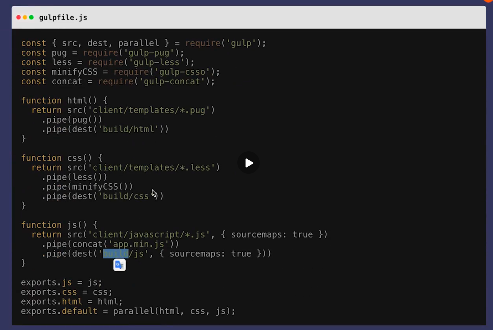

# 04 | Node.js可以用来做什么？

[TOC]

这节课会介绍 Node.js 现阶段可以用来做什么样的项目以及这些项目为什么会采用 Node.js 作为它们的底层技术。

## Web 服务 - 腾讯视频

Node.js 现阶段被广泛的用在 web 服务的开发上。比如「腾讯视频」。那「腾讯视频」为什么会使用 Node.js 作为 web **服务器的中间层**呢？因为两个需求：

- 搜索引擎的优化
- 网页首屏的加速

这两个需求决定了要做服务端的渲染（SSR），也就是：

搜索引擎优化 + 首屏速度优化 = 服务端渲染

做服务端渲染的时候需要考虑到前后端代码复用的问题，同一份代码可能在前端渲染也可能在后端渲染，这就是前后端同构，由于同一套代码要在前后端都能够渲染，所以使用 Node.js 是非常好的。

## 构建工作流

构建工作流是现在 Node.js 被广泛运用的一个层级：

有两个典型的工具

- 一个是 `gulp` 
- 一个是 `webpack`

先来看一下 `gulp` ：

这是官网的一个例子，这个例子中对 html、css、js 做了一些预处理。比如 css，是使用 less 来写的，但是可以将其编译成 css，然后再放到生成目录上，比如 js，是使用了很多 js 文件，然后将其 concat 打包为一个文件 `app.min.js` 并且做了压缩混淆放到生产目录上。

`gulp` 就是在做文件的操作和编译的工作。

接下来看一下 `webpack` 官网：

webpack 就是打包所有的样式、js、图片等等（打包可以理解为将分散的物品放进一个或者多个包里面使其成为一个新的整体性、封闭性的物件）。前端优化的一个重要原则就是将这些资源尽可能的打包到尽可能少，这样就能够尽量使用更少次数的 html 连接，从而加速网页的加载。

为什么要使用 Node.js 来做前端构建工具呢？

在有 `gulp` 或是 `webpck` 之前，前端是如何做的构建工具的呢？可能会用 java、ruby、shell 等等来做一些构建的工具。但是这些构建工具不可能永远不出问题，而且它们也不可能永远满足需求，而我们要查这个构建工具的问题，或者说对这个构建工具做一些扩展的时候就会发现如果使用不同的语言来实现这个构建工具，那前端程序员是很难对这些构建工具进行修改或是问题查找的。

所以，使用 Node.js 来做前端的构建工具是非常保险的一个选择，所有的前端开发者都可以去排查问题，并且也能够为构建工具的社区做出贡献。

## 开发工具 - VSC

VSC 就是使用 Node.js 技术来做的开发者工具，底层是基于 Electron 来实现的。Electron 是在 Node.js 的基础上封装了一层 chrome 的内核，Node.js 和 chrome 的结合可以使开发者在 Node.js 中再跑一个 chrome，或者说在 chrome 中再跑一个 Node.js。同时具备 Node.js 对整个计算机的控制能力以及网页的渲染能力。

## 游戏 - wayward

wayward 是基础 Node.js 的，为什么它是基于 Node.js 的呢？

- 大型应用（比如 wayward 或 VSC）需要给使用者自定义模块的能力。

使用 Node.js 做复杂本地应用

- 可以利用 JS 的灵活性提供外部扩展
- JS 庞大的开发者基数让他们的灵活性得到利用

## 客户端应用 - twitch.tv

twitch 的网页和客户端应用是长的一样的，也就是说他们是在有网页的情况下开发的客户端应用，这时候如果使用 Node.js，Node.js 来实现他们的客户端应用就可以最大限度的复用他们的网站工程，因为底层都是使用的 chrome 内核，只不过一个使用的是 node.js，一个使用的是 chrome。

- 在已有网站的情况下需要新开发客户端使用。
- 用 Node.js 客户端技术（electron）实现，最大限度复用现有工程。

