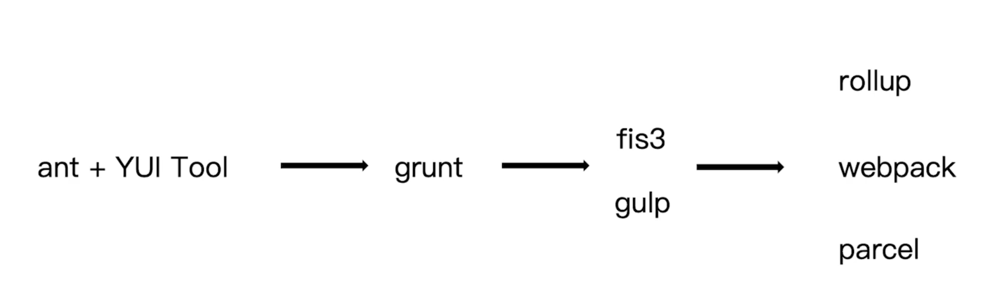
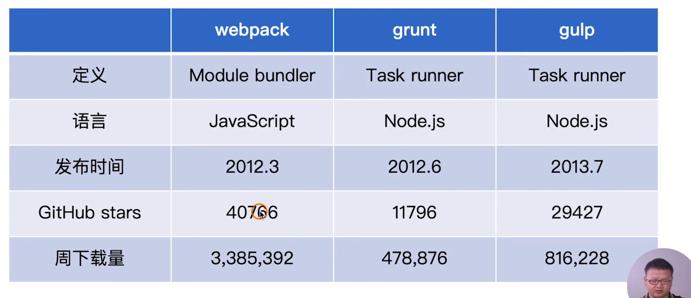
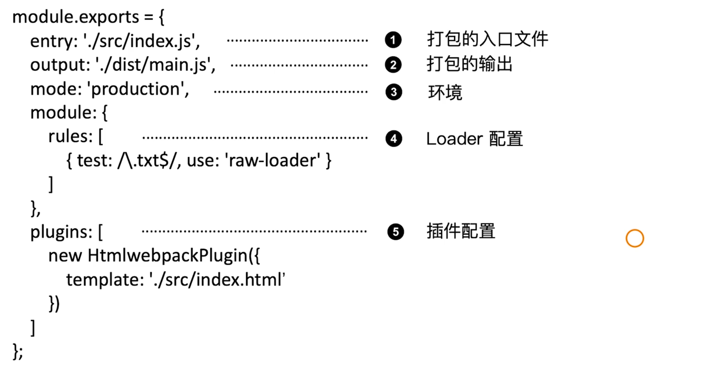
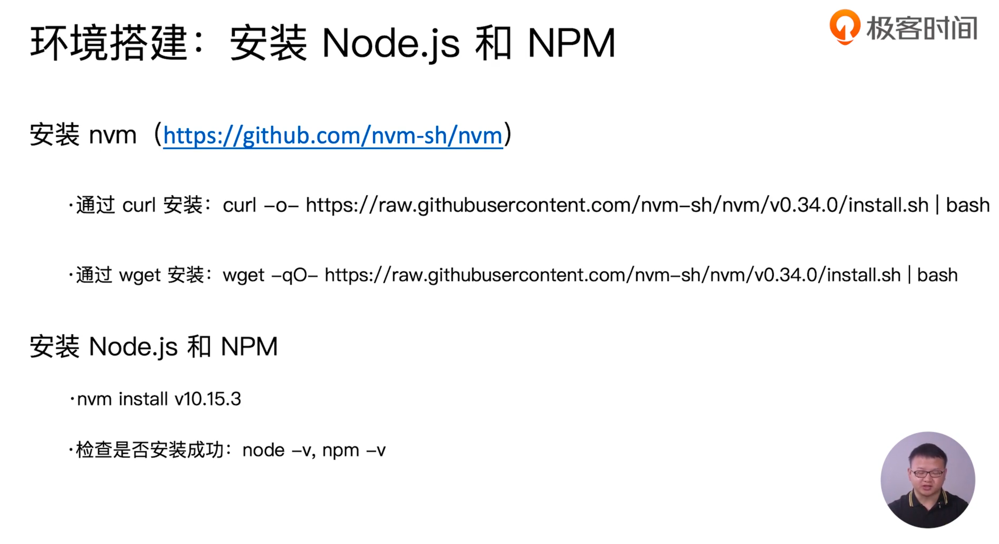
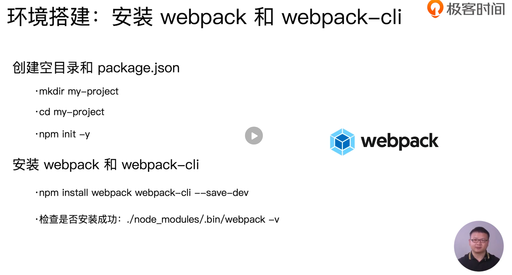
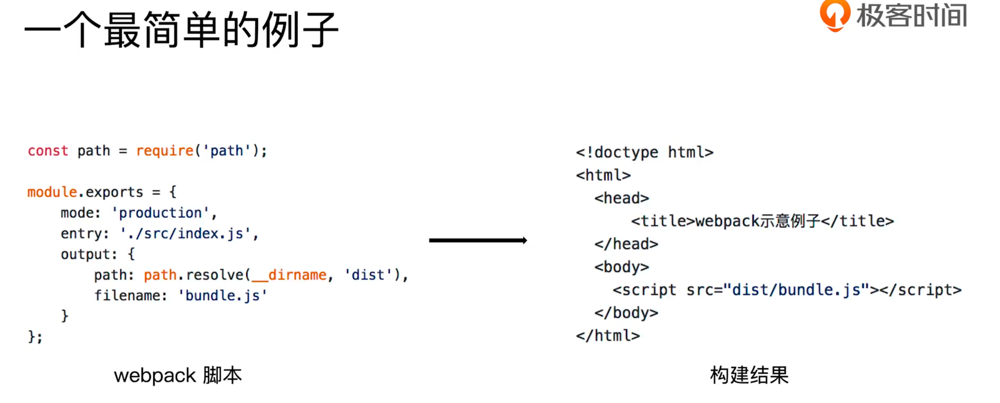
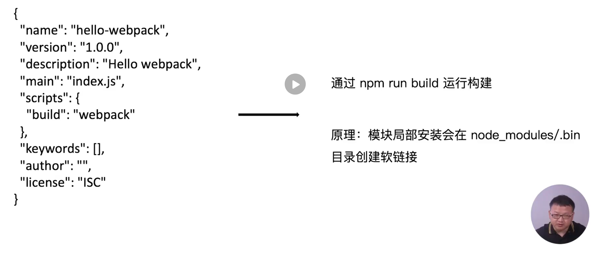

# 01 | 基础篇：webpack 与构建发展简史

[TOC]

## 03  |  为什么需要构建工具

### 问题

为什么我们需要构建工具？构建工具的作用在哪里？

- 转换 ES6 语法
  - 从目前来看，ES 的版本每年都在更新，从 ES2015 到 ES2016 再到 ES next 。每一次的更新都会推出一些新的语法和好用的 API，并且我们也在广泛的使用这些新语法和 API 。但是这些语法和 API 在浏览器中的兼容情况并不太好，尤其是在低版本的浏览器或是一些国产特别的浏览器中。所以，在当前的阶段使用构建工具去转换到 ES6 或是更高版本的语法还是很有必要的。
- 转换 JSX
  - 现在的开发基本上都是使用三大框架，那在框架层面也会涉及到一些语法糖，比如说 JSX、Vue 指令、angular 指令等等，这些语法糖浏览器本身也是无法识别并编译的。所以，也是需要使用构建工具转换为能够为浏览器所识别的 JS 代码。
- CSS 前缀补全/预处理器
  - 开发中编写样式文件时，其实很多时候都会使用像 less、sass 等样式语言，这样的好处是书写 css 也能像一般的计算机语言一样进行逻辑处理，方便而快捷。但是，同样使用这些语言浏览器依然无法识别，所以需要使用预处理器来帮助我们将其编译为 css。而构建工具也提供了这样的预处理器方便我们使用。
- 压缩混淆
- 图片压缩

因此，我们认为构建构建工具还是必不可少的，至少在现阶段的开发中是无可取代的。


### 课后问答

首先，需要对我们的JS、CSS、html或者语言框架做一个转化，处理ES6、SASS或HTML模版等，因为浏览器对以上这些支持不同；其次，是为了使用插件，使开发变的简单

> 作者回复: 嗯嗯，理解的没问题。前端需要关注：**性能、质量和效率**这三块。**webpack 主要是解决工程效率方面**的问题。


## 04.前端构建演变之路



最早的前端开发是比较黑暗的，因为大家日常的开发都是切图片，然后编写 html、css、js，这些代码也是没有压缩的。

慢慢的，大家开始意识到一个问题，大家希望代码上线后可以做一些混淆，使代码的逻辑没有那么简单的暴露。当时的做法是使用一些在线工具，将本地的源代码上传到在线工具所在服务器，然后进行压缩、混淆后再下载到本地的目录。这样的过程实际上非常的繁琐。

到了 07、08 年的时候出了一个 YUI Tool 工具，这个工具在当时应用广泛，主要是和 ant 进行结合的使用，通过在本地对 css、js 进行压缩。

使用这种方式进行开发过了几年之后，由于业界的 requireJS 等等模块化概念的出现，和代码的复杂性问题，则开始使用 grunt 工具。grunt 会将整个构建过程分为一个一个的任务，每一个任务做一件事情，比如在 grunt 内部可以将整个打包过程分为解析 html、解析 css、解析 js，包括图片的压缩，代码 js、css 的压缩，还有图片的一些指纹，文件的一些指纹等等。这都会将其认为是一个个的任务，不过每一个任务处理完成之后会将任务的结果存放到本地磁盘的 .xxx 目录中，这个时候势必会增加打包时间，因为它是由本地磁盘的 I/O 操作，由于这个问题也演变出了 gulp。

gulp 的做法虽然和 grunt 一样是任务打包器，但是 gulp 由一个文件流，每一步所构建出来的结果本不会存放到本地磁盘目录中，而是会直接存放到内存中，然后下一个步骤所需要使用的文件可以直接从内存中读取，从而大大加快打包的速度。

这一阶段 baidu 也是推出了 fis3 工具，fis3 打包理念在当时是比较先进的，里面对资源颗粒度的控制也非常的精细。不过目前官方团队已不在对 fis3 进行维护。

现阶段使用最为广泛的还是 webpack，webpack 之外还有 rollup 和 parcel，这两个工具也是有一部分的团队在使用。

当然，这里面所列举的构建工具并不是非常的完整，除了以上列举的这些还有差不多 10 种左右的构建工具。


下一节课，我们来看一下为什么选择 webpack。


## 05.为什么选择webpack

在上一节课中我们了解到社区所提供的构建工具还是非常的多的，那最终为什么我们选择了 webpack？

### 活跃度

首先，得益于 webpack 社区的**活跃度**：



从 GitHub starts 数量和周下载量可以看出相比于 grunt 和 gulp，webpack 的认可和使用人数有很大的优势。

### 丰富

官方维护的插件目前有很多。可以去官方看到有很多 loader 和 plugin 供我们使用。

### 配置灵活和插件化扩展

如果目前官方或是社区所提供的插件不能满足你项目的需求，那么你可以通过 webpack 所提供的插件机制进行扩展，可以自己定义 loader 和 plugin 来满足自己项目个性化的需要。

### 官方更新迭代速度快

webpack 从 14 年到目前 19 年发布了很多版本，从 1 到快到发布的 5，这期间基本上是一年发布一个新的版本，可以看出，webpack 官方对工具的维护有很高的频率。


正是由于以上优点使 webpack 成为现如今最为流行的构建工具，下节课开始从 webpack 的配置文件来了解它。


### 课后问答

grunt跟gulp已经算是过时的工具了。我觉得现在要对比，应该对比parcel跟rollup。
为什么制作库时，多数人都会选择rollup？
parcel这种全能零配置的会有什么问题？

> 作者回复: 这里选择 grunt、gulp 和 webpack 进行对比主要出于2点考虑：
>
> 1. 前端构建演变过程 grunt 和 gulp 确实是大家在实际项目里面广泛使用过的，具有代表性
> 2. 另外，从 npmjs 社区的下载量来看：grunt周下载量是601,814，gulp是1,198,561，webpack是7,447,138，rollup是695,223，parcel是695,223。
>
> 另外回答下您提出的这两个问题：
> 制作库选择 rollup 主要是 rollup 之前对 Tree-shaking 支持的比较友好，而且打包组件相对来说不需要太复杂的功能，比如 Code splitting 特性。
> Parcel 之前我们团队实践过，社区生态和webpack差的很多，虽然是号称0配置，但是实际复杂项目往往不够用，目前来看更加适合简单或者小型的项目来尝试。


## 06 | 初识webpack

在安装和使用 webpack 之前，我们先来了解 webpack 的配置文件。

### 配置文件名称

webpack 默认配置文件：webpack.config.js

可以通过 webpack --config 指定配置文件

比如，开发过程中：

```shell
webpack --config webpack.dev.js
```

生产环境：

```shell
webpack --config webpack.prod.js
```

除此之外，也可以指定一些其他场景下的配置文件，比如服务器端渲染。

### 配置组成



webpack 配置主要包括上面所列的 5 种：

- entry
- output —— 输出到磁盘的某个位置，和文件名称
- mode —— 指定环境，是为生产环境还是为开发环境打包
- module —— 对 rules 数组中指定，多个 loader 都放到这个 rules 数组中
- plugins —— 插件，依然是个数组，也可以放置多个插件

### 零配置的 webpack 包含的内容

4.0 版本提供了零配置的功能，我们不需要编写配置也能进行打包。


零配置的 webpack 包含 `entry` 和 `output` 这两个字段，对于 `mode` `module` `plugins` 是没有做任何的配置。因此，零配置的 webpack 相当于默认打包入口文件是 `./src/index.js` ，默认输出到 `./dist/main.js`


## 07 | 环境搭建：安装webpack

在安装 webpack 之前需要安装 node.js 和 nvm，因为 webpack 依赖 node.js 的环境。

### 安装 nvm

这里我们先安装 nvm，再通过 nvm 安装 node.js。

可以通过 `curl` 或者 `wget` 来进行安装。

这里使用 `curl` 安装。

```shell
curl -o- https://raw.githubusercontent.com/nvm-sh/nvm/v0.34.0/install.sh | bash
```

安装之后，添加到环境变量：

```shell
source ~/.bash_profile
```

验证是否安装成功：

```shell
nvm list
```

- list 可以查看本地所安装的 Node.js 版本

### 通过 nvm 安装 Node.js

```shell
nvm install v10.15.3
```

### 环境搭建：安装 webpack 和 webpack-cli 

由于在 webpack4 将 webpack 内核和 webpack-cli 进行了分离，因此在实际项目中使用时，我们需要同时安装 webpack 和 webpack-cli。



- `npm init -y` 中，`-y` 是默认都选择 yes，生产初始包说明描述、说明文件——`package.json`
- `--save-dev` 把安装的包添加到 `package.json` 的 `devDependencies` 字段中，用于描述说明此包是用于开发环境的。


### 课后问答

为什么不说一下nvm是什么呢……

> 作者回复: 这个以为大家都知道了，nvm(Node.js Version Manager)也就是 Node.js 的版本管理器，可以通过它方便安装和切换不同的Node.js 版本。


## 08 | webpack初体验：一个最简单的例子



这个例子非常的简单，只是设置了 `mode` `entry` `output` ，并且这个例子打包很麻烦，每一次都需要使用：

```shell
./node_modules/.bin/webpack
```

来进行打包，下一节将会讲解如何更将便捷的使用 webpack 进行打包。


### 课后问答

请问一下老师，为什么配置文件moduls.exports换成export default后运行就有问题？而在页面中使用export default则正常。

> 作者回复: 是因为 webpack 的这个配置没有经过 babel 转换。而这个项目的src 内的代码经过了 babel 转换


## 09 | 通过 npm script 运行 webpack



模块局部安装会在 `./node_modules/.bin` 目录创建软连接，而 `package.json` 文件可以默认的读取到 `.bin` 目录下的这些命令，因此可以在其中添加 `scripts` 字段，在 `scripts` 中指定 `webpack` 即可。从而当你执行 `npm run build` 脚本时就会自动的去 `./node_modules/.bin` 寻找所要执行的 `webpack` 包。


之前的几个小节，我们系统的回顾了一下前端的构建历史以及 webpack 安装和基本的使用，接下来在下一个章节我们将会深入的去学习一些基础概念，然后在基础概念中将会介绍 webpack 中的 entry、loader、plugin 等这些具体的用法，同时我们也会介绍在 webpack 中如何做代码的压缩、文件指纹以及在开发过程中热更新的技巧。

