# 02 | 基础篇：webpack 基础用法

[TOC]

## 10 | webpack 核心概念之 entry

### 什么是 entry

entry 用来指定 webpack 的打包入口

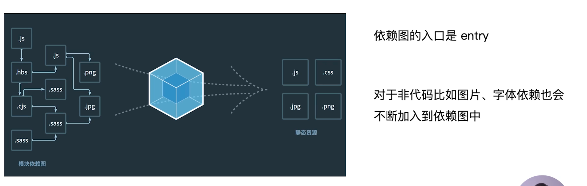

webpack 与其他打包器不同的是，它是一个模块打包器，它会把一切的资源，无论是 js、css 这些代码资源，还是比如图片、字体等非代码资源都当作是模块，这些所有的模块，它们之前会存在一些依赖关系。因此 webpack 就会根据 entry 所设置的入口文件去寻找整个打包过程中所引入的依赖文件并形成依赖树，根据这个依赖树和 loader 或是 plugin 来进行打包并生成最终打包后的文件。

### entry 的用法

两种用法（情况）：

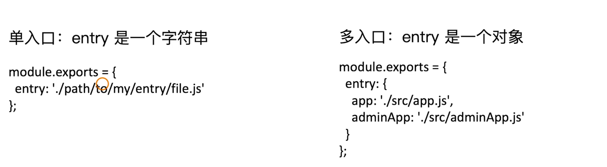

- 单入口
  - 比较适用于一个项目中只有一个入口文件，比如只有一个页面或者是单页应用。
  - entry 为字符串形式。
- 多入口
  - 适合多页面的场景，也就是通常所说的多页应用。
  - entry 为对象


### 课后问答

老师好，视频中有提及到entry属性有“单入口”和“多入口”的区别，“单入口”比较好理解，就是单页应用spa的入口；那么entry在配置“多入口”时，会output出数量同等，名字和入口一致的js文件吗？还有，通常多页面应用是有很多个html文件的，那么后续又如何生成这些html文件呢？麻烦解答~

> 作者回复: 嗯嗯，多页面打包是一个很常见的场景，在第三章也会详细介绍到。下面会对你问的这两个问题分别介绍下：
>
> 1. 多个 entry 的时候，最基本的是输出的 js 数量和 entry 数量相同的，js 文件的名字通常是和 entry 的 key 名字一样。比如：
>    entry: {
>        index: './src/index/index.js',
>        search: './src/searc/index.js'
>    }
>    对应输出的 js 文件应该是 index.js 和 search.js。
>
> 当然了，如果你有做一些代码分割，那么生成的 js 文件会更多，不过页面的主 js 文件数量和 entry 数量是一致的。
>
> 2. html 的数量和 entry 的数量也是一致的，如果也是1里面提到的 entry，那么将会生成： index.html 和 search.html。这个可以借助 html-webpack-plugin(https://github.com/jantimon/html-webpack-plugin) 达到效果


请问老师，可以把 css 文件加到 webpack 的入口文件里吗

> 作者回复: 不可以，目前入口文件只支持 js，其它的如html和css都不支持


## 11 | webpack核心概念之 output

Output 用来告诉 webpack 将编译后的文件如何输出到磁盘，并指定所输出的目录和名称。所以，`entry` 对于源代码，`output` 指定经过编译打包后的结果代码。

### output 的用法

#### 单入口配置

```js
module.exports = {
  entry: './path/to/my/entry/file.js',
  output:{
    filename: 'bundle.js',
    path: __dirname + '/dist'
  }
}
```

只需要指定 `output` 对象中的 `filename` 和 `path` 参数字段即可。

#### 多入口配置

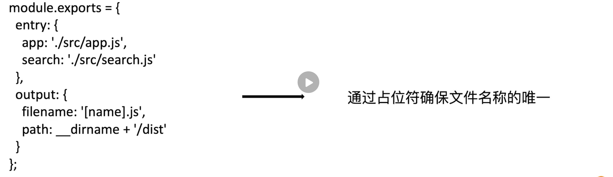

在 `output` 中并没有多个出口的说法，不管是一个入口还是多个入口，在 `output` 中都只有一个出口，只是利用了占位符的方式来实现了这一点。在 `filename` 字符串值中有 `[name]` 充当一个占位符，并且它也是指定打包之后产生的名称


## 12 | webpack核心概念之loaders

webpack 开箱即用只支持 JS 和 JSON 两种文件类型，而其他的像 css、less、jsx、vue 等这些 webpack 是无法处理的，所以，**通过 loaders 去支持其他文件类型并把它们转化成有效的模块，添加到依赖树中**。

其本身是一个函数，接受源文件作为参数，返回转换的结果。并且转换的结果也可能会被下一个 loader 继续转化。

### 常用的 Loaders 

| 名称          | 描述                             |
| ------------- | -------------------------------- |
| babel-loader  | 转换ES6、ES7等 JS 新特性语法     |
| css-loader    | 支持 .css 文件的加载和解析       |
| less-loader   | 将 less 文件转换成 css           |
| ts-loader     | 将 TS 转换成 JS                  |
| file-loader   | 进行图片、字体、富媒体文件等打包 |
| raw-loader    | 将文件以字符串的形式导入         |
| thread-loader | 多进程打包 JS 和 CSS             |


### loaders 的用法

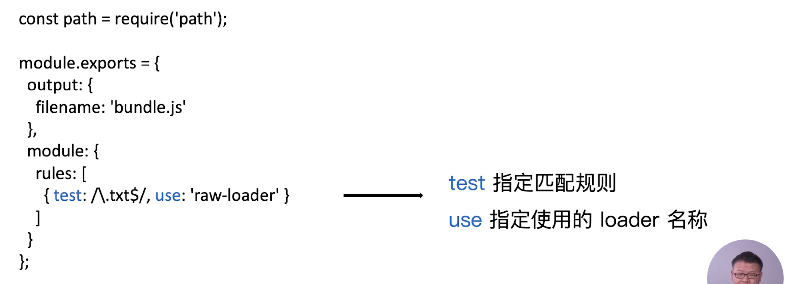


### 课后问答

.less 文件经过 less-loader 处理成 .css 文件之后，是否还会经过 css-loader 的处理呢?
也就是说，loader 之间应该也存在叠加处理，类似流水线一般的吗?比如 url-loader 和 file-loader 之间
希望老师能解答，谢谢。

> 作者回复: Q: .less 文件经过 less-loader 处理成 .css 文件之后，是否还会经过 css-loader 的处理呢?
> A: 需要的，每个 loader 一般只做一件事情。拿解析 less 为例，需要先将 less 转换成 css，这个是 less-loader 处理，处理成 css 之后，但是由于 webpack 并不能识别 css 文件，依然需要 css-loader **将 css 转换成 commonjs 对象放到 js 里面**，最后页面渲染的时候要想把样式显示出来，需要借助 style-loader 或者 MiniCssExtractPlugin.loader 把 css 插入到 html 里面的 style 或者以 link 外部 css 的方式。
>
> 每个 loader 就是一个函数，可以把这个过程理解成流水线的方式。
>
> Q: loader 之间应该也存在叠加处理，类似流水线一般的吗?比如 url-loader 和 file-loader 之间
> A: 这个就看写 loader 的作者了，可以把 loader 的职责分的更细，比如把 url-loader 的功能拆成 file-loader 和一个用于 base64 的 loader，也可以一个 loader 做几件事情。我更倾向把 loader 责任划分的更细和清楚。


## 13 | webpack核心概念之plugins

`loader` 是处理 `webpack` 原生无法处理的文件，`plugins` 用于增强 `webpack` 的功能，比如打包 JS 文件的优化、资源的管理、环境变量的注入、删除构建目录。也可以将 `pulgin`  理解为任何 `loaders` 无法处理的事都可以通过 `plugins` 来完成。

`plugins` 作用于整个构建过程中，在整个构建阶段都可以使用它。

### 常用的 plugins

| 名称                    | 描述                                             |
| ----------------------- | ------------------------------------------------ |
| splitchunksplugin       | 将 chunks 相同的模块代码提取成公共 js            |
| CleanWebpackPlugin      | 清理构建目录                                     |
| mini-css-extract-plugin | 将 CSS 从 bundle 文件里提取成一个独立的 CSS 文件 |
| CopyWebpackPlugin       | 将文件或者文件夹拷贝到构建的输出目录             |
| HtmlWebpackPlugin       | 创建 html 文件去承载输出的 bundle                |
| UglifyjsWebpackPlugin   | 压缩 JS                                          |
| ZipWebpackPlugin        | 将打包出的资源生成一个 zip 包                    |

### plugins 的用法


### 课后问答

extracttextwebpackplugin 这个插件在webpack4中已经换了mini-css-extract-plugin了吧，另外commonsChunkPlugin这个插件在webpack4中目前也不推荐使用了吧，希望老师提供的这些插件也能同步成最新的吧，要不然部分同学使用过程中会出现问题

> 作者回复: 是的。extract-text-webpackplugin 已经替换成mini-css-extract-plugin，commonsChunkPlugin 替换成了 splitchunksplugin。这个后面会修正下。

## 14 | webpack核心概念之mode

`mode`是 webpack4 所提出的概念，用来指定当前的构建环境是：`production`、`development` 还是 `none`。

好处是，设置 `mode` 可以自动的触发 webpack 内置的函数，默认值为 production。比如你设置为 `development` ，那么 webpack 就会默认的开启在开发阶段比较实用的参数，如果设置的是 `production` ，则会默认开启在生产阶段所能使用的插件和功能，如果设置为 `none` 则 webpack 什么都不会做。

### Mode  的内置函数功能

| 选项          | 描述                                                         |
| ------------- | ------------------------------------------------------------ |
| `development` | 设置 `process.env.NODE_ENV` 的值为 `development` ；开启 `NamedChunksPlugin` 和 `NamedModulesPlugin` |
| `production`  | 设置 `process.env.NODE_ENV` 的值为 `production` ；开启 `FlagDependencyUsagePlugin` 、`FlagIncludedChunksPlugin` 、`ModuleConcatenationPlugin` 、 `NoEmitOnErrorsPlugin` 、`OccurenceOrderPlugin` 、 `SideEffectsFlagPlugin` 和 `TerserPlugin` |
| `none`        | 不开启任何优化选项                                           |

- `development` —— `NamedChunksPlugin` 和 `NamedModulesPlugin` 两个插件会在代码的热更新阶段（hamr）在控制台中打印出是哪个模块发生了热更新，模块的路径又是什么。
- `production` —— 这些插件会做生产阶段代码的压缩，会默认的识别 `package.json` 中 side-effect 参数，也就是代码中是否存在副作用的参数，还有其他一些场景。


### 课后问答

请教下老师，process.env.NODE_ENV 到底是什么呢，是 node 提供的运行环境参数还是啥？

> 作者回复: 是的。process.env 这个会返回用户的环境变量，而NODE_ENV是环境变量里面用的较多的一个，用来设置当前构建脚本是开发阶段和生产阶段。如果将mode设置成development，则process.env.NODE_ENV的值就是development，production也同理


## 15 | 解析ECMAScript 6和React JSX

webpack 原生支持 JS 的解析，但如果是 ES6 或是 JSX 则 webpack 默认无法解析。因此，我们需要借助于 `babel-loader` 来帮助我们进行解析。

### 使用 babel-loader

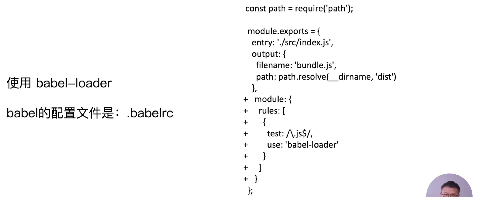

在 `module` 字段的 `rules` 数组中添加一个对象，这个对象中的 `test` 字段为匹配规则，这里我们匹配的是 `.js` 文件，`use` 字段的值则是对所匹配到的文件需要使用到的 `loader`，这里是 `babel-loader` 。


`babel-loader` 依赖于 `babel` ，那么就需要在项目中使用到其配置文件——`.babelrc` （rc——run configure || run commands）

### 解析 ES6

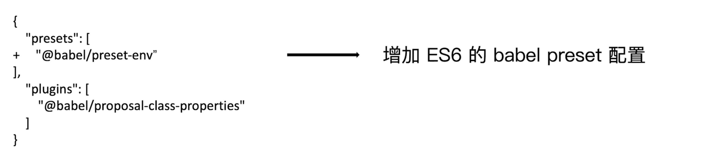

babel 有两个概念——`presets` 和 `plugins` 

- `plugins` 可以理解为一个 `plugin` 对应一个功能
- `presets` 是一系列 `plugins` 的集合

这里我们解析 ES6 ，需要安装 `@babel/preset-env` 并配置。

要使用 `babel-loader` 解析 ES6 ，我们需要安装如下包：

```shell
npm i @babel/core @babel/preset-env babel-loader -D		
```

也就是除了用于解析 ES6 的 `@babel/preset-env` 包和帮助 webpack 解析调用 `babel` 的 `babel-loader` 包之外，还需要安装 `@babel/core` 这个包。

### 解析 React JSX 或是 Vue 的语法

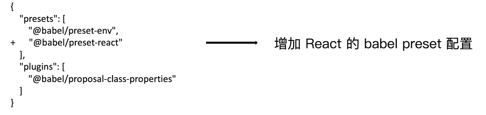

在 `@babel/preset-env` 基础上添加 `@babel/preset-react` 的配置。

安装如下配置：

```shell
npm i react react-dom @babel/preset-react -D
```


### 课后问答

`npm i react react-dom @babel/preset-react -D`;这样把react react-dom放在devDependencies中没问题吗？我想知道package.json中dependencies和devDependencies的区别...

> 作者回复: 嗯，这个是为了演示哈。对于 react和 react-dom 应该是：
> `npm i react react-dom -S`
>
> 对于构建相关配置应该：
> `npm i @babel/preset-react -D`
>
> package.json 中 dependencies 和 devDependencies 的区别是：devDependencies 用于本地环境开发时候，dependencies 用户发布环境，也就是**开发阶段的依赖最后是不会被打入包内**。
>
> 通常框架、组件和 utils 等业务逻辑相关的包依赖放在 dependencies 里面，对于构建、ESlint、单元测试等相关依赖放在 devDependencies 中


##  16 | 解析CSS、Less和Sass

### 解析 CSS

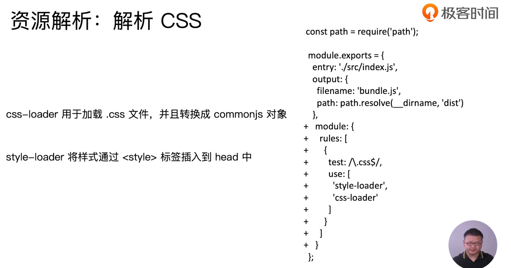

在 webpack 中解析 CSS 需要使用到 css-loader，css-loader 的作用是加载 `.css` 文件，比如 `index.js` 文件引用了 `.css` 文件，则会将其加载并转换为 commonJS 对象插入到代码中。接着，需要通过 `style-loader` 将样式通过 `style` 标签插入到 `<head>` 中。

安装：

```shell
npm i style-loader css-loader -D
```

添加配置：

```js
module:{
  rules:[
    {
      test: /\.js$/,
      use: 'babel-loader'
    },
    {
      test: /\.css$/,
      use:[
        'style-loader',
        'css-loader'
      ]
    }
  ]
}
```

- 注意上面 9 ～ 12 行，当一种匹配规则对应多个 `loader` 时，`use` 的值为字符串 loader 数组，其 loader 对文件的加载顺序为从右到左，因此按照之前的说法，我们需要先使用 `css-loader` 对 `.css` 文件进行处理之后，再使用 `style-loader` 对处理之后的代码进行处理。


### 解析  Less 和 Sass

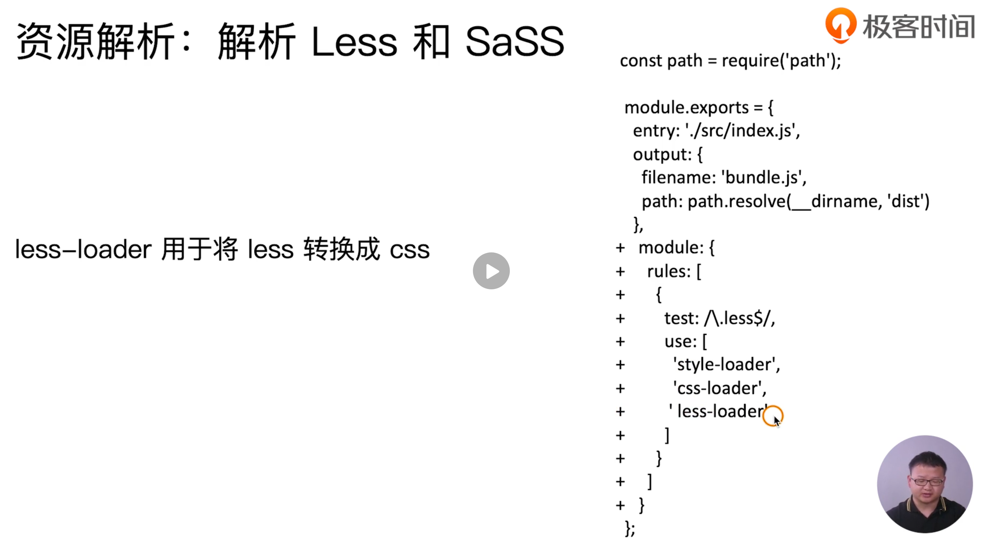

解析 `less` ，只需要在解析 `css` 的基础之上，添加一个 `less-loader` 即可，其作用是将 `less` 转换为 `css` 

安装：

```shell
npm i less less-loader -D
```

- 注意 `less-loader` 需要 `less` ，所以需要安装 `less` 包


### 课后问答

老师，请问style-loader css-loader less-loader分别实现了什么功能，还有顺序那块的执行是类似于compose(style,css,less)这个过程吗

> 作者回复: 函数组合通常有两种方式，一种是从左到右(类似 unix 的 pipe)，另外一种是从右到左(compose)。此处 webpack 选择的是 compose 方式，从右到左依次执行 loader，每个 loader 是一个函数。
>
> style-loader: 向 DOM 插入 style 标签，并且将样式插入进去，这样网页才能解析到
> css-loader: 可以让 webpack 解析 css(因为 webpack 原生只支持 js 和 json 的解析)，并且将解析出来的 css 转换成一个对象，插入到 JS 里面去。
> less-loader: 将 less 转换成 css


## 17 | 解析图片和字体

### 解析图片

解析图片需要使用到一个非常实用的 `loader` —— `file-loader` ，通过 `file-loader` 使我们可以去处理一些文件。

这里，我们需要匹配一些图片文件，比如 `.png` `.svg` `.jpg` `.gif` 等图片资源，然后再使用 `file-loader` 来解析这些匹配的图片文件（其实就是使用 webpack 的配置规则）：


#### 代码部分：

首先在 `./src/assets` 文件夹中添加一张图片（以上文中所添加的匹配文件格式为准），然后在文件中通过 ES6 模块的方式引入并在代码中添加：

```jsx
import catEye from './images/cat_eye_001.jpeg';

class App extends React.Component {
  render() {
    return (
      <>
      <div>I study webpack with React</div>
      <div>
        
      </div>
      <Search />
      </>
    );
  }
}
```

接着安装 `file-loader`：

```shell
npm i file-loader -D
```

最后进行构建即可。

最终，会在构建目录中生成一个带有 hash 命名的图片文件。

### 解析字体

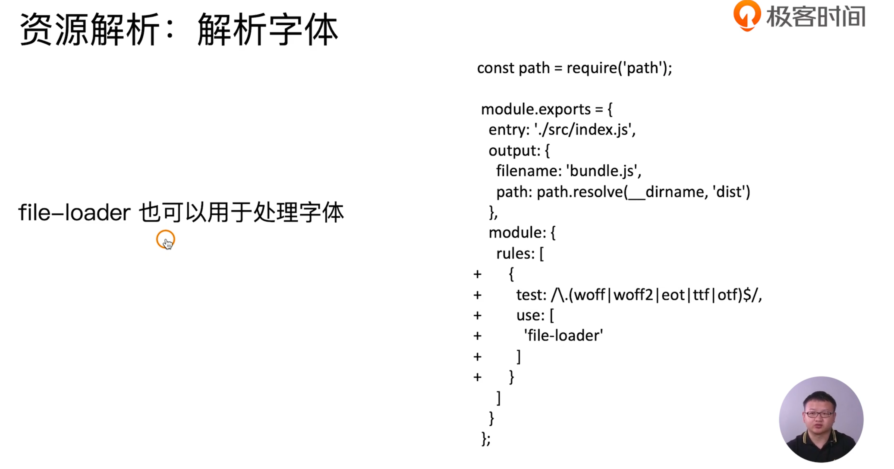

解析字体与解析图片实际上都是一样的，因为图片与字体都非代码文件，图片与字体都采用 `file-loader` 去处理。

#### 代码部分

在 `./src/assets` 目录中添加字体文件，在 `.less` 文件中定义并引用：

```jsx
@font-face{
  font-family: 'Alibaba-PuHuiTi-Medium';
  src: url('./assets/Alibaba-PuHuiTi-Medium.otf') format('truetype');
}

div{
  transition: all .5s;
  font-family: 'Alibaba-PuHuiTi-Medium';
  &:hover{
    margin-left: 100px;
  }
}
```

`@font-face` 的一些规则和语法：

>```css
>@font-face {
>    font-family: <YourWebFontName>;
>    src: <source> [<format>][,<source> [<format>]]*;        
>    [font-weight: <weight>];        
>    [font-style: <style>];      
>}
>```
>
>取值说明
>
>1、YourWebFontName:此值指的就是你自定义的字体名称，最好是使用你下载的默认字体，他将被引用到你的Web元素中的font-family。如"font-family:"YourWebFontName";"
>
>2、source:此值指的是你自定义的字体的存放路径，可以是相对路径也可以是绝对路径；
>
>3、format：**此值指的是你自定义的字体的格式，主要用来帮助浏览器识别**，其值有以下几种类型：truetype,opentype,truetype-aat,embedded-opentype,avg等；
>
>| String              | Font Format                                                  | Common extensions |
>| :------------------ | :----------------------------------------------------------- | :---------------- |
>| "woff"              | [WOFF (Web Open Font Format)](http://www.w3.org/TR/WOFF/)    | .woff             |
>| "truetype"          | [TrueType](http://www.microsoft.com/typography/otspec/default.htm) | .ttf              |
>| "opentype"          | [OpenType](http://www.microsoft.com/typography/otspec/default.htm) | .ttf, .otf        |
>| "embedded-opentype" | [Embedded OpenType](http://www.w3.org/Submission/2008/SUBM-EOT-20080305/) | .eot              |
>| "svg"               | [SVG Font](http://www.w3.org/TR/SVG/fonts.html)              | .svg, .svgz       |
>
>4、weight和style:这两个值大家一定很熟悉，weight 定义字体是否为粗体，style 主要定义字体样式，如斜体。
>
>来源：[CSS：@font-face的使用方法](https://www.cnblogs.com/rainman/p/5498255.html)
>
>注意，除了语法之外，此文还谈到关于字体格式对于不同**浏览器的兼容性**。

然后在 `webpack.config.js` 中添加模块解析规则后进行构建，最终，会在构建目录中生成一个带有 hash 命名的字体文件。

### 图片与字体文件的解析的其他方式

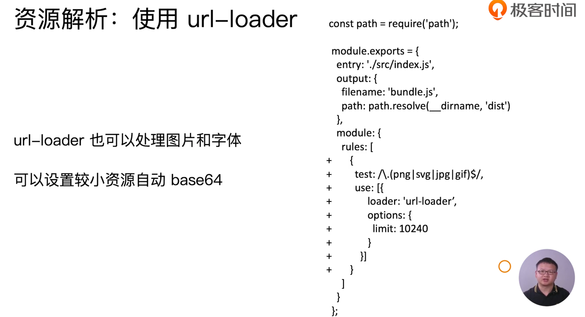

除了使用 `file-loader` 来对资源文件进行解析之外，我们还可以使用 `url-loader` 对资源文件进行解析。

`url-loader` 实际上和 `file-loader` 相差不多，只不过 `url-loader` 相比 `file-loader` 之外还可以对文件较小的字体或是图片做 base64 的转换，当然在 `url-loader` 内部也是使用了 `file-loader` 

在上面的截图中，我们可以看到通过 `options` 字段可以对 `loader` 进行传参，在这里是 `limit: 10240` ，`limit` 的单位为字节，意思是对于小于 10240 字节（10 kb）的文件进行 `url-loader` 的处理。

> 到这里，我们已经知道 `use` 字段可以传入的几种数据类型：
>
> - 字符串——对于使用单一 loader 来对文件进行处理时。
> - 字符串数组——对于使用多 loader 来对文件进行处理时。
> - 对象——对于使用单一 loader 并需要传参进行配置时。
> - 对象数组——对于使用多 laoder 并需要传参进行配置时。
> - 混合数组——即有字符串 loader，也有对象。

#### 实际运用

我们对图片使用 `url-loader`进行解析，webpack 的配置：

```js
module.exports = {
  module: {
		rules: [
  		{
        test: /.(png|svg|jpg|gif|jpeg)$/,
        use: {
          loader: 'url-loader',
          options:{
            limit: 102400
          }
        }
      },
  	]
	}
}
```

- 这里我们限制了文件大小在 100kb 以下，也就是当文件大小小于这个值时则以 base64 的字符形式放到 `src` 的中，而大于这个值则是以文件路径的形式引用。

注意使用 `url-loader` 打包构建文件前后的变化：

之前，使用 `file-loader` ：

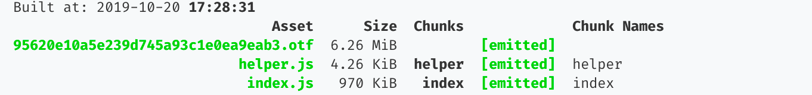

（我们只需要关心 index.js 的变化即可）

之后，使用 `url-loader` ：

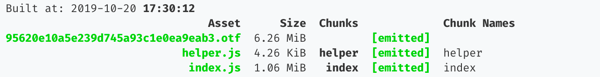

可以看到增加了几十kb 的大小，这部分就是转换成 base64 的字符串。也就是说，转换为 base64 其实就是将文件形式变为了字符形式并嵌入到打包之后的文件中。

### 课后问答

老师，内联样式的图片怎么解析。还有图片如果要做懒加载，又应该怎么设置呢？

> 作者回复: 如果样式是一开始就内联的话，里面的图片是无法解析的。有两种办法可以解决：
>
> 1. 实现一个 loader，这个 loader 用于处理 html 文件，匹配里面的图片内容然后进行解析转换。
> 2. 样式一开始不要写成内联的方式，而是将样式以模块的方式引入进去，构建完成后再将生成的样式文件内联进 html 里面去。
>
> 图片懒加载和构建无关，这个是 JS 层面的事情，**当页面滚动到可视区的时候才将需要显示的图片 src 进行替换**。

> 提问者后续的补充：
>
> - 嗯 怎么说呢就是 我**不写在src上图片不会打包** 所以怎么不写在src把文件的图片输出到dist image 
> - 解决了 我用html-loader设置attr data-src 图片依然能打包 最后再用懒加载塞进src


老师好，看了这个file-loader，貌似实际开发时并不是所有图片都会由js引入，有好几种情况：
1、比如在html里用img的src引用图片，那么这个图片没有被js依赖到，按理就不会去打包输出这个图片。
2、比如在css中使用背景图去引用图片，而这个css是直接link在html内的，同样也不会去打包输出这个图片。
唯独只有js内引用了css文件，才会去打包输出css，顺带把里面背景图引用到的图片输出而已。
会有其他方法去处理这些情况吗？还是后面的章节会介绍到？感谢

> 作者回复: webpack 目前的打包入口只能是以 js 为入口的，暂时还不支持以 html 为入口进行打包，也就是 webpack 默认是不会分析  html 文件里面的依赖(比如 src=xxx 或者 外部 css 中的语法)。可以看下这个 issue  的讨论：（https://github.com/webpack/webpack/issues/536）
>
> 针对你说的这两个问题的处理办法是：
>
> 1. 比如在html里用img的src引用图片。
>    解决办法：可以增加 html-loader 去处理 html，这样的话可以识别的了 img:src 这个属性。html-loader 提供了解析 html 里面的图片引入的能力。
>
> 2. 通过 link 去引入的css里面的图片处理。
>    解决办法：思路和 html-loader 比较像，可以去编写一个 loader 用于解析 html 的 link 语法，如果发现引入的是 css，那么对这个 css 的语法和里面的图片依赖进行解析，并且打包出一份新的 css 文件放到 dist 目录。


url-loader 底层也是基于file-loader的，那只装url-loader不装filder-loader行吗？

> 作者回复: 完全可以的


在BUILD的时候有一行warning：WARNING in asset size limit: The following asset(s) exceed the recommended size limit (244 KiB).
This can impact web performance.(警告：资产大小限制警告：以下资产超过了建议的大小限制（244 KiB）。
这可能会影响网络性能。)
在一般生产环境中用这种比较大的file一般webpack如何处理？一般lazy load怎么应用？

> 作者回复: 有几种办法：
>
> 1. 将大文件发布到cdn，以 cdn 的方式引入，而不打入包中
> 2. 大的 file 通过 code split 分割后懒加载


正则匹配那里， 应该是`test: /\.(png|svg|jpg|gif|jpeg)$/`，缺了个转义字符

> 作者回复: 嗯嗯，感谢指出。相对来说影响也不大，后面更正下


## 18 | webpack中的文件监听

**文件监听**是在发现源码发生变化时，自动重新构建出新的输出文件。

为什么要使用文件监听？

让机器自动的帮我们进行构建，否则我们每改一次更改代码并想要查看更改后的效果都需要自己手动的进行构建，这样会很浪费时间。


在 webpack 中开启监听模式，有两种方式：

- 启动 webpack 命令时，带上 --watch 参数
- 在配置 webpack.config.js 中设置 watch: true


### 第一种方式——启动 webpack 命令时，带上 --watch 参数

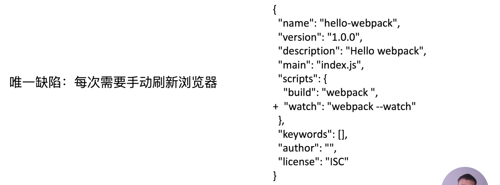

（第二种方式和第一种方式相同）


### 文件监听的原理分析

webpack 会轮询判断文件的最后编辑时间是否变化。某个文件的编辑时间发生了变化，并不会立刻告诉监听者，而是把文件的修改先缓存起来，并等待一段时间，如果等待的时间段内有其他的文件也发生了变化则将这些文件放入一个列表，最后会一起构建。

```js
module.export = {
  // 默认 false, 也就是不开启
  watch: true,
  // 只有开启监听模式时，watchOptions 才有意义
  watchOptions: {
    // 默认为空，不监听的文件或者文件夹，支持正则匹配;对于某些系统，监听大量文件系统会导致大量的 CPU 或内存占用。这个选项可以排除一些巨大的文件夹
    ignored: /node_modules/,
    // 监听到变化发生后会等待 300ms 再去执行构建，默认 300ms（缓存等待时间）
    aggregateTimeout: 300,
    // 判断文件是否发生变化是通过不停询问系统指定文件有没有变化实现，默认 1000 毫秒问 1 次
    poll: 1000
  }
}
```

这里需要注意，将 `node_modules` 目录忽略会提高构建性能。


### 课后问答

watchOptions.poll 通过传递 true 开启 polling，或者指定毫秒为单位进行轮询。

老师 你的视频上解释有误，poll: 1000表示1秒执行一次 https://www.webpackjs.com/configuration/watch/#watch

> 作者回复: 嗯嗯，是的。这个地方确实是 1秒执行1次。

（所以，有时需要去查看一下官方文档来帮助自己检查课程中是否有描述错误的地方，或是更深入的了解这些配置项的作用）


老师，webpack 轮询指定文件是否变化调用的是操作系统的接口吗

> 作者回复: 是的，会调用Node.js里面的文件读取API fs这个模块来判断文件内容是否变化


## [19 | webpack中的热更新及原理分析](https://time.geekbang.org/column/article/98391)  

这节课带领大家学习 webpack-dev-server（WDS），也就是 webpack 中的热更新。

在上节课程中，虽然 webpack 帮我们自动进行构建，但在浏览器中想要看到构建之后的效果则还是需要进行刷新。所以我们可以借助 `webpack-dev-server` 这个工具来帮助我们自动更新页面。

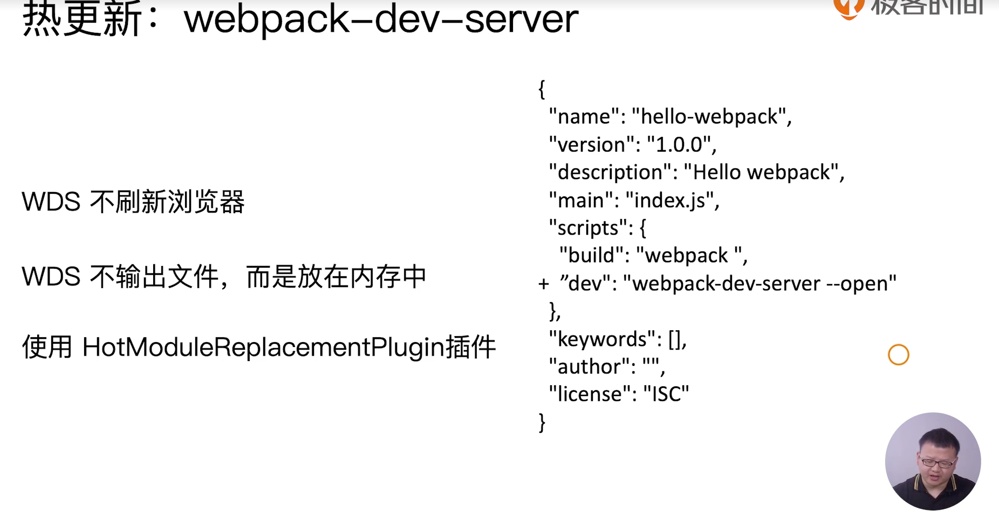

- WDS 能够自动的检测我们的代码的更改并构建，然后再自动的更新浏览器中的页面。（注意并不会刷新浏览器）

-  WDS 有一个比较大的优势，没有磁盘的 IO，输出的文件是放在内存之中，而不是像 watch 是放在磁盘，因此构建速度也会非常的快。
- WDS 通常是和 `HotModuleReplacementPlugin` 一起使用的

### 实际操作

1. 在 `package.json` 中添加 `dev` 脚本用于启动开发时的脚本：

```json
{
  "scripts":{
    "dev": "webpack-dev-server --open"
  }
}
```

- `--open` 会自动帮我们启动浏览器

2. 将 `webpack.config.js` 中 `mode` 配置字段从 `production` 更改为 `development` ，因为 `webpack-dev-server` 是在开发时使用的工具。（其实对于真实项目而言，webpack.config 会分为公用、开发、生产三个文件来使用）

```js
module.exports = {
  mode: 'development',
}
```

3. 引入 webpack 自带的 `HotModuleReplacementPlugin` 插件：

```js
const webpack = require('webpack')

module.exports = {
  plugins:[
    new webpack.HotModuleReplacementPlugin()
  ]
}
```

4. 配置 devServer ：

```js
module.exports = {
  devServer: {
    contentBase: './dist',
    hot: true
  }
}
```

- `hot` 是开启热更新
- `contentBase` 告诉服务器从哪里提供内容。只有在你想要提供静态文件时才需要。默认情况下，将使用当前工作目录作为提供内容的目录，但是你可以修改为其他目录。（它的作用是告诉 `webpack-dev-server` 服务器根目录在哪里，如果有 `index.html` 文件则会返回给浏览器这个文件，这和一般的网络服务器是相同的，如果没有则会呈现这个目录下的所有文件）

### 另外一种热更新方式 —— 使用 webpack-dev-middleware

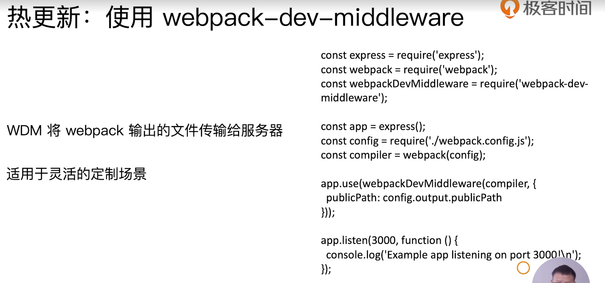

使用 `webpack-dev-middleware` 相比于使用 `webpack-dev-server` 而言更加灵活，它可以自己创建服务器，比如使用 express 或是 koa，然后将 webpack 输出的文件传输给服务器进行更加定制化的处理。

### 热更新的原理分析

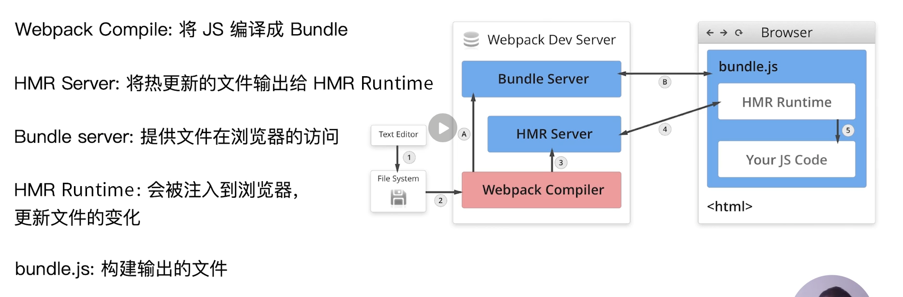

- 模块热替换(hot module replacement 或 HMR)是 webpack 提供的最有用的功能之一。它允许在运行时更新所有类型的模块，而无需完全刷新。
- 年代久远的开发方式是更改代码之后刷新页面以查看更改之后的效果，这种方式是通过浏览器访问本地的磁盘目录来打开页面的，而 Bundle Server 可以在本地启动一个服务器，浏览器通过访问服务器来打开页面（需要访问的服务器地址下有 `index.html` 文件）。
- HMR Server 会将 HMR Runtime 程序代码注入到 bundle.js 之中，浏览器端的 bundle.js 就可以和服务器之间建立一个连接，通常这个连接是由 websocket 实现的，这样当文件发生变化时便会将这些变化的代码在 boundle.js 中进行更新。
- 热更新的过程：
  - 1.启动阶段，webpack compiler 对文件进行编译之后会交由给 Bundle Server ，这样浏览器便可以通过访问 Bundle Server 来访问编译之后的文件。路径：1-2-A-B
  - 2.文件更新阶段，文件发生变化之后也需要经过 Webpack Compiler 进行编译，但这编译之后会交给 HMR Server，HMR Server 会检查哪些文件发生变化，然后通知嵌入在浏览器所读取的打包文件中的 HMR Runtime 并通过 JSON 将更改的代码传过去， HMR Runtime 就会更新位于浏览器的文件并且不需要刷新浏览器。

### 课后问答

老师HotModuleReplacementPlugin是做什么用的？

> webpack 构建出来的 bundle.js  本身是不具备热更新的能力的，HotModuleReplacementPlugin 的作用就是将 HMR runtime 注入到  bundle.js，使得bundle.js可以和HMR server建立websocket的通信连接.
>
>  webpack.HotModuleReplacementPlugin 没有必要加，官网文档说配置了 hot: true 会自动引入这个 plugin。


浏览器有刷新

> 作者回复: webpack-dev-server 默认是会在内容编译完成后自动刷新(liveload)浏览器的，此处增加了  HotModuleReplacementPlugin 插件之后可以做到 HMR 的。如果HMR失败的话会降级使用 liveload  自动刷新浏览器模式。


还是没太理解 webpack-dev-server 和 hot-module-replacement-plugin 之间的关系。
请问老师，为什么二者不能合二为一呢，而要单独写两个包？然后用的时候又要组合来使用。目的是什么，请教老师，谢谢您。

> 作者回复: 需要从两者的功能上来分析说明：
>
> webpack-dev-server(WDS)的功能提供 bundle server的能力，就是生成的 bundle.js 文件可以通过 localhost://xxx 的方式去访问，另外 WDS 也提供 livereload(浏览器的自动刷新)。
>
> hot-module-replacement-plugin 的作用是提供 HMR 的 runtime，并且将 runtime 注入到 bundle.js 代码里面去。一旦磁盘里面的文件修改，那么 HMR server 会将有修改的 js module 信息发送给 HMR runtime，然后 HMR runtime  去局部更新页面的代码。因此这种方式可以不用刷新浏览器。
>
> **单独写两个包也是出于功能的解耦来考虑的**。简单来说就是：hot-module-replacement-plugin 包给 webpack-dev-server 提供了热更新的能力。

## 20 | 文件指纹策略：chunkhash、contenthash和hash

### 什么是文件指纹

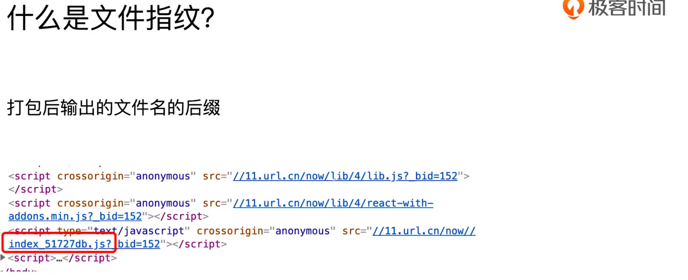

比如现在很多网站所加载的资源都是经过打包构建而成的，而这些资源的名称一般都有一些数字英文所组合而成的文件名后缀，这些就可以称为文件指纹。（如上图中的 `_51727db` 六位字符）

### 文件指纹的好处

- 文件指纹通常是用于版本的管理，比如当应用中的部分代码有更新，而更新的这部分代码的文件会在构建之后产生一个新的文件指纹，在上传更新服务器文件时我们只需要更新这部分更改之后的文件即可。
- 使用浏览器缓存来加快页面访问。浏览器对于之前请求过的相同文件名的文件并不会重新发送请求，而是访问 `memory cache` 来加载文件。

### 文件指纹如何生成

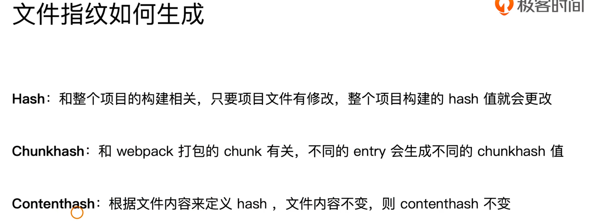

三种不同生成 hash 的方式：

- Hash：与整个项目的构建相关，在 webpack 的打包阶段中会有 compile 和 compilation ，compile 是在 webpack 启动的时会创建一个 compile 对象，而 compilation 对象是文件只要发生变化就会变化，而 hash 值是会受到 compilation 变化的影响，每一次只要有一个文件发生变化则 hash 就会变化，比如有两个页面，使用了两个不同的 js 文件，你修改 A 页面的 js 文件， B 页面的 js 的 hash 也会发生变化，但这其实在实际的开发中是没有必要的。
- Chunkhash：和 webpack 打包的 chunk 有关，chunk 指的是我们打包的模块，不同的 entry 会生成不同的 chunkhash 值，所以只要保证其 entry 的独立，则其 chunkhash 也会相应独立，相互之间不会受到影响。
- Contenthash：某一个页面即有 js 资源也有 css 资源，如果 css 也是用 Chunkhash 的话会有一个问题，当 js 文件发生变化而 css 并没有发生变化时，css 的文件指纹也会发生变化，这样也是没有必要的。所以，对于 css 文件而言我们通常会使用 Contenthash，它会根据文件本身的内容来定义 hash，只要文件本身不发生变化，则其 hash 值不会变化。

### JS 的文件指纹设置

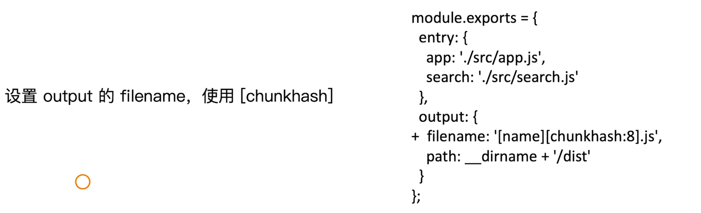

对于 js 文件我们只需要设置 `output` 中的 `filename` 字段就可以了。注意这里使用的是 `[chunkhash]`。

### CSS 的文件指纹设置

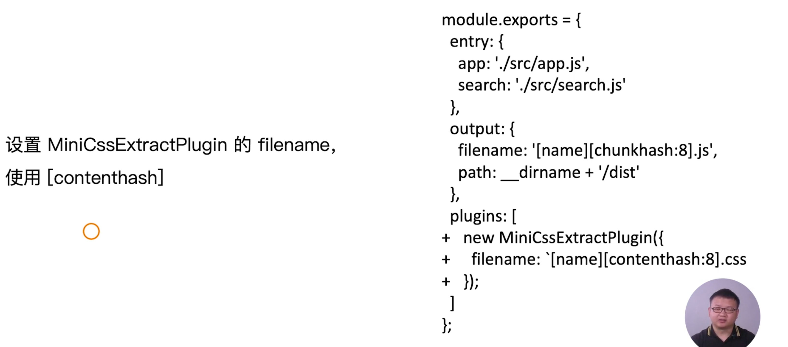

对于 css 文件，如果只是使用 `css-loader` 来做解析，使用 `style-loader` 将其添加到网页的 `head` 中其并没有 css 文件存在，所以为了将 css 文件独立出来，我们就需要使用 `MiniCssExtractPlugin` 这个插件来提取出 css，并将添加 hash 的设置添加到传入的对象的 filename 字段中。注意这里使用的是 `[contenthash]` 

### 图片的文件指纹设置

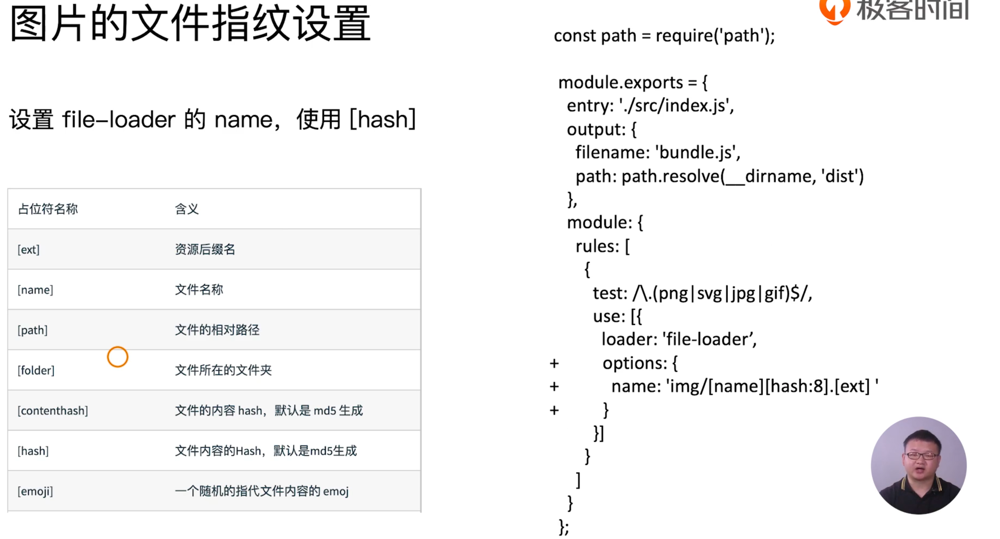

最后是一些图片或是字体文件的指纹设置，是在 `file-loader` 或是 `url-loader` 中对 options 字段中的 name 进行设置，注意这里的 `[hash]` 实际上也是 contenthash，会默认由 md5 生成，md5 是生成 32 位字符串，这里 `[hash:8]` 是指取前 8 位，并且是放到了 `img` 目录下。然后还有其他的一些占位符：

| 占位符名称    | 含义                             |
| ------------- | -------------------------------- |
| [ext]         | 资源后缀名                       |
| [name]        | 文件名称                         |
| [path]        | 文件的相对路径                   |
| [folder]      | 文件所在的文件夹                 |
| [contenthash] | 文件的内容 hash，默认是 md5 生成 |
| [hash]        | 文件内容的 hash，默认是 md5 生成 |
| [emoji]       | 一个随机的指代文件内容的 emoji   |

### 实际操作

首先我们需要将生产环境和开发环境的 webpack.config 拆分开，因为对于开发环境而言不需要设置 hash，而且 `[chunkhash]` 也不能和热更新一起使用。

生产环境：`webpack.prod.js`：

```js
module.exports = {
  mode: 'production',
}
```

删掉热更新部分，并且将 `mode` 更改为 `'production'` 。

开发环境： `webpack.dev.js` 没有更改。

然后，修改一下 `package.json` 中的脚本：

```json
{
  "scripts":{
    "build": "webpack --config webpack.prod.js",
    "dev": "webpack-dev-server --config webpack.dev.js --open"
  }
}
```

#### 设置 js 的文件指纹

```js
output: {
  path: __dirname + '/dist',
    filename: '[name]_[chunkhash:8].js'
},
```

- 直接在 output 下的 filename 中进行设置，这里设置了 8 位 hash，并且为了区别文件名和 hash 在中间使用了 `_` 进行分割。

#### 设置图片和字体的文件指纹：

```js
{
  test: /\.(png|svg|jpg|gif|jpeg)$/,
    use: {
      loader: 'url-loader',
        options: {
          limit: 102400,
            name: '[name]_[hash:8].[ext]'
        }
    }
},
  {
    test: /\.(woff|woff2|eot|ttf|otf)$/,
      use: {
        loader: 'file-loader',
          options: {
            name: '[name]_[hash:8].[ext]'
          }
      }
  }
```

#### 设置 css 的文件指纹

```js
module.exports = {
  module: {
    rules: {
      test: /\.css$/,
      use: [MiniCssExtractPlugin.loader, 'css-loader']
    },
    {
    test: /\.less$/,
    use: [MiniCssExtractPlugin.loader, 'css-loader', 'less-loader']
		}
},
  plugins:[
    new MiniCssExtractPlugin({
      filename: '[name]_[contenthash:8].css'
    })
  ]
}
```

- 需要安装 `mini-css-extract-plugin` 包
- `mini-css-extract-plugin` 将 css 提取为独立的文件，这个插件不能和 `style-loader` 一起使用，因为它们的功能是互斥的，`style-loader` 是将样式通过 `style` 标签插入到页面中，而 `mini-css-extract-plugin` 插件则是将样式提取出来。那么，我们在这里需要将 `style-loader` 替换为 `mini-css-extract-plugin` 所提供的 loader

### 课后问答

看到留言里面多次提到JS没有 contenthash，想问下为什么JS没有，而css文件却有呢？

> 课程里有提到，js使用chunkhash是便于寻找资源，js的资源的**关联度更高**；而css采用contenthash是因为css一般是根据不同的页面书写的，css资源之间的关联度不高，也就不用在其他资源修改，而css部分没有修改的时候重新更新css。

（这里提到的关联度高实际是指模块之间的相互引用，一个 js 文件内部可能会引入其他 js 文件内部的模块来帮助自身模块实现功能，所以对于打包出来的最终 chunk，只要是入口开始引入的相关模块发生变化，那么它也应该发生变化生成新的 chunk。）


js为什么不也用contenthash

> 作者回复: 因为JS 没有 contenthash，只能从chunkhash和hadh里面选。但是hash对于js的含义是整个构建的文件指纹，每次构建有任何文件变了这个值都会变。所以js只能用chunkhash


## 21 | HTML 、CSS和JavaScript代码压缩

代码压缩主要有三部分：

1. HTML 
2. 打包之后 CSS 
3. JS 

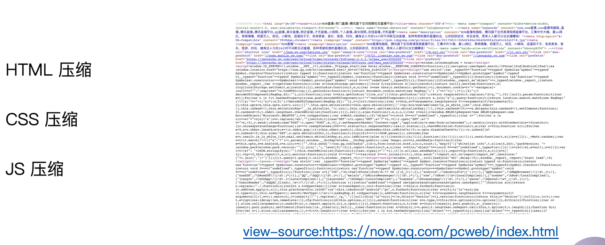

这张截图的右边部分是 now 直播的 pc 端代码，可以看到无论是 HTML css js 的代码都是经过压缩了的。

压缩之后的好处是代码文件资源更小用户访问更快。

### JS 文件压缩

Webpack4 中内置了 `uglifyjs-webpack-plugin` 插件，所以一般情况下不需要去设置什么 webpack 就默认的帮助我们对 js 进行了压缩。当然，你也可以单独引入进来使用一些特别的设置。

### CSS 文件压缩

在 webpack3 中，其实我们可以通过 css-loader 设置一个 minify 参数来压缩 css，但是 css-loader 1.0 版本之后去掉了这个参数，所以现在我们无法直接使用 css-loader 来进行压缩的。

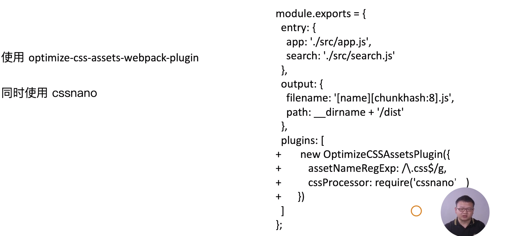

这里我们使用 `optimize-css-assets-webpack-plugin` 这个插件来进行压缩，在使用这个插件的同时我们还需要安装预处理器 `cssnano` ，在通过匹配之后使用 cssnano 进行压缩。

### html 文件的压缩

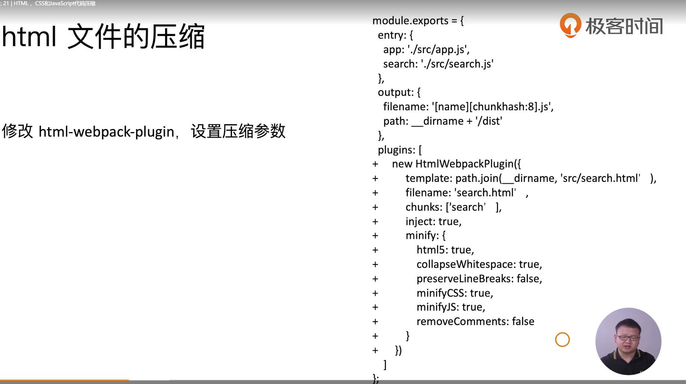

提到 html 压缩就不得不提到一个使用 webpack 基本上一定会使用到的插件——`html-webpack-plugin` ，通过使用这个插件并配置参数我们就可以对 html 文件进行压缩。

这个插件能够传入 `minify` 对象参数，通过这个参数我们能够处理空格、换行符、注释等来达到一个想要的压缩效果。

### 实际操作

#### CSS 压缩

1. 安装 `optimize-css-assets-webpack-plugin` 和 `cssnano`

```shell
npm i optimize-css-assets-webpack-plugin cssnano -D
```

2. 引用并使用插件（在生产中）

```js
const MiniCssExtractPlugin = require('mini-css-extract-plugin');
const OptimizeCSSAssetsPlugin = require('optimize-css-assets-webpack-plugin')

module.exports = {
    plugins: [
    new MiniCssExtractPlugin({
      filename: '[name]_[contenthash:8].css'
    }),
    new OptimizeCSSAssetsPlugin({
      assetNameRegExp: /\.css$/g,
      cssProcessor: require('cssnano')
    })
  ]
}
```

#### HTML 压缩

1. 在 `./src` 下创建两个空的 html 模板——`index.html` 和 `search.html` 

2. 安装并引入  `HtmlWebpackPlugin` :

```JS
const MiniCssExtractPlugin = require('mini-css-extract-plugin');
const OptimizeCSSAssetsPlugin = require('optimize-css-assets-webpack-plugin')
const HtmlWebpackPlugin = require('html-webpack-plugin')

module.exports = {
plugins: [
    new MiniCssExtractPlugin({
      filename: '[name]_[contenthash:8].css'
    }),
    new OptimizeCSSAssetsPlugin({
      assetNameRegExp: /\.css$/g,
      cssProcessor: require('cssnano')
    }),
    new HtmlWebpackPlugin({
      template: path.join(__dirname, 'src/search.html'), // html 模板所在位置
      filename: 'search.html', // 指定打包出来之后的 html 名称
      chunks: ['search'], // 指定打包出来的 html 使用哪些 chunk
      inject: true, // 为 true 则将使用的 chunk 自动注入到 html 之中
      minify: { 
        html5: true, 
        collapseWhitespace: true,
        preserveLineBreaks: false,
        minifyCSS: true,
        minifyJS: true,
        removeComments: false
      }
    }),
    new HtmlWebpackPlugin({
      template: path.join(__dirname, 'src/index.html'), // html 模板所在位置
      filename: 'index.html', // 指定打包出来之后的 html 名称
      chunks: ['index'], // 指定打包出来的 html 使用哪些 chunk
      inject: true, // 为 true 则将使用的 chunk 自动注入到 html 之中
      minify: { 
        html5: true, 
        collapseWhitespace: true,
        preserveLineBreaks: false,
        minifyCSS: true,
        minifyJS: true,
        removeComments: false
      }
    })
  ]
}
```

3. 运行编译构建 `npm run build`

压缩之前的 `index.html` ：

```html
<!DOCTYPE html>
<html lang="en">
<head>
  <meta charset="UTF-8">
  <meta name="viewport" content="width=device-width, initial-scale=1.0">
  <meta http-equiv="X-UA-Compatible" content="ie=edge">
  <title>index</title>
</head>
<body>
  <div id="root"></div>
</body>
</html>
```

- 注意这里需要有一个 id 叫做 root 的节点用于渲染

压缩之后：

```html
<!DOCTYPE html><html lang="en"><head><meta charset="UTF-8"><meta name="viewport" content="width=device-width,initial-scale=1"><meta http-equiv="X-UA-Compatible" content="ie=edge"><title>index</title><link href="index_6c16459d.css" rel="stylesheet"></head><body><div id="root"></div><script type="text/javascript" src="index_c63c7a55.js"></script></body></html>
```

- 没有了空格和换行符，并且在代码中插入了 js 文件（chunk 之一）和 css 文件（chunk 之二）。


第二章中我们主要学习了 webpack 中的一些核心概念，包括一些 es6、图片、css 等静态资源的解析，还有热更新、文件指纹、压缩等等开发过程中必不可少的步骤。

（这实际上可以自己来做一个总结）


### 课后问答

webpack只能全量更新？
比如我某个js，没变过，但是打包的时候，这个文件还是被重新生成到dist目录了，这样部署到服务器的时候，本来只需要增量更新文件，这样一来，就变成全量更新了。非常浪费时间

> 作者回复: 准确的说这个增量更新还是全量更新并不是 webpack 去做的，而是部署脚本或者部署服务器去关注的，webpack 只负责构建。
>
> 通常的做法是： webpack 打包的时候会给每个文件生成文件指纹(这个通常可以理解成静态资源的版本)。然后部署脚本进行部署操作，比如: scp、rsync 等操作把资源发布到生产机器或者 cdn 的时候。发布上去后，部署系统会将当前的静态资源的列表存起来，下次再次进行部署会将新的资源列表和前一次的资源列表进行比对。如果文件指纹没有变化，则不会进行覆盖操作，从而达到增量部署。


想问下老师，为什么已经默认有了JS压缩和使用了OptimizeCssAssetsPlugin 压缩 CSS。

但在 HtmlWebpackPlugin 中的 minify 中还要加入 minifyCSS 和 minifyJS，会不会过于繁琐呢？希望老师解答，谢谢！

> 作者回复: HtmlWebpackPlugin 里面的minify 的 minifyCSS 参数和minifyJS参数是用于去压缩一开始就内联在 html 里面的css和js，不是打包生成的 css 和 js


HtmlWebpackPlugin中参数chunks的值数组对应的是entry中的键吧，视频里这个没说太明白，
总体课讲的比较通俗易懂。

> 作者回复: 是的，你希望哪个 chunk 自动注入到哪个 html-webpack-plugin 就可以直接把相应的chunk写入到这个 chunks 的数组里就好了。
>
> 在26节多页面通用打包会更详细的介绍到 html-webpack-plugin 的用法


老师 用OptimizeCssAssetsPlugin插件时，引入cssnano后都有些啥作用？我看有人反馈引入cssnano后有些坑，比如会将scale3d(1,1,1)转成scaleX(1), 这是因为cssnano的reduceTransforms的设置项导致，但是目前貌似还没解决方案。。。

> 作者回复: 嗯嗯，这个除了cssnano有这个问题，之前的 css-loader 也存在的，亲测。
>
> 不过这种情况特别少啦，基本无伤大雅，实在遇到可以通过 hack 的方式去搞定。比如通过js去设置 style 等等。


老师一直疑惑chunk是啥

> 作者回复: 有三个比较容易混淆的概念，bundle，chunk和module。
>
> bundle：打包最终生成的文件
> chunk：每个chunk是由多个module组成，可以通过代码分割成多个chunk。
> module：webpack中的模块（js、css、图片等等）


有点疑惑，src 目录下的 search.html 没有引入 search.js 的内容。为什么打包出来的 dist 文件夹下的 search.html 文件可以引用到 search.js 的内容的？（嘤嘤）

> 作者回复: 是因为 html-webpack-plugin 可以自动的将当前这个页面的 **chunk(js 和 css)** 注入到 html 里面去，可以通过 inject 参数设置是否注入。