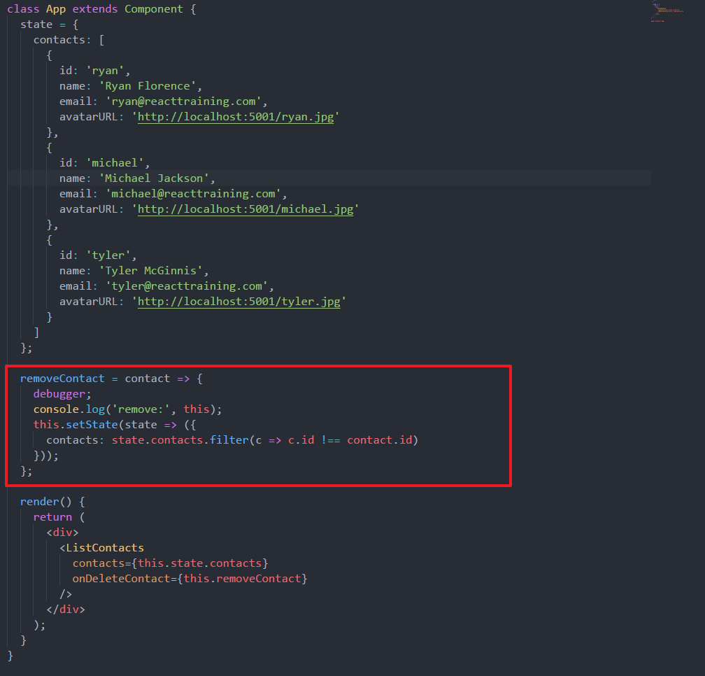
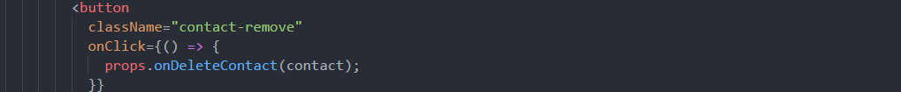
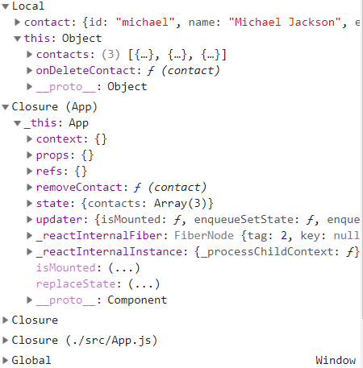
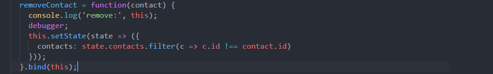

# 猜测

[TOC]

---

## 使用箭头函数表达式函数体内部的 this 猜测

看代码：

被调用的位置：

问题：

这段代码中 removeContact 函数在被调用时的 this 为 App 这个类，也可以说是 App 这个组件，那么就可以使用 setState 来改变这个组件中 state 的值，但是问题是这个 this 并不是上下文，而是闭包中的 _this，请看图：

这是在函数体内第一行使用 debugger 时所在的作用域，可以看到 Local 中的 this，依然是被调用时的组件 ListContacts 的 props 属性，而下面的 Closure 中的 _this 才是 App。

所以，我觉得箭头函数中的 this 虽然是指周围上下文，但是是在被调用之前就已经决定了其值。当然这只是一种猜测，这里的问题有：

- 上图中显示的 Closure 到底指的是什么？
- 箭头函数的 this 是否与调用之间存在关系？
  - 和调用没有关系，只和其函数被定义有关，定义在哪里就以此周围的上下文为 this，然后不变。
- 这里的 this 指向的是 App 这个类，而不是实例，这也很奇怪，因为当这个函数被调用的时候，应该是 App 实例的方法而不应该是 App 的方法，App 的方法需要用 static 静态声明。

> 补充知识：严格模式下,没有宿主调用的函数中的this是undefined!!!所以箭头函数中的也是undefined!

如果想通过 function 来调用使结果和用箭头函数相同，可以这样写：

 使用 bind 来改变其 this 为周围上下文。

