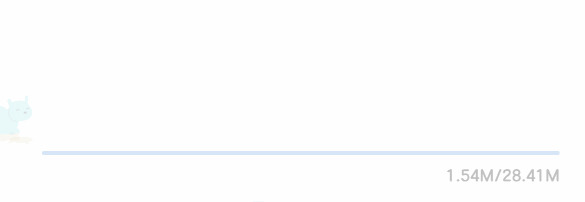
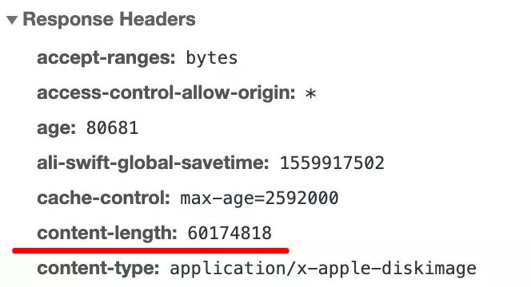
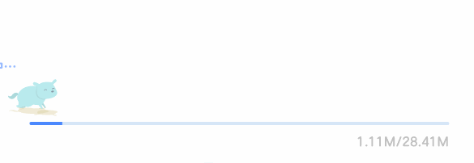
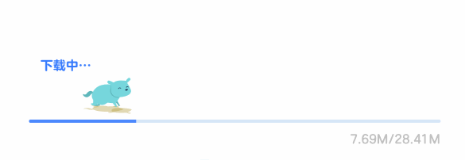
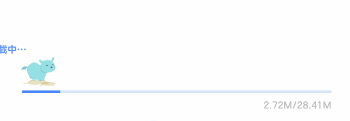

# 如何实现一个下载进度条/播放进度条

> [原文地址](https://juejin.im/post/5cfcd4c5f265da1bb13f246e)

技术上没太大难度，有难度的地方是怎么让整个动画比较流畅。一个主要问题是动画的滞后性：当下载进度到某个点的时候，你再用250ms的动画过渡过去，这个时候已经慢了，所以很多人可能因为这个原因或者嫌麻烦，直接就不做动画了，在进度事件触发的时候直接更新进度条相应的位置，不过我们可以尝试实现一下。

最后做出来的效果如下图所示：



小狗奔跑的动画是一个lottie动画，来自[codepen](https://link.juejin.im/?target=https%3A%2F%2Fcodepen.io%2Fairnan%2Fpen%2FPqerVo)。

## 1. 获取下载进度

ajax里面可以拿到下载进度，如下代码所示：

```js
  let xhr = new XMLHttpRequest();
  const downloadUrl = 'installer.dmg';
  xhr.open('GET', downloadUrl, true);
  xhr.addEventListener('progress', function (event) {
    // 响应头要有Content-Length
    if (event.lengthComputable) {
      let percentComplete = event.loaded / event.total;
      console.log(percentComplete); // 最后输出1
    }
  }, false);
  xhr.send();复制代码
```

前提是响应头里面有Content-Length这个字段告知当前文件的总字节数，如下图所示：



一般CDN都会有这个字段。拿到下载进度之后便可用来换算宽度或者位置。

## 2. 没有动画的loading

如果我们不做动画，直接设置translate位置，那么看起来是这样的：



代码如下所示：

```js
let percentComplete = event.loaded / event.total;
let left = containerWidth * percentComplete;
// 狗的位置直接设置translate
dogBox.style.transform = `translateX(${left}px)`;
// 进度条的位置也是translate，一开始是用translateX(-100%)挪到外面去
currentProgressBar.style.transform = `translateX(${percentComplete * 100 - 100}%)`;复制代码
```

在我们这个例子里面会显得特别突兀，一卡一卡的感觉，如果没有上面那条狗可能还会好一点。所以我们给它加个transform动画。

## 3. 加上transform动画

transform动画怎么做呢？方法有很多：jQuery的animate、Web Animation、requestAnimationFrame、CSS动画结合JS控制、其它第三方动画库等等，我比较喜欢用原生Web Animation。

由于progress event触发得比较快，加上做动画的话不需要触发得那么快，所以给它加一个节流。如下代码所示：

```js
// 最快250ms触发一次
function throttle (func, limit = 250) {
  let inThrottle = false;
  return function() {
    const args = arguments;
    const context = this;
    if (!inThrottle) {
      func.apply(context, args);
      inThrottle = true;
      setTimeout(() => inThrottle = false, limit);
    }
  }
}
function onDownloadProgress (event) {

}
xhr.addEventListener('progress', throttle(onDownloadProgress));复制代码
```

当然你不加节流也是可以的，这里只是一个优化。

做transform动画的逻辑便在上面的onDownloadProgress这个函数里面处理，如下代码所示：

```js
function onDownloadProgress (event) {
  let currentProgressBar = document.querySelector('.current-progress-bar');
  let dogBox = document.querySelector('.dog-box');
  let containerWidth = document.querySelector('.progress-bar').clientWidth;

  if (event.lengthComputable) {
    let percentComplete = event.loaded / event.total;
    let left = containerWidth * percentComplete;
    // 动画时间和节流时间保持一致
    const time = 250;
    // 获取到当前运动的位移
    let lastTransform = window.getComputedStyle(dogBox).transform || 'translateX(0)';
    // 使用原生web animation
    dogBox.animate({
      transform: [lastTransform, `translateX(${left}px)`]
    }, {
      easing: 'linear',
      fill: 'forwards',
      duration: time
    });
    // 进度条类似，省略
  }
}复制代码
```

上面动画的时间为250ms和节流的时间保持一致，这样下次触发的时候上次的动画差不多刚好做完（实际上是慢了一点）。并且每次触发动画的时候都是获取当前的 translate 位置，作为本次动画的起点，这样可以保证动画的连贯性。

另外，由于我们使用了节流很可能会导致最后的那次100%的触发丢了，所以需要在完成的时候手动调一下onProgressDownload，否则会没有完成态。

如果是播放进度条的例子，需要监听video/audio元素的timeupdate事件，这个事件的触发约[250ms](https://link.juejin.im/?target=https%3A%2F%2Fdeveloper.mozilla.org%2Fzh-CN%2Fdocs%2FWeb%2FAPI%2FHTMLMediaElement%2Ftimeupdate_event)（实测）触发一次，可以不用节流。

效果如下图所示：



我们发现在最后数字已经显示总大小了即已经下载完成了，但是那条狗离终点还有段距离，在我们这个例子似乎没那么明显，不仔细看还看不太出来。但如果下载速度很快的时候这个问题会更加明显，在播放进度条的例子便是如果进度条很长，但是播放的视频只有10几秒，那么应该也会比较明显。

一个简单的解决方法是假定下一个250ms的下载速度保持一致，每次运动的时候都提前运动250ms，如果在播放video的例子里面这个假定几乎是对的，因为比较匀速，而下载速度不可控，但在连续相同很短的时间内我们估且认为是一样。

所以我们可以记录一下上一次的位置，然后加多一个偏移，如下代码所示：

```js
let diffX = (event.loaded - lastMB) / event.total * containerWidth;
// 在原本的基础上再加多一个偏移（且不能超过容器的宽度）
let left = Math.min(containerWidth, containerWidth * percentComplete + diffX);
lastMB = downloadedMB;复制代码
```

这样就比较对得上了，效果如下图所示：



这个案例到这里基本就介绍结束，这个例子比较简单，不过你可能会觉得web animation的兼容性不太好。主要是在Chrome的兼容性比较好，其它主流的浏览器的新版本也已经开始支持了。其它不支持的浏览器可以使用谷歌官方的一个[polyfill](https://link.juejin.im/?target=https%3A%2F%2Fgithub.com%2Fweb-animations%2Fweb-animations-js)，就是比较大一点。它和CSS动画一样，但是可以用JS去控制开始暂停等，所以它和CSS动画一样具有GPU加速，不占用JS线程等优势。