# 2.4 网站优化 - 关键渲染路径——补充

---

[TOC]

---

## 1. 课程介绍

这节课将**帮助你开发运行速度超快的应用，可以达到 60 帧/秒（frames per second）**。

你可能认为只需要注意 JavaScript 就行了，但实际上还有很多方面需要考虑。这门课程讲解的是**<u>如何处理性能问题</u>，我们将帮你从<u>宏观层面看问题</u>**。

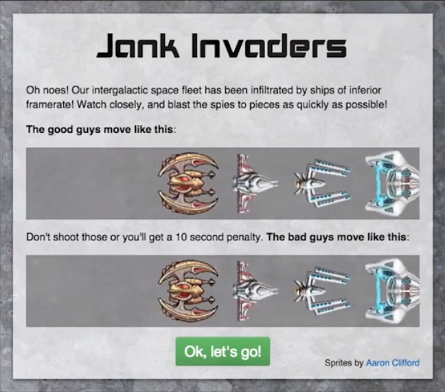

> 这里讲师讲解了一个游戏，游戏下方的飞船会颤动的很厉害（掉帧）

---

## 2. 第 1 课简介

在这门课程里，你将研究多个存在性能问题的示例，学完这门课程后，你将运用所学的知识打造极为顺畅的体验。但首先，要开发运行速度为 60帧/秒的应用，**你需要明白创建每个帧涉及到哪些内容**。

在这节课里，你将学习关于**浏览器渲染通道的基本知识**。

这节课的目的是帮助你体验下可能**会减慢渲染的瓶颈问题**，在后续课程里，**你将诊断和解决常见的性能问题并了解如何在应用生命周期的不同阶段处理性能问题**。

---

## 3. 震动

避免不稳定性对用户来说非常重要，刚刚也看到了上面那个小游戏的中不稳定性产生的差别。但这并不限于游戏，会影响到所有网站和网络应用。

对于可以完成相同操作的两个原生应用，你会如何做出选择？

一般会查看评论，看看用户如何评价应用的功能，同时还会关心性能问题。快速观察得分低的应用后得出结论，每当点击某个内容，应用就不稳定或卡住一两秒的话，用户会发现并且很关心这种情况，出现这种情况你就会选择性能更好的应用。网页也是这样，差的性能会拖垮好的网站，同样，用户喜欢顺畅的体验，能够对用户的操作快速做出响应。

Paul Kinlan 展开了一项调查研究，看看人们希望从新闻应用中获得什么功能，**需求最多的功能是顺畅地导航**，顺畅也就是一直稳定。实际上，77% 的用户都有这一需。

这门课程将解释**如何考虑项目的性能，可以使用哪些工具，你需要注意的是什么，如何解决常见问题**。你将找出**滚动停滞，更新断断续续和动画不稳定的根由。**

首先你将了解下**单个帧的组成部分**，实现 60 f/s 的目标。

---

## 4. 帧

从滚动到展示动画的一项外观变化就是设备将在屏幕上向用户显示新的图片或帧。**如今的多数设备刷新屏幕的频率都是 60f/s**，我们用赫兹(Hz)来表示，为此，我们需要展示 60 帧，大多数时候我们将说成 60 帧/秒 或 fps

人们很容易发现我们是否丢掉了某帧，并且不喜欢这种情况，想想之前的游戏就多么容易发现。**如果浏览器花费太长的时间才能显示一帧，就会丢掉一帧**。 帧速度将会下降，用户就会看到卡顿现象。**如果情况很槽糕的话，整个屏幕就会卡住，这是最坏的情况**。

---

## 5. 练习：每帧毫秒数

为了避免不稳定性，你需要谨慎地为应用执行的任务安排时间。每帧都需要快速渲染，但是到底多快呢？为了在每 1000ms 内渲染 60 帧，渲染一帧的话需要多长时间？

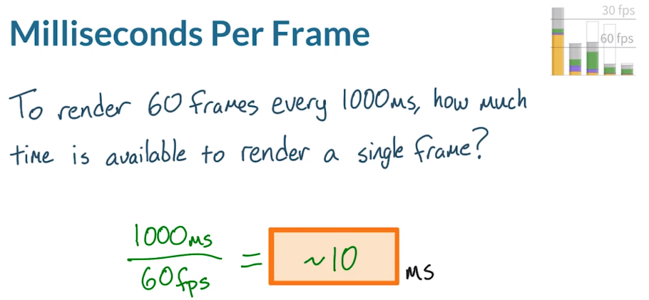

用 1000ms 除以 60fps，结果大约为 16 毫秒/帧。**你需要努力让一帧的渲染时间保持在 16ms 内，但浏览器还需要对每帧进行处理，所以实际上要在 10ms 到 12ms 内完成所有任务并及时渲染每帧**。

---

## 6.一帧中包含哪些内容

如果你不知道浏览器如何渲染帧的话，则无法优化应用的帧率。所以你需要了解当**网页被第一次加载时是如何形成的**。现在简单介绍一下这一流程。如果你想要深入了解网页是如何构建的，去看网站性能优化课程吧。我们来看看如何构建帧。

- 首先浏览器向服务器发出获取请求，服务器做出响应并发送一些 HTML，此时，浏览器会采取非常机智的措施并提前解析，我们关心的是，它会解析文档并向我们提供这些节点，在 Chrome DevTools 中你会看到其显示为 Parse HTML，将其解析为 DOM。

  - 
  - 

- 除了 DOM 之外还有 CSS，它来自于用户代理、你的样式表或任何内联样式表，或者还包括第三方样式。

- 该流程的下一部分是结合 DOM 和 CSS，在工具中你将看到它显示为 Recalculate Styles，相结合后我们获得了新的树，叫做渲染树。渲染树看起来和 DOM 非常相似，只是缺少了一些东西，例如，没有 head，也没有任何脚本。实际上，如果有 CSS 将部分段落设为 display:none，那么段落也会从渲染树里移除掉，同样，如果有 CSS 添加了伪元素，例如 after 或 before，就会添加到渲染树里，虽然没有出现在 DOM 中。一定要注意，只有实际上会显示在网页上的元素才会进入渲染树中。

  - > 也就是说在 DOM 中是有 head 和 脚本的，而没有伪元素。

  - 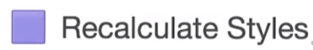

  - 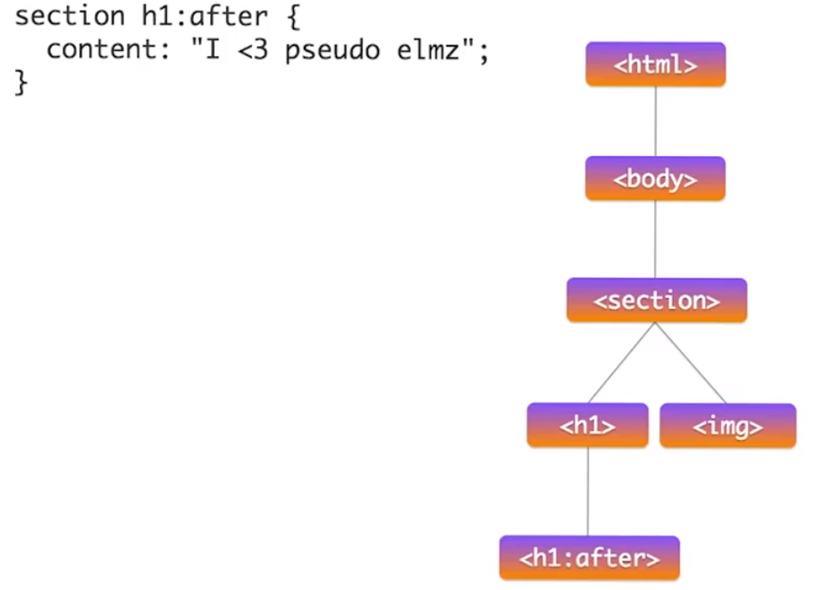

所以这本质上是关键渲染路径优化的简化。

---

## 7. 练习：渲染树练习

你已经知道只有可见元素才会出现在渲染树里，那么，下面哪个元素不会出现在渲染树里？

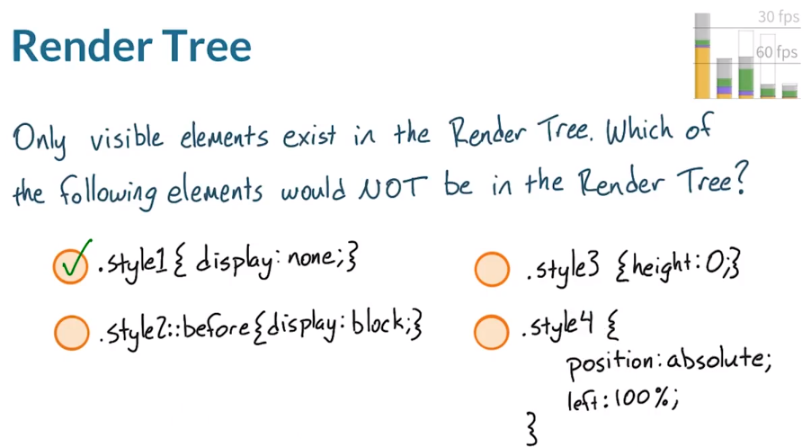

- 含有 display:none; 的 .style1 
- 具有 before 选择器和 display:none 属性的 .sytle2
- 具有 height:0 属性的 .style3 
- 具有 position:absolute 和 left:100% 属性的 .style4

答案是任何具有 .style1 的元素都不会出现，如果元素设为 display:none 意味着该元素肯定不会渲染，对于其他三个选项，**虽然它们可能不会占用你所看到的网页的任何空间，但是依然属于网页的一部分，意味着浏览器依然会将 .sytle2 3 4 放入渲染树里。**

---

为了使 `.style2` 出现在渲染树中，它需要包含某些内容，如分配给它的 `''`。

> 也就是说，不只是 display:none 的元素不会被渲染。但这就和讲师所说的内容有所矛盾了，但这里也不矛盾，因为伪元素是很特别的存在，也许只有当有内容时，才能被当做是一个元素的存在被放入渲染树之中，虽然并不会占用网页空间。

---

## 8. DOM, CSSOM, 渲染树

回到单个帧的渲染流程。**浏览器知道哪个规则适用于相关元素后，就开始计算布局。也就是计算元素会占用多少空间，位于屏幕的什么位置。**

这些是我们要应用的所有 CSS，布局变成了这样的一个个方框，**在工具里， 你会看到其显示为 Layout**。

> 这个动画很有感觉，可以去重复看看这个动画。在 18s 的地方。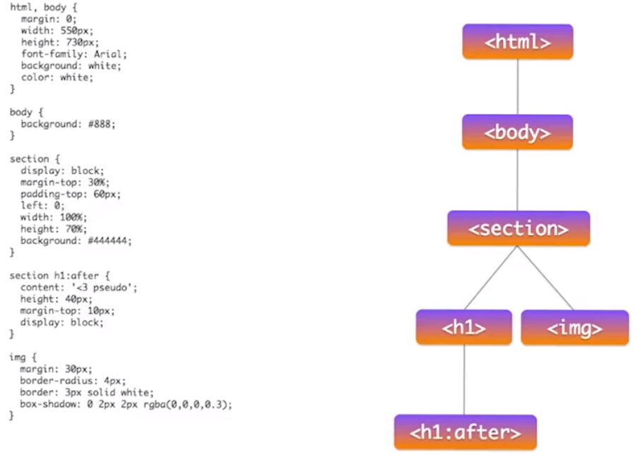                  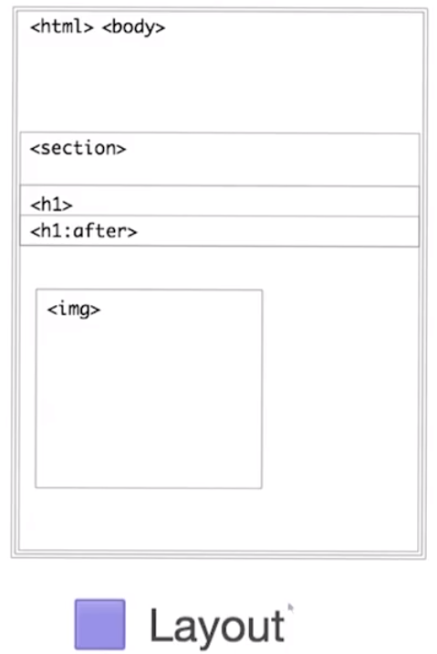

**网络布局模型意味着某个元素可以影响到其他元素**，例如 body 的宽度通常会影响到子项的宽度，等等。一直往树的下方蔓延，所以这一流程对浏览器来说可能非常复杂，有时候你可能会听到**布局也叫做回流**，其实是同一概念。

该流程的下一步是矢量（vector）到光栅（raster），例如我们之前看到的方框是这样的，只是形状，但是现在我们需要填充单个像素，像这样。这时候**光栅器**就派上用场了。

- 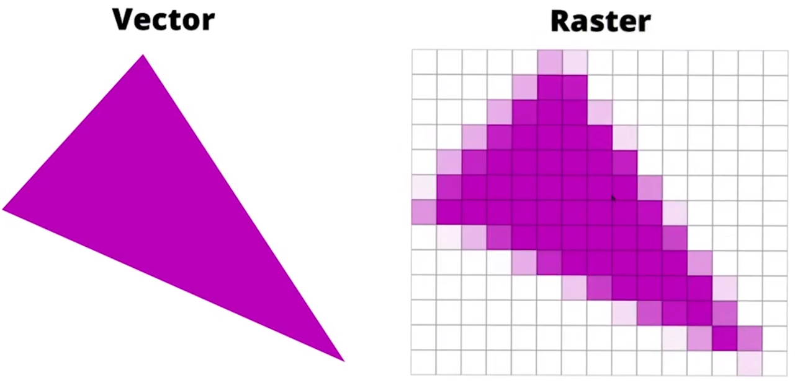

这是之前的布局（下图右边区域），这些是光栅器需要执行的绘制调用（下图左侧），以便填充像素。

- 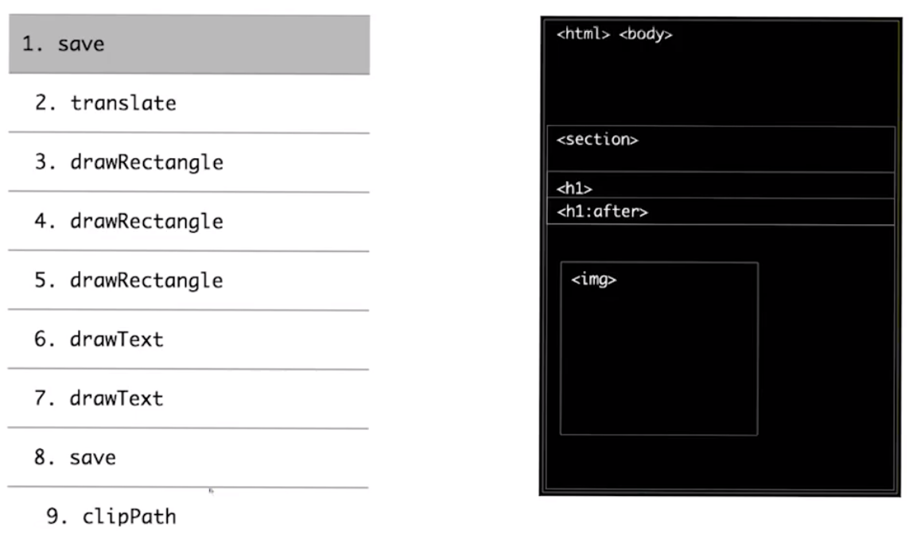

完成后的效果是这样：

- 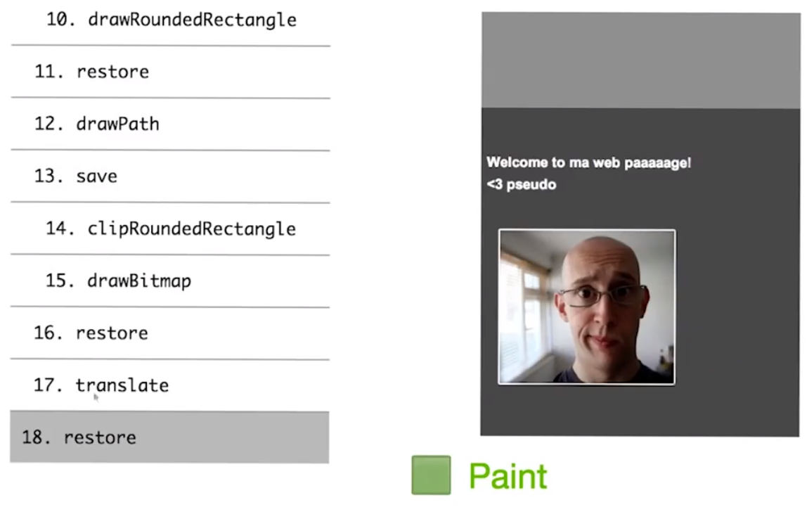

> 如果要逐步了解图片的构建过程，可以去看原视频 1m 12s 的内容。
>
> 可以看到，先是出现了一些方框，然后一些文本、阴影、白线、图片，最终显示所有内容。

**这一部分在工具里将显示为 Paint**

你可能注意到了，在之前的列表中有个调用叫做绘制位图（draw bitmap），**通常我们会通过网络向网页发送 JPEG、PNG 或 GIF 等内容，而浏览器需要将这些内容<u>解码成内存</u>**，像这样：

- 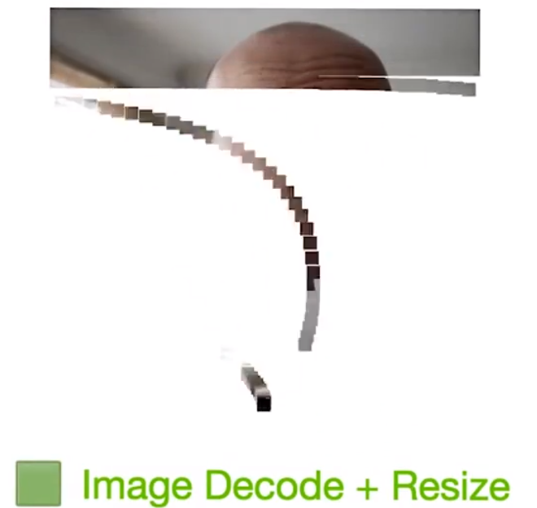                              **→**                        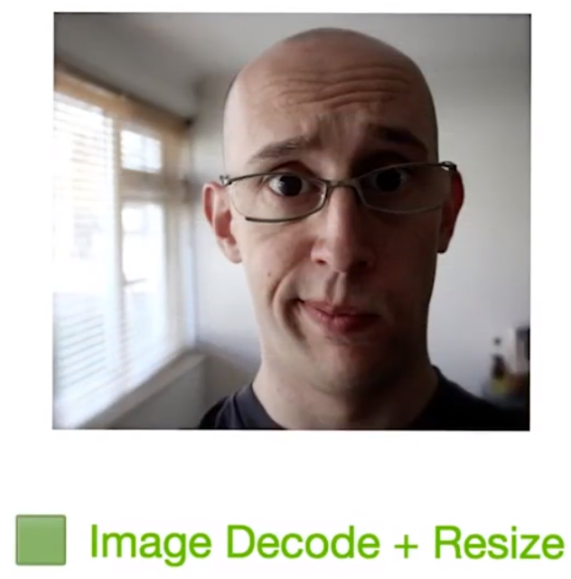

- > 动画在视频 01:46 的位置。能够明显的看到一个一个像素点依次渲染到屏幕上并最终形成为一张照片。

**在工具里，这部分会显示为 Image Decode**。我们可能还会进行自适应网络设计，所以图片还需要调整尺寸（图片大小变化）。

> 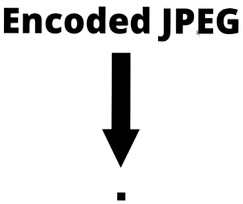
>
> 补充：这是讲师 PPT 其中的一张，英文写的是编码的 JPEG，然后讲师说浏览器需要将这些内容解码成内存。所以，这个箭头应该指的是解码的过程，将原来的 0 和 1 解码为一个个像素点。

到目前为止，你可能注意到 Painting 是在一个层面完成的，但是，**浏览器有时候会创建多个层面，叫做图层（layers）或合成层（Compositor layers）**，**并且可以<u>单独绘制</u>这些图层**。

这里有个网站，这个 masthead 具有自由的图层，意味着我们可以绘制后面的内容，也可以绘制 masthead 本身，**处理这些图层的流程在工具里称为 Composite Layers**。这个 masthead 是个图层，但是上方还有下一个和上一个按钮，它们也变成图层。

- 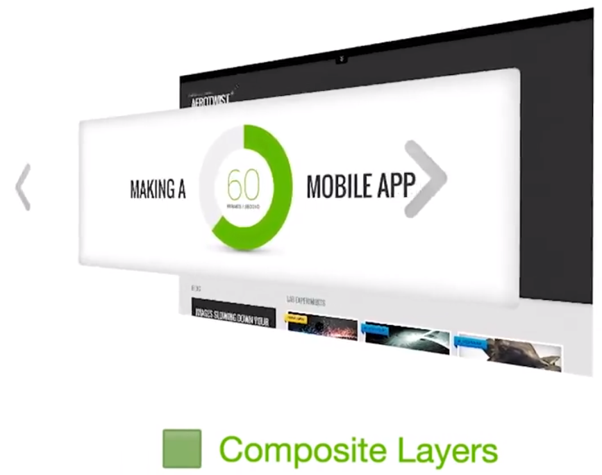

在这门课程里，**我们将讨论图层管理，确保你不会一不小心创建了多余的图层**。现在我们可以将所有这些图层再放在一起，这样就绘制完网页的所有图层了。实际上，**绘制过程是在这样的网格图块中实现的**：

完整地讲完整个渲染过程了，**但是我们开发者无法控制这个过程，所有这些都是在 CPU 上发生的。图层本身和其图块将上传到 GPU 中**，同样，**这一流程也包含在 Composite Layers 部分**，**最后 GPU 将根据指示将图片显示到屏幕上**：

> 这是有一个动画，是图形先由 CPU 处理后传输到了 GPU 下。最后，将图片是指整个 CPU 和 GPU 计算和渲染出来的页面。

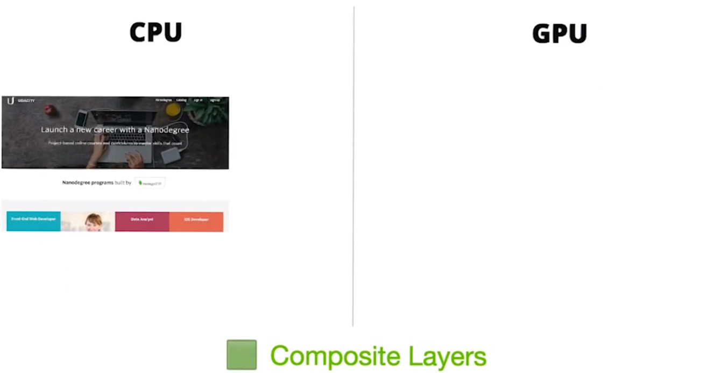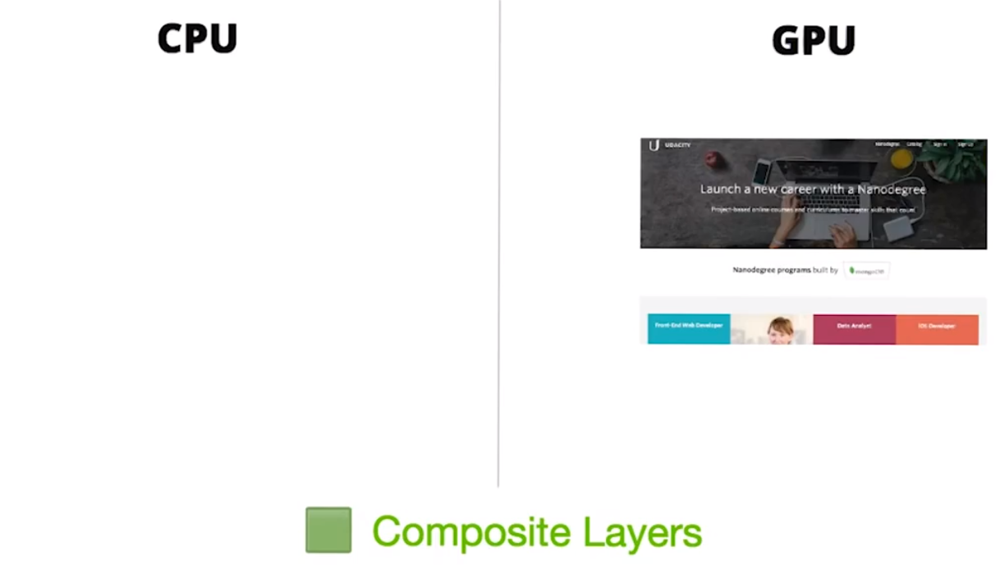

这就是，**从单个请求一直到将像素填充到屏幕上的简单流程**。

---

## 10. 布局和绘制

当网页不再是静态页面时，对于我们开发者来说，通常帧是这样的，和之前讨论的管道差不多。只是现在在开头添加了 JavaScript，通常，你会使用 JavaScript 来处理内容并导致外观变化，例如 jQuery 的动画功能，对数据集进行排序，或者向网页中添加 DOM 元素，但是并非必须使用 JavaScript 来实现外观变化，实际上，对于很多应用，开发者会使用 CSS 动画（animations）、过渡（transitions）或者甚至使用新的 Web Animations API 来对网页做出外观改变。

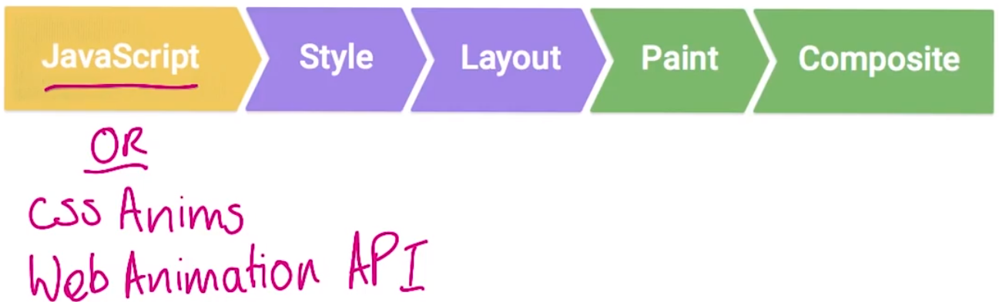

介绍了 JavaScript 后，我们可以再详细解释下管道了，我们在这里做出的改变，并不一定会触发管道的每个部分，实际上，**对于给定的帧，管道通常会经历三种形式**。

第一种形式，**你通过 CSS 或者 JavaScript 做出了外观改变。浏览器必须重新计算受到影响的元素的样式**，如果你更改了**布局属性，即更改元素的几何结构**，例如宽度、高度；**或者相对于另一个元素的位置**，例如左侧或顶部。那么浏览器将需要检查所有其他元素并回流网页，受到影响的区域将需要重新绘制，最后绘制的元素将需要合成到一起。

- 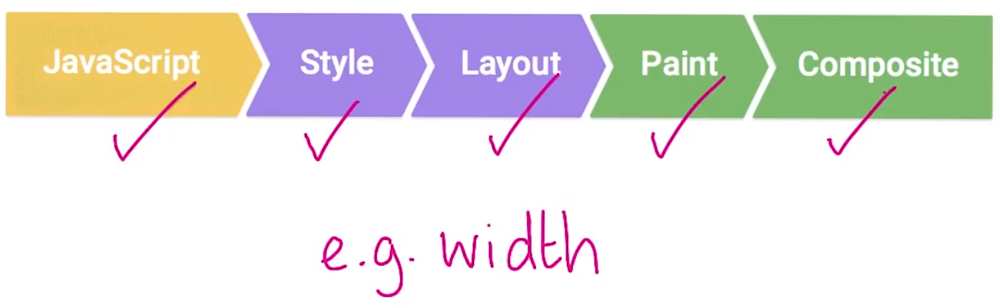

第二种形式，使用方式是**你更改了仅绘制属性**，例如背景图片、文本颜色或阴影。这次我们做出更改，计算样式，但是我们不需要布局，因为没有更改任何元素的几何结构。最后绘制并合成。

- 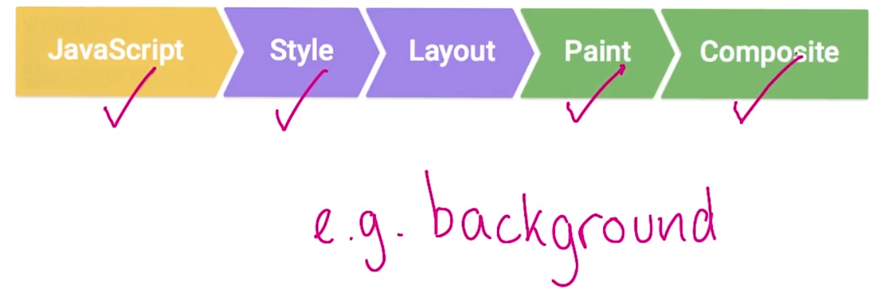

第三种形式，这种形式涉及到的更改不需要布局或绘制，只需合成。合成是指浏览器将网页的单个图层合并在一起，这就**需要图层管理，确保包含了正确的图层，并且顺序正确**。

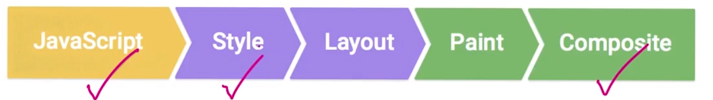

你可能注意到了，**对于每次更改始终都包含样式，不同的样式影响到了管道的不同部分，进而影响到应用的性能**。

---

## 11. 练习：渲染练习

请考虑下面这个情形，弹性盒子是非常实用的自适应设计工具，它是一种 CSS 展示属性（display property），可以调整元素的大小并回流（reflow）到网页上。例如，假设网页上有这三个元素，然后用户调整了屏幕尺寸使屏幕更大，因此元素本身也变大了，在这种情况下，要呈现新的网页，浏览器执行了下面哪个流程？浏览器执行了样式、布局、绘制或者合成流程吗？

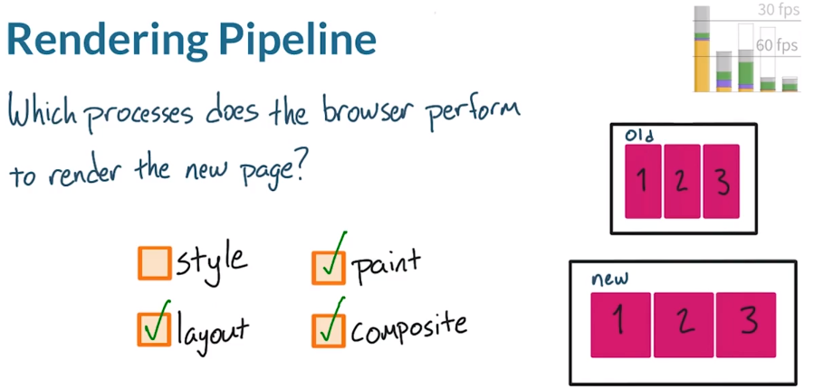

这里没有样式计算流程，因为元素样式已经知道了。对于屏幕调整尺寸事件，样式实际上通过布局来应用的。你刚刚已经了解到，**如果浏览器运行布局，那么还需要在网页上的新位置绘制元素，然后合成在一起。**对于无需重新计算样式，实际上存在例外情况，如果调整尺寸处理器更改了样式，或者遇到了媒体查询断点（break point），那么浏览器就需要重新计算样式，但是这里不会发生这种情况，所以不用选中该方框。

---

这里是上个视频结尾处关于[布局界限](http://wilsonpage.co.uk/introducing-layout-boundaries/)的链接。

不熟悉 Flexbox？试试 [实时测试 CSS Flexbox 规则](http://flexbox.help/)，它将为你演示 Flex 的每个属性是如何影响布局的。

---

## 12. 练习：CSS 研究

对于这道测试题，请转到 [csstriggers.com](https://csstriggers.com/) 并做一些研究，请找到触发布局、绘制和合成流程的 CSS 属性并填到这个方框中，然后找到仅触发绘制和合成流程的 CSS 属性，最后找到仅触发合成流程的 CSS 属性。

请你查看 [csstriggers.com](https://csstriggers.com/) 的原因是：

- A. Paul 要求我们将该网站纳入这门课程里。
- B. 该网站是个非常实用的资源，可以用来判断 CSS 将触发的工作。

如果你希望构建性能良好的网站，则一定要熟悉这个网站。

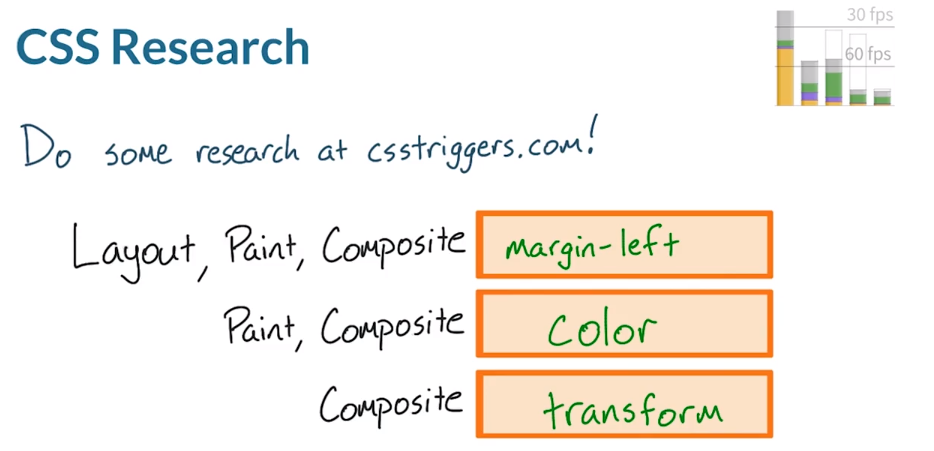

- 对于这道测试题“布局、绘制和合成”我选择了 margin-left
- “绘制和合成”选择了 color
- “合成” 选择了 transform

并非所有 CSS 都是等同的，某些 CSS 属性的作用范围比其他的要大的多，**CSS 应该尽可能触发最少量的工作，也就是尽量避免绘制和布局，Transform 和 opacity 是可以更改的最佳属性。因为如果元素有自己的图层的话，它们只需由合成器来处理。**

在这门课程里，稍后你将进一步学习如何创建和管理图层。

---

## 13. 最终项目

现在你所看到的应用将是你在这门课程结束时调试的应用，它使用了 Hacker News API 来显示最新的新闻报道和的得分。现在它的性能很糟糕，尤其是在移动设备上，但是还是有希望达到 60fps 的，学完这门课程后，你将掌握一定的技能和技巧，最重要的是你将具备必要的思维能力，能够将这款糟糕的应用改善成 60fps 的体验。

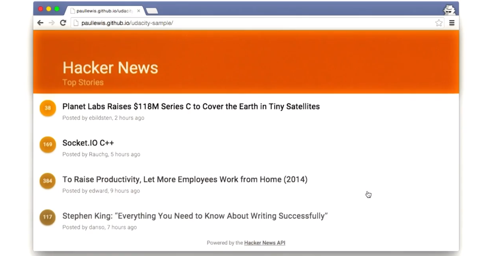

---

## 14. 第 1 课回顾

你已经做好获得良好性能的准备了，你明白为何我们力求达到 60fps 的目标。**创建涉及哪些目标，并且知道更改属性会以不同的方式影响到性能。**

在下节课中，你将开始接受第一个实际性能挑战，Jank 在应用生命周期的某些阶段问题更大，你将需要把时间和经历投入到**用户最关心的领域**。