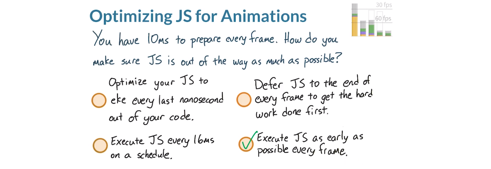
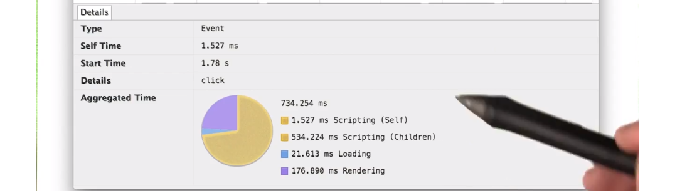

# 2.7 网站优化 - JavaScript

---

[TOC]

---

## 1. 第 4 课介绍

我们来总结下你掌握了关于 60fps 这一话题的哪些知识。

- 你知道制作帧需要哪些内容；
- 不同样式如何对管道产生影响；
- 知道如何根据 RAIL 来安排性能任务的优先级（LIAR）
- 知道应用的生命周期以及如何使用 Chrome 时间线工具

现在你将学习导致不断出现卡顿的常见原因，你将使用工具找出这些问题解决它们，并测试结果。首先将从**管道的起始部分 JavaScript** 开始。

---

## 2. 非常及时

对于 JavaScript 首先要明白的是，你所写的代码并非就是运行的代码。如果你从未听过这一说法的话，可能会觉得很奇怪。这是因为现代 JavaScript 引擎会重新编译你的代码，从而使代码运行速度更快。这一过程是通过即时编译器（Just In Time Compiler）完成的，简称 JIT。

JIT 编译器会在 JavaScript 运行过程中一点一点地优化代码，它是个非常强大却又很复杂的引擎。对于我们开发者来说，我们是可能看完 JavaScript 代码后知道引擎中实际会运行什么代码的。


看看这段 JavaScript 代码，是个 for 循环，非常简单。但是如果我们使用这个 IRHydra 的工具来查看 Chrome 的 JavaScript 引擎 V8 是如何便是这段代码的，结果是这样：


你需要理解这些代码，这只是 Chrome 和其 V8 JavaScript 引擎理解你所写的代码的方式。我只是希望你从中明白，你应该在写代码的时候避免所谓的微优化。


微优化是指你尝试写出自认为会让浏览器稍微更快速地运行的代码，例如哪个快些，这个 loop 循环或这个 while 循环？但实际上我们不知道 JavaScript 引擎会如何处理这两段代码，所以没必要猜测，只有在你想不出其他任何优化方法时才去选择微优化。	

简而言之，不用浪费时间这样对比类似的 JavaScript 代码，不会有帮助的。你可以采取其他方式来提高性能，而不会涉及微优化。

既然不能精确地知道 JavaScript 引擎会如何处理你的代码，那么就可以继续学习新的内容了吧。实际上并非如此，其实还有其他各种措施可以让代码运行的更快。

---

## 3. 练习：针对动画优化 JS

虽然你不应该绞尽脑汁地思考这样的微优化问题，但是还是可以采取其他措施来减轻 JavaScript 给渲染管道带来的负荷。这是肯定的，要不这节课也就没必要存在了。


回忆一下 RAIL 的不同阶段，每个阶段都具有不同的时间窗口来执行 JavaScript 而不会妨碍用户体验。也就是说你有一小段时间来执行 JavaScript，并且如果都能在窗口结束前完成，那么应用依然会令人感到流畅。对于这个动画时间的上限，实际上只有约 10ms 的时间来执行所有的操作并准备好帧，包括运行布局、合成和绘制。


知道这些知识后，那么如何确保 JavaScript 尽量不会妨碍我们满足 10ms 的时间上限？

- 应该优化 JavaScript 从而使代码能够利用每一纳秒吗？
- 应该严格按照时间表每隔 16ms 执行一次 JavaScript 吗？
- 应该将 JavaScript 推迟到每帧快结束时吗？
- 应该每帧都尽早执行 JavaScript？



- 第一个答案不对，我们说过微优化作用不大。
- 第二个答案也不对，虽然似乎按照 16ms 的时刻表执行 JavaScript 是个好主意，但是这并不能保证在每帧中 JavaScript 始终都能够准时执行。
- 第三个也不对，你需要确保尽早执行 JavaScript，因为它会导致样式计算、布局和绘制操作。实际上，这个答案根本就不合理，因为当像素绘制结束后，一帧就结束了。
- 所以最后一个答案是正确的，在每帧开始时肯定最适合运行 JavaScript，因为它会导致样式、布局、绘制、合成变化。尽早执行完 JavaScript 意味着有足够的时间去完成所有剩下的工作。

在下个视频中，你将学习 requestAnimationFrame，它是一个 API，**可以让你的 JavaScript 在每帧的合适时间运行**。

---

“按计划（on a schedule）”是什么意思？在本例中，它是指使用 `setInterval`。

---

## 4. requestAnimationFrame

requestAnimationFrame 应该是你在创建动画时的必备工具，**没人喜欢在处理任务期间受到干扰，浏览器也不例外**。

要达到 60fps，浏览器根本没什么渲染时间，1 秒钟等于 1000 毫秒，除以 60 帧，结果是 16 毫秒。实际上，在渲染一帧画面的同时，浏览器还有一些额外的工作要做，因此我们应该控制在 10ms 之内完成渲染工作。一帧的 JavaScript 部分通常应该最长保持在 3 到 4ms，因为之后还有其他工作，例如样式计算、图层管理和渲染层合并。

现在假设浏览器正在执行有关样式方面的工作，然后出现需要处理的 JavaScript。在继续处理其他任务之前，浏览器需要处理进来的 JavaScript。新来的 JavaScript 可能导致该帧的工作重新返工，就可能会导致丢失这一帧。


requestAnimationFrame 会安排 JavaScript 尽早在每一帧的开始执行，这样尽量给浏览器留出足够的时间来运行代码，然是样式过程、布局过程、绘制过程以及渲染层合成过程。


网络上很多用来实现动画的旧版代码使用 setTimeout 或 setInterval，因为以前只有这些函数。实际上，目前 jQuery 依然在动画中使用 setTimeout。这两个函数存在的问题是 JavaScript 引擎在安排这两个函数时根本不会关注渲染管道，如果你想等待一段时间或经常重复执行某些任务，这两个函数就能派上用场，但是它们不适合制作动画。


**requestAnimationFrame 的使用方法是这样的，调用它，并告诉它要调用哪个函数，你在执行动画时会调用这一函数，在 requestAnimationFrame 结束时再安排下一个动画。浏览器会知道何时应该运行，如何运行。**

在现今的浏览器中，只有 IE9 不支持 requestAnimationFrame，对于 IE9 你需要使用 polyfill 它会使用 setTimeout 进行替代。虽然不太理想，但是至少让你能够在代码中使用 requestAnimationFrame 而不用担心兼容性问题。

---

[**requestAnimationFrame Polyfill**](https://gist.github.com/paulirish/1579671)

---

## 5. JavaScript 配置文件

理想情况下，你的所有 JavaScript 能在一帧中的正确时间运行，这样很好。但现在你需要确保运行时间不要太长，要达到 60fps，你需要让所有工作都在 16ms 内完成，不仅仅是 JavaScript 而是一帧中的所有工作。实际上我们需要控制在 10 到 12ms 内，从而给浏览器留点处理时间。**JavaScript 很容易就会花费较长的运行时间，尤其如果你使用了框架和库，因为它们需要一些时间来完成它们的工作。例如组织应用中的视图或处理回调，甚至包括分析数据。**


现在又回到开发者工具，将看看该工具的 JavaScript 分析器。该分析器不仅会显示在 JavaScript 上花费了时间，而且会显示哪个函数、在何处、时间多长。通常，当我们点击录制，并与网站互动，并不能获得太多的 JavaScript 信息。例如，这里可以看出我调用了某些 JavaScript，但不知道调用了什么，为何要调用。如果选中用户界面中的这个复选框（JS Profiler），然后重新录制，可以看出开启 JavaScript 分析器后获得了更多的信息。按下 W 键后放大，可以看出调用了 expend 函数，然后是 collectProperties。


当你知道你有运行时间多长的 JavaScript 时，JavaScript 分析器工具会很有用，但是你不应该让它一直都处于开启状态。只有知道运行时间很长的 JavaScript 存在问题时才应该使用该分析器，知道这一信息后，我能更轻松地找到我的瓶颈问题。

---

## 6. 练习：长时间运行的 JS

对于这道测试题，你将对比两个函数的运行时间。按下“Sort by name”按钮后，一个函数会运行。按下“Sort by number”后，另一个函数会运行，你可以在下方的讲师注释中找到该网站的链接。请使用开发者工具分析下当你按下这两个按钮时发生了什么情况，确保启用了 JavaScript 分析器。

一个按钮的排序时间将比另一个的长，提示下，运行慢的函数使用的是冒泡排序法，而此方法非常非常慢。另一个函数使用的是 JavaScript 内置的排序函数，速度快很多。这道题并不是告诉你应该使用哪个排序函数，虽然内置的函数通常很棒。这道题旨在让你能够一眼看出一帧中出现了多少工作量。那么，哪个函数运行时间更长 onSortOne 或 onSortTwo？


为了有更大的查看空间，我将这个窗口分离出来。启用帧视图后，非常明显就能看出发生了什么情况，这是第一次点击操作，这是第二次点击操作，第一个点击事件的子事件 onSortOne 运行了，第二个点击事件的子事件 onSortTwo 运行了。看一眼就知道答案了，onSortOne 运行时间更长，在继续之前，我想指出一些有趣的信息，如果你选择的是帧视图并点击顶层的点击记录，例如这里这个可以调出详情面板了解一些实用信息。这个饼显示了这个函数触发的不同事件，花费了多少运行时间。你可以查看这个函数本身的脚本运行时间，表示这个函数本身的运行时长，如果这个函数调用了其他函数，就可以看到子项运行了多长时间。这里，点击时运行的函数调用了其他函数，包括 bubbleSortOne 都包含在了这个子脚本运行时间里。



切换到第二个点击事件的饼图，可以看出它的子项的脚本运行时间只有 260ms，大约是 onSortOne 的一半。


还有一方面请注意，第一次点击后出现重新计算样式事件，然后是布局事件。第二次点击之后，又是一个重新计算样式事件和另一个布局事件。这两组重新计算样式和布局事件基本上时常一样，明显表明在此示例中，**无论你怎么排列数据，依然需要写出整个结果表格，这就需要重新计算样式和重新布局和重新绘制所有内容**。


---

[这是你需要分析的网站](http://jsbin.com/feloni/3/quiet)

---

## 7. 练习：Web Workers

Paul 刚刚提到了一个工具叫做 Web Worker，Web Worker 非常有用，所以在下个测试题里请你也创建一个。

Web Worker 为运行时间长的脚本在后台运行提供了接口。**通常，网站在操作系统上以单线程运行**，Web Worker 使你能够在完全不同于主窗口的范围内，并在完全独立的操作系统线程下运行 JavaScript，无论主窗口的主线程中发生了什么工作都不会1影响 Worker 线程或受其影响，反之亦然。Worker 线程中无论发生了什么工作都不会影响到主窗口或受其影响，**但是二者之间可以来回发送消息**。意味着你可以将运行时间长的 JavaScript 隔离到 Worker 线程中，使主线程不受干扰地顺畅运行。精彩之处在于主线程中的 Web Worker 相互之间无法通信。


总之，对于运行时间长的代码来说，Web Worker 是非常有用的策略，不会在主线程中产生任何 jank，如果不熟悉 Web Worker 的话，请参阅下方讲师注释中的链接。你需要创建一个单独的 JavaScript 文件，你的主应用会将其当做新的 Web Worker。

对于这道测试题，请下载这个小应用并解决其中存在的 jank，请将应用下载到本地机器上，可以在下方找到下载链接。

我来介绍下这个应用的两个主要功能。在左侧有个 jank 计时器，它会显示页面上是否有任何 jank。右侧是个 Image Manipulator，该工具使你能够从本地机器上选择一个文件，然后对其进行某种图片操作。


这里，我直接上传了 Chrome 的 logo，Image Manipulator 有点卡顿，需要再完善。看看我点击“invert”后发生了什么情况，当此图片被转换时，页面冻结了 4 秒钟以上，这绝对是很长的卡顿时间了，需要修复。你的任务是将所有的图片操作工作从主线程上撤出来并放到 Web Worker 上。当你点击某个按钮时页面没有冻结好几秒钟的话，就表明你的操作是正确的。

第二项挑战是，Image Manipulator 的运行方式存在明显的性能问题，我将给出关键性的提示，告诉你问题出在应用的哪个地方。如果你想接受更难的挑战，现在就停止观看视频并点击“继续到测试题部分”跳过这段提示。

说下提示。

在 image-app.js 中你会发现这个循环，其中包含将每个像素分开到不同渠道的逻辑，然后对这些像素进行某种操作。这个 manipulate() 函数就是你应该开始寻找性能问题的地方。

``` javascript
for (i = j = 0, ref = length; 0 <= ref ? j <= ref : j >= ref; i = 0 <= ref ? ++j : --j) {
      r = imageData.data[i * 4 + 0];
      g = imageData.data[i * 4 + 1];
      b = imageData.data[i * 4 + 2];
      a = imageData.data[i * 4 + 3];
      pixel = manipulate(type, r, g, b, a);
      imageData.data[i * 4 + 0] = pixel[0];
      imageData.data[i * 4 + 1] = pixel[1];
      imageData.data[i * 4 + 2] = pixel[2];
      imageData.data[i * 4 + 3] = pixel[3];
    }
```

为了帮助你使用 Web Worker，我提供了一个文件，叫做 worker.js，它目前可以处理大部分的 Web Worker，你需要转到 image-app.js，然后将 worker.js 安装为 Web Worker，将图片处理工作转移到 Web Worker 中。


先来看看 worker.js，当它从主线程那接受到消息后，会知道两项内容，即 imageData 和操作类型。e 是来自主线程的整个消息，data 表示要发送给 Worker 的用户数据。当我向 Web Worker 发送消息时，一定要确保包含这两者。

``` javascript
this.onmessage = function(e) {
  var imageData = e.data.imageData;
  var type = e.data.type;
  ...
}
```

回到 image-app-solution.js，即我的解决方案，注意 ManipulateImage 中已经没有循环了。这是因为该循环现在位于 worker.js 中了，在脚本的顶部，我创建了来自 worker.js 的 Web Worker，称为 imageWorker，当我需要使用 Web Worker 时，就会用到 imageWorker，当我需要向 Worker 发送消息或从中接受消息时，我将称之为 imageWorker。

回到 image-app-solution 即我的解决方案，我将开始创建一个新的 Web Worker，语法比较简单，通过 worker.js 创建好后，就可以**使用这个变量名来指代它**。

``` javascript
var imageWorker = new Worker('scripts/worker.js');
```

在下方的 manipulateImage() 中，你会发现整个循环部分不见了，这是因为循环部分现在由 Worker 来处理了，当 Worker 准备好工作后，我只需对在上方创建的这个 Worker 变量调用 postMessage 即可发送消息，Worker 的传入参数是 imageData 和 type，所以我传入了这两个的对象。这里 imageData 是指图片被上传后从画布上收集的图片数据，type 来自于被按下的按钮。

```javascript
  function manipulateImage(type) {
    var a, b, g, i, imageData, j, length, pixel, r, ref;
    imageData = ctx.getImageData(0, 0, canvas.width, canvas.height);
    toggleButtonsAbledness();
      
    imageWorker.postMessage({'imageData': imageData, 'type': type});

	//.....
  };
```

如下，每个图片操作按钮都有一个 onClick 处理程序发送了代表应该发生的操作类型的字符串，这里的 type 会传入 manipulateImage。

```javascript
  document.querySelector('#invert').onclick = function() {
    manipulateImage("invert");
  };
  document.querySelector('#chroma').onclick = function() {
    manipulateImage("chroma");
  };
  document.querySelector('#greyscale').onclick = function() {
    manipulateImage("greyscale");
  };
  document.querySelector('#vibrant').onclick = function() {
    manipulateImage("vibrant");
  };
  document.querySelector('#revert').onclick = function() {
    revertImage();
  };
```

接着是附加到 Worker 上的 onmessage 处理程序。**当 Worker 发回消息时，此函数就会运行**。首先，调用 toggleButtonAbledness，即让页面顶部的所有图片操作按钮，取消灰显或灰显，然后获取数据并将其返回给 context。接着是附加到 Web Worker 上的 onmessage 处理程序，当 Web Worker 向主线程返回消息后，此函数就会运行，它再次返回一条消息，叫做 e，在 Web Worker 中的实际图片为 e.data，假设有图片的话，图片就会被放到画布上。

```javascript
function manipulateImage(type) {    
  //...
  imageWorker.onmessage = function(e) {
    toggleButtonsAbledness();
    var image = e.data;
    if (image) return ctx.putImageData(e.data, 0, 0);
    console.log("No manipulated image returned.")
  }
  //...
}
```

作为一个好的练习，我还在 Web Worker 上放置了 onerror 处理程序，它也会调用函数，这里会发出 Web Worker 异常。

``` javascript
  function manipulateImage(type) {
	//...
	imageWorker.onerror = function(error) {
      function WorkerException(message) {
        this.name = "WorkerException";
        this.message = message;
      };
      throw new WorkerException('Worker error.');
    };
  };
```

我们来看看运行效果，我在浏览器里打开了解决方案，点击"invert"看看效果如何。没有 Jank，页面没有冻结，几秒后出现了新的图标，注意，没有出现严重的卡顿现象。计时器中没有显示 Jank，表明成功了。图片操作过程没有发生在主线程上，应用基本上一直都保持在 60fps。

在下方的帧视图里，可以看到出现了 WebCore:worker，这里的 worker 记录表示的就是未在主线程上发生的图片操作流程。


但是还是存在性能问题，我来演示下，我之前提到要从 manipulate() 函数开始，这个 manipulate() 函数可以在 ImageManips.js 中找到，整个 ImageManips.js 就是这个 manipulate() 函数。使用传入的字符串类型来判断该函数应该等于什么，然后使用 Worker 传递来的参数运行该函数。

``` javascript
function manipulate(type, r, g, b, a) {
  
  var func = function() {};

  function makePixelInverted(r, g, b, a) {
    r = 255 - r;
    g = 255 - g;
    b = 255 - b;
    return [r, g, b, a];
  };

  function makePixelChroma(r, g, b, a) {
    var max;
    max = Math.max(r, Math.max(g, b));
    if (max === g) {
      return [0, 0, 0, 0];
    } else {
      return [r, g, b, a];
    }
  };

  function makePixelGreyScale(r, g, b, a) {
    var y;
    y = (0.3 * r) + (0.59 * g) + (0.11 * b);
    r = y;
    g = y;
    b = y;
    return [r, g, b, a];
  };

  function makePixelVibrant(r, g, b, a) {
    var amt, avg, bs, gs, mx, rs;
    avg = (r + g + b) / 3.0;
    mx = Math.max(r, Math.max(g, b));
    amt = (mx / 255 * avg / 255) * (-0.4 * 3.0);
    rs = r + (amt * (mx - r));
    gs = g + (amt * (mx - g));
    bs = b + (amt * (mx - b));
    return [rs, gs, bs, a];
  };

  switch (type) {
    case "invert":
      func = makePixelInverted;
      break;
    case "chroma":
      func = makePixelChroma;
      break;
    case "greyscale":
      func = makePixelGreyScale;
      break;
    case "vibrant":
      func = makePixelVibrant;
      break;
    default:
      console.log("Not a valid image manipulation");
      break;
  }

  return func(r, g, b, a);
}
```

看起来似乎很合理，但是为何是个 bug 呢？看看 loop 循环内部是什么情况，这里表示，对于页面上的每个像素都需要创建一个新的函数对象，这对浏览器来说工作量太大。

```javascript
    for (i = j = 0, ref = length; 0 <= ref ? j <= ref : j >= ref; i = 0 <= ref ? ++j : --j) {
      r = imageData.data[i * 4 + 0];
      g = imageData.data[i * 4 + 1];
      b = imageData.data[i * 4 + 2];
      a = imageData.data[i * 4 + 3];
      pixel = manipulate(type, r, g, b, a);  // 这个不断的创建新的函数
      imageData.data[i * 4 + 0] = pixel[0];
      imageData.data[i * 4 + 1] = pixel[1];
      imageData.data[i * 4 + 2] = pixel[2];
      imageData.data[i * 4 + 3] = pixel[3];
    }
```

所以我重新调整了这个循环，在循环外面我指出我需要哪个函数，稍后我将告诉你这个函数来自何处，然后在循环内调用该函数，现在性能更高了，因为不用每次遇到新的像素都要创建新的函数。

```javascript
    length = imageData.data.length / 4;
    var manipulatePixel = getManipFunc(type); // 指出需要哪个函数
    for (i = j = 0, ref = length; 0 <= ref ? j <= ref : j >= ref; i = 0 <= ref ? ++j : --j) {
      r = imageData.data[i * 4 + 0];
      g = imageData.data[i * 4 + 1];
      b = imageData.data[i * 4 + 2];
      a = imageData.data[i * 4 + 3];
      pixel = manipulatePixel(r, g, b, a);
      imageData.data[i * 4 + 0] = pixel[0];
      imageData.data[i * 4 + 1] = pixel[1];
      imageData.data[i * 4 + 2] = pixel[2];
      imageData.data[i * 4 + 3] = pixel[3];
    }
    postMessage(imageData);
```

getManipFunc() 替代的是之前位于 imagemanips.js 中的 manipulate()，它直接返回函数，而不是对像素执行某个类型的图片操作，这样我就可以在 for 循环里重复使用该函数，而不用每次都创建新的函数。

``` javascript
  switch (type) {
    case "invert":
      func = makePixelInverted;
      break;
    case "chroma":
      func = makePixelChroma;
      break;
    case "greyscale":
      func = makePixelGreyScale;
      break;
    case "vibrant":
      func = makePixelVibrant;
      break;
    default:
      console.log("Not a valid image manipulation");
      break;
  }

  return func;
}
```

> 注意这里返回的是函数，而不是函数结果。而之前的 manipulate() 函数是返回的函数结果。这样的问题是，每一次循环都需要重新走一遍创建函数，然后根据传入的 type 使用相应的函数进行图像处理。**因为 type 实际上只需要你判断一次，而之前的方式每一次循环 type 都在进行判断，并且不断的创建新的函数，实际上只需要创建一次。**

效果如何呢，我们来看看。这是修复性能问题前后的时间轴对比图，首先新的时间轴比之前的看起来好很多，Web Worker 运行的函数本身在 1s 内就运行完毕了。而之前的时间需要 5s。


---

**[Here's the image manipulation repo!](https://github.com/udacity/web-workers-demo)**

*Cam 说：Paul 实际上是否仅提到了 Web Worker？不，不是的。不过不用担心，你没有错过任何内容。*

**[MDN 上的 Web Worker 文档](https://developer.mozilla.org/zh-CN/docs/Web/API/Web_Workers_API/Using_web_workers)**

**[Web Workers on HTML5 Rocks](http://www.html5rocks.com/en/tutorials/workers/basics/)**

**[Here's the repo with the solution for your perusal](https://github.com/udacity/web-workers-demo/tree/solution).**

---

## 9. 练习：更灵敏的二维码应用 1 

想看点有趣的东西吗？这是 Paul Kinlan 创建的二维码扫描应用，你需要将应用复制到本地机器上，请参阅讲师注释了解下载说明，就位于下方。这个应用很棒，但现在有点 janky。

在第一个测试题里，你需要将 setInterval 替换为 requestAnimationFrame。

在第二个测试题里，你需要将所有的图片解码工作从主线程上迁移到 Web Worker。

开始之前你需要安装下 gulp，安装好 gulp 后，运行“npm install” 获取所有依赖项，这样就可以运行 gulp serve 来构建并投放网站了。Gulp serve 还会观察你的所有文件，看看是否有变动。如果你对任何 JavaScript 文件作出更改并保存了，它将自动重构并刷新页面。

对于这到测试题，请在你最喜欢的文本编辑器中转到 app/scripts/main.js 并开始使用 requestAnimationFrame，利用 gulp serve 构建并运行页面，当你看到应用加载了并在时间轴里看到 animation frame fired 就知道一切操作正确，完成后，请选中此方框告诉我们你触发了动画帧。


我打开 main.js 并希望找到 setInterval，直接通过按下 cmd+F 查找下，看起来 setInterval 每隔 4ms 就会重复，实际上有点奇怪，当我录制时 Chrome 崩溃了一两次，我觉得它可能是罪魁祸首（culprit），但我只是猜测，并不确定。但不管怎样，我都删了它，并将 setInterval 替换成 requestAnimationFrame，很简单。

``` javas
// setInterval(captureFrame.bind(self), 4);
requestAnimationFrame(captureFrame.bind(self));

// 注意，有两处地方需要替换。
```

但是函数本身也要调用 requestAnimationFrame，这是运行动画的函数 captureFrame()，在该函数里面，我将对同一函数调用 requestAnimationFrame。

``` javascript
    var captureFrame = function() {

      // Work out which part of the video to capture and apply to canvas.
      canvas.drawImage(cameraVideo, sx /scaleFactor, sy/scaleFactor, sWidth/scaleFactor, sHeight/scaleFactor, dx, dy, dWidth, dHeight);

      drawOverlay(dWidth, dHeight, scaleFactor);

      // A frame has been captured.
      if(self.onframe) self.onframe();

      coordinatesHaveChanged = false;
      
      requestAnimationFrame(captureFrame);
    };
```

保存了，看看效果。

在应用目录下，运行 gulp serve，看来这个网站构建完毕了，点击“Allow”，看起来可行。


我们来看看时间轴，是这样的，很棒。实际上 Animation Frame Fired 不断地被调用，看来任务完成了。


---

**[二维码应用 repo 地址](https://github.com/udacity/qrcode)**

构建说明：

1. 克隆版本库
2. [安装 npm](https://github.com/npm/npm)
3. [安装 Gulp](https://github.com/gulpjs/gulp/blob/master/docs/getting-started.md)
4. 在二维码应用目录中运行 `npm install`
5. 通过 `gulp serve` 构建并运行

---

## 10. 练习：更灵敏的二维码应用2 

目前二维码应用的所有图片解码操作都是在主线程完成的，工作比较复杂，有时候还会造成 Jank。这种情况最适合使用 Web Worker 了，**Worker 可以在单独的线程上处理图片解码工作，而主线程只负责提供 60fps 的视频**。主线程可以将图片数据发送给 Worker 使其做出分析，分析完成后，Worker 就会将数据发送回主线程，这里 Worker 线程向主线程发回的 processedData 将是一个 URL（如果分析出了二维码）或“undefined”（如果未分析出来），我将给出一些提示，告诉你应该在何处添加内容，包括将 Worker 放在何处。但实际上你可能会喜欢对这个应用进行逆向工程，找到添加 Web Worker 的位置，如果想接受这一挑战，请立即暂停视频并按下“继续到测试题（Continue to Quiz）”按钮。


下面说下提示。要问自己的问题是，对于这到测试题，大部分工作都是在何处完成的？你实际上可以在 app/scripts/jsqrcode/qrworker.js 中找到基本创建完毕的 Web Worker，你需要在 QRCodeManager 内添加 Web Worker，QRCodeManager 位于 main.js 内。你应该从 detectQRCode 函数内向 Web Worker 发送数据，该函数也位于 main.js 内。 你将发现 qrworker.js 包含大量脚本，现在已经位于 index.html 内。但是有了 Worker 后，这些代码都多余了，所以请删除它们。最后一个事项，当线程开始从 Worker 那接受消息后，你可能会遇到一个小 bug，请你找出 bug 在哪儿，以及如何解决。


首先，我在 QRCodeManager 对象内创建了 Worker，Worker 指向了位于 scripts/jsqrcode/qrworker.js 的脚本。


接着，我转到 qrworker.js 中，看看导入的脚本。


index.html 也包含了这些脚本。


但是这些不再需要了，因为已经由 Web Worker 来导入了。所以我们直接删除它们。（以下是删除后的 index.html）


回到 qrworker.js，看来图片已经被解码，但是后面就什么也没发生。


我只需要使用 postMessage() 方法将 result 发送给主线程，如果出现什么状况，catch() 部分将发回“undefined”


回到主线程内的 detectQRCode 中，我将 imageData 发送给了 Worker，这就是 Worker 获得图片的方式。detectQRCode 的这个 callback 负责在屏幕上显示 URL。我将这段逻辑都转移到了 onmessage 处理程序中，当 Worker 向主线程发回消息时，onmessage 处理程序被调用了这个函数开始运行。这就是我之前提高的 bug，你应该使用 result.data 而不是 result，这个 result 现在是个消息对象，与主线程完成所有工作后收到的对象不一样。因此，直接加上 .data 属性。


我在这里添加了 onerror 处理程序，以防 Worker 线程出现什么状况。如果出现错误，它将显示 WorkerException。


我来运行下 gulp serve 看看页面效果如何。


哇，二维码应用能运行了。打开时间轴看看效果。时间轴上现在显示两个线程在运行了，主线程和 Worker 线程，看来成功了。


---

**[二维码应用 repo 地址](https://github.com/udacity/qrcode)**

qrworker.js 文件位于以下目录中： `app/scripts/jsqrcode/qrworker.js`

---

## 11. 第 4 课回顾

JavaScript 分析工具需要不断练习，但现在你已经掌握了这些工具。

看看你自己的项目是否有一些运行时间长的 JavaScript 或运行时间不合理的 JavaScript，看看哪里可以重新安排下，降低影响或直接删了。

这时候很多人会觉得性能这块学的差不多了，如果 JavaScript 能运行的很好就没什么好担心的了。但实际上并非如此，你之前已经看到，**在 JavaScript 运行后，管道后面还有好多部分，它们都需要在 12ms 的时间范围内完成**。作为开发者，该管道由你来控制，**你可以决定浏览器应该执行什么操作，何时执行**。

是的，在下节课里，我们将讨论 JavaScript 经常会触发的各种工作，可以触发样式计算、布局和绘制流程。

---


