# 42.8 网站优化 - 样式和布局

---

[TOC]

---

## 1. 第 5 课简介

你已经学会查找和解决问题，希望你的 JavaScript 能正常运行了，但这只是制作帧的一小部分。

在这节课里，你将处理样式，也就是像开发者工具里标记的那样，重新计算样式（Recalculate styles）。**学完这节课后，你将学会从样式计算过程中找到性能问题并学会解决这些问题**。请记住，**对于我们将要介绍的问题经常可能是由 JavaScript 触发的，但并不一定就是 JavaScript 的问题。**此外，在第一节课里介绍过**样式计算过程将根据 DOM 确定每个元素的外观属性应该是什么**。

浏览器获得和 DOM 很像的渲染树，但**只包括需要绘制的元素，任何不需要绘制的元素都不会出现在渲染树中**。如果你将某个元素设为了 display:none 则不会出现在渲染树中。**如果有伪元素，例如 before 或 after，它们也会出现在渲染树中，虽然不会存在于 DOM 中。**

---

## 2. 练习：样式更改的代价

对于这道测试题，请预测下如果更改了不同元素的样式会发生什么情况？

- 无论有多少元素，更改样式后性能成本都保持不变？
- 性能成本会随着元素数量线性增长？
- 性能成本会随着元素数量而呈指数增长？
- 或者对于元素数量来说，性能成本变化不定？


**实际上在大多数情况下是呈线性状态，有时候可能比线性结果的成本要高或低，但取决于你是否使用了代价高的样式**，稍后详细介绍下。也就是说，更改 1000 个元素要比更改 100 个元素大概成本高了 10 倍。当你的页面上有大量内容时，就要考虑到这一点。

---

Paul 说：在有些情况（当然是特殊情况）下是 n 的平方，有时会更糟。

---

## 

## 3.选择器匹配

**除了要考虑元素数量之外，还要考虑选择器匹配，选择器匹配是指确定某些样式是否应该应用到任何给定 DOM 元素的*过程***。可能会选择这个 div 包含这个样的类，或者是这样的更复杂的选择器。复杂是因为，为了知道样式是否适用，它需要弄清楚这个是否是第三个子项，而对于这个，可以直接使用类名称。你可能觉得这没什么关系，对于匹配一个元素来说是没关系，这是个非常简单的例子。浏览器只需要花费不到 1ms 的时间来弄清楚两种情况的匹配情况。但是如果有大量元素都受到样式更改的影响，那么选择复杂性就会产生影响了。


一种非常好用的方式是 BEM，即块、元素、修饰符。这是一种编写 CSS 的方式，它会对样式元素使用单个类名称，不仅会提供更加模块化、可重复使用、可阅读的样式，并且对性能更有优势。因为对现代浏览器来说，通常类匹配是最快的匹配选择器。对于我们刚刚提到的示例，你可以使用这样的类，是一个 box 即 Block，没有任何元素，而修饰符是 three，表示第三个方框。


如需详细了解 BEM 请参阅下方的讲师注释，你可以才用任意数量的方法使 CSS 保持整洁。如果 BEM 不起作用的话，可以尝试很多其他方法。关键在于在何处让选择器匹配变得简单起来。 

---

**[此处](https://en.bem.info/method/definitions/) 和 [此处](http://www.sitepoint.com/bem-smacss-advice-from-developers/) 提供了更多有关区块元素修饰符的信息。**

---

## 4. 练习：选择器匹配

Paul 刚刚解释了复杂的 CSS 选择器会如何给浏览器增加工作量。选择器越复杂，浏览器就需要多次在 DOM 树上上上下下的移动，移动次数越多找到正确元素花费的时间就越长。对于这道测试题，请从这三个选项中选择速度最快的 CSS 选择器，如果想查看运行过程，请参阅讲师注释中的链接。

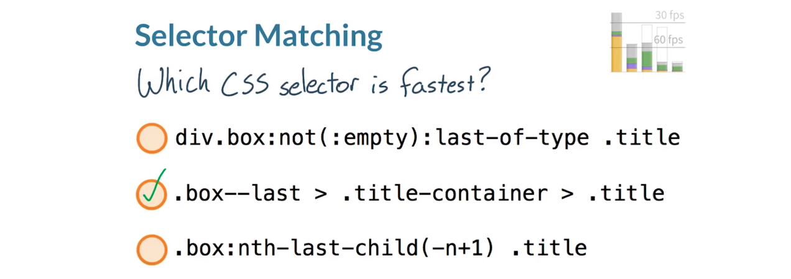

注意，**真正知道哪个选择速度最快的唯一方法是<u>进行衡量</u>**，我们现在就来衡量下。

打开该网站，点击“Click me”按钮，看到时间显示出来了。第一约为 3.3ms，第二个 1.4ms，最后一个几乎为 400ms，显然中间的选择器速度最快。

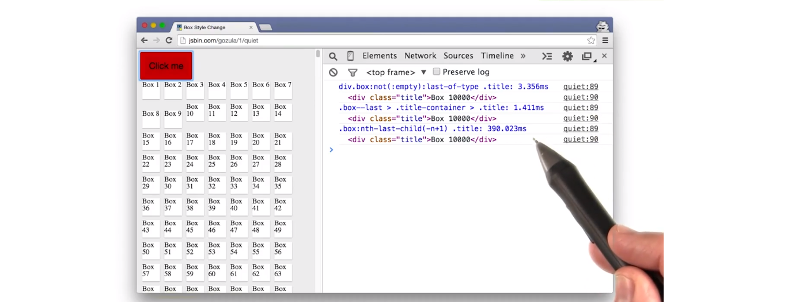

但是事情变得有点复杂，实际上，我们录制这门课程的时候，我们发现最后一个选择器时间这么长是因为出现了 bug。我用 Webkit Nightly 版本显示下同一数据。


这是最新版本的 Webkit Nightly，点击同一按钮，能看到这些数字吗？放大下。天啦！数字一目了然，中间的依然很快，但是之前的 400ms 现在只有约 0.06ms。**表明了衡量性能是多么重要，因为随着时间的推移，数据也会变**。因为随着时间的推移，数据也会变。**暂时中间答案速度最快，但是也许某一天就不是这种情况了。确保使用手头上的工具不断衡量**。

---

在[此处](http://jsbin.com/gozula/1/quiet)测试选择器！

**Paul 补充道：使用“工具而非规则”非常重要，因为架构会更改，错误会得到修正。记住规则不会在发生这种情况时将其停止。**

---

## 5. 练习：重新计算样式

想来个挑战吗？你可以在讲师注释中找到此网站的链接，打开时间轴，按下红色的录制按钮，然后点击“Click me”按钮。在时间轴中找到 Recalculate Style 部分，发现 self time 时间太长，根本达不到 60fps，这种情况下，可以采取三种措施。

- 减少受影响元素的数量
- 降低选择器的复杂性
- 或者同时实现两者

减少受影响元素的数量意味着在渲染树中修改更少的节点。降低选择器复杂性意味着使用更少的标记和类名称来选择元素。但为何不二者都采用呢，这样就双赢了。

对于这道测试题，请让 Recalculate Styles 效率更高，如果一切顺利的话，应该能够使时间下降 5 到 10 分之一。但开始前，稍微给些提示。这个示例在 body 上使用了一个类来更改所有 box 的样式。意味着需要检查每个 box 的样式，可以通过这个 box 类上的 nth-chlid 选择器看出这一点。替代的方法是使用 querySelectorAll 来获取页面上的所有 box，获取后，通过使用 JavaScript 循环访问这个列表并切换到其他 box 的样式。

这是使用 querySelectorAll 的解决方案。

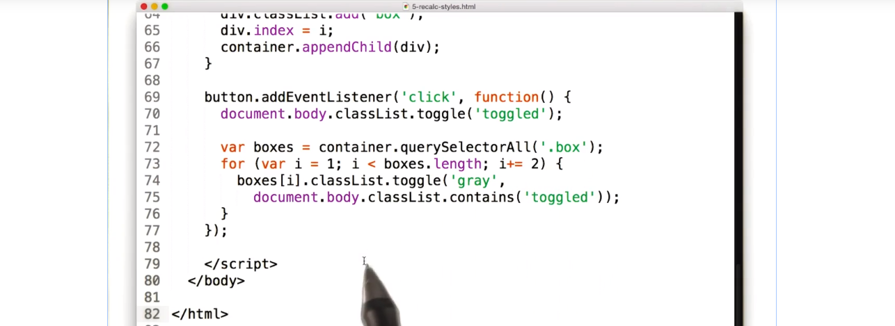

1. 首先，类“toggled”在 body 上切换了
2. 然后在页面上使用 querySelectorAll 寻找所有具有类“box”的元素
3. 然后使用这个迭代公式“i+=2”，循环浏览器列表里的每个元素，并切换了类“grade”，这里应该还有第二个参数，结果应该是 true 或 false，目的是确保 body 包含类“toggled”，如果不包含则不执行这一步，如果包含则执行。
4. 在 css 中添加选择器 “.box.gray”，只用于更改背景颜色。

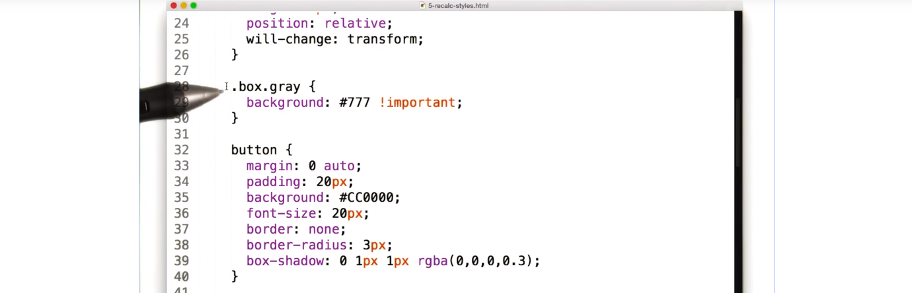

所有迭代过程都是通过 JavaScript 实现的。

---

查看视频中演示网站可以点击: [案例网站](https://dl.dropboxusercontent.com/u/2272348/codez/udacity/box-recalc-style-slow.html),如果上述网站打不开可以点击:[本地网址](https://s3.cn-north-1.amazonaws.com.cn/static-documents/nd001/Box+Style+Change.htm) 进行查看。

---

## 6. 布局反复

我们来看看这个示例，当我更改这个绿色方块的宽度，然后点击此按钮时，所有段落都会改变大小。可以看出，这一过程需要很长时间。要找出原因，我们需要重新查看下管道，尤其是各个任务的顺序。


顺序非常清晰，先执行 JavaScript，然后执行样式计算，然后执行布局流程。保持这一顺序非常重要。

这是代码：

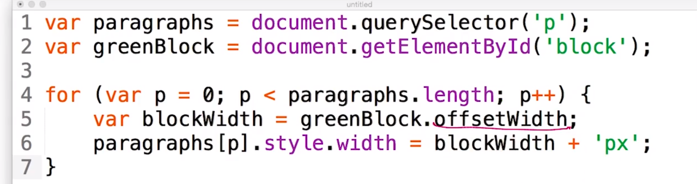

首先，我们选择了所有段落，然后是绿色方块，然后按顺序查看每个段落。对于每个段落，我们都请求绿色方块的宽度，然后相应地设置每个段落的宽度。

问题是，**要使用 offsetWidth 获取每个元素的宽度，浏览器必须先计算该宽度，这就需要布局**。

我们来看看对管道造成的影响，代码将布局移到了这里，使布局跑到了样式计算的前方。这并不是问题，除非你更改了样式，而当我们设置段落的宽度时，就更改了样式。

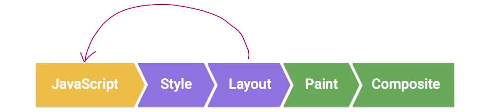

我们再来看看代码：（上面）

我们请求了宽度，然后设置了样式。我们执行布局流程，然后计算样式。每次更改样式，我们刚刚执行的布局流程都会变得无效，因为你更改了样式。现在浏览器就要重新完成一遍，这一错误的代价会很高。

如果你触发了强制同步布局，开发者工具会在这里用感叹号标出来。

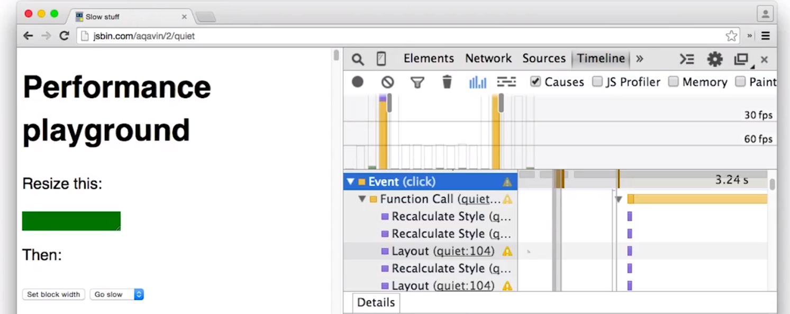

在帧图表视图中，你会在布局记录的右上角看到红色的三角形，这和瀑布视图的感叹号是一回事。

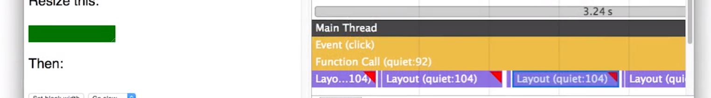

如果你看到这个警告，则需要找出代码的何处强制了同步布局并且删掉。

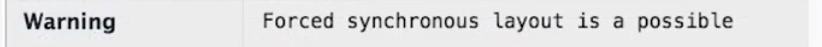

---

### [这是示范站点](http://jsbin.com/aqavin/2/quiet)

---

## 7. 练习：FSL（Forced Synchronous Layout）

刚刚 Paul 告诉大家，**当你在 JavaScript 部分请求浏览器先运行布局，然后重新计算样式，然后再次运行布局，就会出现强制同步布局错误**。**当我们访问某些属性时，就会导致布局流程**。你可以在讲师注释里找到这些属性的列表。

下面请分析这三段代码，每段代码都包含了某种类型的循环迭代，即我用到的 forEach。通常，你无法使用包含 DOM 节点集合的 forEach，这些节点是通过使用 Document.querySelectorAll 获得的。但我很喜欢 forEach 因为它的回调函数语法非常强大，我需要你做的是将 DOM 节点集合转换为 DOM 节点数组，使你能够使用 forEach 和其他数组方法。请参阅讲师注释中的示例，了解具体方法。

其中两段代码将导致出现强制同步布局，但哪个不会导致出现呢？你可以在下方讲师注释中找到使用这三段代码的示例网站链接以及其他有用的提示。请打开示例网站，试试这三段代码。看看你能否找出哪段代码不会导致强制同步布局。

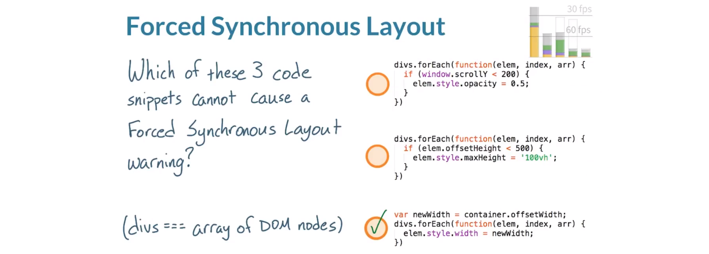

- 我将从第一个开始，实际上导致了强制同步布局，看看这里的 Window.scrollY，这就是访问后会导致布局流程的其中一个属性。导致了布局流程，然后更新样式，这回使浏览器进入槽糕的读取/写入循环。在重新计算样式和布局之间切换，所以这段代码是强制同步布局。
- 第二段代码也导致了强制同步布局，同样，访问 offsetHeight 导致浏览器运行布局，然后，(๑•̀ㅂ•́)و✧bam，这里出现了样式更改。这个选项肯定对性能有负面影响。
- 这样可以推断出第三个选项不会导致强制同步布局，注意我们是在循环体外面访问的 offsetWidth，这是个很好的策略，布局运行一次，然后批量更新样式，非常不错。

问题是，如何修改这两个选项呢？

---

### [这是示范站点](https://udacity.github.io/60fps/lesson5/stopFSL/index.html)

请查看 [CSS 触发器](http://csstriggers.com/)并详细了解[触发布局](http://gent.ilcore.com/2011/03/how-not-to-trigger-layout-in-webkit.html)。

这里是我用来替换 `document.querySelectorAll` 的辅助函数。它会创建 DOM 节点数组，我认为这很有用，因为 `forEach()` 等[数组方法](https://developer.mozilla.org/zh-CN/docs/Web/JavaScript/Reference/Global_Objects/Array)非常实用。

```javascript
function getDomNodeArray(selector) {
  // get the elements as a DOM collection
  var elemCollection = document.querySelectorAll(selector);

  // coerce the DOM collection into an array
  var elemArray = Array.prototype.slice.apply(elemCollection);

  return elemArray;
};

var divs = getDomNodeArray('div');
```

---

## 8. 练习：停止 FSL 的策略

现在你知道像这样的代码会导致强制同步布局，那么可以如何避免呢？

- 应该完全避免使用 JavaScript 读取布局属性？
- 应该读取布局属性，然后批量处理样式更改？
- 在循环中，应该先更改样式，然后读取布局属性？
- 或者决不能使用 JavaScript 来更改样式？

首先，这个答案和这个答案肯定不对（第一个与第四个）。完全可以使用 JavaScript 来读取和修改布局属性及样式，实际上，这正是 JavaScript 存在的意义，所以不用担心这些操作，虽然有时候会出现同步布局。就只剩下这两个答案（第二个与第三个）。我将分别分析下每个答案。

- 在循环中，你应该始终先更改样式，然后读取布局属性。
- 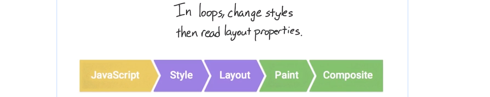

这个答案似乎是合理的，因为你先更改样式，然后读取布局属性。问题在于这个词——“循环（loops）”，更改样式后，就需要运行布局，如果就发生一次，没什么关系。如果在帧结束前，你需要重新计算样式并再次运行布局，则导致浏览器重新执行大量工作，最终导致同步布局。所以这个答案不对。

在 JavaScript 阶段先读取布局属性，意味着你将使用上一帧的布局，然后进行所有样式更改的话，在这个管道中剩余部分都看起来正常，这里的关键词是——“批量（batch）”。所有样式更改将在 JavaScript 之后批量发生，这意味着重新计算样式将在帧结束时发生并处在管道的正确位置。这个策略在之前看到的示例中是怎样实现的呢？


这是之前的 janky 代码，这是顺畅的 60fps 代码。这个帧仅在开头读取了一次布局属性，然后再批量处理所有的样式更改。这是一个非常简单的修正方法，但是却可以大大提高性能。

---

Cameron 说：在视频末尾，我展示了一个用于避免 FSL 的解决方案。解决方案的第一行引用了 `elem`，而它实际上在 `.forEach()` 循环外并不存在。我应该改为引用所有 `divs` 的容器元素。是我的错！

---

## 9. 强制同步布局的原因

在最后一个示例中，我演示了当 offsetWidth 遇到样式更改时就会触发强制同步布局。还有一些其他属性，在错误时间调用的话也会导致类似的问题。请参阅讲师注释，查看 Tony Gentilcore 发布的这个帖子，其中提供了更多的信息。

**本质上，对于任何属性，浏览器都必须运行布局。所以任何涉及几何信息的更改，例如位置和尺寸都可能导致强制同步布局。**

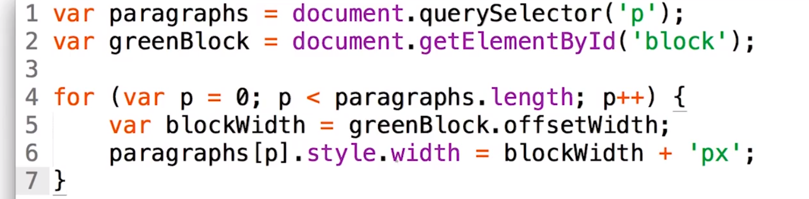

对于这个示例，还要注意一个事项。每个段落都会导致布局，然后重新计算样式、布局、重新计算样式。**这样就使浏览器进入循环，读取和写入大量值，我们称之为布局抖动（layout thrashing）**，也就是快速多次进行强制同步布局。你根本无法想象这个示例执行了多少次。

例如，看看这个，可怕的演示。我们来录制一下时间轴。上下滚动网页，然后停止录制。开启帧模式，马上就能看到我们完全超过了这里的 30fps 线。我们来看看这里。

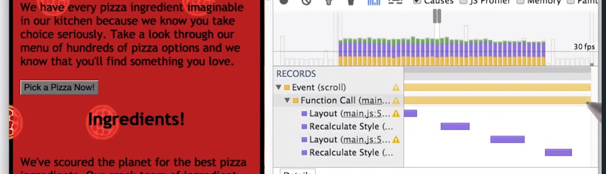

选择任何一个用键盘上的 W 键稍微放大下，这里有个强制同步布局。也可以在瀑布布局下看看。注意，当我们展开滚动事件时，可以在这里看到每个强制同步布局。每个都显著降低了我们的运行速度。

---

### Tony Gentilcore: [如何（不）在 WebKit 中触发布局](http://gent.ilcore.com/2011/03/how-not-to-trigger-layout-in-webkit.html)

---

## 10.练习：停止 FSL

如果你学习了网站性能优化课程，那么这个网站可能看起来比较熟悉。在这门课程的实战项目中，有这么个披萨网站，该网站存在大量问题。毫不夸张的说，如果你花费大量时间浏览这个网站的话，你的眼睛都要看花了。

向下滚动到“Our Pizzas!”这一部分，你会在屏幕左侧看到这个滑块。当你拖动该滑块，披萨尺寸就会变。当你在不同尺寸之间来回切换时，看起来好像并不糟糕，但是我们来看看其性能效果。

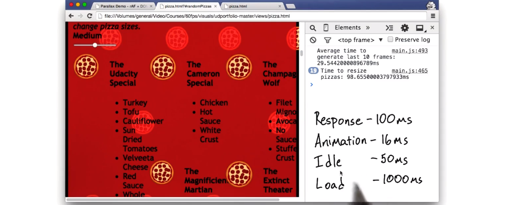

当你打开控制台，会看到两项内容。首先是生成最后 10 帧的平均时间对于这么个简单的网站来说，也太低了。第二项内容是调整披萨尺寸所需时间，每次有人点击这个滑块都会记录这个数据，目前显示的是约 100ms。值得问的问题是 100ms 合理吗？实际上，这个重新调整尺寸时间属于 RAIL 的响应类别。因为是对用户操作做出响应，包括点击滑块，重新调整尺寸可能属于 RAIL 的响应类别，之前提到是 100ms。这样说的话，这个应用实际上满足了响应时间预算。但是这个网站真的很简单，重新调整披萨尺寸操作不应该花费 100ms 的，如果发生在动画或闲置阶段，那完全就超出了帧的预算的时间范围。

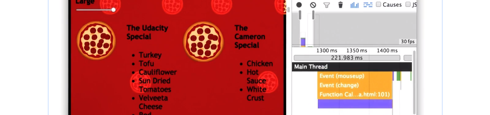

我们可以录制时间轴详细了解下滑块到底发生了什么操作。按下“录制”，调整滑块，然后停止录制。这个紫色肯定不是好现象（上面），展开成单独的窗口，仔细看看。

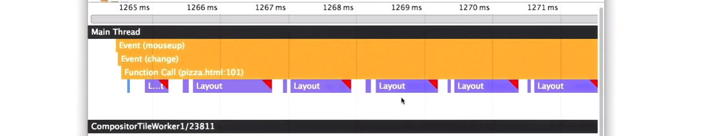

看来滑块调用了一个函数，该函数又导致了不断出现的布局。这是个很大的问题。点击其中一个，了解下更多信息。

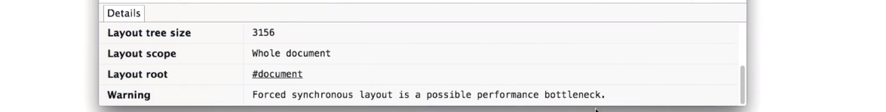

在详细面版本中，看到有个警告：Forced synchronous layout is a possible performance bottleneck；这是个问题。

对于这道测试题，请下载该披萨网站，找到导致同步布局的原因，然后修复。

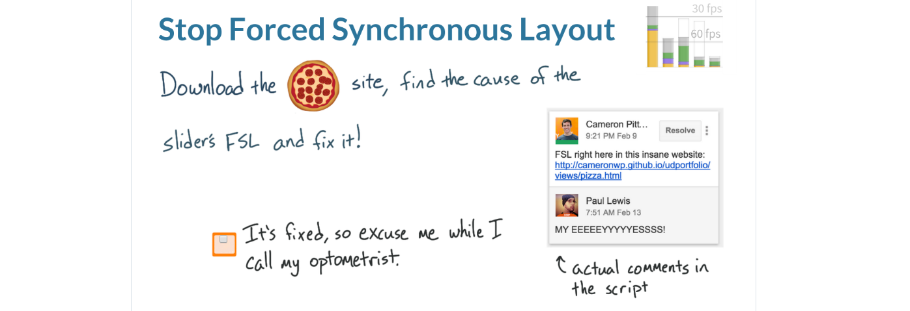

我将演示下如何修复这个网页上的其中一个强制同步布局，你可能不信，其实这个网站上还有其他强制同步布局。如果你愿意的话，也可以一并修复。

首先我将选中 Causes 和 JS Profiler，这样滑块运行时就可以获取更多信息。按下录制，然后更改滑块位置。为了有更多查看空间，我将这个窗口分离出来。

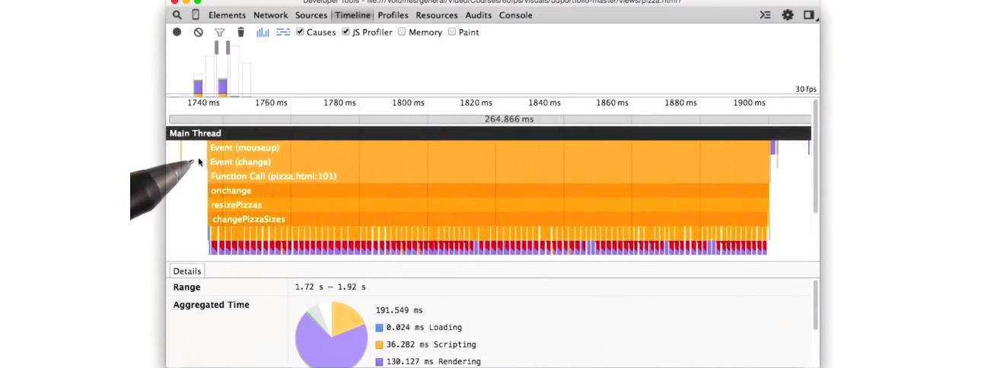

可以看出，当滑块滑动时调用了几个不同的函数。放大了看看。

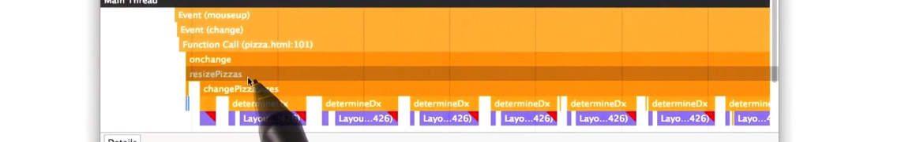

更改事件发生后，调用了 resizePizzas 然后 resizePizzas 调用了 changePizzaSizes，我觉得问题可能就出在这里。看起来函数 determineDx 不断运行，一遍又一遍。我觉得应该看看相关代码。

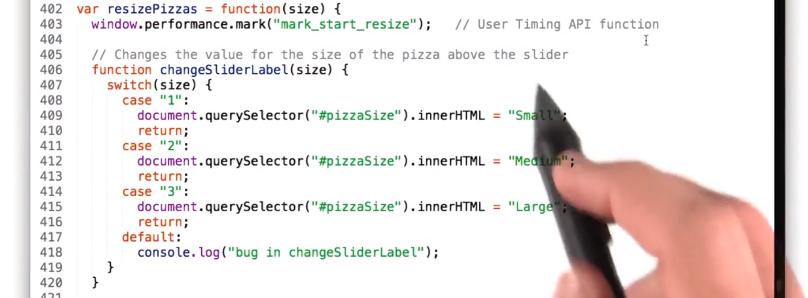

这是 resizePizzas 函数，当滑块被激活时，就会调用该函数。resizePizzas 内发生了几项工作。首先，我使用 User Timing API 来收集一些指标；然后更改了滑块上的标签，看起来很直观，无法想象这些会导致强制同步布局。所以直接往下看。

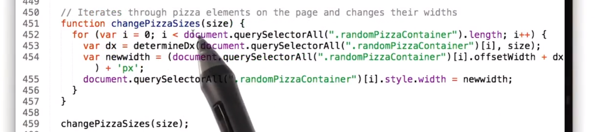

这是 ChangePizzaSizes 函数，这段代码表面看起来很正常，但实际上很疯狂。并不是那种很美观的疯狂，以非常紧凑的形式执行很多任务。而是执行的太多了根本没必要存在。首先，比较明显的问题是这个函数没有通过“不用自我重复”检测——document.querySelctorAll('.randomPizzaContainer') * 3；为何要出现三次啊。

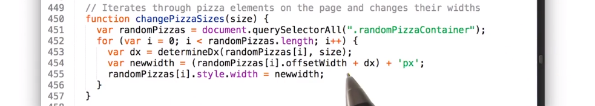

首先我将这些 DOM 节点集合保存到变量 randomPizzas 中，现在我可以在 for 循环里使用 randomPizzas，而不是每次都查询 DOM，现在看看这个 for 循环。它访问了元素的几何属性，即 offsetWidth，然后更改了它们的样式。这明显就是导致强制同步布局的源头。然后是这个函数 determineDx，不用详细说，可以直接强调这个函数一点用没有。非常复杂，创建大量工作，根本没必要出现在这个 for 循环里。将由你来判断这里发生了什么情况。最后，我使用了这个像素值创建公式导致了不必要的工作。除了百分比之外，没必要处理其他工作了。我来简化下。

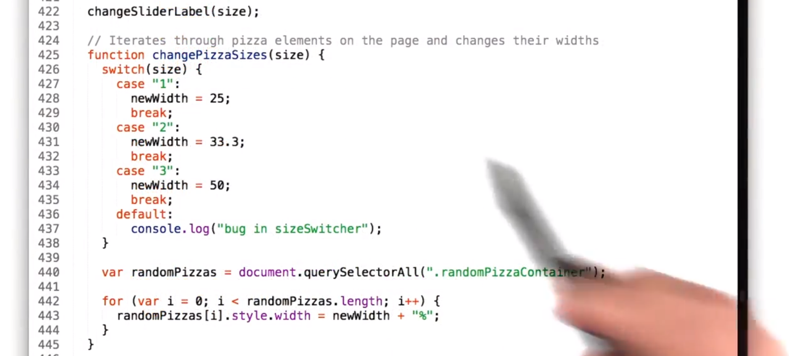

在这个版本里，changePizzaSizes 的职责就是弄清楚需要哪个宽度，然后将所有元素的宽度设为这一百分比。for 循环里不再有查询选择步骤，不用来回转换像素和百分比，更加简化了。但最终的检测条件是这段代码是否产生了同步布局。我们来看看。

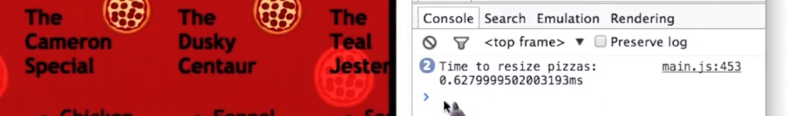

这是改进后的新版本，首先看看数据是不是更理想了。重新调整披萨尺寸所花的时间不到 1ms 了。明显改善了很多，性能提高了两个数量级。但我想看看在时间轴里的效果。

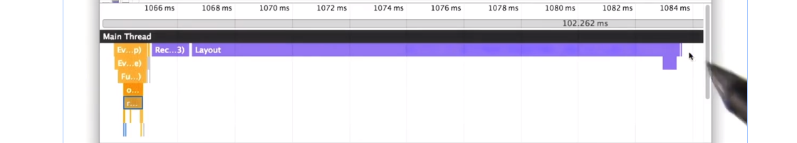

按下录制，更改下披萨尺寸，然后停止录制，分离到新的窗口中，从而有更多的查看空间。这是滑块事件，这是 resizePizzas 事件。这是形成的布局。看看，没有了讨厌的红色三角形——警告存在强制同步布局了。这个时间轴看起来简洁多了。

顺便提一下（BTW），这个网站是我创建的。耶，其实我很自豪，因为创建了一个具有这么多强制同步布局的网站比看起来要难多了。基本上需要避免遵守学过的所有最佳做法，才能创建这么个网站。是个很奇怪的大脑挑战，你不是要求自己尽可能做的最好，而是尽可能做的最差。所有，虽然这个网站如此简单，我却让运行速度远远低于 60fps，简直是壮举。

> (๑•̀ㅂ•́)و✧ 很棒

可能还有其他问题，看看你能否找到并修复它们。前提是如果你的眼球没蹦出来的话。

---

### [Pizzeria repo!](https://github.com/udacity/pizza-perf)

---

## 11. 第 5 课回顾

之前我们讨论了你并非会触发渲染管道的每个部分，实际上，工作量很大程度上取决于你更改了哪个属性。

经常有人问我是否应该用 JavaScript 还是 CSS 使样式产生动画效果，哪个更快？实际上，根本关系不大。大部分情况下速度是一样的。原因在于无论如何更改，更改宽度等都会触发布局，无论使用 JavaScript 还是 CSS。如果你更改了宽度（width）、高度（height）、顶部（top）、左侧（left）就会触发布局。如果触发布局，就会触发绘制流程。或者只是更改了元素的盒阴影，这不会触发布局，但是会触发绘制流程。而绘制流程代价非常高，尤其是在移动设备上。你不能触发布局而不触发绘制流程。

需要小心都更改了哪些样式，何时更改的。在应用生命周期里，即 RAIL 过程，包括相应、动画、闲置和加载。你可以在加载、闲置、响应时间里执行这些代价高的样式更改。但是不能在动画过程。

在动画过程里，你需要尽量避免布局和绘制流程，因为通常时间成本实在太高。如果不行的话，则需要找到减少影响的方式。在下节课里我们将讨论这方面的知识。