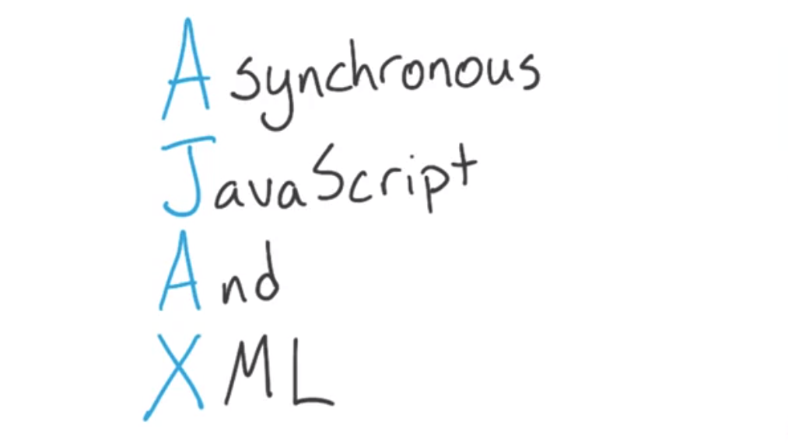
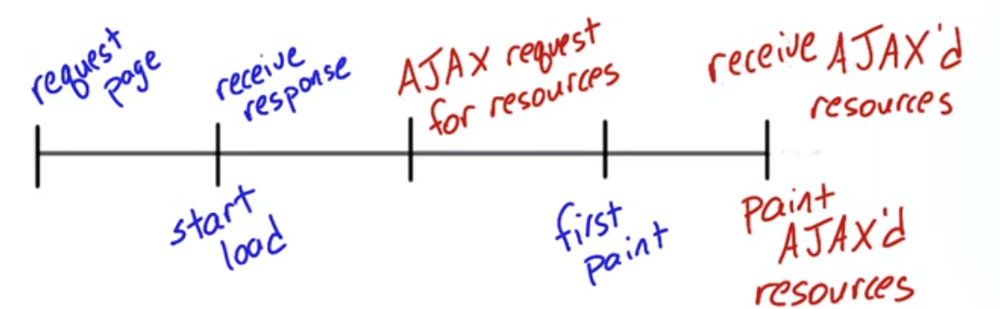
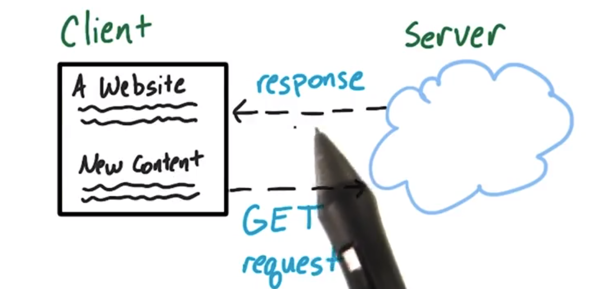
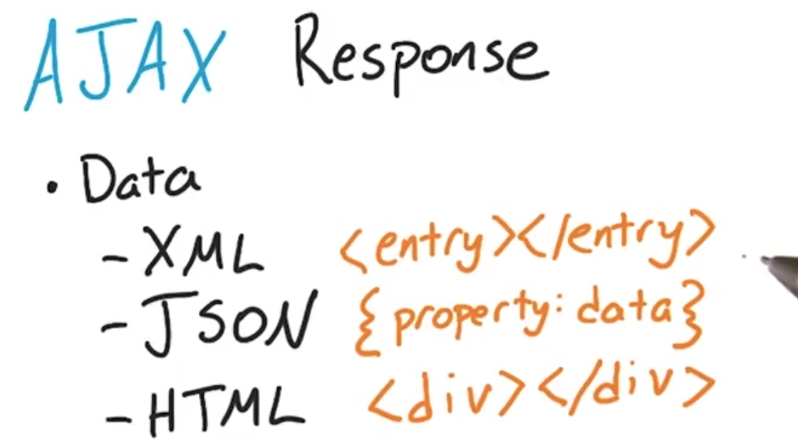
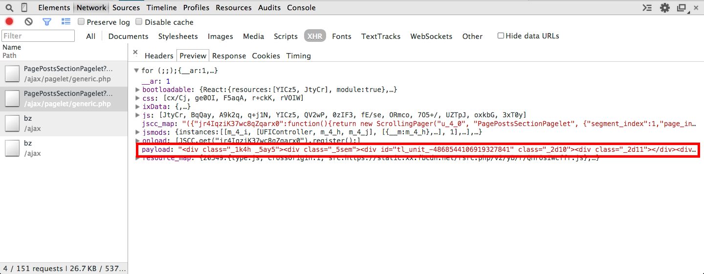
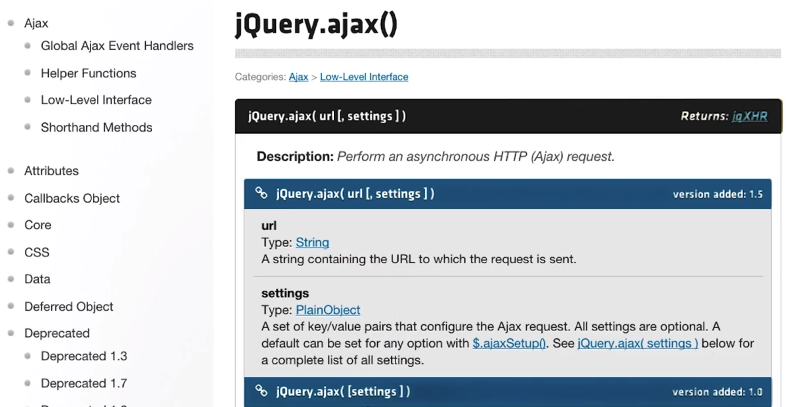

# 3.1 请求和 API - AJAX 

> 学习如何使用 jQuery 的 AJAX 函数向第三方 API 请求数据

---

[TOC]

---

## 1. 前言

假设你想访问某个网站，当你在浏览器中输入网站网址并按下 Enter 你觉得会发生什么？

当然答案取决于具体网站，但可以肯定的是，你会看到快速地出现了某种网站。

你有注意到下一页按钮几乎从互联网消失了吗？现代网站可以不用重新加载页面就能加载内容。

开发者通过多种方式解决了在首个页面渲染后快速加载信息的挑战，一种灵活并受欢迎的方式是 Ajax 请求使数据能够异步地检索。

异步加载的数据可以在加载流程的后续阶段请求，没有这些数据网站也能加载。

---

## 2. 简介

你要构建的搬家策划应用将需要三种不同的异步请求，它将向 Google 街景、纽约时报和维基百科请求数据。

当用户输入地址时，未来新家的街景将变成背景，他们将在下方看到相关的纽约时报和维基百科文章。

---

实际上，这不是 GitHub 代码库！该项目是一个压缩文件，可在“辅助材料”部分中找到：Udacity_AJAX_INIT

单击 Udacity_AJAX_INIT 会下载一个 .zip 文件。解压缩后，你将发现一个包含 HTML、CSS 和 JS 文件的目录。你将编辑 **js/script.js**。

使用你的浏览器打开 **index.html** 以测试页面。

往下拉就可以看到啦～

### 辅助材料

[ Udacity_AJAX_INIT.zip](https://www.udacity.com/api/nodes/3180658579/supplemental_media/udacity-ajax-initzip/download)

---

## 3. 客户端服务器演示

我们先来介绍下什么是请求。

可以将互联网想象成一堆人来来回回发送消息。例如，我将是客户端，意味着我实际上是 Chrome 或 Firefox 等浏览器。Jessica 代表互联网，她是中间人，将来回传递消息。Ben 是服务器，意味着他是专门向像我这样的浏览器提供内容的计算机。

如果我想从 Ben 那获取什么内容，我就会向他发送 get 请求。**get 请求是一种消息，告诉他我是谁，我想要什么**。Jessica 拿到我的消息，并传递给 Ben，**作为服务器的 Ben 查看我的消息，然后返回我所请求的内容，这就叫做响应**。

我可以打开响应，然后对其采取某种操作。

为了让网站能够打开，网站会多次请求数据，就像我和 Ben 正在操作的一样。大部分情况下，响应对页面加载来说很关键。例如，我必须获得 Ben 的 HTML 来加载页面并获得 CSS 来进行布局。

当浏览器发出同步请求，即没有 AJAX，它必须等待响应，然后才能处理加载操作。**AJAX 很特殊，因为它允许这些请求异步地完成，意味着可以在后台发生而不会阻碍网页的其他内容加载**。

让这个比喻再深入一点，假设我向 Ben 发出了 get 请求，但是我脑中想好了响应回来后对响应采取的操作。当我发出请求时，我将写出说明（需要执行的步骤）并放在一边，它们就这么静静地在旁边等待着，现在我可以自由地完成其他任务了。当 Ben 的响应最终回来后，我打开响应，看看我的说明，然后针对说明采取操作。

**我放在一边的这些说明就叫做回调，也就是当我获得响应后就会调用它们**。

---

### 词汇

**GET 请求（Request）**：数据的互联网请求。从客户端发送至服务器。

**响应（Response）**: 服务器对请求的响应。从服务器发送至客户端。**对 GET 请求的响应通常包括客户端加载页面内容所需的数据。**

---

## 4. AJAX 定义

AJAX 表示的是异步 JavaScript 和 XML 请求（Asynchronous Javascript And XML），我们可以忽略了缩写的 XML 部分，暂时就直接将其当做异步 JavaScript 请求。

**AJAX 请求允许在<u>不重新加载网页的情况下</u>检索和显示内容**。AJAX 中的异步是指请求会阻止其他事件的发生，相反，网页会继续执行自己的任务，仅在服务器返回数据后对数据采取操作。

AJAX 请求可以有多种实现方式并且难度各异。某些需要 API 密钥，其他的使用 O-off，某些不用任何身份验证。

不同的 AJAX 请求返回的数据也不尽相同。

AJAX 中的 X 表示 XML，XML 以前是主要的层次数据格式。但如今 JSON 更加流行，实际上，现在多数 AJAX 请求都是 JEDGE 请求，表示异步 JavaScript 和 JSON 请求，但是听起来没 AJAX 好听，所以我们还是称之为 AJAX。

在 AJAX 响应中经常能看到 HTML，网站可以使用 HTML 来填充网页的一部分。

你将需要尝试三种不同的异步请求技巧，你将用到 Google 街景、维基百科和纽约时报 API 三者的工作方式截然不同。

---

## 5. 异步与同步请求

在开始深入探究异步请求之前，我们来考虑一些可能需要请求的现实场景。

请记住，异步请求可以**随时**（加载页面之前或之后）启动，**对异步请求的响应通常包括可以动态插入页面的 HTML。**

[Facebook](https://www.facebook.com/) 使用了大量异步请求，因此页面几乎不需要刷新就能让用户查看新内容。

花点时间思考 Facebook 何时可能利用异步请求来加载新内容，而不刷新页面。思考可能导致异步请求的用户操作。例如，用户在企业的页面（例如，[优达学城的 Facebook 页面](https://www.facebook.com/Udacity)）中向下滚动时，新故事会插入从不需要刷新即可显示新内容的页面中（稍后，我们会详细介绍这一示例）。这是异步请求的一个示例。

准备好找到更多例子时，请单击“跳到练习”！

[开始练习](https://classroom.udacity.com/nanodegrees/nd001-cn-advanced/parts/55f212f3-1450-46a6-aefd-a8295973c097/modules/6c65445f-b411-4342-91f1-cc07b3558f4b/lessons/3174548544/concepts/31818490730923#)

以下是一些帮助：

- **在 Newsfeed 中向下滚动**：向下滚动时，会自动加载新消息。
- **未登录时加载主页**：在[隐身模式](https://support.google.com/chrome/answer/95464?source=gsearch)中打开 [Facebook](https://www.facebook.com/) 以了解我的意思。
- **在朋友的时间线上发布消息**：页面是否会在你发布时重新加载？点击“发布”后，页面会有何变化？
- **单击朋友的每张图片**：滚动查看朋友的图片时，页面是否需要刷新？

### 国内案例:

- [今日头条](http://www.toutiao.com/news_tech/)
- [知乎](https://www.zhihu.com/) 点进去后记得回来上课 :)
- [花瓣](http://huaban.com/all/)

---

## 6. Facebook 示例 1

也就是当你滑到页面的底部时会刷新新的内容。现在很多网站都是这样的设计。下面我们打开开发者工具来查看一下具体发生了什么。

---

你可以在[此处](https://www.facebook.com/Udacity)查看优达学城的 Facebook 页面。 

---

## 7. Facebook 示例 2

首先，我们将打开开发者工具的 Network 标签页，**Network 标签页列出了浏览器在加载和渲染网页时发出的所有请求和响应**。

在网页加载时点击录制的话，可以看出网站所需的各种资源。可以看到图片、JS 文件、甚至看到一些 CSS。

稍后，我将停止录制然后重新录制，当我们尽量往下滚动时，我们将快速暂停然后忽然新的内容将会出现。我们可以在 Network 标签页中看到该请求。

---

## 8. Facebook 的 AJAX 请求

让我们来细分 Facebook 的 PagePostsSectionPagelets AJAX 请求。在你自己的浏览器中跟着我操作，确保你使用的是[优达学城页面](https://www.facebook.com/Udacity)，而不是 Newsfeed（会以另一个名称运行 AJAX 请求）。

请注意我如何使用 XHR [筛选器](https://developer.chrome.com/devtools/docs/console#filtering-console-output)来限制显示的内容。

我想要分析的 AJAX 请求。我正在查看第二个实例，因为第一个示例未返回任何内容。我猜想它来自初始页面加载。第二个实例在我向下滚动页面时启动。

从“标题”选项卡中开始，我们会看到 AJAX 请求的 URL。

我们可以看到，这是一个已使用 200 代码解决的 GET 请求，这意味着它已成功。`data` 参数（见下文）为 Facebook 提供了更详细的有关特定请求的信息。你将看到一个针对 user-agent 的字段，其中描述了你的浏览器。

单击“预览”选项卡，可以在折叠视图中看到 Facebook 的 JSON 响应。你可以取消折叠不同的属性（通过单击它们旁边的三角形）来轻松查看响应的详细内容。

查看 `payload` 属性。它是 HTML！这是在你向下滚动查看时动态插入页面中的帖子的新 HTML。你可能会看到一些奇怪的字符串，如 `/u003C`。它们是 `<` or `>` 等字符的 unicode 表示。

如果你浏览 HTML，应该能够识别将添加至页面的新消息。

之后出现“响应”选项卡，即来自 Facebook 的原始 JSON 响应。

尝试进一步探索 PagePostsSelectionPagelets AJAX 请求。你还能找出哪些其他有用信息？请将你的发现发布到论坛中！

#### 辅助材料

[ Udacity_Facebook.har](https://www.udacity.com/api/nodes/3183838548/supplemental_media/udacity-facebookhar/download)

---

## 9. Twitter 练习

---

Here's the [Udacity twitter 主页](https://twitter.com/udacity).

Cameron 说：在本课程发布后，Twitter 很有可能会更改其 JSON 响应。如果你似乎无法获得正确的答案，不用担心。只需单击“查看答案”继续。

---

## 10. AJAX 请求的必要组件

我们来看看 `jQuery.ajax(url [,setting])` 方法的签名，可以看到 ajax 传入了 URL 和 settings。settings 位于 [] 里，**文档中的这些 [] 表示可选内容**。看到 settings 的话，实际上所有 settings 都是可选的，所以实际上 AJAX 请求只需 URL。

AJAX 还有一个签名，传入的是 settings，而 settings 是可选项。这就导致了有趣的现象，稍后讨论下。

可以看出，对于这个函数签名，甚至不需要 settings，settings 是可选的，并没有 URL。

所以可以调用 ajax 请求而不传入任何内容，但这样也就没意义了。因为虽然会成功调用，但是没有任何作用，请求没起到作用。

在实际操作中，多数帖子请求将可能具有 URL 和某些数据，因为在帖子请求中你通常都会发送数据，get 请求实际中通常具有 URL 和某种类型的回调函数并且随之传递了一些可选数据。但是要发送可用的 AJAX请求，真正必需的是 URL string。

---

仔细阅读[jQuery 的 AJAX 文档](http://api.jquery.com/jquery.ajax/)，以找出 AJAX 请求需要的内容：

中文文档: [:)](http://www.jquery123.com/jQuery.ajax/)

---

## 11. API 启发

比如 Reddit.com 中使用的 youtube 的视频 API 和 twitter 请求数据的 API

---

#### [Google's APIs](https://developers.google.com/apis-explorer/)

你能想到的所有 Google 服务。

#### [一个巨大的 API 数据库](http://www.programmableweb.com/apis/directory)

绝对值得一看，能为你带来一些启示。

此外，你是否知道[优达学城也有 API](https://www.udacity.com/public-api/v1/courses)？它可供任何人使用。我们希望开发人员能够轻松地访问和共享课程目录。

---

## 12. 寻找 API 使用实例

---

#### [Yelp 链接](http://www.yelp.com/)

---

## 13. API 头脑风暴

---

#### [Google's APIs](https://developers.google.com/apis-explorer/)

你能想到的所有 Google 服务。

#### [一个巨大的 API 数据库](http://www.programmableweb.com/apis/directory)

绝对值得一看，能为你带来一些启示。

---

## 14. 下载项目

---

实际上，这不是 GitHub 代码库！该项目是一个压缩文件，可在“辅助材料”部分中找到：Udacity_AJAX_INIT

单击 Udacity_AJAX_INIT 会下载一个 .zip 文件。解压缩后，你将发现一个包含 HTML、CSS 和 JS 文件的目录。你将编辑 **js/script.js**。

使用你的浏览器打开 **index.html** 以测试页面。

往下拉就可以看到啦～

#### 辅助材料

[ Udacity_AJAX_INIT.zip](https://www.udacity.com/api/nodes/3180658597/supplemental_media/udacity-ajax-initzip/download)

---

