# 3.2 编写搬家计划应用 - jQuery 请求

> 和 Cameron 一起使用纽约时报 API 编写一个搬家计划应用。学习如何处理报错和调试 AJAX 方法

---


[TOC]

---

## 1. 使用 jQuery 请求

jQuery 是一种非常受欢迎的 JS 库，旨在通过在所有浏览器上使用一致的 API 让一些常见的 JS 任务更加简单。换句话说 jQuery 让你的生活更加便利。

在每个浏览器上都能正常执行 AJAX 请求是件让人头疼的事。幸运的是，我们可以**使用 jQuery 的 AJAX 方法，将支持旧版浏览器这一苦差事交给 jQuery 就行了。**

一定要注意，开发者经常会使用库来编写 AJAX 请求，你完全可以**使用库来简化你要编写的代码**，尤其是涉及到 AJAX 的情况。

为了使用 jQuery 我们需要使用 jQuery 对象，我们使用变量名第一位为`$`——像 `$body` 这样的变量命名来表示 jQuery 对象。

对于 AJAX 请求，我们将使用两种不同的方法，即 .ajax() 方法和 .getJSON() 方法。两个方法都传入了 URL 和某些可选参数。

查看讲师注释来了解更多内容。

---

#### [jQuery 的 .ajax() method](http://api.jquery.com/jquery.ajax/) |[中文](http://www.jquery123.com/jQuery.ajax/)

#### [jQuery 的 .getJSON() method](http://api.jquery.com/jquery.getjson/) |[中文](http://www.jquery123.com/jQuery.getJSON/)

---

## 2. 加载街景

对于第一个异步请求，我们来获取某个地点的 Google 地图街景。注意，我们希望将打算搬到的地点对应的图片设为应用的背景。你将执行的操作实际上并不是 AJAX 请求，因为这里我们请求的是图片资源而不是请求数据，例如 JSON 对象。但是使用街景等服务非常有趣而重要，这样使得背景更加有意思。

我们从街景开始练习，其实很有意思。因为我们甚至不需要使用 jQuery 就能让应用运转。我们的页面将向 Google 请求图片，根据 URL 的不同部分，Google 将知道应该向我们提供什么图片。本质上，每个街景图片都具有自己的 URL 断点。该 URL 可以包含相关地点的街道地址字符串。

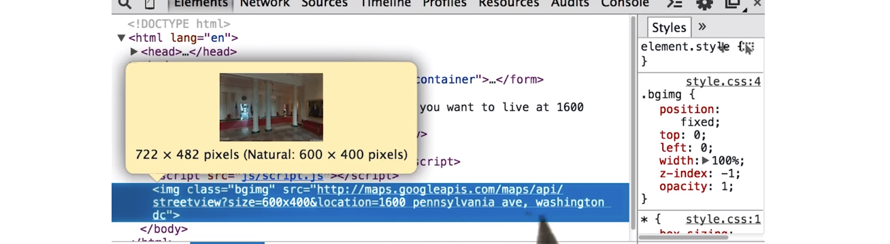

在这里我们可以看到，地点设为了 1600 Pennsylvania Avenue Washington D.C.，很明显我们获得的图片是白宫。注意街道地址和城市之间有个逗号。

在 script.js 中我们可以看到这个函数，叫做 loadData，滚动到页面的最底部，可以看到针对页面顶部表格条目的 jQuery 选择器，当用户点击 submit 时，将加载函数 loadData。

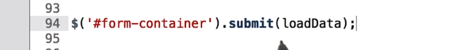

对于这道测试题，请使用 jQuery 来收集用户在这里输入的街道地址和城市。在 URL 字符串的最后加上该街道地址和城市，我们会使用该 URL 来收集图片，在图片标记中将获取的图片附加到页面上，后面加上 class="bgimg" 并将 src 设为 URL 字符串，就像这里显示的。其中街道地址和城市是从顶部的表格中收集的。

完成后，当你输入街道地址和城市应该能够在背景中看到很酷的街景图片。我们可以在 Street VIew API 文档中找到这些图片的工作方式，我们看到街景图片来自一个 URL 开头这样的

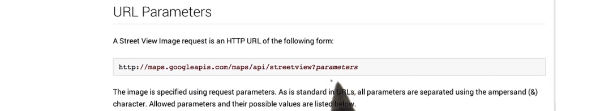

最后是一些参数，这些参数必须具有 location 或者必须是特定全景图的 ID，你还可以设置图片尺寸。在这个示例中，他们将图片尺寸设为了 600x300px，并将 location 设为该图片所在地点的经纬度。

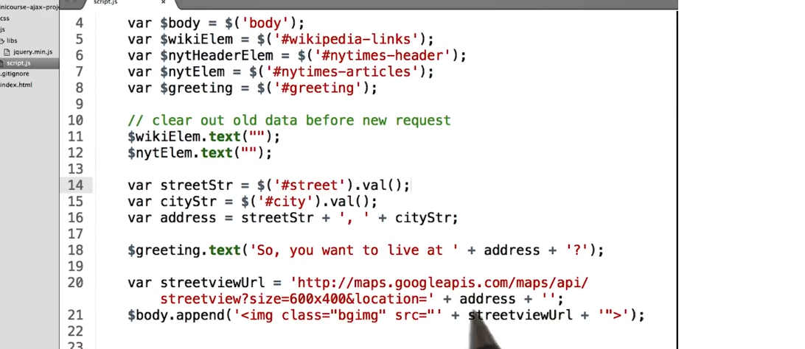

---

Google 街景图片请求必须包括 **size** 和 **location** 参数。

在视频中，Cameron In the video, Cameron 向字符串中添加了 `streetStr` 和 `cityStr` 值：`http://maps.googleapis.com/maps/api/streetview?size=600x300&location=`，从而创建含有上述参数的完整图片请求。

在[此处](http://api.jquery.com/val/)了解如何通过 jQuery 收集 `<input>` 值。

对深入探究 Google 街景视图 API 感兴趣？请查看此[文档](https://developers.google.com/maps/documentation/streetview/)

你可以在“课程材料”部分找到 AJAX 项目：Udacity_AJAX_INIT

单击 Udacity_AJAX_INIT 会下载一个 .zip 文件。解压缩后，你将发现一个包含 HTML、CSS 和 JS 文件的目录。你将编辑 **js/script.js**。

使用你的浏览器打开 **index.html** 以测试页面。

你还需要使用 [jQuery 的append方法](http://api.jquery.com/append/)将 `` 添加至页面。请确保它具有 `bgimg` 类。例如：`$body.append('');` 注意新的 `` HTML 元素只是传递到 `.append()` 中的一个字符串。

#### 辅助材料

[ Udacity_AJAX_INIT.zip](https://www.udacity.com/api/nodes/3177428558/supplemental_media/udacity-ajax-initzip/download)

---

## 3. 纽约时报 API 密钥

我们先使用纽约时报的 API 来获取输入地址的相关纽约时报文章

纽约时报提供了 Article Search API，可以获取从 1851 年到现今的文章。该请求将比为图片标记创建 URL 字符串稍微复杂些。

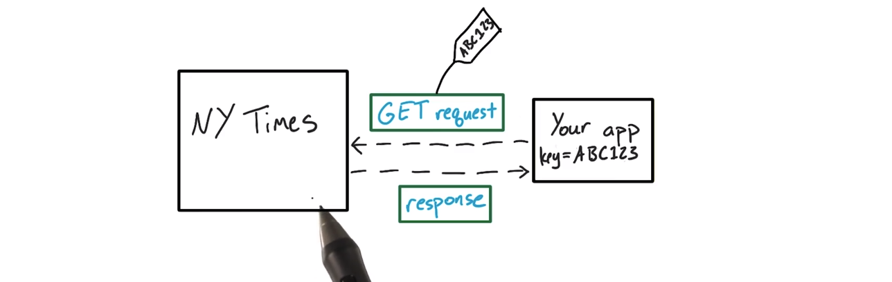

首先我们需要 API 密钥，当你访问很多 API 的数据时，它们都**需要你使用特殊的名称（叫做 API 密钥）来标识你的身份。**

原因有很多，例如，**它们可能想要限制你的请求频率从而不会过载**。只要你没有向此应用每天发出成千上万的 get 请求，你可能都不需要担心频率限制。但是所有的请求依然需要附上密钥。

纽约时报使用自己的 API 密钥，所以要完成此项目你需要注册一个免费账号，有时候你还会遇到身份验证。Facebook 和 Twitter 等服务使用 OAuth 来验证用户的身份，它们只允许具有账号的人获取它们的数据，因为这些数据通常并非可以公开访问的。

大多数需要身份验证的服务都会提供一些入门指南，其中给出了示例代码和详细说明。

---

#### [纽约时报 API 密钥](http://developer.nytimes.com/)

---


## 4. 纽约时报 API 实施

有了纽约时报的 API 以后，就可以获取一些头条和文章开头段落了。

- 你的代码还是应该位于同一 loadData 函数中。
- 你需要使用 jQuery $.getJSON() 方法来发出这个 AJAX 请求
- AJAX 请求发回数据后，你需要解析这些数据，然后弄清楚如何呈现到网页上
- 可以通过查看文档了解 getJSON 方法部分的内容。
- 建议以 console.log 开始，其中传入该 JSON 请求。这样可以知道 data 是个什么样的数据，再通过这个数据结构来做进一步的网站渲染。
  - 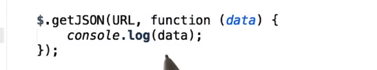

以下为优达学城练习的答案：

- 首先为纽约时报创建这个 URL
  - 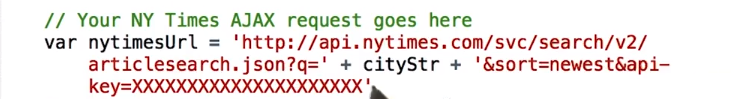
  - 在该 URL 中附加了之前创建的 cityStr，同时在最后添加了 API 密钥
- 接着将刚刚创建的 URL 传入 $.getJSON 然后是匿名函数
  - 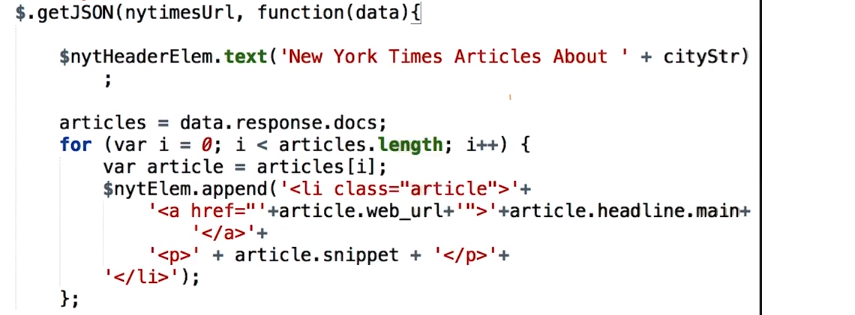
  - 一旦我们从纽约时报那获得响应，这个匿名函数就会运行。
  - 将 headerElem 的 text 设为 ...
  - 然后循环访问这个 data 对象，也就是实际的响应。

我们来看看这部分的内容：

在开发者工具的 Network 标签页中查看所有发出的请求，看到 articlesearch 点击该请求。

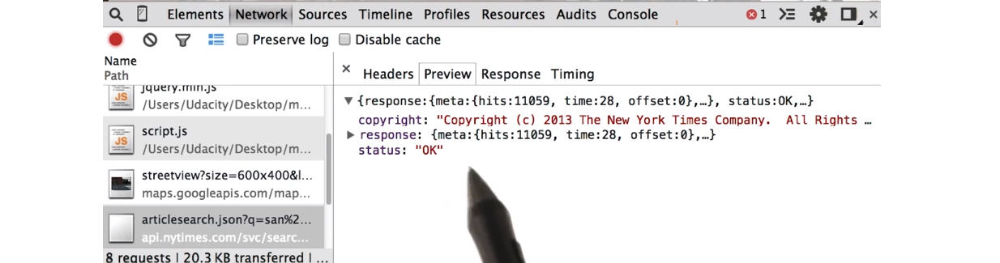

通过 Preview 标签页可以清晰地看出我们的对象是怎样的，打开 response 对象，它是返回的 JSON 中级别最高的属性。可以看出它包含 docs 和 meta，docs 看起来是个数组，打开可以看到每篇文章的对象。

再演示个技巧，在运行这整段代码前，如果你好奇这个 URL 结果会是什么，你可以直接将其粘贴到浏览器中，看看打开的是什么内容。

---

#### [《纽约时报》文章搜索 API](http://developer.nytimes.com/article_search_v2.json)

从此处开始阅读《纽约时报》所要求的 AJAX 请求格式。

#### [.getJSON() 文档](http://api.jquery.com/jquery.getjson/)

然后，仔细研究如何通过 `.getJSON()` 设置 jQuery AJAX 请求的格式。

*啊，我在 1:13 处说“...未签名列表（unsigned list）。”应该是“...\**无序**列表（unordered list）。”才对*

你可以在“课程材料”部分找到项目这一部分的初始代码：Udacity_AJAX_NYT

---

## 5. 处理纽约时报报错

遗憾的是，有时候请求会失败。发生这种情况的原因有很多种，你的应用一定要考虑到这些错误，这样的话，如果 AJAX 请求失败，应用不会完全崩溃。

jQuery 为我们提供了 .error() 方法，我们可以替代为之前创建的 AJAX 请求。如果 AJAX 请求因为任何原因失败了，这个 .error() 方法就会起到作用。

对于这道测试题，请为纽约时报请求设置错误处理流程。如果请求失败，应用应该显示 New York Times Aritcles Could Not Be Loaded，你可以通过几种不同的方式来检测错误处理流程。

- 第一种方式是，你可以直接加载该网站然后断开网络。
- 或者你可以故意写个错误的 URL

---

#### [jQuery .error() 文档](http://api.jquery.com/error/)

仔细研究此处的 `.error()`。

注意：自 jQuery 1.8 起，.error() 已废弃。改用 .fail()。

#### 链接（Chaining）

你问什么是“链接（Chaining）”？它是指将一种方法连接到另一种方法的末尾。例如：

```
var string1 = "hello";
var string2 = string1.slice(0,1).toUpperCase();
console.log(string2);     // "H"
```

在这里，我将 `toUpperCase()` 链接至 `string1.slice(0,1)` 的结果。`string1.slice(0,1)` 会返回 `h`，然后，`.toUpperCase()` 会将 `h` 变为 `H`。

---

## 、6. CORS

在课程的后续部分中，你将遇到一个问题，并通过**跨源资源共享([CORS（Cross Origin Resource Sharing）](http://en.wikipedia.org/wiki/Cross-origin_resource_sharing))** 来解决。

CORS 采用有时过于严格的浏览器策略，旨在**保护服务器不受恶意请求损害**。CORS 在服务器端启用，因此你通常无需担心它是否适用于代码。但你不需要知道，因为有些 API 支持代码，有些则不。

### 什么是 CORS？我们为什么要使用它？

**CORS 采用同源策略。同源策略由 Web 浏览器实施，以防止来自不受信任域的恶意脚本在网站上运行。换句话说，它可确保一个网站的脚本无法自行插入另一个网站。**

例如，同源策略可避免坏人的 JavaScript 以某种方式在你的银行网站上运行并盗取你的信息。

随着时间的推移，开发人员认识到此策略过于严格，常常会阻碍合理的用例。有许多理由可以服务来自多个域源的内容，因此开发人员发现了一种解决方法。

维护服务器端 API 的开发人员可以在其服务器上启用 CORS，以禁用同源策略。**CORS 是相对较新地添加至浏览器的功能。服务器返回特定标题时，浏览器会允许发生跨域请求。**

对于不支持 CORS 的 API，你可能需要使用其他方法。有关同源策略的另一种方法是 JSON-P。**JSON-P 是允许跨域请求的一种独特技巧。许多 API 都允许你提供回调函数名称，它们会生成在浏览器中运行时将数据传递至该函数的 JavaScript 文件。**

这并不是最简单的无错误实施方法，但如果你要使用 jQuery 创建 AJAX 请求，使用 JSON-P 与向传递至 AJAX 方法的选项对象添加额外属性一样简单。你很快就会执行此操作，我保证，它并不像听起来那么可怕。:)

### JSON-P 的细节

你的应用程序会使用简单的 `<script>` 标记从其他域加载脚本。一旦收到脚本，浏览器便会运行该代码。代码只需要构建你请求的作为简单 JavaScript 对象的数据对象，然后使用该对象（你的数据）作为参数来运行回调函数（你告诉服务器使用的函数）。

你需要参考想要使用的任何数据 API 的文档，并查明 API 是否支持 CORS 或者你是否需要使用 JSON-P。

---

## 7. Wikipedia API

现在我们要在网页上显示一些维基百科文章，打开 MediaWiki API 网页，因为 Wikipedia 是由 MediaWiki 负责运行。

看过这个网页后，你会发现你不需要 API 密钥，但是向维基百科发出正常的 JSON 请求会导致 cross-origin 或 cross-site 错误，因为维基百科服务器禁止 cross-origin 请求。

我们可以通过多种方式向维基百科发出请求：

- 一种是在请求上设置 origin 和内容类型报头，这样维基百科就允许我们发出请求了。
- 或者也可以使用 JSONP

在我们的示例中，我们会使用 JSONP。JSONP 请求是一种复杂的技巧，服务器会将响应封装在一个函数内，当它到达客户端时会注入这部分内容，但幸运的是，虽然听起来很复杂，其中不用担心，jQuery 让这一切操作起来很简单。

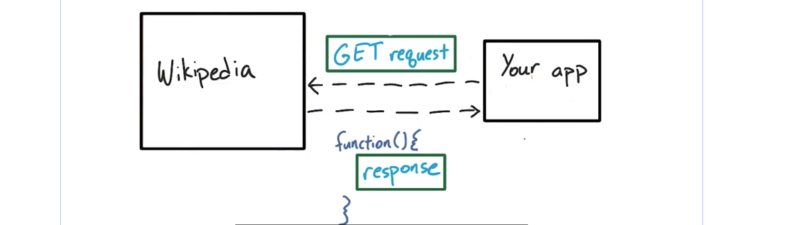

要发出 JSONP 请求，我们将使用更强大的 .ajax() 方法。实际上，我们之前使用的 .getJSON() 方法是 .ajax() 方法的抽象类。而 .ajax() 方法又是异步 JavaScript 请求的抽象类。

对于这道测试题，请使用 .ajax() 方法从维基百科端点处收集数据。你需要在 AJAX 请求中包含一些参数，当然会有 URL，需要包括 dataType，同时注意在方法签名中我们没有可选 success 函数参数，你需要将其设为 property，确保将 success 参数设为当请求成功返回时你希望运行的函数。

- 首先，你需要使用 `$.ajax()` 发出 JSON-P 请求
- 然后向 `$.ajax()` 传入 settings 对象，其中包含 dataType 参数和 success 参数
- 获得响应后，循环浏览器响应，然后在页面上显示相关文章。

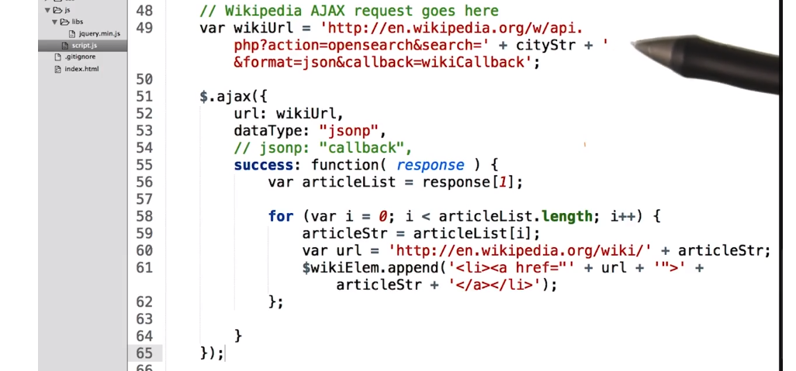

AJAX 请求对象中：

1. 首先我们创建了 URL 参数，使其等于我们刚刚创建的 wikiUrl，如果我们不想传入该 URL 作为此对象的参数，它可以直接变成字符串，并位于这个方法调用的 settings 对象前面。
   - 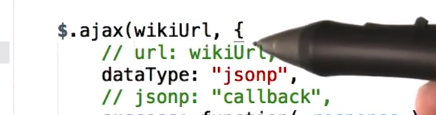
2. 然后我们将 dataType 设为 jsonp 表示这是 JSONP 请求。
3. 然后是 success 函数之前是注释掉的这行代码，这里 JSONP 是个参数，将 jsonp 设为 callback，某些 API 需要将回调函数设为不同的名称，默认情况下，使用 JSONP 作为 dataType 会将回调函数的名称设为 callback，所以这行是多余的。但是如果我们想更改它的话，也就是需要更改这里的 callback，这样对于 JSONP 属性就需要使用不同的字符串。
4. 在 success 参数里的这个匿名函数，当我们获得 response 时就会运行该函数

我们在浏览器中看看这个 response。在 Network 标签页中可以看到这个维基百科请求，点击该请求，看来这里是个 js 对象。

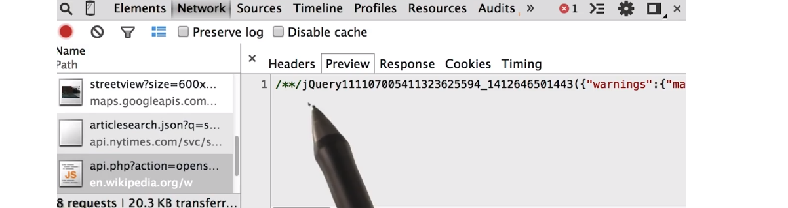

正如之前提到的，这个 js 对象将封装在函数里，可以将这个长字符串看成函数。

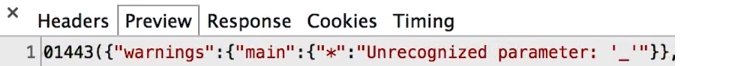

看起来由几部分组成，包括 main 其中包含一些信息。

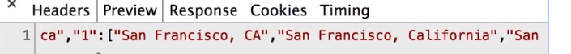

看到这个参数 “1”，其中包含一系列关于旧金山的文章。你会注意到响应中的单词之间有空格，这是可以的，我们可以直接使用 URL 中的内容。

如果我们通过右键点击链接，然后选择“复制链接地址（Copy Link Address）”，然后粘贴到浏览器中，可以看到空格替换成了 %20。

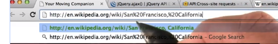


---

### [Wikipedia API](https://www.mediawiki.org/wiki/API:Main_page/zh)

### [Wikipedia 跨站请求文档](https://www.mediawiki.org/wiki/API:Cross-site_requests/zh)

请查看课程材料，以获取 AJAX 项目初始代码：Udacity_AJAX_WIKIPEDIA

### [jQuery .ajax() 文档](http://api.jquery.com/jquery.ajax/)

[此处](https://web.archive.org/web/20160114013014/http://json-jsonp-tutorial.craic.com/index.html)提供了 JSON 与 JSONP 的差异的简单示例。

#### 辅助材料

[ Udacity_AJAX_WIKIPEDIA.zip](http://video.udacity-data.com.s3.amazonaws.com/topher/2017/June/5932b0fa_udacity-ajax-wikipedia/udacity-ajax-wikipedia.zip)

---

## 8. 处理 JSON P 报错

你可能会提出疑问：错误处理流程呢？我没有在调用的结尾处看到 .error 方法啊。

是的，遗憾的是 JSONP 没有内置错误处理流程，这一技术限制是由后台发生的情况导致的。但是可以采取一些变通的方案，就像我们要采取的措施。

当请求运行太长时间时，我们可以使用 setTimeout 来停止该请求。

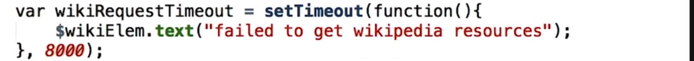

在运行该 AJAX 请求前，我们将创建这个 setTimeout 函数。当我们将 wikiRequestTimeout 绑定到这个 setTimeout 函数时，我们自动启动了计时器，计时器会在 8000ms，即 8 秒钟结束后启动。8 秒钟之后，我们将页面上的 $wikiElem 的 text 更改为 "failed to get Wikipedia resources"。

这是个不错的后退方法，表明如果请求持续了 8s，则将页面上的文本更改成这句话。当然，如果只有这些内容肯定会出现问题。因为不管如何，8s 后，我们都会讲 wikiElem 中的 text 文本进行替换。也就是说，即使 AJAX 请求成功返回了响应内容，这个 Timeout 也会发生。

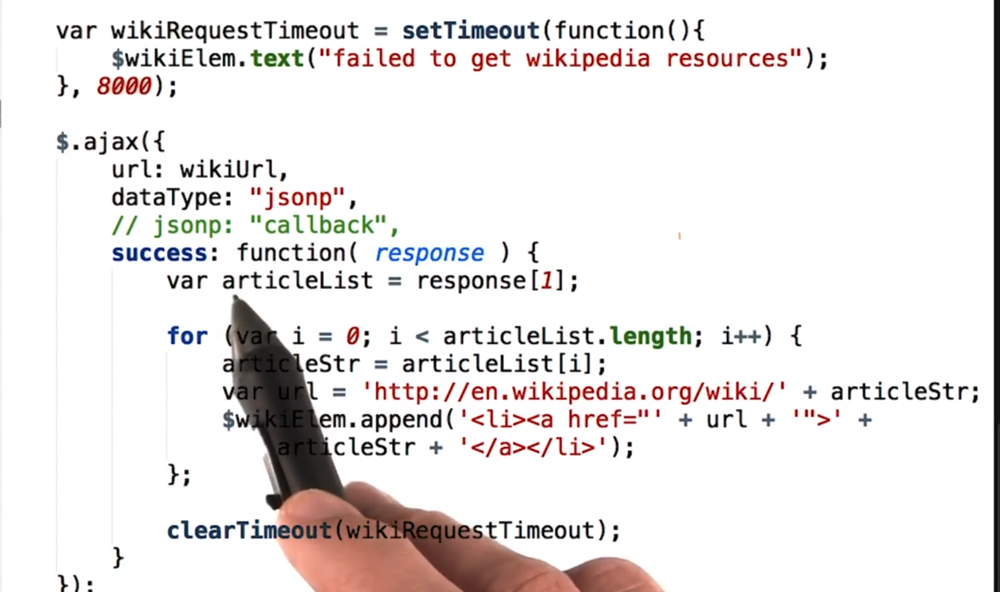	

所以，我们需要添加这行内容，叫做 clearTimeout，并传入我们在之前创建的 Timeout 变量，即 wikiRequestTimeout，这个 clearTimeout 将清除或阻止这个 Timeout 发生。

所以，在 success 方法内，我们将所有文章附加到页面上，然后说：嘿，停止该 Timeout，我们不再需要改 Timeout。

我们可以采取几种不同的方式来处理 JSONP 请求的错误状况。但这个方法是比较简单的一种。

---

注意：**自 jQuery 1.8 起，“success”回调已废弃，改用“done”。**

正确的写法是：

```javascript
$.ajax({
   //stuff
}).done(function(){
   //do math
});
```

---

## 9. 练习：调试

有时候事情总是不能正常发生，请求可能因为多种原因而失败。也许是服务器坏了，也许是网络有问题，或者是你的请求写的很槽糕。

这样吧，我们来考虑下最后一个示例，并写出错误的 AJAX 请求。打开你的 script.js 文件，然后弄乱这里的 wikipedia 字符串（也就是 wikiUrl 变量的值，随便改一下，直到不再是个有效网站）比如：

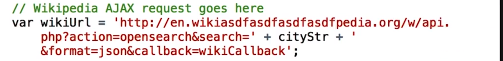

加载你的网站，然后搜索某个地址，但是保留这个弄乱的 wikipedia 字符串。然后打开开发者工具，到处浏览操作下，对于这道测试题，打开开发者工具，找出你看到的相关错误消息。具体来说，我想知道显示了什么样的全是大写消息。

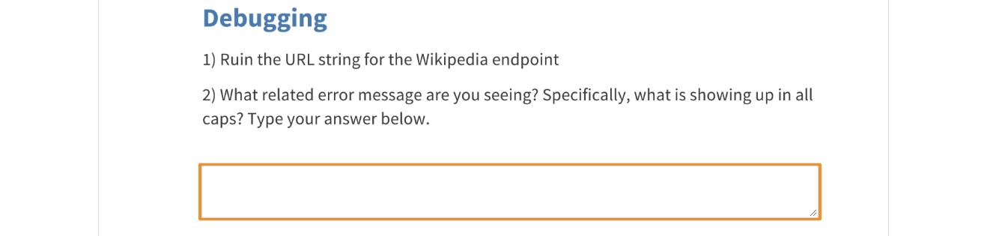


打开开发者工具，很快看到这个错误：`ERR_NAME_NOT_RESOLVED`

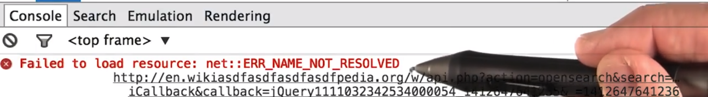

很明显这不是真正的 URL，所以我们看到这个名词无法解析错误。在 Network 标签页内，我们看到这个 GET 请求显示为红色，表明它失败了。另一个针对纽约时报的请求，显示了代码 200 表明一切正常。

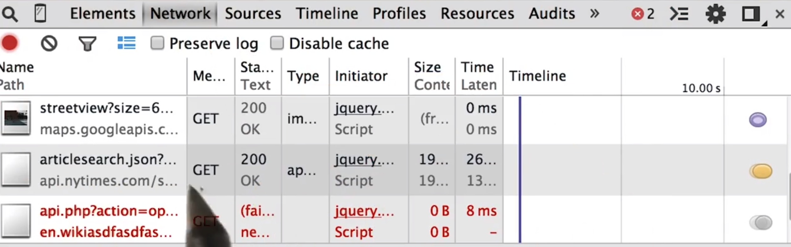

如果你的页面有看起来不正常的地方，打开开发者工具，并转到 Network 标签页则是个很好的方法。我们还看到错误处理流程正常运转了，因为这里显示了 failed to get Wikipedia resources。

这再次证明是个不错的做法，告诉用户“嘿，好像有不太正常的地方”，但是没有破坏整个网页的现实效果。

---

你可以在“课程材料”部分中找到完整的项目：Udacity_AJAX_COMPLETE 

#### 辅助材料

[ Udacity_AJAX_COMPLETE.zip](https://www.udacity.com/api/nodes/3137588543/supplemental_media/udacity-ajax-completezip/download)

---

## 10. 练习：加快初次渲染的速度

正如在这节课的一开始提到的，快速渲染网页极为重要。我们来思考下：

如果你能异步请求数据，则可以采取各种全新的方式来快速加载网页。我们来看看这个食品应用：

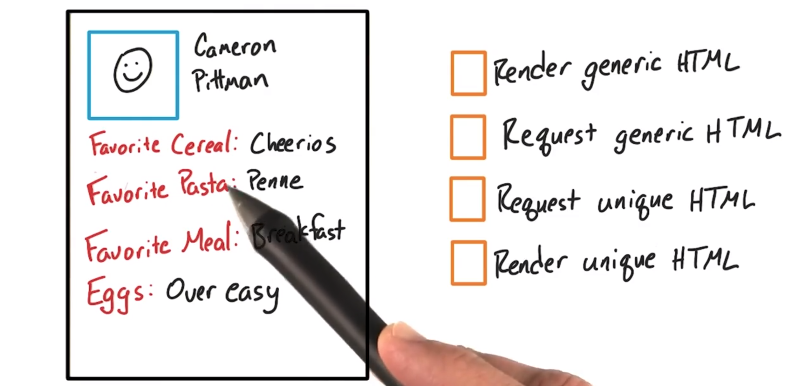

上面包含了：Favorite Cereal、Favorite Pasta、Favorite Meal，以及鸡蛋的烹饪方式。它会根据用户（即我自己）显示自定义内容。看看这些针对该应用的渲染步骤（右侧），我们可以按照什么顺讯执行这些步骤，而让首批像素尽量快速地显示到屏幕上。解释下：

- generic 是指对所有用户来说都相同的 HTML，也就是针对 Favorite Cereal、Favorite Pasta 的 HTML，甚至可以是 CSS，例如如何设置该图片的样式以及如何设置所有文本的样式。
- Unique HTML 指的是我的名称字符串，所有我喜爱的食物字符串等内容，因为这些是特定于我自己的。

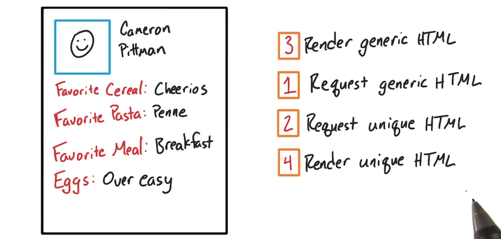

- 首先，要获得该页面，我们需要 generic HTML，这样就获得了大致的页面框架。
- 当我们获得了 generic HTML 后，就可以发出 unique HTML 请求了，我们可以开始使用 generic HTML 加载页面，然后使用一些 unique HTML 来完成页面加载过程。

实际上可以将这个 generic HTML 与 unique HTML 分开来并开始渲染页面，渲染 Favorite Cereal、Favorite Pasta，或者可以为图片留些空间。甚至可以在获取特定于我自己的 unique HTML 之前发生。

当涉及到自定义内容时，这是快速渲染页面的非常有用的技巧。几乎始终存在一些浏览器需要的 generic HTML，如果我们能快速返回 generic HTML 并快速渲染，则会让我们的应用看起来速度非常非常快。我们始终可以在处理过程中发出 unique HTML 请求 并在获得请求后再填充相关数据。

你将注意到，对于 facebook News Feed，当它第一次加载时，会出现一些空的报道。Facebook 采取的正是你在这里看到的技巧。Google 搜索同样如此，当你搜索某个内容时，你会首先看到标题，然后搜索结果开始填充起来，因为这是一种非常有效的技巧，可以尽快地将内容显示到屏幕上。

---

请查看[网站性能优化](https://www.udacity.com/course/ud884)中的[此示例](https://classroom.udacity.com/courses/ud884/lessons/1464158642/concepts/15290985500923)，以查看区分常规和唯一 HTML 的示例。

**常规 HTML**：是指可用于任何用户的 HTML 和 CSS。例如，所有用户都会需要“最喜爱的谷物”、“最喜爱的意大利面食”的 HTML，以及描述如何设置用户图片样式的 CSS。

**唯一 HTML**：是指特定于某个用户的 HTML 内容。例如，“脆谷乐”、“通心粉”、“早餐”和我的图片就是唯一 HTML。

---

## 11. 结束


---

