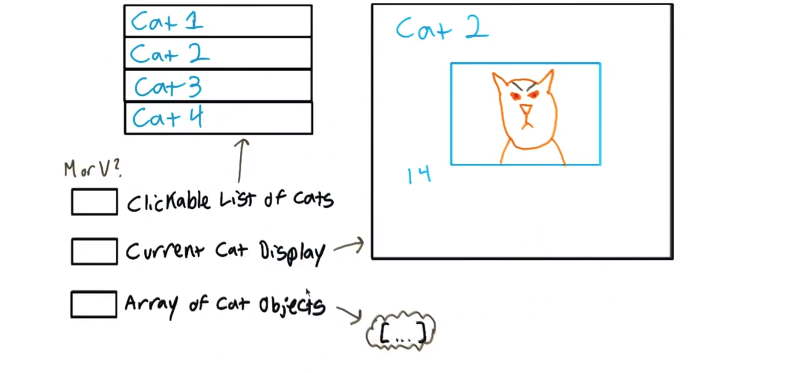
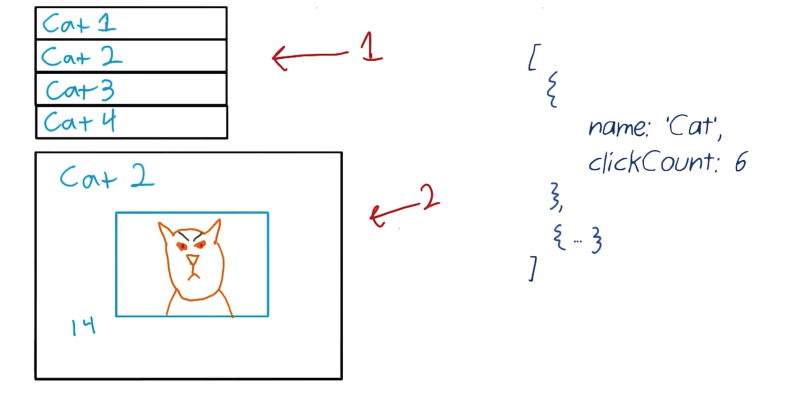
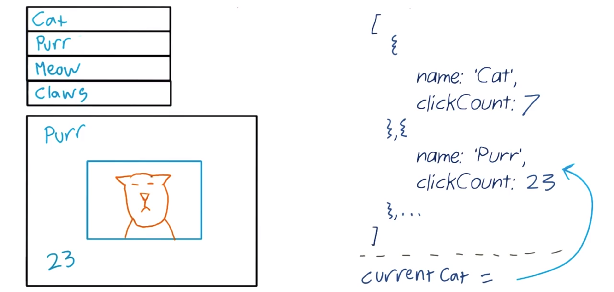
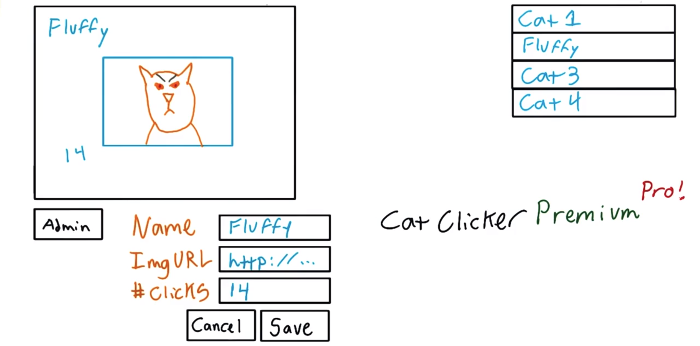
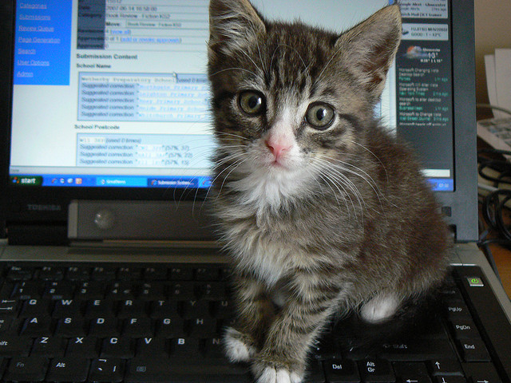

# 3.4 分离重构

> 开始重构你的 Cat Clicker 应用的代码，学习如何最好地改进应用的结构。

---

[TOC]

---


## 1. 第 2 课简介

还记得 Cat Clicker 吗？还记得当这个项目的需求一遍又一遍地改变 Andy 那痛苦的表情吗？我记得可清楚了。太可怜了，Andy。

总之，我们的最终版本有两大部分。包括：

- 一个猫咪列表。
- 一个猫咪详情部分。你可以在那里点击当前选中的猫咪。

实际上，通过上几节课的学习，我们已经能够构建 Cat Clicker 了，但这次我们要正确地构建它。

现在谈谈我的个人体验，虽然我写过很多应用程序，还做过很多木工结构，但我还是非常痛恨一件事，那就是做计划。**每次不做计划的话，最终花费的时间更多。最后总是希望自己一开始花时间去做计划了。**

所以，我们也来花点时间做下计划。


---


## 2. 练习：识别模型和视图

我们再来看看问题，我们希望构建一个应用，其中包含一个猫咪列表。当你点击列表中的猫咪时，猫咪会显示在这里的猫咪显示区域。此外，点击次数应该始终对应的是当前的猫咪。



我们现在来分析下，哪些属于模型，哪些属于视图和章鱼。

首先确定模型和视图部分，对于这些内容，请指出它们是属于模型还是视图？

- 可以点击的猫咪列表 V
- 目前的猫咪展示 V
- 猫对象数组 M


猫咪对象数组肯定属于模型，因为它是代表猫咪的数据。

可点击猫咪列表和当前显示的猫咪都属于视图部分。它们是用户能看到并与其互动的内容。

---


## 3. 检查高级版的模型和视图

现在再详细看看模型和视图。



模型将非常简单，就是我们的数据，即猫对象数组，包括以下属性：

- 名称：name
- 点击次数：clickCount
- 图片 URL

视图的话，如果愿意可以拆分成两个视图。

- 首先是猫咪列表
- 然后是猫咪显示区域

这两个视图都非常简单，只是包含重新绘制相关区域的渲染函数。它们将包含点击处理程序，并针对这里的各种猫咪和下面的图片进行注册。

为何要拆分成两个视图呢？

这里介绍下很好的思考方式。思考它们的功能是分开的，但不是操作方面，而是渲染内容。列表渲染的是猫咪列表，何时重新渲染呢？目前在应用开始时只渲染一次。另一部分渲染的是猫咪详情，每次点击猫咪，它都会重新渲染。它们在外观上和渲染时间方面都是分开的，这里分开来确实合理。

如果你想用一个视图的话也行得通，但是只要可行，通常都应该将功能拆分成一个个更小的部分。


---


## 4.  确定章鱼

我们的章鱼 Larry 在哪啊？模型和视图如何相互联系呢？我们来看看在我们的应用中发生了什么。



- 首先，应用开始加载，出现空白的屏幕。
- 然后列表开始创建。再然后列表视图中出现猫咪。
  - 这两项任务，章鱼 Larry 都可以执行。但不是在屏幕上行进行渲染，这是视图的职责。而章鱼是负责一开始告诉视图渲染自己，也就是说，**章鱼推动操作的发生**。
- 然后章鱼更改了模型中的当前猫咪，当前猫咪设为这里的第一只猫咪。
  - 发生这一情况后，章鱼说：嘿，渲染这个视图吧。然后应用就渲染了当前猫咪视图。同样，渲染这里的视图不是 Larry 的职责，但章鱼 Larry 负责告诉该视图**何时应该渲染**。
  - 现在章鱼让我们的模型开始操作，并让我们的视图开始操作，让所有内容都渲染了。
- 现在讨论下用户点击猫咪的情况。
  - 章鱼负责跟踪你点击了哪里，所以如果你点击了这里的这只猫咪（详情视图中的猫咪），章鱼将运行相关函数，先增加模型里的计数器，然后增加视图里的计数器。
  - 如果用户点击了这只猫咪，即第二只猫咪（列表中的）。那么章鱼会执行以下操作：
    - 先更改模型，当前猫咪现在设为 Purr
    - 然后告诉这里的视图重新渲染自己。

回顾下，当应用加载时，首先 Larry 会初始化模型。这里，我们的数据比较简单，所以没啥内容。然后 Larry 告诉所有视图渲染自己。最终，章鱼指出每当你点击任何猫咪 ，执行这个或那个功能，然后告诉出现更改的相应视图重新渲染自己。


---


## 5. 练习：Andy 的代码 1

现在来看看 Andy 的面条代码，看看每个部分应该属于哪个类别。因为你可以这么分类，如果你将功能分隔成三个类别，即模型、视图和章鱼，则可以对面条代码进行重构，并使其变得井然有序，可以扩展。

你可以在讲师注释中找到 Andy 的实际代码对应的资源库。

在重构钱，我先运行下应用，玩玩应用看看都有什么功能，这样可以帮助我稍后理解代码。

现在看看 Andy 的实际代码， 你能否弄明白 Andy 是如何显示不同猫咪的？

- 对于每一个点击的猫信息，替换单一视图下的 DOM 元素。
- 为每一只猫保留一个单独的视图，展示、隐藏它们。


这里是 [Andy 的 Cat Clicker](https://github.com/udacity/ud989-cat-clicker-andy) 的代码库。


答案是他为每只猫咪创建了单独的视图，显示并隐藏这些猫咪。我们来看看 Andy 的 HTML：

```html
<body>

	<div id="catlist">
		<button id='button1'>cat 1</button>
		<button id='button2'>cat 2</button>
		<button id='button3'>cat 3</button>
		<button id='button4'>cat 4</button>
		<button id='button5'>cat 5</button>
	</div>

	<div class="cat" id="cat1">
		<span class="counter">0</span> clicks
		<br>
		
	</div>

	<div class="cat" id="cat2">
		<span class="counter">0</span> clicks
		<br>
		
	</div>

	<div class="cat" id="cat3">
		<span class="counter">0</span> clicks
		<br>
		
	</div>

	<div class="cat" id="cat4">
		<span class="counter">0</span> clicks
		<br>
		
	</div>

	<div class="cat" id="cat5">
		<span class="counter">0</span> clicks
		<br>
		
	</div>

</body>
```


- 他似乎**硬编码**了所有五个按钮以及下面的所有五只猫咪。如果我们请他添加 15 只猫咪的话，这个文件肯定会很长。
- 还注意到，他没有在同一个地方显示猫咪，每只猫咪都有自己的视图。正如我之前提到的，如果出现了什么状况，其中两只猫咪同时出现的话，机会打乱应用的外观。

---


## 6. 练习：Andy 的代码 2

我们再来看看 JavaScript

```javascript
var cats = $(".cat");
var buttons = $("button");

function hideAllCats(){
	for (var i=0; i<cats.length; i++){
		$(cats[i]).hide();
	}
}
```

- 在 Andy 的 JS 文件中，我们第一个注意到的是 hideAllCats 函数，可以看出，他循环浏览了所有的猫咪并隐藏它们。
- 然后在 JS 文件最前面是 var cats 和 var buttons，这些是变量，里面存储了 cat 类对象和 button 类对象的 jQuery 集合。
- hideAllCats 函数并不是最佳实现方法，当单个区域有很多个视图，而不是一个视图时，代码中如果出现 bug 很容易就让多只猫咪同时出现了，并打乱布局。之前在 HTML 中也看到了，每只猫咪的确有自己的视图，这是个坏消息。但是如果所有这些分类的话，都看起来像视图。这个代表猫咪视图（指$(".cat")），这个代表按钮，这个函数负责因此所有猫咪，相当于更改页面的渲染效果。所以这三项都像是视图。

继续查看文件。可以看到另两个函数 bindButtonToCat 和 BindCounterToCat：

```javascript
function bindButtonToCat(idNumber){
	$("#button"+idNumber).click(function(){
		hideAllCats();
		$("#cat"+idNumber).show();
	})
}

function bindCounterToCat(idNumber){
	var cat = "#cat"+idNumber
	$(cat).click(function(){
		var count = $(cat+" > .counter").text();
		count = parseInt(count) + 1;
		$(cat+" > .counter").text(count);
	})
}

for (var i=1; i<=buttons.length; i++){
	bindButtonToCat(i);
}

for (var i=1; i<=cats.length; i++){
	bindCounterToCat(i);
}
```

- 你还会看到，这两个函数将在 for 循环中被调用，我们在循环里查看了所有的按钮和猫咪，并针对按钮运行 bindButtonToCat 函数，针对每只猫咪运行 bindCounterToCat 函数。那么这两个函数实际上是干什么的？
  - 它们实际上是向按钮和猫咪图片添加事件处理程序。
- 在 bindButtonToCat 函数中，当你点击按钮，它会使用我们的函数隐藏所有的猫咪，然后获取 ID 为 cat1 或 cat2 的猫咪并显示出现。
- 在 bindCounterToCat 中，当你点击猫咪时，就会执行下面的操作，从 DOM 那获取点击 counter 转变为数字，然后用新的计算器重新更新 DOM。


Andy 的模型的数据存储在哪了？

- 在变量中
- 在 DOM 中
- 在服务器的某处
- 在他的大脑中！


答案是位于 DOM 中。

正如我之前提到的，在 bindCounterToCat 中，它会从 DOM 那获取当前数字。找到 counter 对象，获取文本并转变为数字，加一，然后在 DOM 中更新为新的数字。

那么该数据来自何处？来自 DOM 元素。

点击次数不应该存储在视图或章鱼上，模型是用来存储数据的。点击次数属于模型，但 Andy 将其存储在了视图中，这就是问题。

我们发现 Andy 将数据存储在了 DOM 中，这就是他的代码杂乱无章的原因之一。

---


## 7. 为 Andy 辩护

我要为 Andy 辩护。

为他辩解下，将模型存储到视图中太容易找到理由了，因为这么操作太简单了。

对于第一版本的 Cat Clicker 他没有设置任何特别的变量来存储他的数据， 他直接从视图那请求数据，更新了，然后再放回去。但我们可以看出，当他的项目规模越来越大时，并不太好扩展。

Andy 的代码存在的最大问题是他将数据存储在了 DOM 中，或者可以说，他没有用章鱼将视图和模型分开来。实际上，在他的代码里，模型和视图是完全一样的东西，正因为这一点让他陷入困境中。


---


## 8. 重新构建 Cat Clicker 高级版

我觉得现在我们应该尝试再次构建下 Cat Clicker，但这次我们掌握了更好的组织技能。

你将构建之前构建的同一项目，应用中显示了一个猫咪列表，当你点击某个猫咪时，应用会在猫咪详情区域显示被点击猫咪的详情。

你需要记住的首要内容是，使视图与模型完全区分开来。通过章鱼将在二者之间沟通交流，千万不要让二者直接相互沟通。

个人而言，我会构建两个视图，一个用于猫咪列表，另一个用于猫咪详情视图，每个视图都有自己的渲染方法。一定不要让模型和视图直接相互沟通。这一点很重要。

完成后，我将演示下我的章鱼实现过程。


---


## 9. Cat Clicker 高级版要求

### 视觉

- 该应用程序应该显示
  - 一个按名称列出的猫列表
  - 一块用于显示所选的猫的区域
- 在猫显示区域，应该会显示以下内容
  - 猫的名称
  - 猫的图片
  - 显示点击数的文本
- 布局的细节无关紧要，因此可以按照你喜欢的方式设置样式。

### 交互

- 点击列表中的猫名称时，猫显示区域应该更新以显示所选的猫的数据。
- 猫区域内的点击数应该对每只猫具有唯一性，并且应该在点击猫的图片时增加。

### 资源

查看上一节课中 `闭包和事件侦听程序` 的阅读节点。你可能会需要它来使猫列表的点击事件发挥作用。

### 灵感


感谢 [Cowboy Dave](https://www.flickr.com/photos/8494589@N06/2177097057) 提供本图片。

[开始练习](https://classroom.udacity.com/nanodegrees/nd001-cn-advanced/parts/55f212f3-1450-46a6-aefd-a8295973c097/modules/0272c404-0bca-41cb-a99b-ba765b87ccbe/lessons/3437288625/concepts/34150193020923#)

### 视频中的图片练习

#### 突击测验

- 在你的模型中，你调用了多少次 视图 方法？0
- 在你的章鱼中，你调用了多少次 视图 方法？
- 在你的模型中，你调用了多少次 章鱼 方法？
- 在你的视图中，你调用了多少次 章鱼 方法？
- 在你的视图中，你调用了多少次 模型 方法？0
- 在你的章鱼中，你调用了多少次 模型 方法？

对于我们的模型、视图、章鱼图表，视图和模型绝对不能相互直接沟通，也就是：

- 在你的模型中，你应该调用了 0 次视图方法。
- 在你的视图中，你应该调用了 0 次模型方法。

---


## 10. Cat Clicker 高级版解决方案

我需要强调下，**没有一个绝对的正确答案**，只要你将各个类别区别开来就行了。所以不要将我的代码与你的进行对比，而是看看我的代码组织结构，然后**从中汲取灵感**。

首先，我将演示下我的 index.html 文件。这个文件非常简单。

```html
<ul id="cat-list"></ul>
<div id="cat">
    <h2 id="cat-name"></h2>
    <div id="cat-count"></div>
    
</div>
```

有个 ul 叫做 cat-list  以及一个 div ID 为 cat，其中包含 cat-name、cat-count 和 cat-image。

视图将附加这些内容（也就是 DOM 中一些元素的内容），并在**接到渲染命令时**更新这些内容。

现在我们来看看 JS。首先看看模型。

```javascript
var model = {
    currentCat: null,
    cats: [
        {
            clickCount : 0,
            name : 'Tabby',
            imgSrc : 'img/434164568_fea0ad4013_z.jpg',
            imgAttribution : 'https://www.flickr.com/photos/bigtallguy/434164568'
        },
        {
            clickCount : 0,
            name : 'Tiger',
            imgSrc : 'img/4154543904_6e2428c421_z.jpg',
            imgAttribution : 'https://www.flickr.com/photos/xshamx/4154543904'
        },
        {
            clickCount : 0,
            name : 'Scaredy',
            imgSrc : 'img/22252709_010df3379e_z.jpg',
            imgAttribution : 'https://www.flickr.com/photos/kpjas/22252709'
        },
        {
            clickCount : 0,
            name : 'Shadow',
            imgSrc : 'img/1413379559_412a540d29_z.jpg',
            imgAttribution : 'https://www.flickr.com/photos/malfet/1413379559'
        },
        {
            clickCount : 0,
            name : 'Sleepy',
            imgSrc : 'img/9648464288_2516b35537_z.jpg',
            imgAttribution : 'https://www.flickr.com/photos/onesharp/9648464288'
        }
    ]
};
```

- 这里，模型就是个对象。
- 其中 currentCat 设为 null 并且 cats 是这个非常大的对象数组。
- 每个对象都都代表了一只猫，每只猫里面都有 clickCount、name、imgSrc 和 imgAttribution。

现在向下滚动来看看我们的章鱼。

```javascript
var octopus = {

    init: function() {
        // 将我们当前的猫设置为列表中的第一个
        model.currentCat = model.cats[0];

        // 告诉我们的视图开始初始化
        catListView.init();
        catView.init();
    },

    getCurrentCat: function() {
        return model.currentCat;
    },

    getCats: function() {
        return model.cats;
    },

    // 将当前选择的猫设置为传入的对象
    setCurrentCat: function(cat) {
        model.currentCat = cat;
    },

    // 递增当前选择的猫的计数器
    incrementCounter: function() {
        model.currentCat.clickCount++;
        catView.render();
    }
};
```

- 在我们的章鱼中，具有这个  init 方法，负责启动整个应用。
- 还有 getCurrentCat 和 getCats 函数。视图会调用这两个函数，以便获取当前猫咪或所有猫咪。这样才能正确地渲染。
- 还有 setCurrentCat 函数，传入对象，并将 CurrentCat 设为等于传入的对象。
- 最后是 incrementCounter，它的职责是获取当前的猫咪并递增其 ClickCount。只要发生这种情况，就告诉 catView 进行渲染。

我们先快速看下我们的视图，然后再看看应用的整个流程。

```javascript
var catView = {

    init: function() {
        // 存储 DOM 元素以便稍后访问
        this.catElem = document.getElementById('cat');
        this.catNameElem = document.getElementById('cat-name');
        this.catImageElem = document.getElementById('cat-img');
        this.countElem = document.getElementById('cat-count');

        // 点击后，增加当前猫的计数器
        this.catImageElem.addEventListener('click', function(){
            octopus.incrementCounter();
        });

        // 渲染此视图（用正确的值更新 DOM 元素）
        this.render();
    },

    render: function() {
        // 使用当前 cat 的值更新 DOM 元素
        var currentCat = octopus.getCurrentCat();
        this.countElem.textContent = currentCat.clickCount;
        this.catNameElem.textContent = currentCat.name;
        this.catImageElem.src = currentCat.imgSrc;
    }
};
```

- 首先是 catView，catView 是个对象，具有 init 函数和 render 函数。我将它们分开了，从而能够**随时渲染它们**，**但 init 仅调用一次**。
- 例如，我不想每次渲染时都从 DOM 里获取所有这些 DOM 元素。我可以只获取一次，然后将它们存储在 catView 中。
- 类似地，我只希望向 catView 添加一次点击监听器。原因是当我在 index.html 中点击猫咪时，只更改这里的信息（也就是 DOM 中的内容部分），并不是替换整个 div，这个 div 始终会处在这里，这个图片元素也始终处在这里。所以我可以添加一次事件监听器，无论我更改成了哪只猫咪，这些元素始终保持不变，它们只是将具有不同的内容和来源属性。
- 最后，在 catView init 方法中，我们调用 this.render，它将会更新视图。render 会干什么？
- 它负责从章鱼那获取当前的猫咪，当然是从模型那或获取的。
- 然后将 countElem name 和 image 分别设为当前猫咪的 clickCount name 和 imgSrc。注意，左侧的是 DOM 元素。
- Render 不断被调用，但 init 仅被调用一次。稍后我们将看看是在哪被调用的。

现在来看看 catListView：

```javascript
var catListView = {

    init: function() {
        // 存储 DOM 元素以便稍后访问
        this.catListElem = document.getElementById('cat-list');

        // 渲染此视图（用正确的值更新 DOM 元素）
        this.render();
    },

    render: function() {
        var cat, elem, i;
        // 我们从章鱼那得到所有的猫
        var cats = octopus.getCats();

        // 清空猫列表
        this.catListElem.innerHTML = '';

        // 循环所有的猫
        for (i = 0; i < cats.length; i++) {
            // 这是我们正在循环的猫
            cat = cats[i];

            // 创建一个新的猫列表项并设置其文本
            elem = document.createElement('li');
            elem.textContent = cat.name;

            // 点击时，setCurrentCat 并呈现 catView
            //（这使用我们循环中的闭包技巧将cat变量的值连接到click事件函数）
            elem.addEventListener('click', (function(catCopy) {
                return function() {
                    octopus.setCurrentCat(catCopy);
                    catView.render();
                };
            })(cat));

            // 最后，将元素添加到列表中
            this.catListElem.appendChild(elem);
        }
    }
};
```

- init 方法仅被调用一次。我们从 DOM 那获取 catListElement 并放入这个变量里，然后渲染自己。
- 首先我们从章鱼那获取猫咪，当然一开始是从模型那获取的。
- 然后清空我们的 ul 其中列出了所有的猫咪。
- 然后循环浏览所有的猫咪对象，创建一个 li，并执行所有必要的操作。即将 textContent 设为等于猫咪的 name，并添加 EventListener。
  - 这里我采用了个 closure 技巧，从而使 for 循环的这个 EventListener 能够正常运行，你会发现这是个必须要采取的常用做法。
  - （对于使用原声绑定事件，并且用到 for 时，需要使用）如果你要在 for 循环里添加 EventListener，你实际上需要创建一个更大的 function 传入你的 cat，然后返回对 cat 执行所需要操作的 function。
  - 所以最终，所有这段代码的作用是，当你点击元素时告诉章鱼设置 CurrentCat 然后渲染 catView，因为 catView 更改了。
- 最后，将创建的 for 循环里的所有 li 添加到 CatListElement 即无序的猫咪列表。

现在快速总结下：

- Octopus.init 使一切都能够发生，当它被调用后，就会发生下面的状况。
  - 我们会说，嘿，模型，将 CurrentCat 属性设为 model.Cats[0]，也就是列表中的第一只猫咪。
  - 然后是 catListView.init 和 catView.init 告诉我们的视图渲染自己，然后视图**执行所有不需要章鱼参与进来的必要操作**。

如果你想对你的代码作出任何更改，现在就更改吧，但是不要复制我的代码。注意，这不是我的项目，而是你的项目。所以仅将我的代码**作为组织结构灵感**。


 以下是包含[我的 Cat Clicker 高级版解决方案](https://github.com/udacity/ud989-cat-clicker-premium-vanilla-zh) 的代码库。 


---


## 11. Cat Clicker 高级版解决方案评审

### 解决方案评审时间！

花一些时间来通读我的代码。请记住，不要盲目地复制我的代码。你可以把它作为启发性的引导，但记住，有多种方法可以编写此应用程序。重点在于你的代码能适当地分离关注点。

这是包含 [我的 Cat Clicker 高级版解决方案](https://github.com/udacity/ud989-cat-clicker-premium-vanilla-zh) 的代码库。

你对我的代码感到合意后，请单击继续。

---


## 12. Cat Clicker 高级专业版

现在，你应该已经构建了完善的 Cat Clicker。

我再次更改下需求，向你保证，这绝对是最后一次更改需求了。但这次希望你能独立发挥。



我们将添加一个管理员模式，但你点击 Admin 按钮，应用会显示新的可见区域，包括猫咪的名称 URL 点击次数。如果我更改名称，例如改为 Fluffy。然后点击“Save”，应用应该更新为新的信息。当然会告诉视图执行刷新操作，同时隐藏管理员模式。那么你需要添加什么？

- 首先，你需要为 Admin 按钮以及所有这些内容添加一些 HTML
  - 应该包括这里的一个按钮（Admin），这里的一个按钮（Sava），以及输入字段，标签和包含这些内容的表格。
  - 再想想，你还可以添加一个 Cancel 按钮。
- 对于模型来说，你或许应该在你的模型中添加一个属性来规定是否显示管理员视图。你可以使用章鱼函数将其视为 true 或 false。然后根据 true 或 false 视图会决定是否渲染这部分内容。
- 你需要在你的视图中添加 init 函数。并且只调用一次。负责向所有这些按钮添加事件监听器。
  - 回顾下，添加事件监听器意味着，我们告诉这些元素监听某种事件，这里是点击事件。所以当用户点击时，我们就运行函数。
- 在你的章鱼中，你需要添加一个函数，当你按下 Admin 按钮时会打开视图。当你按下 Cancel 时，另一个函数会关闭视图。 当你按下 Sava 时，还有一个函数会将当前猫咪更新为新的值。

这个版本将叫做 Cat Clicker Premium Pro！

一定要记住，你越是经常写出结构清晰的代码，这些更改就越容易实现。


---


## 13. Cat Clicker 高级专业版要求

### 视觉

- 该应用程序应该显示
  - 一个按名称列出的猫列表
  - 一块用于显示所选的猫的区域
  - 一个管理员按钮
  - 一个管理员区域，包含用于更改猫的名称、url 和点击数（默认已隐藏）的输入

- 在猫显示区域，应该会显示以下内容
  - 猫的名称
  - 猫的图片
  - 显示点击数的文本
- 布局的细节无关紧要，因此可以按照你喜欢的方式设置样式。

### 互动

- 点击列表中的猫名称时，猫显示区域应该更新以显示所选的猫的数据。
- 猫区域内的点击数应该对每只猫具有唯一性，并且应该在点击猫的图片时增加。
- 单击管理员按钮时，管理员区域应该显示，并包含已针对当前选定的猫填写的输入。
- 按下管理员区域的取消按钮时，管理员区域会消失。
- 按下管理员区域中的保存按钮时，当前选定的猫的值将更新为管理员区域中的值，且管理员区域会消失。

### 灵感



感谢 [Doug](https://www.flickr.com/photos/deerwooduk/579761138) 提供本图片。

---


## 14. 如何使项目现代化

最后一个流程可能比 Andy 经历的要简单，当需求改变了，他再去回顾编写流程时，看看那痛苦的表情就知道了。

如果你的代码组织结构很好的话，以后添加内容就轻松多了。这正是目的所在。

分隔类别很重要，尤其当你正确操作时。

遗憾的是，并非所有项目都有好的结构，每个公司都有一些过时的代码，优达学城也不例外。

我们是如何处理的呢？

我们将稍微放松几分钟，听听优达学城的软件开发团队专家是怎么说的。他们在写代码方面有大量的经验，但是也要花时间让一些过时的代码跟上时代。

---


## 15. 采访 Nic

- 坐在我对面的是 Nick Artman，他是一名前端网络开发者，感谢你接受采访。
  - 别客气。
- 介绍下代码重构流程吧。你会采取什么方式？
  - **代码重构是指拿出一段代码使其容易阅读、更容易维护，但是不改变其功能。**
  - 也就是说，**可能需要拆分大的功能或复杂的功能，但是不会改变外部或应用的其他组件访问它们的方式。**
- 明白了，也就是说，你将改变代码结构，可以说已经是合理的结构，**将庞大的不可维护或难以理解的功能拆分了，但是一定不能改变各个组件相互之间的互动方式**，对吧？
  - 对，这样可以**确保提高可读性、维护能力、易于处理的代码**，但是**不会破坏你和其他合作开发者之间已有的约定**。
- 以及应用各个部分之间的关系。
  - 对
- 太棒了，听起来是个不错的方法。谢谢你的采访。
  - 不客气（Absolutely）

---


## 16. 采访 Jacques

- 坐在我对面的是 Jacques，他是一名前端网络开发者负责人。嗨

  - 嗨

- so，我跟 Nick 稍微讨论了代码结构，例如有一段代码，不是太符合标准，然后将各个部分移动移动使代码符合标准。so，如果我给你一段结构相似的代码，但是更糟糕，该怎么办？

  - 你依然可以处理各个部分。到处看看，查看各个模块或你感兴趣的独立内容，然后在处理过程中替换这些部分，如果有不希望保留的代码，分开来意味着你可以每次处理一部分——替换、升级他们，改善这些部分。

- 明白。 so，如果我给你的代码比这还糟糕，该怎么办？一团乱麻那种。

  - 如果没法分开来，如果太糟糕，根本不想保留，直接全部删除。。。直接全部丢弃，重新构建相关功能。

- 就只有这样啊。好，所以你允许我完全删掉那些乱如麻的代码可怕代码吗？

  - 当然了（Absolutely），以后你会感谢你自己的。

- 如果还糟糕呢？

  - 在太空里煮了。。。。让朋友帮你删了，看都别看。

- 现在你获得许可，可以删了项目中的可怕杂乱代码了，那么你实际上这么做过，对吧？

  - 当然。

- 你让别人替你收拾过残局吗？

  - 我和 Nick 之间绝对干过。嘿，你能帮我删了吗？我一会儿重新弄。

- 天啦，太棒了，应该是太恐怖了。

  - 太可怕了。两种都有。

- 感谢你接受采访，讨论了这么多。

  - 客气。（Absolutely）

    

---


## 17. 重构面条式代码

现在讲他们的建议落入实践吧，在下个屏幕上，我会提供设计不是太良好的学校入学申请应用的资源库信息。请将资源库克隆到你的机器上，看看应用是如何运转的，然后进行重构。让应用变得很棒。

这次将由你来对代码作出判断，代码完全乱如麻吗？ 需要完全删了，然后从头编写吗？或者有些地方还是可以抢救的？

注意，在开始前，**先弄清楚应用的运转方式，代码有哪些可取之处，哪些很糟糕**。评估下需要改动的程度，然后制定策略，完成后，我们将于该代码的坐着讨论下，看看他们这么构建的动机是什么。


---


## 18. 考勤应用的代码库

这是[学校考勤应用](https://github.com/udacity/ud989-school-attendance)的代码库。

请记住，你可以在代码看起来可挽回时将其重构，或者你可以把它彻底删除，然后重新开始。

如果项目过于棘手或者你觉得项目过大，不用担心现在如何完成它。本次练习的重点是让你查看一些糟糕的代码，并让你决定如何处理它。


---

## 19. 你用了哪种方法？


---

### 视频中的图片练习

#### 你用了哪种方法？

- 完全删除的方法
- 重构替代的方法

说说我的方法吧。

我会全删了，然后完全从头开始。

---


## 20. 采访作者

- 坐在我对面的是优达学城的网络开发者。听说你写了一些非常糟糕的代码。
  - 对呢，难以忘怀的经历啊。
- 我记得呢，因为是我给你安排了这次任务。
  - 对呢。
- 简单地概括下我是咋说的吧。
  - 你想到了个应用点子，然后告诉我忘记所有的正确方法，尽量弄错它，变成一个糟糕的体验。
- 也就是构建一个面条代码应用。
  - 对
- 感受如何？
  - 我非常激动，因为不用刻意去做好了。非常快速地构建个应用，一两个小时内搞定，把代码运行了，感到非常有成就感。终于不用费脑子去写代码了，直接快速写就行了。
- 就像**回到老习惯一样，因为每个人都多多少少写过乱如麻的代码，然后慢慢的学会如何组织代码结构**。
  - 让我想起了大概十年前的日子，想起了当时的工作状态。
- 你构建了这个应用，不用刻意去维护，感到很爽，最终是啥感受呢？
  - 非常糟糕。
- 真的吗？为什么？
  - 因为到最后的时候，非常痛苦，到了某个阶段，我实际上陷入了困境。我遇到了个问题，本来是个简单的问题，但是因为我的构建方式，问题不再容易解决了，实际上非常难解决。然后就感到很糟糕，因为我知道代码最终会是什么状况。
- 明白，我们的另一位前端工程师 Nick Artman，将其比喻为冲向终点线。如果急于冲向终点线的话，就会一团糟，一切变得很糟糕，需要更多的精力才能完成任务，结束奔跑。
  - 这个是非常好的比喻。
- 我基本上是要你从一开始就想着冲到终点。
  - 对，在我还没真正开始前，我就觉得已经构建好应用了。就想着赶紧完成任务，**如果我能花些时间好好提前规划下，知道将要执行的操作，那肯定会是一次比较愉悦的体验。**
- 对于这次体验，要怪就怪 Mike 吧。
  - 是你要我这么做的。
- 如果想责怪谁的话，你可以责怪我。

---


## 21. 重构简历应用

嘿，很棒啊，竟然修复了 Mike 的糟糕代码。我还是要责怪他，虽然是我让他这么干的。

现在你应该对自己非常自信了，我来介绍一些背景信息。

通常，当大家学习分隔模块时，他们通过使用框架或库进行学习，例如 Angular、Ember、Meteor、Backbone 或者 Knockout，太多了。某些人开始认为需要框架或库才能实现分隔，但你不会这么认为。我们所采用的都是原声 JS 和 jQuery，根本没用到组织性框架。这对开发者新手来说，是很棒的成就了。

根据我们所看到的，任何用 JS 根据数据来更新 DOM 的项目都可以通过模块分隔来重构。现在我们开始构建这节课的最后一个项目。

你在之前的课程中可能构建过简历项目。我在讲师注释中给出了该课程的链接。

如果你学过该课程，则我们将重构你的项目，使其更完善。如果你没有学过该课程，我将提供相关项目的资源库。

根据我们所看到的，**任何用 JS 根据数据来更新 DOM 的项目都可以通过模块分隔来重构**。所以接下来我们就会对简历项目采取这一策略。

对于这个项目，我将提供更少的指导让你能够更自主的发挥。有更多的灵活性，实际上开发领域就是这样的。

所以，如果你已经有了简历代码，请在简历项目资源库中创建一个分支，**创建分支是为了保留原来的版本**。请在新分支上完成所有工作。

如果没有自己的代码，请参阅下方讲师注释中的资源库，看看 readme 文件，弄清楚如何完成该项目，记住分隔模块。

然后重构项目，合理地利用分隔策略。可能简单到添加一个视图对象，并在上面添加渲染函数，确保不要与模型弄混了，记住可以重构的所有不同方式。

- 可以修改当前的文件
- 或者直接删了重写。

---

简历应用项目的代码库可在[此处找到](https://github.com/udacity/frontend-nanodegree-resume)。 

---


## 22. 简历应用的代码库

简历应用项目的代码库可在[此处找到](https://github.com/udacity/frontend-nanodegree-resume)。

和上一个项目一样，如果你觉得过于棘手，不用担心现在如何处理。本次练习的主要目的是让你练习重构和编写代码。


---


## 23. 准备第 3 课

你到现在已经完成很多任务了，你根据模块分隔策略编写了一个应用，同时还向该应用添加了完全意料之外的功能。

非常厉害的开发者通常都会完全用 JS 编写代码，不会用到任何组织性库，我们刚刚就是这么完成任务的。称赞一下自己吧，太厉害了。

但有时候，组织性框架或库很有用，可以提供你所需的功能，不用一开始就完成很多工作。我们将学习如何使用其中一种，以及它们把章鱼叫做什么。

加油，很快会有很有趣的任务的。