# ES6 - 语法

>  这次对 JavaScript 语言做出重大更新后，添加了很多语法改善的地方。在这节课，你将学习利用这些语法更新改善你的 JavaScript 代码。

[TOC]

---

## 1. Harmony, ES6, ES2015

严格来说，Harmony、ES6 和 ES2015，它们只是同一事物的不同名称。重要的是，这些名称代表 JavaScript 编程语言现今的最大更新。

从 1995 年到今天 JavaScript 编程语言经历了一些大刀阔斧的必要改进，随着这些改进产生了一批新的**关键字（keywords）**、**编写函数的方法**、**异步渐变方法**等等。

在这节课中，我们将探索 JavaScript 编程语言添加的新功能，使您可以更快速、简介和高效地编写代码。

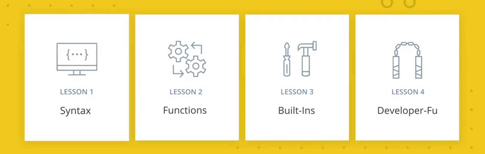

- 在第一课中，我们首先将概述 JavaScript **语法的变化**和增加的新的特性。
- 在第二课中，我们将讨论 JavaScript **函数的更新**。
- 在第三课中，我们将介绍新的 ES6 **内置功能**。
- 在第四课中，我们将进行总结，展示如何将这些最新更新**整合**到你的下一个 JavaScript 项目中。

我们以什么开头呢？

添加到此编程语言的一堆关键字，比如 let 和 const


## 2. let 和 const

现在可以在 JavaScript 中使用两种新的方式来声明变量：**let** 和 **const**。

到目前为止，在 JavaScript 中声明变量的唯一方式是使用关键字 `var`。为了理解为何添加了 `let` 和 `const`，我们先看一个示例，了解使用 `var` 会带来怎样的麻烦。

请看看下面的代码。

#### 习题 1/3

你认为运行 `getClothing(false)` 后的输出是什么？

```javascript
function getClothing(isCold) {
  if (isCold) {
    var freezing = 'Grab a jacket!';
  } else {
    var hot = 'It's a shorts kind of day.';
    console.log(freezing);
  }
}
```

- ReferenceError：freezing is not defined.
  - 很多人认为运行 `getClothing(false)` 将抛出 `ReferenceError`，因为 `freezing` 是在 if 语句的作用域内声明的，但实际上并非这样。 
- Grab a jacket!
  - 不太正确。尝试创建 `getClothing()` 函数并运行它，看看输出是什么。很可能不是你所期待的输出。 
- undefined
  - 它实际上输出了 `undefined`，很奇怪吧？请继续阅读，详细了解这个奇怪的 JavaScript 代码。 
- It's a shorts kind of day.

### 提升

提升是浏览器解析 JavaScript 的结果。本质上，在执行任何 JavaScript 代码**之前**，所有变量都会被“提升”，也就是**提升到函数作用域的顶部**。因此在运行时，`getClothing()` 函数实际上看起来如下所示…

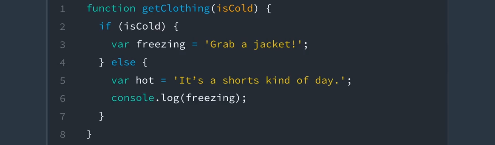

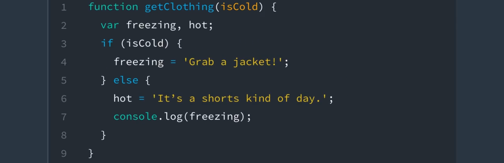

在执行该函数之前，所有变量都会被提升到该函数作用域的顶部。我们该怎么办？

### let 和 const

使用 `let` 和 `const` 声明的变量解决了这种提升问题，因为**它们**的作用域是**到块**，而不是函数。之前，当你使用 `var` 时，变量要么为全局作用域，要么为本地作用域，也就是整个函数作用域。

如果在代码块（用花括号 `{ }` 表示）中使用 `let` 或 `const` 声明变量，那么该变量会陷入**暂时性死区**，直到该变量的声明被处理。这种行为会阻止变量被访问，除非它们被声明了。

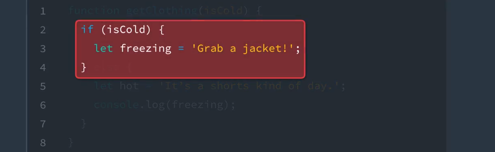

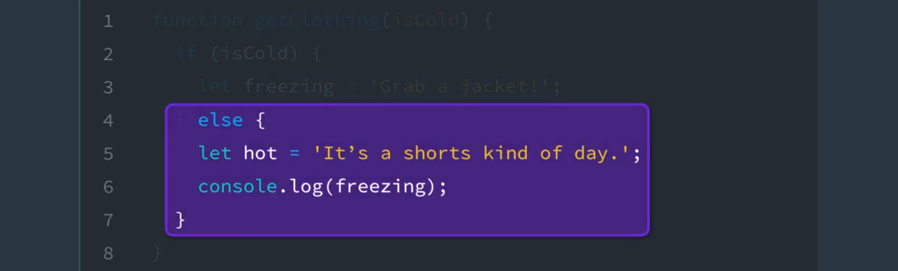

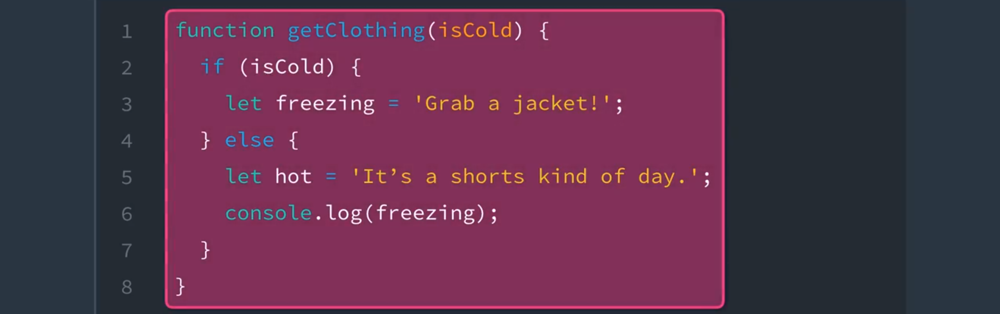

使用 `let` 和 `const` 声明的变量仅在它们所声明的块中可用。

### 习题 2/3

你认为运行 `getClothing(false)` 后的输出是什么？

```javascript
function getClothing(isCold) {
  if (isCold) {
    const freezing = 'Grab a jacket!';
  } else {
    const hot = 'It's a shorts kind of day.';
    console.log(freezing);
  }
}
```

- ReferenceError: freezing is not defined :black_joker:
  - 因为 `freezing` 没有在 else 语句、函数作用域或全局作用域内声明，所以抛出 ReferenceError。 
- Grab a jacket!
- undefined
  - 这次不会输出 `undefined`。看看 `freezing` 和 `hot` 的变量声明。有什么变化？ 
- It's a shorts kind of day.


### 关于使用 let 和 const 的规则

`let` 和 `const` 还有一些其他有趣特性。

- 使用 `let` 声明的变量可以重新赋值，但是**不能在同一作用域内重新声明**

  - > 这样的话，如果遇到别人或者自己在另一个文档中的相同作用域内再次声明相同的变量就会报错，而不是直接将那个变量的值覆盖掉。

- 使用 `const` 声明的变量**必须赋初始值**，但是**不能在同一作用域内重新声明，也无法重新赋值**。

- `let` 和 `const` 在全局声明变量并不会添加到 window 下

- `const` 声明变量时必须初始化，也就是需要赋值。

  - `const b = 1;    //正确` 
  - `const b;    //错误，必须初始化` 

### 习题 3/3

你认为运行以下代码后的输出是什么？

```js
let instructor = 'James';
instructor = 'Richard';
console.log(instructor);
```

- James
- Richard :baby_chick:
  - 这是使用 `let` 的正确方式。如果你打算以后更改代码中某个变量的值，则使用 `let`。 
- undefined
- SyntaxError: Identifier 'instructor' has already been declared


### 使用案例

最大的问题是何时应该使用 `let` 和 `const`？一般法则如下：

- **当你打算为变量重新赋值时，使用 `let`，以及**
- **当你不打算为变量重新赋值时，使用 `const`。**

因为 `const` 是声明变量最严格的方式，我们建议始终使用 `const` 声明变量，因为这样代码更容易读懂，你知道标识符在程序的整个生命周期内都不会改变。如果你发现你需要更新变量或更改变量，则回去将其从 `const` 切换成 `let`。

很简单吧？但是 `var` 呢？

### var 该怎么办？

还有必要使用 `var` 吗？*没有了*。

在某些情况下有必要使用 `var`，例如如果你想全局定义变量，但是这种做法通常都不合理，应该避免。从现在开始，建议放弃使用 `var`，改为使用 `let` 和 `const`。


### 3. 练习：使用 Let 和 Const（1-1）

#### 指导说明：

使用 `let` 或 `const` 替换变量声明。

 ```javascript
/*
 * Programming Quiz: Using Let and Const (1-1)
 */

const CHARACTER_LIMIT = 255;
const posts = [
	"#DeepLearning transforms everything from self-driving cars to language translations. AND it's our new Nanodegree!",
	"Within your first week of the VR Developer Nanodegree Program, you'll make your own virtual reality app",
	"I just finished @udacity's Front-End Web Developer Nanodegree. Check it out!"
];

// prints posts to the console
function displayPosts() {
	for (let i = 0; i < posts.length; i++) {
		console.log(posts[i].slice(0, CHARACTER_LIMIT));
	}
}

displayPosts();

 ```

## 4. 模板字面量

在 ES6 之前，将字符串连接到一起的旧方法是使用字符串连接运算符 (`+`)。

```javascript
const student = {
  name: 'Richard Kalehoff',
  guardian: 'Mr. Kalehoff'
};

const teacher = {
  name: 'Mrs. Wilson',
  room: 'N231'
}

let message = student.name + ' please see ' + teacher.name + ' in ' + teacher.room + ' to pick up your report card.';
```

> **Returns:** Richard Kalehoff please see Mrs. Wilson in N231 to pick up your report card.

上述代码能正常运行，但是当你需要连接多行字符串时，就变得更复杂。

```javascript
let note = teacher.name + ',\n\n' +
  'Please excuse ' + student.name + '.\n' +
  'He is recovering from the flu.\n\n' +
  'Thank you,\n' +
  student.guardian;
```

> **Returns:**
> Mrs. Wilson,
>
> Please excuse Richard Kalehoff.
> He is recovering from the flu.
>
> Thank you,
> Mr. Kalehoff

但是，在引入*模板字面量*（之前在 ES6 的开发版本中称为“模板字符串”）之后，这一切有了改变。

> **注意：**作为字符串连接运算符 ( `+` ) 的替代方法，你可以使用字符串的 `concat()` 方法。但是这两种方式都比较笨拙。

### 模板字面量

**模板字面量**本质上是包含嵌入式表达式的字符串字面量。

模板字面量用倒引号 ( ``` `)（而不是单引号 ( `''` ) 或双引号( `""` )）表示，可以包含用 `${expression}` 表示的占位符。这样更容易构建字符串。

下面是之前的示例使用模板字面量表示后的效果：

```js
let message = `${student.name} please see ${teacher.name} in ${teacher.room} to pick up your report card.`;
```

> **Returns:** Richard Kalehoff please see Mrs. Wilson in N231 to pick up your report card.

通过使用模板字面量，你不用再使用引号和字符串连接运算符。此外，你可以在表达式内引用 对象的属性。

现在你来试试。将下面的 `greeting` 字符串改为使用模板字面量。此外，你可以修改占位符的名称。

```javascript
const myName = '[NAME]';
const greeting = `Hello, my name is ${myName}`;
console.log(greeting);
```

...那之前的多行示例该怎么办呢？

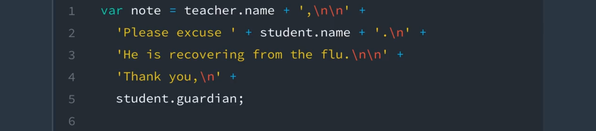

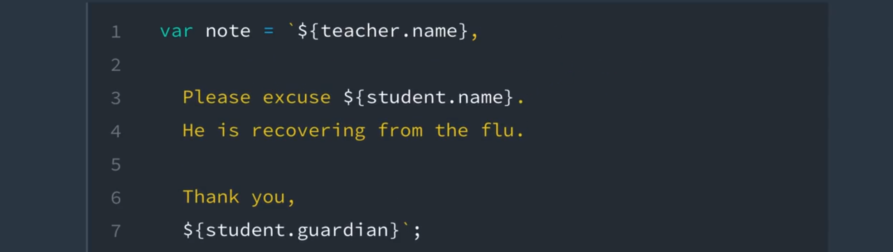

模板字面量使多行字符串更容易读懂，并且更简练。

这是模板字面量的真正强大之处。在上述动画中，**去掉了引号和字符串连接运算符，以及换行符 ( `\n` )**。这是因为模板字面量也将换行符当做字符串的一部分！

> **提示：**模板字面量中的嵌入表达式（${}）不仅仅可以用来引用变量。你可以在嵌入式表达式中进**行运算、调用函数和使用循环**！
>
> 可以理解为，${ ... }，在 ... 的环境中为 JS 的语句而非字符串。


### 5. 练习：构建 HTML 片段（1-2）

#### 指定说明：

修改 `createAnimalTradingCardHTML()` 函数以针对 `cardHTML` 使用模板字面量。

```javascript
/*
 * Programming Quiz: Build an HTML Fragment (1-2)
 */

const cheetah = {
    name: 'Cheetah',
    scientificName: 'Acinonyx jubatus',
    lifespan: '10-12 years',
    speed: '68-75 mph',
    diet: 'carnivore',
    summary: 'Fastest mammal on land, the cheetah can reach speeds of 60 or perhaps even 70 miles (97 or 113 kilometers) an hour over short distances. It usually chases its prey at only about half that speed, however. After a chase, a cheetah needs half an hour to catch its breath before it can eat.',
    fact: 'Cheetahs have “tear marks” that run from the inside corners of their eyes down to the outside edges of their mouth.'
};

// creates an animal trading card
function createAnimalTradingCardHTML(animal) {
    const cardHTML = `<div class="card"> 
        <h3 class="name">  ${animal.name} </h3> 
        
        <div class="description">
            <p class="fact">${animal.fact}</p>
            <ul class="details">
                <li><span class="bold">Scientific Name</span>: ${animal.scientificName}</li> 
                <li><span class="bold">Average Lifespan</span>: ${animal.lifespan}</li> 
                <li><span class="bold">Average Speed</span>: ${animal.speed}</li> 
                <li><span class="bold">Diet</span>: animal.diet</li> 
            </ul>
            <p class="brief">${animal.summary}</p> 
        </div> 
    </div>;`

    return cardHTML;
}

console.log(createAnimalTradingCardHTML(cheetah));
```


## 6. 解构

在 ES6 中，**你可以使用*解构*从数组和对象中提取值并赋给独特的变量。**

听起来好像你之前就这么做过，例如，看看下面的两个代码段，它们使用 ES6 之前的技巧提取数据：

```javascript
const point = [10, 25, -34];

const x = point[0];
const y = point[1];
const z = point[2];

console.log(x, y, z);
```

> **Prints:** 10 25 -34

上述示例显示了从数组中**提取值**的过程。

```javascript
const gemstone = {
  type: 'quartz',
  color: 'rose',
  karat: 21.29
};

const type = gemstone.type;
const color = gemstone.color;
const karat = gemstone.karat;

console.log(type, color, karat);
```

> **Prints:** quartz rose 21.29

该示例显示了从对象中**提取值**的过程。

二者都很简单，但是这两个示例都没用到解构。

那么*解构*到底是什么？

### 解构

**解构**这一概念从 [Perl](https://baike.baidu.com/item/perl/851577?fr=aladdin) 和 [Python](https://baike.baidu.com/item/Python/407313) 等语言中获得灵感，使你能够指定要从赋值左侧上的数组或对象中提取的元素。听起来有点奇怪，实际上可以获得和之前一样的结果，但是用到的代码确更少；依然很好理解。

我们看看这两个示例使用解构编写后的效果。

### 解构数组中的值

```javascript
const point = [10, 25, -34];

const [x, y, z] = point;

console.log(x, y, z);
```

> **Prints:** 10 25 -34

在此示例中，方括号 `[ ]` 表示被解构的数组，`x`、`y` 和 `z` 表示要将数组中的值存储在其中的变量。注意，你不需要指定要从中提取值的索引，因为**索引可以暗示出来**。

> **提示：**在解构数组时，还**可以忽略值**。例如，`const [x, , z] = point;` 忽略了 `y` 坐标。

#### 习题 1/2

你认为在运行以下代码后，`second` 的值是多少？

```javascript
let positions = ['Gabrielle', 'Jarrod', 'Kate', 'Fernando', 'Mike', 'Walter'];
let [first, second, third] = positions;
```

- Kate
  - 在使用解构进行变量赋值时，会**暗示要从哪个索引位置提取值**。也就是 `positions` 数组中的第一个元素存储在变量 `first` 中，以此类推。 
- Gabrielle
- Jarrod :o:
  - 变量 `first`、`second` 和 `third` 用 `positions` 数组中的前三个值进行填充，**剩下的值被忽略。** 
- Walter

### 解构对象中的值

```javascript
const gemstone = {
  type: 'quartz',
  color: 'rose',
  karat: 21.29
};

const {type, color, karat} = gemstone;

console.log(type, color, karat);
```

> **Prints:** quartz rose 21.29

在此示例中，花括号 `{ }` 表示被解构的对象，`type`、`color` 和 `karat` 表示要将对象中的属性存储到其中的变量。**注意不用指定要从其中提取值的属性**。因为 `gemstone` 具有 `type` 属性，值自动存储在 `type` 变量中。类似地，`gemstone` 具有 `color` 属性，因此 `color` 的值自动存储在 `color` 变量中。`karat` 也一样。

> **提示：**你还可以指定在解构对象时要选择的值。例如，`let {color} = gemstone;` 将仅选择 `gemstone` 对象中的 `color` 属性。

#### 习题 2/2

你认为调用 `getArea()` 后会返回什么？

```javascript
const circle = {
  radius: 10,
  color: 'orange',
  getArea: function() {
    return Math.PI * this.radius * this.radius;
  },
  getCircumference: function() {
    return 2 * Math.PI * this.radius;
  }
};

let {radius, getArea, getCircumference} = circle;
```

- 314.1592653589793
  - 和你想象的不一样。看看 `circle` 对象的 `getArea()` 方法是如何定义的。如果该方法被当做函数表达式存储在变量 `getArea()` 中，它在被调用时依然可以访问 `this` 吗？ 
- NaN
  - 正确！调用 `getArea()` 将返回 `NaN`。在解构该对象并将 `getArea()` 方法存储到 `getArea` 变量中时，它无法再访问 `circle` 对象中的 `this`，得出面积 `NaN`。 
  - **需要注意，使用 let 在全局中声明变量并不会添加到 window 中去**，也就是说，全局中的 this.radius 为 undefined
- 62.83185307179586
- pie


### 7. 练习：解构数组（1-3）

#### 指导说明：

使用数组解构从 `things` 数组中获取三个**颜色**，并将它们存储在变量 `one`、`two` 和 `three` 中。

```javascript
/*
 * Programming Quiz: Destructuring Arrays (1-3)
 *
 * Use destructuring to initialize the variables `one`, `two`, and `three`
 * with the colors from the `things` array.
 */

const things = ['red', 'basketball', 'paperclip', 'green', 'computer', 'earth', 'udacity', 'blue', 'dogs'];

let [one,,, two,,,, three] = things;

const colors = `List of Colors
1. ${one}
2. ${two}
3. ${three}`;

console.log(colors);
```


## 8. 对象字面量简写法

ES6 中经常出现的一个现象是删掉不必要的重复代码。通过删掉不必要的重复代码，代码更容易读懂，并且更简练。推出的新*简写法*（用来初始化对象并向对象中添加方法）就是这一体现。

我们看看具体情况。

### 对象字面量简写法

你可能写过这样的代码：使用和所分配的变量名称相同的名称初始化对象。

如果没写过的话，看看下面的示例。

```javascript
let type = 'quartz';
let color = 'rose';
let carat = 21.29;

const gemstone = {
  type: type,
  color: color,
  carat: carat
};

console.log(gemstone);
```

> **Prints:** Object {type: "quartz", color: "rose", carat: 21.29}

看到重复的地方了吗？`type: type`、`color: color` 和 `carat:carat` 不显得很冗长吗？

好消息是，**如果属性名称和所分配的变量名称一样，那么就可以从对象属性中删掉这些重复的变量名称**。

我们来看看！

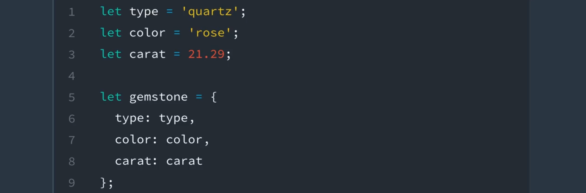

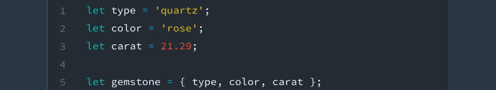

如果对象属性的名称和所分配的变量的名称相同，则可以删掉重复的变量名称。

说到简写法，还有一种向对象中添加方法的简写方式。

要看看具体写法，我们先向 `gemstone` 对象添加 `calculateWorth()` 方法。`calculateWorth()` 方法将根据宝石的 `type`、`color` 和 `carat` 告诉我们宝石成本多少。

```javascript
let type = 'quartz';
let color = 'rose';
let carat = 21.29;

const gemstone = {
  type,
  color,
  carat,
  calculateWorth: function() {
    // 将根据类型(type)，颜色(color)和克拉(carat)计算宝石(gemstone)的价值
  }
};
```

在此示例中，匿名函数被分配给属性 `calculateWorth`，但是真的需要 **function** 关键字吗？在 ES6 中不需要！

### 简写方法名称

因为只需引用 gemstone 的 `calculateWorth` 属性以便调用该函数，因此**关键字 function 是多余的，可以删掉**。

```
let gemstone = {
  type,
  color,
  carat,
  calculateWorth() { ... }
};
```


## 9. 第 1 节知识点检验

目前为止，你学习了：

- 使用 let 和 const 声明变量的新方法（let & const）
- 如何编写模板字面面以方便使用字符串插值（template literals）
- 解构数组和对象（destructuring）
- 初始化对象的一些便捷方法（object literal shorthand）

到此，我们希望你开始认识到 JavaScript 语言的这些改进将如何影响你以后编写代码的方式。

本课的其余部分将着重讲解新增的：

- for...of 循环（loop）
- 剩余（rest）参数（parameter）
- 展开（spread）运算符（operator）

但是在继续之前，我们还想提到一样东西：迭代（iteration）。

迭代是 ES6 中循环访问数据的新机制，了解迭代是什么以及它的工作原理对完成本课程的剩余部分非常重要。


## 10. 迭代

那么什么是迭代？

可能，描述它的最好方法是通过看一个普通的 for 循环。


当你编写一个 for 循环，你要给此循环提供一个变量。此变量通常为字母 i，因为它被用作迭代器（iterator）来跟踪你在循环中的位置。

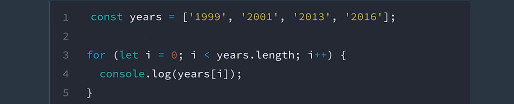

当你循环数组时，次迭代器会像**索引**一样，让你一个接一个访问数组中的每个项。**这种逐个获取项的过程就叫迭代。**

这种方式我们已经使用它很长时间了，那么为什么要在这里提起呢？听起来迭代一直都是 JavaScript 的一部分，ES6 中有什么新的变化吗？

- 第一，添加了一个**新的可迭代接口**，它**允许我们自定义对象的迭代方式**。基本上来说，就是它们循环遍历的方式。
  - 在第三课中讲符号（symbol）时，我们会更详细地说明。
  - 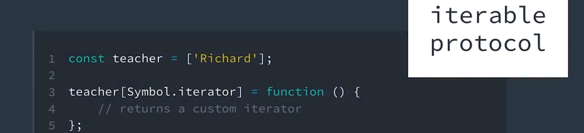
- 第二，添加了一个新循环，叫做 for...of 循环。它专门遍历**可迭代对象**。
  - 我说的可迭代对象是指**实现了**这个新的可迭代接口的对象。
  - 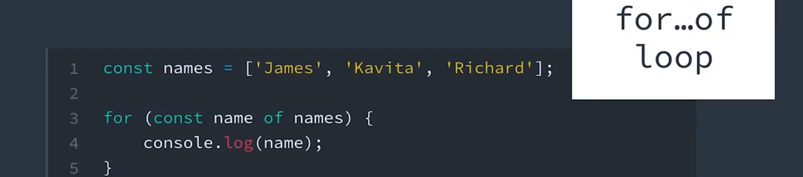
  - 这里的 for 和 of

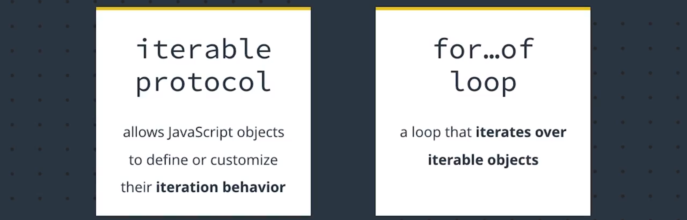

你可能听得有点糊涂，那么我们退一步看一些传统 for 循环的代码示例，然后看看新的 for...of 如何脱颖而出，成为你的最佳循环选择。


## 11. For 循环系列

**for...of 循环**是最新添加到 JavaScript 循环系列中的循环。

它结合了其兄弟循环形式 **for 循环**和 **for...in 循环**的优势，可以循环任何**可迭代**（也就是遵守[可迭代协议](https://developer.mozilla.org/zh-CN/docs/Web/JavaScript/Reference/Iteration_protocols)）类型的数据。默认情况下，包含以下数据类型：String、Array、Map 和 Set，注意不包含 `Object` 数据类型（即 `{}`）。**默认情况下**，对象不可迭代。

在研究 ...of 循环之前，先快速了解下其他 for 循环，看看它们有哪些不足之处。

### for 循环

for 循环很明显是最常见的循环类型，因此快速复习下即可。

```
const digits = [0, 1, 2, 3, 4, 5, 6, 7, 8, 9];

for (let i = 0; i < digits.length; i++) {
  console.log(digits[i]);
}
```

> **Prints:**
> 0
> 1
> 2
> 3
> 4
> 5
> 6
> 7
> 8
> 9

for 循环的最大缺点是需要跟踪**计数器**和**退出条件**。

在此示例中，我们使用变量 `i` 作为计数器来跟踪循环并访问数组中的值。我们还使用 `digits.length` 来判断循环的退出条件。如果只看一眼这段代码，有时候会比较困惑，尤其是对于初学者而言。

**虽然 for 循环在循环数组时的确具有优势，但是某些数据结构不是数组，因此并非始终适合使用 loop 循环。**

## for...in 循环

for...in 循环改善了 for 循环的不足之处，它消除了计数器逻辑和退出条件。

```
const digits = [0, 1, 2, 3, 4, 5, 6, 7, 8, 9];

for (const index in digits) {
  console.log(digits[index]);
}
```

> **Prints:**
> 0
> 1
> 2
> 3
> 4
> 5
> 6
> 7
> 8
> 9

但是依然需要使用 **index** 来访问数组的值，这样很麻烦；几乎比之前更让人迷惑。

此外，当你需要向数组中添加额外的方法（或另一个对象）时，for...in 循环会带来很大的麻烦。因为 **for...in 循环循环访问所有可枚举的属性，意味着如果向数组的原型中添加任何其他属性，这些属性也会出现在循环中。**

```
Array.prototype.decimalfy = function() {
  for (let i = 0; i < this.length; i++) {
    this[i] = this[i].toFixed(2);
  }
};

const digits = [0, 1, 2, 3, 4, 5, 6, 7, 8, 9];

for (const index in digits) {
  console.log(digits[index]);
}
```

> **Prints:**
> 0
> 1
> 2
> 3
> 4
> 5
> 6
> 7
> 8
> 9
> function() {
>  for (let i = 0; i < this.length; i++) {
>   this[i] = this[i].toFixed(2);
>  }
> }

**太可怕！这就是为何在循环访问数组时，不建议使用 for...in 循环。**

> **注意：** **forEach 循环** 是另一种形式的 JavaScript 循环。但是，`forEach()` 实际上是数组方法，因此**只能**用在数组中。也无法停止或退出 forEach 循环。如果希望你的循环中出现这种行为，则需要使用基本的 for 循环。


## 12. For...of 循环

最后，我们要提到强大的...of 循环了。

### For...of 循环

**for...of 循环**用于循环访问任何*可迭代的*数据类型。

**for...of** 循环的编写方式和 **for...in** 循环的基本一样，只是将 `in` 替换为 `of`，可以忽略**索引**。

```
const digits = [0, 1, 2, 3, 4, 5, 6, 7, 8, 9];

for (const digit of digits) {
  console.log(digit);
}
```

> **Prints:**
> 0
> 1
> 2
> 3
> 4
> 5
> 6
> 7
> 8
> 9

这使得 for...of 循环成为所有 for 循环中最简洁的版本。

> **提示：**建议使用复数对象名称来表示多个值的集合。这样，循环该集合时，可以使用名称的单数版本来表示集合中的单个值。例如，`for (const button of buttons) {…}`。

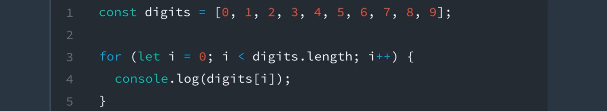

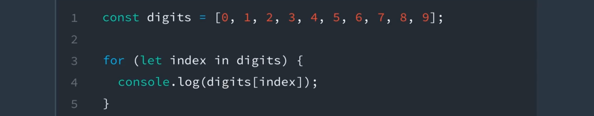

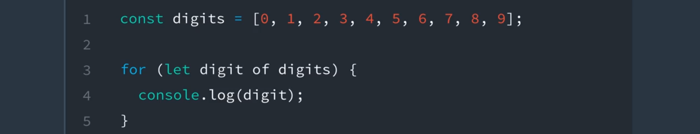

从 for 循环完善为 for...in 循环，再完善为 for...of 循环。

但是等等，还有更多优势！for...of 循环还具有其他优势，解决了 for 和 for...in 循环的不足之处。

**你可以随时停止或退出 for...of 循环。**

```javascript
const digits = [0, 1, 2, 3, 4, 5, 6, 7, 8, 9];

for (const digit of digits) {
  if (digit % 2 === 0) {
    continue;
  }
  console.log(digit);
}
```

> **Prints:**
> 1
> 3
> 5
> 7
> 9

不用担心向对象中添加新的属性。**for...of 循环将只循环访问对象中的值**。

```javascript
Array.prototype.decimalfy = function() {
  for (i = 0; i < this.length; i++) {
    this[i] = this[i].toFixed(2);
  }
};

const digits = [0, 1, 2, 3, 4, 5, 6, 7, 8, 9];

for (const digit of digits) {
  console.log(digit);
}
```

> **Prints:**
> 0
> 1
> 2
> 3
> 4
> 5
> 6
> 7
> 8
> 9


### 13. 练习：编写 For...of 循环（1-4）

#### 指导说明：

编写符合以下条件的 `for...of` 循环：

- 循环访问 `days` 数组中的每一天
- 将一天的首字母大写
- 将这一天输出到控制台中

代码应该将以下每天输出到控制台中：

> Sunday
> Monday
> Tuesday
> Wednesday
> Thursday
> Friday
> Saturday

```javascript
/*
 * Programming Quiz: Writing a For...of Loop (1-4)
 */

const days = ['sunday', 'monday', 'tuesday', 'wednesday', 'thursday', 'friday', 'saturday'];

// your code goes here
for( day of days){
    let upperDay = day[0].toUpperCase() + day.slice(1)
    console.log(upperDay)
}
```

```javascript
/*
 * Programming Quiz: Writing a For...of Loop (1-4)
 */

const days = ['sunday', 'monday', 'tuesday', 'wednesday', 'thursday', 'friday', 'saturday'];

// your code goes here
for(let day of days){
    // day = day.toLowerCase().replace(/( |^)[a-z]/g, (L) => L.toUpperCase());
    // day = day.charAt(0).toUpperCase() + day.slice(1);
    day = day[0].toUpperCase() + day.slice(1);
   console.log(day);
}
```


## 14. 展开运算符（...）

现在该换另一个工具，看看展开运算符了！!

### 展开运算符

**展开运算符**（用三个连续的点 ( `...` ) 表示）是 ES6 中的新概念，**使你能够将[字面量对象](https://developer.mozilla.org/zh-CN/docs/Web/JavaScript/Guide/Iterators_and_Generators#%E8%BF%AD%E4%BB%A3%E5%99%A8)展开为多个元素**。

我们通过几个示例看看它的原理。

```javascript
const books = ["Don Quixote", "The Hobbit", "Alice in Wonderland", "Tale of Two Cities"];
console.log(...books);
```

> **Prints:** Don Quixote The Hobbit Alice in Wonderland Tale of Two Cities 

```javascript
const primes = new Set([2, 3, 5, 7, 11, 13, 17, 19, 23, 29]);
console.log(...primes);
```

> **Prints:** 2 3 5 7 11 13 17 19 23 29

如果查看上述示例的输出，会发现数组和集合都**扩展开了单个元素**。这有什么用？

> **注意：**集合（set）是 ES6 中的全新内置对象。我们将在未来的 ES6 第 3 节课详细讲解**集合**。

### 使用 concat 方法结合数组

**展开运算符**的一个用途是**结合数组**。

如果你需要结合多个数组，在有展开运算符之前，必须使用 Array 的 `concat()` 方法。

```javascript
const fruits = ["apples", "bananas", "pears"];
const vegetables = ["corn", "potatoes", "carrots"];
const produce = fruits.concat(vegetables);
console.log(produce);
```

> **Prints:** ["apples", "bananas", "pears", "corn", "potatoes", "carrots"]

并不算太糟糕，但是如果有简写方法，会不会更好？

例如，如下所示…

> #### ⚠️ 接下来会出现 `const` 警告 ⚠️
>
> 如果你通过复制/粘贴代码跟着操作，那么你已经使用 `const` 关键字声明了 `produce` 变量。以下代码将尝试重新声明变量并对其重新赋值，因此可能会出现错误，取决于你运行代码的方式。
>
> 注意，使用 `const` 声明的变量不能在同一作用域内重新声明或重新赋值。

```javascript
const produce = [fruits, vegetables];
console.log(produce);
```

> **Prints:** [Array[3], Array[3]]

遗憾的是，不可行。

这段代码实际上将 `fruits` 数组添加到 `produce` 数组的第一个索引处，将 `vegetables` 数组添加到第二个索引 处。

要不尝试下展开运算符？

```javascript
/*
 * Instructions: Use the spread operator to combine the `fruits` and `vegetables` arrays into the `produce` array.
 */

const fruits = ["apples", "bananas", "pears"];
const vegetables = ["corn", "potatoes", "carrots"];

const produce = [...fruits,...vegetables];

console.log(produce);
```


## 15. 剩余参数（...）

如果你可以**使用展开运算符将数组展开为多个元素**，那么肯定有一种方式**将多个元素绑定到一个数组中**吧？

实际上，的确有！叫做*剩余参数*，它是 ES6 中新加的**另一个运算符**。

### 剩余参数

**剩余参数**也用三个连续的点 ( `...` ) 表示，使你能够将不定数量的元素表示为数组。它在多种情形下都比较有用。

一种情形是**将变量赋数组值时**。例如，

```javascript
const order = [20.17, 18.67, 1.50, "cheese", "eggs", "milk", "bread"];
const [total, subtotal, tax, ...items] = order;
console.log(total, subtotal, tax, items);
```

> **Prints:** 20.17 18.67 1.5 ["cheese", "eggs", "milk", "bread"]

该代码将 `order` 数组的值分配给单个变量。数组中的前三个值被分配给了 `total`、`subtotal` 和 `tax`，但是需要重点注意的是 `items`。

通过使用剩余参数，数组中剩余的值（**作为数组**）被分配给了 `items`。

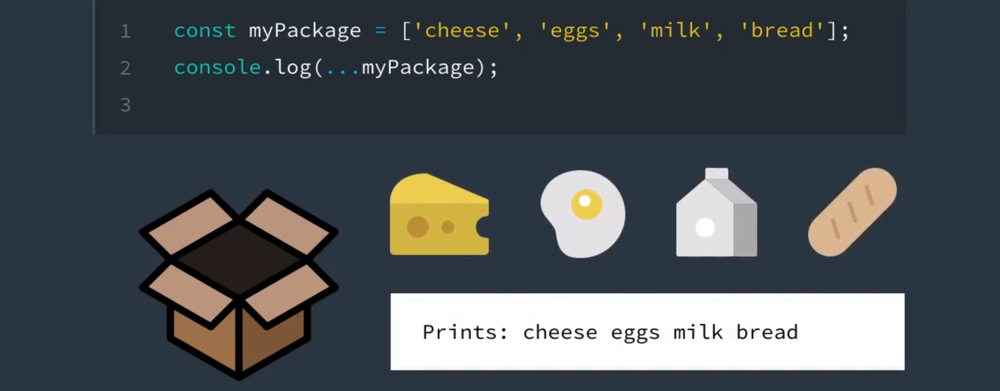

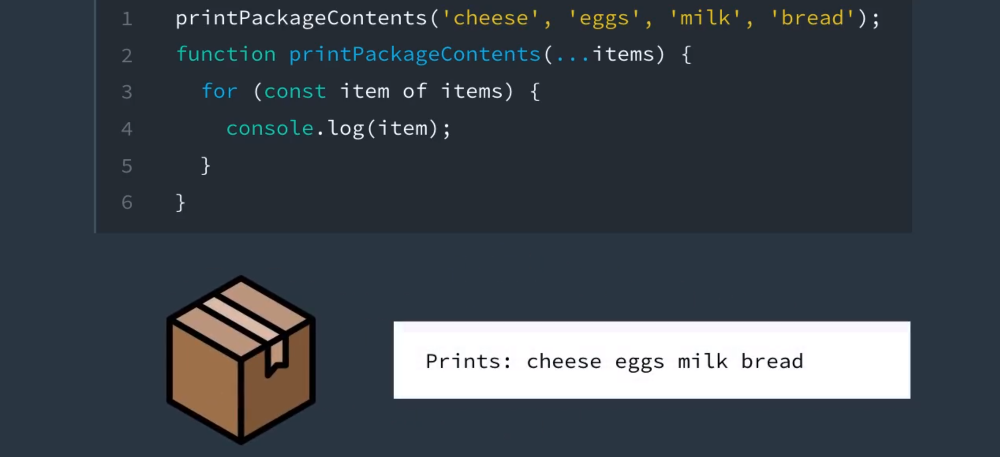

可以将剩余参数看着展开运算符的对立面；如果展开运算符是拿出包装盒中的所有物品，那么剩余参数就是将所有物品放回包装盒中。

### 可变参数函数

剩余参数的另一个用例是处理可变参数函数。**可变参数函数**是接受不定数量参数的函数。

例如，假设有一个叫做 `sum()` 的函数，它会计算不定数量的数字的和。在运行期间，如何调用 `sum()` 函数？

```javascript
sum(1, 2);
sum(10, 36, 7, 84, 90, 110);
sum(-23, 3000, 575000);
```

实际上有无数种方式可以调用 `sum()` 函数。不管传入函数的数字有多少个，应该始终返回数字的总和。

#### 使用参数对象

在之前版本的 JavaScript 中，可以使用[参数对象](https://developer.mozilla.org/zh-CN/docs/Web/JavaScript/Reference/Functions/arguments)处理这种类型的函数。**参数对象**是像数组一样的对象，可以**当做本地变量在所有函数中使用**。它针对传入函数的每个参数都包含一个值，第一个参数从 0 开始，第二个参数为 1，以此类推。

如果我们看看 `sum()` 函数的实现方法，会发现可以使用参数对象来处理传递给它的各种数字。

```javascript
function sum() {
  let total = 0;  
  for(const argument of arguments) {
    total += argument;
  }
  return total;
}
```

现在可以正常运行，但是存在问题：

1. 如果查看 `sum()` 函数的定义，会发现它没有任何参数。
   - 这容易引起误导，因为我们知道 `sum()` 函数可以处理不定数量的参数。
2. 难以理解。 
   - 如果你从未使用过参数对象，那么看了这段代码后很可能会疑问参数对象来自何处。是不是凭空出现的？看起来肯定是这样。

#### 使用剩余参数

幸运的是，出现剩余参数后，你可以重写 `sum()` 函数，使其阅读起来更清晰。

```javascript
function sum(...nums) {
  let total = 0;  
  for(const num of nums) {
    total += num;
  }
  return total;
}
```

这一版本的 `sum()` 函数**更简练**、**更易读懂**。此外，注意 `for...in` 循环被替换成了新的 **for...of 循环**。


### 16. 练习：使用剩余参数（1-5）

#### 指导说明：

使用剩余参数创建一个 `average()` 函数，该函数会计算不定数量的数字的平均值。

> **提示：**确保使用不同的值测试代码。例如，
> `average(2, 6)` 应该返回 `4`
> `average(2, 3, 3, 5, 7, 10)` 应该返回 `5`
> `average(7, 1432, 12, 13, 100)` 应该返回 `312.8`
> `average()` 应该返回 `0`

### 我的代码：

```javascript
/*
 * Programming Quiz: Using the Rest Parameter (1-5)
 */

// your code goes here

function average(...nums) {
    let avergeNum = 0
    let total = 0
    if(nums.length === 0 ){
        return avergeNum
    }
    for (let num of nums){
        total += num
        avergeNum = total / nums.length
    }
    return avergeNum
}

console.log(average(2, 6));
console.log(average(2, 3, 3, 5, 7, 10));
console.log(average(7, 1432, 12, 13, 100));
console.log(average());
```

### 官方代码：

```javascript
/*
 * Programming Quiz: Using the Rest Parameter (1-5)
 */

// your code goes here
function average(...nums) {
    if(nums.length === 0) return 0;
    let sum = 0;
    for(let num of nums){
        sum += num;
    }
    return sum / nums.length;
}  

console.log(average(2, 6));
console.log(average(2, 3, 3, 5, 7, 10));
console.log(average(7, 1432, 12, 13, 100));
console.log(average());
```


## 17. 第 1 节课总结

这就是第一课的内容，我们从 let 和 const 关键字讲到迭代器，新的展开运算符，再到剩余参数。

在第二节课中，我们将深入了解对函数所做的所有更新。

