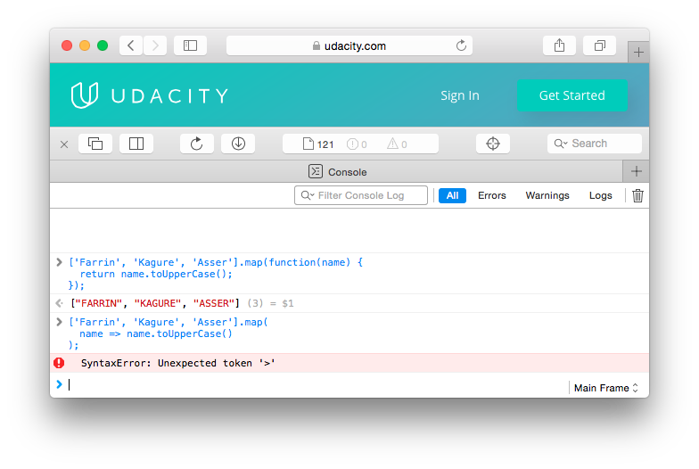
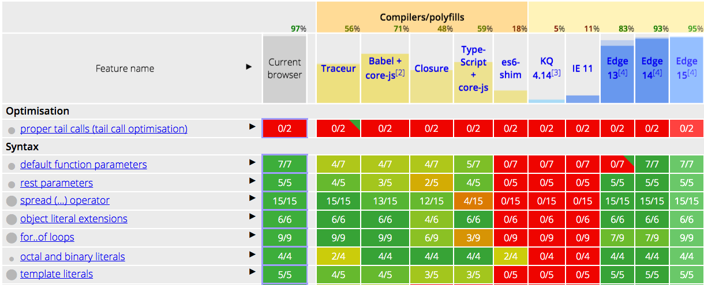
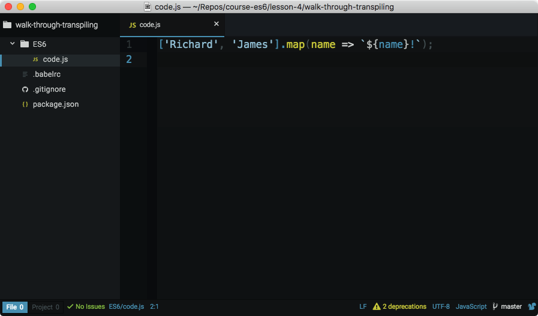

# ES6 - 专业开发者功能

> 经过这么多的改进后，并非所有浏览器都能支持这一新版 JavaScript。在这节课，你将学习如何使用 polyfill 并将 ES6 JavaScript 代码转移为 ES5.

[TOC]

---

## 1. Web 在不断发展


在这节课中，我们将帮助你为在不断变化的 Web 环境中部署 ES6 做好准备。

基本来说，网络有始，但却无终。随着新技术不断涌现，旧版的浏览器将无法提供支持。

如果你想在旧版中使用 ES6 情况将变得具有挑战性，你应该如何编写 ES6 同时又支持旧版浏览器呢？


---

## 2. 新旧浏览器（了解）

### 代码不能在旧浏览器上运行

我们在这门课程中学习的代码在旧浏览器中不受支持。在发布 ES6 之前开发的旧浏览器支持的是当时版本的 JavaScript（即 ES5.1）。如果你尝试在旧浏览器中运行任何 ES6 代码，将无法运行。

[*运行了箭头函数，并导致 Safari 9 出现语法错误。*](https://classroom.udacity.com/courses/ud356/lessons/2baa2512-b298-4796-aa5a-9135d82ff298/concepts/17ce250d-ac1d-43de-b994-0c83978b30b8#)

在发布 ES6 之前开发的旧浏览器不支持运行这些代码很正常，但是有些在 ES6 之后发布的浏览器也尚不支持新的 JavaScript 语法和功能。

尝试在代码中使用个箭头函数，并在 IE 11 中打开，将不可行。控制台中会出现错误，提示不能识别该语法。

[*运行了箭头函数，并导致 IE 11 出现语法错误。*](https://classroom.udacity.com/courses/ud356/lessons/2baa2512-b298-4796-aa5a-9135d82ff298/concepts/17ce250d-ac1d-43de-b994-0c83978b30b8#)

我们很多人没有太考虑浏览器和它的功能，直到代码无法运行！但实际上浏览器创建者日子并不好过。想想 HTML CSS 和 JavaScript，这些语言很灵活，一直在改善。浏览器创建者需要跟上这些变化。

**它们如何知道这些变化呢？**

它们会学习（或实际上会构建）语言规范！

就像 [World Wide Web Consortium (W3C)](https://www.w3.org/)(英) 是一个 HTML、CSS 和 SVG 等的标准制定机构，[Ecma International](https://www.ecma-international.org/)(英) 是一个行业协会，专门用于制定和监管 JavaScript 和 JSON 等标准。你可以在[此处](http://www.ecma-international.org/ecma-262/6.0/index.html)(英)找到 ES6 的规范。

### 其他信息

Ecma International 是一个很重要的行业社区，强烈推荐详细了解该机构：

- [Ecma 国际](https://baike.baidu.com/item/Ecma%E5%9B%BD%E9%99%85/7769180)
- <http://www.ecma-international.org/memento/index.html> (英)

> **注意：**我们在这门课程中学习的代码在旧浏览器中不受支持。在发布 ES6 之前开发的旧浏览器支持的是当时版本的 JavaScript（即 ES5.1）。如果你尝试在旧浏览器中运行任何 ES6 代码，将无法运行。


## 3. ES6 规范

### ES6 规范

可以在[此处](http://www.ecma-international.org/ecma-262/6.0/index.html)(英)找到 ES6 的规范。该规范列出了该语言正常运行需要遵守的规则和指南。它没有详细描述浏览器创建者如何实现相关功能，但是给出了该语言如何正常运行的逐步说明。在制作这门课程时，我们随时都在参考该官方规范。

因此，说实话，**有时候难以理解该规范的一些晦涩措辞**。但是，如果你对 ES6 有疑问，建议查阅 [Mozilla Developer Network](https://developer.mozilla.org/) 提供的**主题内容**，然后看看该规范的**实际内容**。

#### 练习题

请参阅 [ES6 规范](http://www.ecma-international.org/ecma-262/6.0/index.html)(英)。该规范的哪部分讲解的是箭头函数？

- 第 6 部分
- 第 10.3.2 部分
- 第 14.2 部分
  - 关于箭头函数的部分是第 [14.2](http://www.ecma-international.org/ecma-262/6.0/index.html#sec-arrow-function-definitions) 部分 
- 第 18.3.29 部分


## 4. 支持的功能

#### 如何知道浏览器支持哪些功能？

因为每年都会出现新的语言规范，浏览器每隔一个月就更新一次，要知道浏览器都支持哪些语言很困难。每个浏览器构建者（Safari 除外）都提供了一个网站，用来记录浏览器的开发状态。请访问以下每个浏览器的平台功能更新网址：

- Google Chrome - <https://www.chromestatus.com/features#ES6> (英)
- Microsoft Edge - <https://developer.microsoft.com/en-us/microsoft-edge/platform/status/?q=ES6> (英)
- Mozilla Firefox - <https://platform-status.mozilla.org/> (英)

> **注意：**Safari 没有自己的平台状态网站。实际上，Safari 由开源浏览器引擎 Webkit 提供支持。可以在[此处](https://webkit.org/status/)找到 Webkit 功能的状态。

要查看的信息很多。如果你想大致了解下对所有 JavaScript 代码的功能支持，请参阅由 [@kangax](https://twitter.com/kangax) 创建的 ECMAScript 兼容性表格。

- <https://kangax.github.io/compat-table/es6/> (英)

对 ECMAScript 功能的浏览器支持兼容性表格。

#### 练习题

请阅读 ECMAScript 兼容性表格，第一个彩色列显示的信息是什么？

- 最新支持 ES6 的浏览器列表。
- 所有 ES6 功能的列表。
- 你的当前浏览器支持的所有 ES6 功能的状态。
  - 第一列列出了所有的 ES6 功能。表格中的第二列是第一个彩色列，显示了当前浏览器对每项 ES6 功能的支持情况。 
- 每个浏览器平台对具体 ES6 功能的支持状况链接。


## 5. Web 是永恒发展的

**你是 JavaScript 专家并不代表你可以就此懈怠**。ES6 的这些新增功能为该语言带来了重大变化，你不能忽视他们，仅仅依赖你已知的过时技术，**你得行动起来，深入了解这些功能，阅读规范，学习一些教程，甚至自己动手编写一些东西**。

网络是一个不断发展变化的平台，你需要跟上它的步伐。想象一下，明明有新的更强大的工具可供你使用，你却仍困在旧的不能满足需求的设备上。

现在，你知道 JavaScript 编程语言有哪些改进以及在哪里找到它们的浏览器支持，你已经有了工具，你需要的是运用它们。


## 6. Polyfill

可以看到这面墙坑坑洼洼的，Richard 正在找一些东西来填补它。


我们会把破洞补上，这样你看到的墙将是平平整整的。

在美国，我们称此为 Spackling（填泥料），它只是一种常见的粉料，用来填补墙上的洞和裂缝。在英国，有一个著名的同类产品品牌为 Polyfilla，使用 Spackling 或者 Polyfilla 墙上便不再有洞。 


**对于网络来说，polyfill 起着相同的作用**。

有时浏览器中可能有缺失的需要填补的功能，polyfill 就是通过复制某些浏览器没有的原生功能来修复这些缺失的 JavaScript 文件。


## 7. 使用 Polyfill

### 什么是 polyfill？

> polyfill（或 polyfiller）是一段代码（或插件），可以为你（即开发工程师）提供本希望浏览器能原生提供的技术。

polyfill 一词由 [Remy Sharp](https://twitter.com/rem)(twitter,英,墙) 发明 - <https://remysharp.com/2010/10/08/what-is-a-polyfill> (英)

> 作为开发工程师，我们应该能够使用 HTML5 API 进行开发，脚本能够创建应该存在的方法和对象。这种能考虑到未来发展趋势的开发形式意味着当用户升级软件时，你的代码不用更改，用户能够迁移到更好的原生体验。 来自关于 polyfill 的 HTML5 样板文件团队 - <https://github.com/Modernizr/Modernizr/wiki/HTML5-Cross-Browser-Polyfills> (英)

### 延伸：

<https://en.wikipedia.org/wiki/Polyfill> (英)

### polyfill 示例

以下代码是新的 ES6 String 方法 `startsWith()` 的 polyfill：

```javascript
if (!String.prototype.startsWith) {
  String.prototype.startsWith = function (searchString, position) {
    position = position || 0;
    return this.substr(position, searchString.length) === searchString;
  };
}
```

可以看出，polyfill 只是普通的 JavaScript。

这段代码是简单的 polyfill（请在 MDN 上了解它），而[此处](https://github.com/mathiasbynens/String.prototype.startsWith/blob/master/startswith.js)是更加复杂的 polyfill。

### 练习题

`startsWith()` polyfill 为何以下面的这行开始：

```javascript
if (!String.prototype.startsWith)
```

- 没有它的话，脚本将抛出错误。
- 它会检查并确保存在 `String.prototype`。
- 它会避免覆盖原生 `startsWith` 方法。3
  - 注意，polyfill 用来弥补缺少的功能。如果浏览器支持 ES6 并且具有原生 `startsWith` 方法，那么就没必要再添加 polyfill 代码了。如果不存在此方法，则此 polyfill 将覆盖原生实现。 


## 8. Polyfill 步骤讲解

记住，**polyfill 用于填补尚未支持该原生功能的浏览器**。


这个 polyfill 会首先检查是否有原生 startsWith 方法，为什么？

因为如果存在，我们便不需要用该文件覆盖原生版本。如果不存在，那么运行此 polyfill 的浏览器就会运行所有这些代码。

第 2 行代码会向 String.prototype 对象添加第一个新方法，该函数传入的第二个参数为字符串开始匹配的位置，或者默认为字符串的第一个字符，然后它将返回 trun 或 false，判断传入的字符串和我们所看到的字符串是否是一昂的。


## 9. Polyfill 的其他用途

### Polyfills 不仅仅用来修补 JavaScript 功能

JavaScript 是用来创建 polyfill 的语言，但是 polyfill 不仅仅用来填补缺失的 JavaScript 功能！有针对各种浏览器功能的 polyfill：

- SVG
- Canvas
- 网络存储（本地存储/会话存储）
- 视频
- HTML5 元素
- 无障碍功能
- Web Sockets
- 等等！

要获得更完整的 polyfill 列表，请访问此[链接](https://github.com/Modernizr/Modernizr/wiki/HTML5-Cross-Browser-Polyfills)(英)


## 10. 转译

你以前可能听说过编译器这个词，编译器是一个计算机程序，它会接收用一些源代码语言编写的程序，例如说 **C++**，然后将其转换为目标语言，如**机器码**。通过编译器后，代码会改变其抽象级别（level of abstraction），即它与人类可读代码或机器可运行代码的接近程度。这就是**编译，接收源语言并将其转换为较低级语言**。

**转译是编译的一个子集**，它**接收源代码并将其转换为目标代码**。


和编译器一样，**但是源代码和目标代码属于同一抽象级别**。

基本上来说，如果源代是人类可读的，那么输出语言也将是人类可读的。

但是我们为什么需要进行这样的转换？

我们刚看到旧的浏览器并不完全支持 ES6 但是它们支持 ES5 代码，这样我们可以使用 ES6 语法和功能来编写 JavaScript 然后使用转译器将其从 ES6 代码转换为 ES5，这样我们就可以使用最新最强大的语言编写代码，然后进行转换，**使它在任何地方都可运行**。


## 11. 使用 Babel

最热门的 JavaScript 转译器是 [Babel](https://babeljs.cn/) / [英](https://babeljs.io/)。

Babel 的原始名称更具描述性——6to5。这是因为，一开始 Babel 专门将 ES6 代码转换为 ES5 代码，但是现在 Babel 具有更多功能了。**它可以将 ES6 转换为 ES5、将 JSX 转换为 JavaScript，并将 Flow 转换为 JavaScript**。

在计算机上查看转译代码之前，我们快速做个测验，直接在 Babel 网站上将一些 ES6 代码转译为 ES5 代码。请参阅 [Babel 的 REPL](https://babeljs.cn/repl/#?babili=false&browsers=&build=&builtIns=false&code_lz=Q&debug=false&forceAllTransforms=false&shippedProposals=false&circleciRepo=&evaluate=true&fileSize=false&lineWrap=false&presets=es2015&prettier=false&targets=&version=6.26.0&envVersion=) / [英](http://babeljs.io/repl/#?babili=false&evaluate=true&lineWrap=false&presets=es2015)，并将以下代码粘贴到左侧部分：

```javascript
class Student {
  constructor (name, major) {
    this.name = name;
    this.major = major;
  }

  displayInfo() {
    console.log(`${this.name} is a ${this.major} student.`);
  }
}

const richard = new Student('Richard', 'Music');
const james = new Student('James', 'Electrical Engineering');
```

[左侧的 ES6 代码正在转译为右侧的 ES5 代码。](https://classroom.udacity.com/courses/ud356/lessons/2baa2512-b298-4796-aa5a-9135d82ff298/concepts/e2141a12-c59a-4d1f-ac39-20e5408d86ee#)

### 资源库中的转译项目

打开[此项目的资源库](https://github.com/udacity/course-es6/tree/master/lesson-4/walk-through-transpiling)，在第 4 节课目录下的是一个小的项目，已经设置好，可以从 ES6 代码转译为 ES5 代码。有一个"ES6”目录，其中包含我们将使用 Babel 转译为 ES5 代码的 ES6 代码，转译后的 ES5 代码将能够在所有浏览器上运行。

[包含将被转译的 ES6 代码的代码编辑器。](https://classroom.udacity.com/courses/ud356/lessons/2baa2512-b298-4796-aa5a-9135d82ff298/concepts/e2141a12-c59a-4d1f-ac39-20e5408d86ee#)

Babel 将代码从一种语言转换为另一种语言的方式是使用插件。有一些插件可以将 ES6 箭头函数转换为普通的 ES5 函数（[ES2015 箭头函数插件](https://babeljs.cn/docs/plugins/transform-es2015-arrow-functions/) / [英](http://babeljs.io/docs/plugins/transform-es2015-arrow-functions/)）。有一些插件可以将 ES6 模板字面量转换为普通的字符串连结（[ES2015 模板字面量转换](https://babeljs.cn/docs/plugins/transform-es2015-template-literals/) / [英](https://babeljs.io/docs/plugins/transform-es2015-template-literals/)）。要获得完整的列表，请参阅[所有 Babel 插件](https://babeljs.cn/docs/plugins/) / [英](https://babeljs.io/docs/plugins/)。

但是你比较繁忙，没有时间浏览长长的插件列表，看看需要哪些插件才能将 ES6 代码转换为 ES5。因此，Babel 提供了将插件绑定到一起的 **预设**，这样就不用使用大量的单个插件。我们不再担心需要安装哪些插件，而是直接使用 [ES2015 预设](https://babeljs.cn/docs/plugins/preset-es2015/) / [英](https://babeljs.io/docs/plugins/preset-es2015/)，它包含了我们将 ES6 代码转换为 ES5 代码所需的所有插件。

你会看到该项目具有一个 `.babelrc` 文件。你需要将项目要用到的所有插件和/或预设放在该文件里。因为我们要转换所有 ES6 代码，因此我们将其设置为具有 ES2015 预设。

[列出 ES2015 预设的 `.babelrc` 文件代码编辑器。](https://classroom.udacity.com/courses/ud356/lessons/2baa2512-b298-4796-aa5a-9135d82ff298/concepts/e2141a12-c59a-4d1f-ac39-20e5408d86ee#)

> **警告：**Babel 同时使用 [Node](http://nodejs.cn/) / [英](https://nodejs.org/) 和 [NPM](https://www.npmjs.com.cn/) / [英](https://www.npmjs.com/) 来分发它的插件。在安装任何插件之前，请先安装这两个工具 ：
>
> - 安装 [Node](http://nodejs.cn/) / [英](https://nodejs.org/)


## 12. 转译步骤讲解

项目 package.json 文件列出了此项目，依赖的所有 NPM 包。此项目依赖于 babel-cli 和 es2015 preset（这是所有 ES6 插件的一集合），这些是将要下载和安装的插件。


全部安装好后，我们需要告诉 babel-cli 应该用哪个插件来进行转译。cli 工具会检查 .babelrc 文件来确定要使用哪个插件和 presets。

所以， package.json 文件列出应安装什么，而 .babelrc 文件告诉 babel 在进行转译时需要使用什么插件。

现在 babel 知道了要用这个 preset，我们需要告诉它去转移代码，为此我们添加了一个 build 脚本（上图中有）告诉 babel 去获取 ES6 目录中的文件，使用 ES2015 preset 转译它们，然后将转译的代码放在 ES5 目录中。


## 13. 转译小结

> **注意**：在制作本课程时（大约为 2016 年冬），当前的浏览器版本支持大多数的 ES6。但只是大多数功能，并非全部功能。并且指的是当前浏览器。有大量的旧浏览器不支持很多 ES6 新增功能。但是可以肯定的是，几乎每个浏览器都支持该语言的上一个版本 (ES5.1)。


将 ES6 代码转译为 ES5 代码。

### 转译小结

及时掌握 JavaScript 的所有变化很重要，**最佳方式是开始使用新增的功能**。问题是并非所有浏览器都支持这些新功能。鱼与熊掌不可兼得，你可以用 ES6 编写代码，然后使用转译器将其转译为 ES5 代码。这样可以将项目代码库转换为最新版本的语言，同时能够到处运行。当你的代码需要运行在上面的所有浏览器都完全支持 ES6 代码后，你就不用再转译你的代码，直接提供 ES6 代码即可！


## 14. 课程总结

总之，你还是完成了关于 JavaScript 未来技术的课程，但是在继续之前，我们总结一下你在这节课中所学到的。

- 在第一课，你学习了 JavaScript 语言中最新的语法补充。
- 在第二课，你探索了编写函数的新方法及如何创建 JavaScript 类。
- 在第三课，你了解了 ES6 中提供的最新内置功能。
- 在第四课，我们向你展示了如何将 ES6 整合到你的下一个 JavaScript 项目中。