# 4. HTTP/2

> HTTP/1 是伟大的，但未来是 HTTP/2 的时代！
>
> 你将在接下里的课程中了解 HTTP/2 带来的变化。你将学习 HTTP/1 所颂扬的当前“最佳实践”，但现在已经是 HTTP/2 中的反模式。

[TOC]

## 4.1 HTTP/2 简介

HTTP 从上世纪 90 年代初就出现了，在 2012 年到 2015 年之间，单个网页传输的数据量增长到了三倍，获取所有数据所需的请求数量也稳步上升。

HTTP 使用的目的及场合与当初设计的目的及场合完全不一样，当时合理的设计理念对现在的开发和性能来说都成为了负担。

目前的一些最佳做法，例如所有的 JS 整合到一个文件中，仅仅是为了解决 HTTP/1 的不足之处。这时候 HTTP/2 应运而生，它不仅可以向后兼容，而且解决了 HTTP/1 存在的一个最大问题。

我们将了解 HTTP/1 的不同之处，以及这些区别如何使你的应用更强大。

---

## 4.2 HTTP/1 问题: 队头阻塞

显示网站所需的平均请求数量一直在上升，最近超过了 100 个：

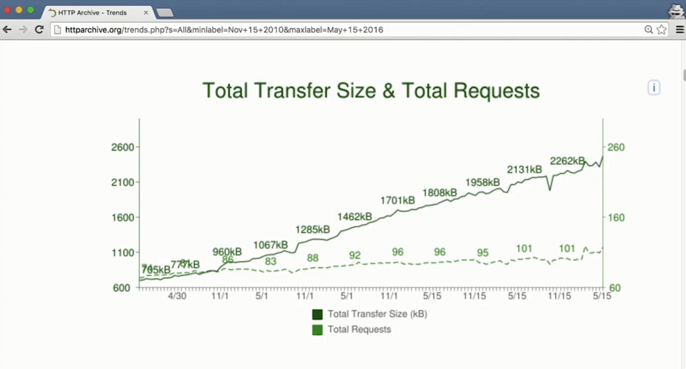

意味着平均下来，网站需要超过 100 个请求才能正确显示，这变得有点夸张。注意 HTTP/1 无法很好地处理大量请求，幸运的是，出现了 HTTP/2，我们将了解 HTTP/1 存在的一些问题以及 HTTP/2 如何解决了这些问题。

我们有太多请求的原因之一是，队头阻塞（HOL，Head Of Line）：

我们之前讨论过这个概念，但是它非常重要，我们再简单回顾下。

队头阻塞是指某个请求阻止系统完成其他请求。浏览器最多会向同一服务器开启六个连接，意味着最多同时有六个请求：

至少应该要等待请求被发送：

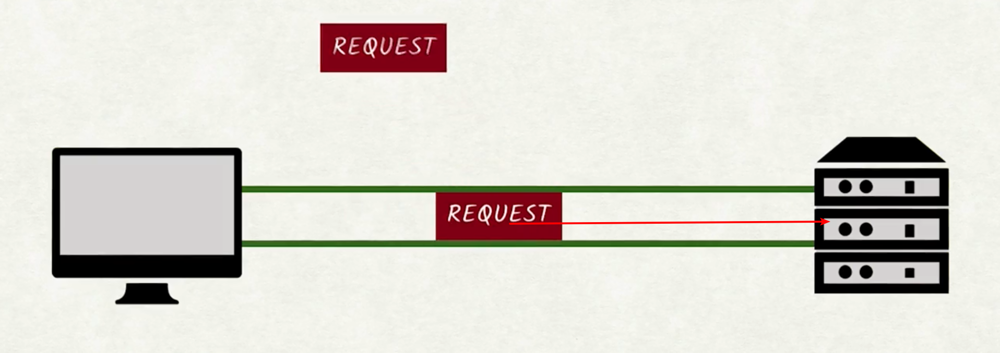

然后返回响应：

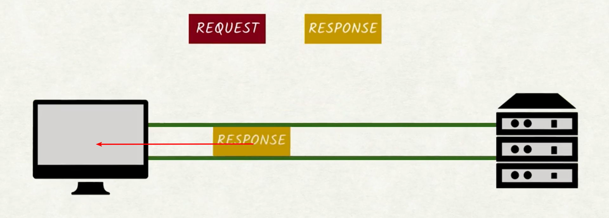

这两个称为往返过程（round-trip）：

对于好的连接，往返时间可以在 20 到 50 毫秒之间：

我们来快速演示一个数学流程，假设一个网站需要发送 100 个请求才能完全加载，我们可以并行处理六个请求，意味着理想情况下，每个连接需要发出 17 个请求才能下载所有 100 个请求：

每个请求的往返时间大概是 35ms，结果为 525 毫秒;

大约半秒的等待时间什么都不能做。而且前提是实际传输请求的文件不需要任何时间，如果传输的文件很大，那么总的传输时间要比 525ms 要大的多，35ms 这个往返时间是平均值。如果网络连接不稳定或很慢，情况会更糟糕。

队头阻塞对网站性能来说影响极大。对于 HTTP/2，我们不需要担心队头阻塞。

### 讲师注释

- [不断增加的请求数量](http://httparchive.org/trends.php?s=All&minlabel=Nov+15+2010&maxlabel=May+15+2016)

## 4.3 HTTP/1 问题：未压缩标头

为了缩短数据发送时间，**很多网站都是用 gzip 或其他适用于网络的压缩算法压缩资源**，HTML 模板项目是用 gzip 压缩算法，更多信息请参阅下面的内容：

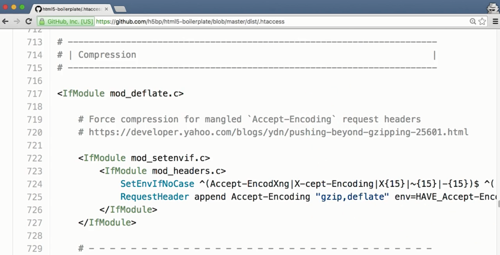

数据压缩作用很大，但是请求和响应报头依然没有压缩：

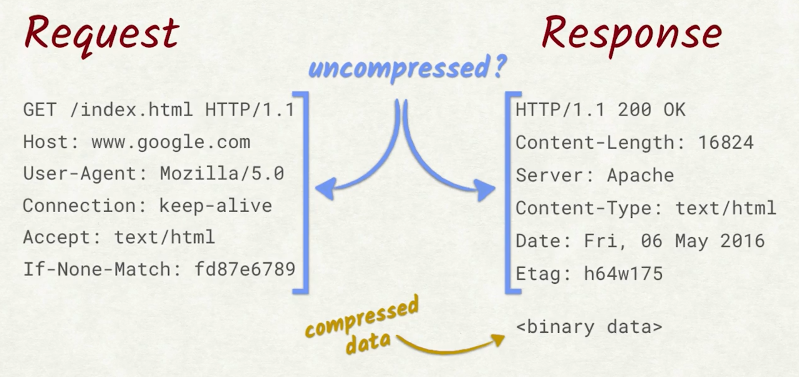

仔细思考下，会发现这不合理，它们是纯文本，完全可以压缩。此外，它们在很多请求中都是重复的，Host 报头 Cookie 和其他一些报头始终不变：

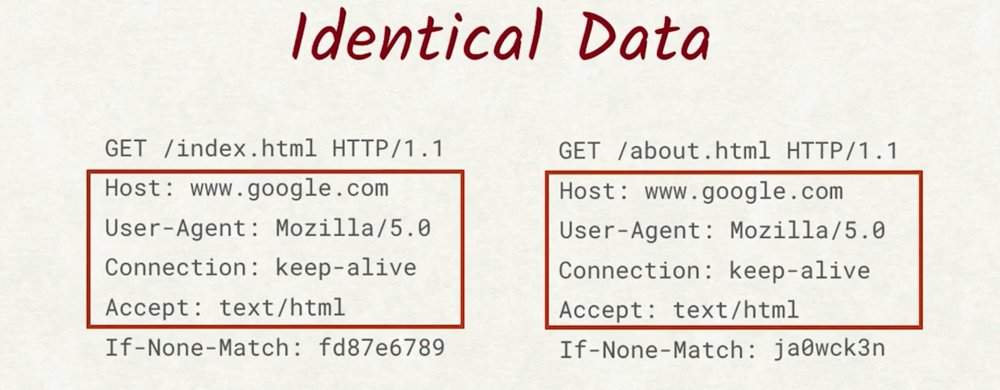

Google 的研究报告指出，报头平均占用 800 字节。

我们来看看可能会节省的空间。如果一个网站发出 100 个请求，报头大约占用 80kb 的数据：

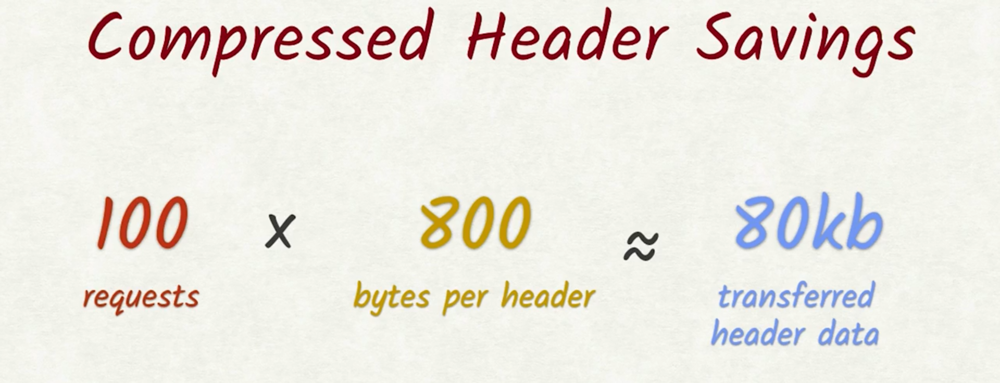

很多数据都是多余的，如果能够压缩报头，那么将节省很多空间。遗憾的是对于 HTTP/1 来说，无法压缩，但是对于 HTTP/2 我们可以压缩。

### 讲师注释

- [HTML5 Boilerplate 项目中的 gzip](https://github.com/h5bp/html5-boilerplate/blob/master/dist/.htaccess#L709-L795)
- [关于SPDY的白皮书](http://dev.chromium.org/spdy/spdy-whitepaper)

---

## 4.4 HTTP/1 问题：安全性

HTTP/2 处理的另一个完全不同的领域是安全性。

电子商务越来越热门，处理信用卡和合同的敏感数据也变得热门起来，如果网站不用 TLS 来处理此类数据，那么绝对是很大的疏忽，因此 TLS 成为了 HTTP/2 规范的必要部分。

HTTP/2 存在非加密版本，但是所有的大型网站都已经不支持这种版本。我们之前讨论过 TLS，在 HTTP/2 中使用 TLS 的过程完全没变，你应该会为此感到高兴，但是 HTTP/2 如何解决其他问题呢？它如何解决队头阻塞问题？报头压缩在 HTTP/2 中是如何工作的？

---

## 4.5 HTTP/2 神奇之处

Richard 介绍了 HTTP/1 的一些缺点，并提到 HTTP/2 能够避免这些缺点，但是如何避免呢？

还记得普通人能够读懂的请求和相应报头吗？处理这些是改善 HTTP/2 性能的第一步，有这些报头很方便，但是纯文本形式的 HTTP/1 报头对任何人都没好处。以文本的形式呈现浪费了宝贵的时间，一个单独的位就能搞定，但是别担心，Wireshark 或 DevTools 等工具依然使你能够查看报头，即使是 HTTP/2 也依然可以。

HTTP/2 解决的另一个重大问题是队头阻塞，它通过一种叫做多路复用的技巧来解决这一问题。多路复用（Multplexing）是个比较华丽的词，**表示将多个信号整合成一个新的信号**，对于 HTTP/2，我们现在有一个连接，而不是六个连接：

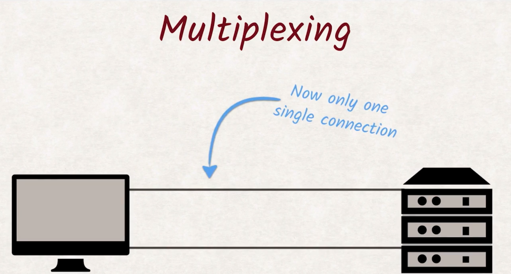

听起来像是一种可怕的退步，但是我们使用单个连接的方式与 HTTP/1 不同。在 HTTP/1 中称为专属连接的连接，现在是信息流：

所有信息流共享一个连接，这些信息流拆分为帧：

并在该单个连接上多路复用，当一个信息流被阻塞时，另一个信息流可以获取该连接并充分利用本来会成为闲置时间的时段，队头阻塞问题解决了。

最后 HTTP/2 可以压缩报头数据，对于 HTTP/2，报头不仅通过 gzip 被压缩，并且工程师设计出专门针对报头的特殊结构和 HTTP/2 多路复用功能的压缩算法：

所有信息流不仅共享连接，并且共享压缩器，意味着报头不用被发送两次，因为压缩器能够识别报头之前被发送过，所以会改为发送引用：

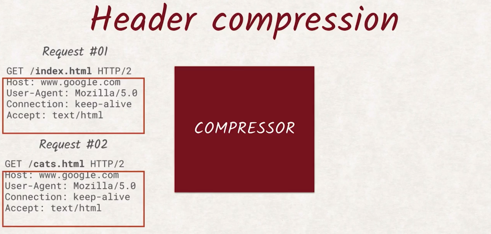

例如，Cookie 是非常长的报头，因此，如果在这里插入和前面第三个请求一样的 Cookie，而不是插入实际值会有很大的优势：

这里不会详细介绍该压缩算法的细节内容，但是如果你想知道它的工作与原理，请参阅讲师注释中的课外资料。

- 多重定义:

  > a system or signal involving simultaneous transmission of several messages along a single channel of communication 
  >
  > 一种系统或信号，涉及沿单个通信通道同时传输多条消息。

- [HPACK - HTTP/2 的标头压缩](https://http2.github.io/http2-spec/compression.html)

## 4.6 练习：HTTP/1 与 HTTP/2

在这道练习中，请比较通过 HTTP/1 和通过 HTTP/2 加载网站的区别，你将在下面的讲师注释中找到二进制文件，请下载该文件，并使用控制台启动它，它将同时在 HTTP/1 服务器和 HTTP/2 服务器上启动。

请使用二进制文件中提供的链接启动每个网站，两个服务器实际上托管的是完全相同的网站，然后使用开发者工具算出传输的数据总字节减少量，然后在输入百分比差别，然后得出加载时间增加量，在这里输入百分比：

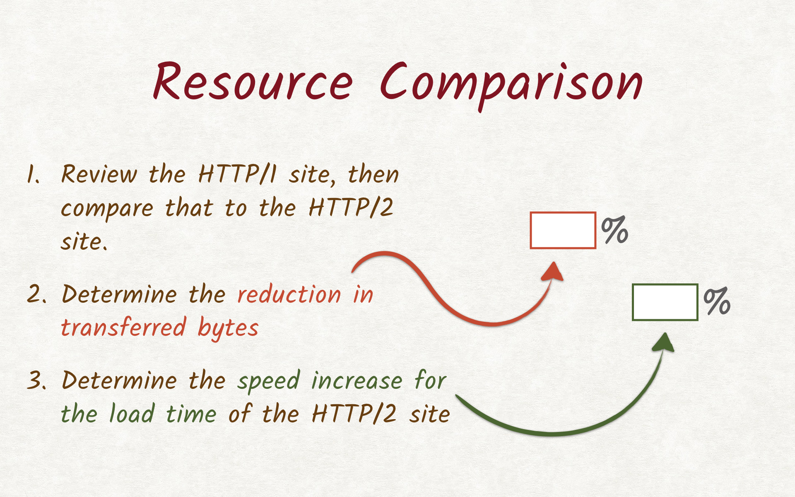

请参阅讲师注释，获取如何处理二进制文件和加载练习的一些使用提示：

- 链接:
  - <http://localhost:8080/>
  - <https://localhost:8081/>
- 你的连接不是私人警告 - 如果你看到你的连接不是私密的警告，那没关系。 要进行警告，请点击“高级”链接，然后点击底部的链接继续。

#### 辅助材料

[ ud897-L4-HTTP2-Binary](http://video.udacity-data.com.s3.amazonaws.com/topher/2016/December/58406627_ud897-l4-http2-binary/ud897-l4-http2-binary.zip)

这是 HTTP/1 和 HTTP/2 服务器的结果：

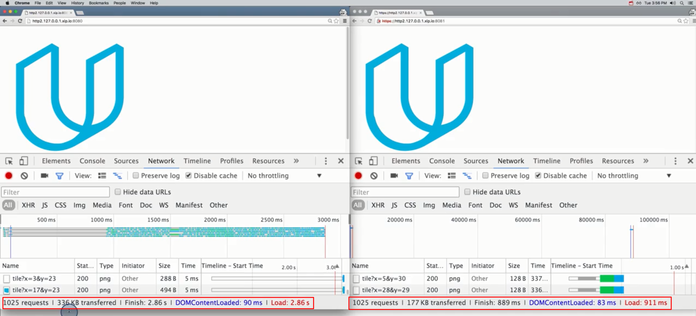

HTTP/1 服务器传输了 336 KB，而 HTTP/2 服务器仅传输了 177 KB，传输的字节数大约降低了 47%，几乎是一半的字节数。

不出意外，HTTP/2 服务器加载网站的速度也快了很多，它用 911 毫秒加载了网站和所有的资源，HTTP/1 服务器总共花费 2.86 秒，速度大概增长了 68%。

因此 HTTP/2 服务器速度快了很多，并且传输的信息更少。

## 4.7 使用 HTTP/2

HTTP/2 带来了很多变化，但是如何从 HTTP/1 转换为强大的 HTTP/2 呢？如何以最佳方式满足所有用户的需求？

随着 HTTP/2 中的队头阻塞消失了，并且现在报头压缩请求代价很低，因此没有必要**合并 JavaScript 或 CSS 了，实际上它会让情况变得更糟糕**。

假设要更新一个缓存的文件，如果你修正了 JavaScript 文件中的一个拼写错误，例如缺少一个花括号，则用户必须重新下载合并的整个 JavaScript，而不是仅仅发生更改的片段。如果每个 JavaScript 文件都分开来了，则只需更改这个文件的缓存。

另一个优势是**发送的请求越多，新的报头压缩法越高效**。发送的请求越多，重复利用的报头越多，也意味着**有很多指向不同服务器的连接实际上对性能有负面影响**。

但是，缩小和压缩 JavaScript CSS 及图片依然是很好的做法，哪怕是一个字节都值得节省，尤其是在发展中国家/地区，节省字节就是节省费用。

此外，关于渲染性能的所有建议依然有效，例如推迟 JavaScript 或内嵌样式，花时间构建完善的客服支持服务也不例外。

最重要的是 HTTP/2 可以向后兼容，所有支持 HTTP/2 的服务器都支持 HTTP/1。不支持 HTTP/2 的客户端将直接后退成支持 HTTP/1，并且和之前一样运转。而且这个客户端越来越少，因此不用担心使用 HTTP/2 有何问题。

2016 年拍摄本视频时，71% 的网络流量支持 HTTP/2，这一数字还会继续增长，因此你完全可以针对 HTTP/2 优化网站，而不用太关心 HTTP/1。

- [查看我们的 Service Worker 课程](https://www.udacity.com/course/offline-web-applications--ud899)
- [目前支持来自caniuse.com 的 HTTP/2](http://caniuse.com/#feat=http2)

## 4.8 练习： HTTP/2 开发技术

在 HTTP/2 带来所有的变化和改进后，我们需要改变开发网站的方式。以下哪些技巧应该用来开发 HTTP/2 网站？

- 应该压缩 JavaScript 文件吗？
- 合并 JavaScript？
- 压缩 CSS？
- 合并 CSS？
- 使用精灵图？
- 使用内容发布网络？
- 应该共享资源吗？
- 应该压缩标记吗？

**对于 HTTP/2，任何关于合并文件或将子图片合并为精灵图的步骤都需要重新考虑**。大部分情况下，这么做都不合适，因为让缓存变得很低效。

压缩依然是很好的做法，因为它降低了需要传输的字节数，因此压缩JavaScript CSS 和标记是正确的选项。

共享资源不合适，因为使得 HTTP/2 报头压缩器效率更低并导致浏览器打开新的连接，这样就会代价很高。

使用单个 CDN 就可以胜过共享的不足之处，因为它使得资源在地理上更接近用户并缩短了往返时间。

可以看出，都需要采取不同的措施，因此确保理解 HTTP/2 对应用开发带来的影响。

## 4.9 小结

对我们来说，HTTP/2 的工作方式和 HTTP/1 的完全一样，有变化的是性能及你需要采取的预防措施，你应该开始构建是用 HTTP/2 的网站，因为不支持 HTTP/2 的浏览器数量越来越少。

如果你运行你的服务器或尝试弄明白在何处托管你的网站，确保在托管位置也启用 HTTP/2。要详细了解如何操作，请访问讲师注释中的链接，查看最常见的服务器提供商和服务器。

在下节课，我们将了解跟过的安全措施，例如跨来源资源共享，同源策略和跨网站脚本，	你甚至有机会自己执行一些黑客行为。

 