# 1. 创建 Promise

> 了解什么是 promise，它如何使编写异步 JavaScript 变得更加简单，以及如何处理错误。

[TOC]

---

## 1.1 简介

大家好，我是 Cameron Pittman，欢迎学习这个简短的 JavaScript Promise 课程。

**每个网站开发人员需要能够轻松自信地处理异步操作**，而这就是学习这个课程的原因，你可以在本课程中学习使用原生 JavaScript Promise

处理异步工作的方法已经有很多，但是在本课程中你将发现 Promise 是被推荐的方法，原因是它更具灵活性和直观的语法，而且还可轻松处理错误。但在开始之前，我有一个与主题不相关的问题。


抬头仰望银河系中的浩瀚星空时，每一个光点都是一颗星星。有些比太阳更大更亮，而有些更小更暗。除此之外，星空中还有什么呢？那就是行星（Planets），银河系中的每一颗星都可能是许多外星人的家园，这意味着仅仅在我们的星系中，可能就存在数千亿颗行星。开普勒太空观察站近些年发现了 1000 多颗这样的外行星，结合使用其他望远镜获得的数据，天文学家已经确认发现了近 2000 颗外行星，那真是一个很大的世界。

设计课程时，我想将其命名为 Exoplanet Explorer，因为这是一个网络应用程序，有助于人们了解其他行星周围的真实行星。你将在这个课程中使用 Promise 请求关于外行星的真实 JSON 数据，而这些数据就来自 NASA 和 CalTech。你可以在应用程序中使用 Promise 将此类数据转化为有用信息。


[由欧洲南方天文台拍摄的银河系图片](https://commons.wikimedia.org/wiki/File:ESO_-_The_Milky_Way_panorama_(by).jpg?uselang=zh) 

---

## 1.2 回调与 Promise

Promise 对象用于延迟和异步计算：

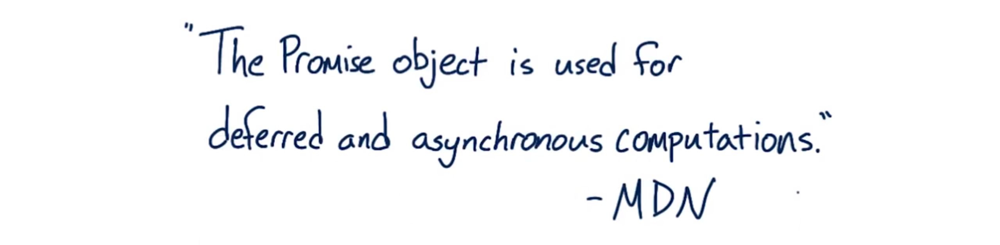

但如果对“异步”这个词还不太理解，那这种说法的作用就不是很大，那么问题是“什么是异步操作”？

**异步操作发生在未知或不可预测的时间，而代码通常是同步的**，一个语句执行，比如这个语句：

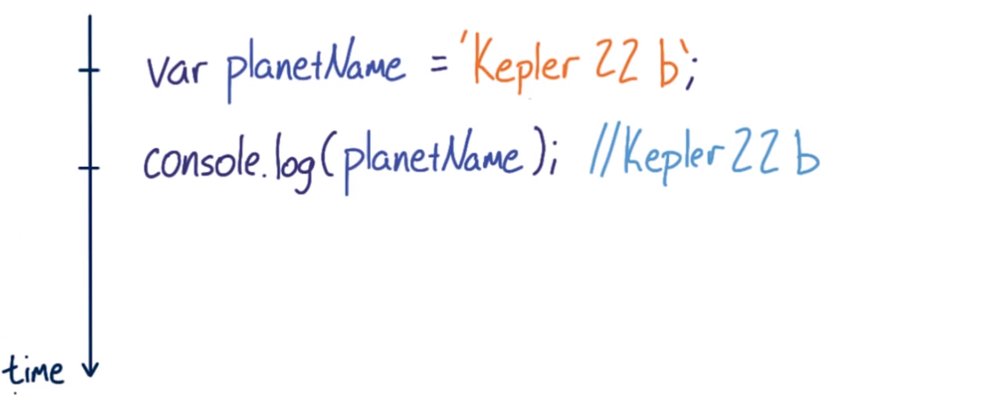

而且保证下一个语句之后立即执行。**处理器上的线程并不能保证，但 JavaScript 线程模型可确保对于所有意图和目的 JavaScript 都在一个时间轴上运行。** 

不同于同步代码，异步代码不能保证会在一个不间断的时间轴上执行，其实你应该假设自己不知道什么时候异步操作会完成。例如，此种情况下：

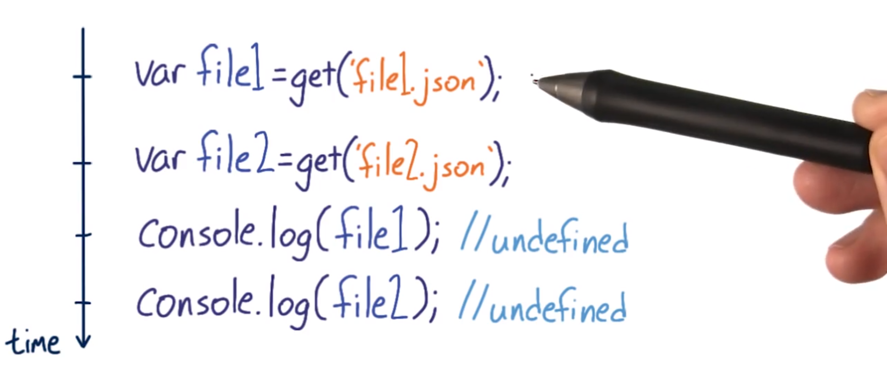

你甚至不能假设，仅仅因为你先发出第一个请求，接着发出第二个更早返回，假设任一顺序的可能性相等，但事实是，一个或两个请求均可能完全失效。

网络请求并不是异步代码的唯一示例，**任何依赖于这些过程（如事件、线程或只是某种未知的完成时间）的代码均是异步的：**

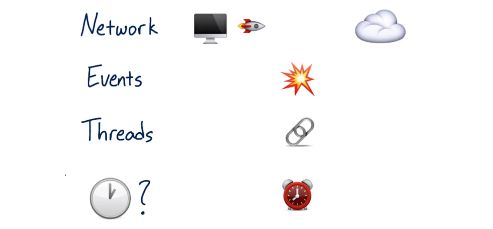

所以最大的问题是：处理异步代码的最好办法是什么？

显而易见，答案是 Promise。

> 我们回到前面那段setTimeout身上，它的工作原理是这样的，当你定义setTimeout那一刻起（不管时间是不是0），js并不会直接去执行这段代码，而是把它扔到一个事件队列里面，当页面中所有同步任务都干完了以后，才会去执行事件队列里面的代码。什么是同步，除了异步代码就是同步—_—。 
>
> https://www.cnblogs.com/pssp/p/5769315.html
>
> 我觉得异步最重要的一点是，它并不会占用线程，让整个程序的执行是流畅的，没有阻塞，节省时间。

---

## 1.3 回调与 Then

回调是处理异步操作的默认 JavaScript 技术：

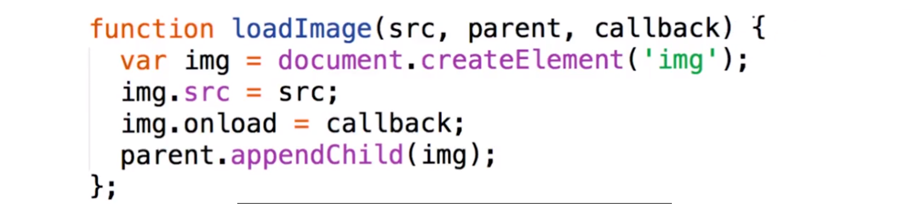

将函数传递给另一个函数，然后在之后某个时间，当某些条件达成后调用回调函数。这个方法不错，但一些问题仍得不到满意的答案，例如，如何处理错误？

**最好的方法是假设任何操作随时都可能失败，这种假设对于网络请求非常重要**。如果此时发生错误，是否仍然执行回调？如果执行，它应该接受什么值？如果不执行，又会出现什么结果？如果出现 JavaScript 错误怎么办？这种错误的处理方法是否与网络错误不同？但这些都没有明确答案。

基本上在第一次强制回调时，节点就会导致错误，但这并没有真正解决问题。**制定和实施错误处理策略，仍然是你的基本工作**。

假设一切运行良好，没有错误，然后 onload 处理程序被调用时，运行该回调，这样就太好了。现在你已经把两种操作结合在一起了，但如果这个回调也是一个异步操作，而且之后还需处理别的工作，那应该怎么办？你准备在这里把另一个回调传递给另一个函数吗？

这种情况会导致一种“厄运金字塔”（The Pyramid of Doom）现象：

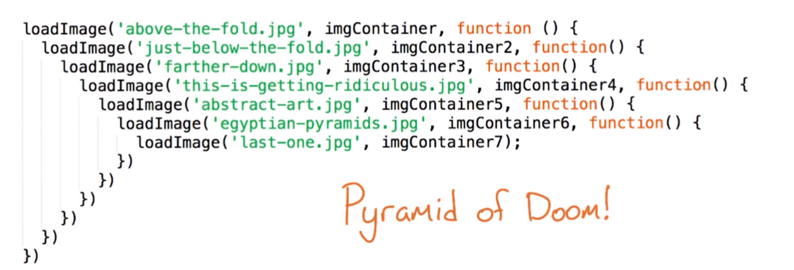

这是一个比较烦人的槽糕情况，令人讨厌的回调中嵌套回调，再嵌套回调。这看起来很乱，很难写，但真正的问题是调式难度难以想象。

这是采用 Promise 编写的相同代码：


但我的代码看起来更清楚一些。你将在本课程的后半部分学习所有关于 .then 的妙处。

---

## 1.4 课程图

我将这个课程分成四个阶段，每个阶段紧密相连。

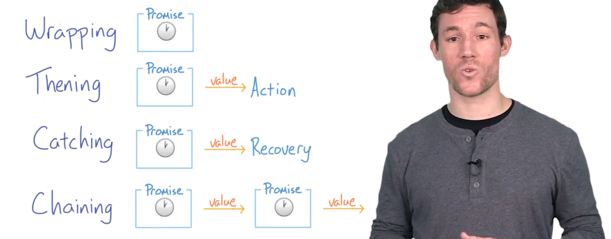

我们从包装（wrapping）阶段开始，首先学习构造 Promise 的语法，一个 Promise 构造函数本身并不是非常有用，所以你可以在此阶段学习如何响应 Promise 的解析。

如果一切顺利，你会想接下来做出承诺，或者如果出现什么问题，你会想捕获错误，这些就是 thening 和 catching 阶段。

整个第二部分课讲的就是链接（chaining）阶段，我们将在这第二部分课中学习如何创建异步操作的长序列。

也应该在这节课中了解一些关于 Promise 的词汇。我引用了 Jake Archibald 在关于 Promise 的绝妙指南中给出的定义，请查看讲师注释。

Promise 有四种状态，你将很快看到这些术语，但我建议将它们记在一张纸上，可以整个课程中为你提供帮助。

这四种状态分别是：

- 第一个是成功状态（fulfilled）表示顺利执行与 Promise 相关的操作，也将这个状态称为 resolved
- 第二个是失败状态（rejected）表示与 Promise 相关的操作失败了
- 下一个是初始状态（pending）表示 Promise 尚未成功（fulfilled）或失败（rejected）
- 最后一个是，确定状态（settled），表示 Promise 已经成功或失败

现在你已经知道了四种状态，接下来要开始学习如何以及何时执行 Promise。

[JavaScript Promises - Jake Archibald](https://developers.google.cn/web/fundamentals/primers/promises)

---

## 1.5 Promise 的时间轴

我想让你设想一个这样的情景，在事件已经触发之后，你设置了时间侦听器。会出现什么情况呢？

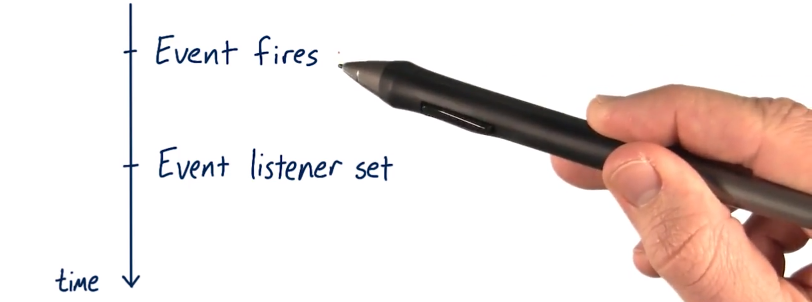

如果该事件没有被再次触发，就不会出现任何情况，也永远不用调用该事件侦听器。

现在设想你正在使用 Promise 且设置了一个 Promise 完成时执行的操作，而这在 Promise 已经完成的状态之后，猜猜会出现什么结果？

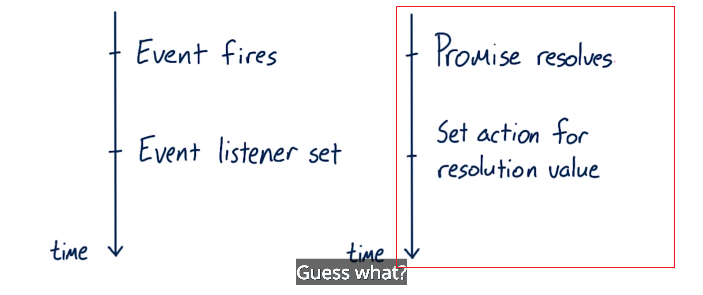

结果就是会执行。将与事件侦听的例子相比，如果在时间触发之后设置事件侦听，那么事件侦听器永远不会被调用。

我想快速地带你看一些代码，这是一个 Promise 构造函数，你将在下一个视频中了解关于这个函数的更多信息：


这个 resolve 方法可以确定（settle）Promise 的状态，**一个 Promise 只能确定一次状态**，所以在这种情况下，第二个 resove 不执行任何操作。因此也不会出现任何结果，它将会被忽略。与时间进行比较可以发现，时间可以多次触发，而 Promise 只能确定一次状态。

在主线程中执行 Promise，这意味着它们仍然可能会造成阻塞，**如果在 Promise 中的操作需要很长时间，那么仍然有可能阻塞浏览器渲染页面所进行的操作：**

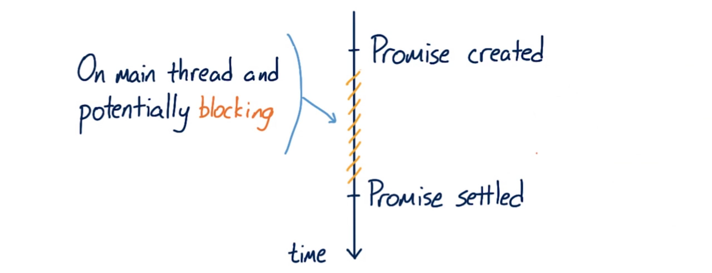

如果这样，应用程序的帧速率将受到影响，你可能会听到用户抱怨页面卡顿。

Promise 并不是安全执行费时操作的通行证，**它仅仅是一种决定异步任务状态确定时会出现什么结果的技术**。将它们想成使用 try catch 将异步操作包裹在里面。

---

## 2.6 练习：异步情形

你在以下哪些情况中考虑使用 Promise？

- 处理来自 Ajax 请求的信息时
- 当在主线程中执行费时的图像处理时
- 当创建一系列 div 并以特定顺序将其添加到 body 中时
- 或在主线程和 web worker 线程之间来回发布消息时，如果对 web worker 线程不熟悉，那么，它其实是一个可以创建独立线程的 API，允许你在主线程之外执行费时的 JavaScript

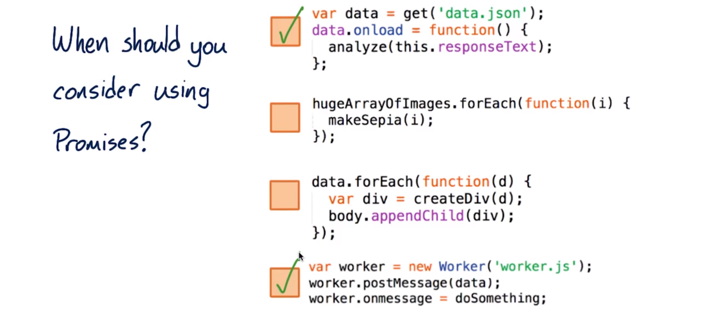

那么这些情景中哪一种是可以使用 Promise 的呢？我们现在从头开始：

- 处理来自 Ajax 请求的信息，毋庸置疑的是 Ajax 的定义中存在异步。
- 接下来在主线程中执行费时的图像处理工作，不是。**Promise 运行在主线程中**，所以在主线程中把操作包装到 Promise 中不会获取任何东西，操纵仍将同步进行，而且仍然可以导致一个卡顿的体验。
- 创建一系列 HTML 元素，不是。创建和添加 DOM 元素是同步的，所以，没有必要将它们包装到 Promise 中，话虽如此，**但如果这些是图像元素，或 script 元素且链接到外部资源，那么加载外部资源就属于异步操作**。可以在加载资源后使用 Promise 链式操作，同样，如果数据来自异步资源，那么可以将其包装到 Promise 中，但这里并没有异步。
- 最后，在主线程和 web worker 线程之间来回发送消息，是。web worker 在单独线程上运行，并将数据发送到主线程，这些无疑属于异步操作，也是 Promise 的应用范畴。

---

## 1.7 语法

我们即将学习包装（wrapping）阶段，大家需要注意的是 **Promise 将那些完成时间不可预测的代码，使用异常处理机制（try-catch）包装起来**。这里，我们举个例子看一看：

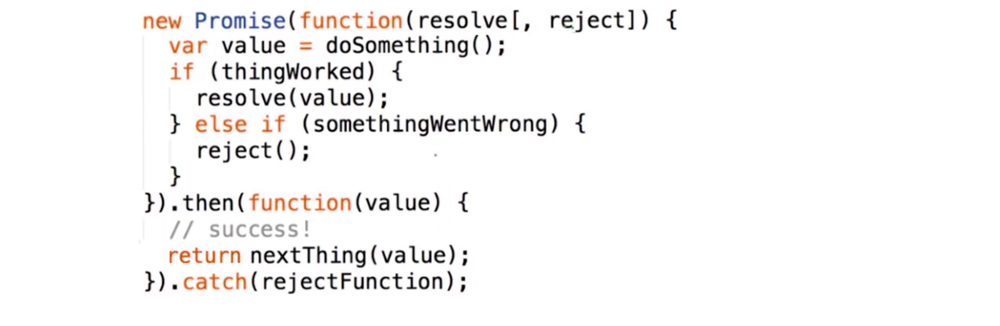

Promise 是一个构造函数，可以像这样将 Promise 存储为一个变量（`var promise = new Promise(funcion(){...})`），或者可以在创建 Promise 后立即使用，无论哪种方式都可以。但你经常会看到，我只是简单地使用 Promise 而不用将它存储为变量。

将一个函数传递到 Promise 并带有两个参数，resolve 和 reject，resolve 和 reject 是两个回调，可以用于指定一个 promise 因为做了某些工作成功而执行 resolve 或者由于出现某些问题而执行 reject 。我们来具体学习一下。

在这个示例中：

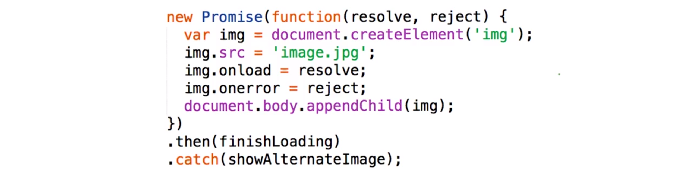

因为我想在页面上加载图像后进行其他操作，所以我准备在 Promise 中封装一个图像标签加载程序，我使用图像标签的 onload 处理程序来表示是否成功。onload 调用 resolve，这可以把此函数放入队列，以在此函数执行完毕后传递给 then 进行执行。请注意 **JavaScript 引擎不会在调用 resolve 时立即停止执行这个函数**，在这种情况下，这是最后一步操作，所以实际上是此函数的结束，但事实并非如此，请查看讲师注释中的链接。

能够调用 resolve 和 reject 非常重要，这给了你明确说明什么可以导致 Promise 完成和失败的灵活性。当已调用 resolve 或 reject 时，promise 就已确定状态。然后就在那时，链式调用的下一个部分通常是执行 .then 或者则执行 .catch。

返回原始示例，传递给 resolve 或 reject 的任何值将被随后的 .then 或 .catch 当做参数接受：

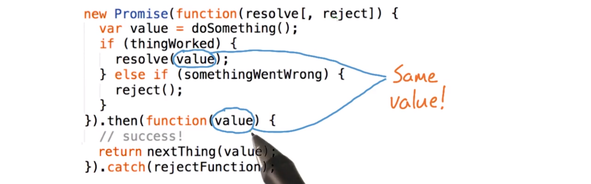

在该事件中没有任何值传递给 resolve 或 reject（这个例子中是 reject）那么也是完全可以的，下一个链式调用就仅会接受 undefined，第三种情况是如果传递的值是一个 Promise，如果这样，就先执行 Promise，然后 resolve 的任何值将被传递到下一个链式调用。

请注意 resolve 和 reject 的语法相同，resolve 之后，链式调用中出现下一个 then，而 reject 后将出现下一个 catch。顺便说一下，如果 Promise 函数中的某处存在 JavaScript 错误，也会自动调用 catch。另外，还有更多关于错误处理的内容，我们将在下一节课中具体学习。


*Cam 提示：哎呀，我现在还没有一个很好的链接给你。不过，我可以进一步解释。尝试在浏览器中运行此代码。*

```javascript
new Promise(function(resolve) {
  console.log('first');
  resolve();
  console.log('second');
}).then(function() {
  console.log('third');
});
```

你将发现，'first’、’second' 和 'third' 都输出了。最值得注意的是，**'second' 也输出了，虽然它位于 resolve() 之后**。

在 2:11 左右，我开始讨论通过 resolve() 和 reject() 向 .then 和 .catch 传递值或 undefined。**值本身并没有传递给 .then 或 .catch，而是传递给被 .then 或 .catch 调用的函数。**

有问题？ 你可以前往 [优达学城论坛](https://discussions.youdaxue.com/?forum_path=c/standalone-courses/javascript-promises) 与课程导师和其他学员一起讨论！

---

## 1.8 练习：编写你的首个 Promise

在这个练习中，我们将使用 Promise 来包装 setTimeout，因为我想让第一个练习简单一些，所以先不作任何错误处理。

我将提供一个示例页面给你操作，你会在该页面发现一个叫 wait 的函数，wait 只需在 resolve 之前等待设定的毫秒时间，这意味着在 setTimeout 执行回调时，需要调用 resolve，处理此函数时，我希望你在 Promise 中用 console.log(this) 打印 this 值。原因是完成处理后，我有一个关于 Promise 中 this 作用域相关的问题。我也希望你从 wait 返回 Promise，原因是完成操作后，需要取消这两行注释来测试你自己的代码：


如果没有错误，并且此文本发生变化，就表示做的完全正确。

前面已经提过，在你完成处理后，我有一个问题，就是 Promise 中 this 的作用域是什么？注意，你还可以在讲师注释中找到更多有关练习说明的链接，祝你好运。


### 说明

1. 从可下载资源区域下载 `setTimeout-start.zip`。
2. 将 `setTimeout` 封装在 `wait()` 函数中的 Promise 中。`resolve()` 位于 setTimeout 的回调中。
3. `console.log(this)` 位于 Promise 中，并观察结果。
4. 确保 `wait()` 也返回该 Promise！

请参阅可下载资源区域的 `setTimeout-solution.zip`，看看我的代码！


#### 辅助材料

[ setTimeout-start.zip](https://www.udacity.com/api/nodes/6078481442/supplemental_media/settimeout-startzip/download)

[ setTimeout-solution.zip](https://www.udacity.com/api/nodes/6078481443/supplemental_media/settimeout-solutionzip/download)


这是我们提供的具体的解决方案：

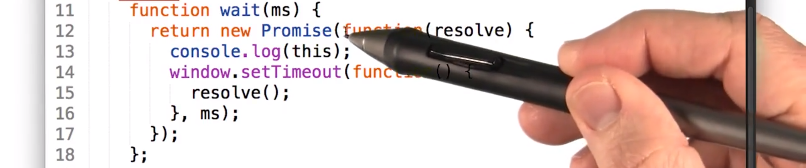

首先，使用 new Promise 创建一个 Promise 实例，把带有参数 resolve 的函数传递给 Promise 构造函数，这个例子中没有 reject，原因是我们不需要 reject。我们准备在 Promise 内打印 this 值，以便稍后查看它的作用域，我们设置了 setTimeout，你将在 setTimeout 的回调函数中看到**我们调用 resolve 把 Promise 变成完成状态**。在这个例子中 Promise 将在传入 wait 的毫秒时间值之后 resolve，还要注意，我们返回了 Promise，一会儿你将明白我们这样做的原因。


然后我们取消了这两行，这意味着在 2000ms 后 finish 函数将会被调用。

好，让我们瞧瞧 this 是怎么样的，去刷新一下页面：

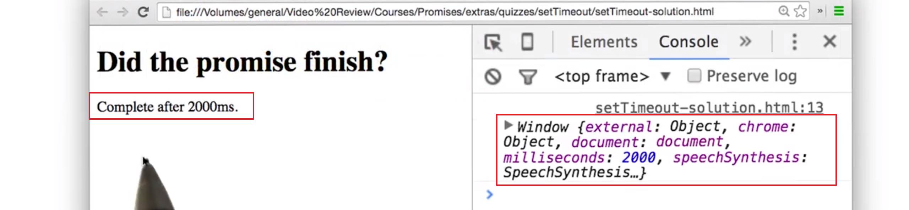

两秒后，就能看到它会完成，看起来打印出来的 this 是 window 或者说是全局对象。顺便说一下 this 的作用域会根据上下文变化，例如，如果使用 ES2015 的箭头函数，看到的 this 值将会不同，所以要注意这一点。

所以答案是 global object

---

## 1.9 练习：封装 readyState

第一个练习的确简单了一点，这个练习将更有用。你将通过在 Promise 中包装一个 document.readyState 的状态监测来实现 jQuery 的 .ready 功能。

我们现在处于课程的 thening 阶段，我希望你在 Promise 给出结果后使用 .then 执行一个操作。

document.readyState 有三种可能的状态：加载、交互和完成。（也就是三个值）

- **加载**表示文档仍处于加载状态
- **交互**表示文档已经加载和解析，但是尚未加载像图像和样式这样的子资源，这相当于 DOM 内容加载的事件。
- 最后是**完成**的状态，也就是说包括图像和样式表在内的所有子资源都已加载。

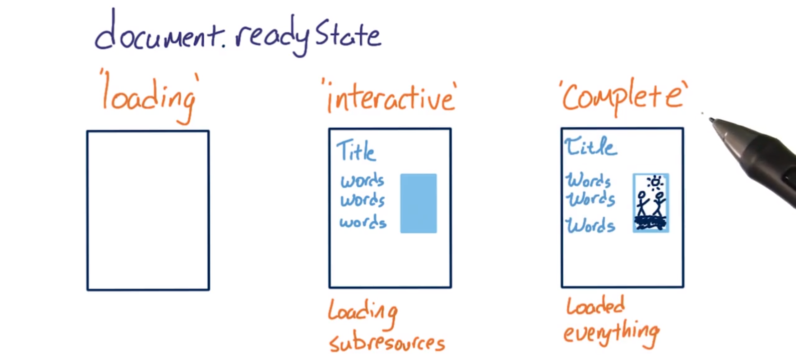

每次文档 readyState 状态发生变化时，就会触发 readyState 状态更改事件。如果你想在加载完所有初始 DOM 元素后运行一些代码，那么在交互状态创建一个 promise 去运行会非常有用。

在这个练习中，我将为你提供一个可更改 readyState 状态的事件处理程序，你可以将其包裹进 Promise 以便当 DOM 处于交互状态时可设置 resolve 状态，或者换句话说，我想在 readyState 不再加载时便可完成。

与上次练习一样，不需要担心错误处理，原因是如果 DOM 没有就绪，也不会显示页面。也请确保进行测试文档准备就绪后使用 .then 链式调用 wrapperResolved 方法就可以进行测试。

确保查看讲师注释帮助你开始练习，祝你好运。

### 说明

1. 从可下载资源区域下载 `readyState-start.zip`。
2. 设置网络限制，使网页并非立即准备好。（此外，在测试网站时，通常有必要设置网络限制。我将帮助你了解你的网站在用户眼中的效果。）
3. 将 `readystatechange` 的事件监听器封装在 Promise 中。
4. 如果 `document.readyState` 未`’加载’`，则调用 `resolve()`。
5. 通过链接 `wrapperResolved()` 进行测试。如果一切正常，你应该能在页面上看到"Resolved”！

[关于 document.readyState 的更多详情](https://developer.mozilla.org/zh-CN/docs/Web/API/Document/readyState)


#### 辅助材料

[ readyState-start.zip](https://www.udacity.com/api/nodes/6105298604/supplemental_media/readystate-startzip/download)

[ readyState-solution.zip](https://www.udacity.com/api/nodes/6027593911/supplemental_media/readystate-solutionzip/download)


开始之前，我想感谢一下 Jake Archibald，是他提出了这个练习的想法，也是他编写了这段代码：

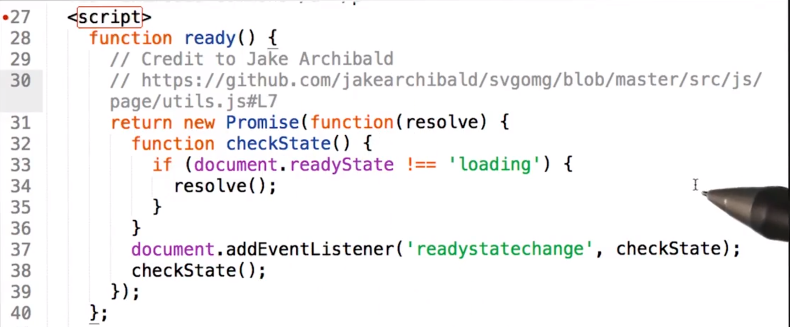

ready 方法由两部分组成，触发 readystatechange 事件时，检查 readyState，同时也会立即检查 readyState 的状态。通过立即检查，如果 readyState 的状态变为交互式，ready 方法仍将继续运行，这在创建 Promise 之前特别有用，如果创建 Promise 之后 readyState 仍是加载状态，则每次发生 readystatechange 事件时都会调用 checkState，如果不再是加载状态，那么就 resolve 完成。

下面看看我将如何测试它：

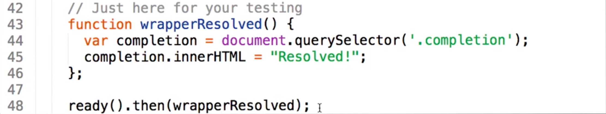

我只是调用 ready 然后 then 链式调用，最后是 wrapperResolved。是时候看看它的样子了

测试这个练习时，要看到测试过程有点难，我正在使用 2G 以便让图像加载起来比较慢：

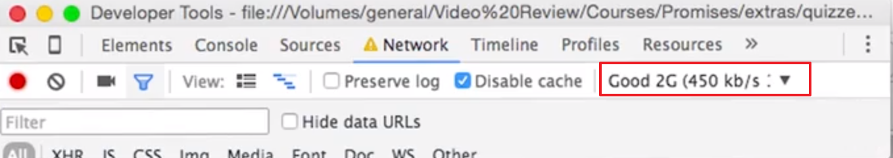

记住应该在图像显示之前显示文本 Resolved，现在已经显示 Resolved 了，但我们需看看刷新页面时会出现什么。甚至可以在图像完成加载之前看到已立即 resolve 完成了，这就好极了。

我们现在来学习一些错误处理。

---

## 1.10 重要事项！使用 Exoplanet Explorer

### 这是什么？

你将使用精简版 [Exoplanet Explorer](http://www.exoplanetexplorer.com/)(英) 来完成这门课程的所有剩余编程测验。因此，你需要安装它。

### 安装

我使用 [Polymer](https://polymer-zh.cn/) /[英](https://www.polymer-project.org/) [初学者工具包](https://developers.google.cn/web/tools/polymer-starter-kit/?hl=zh)构建了 Exoplanet Explorer。我从 Polymer 团队编写的 README 中复制了大部分的说明。如果你需要帮助，请参阅该 README。

**先克隆存储库（针对所有人）**

这是[存储库链接](https://github.com/udacity/exoplanet-explorer)。

你应该位于 `xhr-start` 分支上，如果没有，则使用 `git checkout xhr-start` 或 `git checkout origin xhr-start` 转到该分支。

**快速启动（针对有经验的用户）**

安装 Node.js 后，在下载的 Exoplanet Explorer 根目录下安装以下这行代码：

```
npm install -g gulp bower && npm install && bower install
```

**先决条件（针对所有人）**

完整的初学者工具包需要以下重要依赖项：

- Node.js，用于在命令行中运行 JavaScript 工具。
- npm， 一款 node 包管理器，随 Node.js 一起安装了，并用来安装 Node.js 包。
- gulp，一个基于 Node.js 的构建工具。
- bower，一个基于 Node.js 的程序包管理器，用来安装前端程序包（例如 Polymer）。

**要安装依赖项：**

1) 检查你的 Node.js 版本。

```
node --version
```

应该至少为 0.12.x 版。

2) 如果没有安装 Node.js，或者版本更低，转到 [nodejs.org](https://nodejs.org/) 并点击绿色的大安装按钮。

3) 全局安装 `gulp` 和 `bower`。

```
npm install -g gulp bower
```

这样就可以从命令行中运行 `gulp` 和 `bower`。

4) 安装初学者工具包的本地 `npm` 和 `bower` 依赖项。

```
cd exoplanet-explorer && npm install && bower install
```

这样会安装元素集合（Paper、Iron、Platinum）以及初学者工具包构建和提供应用所需的工具。

**注意！安装过程可能需要很长的时间！**要下载和安装很多依赖项。

### 安装之后和工作流程

对于每道练习，我们都会提供一个要检出的分支。你始终可以在讲师注释（instructor notes）中找到这些分支。所有工作都将在以下文件中完成：

```
app/scripts/app.js
```

**Serve / watch**

```
gulp serve
```

此命令会输出一个用来进行本地测试的 IP 地址，以及另一个用来连接到你的网络设备进行测试的 IP 地址。

建议使用 Chrome，因为非硫化的 Polymer 项目在 Chrome 中加载速度更快。

**Build & Vulcanize**

```
gulp
```

构建并优化当前项目，准备好部署。包括代码检查和硫化、图片、脚本、样式表和 HTML 优化和极简化。

**问题排查**

如果你从 Gyp 中看到以下错误，请参阅[此 bug](https://github.com/nodejs/node-gyp/issues/695)：

```
"Error: self signed certificate in certificate chain"
```

---

## 11. 练习：封装 XHR

...

---

## 12. 网络技术

...

---

## 13. 练习：Fetch API

...

---

## 14. 下一步该怎么办？

到目前为止，我们已经创建了 Promise 并在之后链式调用了一些操作，你上一次练习中创建了一个 get 函数并使用 .then 和检索的数据执行了某些操作。

此外，还加入了 catch（捕获）确保全部错误得到处理。

**通过使用 Promise API .then 也返回了 Promise，所以如果你可以在初始 promise 末尾调用 .then，你还可以一直 .then 下去，因为 .then 返回的都是 promise。**

开发人员通常使用术语 thenable 来描述 .then 中的 Promise，任何返回 .then 的方法或对象都是 thenable，thenable 的任何方法或对象都可以成为异步链式调用的一部分。thenable 的 Promise 和 .then .catch 是一样的，实际上，其他库有 thenable 的对象，请查阅讲师注释了解更多信息。

创建一个异步操作链式调用时，其中每个后续链接会收到此前 promise 完成状态的值或返回此前 .then 函数的值，我们可以通过这种方式将从异步方法收集的信息传递到下一个方法。

能够将所有 thenable 链式调用到一起是一种非常强大的技术，可以简化异步操作的复杂序列。

我们将在一下节课中具体实践一些链式调用策略。

那么第一课就到此结束了，**你已经在自己的工具箱中添加了一个强大的新工具**。但这才是我们迈出的第一步。


[在 MDN 上的 promise 中使用的“Thenable"](https://developer.mozilla.org/zh-CN/docs/Web/JavaScript/Reference/Global_Objects/Promise#%E6%96%B9%E6%B3%95)。 