#  5.使用 React Router 管理应用位置信息

> 你将学习如何使用 React Router 向 React 应用中添加路由。你将学习 BrowserRouter、Link 和 Route 组件以**动态地渲染页面**。

>路由：路由是指路由器从一个接口上收到数据包，根据数据包的**目的地址**进行定向并转发到另一个接口的过程。

[TOC]

---

## 5.1 简介

当我们在浏览器中使用 JavaScript 渲染 UI 时，人们有时称此为“单页面应用”。这是什么意思呢？

典型的网站是这样的：

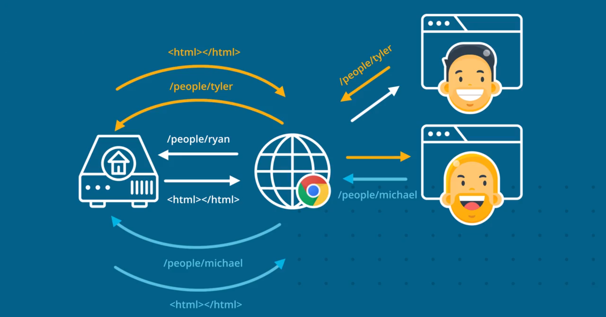

用户访问网站时，浏览器会从网站的服务器请求页面，服务器生成一些 HTML 并将其返回。当用户使用导航时，浏览器会从服务器请求一个新页面，服务器将返回一个新页面的 HTML 文件给浏览器，用户便会看到新页面。每次用户使用导航时，都会重复此过程。

当人们说    单页面应用时，**并不是说应用只有一个页面，而是说浏览器不需要向服务器请求新页面**。而由 JavaScript 处理页面之前的转换，所以服务器只发送一个初始页面：

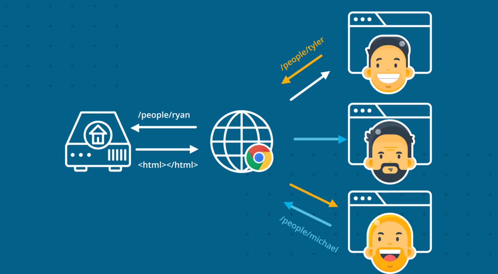

这就是为什么它叫做单页面应用。

**React Router 是让我们使用 React 构建单页面应用的一个工具**。

我记得当我第一次决定在工作中使用 React 时，我无法找到一个理想的路由器，所以我快速写下了一些零散的代码并拿给 Michael 看，他觉得不错，于是我们一起做了一些调整，并最终发布了现在人们所知的 React Router。

它迅速成为了最受欢迎的 React 库，并在 React 早期就被官方推荐使用。自那以后我们一直在使用它。

---

### 单页面应用

**单页面应用**可以有多种工作方式。单页面应用的一种加载方式是**一次性下载整个网站的内容**。这样，当你浏览网站时，一切内容已经出现在浏览器中，不需要刷新页面。单页面应用的另一种工作方式是**下载渲染用户请求的页面所需的所有内容**。**当用户浏览到新页面时，仅对请求的内容发出异步 JavaScript 请求**。

**优质单页面应用**的另一个关键因素是**由 URL 控制页面内容**。单页面应用互动性非常高，用户希望能够**仅使用 URL 就能回到特定的状态**。为何这一点很重要？Bookmarkability（书签功能，很确定的是这还不是一个单词）！**当你将网站添加到书签中，该书签仅仅是 URL，并没有记录该页面的状态。**

有没有注意到，你对应用执行的任何操作都不会更新页面的 URL？**我们需要创建能够将页面添加到书签中的 React 应用！**

### React Router

React Router 会将 React 项目转变成单页面应用。它通过**提供大量特殊的组件**来实现这一点，这些组件能够**管理链接的创建**、**管理应用的 URL**、**在不同的 URL 地点之间导航时提供转换**，以及很多其他功能。

根据 React Router 网址：

> React Router 是一系列**导航式组件**的集合，可以与应用一起以声明的方式编写代码。

如果你感兴趣的话，请参阅网站：[https://reacttraining.com/react-router/](https://reacttraining.com/react-router)。

在下一部分，我们将根据项目的 `this.state` 对象中的值动态地向页面上渲染内容。我们将使用这个基本示例讲解 React Router 的工作原理，即通过状态控制正在显示的内容。然后，我们将学会如何使用 React Router。我们将逐步介绍如何安装 React Router，将其添加到项目中，并将一切连接到一起，使其能够管理链接和 URL。


## 5.2 动态地渲染页面

对于应用的当前功能，根本没法添加新的通讯录！很遗憾，因为我真的需要将 Richard 添加到我的通讯录里。我们创建一个表格，使我们能够新建通讯录并保存到服务器上。

#### 练习题

我们将创建一个表格来新建通讯录。该表格 **UI 的代码**应该放在何处？

- 在 `App.js` 中
- 在 `ListContacts.js` 中
- 在 `index.js` 中
- 在新组件中
  - React 喜欢组合创建组件。因此，我们需要将新的 UI 创建为单独的组件，并使用组合功能将其包含在另一个组件里。 


**我们不希望该表格一直显示，仅在启用某个设置后，才开始显示该表格。我们将此设置保存在 `this.state` 中。**这样使我们能够知道 React Router 的工作原理。

---

如果我们不能创建新的联系人，那这个通讯录应用还有什么使用呢？

让我们添加一个页面，以便向列表中添加联系人。

我们要做的第一件事是在应用中创建一个新的文件，取名为 CreateContact.js，然后导入 React 和 Component。**React 中的页面只是组件**，所以让我们在此定义组件类：

```react
class CreactContact extends Component {
    render() {
        return (
        	<div>Creact Contact!</div>
        )
    }
}
```

接着添加我们熟悉的 render 方法，返回一些东西，比如文本“Creact Contact”和一个感叹号，因为我们对于创建新页面非常激动。

然后是我们的 export default 创建一个连接，确保当我们在应用中导入它时，它能够正常工作：

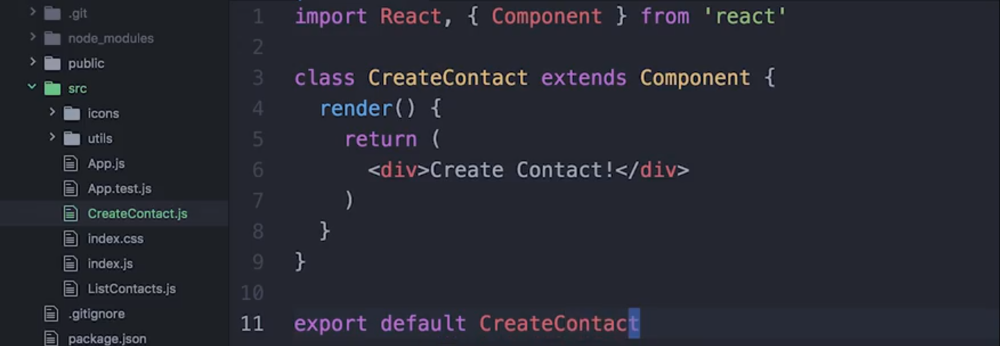

让我们回到应用（App.js）并引入这个组件，我们在上面导入组件：

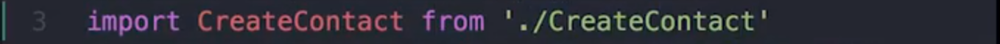

接下来我们需要渲染它，以确保一切正常。

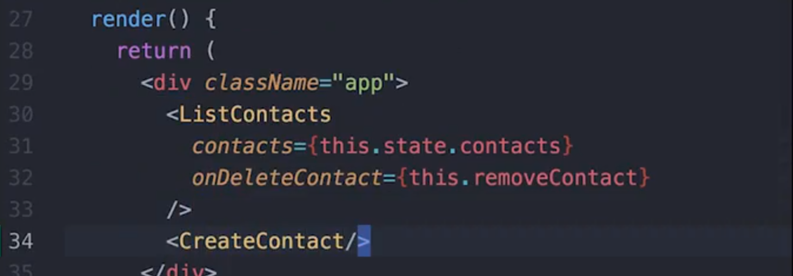

保存它，然后便能在这里看到两个页面的内容。

但是我们不想同时渲染应用中的所有页面，我们只想显示我们想要展示的页面。所以我们可以直接使用 React Router，但让我们先来看看，如何**利用组件的状态实现**这点，这样有助于让我们了解 React Router 是如何工作的，因为如果有可能我们自己也可以实现它。

我们**需要一些状态来决定要显示哪个页面**。我们直接称它为 screen ，它的值可以是 list 或者是 create，所以对于这一状态，我们可以在 list 和 create 之间切换：

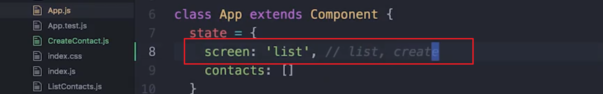

这使我们可以在 render 方法中决定要显示什么，我们设置 this.state.screen 等于 list，if 后的代码块中将放置我们想要看到的页面：

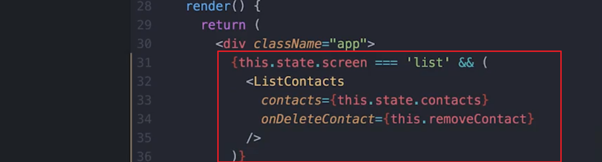

> 这里的 && 之前你可以认为是 if 语句，因为 && 之前如果为 true 则执行后面的代码。

同样的，我们在下方法设置 create 页面，然后将 CreateContact 移到里面：

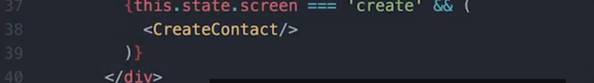

因为我们当前的状态是 list，所以当我们保存这个文件后，浏览器将会自动刷新。然后会看到 Create Contact! 会消失。

如果我们手动将 state.screen 更改为 'create'，则联系人列表消失了，而 Create Contact! 会在页面中出现。

> 这样我们就可以在页面中通过控制 screen 的值来显示不同的组件，因为每一次都会有大部分甚至整个页面的重新渲染，给人的感觉像是在不断跳转一样。
>
> 这样也就能够让我们在一个页面中显示不同的界面，并且能够进行不同的操作。


[这是本视频中所做更改的 commit。](https://github.com/udacity/reactnd-contacts-complete/commit/db0aafdc7766048c28597d37f31977ac7833a62e)

---

在这个简短的视频中，我们介绍了很多重要的更改。我们创建了 CreateContact 组件，它将负责创建新通讯录的表格。根据 React 对组合功能的青睐，我们创建了这个独立的组件，并使用了组合功能，将其添加到 `App` 组件的 `render()` 方法中。

为了非常简单地重现 React Router 的工作原理，我们向 `this.state` 添加了 `screen` 属性， 并使用此属性控制什么内容应该显示在屏幕上。如果 `this.state.screen` 是 `list`，那么我们将显示所有现有通讯录的列表。如果 `this.state.screen` 是 `create`，那么我们将显示 CreateContact 组件。

### 短路求值语法

在此视频中，当创建了“当前显示”部分时，我们使用了一种看起来很奇怪的语法：

```react
{this.state.screen === 'list' && (
  <ListContacts
    contacts={this.state.contacts}
    onDeleteContact={this.removeContact}
  />
)}
```

和

```react
{this.state.screen === 'create' && (
  <CreateContact />
)}
```

看起来可能有点让人迷惑，既有组件的 JSX 代码，又有运行表达式的代码。但其实就是逻辑表达式 `&&`：

```react
expression && expression
```

这里使用的是一种叫做**短路求值**的 JavaScript 技巧。如果第一个表达式的值是 `true`，则运行第二个表达式。但是，如果第一个表达式的值是 `false`，则跳过第二个表达式。我们使用这种技巧来首先验证 this.state.screen 的值，然后显示正确的组件。

要深入了解这一技巧，请参阅 [MDN 上的短路求值信息](https://developer.mozilla.org/zh-CN/docs/Web/JavaScript/Reference/Operators/Logical_Operators#Short-Circuit_Evaluation)。

### 添加按钮

目前，我们需要手动更改状态以让应用显示不同的屏幕。我们希望用户能够在应用本身控制这一点，我们添加个按钮吧！

---

我们希望用户能够进行那样的转换，而不是像我们刚刚所进行的硬编码（hard code）。所以，让我们在“搜索联系人”这里，添加一个按钮和一个 click 回调函数，用以更改我们的状态并切换页面。我们将在 ListContacts 文件中完成这一切。

我们在 ListContacts.js 组件下，到 render - return - input 代码处添加一个 a 标签，设置 href="#create" 和 onClick，因为 onClick 这里我们想要做一些事情，但是还没有决定做什么，所以先放一个空函数。然后，让我们为它设置一个 className="add-contact"：

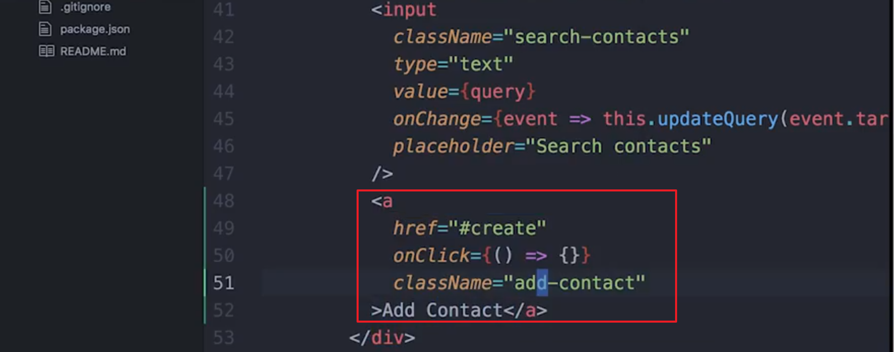

好的，现在我们有了一个按钮，当点击它时，目前什么也不做。

我们想要更改的是应用的状态（App.js），但是我们现在位于 ListContacts 组件中，它并没有当前页面的状态，所以我们得回到应用中，然后给 ListContacts 组件传递一个函数，就像在 onDeleteContact 属性上做的一样，当一个联系人被删除时，我们调用 this.removeContact 然后调用 setState，在这里我们做同样的事情。

我们会创建一个 onNavigate 属性并赋值一个函数，我们可以写成 this.navigateToCreate：

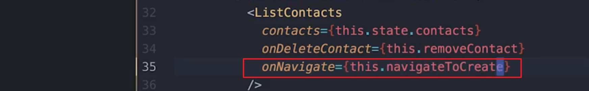

或者我们可以直接把函数写在里面（指 onNavigate 的值）：

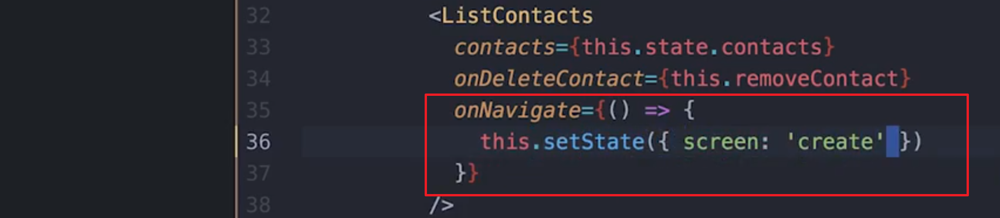

在这里，我们想要设置状态，将使 screen 的值改为 create。

现在我们要将 onNavigate 函数在 ListContact 组件中的 a 标签 onClick 中调用：

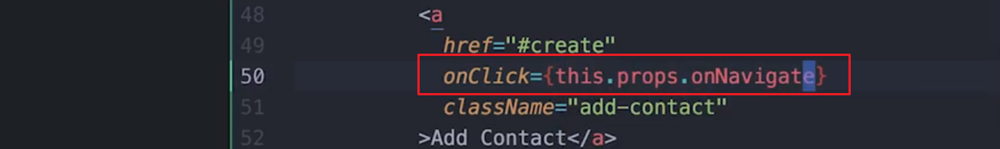

所以当用户点击这个按钮时，我们会调用这个函数，而这个函数将会更改这个状态。那么当状态变更时，我们将从现实 ListContacts 转换到显示 CreateContact。

就这样我们甚至更新了 URL：

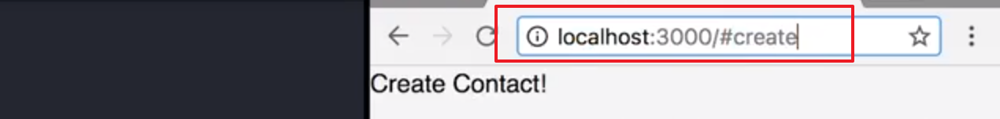

现在，当我们点击后退按钮时会发生什么？

有些不对劲（并没有重新显示 ListContacts 组件），让我们来聊聊这个问题。

你可能也用过这样的 Web 应用，它的后退键像刚才那样不起作用，这是不好的，因为后退键是 Web 的一个基本功能，当用户点击后退按钮时，他们希望能返回之前的页面，所以仅仅使用组件状态还是会有点问题。

因此，我们创建了 **React Router 它能使用户界面和 URL 保持同步。它能满足用户对页面、链接以及 URL 的所有期待。**


[这是本视频中所做更改的 commit。](https://github.com/udacity/reactnd-contacts-complete/commit/23a6a4dde977d7c18a3054a7b0b65f4fb4aad2ea)

---

### 动态路由总结

在这部分添加的代码中，我们尝试使用状态来控制向用户显示什么内容。但是当我们使用后退按钮时，我们遇到了问题。

现在，我们改为使用 React Router 来管理应用的屏幕。


## 5.3 BrowserRouter 组件

正如我们看到的，当用户点击浏览器中的“后退”按钮时，可能需要刷新页面才能看到该位置的适当内容。这对我们的用户来说体验并不佳！当我们更新位置时，我们可以使用 JavaScript 更新应用，这时候 React Router 就派上用场了。

### 安装 React Router

要在应用中使用 React Router，我们需要安装 [react-router-dom](https://www.npmjs.com/package/react-router-dom)。

```
npm install --save react-router-dom
```

我们看看具体操作流程！

---

在我们使用 React Router 之前，我们需要通过 NPM 安装它。

让我们返回命令行并输入 npm install --save react-router-dom，别忘了“-dom” 的部分，React Rouder 提供了两个不同的使用场景“react-router-native” 和 “react-router-dom”。

**我们使用浏览器环境，所以我们将使用 dom 包**。


[这是本视频中所做更改的 commit。](https://github.com/udacity/reactnd-contacts-complete/commit/3ac98594059c5c245c6032f1484ee0953331b43f)

---

### BrowserRouter

我们将查看的第一个组件是 BrowserRouter。

---

我们要讲的 React Router 的第一个组件是 BrowserRouter，BrowserRouter 将会**监听 URL 的变化，当 URL 变更时，它将使浏览器显示相应的页面**。

现在 React Router 已经安装好了，我们可以将其组件导入我们的应用中，我们第一个要修改的文件是 index.js，我们将在其中导入 BrowserRouter，我们到文件顶部，写入：
`improt {BrowserRouter} from 'react-router-dom'`

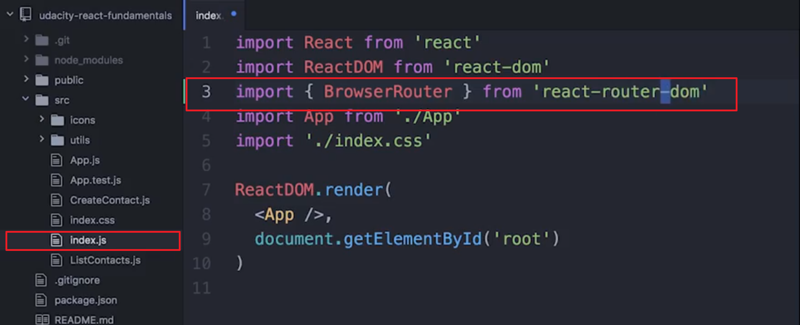

注意：别忘了“dom“，也别忘了花括号。确保这里输入正确的名称。

然后我们要做的是将整个应用包裹在 BrowserRouter 中：

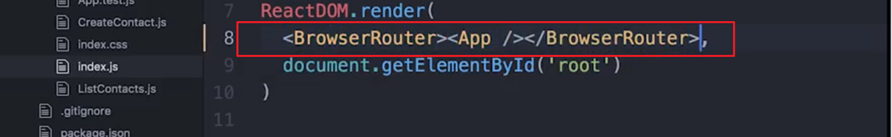

经过这些设置，路由器便能够与我们将导入的所有其他组件很好地协作，它还能监听 URL，确保当 URL 变更时通知其他组件。

这就是这个文件的作用，记得保存它。


[这是本视频中所做更改的 commit。](https://github.com/udacity/reactnd-contacts-complete/commit/544d6aff26d6e35b40bd17a633cf7c21c5eb4969)

---

**React Router 的好处是一切都是组件。**这样使用起来很方便，并且代码阅读起来也更轻松。我们看看 BrowserRouter 的代码原理。

以下是直接摘自 React Router 仓库的代码。

```react
class BrowserRouter extends React.Component {
  static propTypes = {
    basename: PropTypes.string,
    forceRefresh: PropTypes.bool,
    getUserConfirmation: PropTypes.func,
    keyLength: PropTypes.number,
    children: PropTypes.node
  }

  history = createHistory(this.props)

  render() {
    return <Router history={this.history} children={this.props.children}  />
  }
}
```

当你使用 `BrowserRouter` 时，其实真正的是在渲染 `Router` 组件并将向其传递 `history` 属性。等等，什么是 `history`? `history` 来自 [history](https://github.com/ReactTraining/history) 库（也是由 React Training 构建的）。**该库的整个目标是抽象化不同环境中的区别，并提供最少的 API 来使你管理历史记录堆、导航、确认导航，并在会话之间保持状态。**

简而言之，当你使用 `BrowserRouter` 时，你是在创建 `history` 对象，该对象将监听 URL 中的变化，并使你的应用知道这些变化。

##### ‘确保你已经完成必要的步骤。请核对并勾选以下每步：

Task List

- 我已安装 `react-router-dom` 软件包
- 我已在 `src/index.js` 中导入 `BrowserRouter`
- 我现在正在 `src/index.js` 中渲染 `<BrowserRouter><App /></BrowserRouter>`

### `BrowserRouter` 组件总结

总之，要使 React Router 正常工作，你需要**将整个应用封装在 `BrowserRouter` 组件中**，此外，`BrowserRouter`还会**封装 history 库，使你的应用能够知道 URL 中的变化**。

### 深入研究

- [history](https://github.com/reacttraining/history)


## 5.4 Link 组件

react-router 的 Link 组件非常重要，它**使你的用户能够在应用中进行导航**。

当用户点击 Link 组件时，它会通知 BrowserRouter 使它更新 URL：

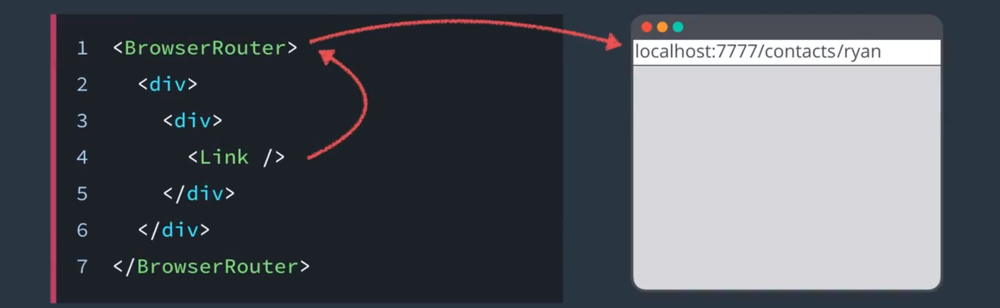

它还具备很好的可访问性，如果你使用键盘在应用中导航，它仍然可以正常工作，并且右键打开新窗口的功能也依然有用。

这些组件满足了用户对 Web 链接的所有期望。

---

现在我们的 BrowserRouter 组件包裹着整个应用，并且**监听着地址栏的变化**。

让我们来更新列表页面的链接，那么在 listContacts 中，你应该还记得，我们有一个导航到创建联系人页面的链接：

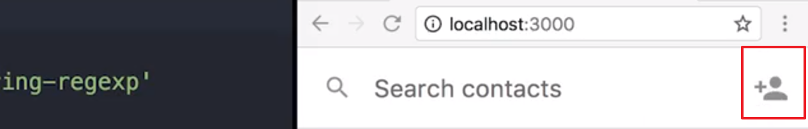

那么我们从 'react-router-dom' 导入 Link：

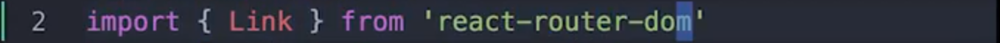

然后到我们之前创建链接的地方，将它更改为一个 Link 组件，Link 组件实际上仍然会渲染出 a 标签。

我们不需要 href，而是需要一个 to 属性，让我们使用一些真实的 URL 我们在这里写入 '/create'。React Router 会为我们执行 onClick 的工作，所以我们不再需要它了。我们直接删除这行并保存文件：

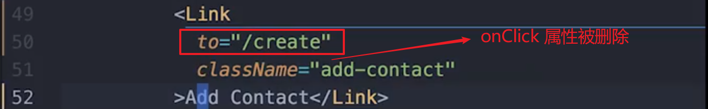

我们转到应用中，点击添加联系人按钮，可以注意到 URL 更新为“/create”，除此之外什么都没有发生：

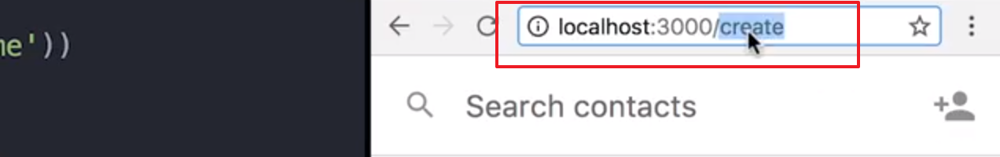

因为我们还未进行其他所需的设置，但是现在我们有了 BrowserRouter 有了 Link，当我们点击 Link 组件时，它会更新浏览器的 URL。

[这是本视频中所做更改的 commit。](https://github.com/udacity/reactnd-contacts-complete/commit/4fa3926892f6292fe562902ca1b1e3c9d840f27a)

---

正如你看到的，`Link` 是提供声明式、可访问的应用导航的简单方式。**通过向 `Link` 组件传递 `to` 属性，可以告诉应用要路由到哪个部分**。

> 我对路由有了一个想法，路由是你通过在浏览器地址栏中输入 URL，路由器会根据 URL 来将你的页面跳转到相应的地方的过程。

```react
<Link to="/about">About</Link>
```

如果你对网络上的路由熟悉，那么你将知道**链接有时候需要稍微复杂一点，而不仅仅只是个字符串**。例如，可以传递**查询参数**或**链接到页面的特定部分**。如果要将状态**传递给新的路由**，该怎么办？要考虑这些情形，你可以向 `Link`的 `to` 属性传递对象，而不是字符串，如下所示：

```react
<Link to={{
  pathname: '/courses',
  search: '?sort=name',
  hash: '#the-hash',
  state: { fromDashboard: true }
}}>
  Courses
</Link>
```

你不需要时刻使用该功能，但是有必要知道存在这一功能。要详细了解 `Link`，请参阅[官方文档](https://reacttraining.com/react-router/web/api/Link)。

#### 练习题

在为应用路由创建锚点时，假设我们想要在 DOM 中出现 `<a href="/members" class="members">成员</a>`。如何使用 React Router 的 `<Link>` 组件编写代码？

- `<Link to="/members" class="members">Members</Link>`
- `<a href="/members" class="members">Members</a>`
- `<Link to="/members" className="members">Members</Link>`
  - `<Link>` 的属性将传递到 React Router 创建的锚点。借助 JSX，这是简化浏览应用的很好方式。 
- `<Link to="/members" className="members" linkText="Members" />`


### Link 总结

React Router 提供了一个 `Link` 组件，**使你能够添加声明式、可访问的应用导航功能**。你将在锚点标记 (`a`) 中使用它，就像通常使用的那样。React Router 的 `<Link>` 组件是让用户能够导航应用的很好方式。例如，向链接传递 `to` 属性可以将用户指向绝对路径（例如 `/about`）：

```react
<Link to="/about">About</Link>
```

因为 `<Link>` 组件会渲染成拥有相应的 `href` 的锚点标签 (`<a>`)，因此，它的行为和网络上的普通链接的行为一样。

### 课外资料

- [Link](https://reacttraining.com/react-router/web/api/Link) React Training
- [源代码](https://github.com/ReactTraining/react-router/blob/master/packages/react-router-dom/modules/Link.js)


## 5.5 Route 组件

好的，我们需要的最后一个组件叫做 Route。

**Route 接受一个路径，将会匹配（也可能不匹配）当前的 URL，如果路径匹配 URL，则 Route 会渲染一些 UI，不匹配则不会渲染。**就像我们编写的代码，通过检查组件的状态来决定要渲染哪个页面，Route 也为我们做同样的事，只是**它检查的不是组件状态而是 URL**。这意味着什么呢？

这意味着现在回退按钮可以正常工作了。

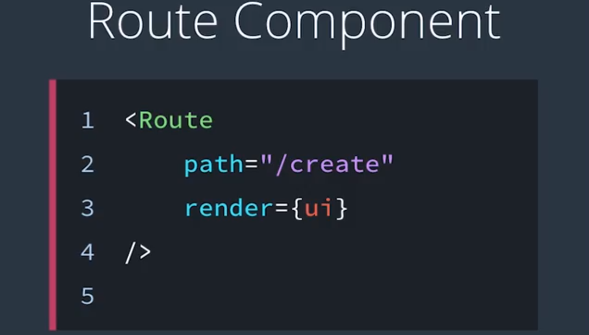

---

我们需要做的第三件事也是最后一件事是让 React Router 为我们管理 URL 和 UI。

我们回到 App.js 文件然后从 react-router-dom 导入一个叫做 Route 的东西：

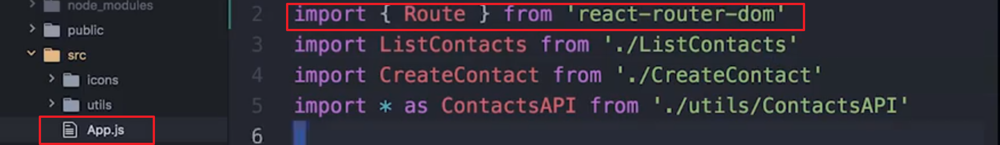

然后我们到下面，就是在我们之前检查状态以确定该渲染什么，我们在这里渲染一个 Route，一个路径为"/"，并给它一个 render 属性，这个 render 属性将接受一个函数，然后我们将这个 ListContacts 移到函数体内，删掉多余的部分：

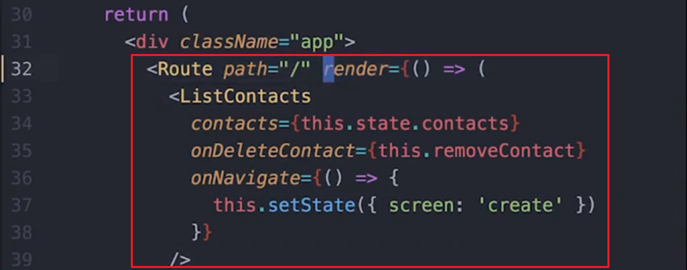

好的，现在我们有 Route 路径为 / ，然后这是当路径匹配 URL 时，我们想让 Route 渲染的东西（位于 render 函数体内的 JSX）。

接下来我们对 CreateContacts 进行相同的设置，我们同样设置 Route 但是设置 Route 的路径为 "/create" ，我们不需要在这里使用 render 而是使用 component，然后写入 CreateContact：

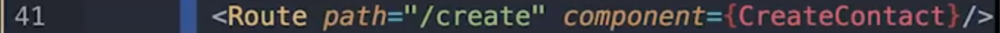

这是配置 Route 的另一种方式，你可以说：“嗨，帮我渲染这个组件”。

> 当你不需要向组件传递一些 props 时，可以使用 component 属性，相反就得使用 render 属性。

在上面，我们想**向 ListContacts 传递一些属性**，我们使用这个 render 属性，在下面，我们说“嗨，这里有一个组件，在此路径匹配时渲染它”。

所以当 Route 路径匹配此 URL 时，它会为我们渲染相应的页面，我在这里撤销一些操作。它基本上就是这样的工作。它说“好的，如果 URL 为 /create 则渲染这个”。

接下来我们保存一下，来看看它会渲染哪个页面。我们位于 /Create，我们有这两个 Route，我认为会渲染 CreateContacts，但是它们都渲染了：

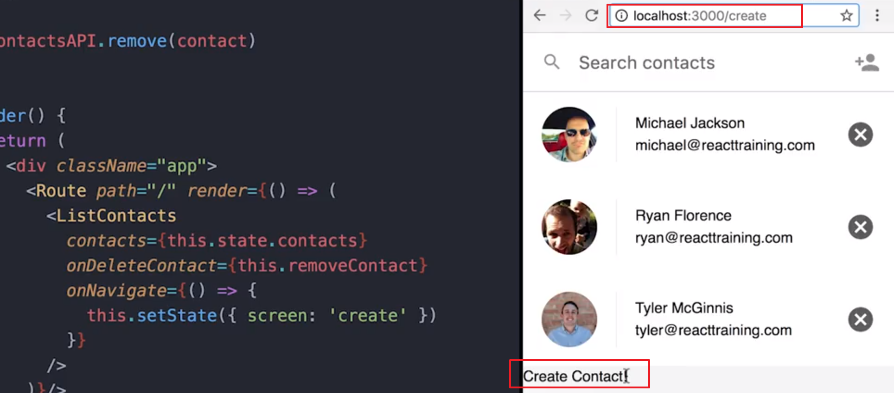

所以，这两个 Route 既不知道也不关心彼此，它们都匹配条件，所以它们都渲染了。

上面 Route 的 path 是 "/"，它部分匹配，因为我们的 URL 中有一个 "/"，但是我们不想让它渲染，**除非是完全匹配此路径**。所以我们可以完全地（exactly）匹配到这个路径，我们写一个 **exact** 属性到 Route 组件中，放到 path 的前面：

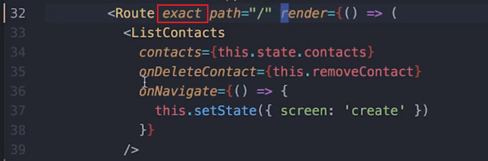

保存后，就不会再渲染列表了，因为我们没有完全匹配路径 / ，便只能看到 CreateContact 了。

这就是完全匹配路径（指添加了 exact 属性的 Route 组件）和一般匹配路径的区别，即一个是完全匹配，一个是部分匹配。

接下来我们可以删掉应用状态中的 screen 了，也不再需要 ListContacts 组件中的 onNavigate 属性，直接将它们全部删掉。

React Router 值得注意的一点是，它不需要你对应用有太多的更改，便可以引入这些 Route 来同步 UI 与 URL。 

 

## 5.6 完成通讯录表格

### 创建通讯录表格

目前，创建通讯录的页面是空的！我们在该页面上构建一个表单，以便开始添加自定义通讯录。

> #### ⚠️ 必需的文件 ⚠️
>
> 在这门课程的开始阶段，我们给了你两个选择：克隆我们的起始项目或使用 [create-react-app](https://github.com/facebookincubator/create-react-app) 从头开始。如果你尚未添加该项目，则对于下面的视频，你需要 [ImageInput.js 文件](https://github.com/udacity/reactnd-contacts-complete/blob/master/src/ImageInput.js)。

ImageInput 组件是自定义 `<input>`，该组件会动态地读取图片文件并且在将图片当做数据 URL 提交到服务器之前重新调整其大小，它还会显示图片预览。我们选择直接将该组件提供给你，而不是让你来构建，因为它包含了与网络文件和图片相关的功能，而这些功能对这门课程来说并不重要。如果你感兴趣的话，可以阅读相关代码，但并不是必修要求。

---

接下来我们要向 CreateContact 组件添加一些内容。我们希望在这里能有一个表格，以填入联系人的名和姓并上传头像。

在 CreateContact 组件中做的第一件事是在顶部添加一个返回连接，类名为 close-create-contact，不要忘记 to 属性，我们要使用 to 来回到主页面：

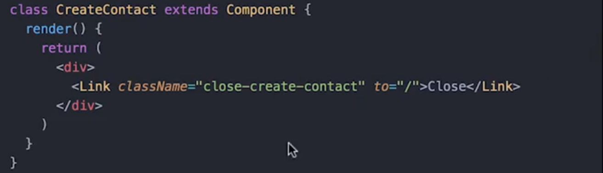

现在，让我们来添加表单，我们给它一个类名让它容易区分，里面有一个 ImageInput 的组件，可以让我们上传头像图片。然后是添加输入名字和邮件的表单控件和提交按钮：

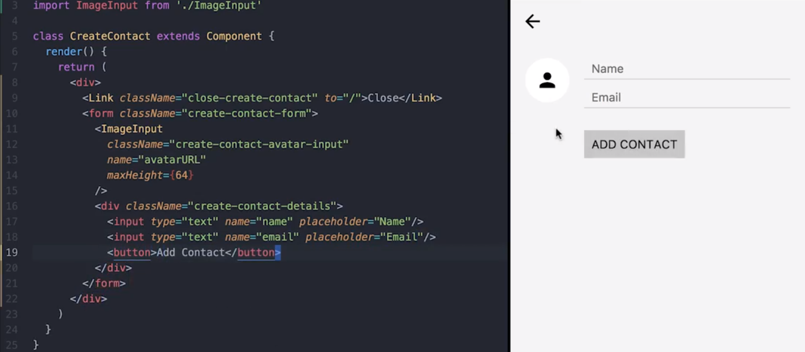

 

[这是本视频中所做更改的 commit。](https://github.com/udacity/reactnd-contacts-complete/commit/09d3d6da0fa0e2c40c95c66d99d0a2d31323ae06)

### 序列化表格数据

现在，我们的表格将**序列化**用户输入的值（即 `name` 和 `email`），将它们当做查询字符串添加到 URL 中。我们可以添加**额外的功能**，**让应用自己序列化这些表格字段**。毕竟，我们希望应用能够最终自己创建通讯录并将其保存到状态中。

为了实现这一点，我们将使用 [form-serialize](https://www.npmjs.com/package/form-serialize) 包**将此信息当做普通的 JavaScript 对象输出**给应用使用。

```
npm install --save form-serialize
```

我们看看具体操作流程！

---

那么，当我们提交表单后会发生什么？（在还没有使用 form-serialize 让应用自己序列化提交表格之前）

页面重新加载，URL 中有查询参数 avatarURL 有人名和电子邮箱：

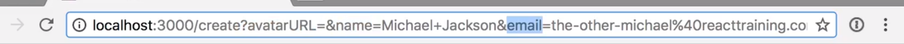

**表单在浏览器本地的工作方式**是，它们将**抓取这些字段的名称，并将其中的值序列化到 URL 中**。

我们想做同样的事，但是是通过使用 JavaScript，所以我们将序列化表格，然后调出应用说“hey，我们想创建这个联系人”，然后应用将负责保存联系人并将它添加到我们的状态中。

此表单的作用就是调出应用，但是**表单提交后我们不让浏览器接管它，而是由我们自己来控制**。

我们创建一个名为 handleSubmit 的**处理程序**，它将在此接受一个事件，我们定义为 e.preventDefault()，这样浏览器就不会再为我们提交表单了：

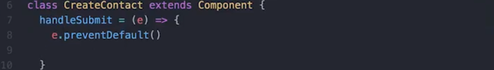

然后我们可以自己进行序列化，我们将使用一个叫做 form-serialize 的库， 我们在顶部引入它：


它做的事情和浏览器使用 URL 所做的一样，但不是**将其序列化为字符串并重新加载页面（浏览器默认表单提交事件）**，而是将其**序列化为一个对象**：

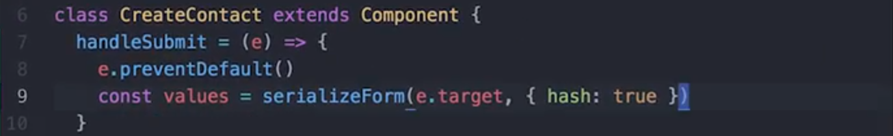

> 这个函数是绑定在 form 的 onSubmit 事件上的，当 button 被点击将会触发表单的提交事件从而执行 handleSubmit 处理程序，所以这里 e.target 是 form 本身。
>
> serializeForm 会跳过这里的表单内的所有输入，查看它们的 name，然后提取值并返回我们一个对象。
>
> serializeForm 的第二参数是表示会返回给我们一个对象。

现在我们有了这些输入值，对于这个表单联系人而言**它的工作已经完成了**。我们只需让它调用并渲染它的东西。

所以，我们通过从父组件那里传过来的方法 onCreactContact 来将这些数据发送到父组件。并且我们可以给它加一层保障，确保渲染它的人先向我们传递一些东西：

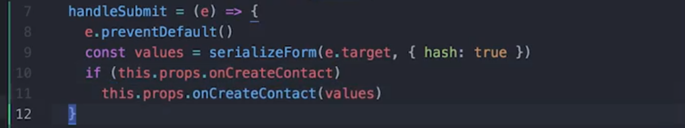


[这是本视频中所做更改的 commit。](https://github.com/udacity/reactnd-contacts-complete/commit/554bab12367719b1526900ea27b8bb60237aba0d)

---

### 使用新的通讯录更新服务器

我们创建了通讯录表格。我们序列化了数据并将其传递给父组件。为了拥有一个功能完整的应用，我们需要将通讯录保存到服务器上。

---

回到 App 组件，然后将 onCreateContact 属性传递给 CreateContact。

这里我们只是将组件交给 React Router，它会在渲染时为我们创建组件。但是当我们列出联系人时，我们使用 render 方法作为替代，这让我们能够掌控并且使我们可以将一些属性传递给组件。所以这里我们也将 component 替换为 render，现在由我们通过 render 方法渲染组件，然后传递 onCreateContact 属性：

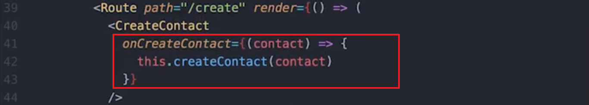

> 这里为什么需要将发送的函数放在一个箭头函数内？
>
> 我认为是 this 的指向问题，如果直接使用 this.createContact，则其 this 在调用时会指向全局。为了避免这个问题，我们需要在定义这个函数时，将其 this 指向 App 这个组件。

然后我们在上面创建方法：createContact，并在这里放入 contact，我们前往 contactsAPI 调用 create 并在此传递联系人，这会向我们返回一个 Promise 对象，并从服务器向我们发送联系人。我们将它放入状态中，用来把联系人添加到列表中。我们将从这个返回一个键为 contacts 的对象，然后我们获取 state.contacts 并且通过 concat 连接当前的 contact，然后 concat 会返回一个新的数组，而我们的列表中将有一名新人员：

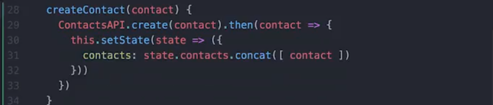

在创建联系人之后，我们还有最后一件事要做，我们想返回这个 URL 地址，直接用 /，从而让我们再次列出联系人，看看此人在不在其中。:heart_eyes_cat:

我们要从 React Router 中引入这个叫做 history 的属性，然后在后面写下 `history.push('/')`：

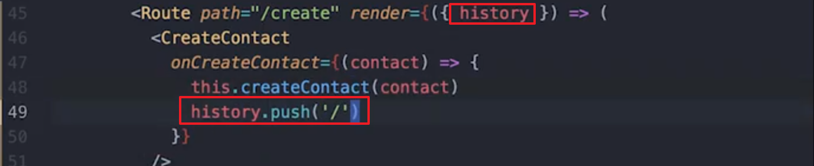

我们将会创建联系人，然后返回到列表页面，应该就会看到新人员出现在列表中。

> 这里注意 render 属性传入的回调参数中是 `{ history }` ，使用了对象解构的方式给参数 history 传值

[这是本视频中所做更改的 commit。](https://github.com/udacity/reactnd-contacts-complete/commit/6ea0a9abe23c06465447bc2b0366e6c794eaefbf)


