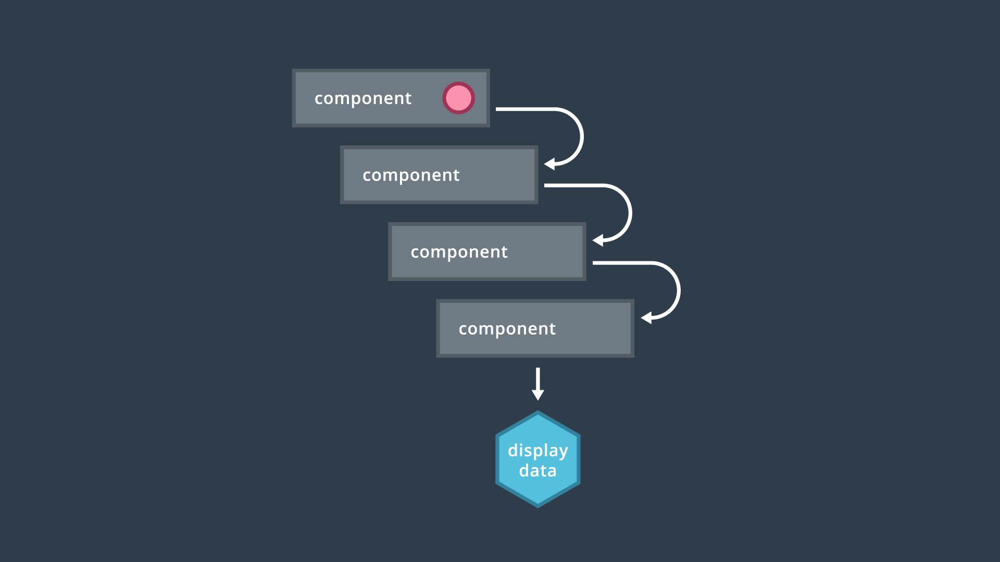
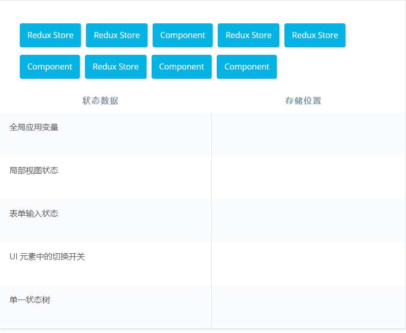
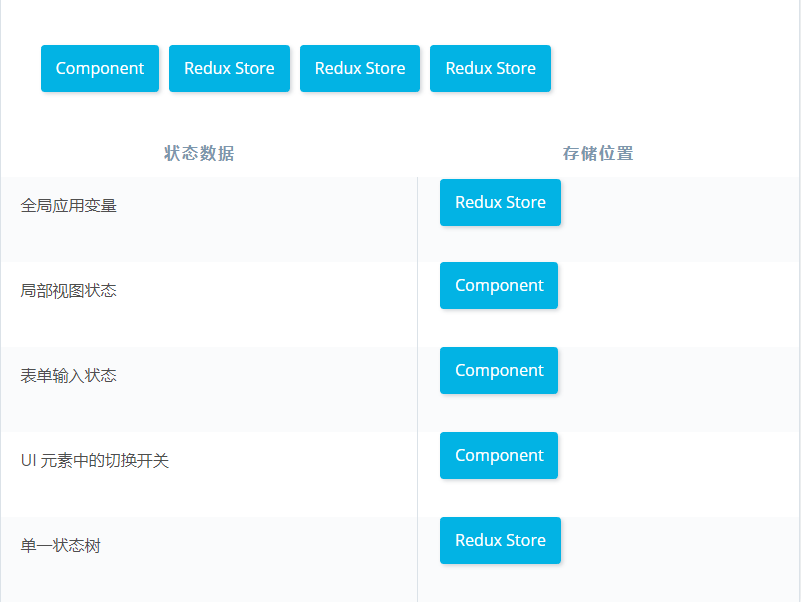
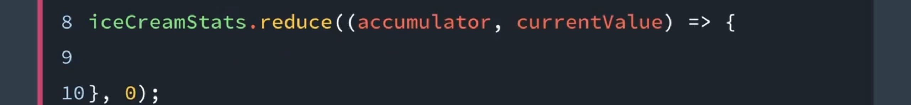
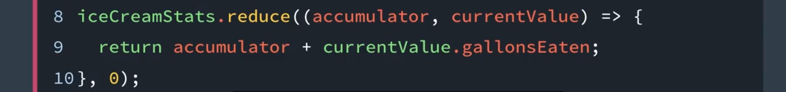
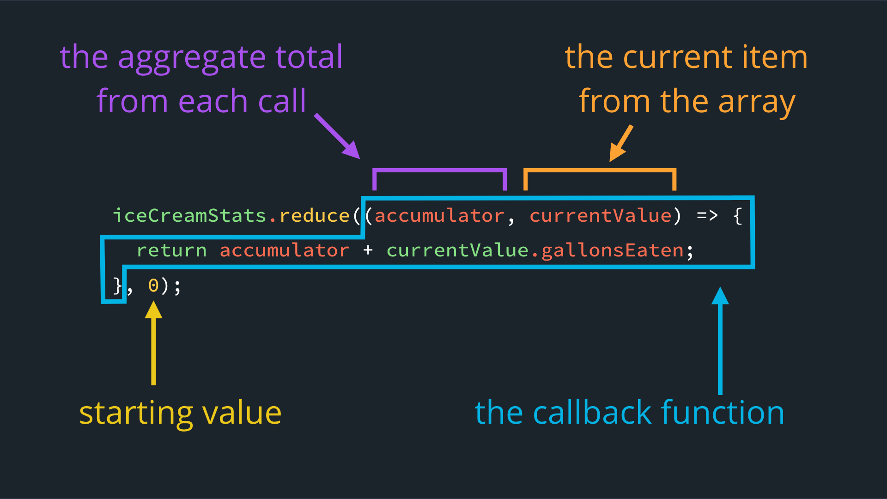

# 1. 为何要使用 Redux 

> 你会了解到 Redux 强大之处，学习 Redux 如何实现单一数据源，怎样使应用具备可预测性，以及 Redux 用了哪些 JavaScript 方法来影响状态。

[TOC]

---

## 1.1 简介

Redux 是一个非常强大的工具，用于管理应用内的状态。

在本课中，你不仅将学习如何使用 Redux API 使你的**应用程序状态更加可预测**，你还会学习非常有价值的函数式编程主题，这将使你成为一个更好的开发者。

让我们首先来看看，什么时候你应该在 React 应用中使用 Redux 和使用 Redux 会带来什么好处。然后我们将深入讲解如何在 React 中使用 Redux。


### 课程图

欢迎！这门课程介绍的是 Redux 库。下面将简要概述这门课程的结构：

- **第 1 节课** - 介绍使用 Redux 的优势
- **第 2 节课** - 详细讲解 Redux 的核心方法：action、reducer 和 store
- **第 3 节课** - 通过 `react-redux` 连接 React 和 Redux
- **第 4 节课** - 在 Redux 中创建基本模式，例如 reducer 组合和标准化模式
- **第 5 节课** - 介绍使用 Redux 的 React 应用中的中间件和其他增强功能


### 课程项目

在这门课程中，你将跟着我们一起创建一个每日餐饮跟踪应用 [Udacimeals](https://github.com/udacity/reactnd-udacimeals-complete)。你首先将构建 Redux 循环来管理应用的状态，然后将其连接到 React 以处理应用的整个 UI！

### 跟着讲师操作

欢迎在 GitHub 上关注我们！

- [在 GitHub 上关注 Andrew](https://github.com/hbkwong)


## 1.2 什么是 Redux / 它为何会存在？

**每当你学习一个新工具时，首先要了解该工具为什么存在**，所以我们在这个视频中要回答的问题是为什么需要 Redux？

你可以想想你在职业生涯中遇到的任何 bug，这些 bug 都很可能源于**应用中一些状态或数据的管理不当**，因为状态管理不当是导致 bug 产生的主要原因。如果我们能找到一个更好的方式去管理应用状态，那么理论上，我们就能减少应用的 bug 数量。

**Redux 的目标就是使应用中的状态管理更加可预测**。如果你上了我们的 React 基础课程，可能会有点困惑，因为我们说 react 的一个优势也是状态管理。所以，如果 React 已经很擅长状态管理了，那为什么还需要 Redux 呢？

原因主要有两个：

- 第一个是共享状态，要是**两个组件依赖于相同的状态**该怎么办？在基础课程中，我们教你将此状态提升至最近的父组件，这种策略在大部分时间都是有效的。但是，要是最接近父组件的是该组件下的第 3 级或第 4 级组件呢？那么你需要非常痛苦地将这些数据通过各级组件的 props 向下传递 3 或 4 层。这些组件不需要数据，但又不得不通过它们将数据传递给子组件。相较于通过这些中间组件传递数据，你可以直接告诉 Redux 哪些组件需要哪些数据，Redux 会自动管理其余细节。

  - > 本来我不太明白为什么会有最接近父组件的是该组件下的第 3 级或第 4 级，因为每一个组件必然会有一个父组件，不会存在什么第 3 级或第 4 级的情况。但这第二天来重新看这个问题，我发现了为什么。
    >
    > 如果有**两个组件依赖于相同的状态**，分别位于不同的组件下，并且要往上 3、4 级才会有相同的父组件，这种情况下想要将状态提升到相同的组件，也就只能是往上 3、4 级的那个父组件了。
    >
    > 这个问题为什么会产生，是因为如果只是一个子组件的状态，这样只需要把数据放到其本身就 OK 了。可是人家的先决条件是**两个组件依赖于相同的状态。**所以我在思考的时候，如果发现不到问题，可以多去读读人家的文章的原话，把问题真正的了解清楚，这样可能会更快的解决问题。

- 第二个优势是**缓存**，从本质上来说 **Redux 可以更轻松地缓存 API 调用或昂贵的操作，这会使应用拥有更好的用户体验**。虽然创建一个 React 应用不一定需要 Redux，但它的确会**让一些事情变得更加容易**。


### Redux 专门用于管理状态

Redux 官方文档对 Redux 的定义如下：

> 一个面向 JavaScript 应用的**可预测状态容器**。

你可能会问，“如果 React 已经在为我的应用管理前端状态，为何还需要 Redux？”

使用 Redux 的主要优势之一是它可以帮你处理应用的共享状态。如果两个组件需要访问同一状态，该怎么办？这种两个组件同时需要访问同一状态的现象称为“共享状态”。你可以将该状态提升到附近的父组件，但是如果该父组件在组件树中向上好几个组件的位置，那么将状态当做属性向下一个一个地传递，这项工作很快就会变得乏味。此外，在该父组件和该子组件之间的组件甚至根本不需要访问该状态！

在构建 web 应用时，**Redux 不仅使我们能够以有条理的方式 *存储* 数据，而且使我们能够在应用的任何位置快速 *获取* 该数据。只需告诉 Redux 到底哪个组件需要哪个数据，它就会为你处理后续一切工作！**

**借助 Redux，你可以控制状态改变的时间、原因和方式。**

### Store：单一数据源

Redux 的基本原则之一是存在单一数据源：Store。也就是说，Store 包括应用的全局状态，全存储在一个对象树中。

只有单个状态树，对于应用的很多方面都有好处。假设在构建应用时尝试实现撤消/重做功能。如果所有状态都存储在一个树（单一数据源）中，则实现起来比数据分散在多个组件中简单多了。状态集中到一个位置后，调试和检测过程也会简单很多！

为了保持这种单一数据源特性，Redux 制定了几条规则，确保一切尽在掌控。规则一：Redux 应用中的状态是**只读的**，即 Redux 状态 *不可变*。例如，**React 组件不能直接写入 Redux 状态，而是发出 *intent* 来更新状态。**

实际上，只有叫做 `reducer` 的纯函数能够更改状态。暂时别担心这些概念，我们会在下节课深入讲解的！

#### 练习题

关于 Redux 的哪些描述是正确的？请选中所有适用项：

- 所有 React 应用都需要 Redux
- Redux 可以用于其他视图库 :v:
- Redux 实现的是单个状态树，使调试过程更简单 :v:
  - Redux 的确会实现单个状态树。将所有数据放在一个位置并通过一个界面进行维护后，调试和处理数据变得更加简单。 
- 视图和网络回调应该直接写入 Redux 状态
- Redux 状态通常保存在多个 Store 中


随着单页面应用变得越来越复杂，正确地管理状态这一需求更加重要。例如，除了管理表格状态（例如《React 基础知识》课程中的 Contacts 应用）等数据外，应用可能还需要管理：

- 服务器响应
- 缓存的数据（例如用户）
- 尚未保存到服务器上的本地数据

除此之外，UI 状态也越来越复杂。同一应用可能还需要跟踪：	

- 当前路由
- 当前选择的标签页
- 页码控件

Redux 便因此而生，它专门用于管理上述所有这些内容。创建者 Dan Abramov 在 2015 年根据 [Flux](https://facebook.github.io/flux/docs/overview.html) 架构创建了 Redux，并从 [Elm 编程语言](https://github.com/evancz/elm-architecture-tutorial/)中汲取了经验。从那以后，Redux 变得越来越受欢迎，每月的下载量达到数百万。

### 总结

Redux 是一个 JavaScript 库，用于管理应用的前端状态。Redux 并非 React 应用的必须条件，但是随着网络应用的复杂性越来越高，状态管理不当可能会导致 bug。**Redux 应用中的全局状态存储在单一数据源 store 中。因为状态的更新受到严格控制，使得 Redux 非常具有可预测性。**实际上，[开发人员喜欢 Redux](https://stackshare.io/reduxjs) 的主要原因之一就是它的**可预测性**。我们来看看背后的原因！

#### 更多资料

- Redux 文档中的 [动机](https://cn.redux.js.org/docs/introduction/Motivation.html) / [英](https://redux.js.org/introduction/motivation) 部分
- [Redux 的三大原则](https://cn.redux.js.org/docs/introduction/ThreePrinciples.html) / [英](https://redux.js.org/introduction/three-principles)
- [GitHub 上的 Redux](https://github.com/reactjs/redux)
- [npm 上的 Redux](https://www.npmjs.com/package/redux)


## 1.3 Redux 如何改善预测性

### 可预测性

Redux 以多种方式提高了 Web 应用程序的可预测性。 我们从上一节（**什么是Redux /它为何会存在？**）中看到，数据被合并到一个集中的位置：**store**。 组件不能直接修改 store 中的数据；相反，他们必须请求访问这些数据。 此外，store 如何更新也有严格的规定。

因此，你总是知道状态来自哪里（**store**），以及允许哪一个唯一实体触发更新（**action**）到该状态。

另一种看待 Redux 的方式是它提供了一个严格的 [单向数据流](https://cn.redux.js.org/docs/basics/DataFlow.html) / [英](http://redux.js.org/docs/basics/DataFlow.html#data-flow)。 我们将在下一课中深入探讨这些独特的元素，但是主要原则与 React 的主要原则并没有太大的区别。

### 单向数据流概述

回顾 React 的核心功能之一，单向数据流：

[*数据从父组件向下流到子组件。数据更新被发送到父组件，父组件进行实际的更新。*](https://classroom.udacity.com/nanodegrees/nd019-cn/parts/cb5f29f8-f80b-4524-b29b-5f3dcfe7527e/modules/c278315d-f6bd-4108-a4a6-139991a50314/lessons/b17ccf2f-3f89-4c38-91ae-bd67c083bba2/concepts/b0e2a51d-6ad3-4d28-84a3-cc65b639dab1#)

在上图中，数据存储在父组件中。如果子组件也需要使用该数据，该数据可以向下传递给子组件。任何更新都向上发送给父组件，由父组件做出更新，更新后的数据再向下发送给子组件。

React 的单向数据流功能很强大，但是当处理深度嵌套的组件结构时，就会出现问题：

[*例如这个嵌套组件结构，其中属性必须经由很多组件向下传递，才能显示出来。*](https://classroom.udacity.com/nanodegrees/nd019-cn/parts/cb5f29f8-f80b-4524-b29b-5f3dcfe7527e/modules/c278315d-f6bd-4108-a4a6-139991a50314/lessons/b17ccf2f-3f89-4c38-91ae-bd67c083bba2/concepts/b0e2a51d-6ad3-4d28-84a3-cc65b639dab1#)

对于深度嵌套的组件结构，数据必须途经 *所有* 中间组件才能向下传递到目标对象！

---

假设我们有一堆深入嵌套的组件，应用最顶层的组件拥有所有数据，但是有一些数据被最底层的这个组件所显示，我们就不得不将数据一层又一层的通过组件向下传递，以便最底层的组件能够显示它：


在这个示例中，中间只有两个组件，但要获取所有父级组件的 props 并将它们传递给子组件也很麻烦。

Redux 通过拥有一个与组件相分离的 store 使状态管理变得更加简单，应用的数据或状态都保存在 store 中，单个组件可以直接从 store 中访问它们所需的数据：


#### 练习题

以下哪些关于 store 的描述是正确的？请选中所有适用项。

- store 使用单向数据流 :star:
- store 包含所有/大部分应用数据:star:
- store 是普通的 JavaScript 数组 
- store 制定了严格的 store 更新规则 :star:


### 总结

Redux 以多种方式提高可预测性：

- 它将大多数数据整合到一个位置
- 组件必须请求访问数据
- store 中的数据流向一个方向
- store 更新有着严格的规则

Redux 秉承了 React 采用的 **单一数据流结构**。我们将在下一课中，深入讲解这部分内容！

### 更多资料

- Redux 文档的 [数据流](https://cn.redux.js.org/docs/basics/DataFlow.html) / [英](http://redux.js.org/docs/basics/DataFlow.html#data-flow) 部分

---

## 1.4 Redux Store 和组件状态

你可能记得 Redux 可以通过对应用中多数状态提供单一数据源的方式来提高状态管理和应用的可预测性。你应该还记得，我们可以对状态的更新方式作出严格的限制，你可能注意到了我总是说 Redux 处理着应用中的大多数状态，这是 React 社区的热门话题，但是我想跟你分享我对大多数状态的定义。

**当你将 Redux 添加到 React 应用时，这并不意味着你不能再使用组件状态，组件状态是你按照惯例使用 this.setState 更新的任何状态**。这是 Redux 刚推出时人们对它的自然反应，但 Redux 并不会管理你应用中的所有状态，**如果你强迫 Redux 管理所有应用状态，则只会使事情变得更复杂**。对于 Redux store 中应用保存什么状态，以及 React 组件中应该保存什么状态并没有明确的规定。但是 Redux 的创造者 Dan Avonmouth 本人有一条非常有用的建议：

- 将 React **用于对应用全局没有重要影响且不会以复杂方式发生变化的短时间状态**。例如，一些 UI 元素或表单 input 的状态中的 toggle。
- 而将 Redux 用于全局影响且以复杂方式发生变化的状态。

这和我们之前所讲的是一致的，**Redux 擅长处理共享状态或 Dan 所说的全局状态，以及缓存。而 React 组件状态适用于其他所有情况。**

**store 代表的是单一数据源；它会存储应用的全局状态。** 

---

### 哪个状态？在何处？

Redux 是一个强大的 Web 应用状态容器，但是**并没有硬性规定所有状态都 *必须* 包含在一个 Redux store 中。实际上，也可以将 *某些* 数据存储在 (React) 组件状态中**。最终由你来决定哪种方式最适合你的应用，当然你也可以遵守一些常用的惯例：

#### Redux Store

通常，**如果状态是共享的，并且可在整个应用中访问，则应存储在 store 中**。示例包括：

- 缓存用户信息
- 电子邮件草稿

#### 组件状态

另一方面，如果涉及的是更加 “局部” 的数据，或者处理的状态不影响其他组件，则更适合使用组件的状态：

- 表格输入
- 当前标签页切换
- 下拉菜单的打开/关闭状态

无论选择哪种方式，都要确保它适合你和你的应用。正如 Dan Abramov 在 Redux 文档中所提到的：

> **没有固定的标准答案... 作为开发人员，你需要判断在你的应用中应使用哪些状态，以及状态应该储存在哪里。你需要权衡利弊，找到平衡。**

##### 练习题

请将以下状态与对应的存储位置相匹配：





### Redux 状态是只读的

另外要提的一点是，Redux store 中的状态是**只读的**，实际上，这只是 [Redux 的三大基本原则](https://github.com/reactjs/redux/blob/master/docs/introduction/ThreePrinciples.md#state-is-read-only) 之一。这样设计的好处是：

- 增强了可预测性和可靠性
- 避免产生副作用（下个部分将详细介绍！）
- 阻止外部文件修改 state
- **所有对 state 的改动都被集中于一个地方，并且被严格地依次触发**

更改 state 的唯一方式是派发相应的 *action*，以描述所需的更改。暂时不用担心这些概念；我们将在下个部分详细讲解！

### 总结

虽然 Redux 提供了单一数据源，但是完全可以在组件的内部状态中存储一些数据。对于 store 中的全局状态，Redux 对何时及如何更新状态制定了严格的限制条件。其中一个限制条件是只有**纯函数**可以更新 Redux 应用中的状态。我们来了解一下！

#### 更多资料

- [状态是只读的（State is Read-Only）](https://github.com/reactjs/redux/blob/master/docs/introduction/ThreePrinciples.md#state-is-read-only)
- [如何在 Redux 的 store 和 React 的状态之间做出选择？（How to choose between Redux's store and React's state?）](https://github.com/reactjs/redux/issues/1287)
- [状态管理（Organizing State）](http://redux.js.org/docs/faq/OrganizingState.html)


## 1.5 纯函数

在上一部分，我们提到了 redux 会依赖纯函数更改状态。那么什么是纯函数呢？我们又如何在应用中使用它们呢？

纯函数有三个特点：

- 第一，在传入相同参数的情况下，它们会返回唯一的相同的结果。这意味着即使你将此函数调用一百万次，它每次都会返回相同的值。
- 第二，纯函数只依赖于传递给它们的参数，它从不依赖数据库、DOM 或任何外部变量。纯函数的返回值仅取决于其输入值。
- 最后，纯函数不能够产生任何副作用，这意味着函数与外部世界没有任何交互，如发出网络请求或改变外部状态。

如果一个函数满足所有这三个要求，它就是一个纯函数（pure function）。如果有任意一个条件没有被满足，则为非纯函数（impure function）

说明一下，这是关于 redux 的课程，纯函数并非 redux 所独有，甚至并非 JavaScript 所独有，但它们确实有助于提高 redux 应用的可预测性。

---

### 什么是纯函数?

**纯函数** 是 Redux 应用中，更新状态的必要手段。纯函数的定义是:

1. 对于同一参数，返回同一结果
2. 完全取决于传入的参数
3. 不会产生副作用

我们来看一个纯函数 `square()` 的示例：

```javascript
// `square()` 是一个纯函数

const square = x => x * x;
```

`square()` 是一个纯函数，因为只要每次传入相同的参数，其输出的值都一样。结果不取决于任何其他值，我们可以肯定只会返回该结果，没有副作用（稍后将详细介绍这一概念！）。

另外，我们再看一个 *非纯函数* `calculateTip()` 的示例：

```javascript
// `calculateTip()` 是一个非纯函数

const tipPercentage = 0.15;

const calculateTip = cost => cost * tipPercentage;
```

`calculateTip()` 计算并返回了一个数值。但是，它取决于位于该函数 *外部* 的变量 (`tipPercentage`) 来生成该值。因为 `calculateTip()` 不符合纯函数的条件之一，所以是非纯函数。**我们可以通过把外部变量 `tipPercentage` 当做第二个参数传入该函数，将该函数转换为纯函数：**

```javascript
const calculateTip = (cost, tipPercentage = 0.15) => cost * tipPercentage;
```

---

我们来聊聊纯函数，特别是纯函数的特点。

通常来说纯函数有三个**特点**：

- 当给予相同参数时，它们总是返回相同结果
- 它们的执行不依赖于应用程序的当前状态
- 并且它们不会修改作用域外的变量

纯函数的一个很好的例子就是简单的 add 函数，此 add 函数接受两个数字，然后返回 X 加 Y：

```javascript
function add (x,y) {
  return x + y
}

add(1,3) // 4
add(1,3) // 4
...
// 无论调用多少次，只要传入的参数相同就一定返回相同的值。
```

看看这些特点，你会发现此 add 函数全部满足。我们再来看另一个例子。

假如说我们有一个变量叫做 friends，它将是一个数组：

```javascript
let friends = ['Ean','Mikenzi','Jake']
```

我们在这个数组中有三项，假设我们想要得到第一项，或者我们对此数组使用 `.slice` 方法：

```javascript
friends.slice(0,1) // 返回 ['Ean']
```

无论我们调用多少次，将总是会得到 Ean，因为 slice 没有修改原来的数组，所以它符合纯函数的所有标准。

 但是如果我们在这里不使用 slice，而是使用 splice：

```javascript
friends.splice(0,1) // 返回 ['Ean'] 
friends.splice(0,1) // 返回 ['Mikenzi'] 
friends.splice(0,1) // 返回 ['Jake'] 
```

你会注意到，当我们第一次用 0 和 1 调用它时，会得到 Ean，而第二次则会得到 Mikenzi，第三次会得到 Jake，所以 splice 不是纯函数，因为在给定相同参数的情况下，返回了不同结果。再来看一个例子。


```javascript
function square (n) {
  return n * n
}

square(2) // 返回 4
```

假如说我们有一个叫做 Square 的函数（如上），我们想做的是让它接收一个数字，然后返回数字乘以其本身，这里既是 n*n，当我们调用 square 传入 2，便会得到 4。

现在假设我们有一个包含很多数字的数组，我们称之为 nums，比如我们有 2、4、6、8，而我们需要一个数组，包含所有数字的平方值。这样做的一个方式是：

```javascript
let nums = [2,4,6,8]
function squareItems (arr) {
  for (let i =0; i < arr.length; i++){
    arr[i] = square(arr[i])
  }
  reture arr
}
```

假设我们有一个叫做 squareItems 的函数（如上），它将接受一个数组，然后循环这个数组，对于数组中的每项，它都将修改它自己变成这个项的平方。最后，我们将返回得到的数组。

所以，当我们调用 squareItems，转入 nums 数组， 你会注意到我们将得到平方后的所有数字。但是我们现在所要做的是如果看看原先的 nums 数组，会发现它被修改了：

```javascript
squareItems(nums) // 返回 [4, 16, 36, 64]
nums // 返回 [4, 16, 36, 64]
```

所以，squareItems 不是一个纯函数，**因为像我们的一个特点提到的，我们在当前作用域之外修改了状态。**

解决这一点的一个方式是，我们不再直接修改数组，而是**用一个变量来接受新的数组**。在此创建一个新函数，叫做 pureSquareItems，它将一个数组作为输入，但不直接修改数组中的每个项，而是调用 arr.map，然后传入我们在上面这里创建的 square 函数：

```javascript
function pureSquareItems (arr) {
  return arr.map(square)
} 

let newNums = [2,4,6,8]

pureSuqareItems(newNums) // 返回 [4,16,36,64]
newNums // 返回 [2,4,6,8]
...
```

当我们传入参数 newNums 调用函数 pureSuqareItems 后，newNums 没有发生变化。这说明 pureSquareItems 是一个纯函数。

---

> #### ⚠️ 变量声明 ⚠️
>
> 在上面的视频中，全局变量 `let friends` 被错误地创建了。 虽然结果在开发者控制台仍然有效，但正确的版本应该是：
>
> ```
> let friends = ['Ean', 'Mikenzi', 'Jake'];
> ```

### 没有副作用

纯函数的条件之一是不产生**副作用**。副作用是指函数对其外部世界产生影响，包括：

- 发出 HTTP 调用
- 改变外部状态
- 检索今天的日期
- `Math.random()`
- 向控制台输出消息
- 向数据库中添加数据

考考你对纯函数概念的理解！

#### 习题 1/2

以下哪些函数是纯函数？请选中所有适用项。

- Count();
- const add = (a, b) => (  :star:
  ​    a + b 
  );
  - 你很快就会发现，纯函数对 Redux 如何管理状态来说很关键。 
- Date.now();
- const addAndPrint = (a, b) => {
  ​    const sum = a + b;
  ​    console.log(`The sum is: ${sum}`);
  ​    return sum;
  };
- const double = array => { :star:
  ​    let doubledArray = [];
  ​    array.forEach(n => doubledArray.push(n * 2));
  ​    return doubledArray;
  };


#### 习题 2/2

以下关于纯函数描述，哪些是正确的？请选中所有适用项。

- 纯函数在生成输出内容的过程，不依赖于传入的参数之外的其他信息 :star:
- 每次即使传入相同的参数，纯函数也可能生成不同的输出值
- 纯函数不取决于外部状态 :star:
- 纯函数能够用于修改共享状态
- 纯函数应该修改被传入的原始参数


### 使用纯函数

纯函数是[函数式编程](https://medium.com/javascript-scene/master-the-javascript-interview-what-is-functional-programming-7f218c68b3a0)的核心概念。除了避免数据突变和副作用之外，**纯函数还与组件的概念非常契合**。

**首先，纯函数本质上就是模块化的，这使它更容易被测试**。由于当参数相同时，纯函数总是产⽣相同的结果，你不必担⼼应用其他部分的数据受到影响。在调试期间，这将给予明确定义的额外控制点。

此外，纯函数使代码更好维护。纯函数不会产生副作用。**这意味着你在重构应用时，纯函数不会对其外部内容产生任何不利影响。**

**尽管使⽤纯函数会为你的应⽤带来诸多好处，你仍然可以选择将纯函数与非纯函数一起使用。使用非纯函数并不一定意味着“糟糕的编程方式”。**例如，使用事件处理程序更新 DOM 的按钮就不适合使用纯函数，因为事件处理程序会*更新 DOM*（即产生副作用！）。

**使用纯函数可以帮助你提高代码质量，在构建应用时记住这一点将使你成为更优秀的程序员**。

### 总结

纯函数并不是 Redux（甚至 JavaScript）独有的，但是它们的确支持在应用中实现可预测性。在下节课，我们将深入学习叫做 **reducer** 的纯函数如何返回应用的新状态。Reducer 基于 Array 的 `reduce()` 方法，我们来了解下！

#### 更多资料

- [什么是纯函数？（What is a Pure Function?）](https://medium.com/javascript-scene/master-the-javascript-interview-what-is-a-pure-function-d1c076bec976)
- [什么是函数式编程？（What is Functional Programming?）](https://medium.com/javascript-scene/master-the-javascript-interview-what-is-functional-programming-7f218c68b3a0)
- [纯函数示例（The Case for Purity）](https://drboolean.gitbooks.io/mostly-adequate-guide/ch3.html#the-case-for-purity)

---

## 1.6 数组的 .reduce() 方法

在 React 基础课程中，我们讲了 React 是一个非常奇妙的库，因为它能够使用 JavaScript 语言，而不是创建自己的模板库，或自定义方式来迭代数据。而 Redux 也顺应了值使用 JavaScript 的潮流。

Redux 的一个主要组成部分是它使用称为 reducer 的特殊函数，我们很快会讲到 reducer，不过这些 reducer 函数的名称来自 JavaScript 的数组方法 reduce。reduce 是一个非常强大的方法，**它让你接收一批数据，然后将它计算成一个值**。那么你是否想了解一下 JavaScript 最强大的一个方法呢？

---

### Array 的 `.reduce()` 方法

[.reduce()](https://developer.mozilla.org/zh-CN/docs/Web/JavaScript/Reference/Global_Objects/Array/Reduce) 的**核心概念是传入大量数据，但只返回一个值**。`.reduce()` 是一个**高阶函数**，**这意味着它能将一个函数（比如回调函数）作为参数传入。**

> ### 💡 高阶函数 💡
>
> 我们在《React 基础知识》中见到的 `.map()` 和 `.filter()` 方法也是高阶函数！这两个函数都能**将回调函数作为第一个参数传入。**

为了了解 `.reduce()` 的强大功能，来看看下面这个 `iceCreamStats` 数组, 它表示每个小组成员吃掉的冰激凌加仑数。

```javascript
const iceCreamStats = [
  {
    name: 'Amanda',
    gallonsEaten: 3.8
  },
  {
    name: 'Geoff',
    gallonsEaten: 5.2
  },
  {
    name: 'Tyler',
    gallonsEaten: 1.9
  },
  {
    name: 'Richard',
    gallonsEaten: 7923
  }
];
```

如果想看冰激凌的总量，我们可以把总数加起来… 但这太没有挑战性了！我们希望将此数据 **reduce** (缩减) 为单个数字，而这正是 `.reduce()` 方法的作用！我们看看如何做到这一点！

---

要使用 reduce 方法，我们需要一组数据，由于冰淇淋是地球上最美妙的物质，我问了同事他们对冰淇淋的消费量，这里是收集的数据：


我想要吃掉的总加仑量，所以我想将这些计算成一个值或共同计算冰淇淋统计数据。

reduce 有两个参数：一个回调函数（callback function）和一个可选的起始值（starting-value）。由于我想获得吃掉的冰淇淋的总加仑数，我将起始值设为 0：


回调函数也有两个参数：累计值（accumulator）和从数组中传入的当前值（currentValue）：



第一次调用时，accumulator 将设为起始值，即为 0，当前值将是数组中的第一个值，在这里是一个对象。很好，现在重要的是从此函数返回一些东西，返回的东西将成为 accumulator 参数的值，对于此调用，我们将结合 accumulator 和 currentValues.gallonsEaten 属性，然后我们基本上就完成了：



callback 函数将对冰淇淋统计数组中的每一项调用并最终在完成时返回总结果。

---

这就是我们刚刚使用的 `.reduce()` 代码：

```javascript
iceCreamStats.reduce( (accumulator, currentValue) => {
  return accumulator + currentValue.gallonsEaten;
}, 0);
```

[*reduce 方法的注释图片。*](https://classroom.udacity.com/nanodegrees/nd019-cn/parts/cb5f29f8-f80b-4524-b29b-5f3dcfe7527e/modules/c278315d-f6bd-4108-a4a6-139991a50314/lessons/b17ccf2f-3f89-4c38-91ae-bd67c083bba2/concepts/06b63ac2-a6bf-4aaf-9122-78cc99fc7918#)

> reduce 方法的理解：
>
> 调用方法时传入的第二个参数为 accumulator 的初始值，每一次都可以利用 accumulator 和 currentValue 来进行一些操作和运算，然后返回一个值，这个值为下一次循环运算的 accumulator，下次循环时利用上一次返回的 accumulator 和 cuurentValue 又进行一些操作和运算，返回值。一直这样循环到数组的最后一项，然后返回一个值，这个值为数组调用 `.reduce`的返回值。

### Reduce 测验

现在轮到你来使用 `.reduce()` 来完成下面的练习了！

#### 练习：Just Reduce

```javascript
/* Using .reduce()
 *
 * Using the musicData array and .reduce():
 *   - Return the total number of sales
 *   - Store the returned data in a new 'totalAlbumSales' variable
 *
 * Notes:
 *   - Do not delete the 'musicData' variable
 *   - Do not alter any of the 'musicData' content
 *   - Do not format the sales number; leave it as a long string of digits
 */

const musicData = [
    { artist: 'Adele', name: '25', sales: 1731000 },
    { artist: 'Drake', name: 'Views', sales: 1608000 },
    { artist: 'Beyonce', name: 'Lemonade', sales: 1554000 },
    { artist: 'Chris Stapleton', name: 'Traveller', sales: 1085000 },
    { artist: 'Pentatonix', name: 'A Pentatonix Christmas', sales: 904000 },
    { artist: 'Original Broadway Cast Recording', name: 'Hamilton: An American Musical', sales: 820000 },
    { artist: 'Twenty One Pilots', name: 'Blurryface', sales: 738000 },
    { artist: 'Prince', name: 'The Very Best of Prince', sales: 668000 },
    { artist: 'Rihanna', name: 'Anti', sales: 603000 },
    { artist: 'Justin Bieber', name: 'Purpose', sales: 554000 }
];

let totalAlbumSales = musicData.reduce((a,c) => {
  return a + c.sales 
},0)

```

### 练习： 结合 Filter 与 Reduce

```javascript
/* Combining .filter() and .reduce()
 *
 * Using the musicData array, filter(), and reduce():
 *   - Filter the musicData array down to just the albums that have a
 *     combined artist + name string length of less than 25 characters
 *     (for example, looking at the first album it would be "Adele25" which 
 *     has a length of 7, so it should be included)
 *   - Then, on the array returned from filter(), call reduce()
 *   - The value returned reduce() returns the total number of sales
 *   - Store that returned number in a new totalAlbumSales variable
 *
 * Note:
 *   - You can chain the operations!
 *   - Do not delete the musicData variable
 *   - Do not alter any of the musicData content
 *   - Do not format the sales number; leave it as a long string of digits
 */

const musicData = [
    { artist: 'Adele', name: '25', sales: 1731000 },
    { artist: 'Drake', name: 'Views', sales: 1608000 },
    { artist: 'Beyonce', name: 'Lemonade', sales: 1554000 },
    { artist: 'Chris Stapleton', name: 'Traveller', sales: 1085000 },
    { artist: 'Pentatonix', name: 'A Pentatonix Christmas', sales: 904000 },
    { artist: 'Original Broadway Cast Recording', name: 'Hamilton: An American Musical', sales: 820000 },
    { artist: 'Twenty One Pilots', name: 'Blurryface', sales: 738000 },
    { artist: 'Prince', name: 'The Very Best of Prince', sales: 668000 },
    { artist: 'Rihanna', name: 'Anti', sales: 603000 },
    { artist: 'Justin Bieber', name: 'Purpose', sales: 554000 }
];

let totalAlbumSales = musicData.filter(a => {
    let Str = a.artist + a.name
    return Str.length < 25
}).reduce((a,c) => {
   return a + c.sales
},0)

```

### 练习： 受欢迎的冰淇淋

```javascript
/* Popular Ice Cream Totals Quiz
 *
 * Using the data array and .reduce():
 *   - Return an object where each property is the name of an ice cream flavor
 *     and each value is an integer that's the total count of that flavor
 *   - Store the returned data in a new iceCreamTotals variable
 *
 * Notes:
 *   - Do not delete the data variable
 *   - Do not alter any of the data content
 */

 const data = [
     { name: 'Tyler', favoriteIceCreams: ['Strawberry', 'Vanilla', 'Chocolate', 'Cookies & Cream'] },
     { name: 'Richard', favoriteIceCreams: ['Cookies & Cream', 'Mint Chocolate Chip', 'Chocolate', 'Vanilla'] },
     { name: 'Amanda', favoriteIceCreams: ['Chocolate', 'Rocky Road', 'Pistachio', 'Banana'] },
     { name: 'Andrew', favoriteIceCreams: ['Vanilla', 'Chocolate', 'Mint Chocolate Chip'] },
     { name: 'David', favoriteIceCreams: ['Vanilla', 'French Vanilla', 'Vanilla Bean', 'Strawberry'] },
     { name: 'Karl', favoriteIceCreams: ['Strawberry', 'Chocolate', 'Mint Chocolate Chip'] }
 ];

let countTotal = (iceCream) => {
    return data.reduce((a,c) => {
        if(c.favoriteIceCreams.includes(iceCream)){
            a++
        }
        return a
    },0)
}

let iceCreamTotals = {
    'Strawberry': countTotal('Strawberry'),
    'Vanilla': countTotal('Vanilla'),
    'Chocolate': countTotal('Chocolate'),
    'Cookies & Cream': countTotal('Cookies & Cream'),
    'Mint Chocolate Chip': countTotal('Mint Chocolate Chip'),
    'French Vanilla': countTotal('French Vanilla'),
    'Vanilla Bean': countTotal('Vanilla Bean')
}

console.log(iceCreamTotals)
```

## 总结

`.reduce()` 是一个功能强大的方法，它允许你**将大量数据减少为单个值**。 Redux 利用这个相同的原理，使用 reducer 来更新其数据存储。 我们将在下一节课中学习它们！

- [Array.prototype.reduce on MDN](https://developer.mozilla.org/zh-CN/docs/Web/JavaScript/Reference/Global_Objects/Array/Reduce)


## 1.7 总结

在这节课中，你学习了 Redux 可以通过使应用中的共享状态只有单一的数据源，以及设定如何更新状态的严格规则来提高状态管理的可预测性。

现在我们来详细看看 Redux 的工作原理以及它如何与 React 搭配使用。