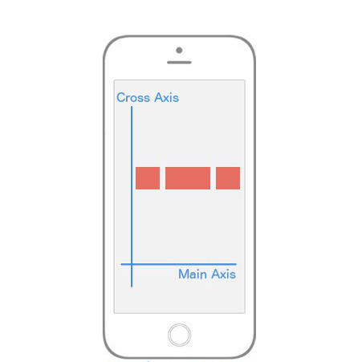
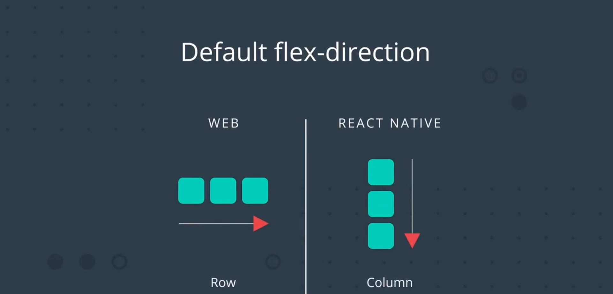
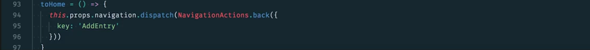
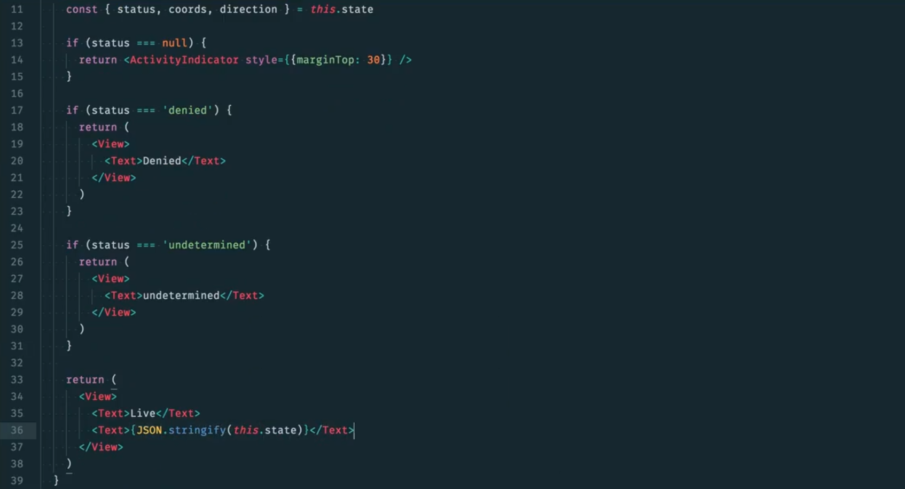

Z.总结与提炼

> 我将把整套课程中我认为值得提炼的知识归纳到这个文档中，并会总结和说明一些我的理解。

[TOC]

## 0.课程地图

本课程主要讲解 React Native 框架。下面是课程内容的简要概述：

- **第 1 课** 说明使用 React Native 构建原生应用程序的好处，以及**如何设置有效的开发环境**。
- **第 2 课** 比较 React 和 React Native 之间的主要思维和 **API 差异**。
- **第 3 课** React Native 应用的详细信息**样式**和**布局模式**。
- **第 4 课** 讲解**路由模式与策略**。
- **第 5 课** 介绍**原生功能**（例如，地理定位、通知等）以及为向应用商店发布应用做准备。

## 1.使用 React Native 构建应用

### 1.1 什么是 React Native/它存在的意义是什么？

- React Native 使你能够使用 React 构建原生 iOS 和 Android 应用。
  - （RN 实际上是一个基于 JS 开发的框架，由于框架最终会和 expo 工具一起将你写的 JS 代码编译为不同平台的代码并打包生成相应的文件，所以通过这个框架你可以使用 JS 和 RN 的语法形式来实现多端开发的目的）

- 一个 React Native 团队就能开发 web、iOS、Android 端的应用，节约企业资金和缩短开发时间。
  - （但其实这点会存在一些问题，因为在面向 iOS 或 Android 应用时，无法做到完全和原生应用相媲美，无论是功能上或性能上，不过对于一些简单的应用而言还是足够了）。
- 与“一次编写，到处运行（Write once，run anywhere）”的理念不同，React Native 的理念是“一次学习，随处开发（Learn once，write anywhere）”。因为要在不同的平台做到 Write once，run anywhere 是非常困难的，但是却可以学习一种开发语言和思路，然后通过一些简单的判断或 API 在不同的平台上进行开发。
  - （这种简短的理念话语是有很大的信息缺失的，比如一次编写，指的是一次用一种语言编写一个工程呢？还是一次用不同的语言编写多个工程呢？当然从其上下文中我们能明白它所表达的应该是一次编写一个工程。）

#### React Native 解密

当 React 首次推出时，一个很大的卖点就是**虚拟 DOM**。这已是现在大多数 UI 库的标配，但当它刚推出时，确实是极具突破性的！我们可以通过分解调用 `setState()` 会发生的过程，来看看虚拟 DOM 究竟是什么。

调用 `setState()` 后 React 所做的第一件事是将传递给 `setState()` 的对象合并到组件的当前状态。这会启动一个叫做[调节](https://facebook.github.io/react/docs/reconciliation.html) 的过程。调节的最终目的是**以最有效的方式更新**基于这种新状态的用户界面。为此，React 将构建一个新的 React 元素树（你可以将其视为 UI 的对象表现形式）。一旦有了这个新树，React 就会使用 "diff" 命令将它与之前的元素树进行比较，以便弄清 UI 如何响应新的状态而改变。通过这样做，React 将会知道发生的具体变化，并且通过了解发生的具体变化，它将能够**仅在绝对必要的情况下进行更新，以最大限度地减少 UI 的占用空间**。

创建 DOM 的对象表现形式的这个过程是 "Virtual DOM" 背后的整体思想。但是，如果我们不想以 DOM 为目标进行渲染，而是将另一个平台作为渲染目标 -- 比如说 iOS 或 Android。理论上来说，DOM 只是一个实现细节。除了这个名字本身（在我看来，它更像是一种营销手段）外，没有什么可以将虚拟 DOM 概念与实际 DOM 相结合。这正是 React Native 背后的思想。**React Native 不是渲染到 web 的 DOM，而是渲染原生 iOS 或 Android 视图**。这是我们可以只使用 React Native 来构建原生 iOS 和 Android 应用的原因。

#### 进一步研究：

- [调节](https://facebook.github.io/react/docs/reconciliation.html)
- [调节 - 中文文档](https://react.docschina.org/docs/reconciliation.html)
- [React Native 中的桥接](https://tadeuzagallo.com/blog/react-native-bridge/)


### 1.2 开发环境设置

当我们在此课程中构建应用时，我们要面向 Android 和 iOS 两个平台构建。那么我们面临的一个难题是，我们需要支持两个独立的开发环境：iOS 使用 [Xcode](https://developer.apple.com/xcode/)，Android 使用 [Android Studio](https://developer.android.com/studio/index.html)。

幸运的是，现在我们有一种新工具可以使用，使我们可以面向 Android 和 iOS 进行开发，而无需打开 Android Studio 或 Xcode。这个工具的名字非常直白，叫做 **Create React Native App**。它类似于 **Create React App**，因为你需要做的是通过 NPM 安装 CLI。然后，通过 CLI，你可以轻松地构建起一个全新的 React Native 项目。

#### Create React Native App 优点

- 减少了创建 "hello world" 应用程序所需的时间。
- 允许你轻松地在自己的设备上进行开发，你在文本编辑器中所做的任何更改将立即显示在本地手机上运行的应用中。
- 你只需要这一个构建工具就够了。你不必关心 Xcode 或 Android Studio。
- 此工具没有锁定。就像 Create React App 一样，你可以随时"弹出配置（eject）"。

#### Create React Native App 缺点

- 如果你在构建一个要添加到现有原生 iOS 或 Android 应用的应用，Create React Native App 就无法用了。
- 如果你需要在 React Native 和一些 Create React Native App 不认识的原生 API 之间建立桥接（这非常罕见），Create React Native App 就无法正常工作了。

#### 安装 Create React Native App

为了使用 Create React Native App，请先在全局安装它:

```bash
npm install -g create-react-native-app
```

或者也可以使用 **yarn**（访问[此处](https://yarnpkg.com/lang/en/docs/install) 了解安装说明）：

```bash
yarn global add create-react-native-app
```

> ### ⚠️ 使用 Yarn ⚠️
>
> Create React Native App 目前无法与 NPM v5 一起使用，因为[NPM 中存在错误](https://github.com/react-community/create-react-native-app/issues/233#issuecomment-305638103)。虽然 NPM v3 或 v4 应该没有问题，但是**保险起见，后面我们都使用 Yarn**。

#### 关于 Expo


- Expo 的宗旨是当你构建 React Native 应用时，你不需要处理原生代码，无论是 Swift Objective-C 还是 java。
- 每当我们需要处理原生 API 时，例如相机或地理位置，我们不用使用 Xcode 或 Android studio，这两个工具实在令人头疼，相反，我们可以使用 Expo 的 JavaScript API 实现相同的结果。
- 实际上 Create React N!ative 应用就是由 Expo 团队开发的，已成为使用 React Native 构建应用的官方方式。
- Expo 是一项服务，它能使涉及 React Native 的一切都变得非常容易。**Expo 背后的思路是省去 Android Studio 或 Xcode 的使用**。更重要的是：它甚至允许我们使用 Windows（或甚至 Linux）面向 iOS 进行开发！

- 在此课程中，我们将大量依赖 Expo。首先: 你需要_安装_ Expo。请前往应用商店，安装适合你的设备的 Expo 移动应用：
  - [Google Play 上的 Expo](https://play.google.com/store/apps/details?id=host.exp.exponent) (Android)
  - [App Store 上的 Expo](https://itunes.apple.com/us/app/expo-client/id982107779) (iOS)

#### 使用 Simulators

- 更多的信息可以去查看官方的文档信息，其实就是需要安装很多环境依赖的东西。
- 这里也会有一些坑，我基本上也都踩过了，不过现在已经忘记当时的问题有哪些了，所以，下一次如果这样的问题还是记录一下比较好。

#### 构建应用

``` shell
create-react-native-app UdaciFitness
```

#### 环境

在使用 Create React Native App 创建应用时，你期望获得什么类型的支持？

- ES5 和 ES6 支持
- 对象展开运算符
- 异步函数
- JSX（毕竟这是*React*！）
- [Flow](https://flow.org/)
- [Fetch](https://developer.mozilla.org/en-US/docs/Web/API/Fetch_API)

由于我们纯粹使用 JavaScript 来构建移动应用，这个列表没有什么好惊奇的！由于 Create React Native App 随 Babel 一起提供，请自行查看[支持的转换](https://github.com/facebook/react-native/blob/master/babel-preset/configs/main.js#L16) 的完整列表。

#### 项目刚开始的准备

我们可以在项目的开始时，创建一些文件夹用于存放不同的代码，比如工具、辅助类代码我可以放到 `utils` 中。其中可以包括带有颜色的十六进制表示法的变量文件 `colors.js`：

```jsx
export const purple = '#292477'
export const gray = '#757575'
export const white = '#fff'
export const red = '#b71845'
export const orange = '#f26f28'
export const blue = '#4e4cb8'
export const lightPurp = '#7c53c3'
export const pink = '#b93fb3'
```

或者带有一些辅助函数的 `helpers.js`

```jsx
// utils/helpers.js

// 判断 num 是否在 x y 之间
export function isBetween (num, x, y){
  if(num >= x && num <=y ){
    return true
  }
  return false
}

// 根据 heading 值返回所面向的方向
export function calculateDirection (heading) {
  let direction = ''

  if (isBetween(heading, 0, 22.5)) {
    direction = 'North'
  } else if (isBetween(heading, 22.5, 67.5)) {
    direction = 'North East'
  } else if (isBetween(heading, 67.5, 112.5)) {
    direction = 'East'
  } else if (isBetween(heading, 112.5, 157.5)) {
    direction = 'South East'
  } else if (isBetween(heading, 157.5, 202.5)) {
    direction = 'South'
  } else if (isBetween(heading, 202.5, 247.5)) {
    direction = 'South West'
  } else if (isBetween(heading, 247.5, 292.5)) {
    direction = 'West'
  } else if (isBetween(heading, 292.5, 337.5)) {
    direction = 'North West'
  } else if (isBetween(heading, 337.5, 360)) {
    direction = 'North'
  } else {
    direction = 'Calculating'
  }

  return direction
}

// 默认返回当天以 IOS 格式返回年、月、日，或者传入相应时间的毫秒数返回
function timeToString(time = Date.now()){
  const date = new Date(time)
  const toDayUTC = new Date(Date.UTC(date.getFullYear(), date.getMonth(), date.getDate()))
  return toDayUTC.toISOString().split('T')[0]
}
```

#### 使用调试器

React Native 的好处是在网页上的开发体验和在 React Native 中完全一样，因为我们可以向控制台输出日志，可以插入调试器，一切都很熟悉。

在 Android 上要打开开发者菜单，按下 Command + M，而不是 Command + D，然后获得这些选项：


这里有个 Toggle Element Inspector，这就像在网页上选择元素一样，我可以点击任何一个元素并获得应用到其上的样式和任何内外间距，对于网页上的 Box Model Inspector，我们在 React Native 中也有相应的选项。假设我想点击其中一个元素，并且不检测它，我只需选择这个方框，我们可以打开或关闭此选项。要取消它，只需按下 Command + D 然后点击 Toggle Element Inspector。

开发者选项中有很多可以选择的内容，最重要的功能是刷新，Toggle Element Inspector 以及启动和停止远程调试器。

## 2.React 与 React Native

### 2.1 Web 与原生

- 移动设备上的开发与网站平台上的开发体验完全不一样。
- 不只 Web 平台应用与移动平台应用差别很大，iOS 应用与 Android 应用的差别也很大，主要差别体现在 UI 风格上。
- 原生应用通常利用**动画**来帮助创建较好的用户体验——按钮效果、屏幕转换和其他视觉反馈等。虽然这些动画较为微妙，但为你构建的应用提供了连续性和引导。
- 动画以动态的方式讲述了关于你应用工作原理的故事，若没有动画，一个应用会感觉只是静态屏幕的集合而失去一些乐趣与想象。
- 原生应用和 Web 应用的另一个主要差别是**导航**，React Router 的 Route 组件让我们能够将 URL 映射到特定的 UI 组件。在 RN 中，路由器的功能为一个**堆栈**（其中一种路由方式），也就是说，各个屏幕会根据需要被“压入”和“弹出”。

#### Android 与 iOS 的差异

- 不仅_原生_应用和 *web* 应用之间存在根本差异，你会发现原生平台（iOS 和 Android）的*外观和感受*也存在差异。或许最明显的差异要数每个平台独特的设计理念: Android 应用采用 Google 的 [Material Design](https://material.io/guidelines/material-design/introduction.html)，而 iOS 应用采用 Apple 的 [Human Interface Design](https://developer.apple.com/ios/human-interface-guidelines/overview/design-principles)。在设计移动应用时，重要的是确保用户感受到的 iOS 应用_具有_ iOS 应用的特点，而 Android 应用_具有_ Android 应用的特点。
- Android 和 iOS 在屏幕_间_导航的感觉也不同。Android 设备在屏幕底部有一个**导航栏**，使用户可以返回上一个屏幕（以及发挥其他功能）。而在 iOS 上，导航方式是不同的: 它并没有这样的通用导航栏！在为 iOS 应用构建 UI 时，重要的是包含一个后退按钮（或许在自定义的[导航栏](https://developer.apple.com/ios/human-interface-guidelines/ui-bars/navigation-bars/)上），以便在应用中导航。
- Android 和 iOS 之间的另一个主要区别在于标签栏导航。iOS 应用在应用屏幕底部包含[标签栏](https://developer.apple.com/ios/human-interface-guidelines/ui-bars/tab-bars/)，使用户方便地访问应用的不同部分。同样，Android 应用中也包含它们；但标签栏都明显地位于[屏幕顶部](https://material.io/guidelines/components/tabs.html)。它们都允许访问高层级内容。（这是主流或者大部分应用所采用的方式）

### 2.2 常见 React Native 组件

- 我们在编写 HTML 时，我们习惯使用 `<div>` 和 `<span>` 标签来定义分区或在页面上包含其他元素，在 RN 中，我们使用  `<View>` 组件来构建应用 UI。跟 HTML 的 `<div>` 一样，`<View>` 组件可以容纳几个属性（例如`style`），甚至可以嵌套在其他 `<View>` 组件中！
- `<Text>` 的用途如你所料。它的主要作用无疑是在应用中渲染文本。跟 `<View>` 一样，样式和嵌套功能也适用于 `<Text>` 组件。
  - （但需要注意，RN 中的文本内容都应该放在 Text 标签中）
- 对于 React Native，需要**确保每当有文本时，需要将该文本封装在 Text 组件中**。如果不这么做，就会报错。

#### 图标

- create-react-native-app 的一个优势是它本身就支持图标。

- 通过访问 https://expo.github.io/vector-icons 访问图标列表，或者访问[矢量图标目录](https://expo.github.io/vector-icons) 

- 使用方式：

  - ```jsx
    import { Ionicons } from '@expo/vector-icons'
    
    <Ionicons name='ios-pizza' color='red' size={100}/>
    ```

- 无论你选择哪个图标，请确保它符合你的应用的整体外观（例如，使用用于特定平台的图标）。

#### 列表

React Native 有三种显示列表的方式：

- `ScrollView`
  - 将列表项包含在这个组件中时，我们便可以通过滑动屏幕来查看位于屏幕以外的列表项。
  - 但该组件会渲染该列表中的每一项，无论用户是否看到这些项。
- `FlatList`
  - 该组件能够只渲染用户当前查看的项目。
  - 中文文档内容：https://reactnative.cn/docs/flatlist/
- `SectionList`
  - 高性能的分组(section)列表组件。
  - 中文文档内容：https://reactnative.cn/docs/sectionlist.html#docsNav


#### 表单

React Native 中的表单与你已经熟悉的 React 中的表单一样: **表单输入元素的状态由渲染表单的 React 组件控制**。也就是说，**表单值保存在本地组件状态中，使状态成为该表单的"数据源"（SOT）**。

React Native 提供几个在应用的表单中使用的基本组件：

- `TextInput`
  - 文本框输入组件，带有 value 属性与 onChange 属性，onChange 回调中的第一个参数为改变后的 value。
- `KeyboardAvoidingView`
  - `keyboardAvoidingView` 组件，我们可以将这里的 `View`（最外层的 View），替换为 `keyboardAvoidingView`，并为其提供 `behavior` 属性，设为 `padding`，指明该视图如何不被键盘遮盖，我们将在其周围添加一些内边距。
  - `KeyboardAvoidingView` 解决了视图会阻挡虚拟键盘的问题
- `Slider`
- `Switch`
  - 切换按钮组件，带有 value 属性与 onValueChange 属性。


#### 图片

通常有两种图片显示方式，也就是可以从两个来源获取图片。

- 第一种方式是使用本地文件，也就是这个 PNG 文件：
  - 
  - 我们将使用 `require()`，并传入该文件的路径，你会发现当前文件 App.js 与图片文件位于同一层级，因此可以直接通过输入 ./ 然后是图片名称来获取图片：
    
- 第二种方式是图片文件位于服务器上
  - 传入一个对象，它具有一个 URI 属性，值为图片所在的具体网址。这里是位于 tylermcginnis.com 网站上：
    

#### 其他组件

我们刚看了 React Native 中内置的一些最重要的组件。这些组件能让你开始使用你构建的应用中的基本功能 - 但可用的组件并不止这些！请自行查看 React Native 文档获取[完整列表](https://facebook.github.io/react-native/docs/components-and-apis.html#components-and-apis)。首先，我们建议你查看：

- [ActivityIndicator](https://facebook.github.io/react-native/docs/activityindicator.html)
  - 显示一个圆形的 loading 提示符号。
  - https://reactnative.cn/docs/activityindicator/
- [Picker](https://facebook.github.io/react-native/docs/picker.html)
  - 本组件可以在 iOS 和 Android 上渲染原生的选择器（Picker）
  - https://reactnative.cn/docs/picker/
- [WebView](https://facebook.github.io/react-native/docs/webview.html)
  - `WebView` 创建一个原生的 WebView，可以用于访问一个网页。
  - https://reactnative.cn/docs/webview/
- [Modal](https://facebook.github.io/react-native/docs/modal.html)
  - Modal 组件是一种简单的覆盖在其他视图之上显示内容的方式。
  - https://reactnative.cn/docs/modal/

注意某些组件是特定于平台的！虽然你可能想要使用_组合_构建跨平台组件，尽可能多地重复使用代码，但根据受众群体（即 iOS 或 Android），某些元素还是会有所不同。

#### 总结

React Native 为开发应用程序提供各种内置组件。其中一些支持应用中的基本功能（例如，文本、图像、列表等），另外一些提供更专门的功能（例如，拉动刷新、显示加载指示器等）。请自行查看 React Native 文档中的[组件和 API](https://facebook.github.io/react-native/docs/components-and-apis.html)，获取详尽列表。

中文：https://facebook.github.io/react-native/docs/components-and-apis

### 2.3 AsyncStorage

#### 在 Web 端使用 LocalStorage 进行本地存储

为在 web 应用中保留数据，我们通常会将数据存储在某种数据库中。这可以防止在页面刷新之间丢失应用程序数据。使用 `localStorage`，我们可以*直接将数据存储在浏览器中*，以达到保留数据的效果。最好的是存储在 `localStorage` 中的数据没有到期日期。这意味着即使会话结束（例如，浏览器选项卡关闭），数据也不会丢失！

请自行查看 MDN 上的 [Window.localStorage](https://developer.mozilla.org/en-US/docs/Web/API/Window/localStorage) 了解概述。

#### 使用 AsyncStorage 进行本地存储

在 React Native 中 LocalStorage 叫做 AsyncStorage，它和 LocalStorage 相似，但是是异步形式。

AsyncStorage 的好处是它是 iOS 和 Android 对等项的 JavaScript 抽象形式，在使用它时，不用担心不同的环境。

和 LocalStorage 相似，AsyncStorage 具有三个主要方法：

- 设置项目（setItem)
- 删除项目（removeItem）
- 清除所有项目（clear all）

> AsyncStorage 是一个简单、未加密、异步、持久的键值存储系统，对应用来说是全局性的。它应该用于替代 LocalStorage。

#### 概括

React Native 版本的 `localStorage` 为 `AsyncStorage`。这非常方便，因为 `AsyncStorage`只是 iOS 和 Android 等平台对应部分的抽象，所以不用考虑不同的环境。

我们来看看 `AsyncStorage` 的三个主要方法：

- `setItem`
- `removeItem`
- `clearAll`

请自行访问[文档](https://facebook.github.io/react-native/docs/asyncstorage.html#methods) 获取完整清单。


### 2.4 Redux 和 React Native

#### 添加 Redux

你应该记得 Redux 是 JavaScript 应用的***可预测的状态容器*****。它对于任何特定的视图库或框架无关**，所以我们不仅可以将它与 React 一起使用，也可以将其集成到 React Native 应用中！

由于 Redux 精简的尺寸和较小的依赖性，它无疑是 React Native 项目的很好工具。最重要的是: 由于 React Native 从根本上来说*只是 JavaScript*，我们可以用习惯的方式将 Redux 添加到项目中。

安装 redux 与 react-redux：

``` shell
yarn add redux react-redux
```


## 3.样式和布局

### 3.1 CSS in JS

在 React 中，组件有两个主要目标： 

- State 
- Presentation

React 组件具有**本地状态**，JSX 负责**呈现标记**部分，但对我来说 Presentation 不仅仅是标记，它是**标记**和**样式**的结合体，因此我建议将**样式从样式表中移到组件级别**，听起来有点疯狂，但实际上在 React 社区，这是很常见的。实际上已经是 React Native 设计组件样式的主要方式。

我们是让 CSS 位于组件中吗？如果你不习惯于这一概念，可能会觉得很奇怪，但在 React Native 中，要设置应用样式，我们将直接使用 JavaScript 而不是之前习惯使用的 CSS。

- React Native 中的所有核心组件都可以接受一个名为 `style` 的属性。我们可以利用此属性的一种方式是使用内联 JavaScript 对象为组件提供样式：

  ```jsx
  function Avatar ({ src }) {
    return (
      <View>
        <Image
          style={{borderRadius: 5, margin: 10, width: 48, height: 48}}
          source={{uri: 'https://tylermcginnis.com/tylermcginnis_glasses-300.png'}}
        />
      </View>
    );
  }
  ```

- 使你的代码保持 DRY（Don't Repeat Yourself） 和可重用的一种方式是将对象存储在一个变量中：

  ```jsx
  const styles = {
    image: {
      borderRadius: 5,
      margin: 10,
      width: 48,
      height: 48
    }
  };
  
  function Avatar ({ src }) {
    return (
      <View>
        <Image
          style={styles.image}
          source={{uri: 'https://tylermcginnis.com/tylermcginnis_glasses-300.png'}}
        />
      </View>
    );
  }
  ```

- 在 React Native 中，通过 `StyleSheet` API 更进一步的创建 styles：

  ```jsx
  import React from 'react';
  import { StyleSheet, Text, View } from 'react-native';
  
  export default class TextExample extends React.Component {
    render() {
      return (
        <View>
          <Text style={styles.greenLarge}>This is large green text!</Text>
          <Text style={styles.red}>This is smaller red text!</Text>
        </View>
      );
    }
  }
  
  const styles = StyleSheet.create({
    greenLarge: {
      color: 'green',
      fontWeight: 'bold',
      fontSize: 40
    },
    red: {
      color: 'red',
      padding: 30
    },
  });
  ```

  - 使用 `StyleSheet` 可以提高我们的代码质量和性能。

  - 提高代码质量：

    - 通过将样式从 render 函数中移除，会使代码变得更容易理解。

    - 命名样式是向 render 函数中的低级组件添加意义的好方式。

  - 提高性能：

    - 从样式对象中创建样式表使我们能够按 ID 进行渲染，而不用每次创建新的样式对象。

- 如果要对组件实现多个样式，`style` 属性可以接受样式作为数组：

  ```jsx
  return (
        <View style={styles.container}>
          <View style={[styles.box, {flex: 1}]}/>
          <View style={[styles.box, {flex: 2}]}/>
          <View style={[styles.box, {flex: 1}]}/>
        </View>
      )
  ```

- CSS-in-JS 库：

  - React 中的样式正在经历一个复兴时期，就像 Flux 几年前一样（最终我们获得了 Redux）。许多不同的样式库不断涌现出来，每个都有利有弊。其中最受欢迎的两个是 [Glamorous](https://github.com/robinpowered/glamorous-native) 和 [Styled Components](https://github.com/styled-components/styled-components)。这两个库的整体思想是，样式是组件的重点所在，因此应该与组件本身结合。我们稍后看一下在 React Native 中使用样式化组件。
  - 使用 CSS in JS 使我们可以访问应用状态或组件中的属性。

#### 总结

CSS in JS 是一个独特的样式实现方式。其主要思想是，样式由 JavaScript 对象而非传统的 CSS 来处理。样式可以直接写入行内或通过对象变量访问，但 React Native 提供一个 `StyleSheet` API，它提供了实现组件样式的高性能和组合方式。

#### 进一步学习

- [我如何安全地使用 CSS-in-JS？](https://reactarmory.com/answers/how-can-i-use-css-in-js-securely)


### 3.2 Flexbox 指南

- 块模型和浮动，根据 MDN 的定义，悬浮 CSS 属性规定元素应该放置在容器的左侧或者右侧，并且文本和内前元素应用包裹在周围：
- 根据 MDN 的定义，flexbox 是一种旨在满足不同屏幕尺寸和不同显示屏幕设备的布局模式，对于很多应用来说 flexible box 模型比块级模型更容易实现，因为它不使用浮动。
- Flexbox 本质上是**旧版块级模型布局的替代形式**，并且很多人都觉得它**性能提高了很多**。很自然地 react native 选择通过 flexbox 来实现布局，而不是原来的块级模型。
- 官方 flexbox 规范与 react native 对 flexbox 的实现之间存在一些**细微差别**，我们也会讲解到。

#### Flexbox 入门

- 每当学习一门新技术，我都要先问一个问题“**这种技术为何存在**？” 对于 flexbox，这个问题的答案可能是使用 CSS 创建一个**多用途的布局**相当麻烦。而 flexbox 的目的就是创建一个更有效的方法来"**布置、对齐和分配容器中项目之间的空间，即使它们的大小位置是未知 和/或 是动态的**"。简而言之，flexbox 的主要用途在于**创建动态布局**。

#### Flexbox 轴

Flexbox 的最重要的概念是它由不同的[轴](https://www.quora.com/What-is-the-plural-of-axis)组成，包括**主轴**和**交叉轴**。 

- 在 React Native 中，默认情况下，**主轴**为垂直的，而**交叉轴**为水平的。后面的所有东西都将构建在**主轴**和**交叉轴**之上。
- 当说"…沿主轴对齐所有子元素"时，是说默认情况下，**父元素的所有子元素将从上到下垂直布置**。如果说"…沿交叉轴对其子元素"时，是说默认情况下，**所有的子元素将从左到右水平布置**。

#### Flex 方向

你会注意到在说到**主轴**和**交叉轴**时，我特别提到了"默认行为"。这是因为你实际上可以更改哪个轴作为主轴，哪个作为交叉轴。这就涉及我们的第一个 flexbox 属性`flex-direction`（或 React Native 中的`flexDirection`）。

`flex-direction` 有两个值:

- `row`（行）
- `column`（列）

默认情况下，React Native 中的每个元素都有 `flexDirection: column` 声明。当一个元素的 `flex-direction` 为`colum`时，它的_主*轴为垂直的，而它的*交叉_轴为水平的，就像我们在上图中看到的那样。但是，如果你给一个元素 `flexDirection: row` 声明，轴就颠倒过来了。主轴变为水平的，而交叉轴变为垂直的。再次说明，**这非常重要，因为你的整个布局都取决于这两个轴。**

#### 对齐内容（主轴）

为了指定子元素**如何沿主轴对齐**，你要使用 `justifyContent` 属性。`justifyContent` 具有五个你可以用来改变子元素的对齐方式的不同值。

- `flex-start`
  - `justifyContent: flex-start` 会使 flex 项目出现在**主轴的起点**。
- `center`
  - `justifyContent: center` 使 flex 项出现在**主轴的中心**。
- `flex-end`
  - `justifyContent: flex-end` 使 flex 项出现在**主轴的终点**。
- `space-around`
  - `justifyContent: space-around` 沿主轴**均匀地**排列每个子元素。 （子元素与两端也会有空隙）
- `space-between`
  - `justifyContent: space-between` 会使 flex 项出现在**主轴的两端**，**子元素之间有间隔**。

#### **对齐项目（交叉轴）**

为了指定子元素如何沿交叉轴对齐，你可以使用 `align-items` 属性。此属性具有四个不同的值可以用来更改子元素沿交叉轴的对齐方式：

- `flex-start`
  - `alignItems: flex-start` 会朝交叉轴的**起点对齐**每个子元素。
- `center`
  - `alignItems: center` 会朝交叉轴的**中间对齐**每个子元素。 
- `flex-end`
  - `alignItems: 'flex-end'` 会朝交叉轴的**终点对齐**每个子元素。 
- `stretch`
  - `alignItems: stretch` 会沿交叉轴**拉伸**每个子元素 - **只要子元素没有特定的宽度**(`flexDirection: column`) 或**高度** (`flexDirection: row`)。 

#### 居中内容

使用 `justifyContent: 'center'` 和 `alignItems: 'center'`。

#### Flex 属性

flexbox 的作用是**将控制权交给父元素，由它来处理其子元素的布局**。`flex` 属性有点不同，因为它**允许子元素指定它们相比于兄弟元素的高或宽**。



```jsx
<View style={[styles.box, {flex: 1}]}/>
<View style={[styles.box, {flex: 2}]}/>
<View style={[styles.box, {flex: 1}]}/>
```

通常基于百分比的布局是特定元素相对于其他元素，正如我们上面所做的。同样重要的是，要注意如果你将一个元素设置为 `flex: 1`，**那个元素会与父元素占用同等多的空间（指这个子元素是父元素的唯一元素）**。这就是为什么在我们上面的大部分例子中，我们想让"布局区域"的大小与父元素的相同，这在我们的示例中是整个视口。

#### 对齐各个 Flex 项目

这正是 `alignSelf` 的功能所在！注意，它以 *align* 开头，所以像 `alignItems` 一样，它将沿交叉轴进行定位。它还与 `alignItems` 具有完全相同的选项（`flex-start`、`flex-end`、`center`、`stretch`）。


```jsx
<View style={styles.container}>
  <View style={styles.box}/>
  <View style={[styles.box, {alignSelf: 'flex-end'}]}/>
  <View style={styles.box}/>
</View>

const styles = StyleSheet.create({
  container: {
    flex: 1,
    flexDirection: 'row',
    justifyContent: 'center',
    alignItems: 'center',
  },
  box: {
    width: 50,
    height: 50,
    backgroundColor: '#e76e63',
    margin: 10,
  }
})
```

注意，我们所做的是向第二个子元素添加了 `alignSelf: flex-end`，它**覆盖了**父元素的指示 (`alignItems: 'center'`)。

#### 总结

React Native 利用 **flexbox** 的一个版本来构建组件布局。这主要是因为 flexbox 能够**跨不同的屏幕尺寸提供一致的布局**。

Flexbox 容器包含两个轴: 一个**主轴**和一个**交叉轴**。使用 flexbox 构建布局时要考虑的一些关键属性包括 `flex-direction`、`justify-content` 和 `align-items`。然而，**React Native 对 flexbox 的实现有点不同**。我们将在下一小节看到不同之处！

**进一步研究**

- [Flexbox 的完整指南](https://css-tricks.com/snippets/css/a-guide-to-flexbox/)
- [Flexbox Froggy](http://flexboxfroggy.com/)

### 3.3 React Native 中的布局

- 在网络应用上，默认伸缩方向是横向（row），在 React Native 中，默认方向是纵向（column），因为我们是针对移动设备进行开发：
  
- 在 React Native 中所有元素默认为 `display: flex;`。你直接使用默认值即可，无需添加不同的属性或编写额外的代码。
- 你还会遇到的另一个主要区别在于如何使用 `flex` 属性。**在 web 上，`flex` 指定了一个 flex 项目如何增大或缩小，以管理其周围的空间（沿主轴）。在 React Native 中，`flex` 通常用于位于同一级别但具有不同 `flex` 值的 flex 项目。**


#### 其他区别

除上述外，这里是 React Native 应用于组件的其他常见 CSS 属性中的默认值列表:

```css
box-sizing: border-box;
position: relative;
align-items: stretch;
flex-shrink: 0;
align-content: flex-start;
border: 0 solid black;
margin: 0;
padding: 0;
min-width: 0;
```

### Platform API

- 主要使用：Platform.OS === ‘ios’ ? ios 内容 : android 内容

```jsx
import { Platform } from 'react-native'

return (
    <TouchableOpacity
      style={
        Platform.OS === 'ios' ? styles.iosSubmitBtn : styles.androidSubmitBtn
      }
      onPress={onPress}
    >
      <Text style={styles.submitBtnText}>SUBMIT</Text>
    </TouchableOpacity>
  )
```

#### `Dimensions` API

React Native 还带有一个 [Dimensions](http://facebook.github.io/react-native/releases/0.47/docs/dimensions.html) 组件, 它可以让你选择用户设备中窗口的宽和高！

首先，确保从 React Native 拉取 API：

```jsx
import { Dimensions } from 'react-native';
```

然后，你可以直接使用 Dimensions API 的 `get` 方法抓取窗口大小：

```jsx
const { width, height } = Dimensions.get('window');
```

你可以自行使用这些尺寸来计划你的 `<View>` 会是什么样的。

#### 总结

React Native 使用 **flexbox** 来管理移动应用中的布局。但是，官方 flexbox 规范（即 CSS *on the web*）和 React Native 自己的实现之间有一些细微差别。大多数差别只是默认设置的不同。

由于 Android 和 iOS 应用在外观和感觉方面也存在差异，React Native 还提供了一个 `Platform` API 来处理它们。

在下一节课中，我们将会介绍一些常见的"陷阱"以及实现组件样式的最佳实践。

**进一步研究**

- [理解 React Native flexbox 布局](https://medium.com/the-react-native-log/understanding-react-native-flexbox-layout-7a528200afd4)
- [特定于平台的代码](https://facebook.github.io/react-native/docs/platform-specific-code.html) 来自于 React Native 文档

### 3.5 专业人士如何处理样式

#### 样式：样式表与内联

- StyleSheet API 最大的优点: 通过将样式从 render 函数中移除，使代码变得**更容易阅读和理解**。
- **性能优势**：从样式对象制作样式表让我们可以使用 ID 引用它，而**无需在每次渲染时创建一个新的样式对象。**

#### 媒体查询

- 你可能注意到 React Native（以及特别是`StyleSheet` API）不支持[媒体查询](https://developer.mozilla.org/en-US/docs/Web/CSS/Media_Queries/Using_media_queries)。这是因为在大多数情况下，你可以使用 flexbox 设计响应式网格，这会省去使用媒体查询的需要。在极少数情况下，如果 flexbox 无法满足你的特定需求，你可以使用我们前面提到的 [Dimensions](https://facebook.github.io/react-native/docs/dimensions.html) API 得到类似的结果。

#### CSS in JS 库

- 其中最受欢迎的两个是 [Glamorous](https://github.com/robinpowered/glamorous-native) 和 [Styled Components](https://github.com/styled-components/styled-components)。这两个库的整体思想是，**样式是组件的重点所在，因此应该与组件本身结合。**

- 使用 `styled-components`，如下：

  

- 更多内容直接去查看文档吧。

## 4.导航

在原生应用中进行导航与在网络上进行导航完全不一样，当你在网络上进行导航时，通常是将 URL 映射到特定的组件：


而在原生应用中，我们不再将 URL 映射到组件上，路由器会跟踪**路由堆栈**，可以看做一个路径数组，当你在应用中进行导航时，路由器从路径堆栈中弹出：


react-navigation，它是一个 react-native 导航库，react-navigation 的主要功能是提供导航器，默认情况下，它们提供了三个导航器：

- TabNavigator
- StackNavigator
- DrawerNavigator

使用方式：

安装：

```shell
yarn add react-navigation
```

引入：

```jsx
import { TabNavigator, StackNavigator, DrawerNavigator} from 'react-navigation'

const Tabs = TabNavigator({
  Hello: {
    screen: Hello
  },
  Goodbye: {
    screen: Goodbye
  },
});

const Tabs =
  Platform.OS === 'ios'
    ? createBottomTabNavigator(RouteConfigs, TabNavigatorConfig)
    : createMaterialTopTabNavigator(RouteConfigs, TabNavigatorConfig)

const MainNavigator = createAppContainer(Tabs)

export default class App extends React.Component {
  render() {
    return (
      <Tabs />
    );
  }
}
```

（这一章节的内容打不多数都是在写代码，毕竟这部分只是一些 API 的调用，所以如果想了解更多的内容可以去查看文档。以下内容是课程中的一些筛选）

- 在使用 `StackNavigator` 时，我们可以在像其传入的组件中，利用添加静态属性的方式来进行一些设置，比如下面就是通过返回一个带有 title 属性的对象来设置 title 所需要显示的内容：
  

- 要在 RN 中对路由进行控制，需要使用方法 `NavigationAcitons`，来自于 ‘react-navigation’ 软件包，实现方法是，先新建一个方法，叫做 toHome，它将调用 `this.props.navigation.dispatch` 类似于 Redux，我们将分派 `NavigationsActions.back`，我们想要回到某个某地，我们从哪里回去呢？也就是具有 `key: ‘AddEntry’` 的位置，我们想从当前所在的位置回到之前的位置：
  


#### 课程总结

在这节课，你学习了如何使用 react-navigation 进行导航

- TabNavigator 使你能够在应用屏幕中添加多个标签页。
- StackNavigator 使应用能够在不同的屏幕之前转换，并且每个新屏幕都互相堆叠在一起。
- DrawerNavigator 可以用来轻松地设置抽屉式导航栏。
- 最后，你学习了如何嵌套不同的导航器以获得所需的路由方案。


## 5. 原生功能

- 来自 ‘react-native’ 包的 ActivityIndicator 组件能够显示加载状态的图标

我们来看一段代码：



这段代码表示当我们的 this.state.status 为不同的值时渲染不同的 UI，这是因为我们在考虑应用中的某些屏幕时，我们需要考虑不同的情况，特别是我们向用户请求一些权限时。

> #### 💡 定位技巧 💡
>
> 每当你处理需要用户授权才能正常使用的功能时，你应考虑到有可能显示的所有不同 UI 选项。例如，在处理用户的位置时，有三种情况需要管理：
>
> 1. 用户给予你查看其位置的权限（最佳情况）。
> 2. 用户决定不拒绝也不授予你查看其位置的权限。
> 3. 用户拒绝你访问他们的位置。
>
> 在理想情况下，用户始终授予你需要的所有权限，但现实中并不总是如此。**因此作为 UI 开发人员，你需要针对这些情况做出相应的计划**。

### 5.1 地理位置

- 通常在处理**位置服务**时，你需要两个功能中的一个：获取用户的当前位置，或者获取和_监视_用户的当前位置以进行更新。Expo 的 `Location` 属性通过 `getCurrentPositionAsync` 和 `watchPositionAsync` 使我们可以同时使用这两个选项。

  ```jsx
  import { Location } from 'expo'
  ```

  - getCurrentPositionAsync` 会获取设备的当前位置，而不获取未来更新。`watchPositionAsync` 也会获得设备的当前位置，但也获得位置更新。这样，当设备位置发生变化时你会获得通知。

- 在需要请求用户授予权限时，我们需要调用来自 ‘expo’ 的 `Permissions.askAsync()`。而我们在需要获得是否拥有用户的授权时，需要调用 `Permissions.getAsync()`
  

### 5.2 动画

流畅的动画效果是构建原生应用的基本组成部分，因此 React Native 内置了动画库，名字叫做 Animated。

```jsx
import { Animated } from 'react-native'
```

Animated 侧重于在输入和输出之间建立声明式关系，并且二者之间的转换可以配置。

我们可以利用 Animated 实现三种主要的动画效果：

- Decay 以一个初始速度开始，并逐渐减慢停止
- Spring 就像你之前见过的物理弹簧效果
- 然后是 Timing 在一定的时间范围内表示值的渐变动画效果

Animated 的使用：

- 在 state 中通过 new Animated.Value() 创建一个初始值：
  - `opacity: new Animated.Value(0)`
- 需要使用动画的组件，需要使用 Animated 下的组件 ，比如图片组件：
  - `Animated.Image`
- 在 componentDidMount 或者其他事件中调用 Animated.timing 或者 Animated.spring 等，传入需要一些参数：
  - 注意有一个 `.start()` 方法

> #### ⚠️ 注意：动画 ⚠️
>
> 完全掌握 Animated API 会为你打开新世界的大门。听起来不错，但它可能是双刃剑。这是一件好事，因为你现在有能力通过动画来增强应用的体验。但是，能力越大责任越大。
>
> **动画的目的是增强用户的体验，而不是分散注意力**。在你的应用中添加动画时记住这一点，**减少使用不必要的动画，这样不仅会提高应用的性能，还能最大限度地降低破坏用户体验的风险**。

### 5.3 本地通知

Expo 提供了一个通知 API（ Notifications ），其中具有一个 scheduleLocalNotificationAsync 方法。

在处理通知时，务必记住通知有两种不同的类型：**推送通知**和**本地通知**。

- **本地通知不使用也不需要任何外部基础设施; 它们完全发生在设备自身上**。这意味着设备显示通知的唯一要求是打开设备。
- 然而，**推送通知要求需要有一个服务器，在发生某个事件时，该服务器会将通知推送到用户的设备。**

API：

- Notifications.cancelAllScheduledNotificationsAsync()
- 