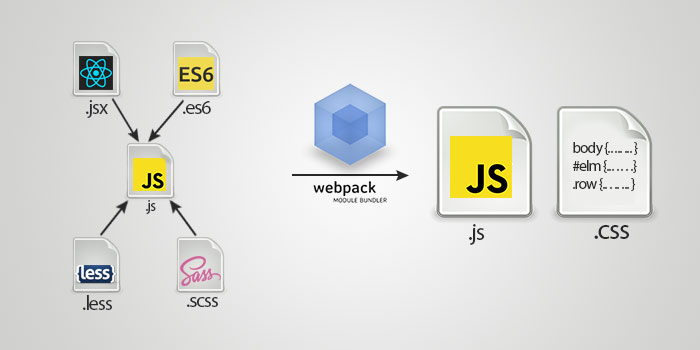

# 第03课：使用 Webpack 构建应用及最新特性解析

[TOC]


在上一篇文章中我们介绍了什么是模块以及模块打包的原理。在这篇文章中我会主要介绍 Webpack，包括我们为什么选择使用 Webpack 来做打包，以及从一个最简单的项目开始逐步介绍如何使用 Webpack，并且在最后会带来一些 Webpack 最新特性的分析。在本文的中各个实例你都可以在本课程的 [Github](https://github.com/roscoe054/webpack-examples) 上找到。

## 为什么选择 Webpack？

对于 JavaScript 应用来说，现在市面上可以选择的打包和构建工具有很多：Gulp、Grunt、Browserify、Webpack、Rollup 等等。

如果我们大概分一下类的话，**Gulp、Grunt 它们是属于构建流程管理工具，也就是通过定义和执行任务来完成构建工作**。这些任务可以包括预编译语言的处理、模块打包、代码压缩等等，开发者可以利用 Gulp、Grunt 以及它们周边的插件去做很多事情。

>我觉得可能是帮助开发者在构建一个项目过程中起到辅助作用。

Browserify、Webpack、Rollup 则属于**打包工具**，核心的功能就是把模块按照特定模块规则合并到一起，使浏览器可以执行。Rollup 主要是面向库的打包工具，本文不会过多涉及。而 Browserify 和 Webpack 对比起来，Webpack 的功能要更强大一些。它支持 AMD、CommonJS、ES6 Module 多种模块系统，也可以通过 loader 和 plugin 来进行预编译语言的处理、代码压缩等等。而 **Webpack 最主要的优势在于可以进行代码按需加载（ code spliting ），使构建速度和用户体验均可以得到提升**，在后面我们会详细介绍。

## 从零开始 Webpack

让我们从一个最简单的工程开始认识 Webpack，首先在一个空的工程目录下，使用 npm 进行初始化并安装 Webpack：

```shell
npm init
npm i webpack --save-dev
```

接下来我们在工程中创建三个文件：index.html、app.js 和 module.js。

index.html：

```html
<html lang="zh-CN">
  <body>
    <script src="dist/bundle.js"></script>
  </body>
</html>
```

app.js：

```jsx
import moduleLog from './module.js';
document.write('app.js loaded.');
moduleLog();
```

module.js：

```jsx
export default function() {
    document.write('module.js loaded.');
}
```

接下来执行 Webpack 命令来生成我们的第一个打包结果：

```shell
./node_modules/.bin/webpack app.js dist/bundle.js
```

注意，这里我们使用的是项目中安装的 Webpack，因此我们执行的路径是 `./node_modules/.bin/webpack`。`./node_modules/.bin/` 是用来执行项目内安装的 npm 包命令的目录，在 Webpack 安装完之后会在该目录下面生成一个命令入口。

Webpack 命令后面我们加了两个参数，第一个参数是打包入口文件（ app.js ），第二个参数是打包结果文件（ dist/bundle.js ），现在工程中应该已经生成了该打包结果。

在浏览器中打开 index.html，你应该能看到页面内容中的 **"app.js loaded. module.js loaded."**了。以上是我们通过 Webpack 将工程中的源文件 app.js 和 module.js 打包合并生成了 bundle.js。

### 定义配置文件

Webpack 为打包提供了很多配置项，如果使用命令行的形式则要配置太多的参数，使得最终的打包命令很长。因此我们习惯于将 Webpack 配置写在一个特定的文件中，通过该文件来管理我们项目中的配置。比如我们在工程中创建一个 webpack.config.js：

```jsx
const path = require('path');

module.exports = {
    entry: './app.js',
    output: {
        path: path.join(__dirname, 'dist'),
        filename: 'bundle.js'
    }
}
```

上面我们导出了一个 Webpack 的配置对象，该对象现在包含两个属性：

**entry**：工程资源的入口，它可以是单个文件也可以是多个文件。通过每一个资源入口，Webpack 会依次去寻找它的依赖来进行模块打包。我们可以把 entry 理解为整个依赖树的根，每一个入口都将对应一个最终生成的打包结果。 **output**：这是一个配置对象，通过它我们可以对最终打包的产物进行配置。这里我们配置了两个属性：

- path：打包资源放置的路径，必须为绝对路径。
- filename：打包结果的文件名。

定义好配置文件后，在工程中执行打包命令：

```shell
./node_modules/.bin/webpack
```

这一次由于已经有了配置文件，我们在打包命令中不需要再指定源文件名和输出文件名。看起来执行的命令更简洁了，而最终生成的还是一样的 bundle.js。

### Dev Server

在本地开发时候一般都会通过 `webpack-dev-server` 起一个本地服务，它可以为我们带来开发中的便利。它最主要的功能是可以监听工程目录文件的改动，当我们修改源文件并保存的时候，它可以实现重新打包，并且自动刷新浏览器（ hot-loading ）来看到效果。

先在工程目录下安装 `webpack-dev-server`：

```shell
npm install webpack-dev-server --save-dev
```

接着在 webpack.config.js 中对它进行简单的配置：

```jsx
module.exports = {
    entry: './app.js',
    output: {
        path: path.join(__dirname, 'dist'),
        filename: 'bundle.js'
    },
    devServer: {
        port: 3000, // 服务端口
        publicPath: "/dist/" // 打包后资源路径，后面会详细解释
    }
}
```

最后我们在项目中执行 `node_modules/.bin/webpack-dev-server`，访问 `localhost:3000` 即可看到结果。

使用 `webpack-dev-server` 和我们使用普通的 Webpack 命令行的最主要区别在于，`webpack-dev-server`打包并不会生成实际的文件（比如它并不会在 dist 目录生成 bundle.js 文件）。我们可以理解成最终的资源只**存在于内存中**，然后当浏览器发出请求的时候它会从内存中去加载，返回打包后的资源结果。

### 一切皆模块与 loaders



接下来我们要介绍一个 Webpack 的核心特性——一切皆模块。对于像 `RequireJS` 或 `Browserify` 这样的打包工具而言，它们仅仅能够处理 JavaScript。然而我们的工程不仅仅有 JavaScript，还有模板、样式文件、图片等等其它类型的资源，这就意味着我们还需要使用别的工具去管理它们。

在 Webpack 的思想中，所有这些资源——模板、样式、图片等等都是模块，因为这些资源也具备模块的特性——**它们都负责特定的职能，并且具有可复用性。**因此，我们可以使用 Webpack 去管理所有这些资源，并且把它们都当做模块来处理。

到了代码层面，让我们实际来使用一下这个特性。在项目中创建一个很简单的 style.css：

```css
body {
    text-align: center;
    padding: 100px;
    color: #fff;
    background-color: #09c;
}
```

接下来编辑项目中的 app.js：

```jsx
import moduleLog from './module.js';
import './style.css';
document.write('app.js loaded.');
moduleLog();
```

让我们来看一下文件的改动。在上面的 app.js 中我们引入了一个 CSS 文件，你可能会觉得有点奇怪。在模块语法层面来说我们在 JS 文件中只能引入 JS，因为编译器无法编译其它类型的文件。然而**在 Webpack 中，我们可以在 JS 文件中引入 CSS、LESS、SCSS，甚至是 Mustache、PNG。实际上，Webpack 会处理在依赖树中的所有资源，不管它是 JS 也好，还是 CSS 也好。那么 Webpack 是如何使得它在打包过程中解析这些不属于 JavaScript 的语法呢？这就要提到 Webpack 中另一个概念——loader。**

**loader 可以被理解成对于 Webpack 能力的扩展**。Webpack 本身只能处理 JavaScript，而对于别的类型的语法则完全不认识。**如果我们需要引入某一类型的模块，那么就需要通过为它添加特性类型的 loader**。比如上面我们在 app.js 中引入了一个 CSS 文件，那么我们就需要 CSS 的 loader。

**loader 是独立于 Webpack 存在的**，Webpack 内部并不包含任何 loader，因此我们首先使用 npm 安装 css-loader（很多情况下，解析某种文件的 loader 命名就是 `<filetype>-loader`，比如 `sass-loader`、`mustache-loader`、`coffee-loader` 等，通过 google 或者 github 很容易搜索到）：

```shell
npm i css-loader --save-dev
```

现在让我们编辑 webpack.config.js 来让 css-loader 生效：

```jsx
const path = require('path');

module.exports = {
    entry: './app.js',
    output: {
        path: path.join(__dirname, 'dist'),
        filename: 'bundle.js'
    },
    module: {
        loaders: [
            {
                test: /\.css$/,
                loader: 'css-loader'
            }
        ]
    }
}
```

可以看到我们配置了 module.loaders 这样一个数组，数组中的每项则是一个对象，我们为它添加了两个属性（实际上有更多的属性，这里我们只涉及两个）。

**test**：代表我们希望 Webpack 对哪种类型的文件使用该 loader。通过正则匹配我们找出符合要求的以 `.css` 结尾文件名的文件。 **loader**：对所匹配到文件进行处理的 loader 的名字。

现在让我们重新执行打包命令，然而当你刷新页面你可能会发现 style.css 中的样式并没有生效。这是因为我们使用 `css-loader` 只是解决了 CSS 语法解析的问题，然而并没有把样式加到页面上。现在让我们为项目添加 `style-loader` 来解决这个问题，它会负责为我们的样式生成 style 标签并插入到页面中。

首先还是使用 npm 来安装 `style-loader`：

```
npm i style-loader --save-dev
```

接下来编辑 webpack.config.js：

```jsx
const path = require('path');

module.exports = {
    entry: './app.js',
    output: {
        path: path.join(__dirname, 'dist'),
        filename: 'bundle.js'
    },
    module: {
        loaders: [
            {
                test: /\.css$/,
                loader: 'style-loader!css-loader'
            }
        ]
    }
}
```

可以看到在 css-loader 之前我添加上了 style-loader，并且使用 "!" 分隔，这是 Webpack 对于 loader 的配置形式。loader 的执行顺序是从右向左，也就是说 CSS 文件会首先经过 css-loader 来解析语法，然后通过 style-loader 来生成插入 style 标签的代码。现在当你重新打包之后刷新页面，你应该能看到之前添加的样式在页面中生效了。

以上是一个使用 loader 的简单的例子，我们通过链式的 loader 配置来处理样式文件，你也可以试试为你的工程添加更多的 loader。并且 loader 还有更多的配置项，具体可以参阅官方文档，这里不再详述。

### 资源压缩

既然已经聊过了模块打包，现在让我们继续深入到工程构建中的其它流程。我们知道客户端页面加载性能是作为前端工程师的重要关注点之一。为了使页面渲染的更快，我们希望 JS、CSS 等资源能更快地传输到客户端，所以所传输的资源体积越小越好，因此我们一般都会将资源进行压缩处理，Webpack 可以帮我们做这项工作。

压缩实际上是从源代码中去掉生产环境下不必要的内容，比如代码中的注释、换行、空格，这些也许对于开发者来说有用，但是用户并不需要这些。去掉这些之后可以减小资源的整体体积，同时不影响代码的实际功能。

添加压缩功能需要用到 Webpack 的 plugin 配置项，通过该配置项我们来为工程打包添加辅助插件。这些插件可以侵入打包的各个流程，来实现特定的功能。它们有些是 Webpack 自带的，有些需要我们手动从 npm 去安装。现在让我们来安装压缩插件：

```shell
npm i uglifyjs-webpack-plugin --save-dev
```

接着编辑 webpack.config.js 将它引入：

```jsx
const UglifyJSPlugin = require('uglifyjs-webpack-plugin')

module.exports = {
    entry: './app.js',
    output: ...
    module: ...
    plugins: [
        new UglifyJSPlugin()
    ]
}
```

现在当你执行打包你会发现生成的 bundle.js 已经是压缩过的并且基本不具备可读性，但是它的体积比之前已经减小了很多。

### 按需加载

对于现在的 JavaScript 应用，尤其是单页应用来说，资源体积过大是一个很常见的问题。一般来说，当我们加载一个单页应用的时候，我们需要把整个应用的逻辑全塞在入口 JS 文件中，这会使得首页加载速度很慢。假如我们可以在页面需要的时候再去加载我们需要的模块就好了，Webpack 可以帮我们做到这一点。

Webpack 支持异步加载模块的特性，从原理上说其实很简单——就是动态地向页面中插入 script 标签。比如一个拥有五个页面（或者说路由状态）的单页应用，我们在首页加载的 index.js 中只放首页需要的逻辑。而另外四个页面的逻辑则通过跳转到其对应路由状态时再进行异步加载。这样的话就实现了只加载用户需要的模块，也就是按需加载。

在代码层面，Webpack 支持两种方式进行异步模块加载，一种是 CommonJS 形式的 `require.ensure`，一种是 ES6 Module 形式的异步 `import()`。在这里我们使用 `import()` 的形式动态加载我们的模块。

首先更改一下 module.js，因为异步加载的脚本不允许使用 `document.write`，我们把之前的代码改为一个 console.log 函数：

```jsx
export const log = function() {
    console.log('module.js loaded.');
}
```

然后编辑 app.js，将 module.js 以异步的形式加载进来：

```jsx
import('./module.js').then(module => {
    module.log();
}).catch(error => 'An error occurred while loading the module');

document.write('app.js loaded.');
```

修改 webpack.config.js：

```jsx
const path = require('path');

module.exports = {
    entry: './app.js',
    output: {
        path: path.join(__dirname, 'dist'),
        publicPath: './dist/',
        filename: 'bundle.js'
    },
    // 省略其它配置...
}
```

这里我们在 output 中添加了一个配置项 `publicPath`，它是 Webpack 中一个很重要又很容易引起迷惑的配置。当我们的工程中有按需加载以及图片和文件等外部资源时就需要它来配置这些资源的路径，否则页面上就会报 404。这里我们将 publicPath 配置为相对于 html 的路径，使按需加载的资源生成在 dist 目录下并且页面能正确地引用到它。

重新打包之后你会发现打包结果中多出来一个 0.bundle.js，这里面就是将来会被异步加载进来的内容。刷新页面并查看 chrome 的 network 标签，可以看到页面会请求 0.bundle.js。它并不是来源于 index.html 中的引用，而是通过 bundle.js 在页面插入了一个 script 标签来将其引入的。

## 使用 Webpack 的构建特性

从 2.0.0 版本开始，Webpack 开始加入了更多的可以优化构建过程的特性。

### tree-shaking

在关于模块的那一篇文章中我们提到过，ES6 Module 的模块依赖解析是在代码静态分析过程中进行的。换句话说，它可以在代码的编译过程中得到依赖树，而非运行时。利用这一点 Webpack 提供了 tree-shaking 功能，它可以帮助我们检测工程中哪些模块有从未被引用到的代码，这些代码不可能被执行到，因此也称为”死代码”。通过 tree-shaking，Webpack 可以在打包过程中去掉这些死代码来减小最终的资源体积。

开启 tree-shaking 特性很简单，只要保证模块遵循 ES6 Module 的形式定义即可，这意味着之前所有我们的例子其实都是默认已经开启了的。但是要注意如果在配置中使用了 babel-preset-es2015 或者 babel-preset-env，则需要将其模块依赖解析的特性关掉，如：

```jsx
presets: [
  [env, {module: false}]
]
```

这里我们测试一下 tree-shaking 的功能，编辑 module.js:

```jsx
// module.js
export const log = function() {
    console.log('module.js loaded.');
}
export const unusedFunc = function() {
    console.log('not used');
}
```

打开页面查看 0.bundle.js 的内容，应该可以发现 unusedFunc 的代码是不存在的，因为它没有被别的模块使用，属于死代码，在 tree-shaking 的过程中被优化掉了。

tree-shaking 最终的效果依赖于实际工程的代码本身，在我对于实际工程的测试中，一般可以将最终的体积减小 3%~5%。总体来看，我认为如果要使 tree-shaking 发挥真正的效果还要等几年的时间，因为现在大多数的 npm 模块还是在使用 CommonJS，因此享受不了这个特性带来的优势。

### scope-hoisting

scope-hoisting（作用域提升）是由 Webpack3 提供的特性。在大型的工程中模块引用的层级往往较深，这会产生比较长的引用链。scope-hoisting 可以将这种纵深的引用链拍平，使得模块本身和其引用的其它模块作用域处于同级。这样的话可以去掉一部分 Webpack 的附加代码，减小资源体积，同时可以提升代码的执行效率。

目前如果要开启 scope-hoisting，需要引入它的一个内部插件：

```jsx
module.exports = {
    plugins: [
        new webpack.optimize.ModuleConcatenationPlugin()
    ]
}
```

scope-hoisting 生效后会在 bundle.js 中看到类似下面的内容，你会发现 log 的定义和调用是在同一个作用域下了：

```jsx
// CONCATENATED MODULE: ./module.js
const log = function() {
    console.log('module.js loaded.');
}

// CONCATENATED MODULE: ./app.js
log();
```

## 总结

以上是对于 Webpack 一些基本特性的介绍，如果你想运行示例可以在本课程的 [Github](https://github.com/roscoe054/webpack-examples) 上找到。在后续介绍构建优化的文章中会进一步带来更多 Webpack 的进阶用法，可以帮助提升构建速度以及减小资源体积，同样到时也会给出更多的示例。