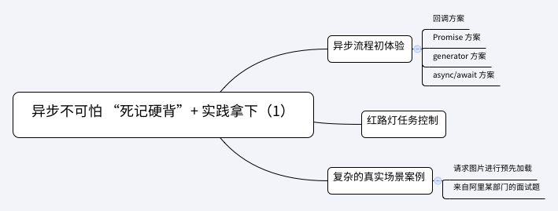

## 第2-1课：异步不可怕“死记硬背”+ 实践拿下（上）

> [原文地址](https://gitbook.cn/gitchat/column/5c91c813968b1d64b1e08fde/topic/5cbbe675bbbba80861a35bd5)

[TOC]

异步是前端开发的一个重点内容，也是难点之一。JavaScript 语言在各个历史阶段，为更优雅地实现异步，进行过多种尝试。但是由于异步天生的“复杂度”，使得开发者并不能够轻松地吃透理论并上手实践。

**理论方面，** 我们知道 JavaScript 是单线程的，那它又是如何实现异步的呢？在这个环节中，浏览器或 NodeJS 又起到了什么样的作用？什么是宏任务，什么是微任务？

**实践上**，从 callback 到 promise，从 generator 到 async/await，到底应该如何更优雅地实现异步操作？

本课让我们来一探究竟。

相关知识点如下：



整个内容分为两节课：第一节课，实践上，我们从需求开始慢慢打磨，让我们都能成为运筹帷幄的“老司机”；第二节课，从多种例题入手，分析语言和浏览器行为。

另外，由于这门课程的目标是“进阶”，**这里不会再单独介绍类似 Promise 的使用，async/await 等基本概念和知识点请大家提前做好相关知识储备。**

### 异步流程初体验

让我们先从一个需求开始，来实现一个“运动路径动画”流程：

> 移动页面上元素 target（`document.querySelectorAll('#man')[0]`）
>
> 先从原点出发，向左移动 20px，之后再向上移动 50px，最后再次向左移动 30px，请把运动动画实现出来。

我们将移动的过程封装成一个 walk 函数，该函数要接受以下三个参数。

- direction：字符串，表示移动方向，这里简化为“left”、“top”两种枚举
- distance：整型，可正或可负
- callback：动作执行后回调

direction 表示移动方向，distance 表示移动距离。通过 distance 的正负值，我们可以实现四个方向的移动。

#### 回调方案

因为每一个任务都是相互联系的：当前任务结束之后，将会马上进入下一个流程，如何将这些流程串联起来呢？我们采用最简单的 callback 实现，明确指示下一个任务。

```js
const target = document.querySelectorAll('#man')[0]
target.style.cssText = `
  position: absolute;
  left: 0px;
  top: 0px
`

const walk = (direction, distance, callback) => {
  let initLeft = parseInt(target.style.left, 10)
  let initTop = parseInt(target.style.top, 10)
  const innerWalk = () => {
    setTimeout(() => {
      let currentLeft = parseInt(target.style.left, 10)
      let currentTop = parseInt(target.style.top, 10)
      const shouldFinish =
            (direction === 'left' && currentLeft === -(distance - initLeft)) ||
            (direction === 'top' && currentTop === -(distance - initTop))
      if (shouldFinish) {
        // 任务之行结束，执行下一个回调
        callback && callback()
      } else {
        if (direction === 'left') {
          currentLeft--
          target.style.left = `${currentLeft}px`
        } else if (direction === 'top') {
          currentTop--
          target.style.top = `${currentTop}px`
        }
        innerWalk()
      }
    }, 20)
  }
  innerWalk()
}

walk('left', 20, () => {
  walk('top', 50, () => {
    walk('left', 30, Function.prototype)
  })
})
```

> 这里我做了更改，将 `setTimeout` 放入 `innerWalk` 中调用，这样便可以在 walk 中通过闭包来保存初始值用于和目标移动距离相加来获取应该位移到的位置，而非从 0 到 `distance` 的位置

有几点需要大家注意。

- 为了简化问题，我们将目标元素的定位进行了初始化设定：

```js
position: absolute;
left: 0px;
top: 0px
```

且不再考虑边界 case（如移除屏幕外等）。

- 为了能够展现出动画，我们将 walk 函数的执行逻辑包裹在 20 毫秒的定时器当中，每次执行一像素的运动时，都会有一个停留定格。

这样的实现完全面向过程，代码比较“丑”，读者只需体会使用回调来解决异步任务的处理方案。也要发现：

```js
walk('left', 20, () => {
    walk('top', 50, () => {
        walk('left', 30, Function.prototype)
    })
})
```

这样的回调嵌套很不优雅，有几次位移任务，就会嵌套几层，是名副其实的回调地狱。

#### Promise 方案

我们再来看一下如何用 Promise 解决问题：

```js
const target = document.querySelectorAll('#man')[0]
target.style.cssText = `
    position: absolute;
    left: 0px;
    top: 0px
`

const walk = (direction, distance) => 
new Promise((resolve, reject) => {
  const innerWalk = () => {
    setTimeout(() => {
      let currentLeft = parseInt(target.style.left, 10)
      let currentTop = parseInt(target.style.top, 10)

      const shouldFinish = (direction === 'left' && currentLeft === -distance) || (direction === 'top' && currentTop === -distance)

      if (shouldFinish) {
        // 任务之行结束
        resolve()
      }
      else {
        if (direction === 'left') {
          currentLeft--
          target.style.left = `${currentLeft}px`
        }
        else if (direction === 'top') {
          currentTop--
          target.style.top = `${currentTop}px`
        }

        innerWalk()
      }
    }, 20)
  }
  innerWalk()
})

walk('left', 20)
  .then(() => walk('top', 50))
  .then(() => walk('left', 30))
```

几个注意点：

- walk 函数不再嵌套调用，不再执行 callback，而是函数整体返回一个 promise，以利于后续任务的控制和执行
- 设置 innerWalk 进行每一像素的递归调用
- 在当前任务结束时（shouldFinish 为 true），resolve 当前 promise

对比上述实现，我们发现使用 promise 的解决方案明显更加清晰、易读。

#### generator 方案

ES Next 中生成器其实并不是天生为解决异步而生的，但是它又天生非常适合解决异步问题。用 generator 方案解决异步任务也同样优秀：

```js
const target = document.querySelectorAll('#man')[0]
target.style.cssText = `
    position: absolute;
    left: 0px;
    top: 0px
`

const walk = (direction, distance) => 
new Promise((resolve, reject) => {
  const innerWalk = () => {
    setTimeout(() => {
      let currentLeft = parseInt(target.style.left, 10)
      let currentTop = parseInt(target.style.top, 10)

      const shouldFinish = (direction === 'left' && currentLeft === -distance) || (direction === 'top' && currentTop === -distance)

      if (shouldFinish) {
        // 任务之行结束
        resolve()
      }
      else {
        if (direction === 'left') {
          currentLeft--
          target.style.left = `${currentLeft}px`
        }
        else if (direction === 'top') {
          currentTop--
          target.style.top = `${currentTop}px`
        }

        innerWalk()
      }
    }, 20)
  }
  innerWalk()
})

function *taskGenerator() {
  yield walk('left', 20)
  yield walk('top', 50)
  yield walk('left', 30)
}
const gen = taskGenerator()
```

我们定义了一个 taskGenerator 生成器函数，并实例化出 gen，手动执行：

```js
gen.next()
```

将会向左偏移 20 像素。

再次手动执行：

```js
gen.next()
```

将会向上偏移 50 像素。

再次手动执行：

```js
gen.next()
```

将会向左偏移 30 像素。

整个过程掌控感十足，唯一的不便之处就是需要我们反复手动执行 gen.next()。为此社区上早有方案，kj 大神的 [co 库](https://github.com/tj/co)，能够自动包裹 generator 并执行，源码实现并不复杂，推荐给大家阅读。但是在新时代里，作为 generator 的语法糖，async/await 也许将会是“更优雅、更终极”解决方案。

#### async/await 方案

基于以上基础，改造成 async/await 方案也并不困难。

直接看代码：

```js
const target = document.querySelectorAll('#man')[0]
target.style.cssText = `
    position: absolute;
    left: 0px;
    top: 0px
`

const walk = (direction, distance) => 
new Promise((resolve, reject) => {
  const innerWalk = () => {
    setTimeout(() => {
      let currentLeft = parseInt(target.style.left, 10)
      let currentTop = parseInt(target.style.top, 10)

      const shouldFinish = (direction === 'left' && currentLeft === -distance) || (direction === 'top' && currentTop === -distance)

      if (shouldFinish) {
        // 任务之行结束
        resolve()
      }
      else {
        if (direction === 'left') {
          currentLeft--
          target.style.left = `${currentLeft}px`
        }
        else if (direction === 'top') {
          currentTop--
          target.style.top = `${currentTop}px`
        }

        innerWalk()
      }
    }, 20)
  }
  innerWalk()
})

const task = async function () {
  await walk('left', 20)
  await walk('top', 50)
  await walk('left', 30)
} 
```

只需要直接执行 task() 即可。

通过对比 generator 和 async/await 这两种方式，读者应该准确认识到，**async/await 就是 generator 的语法糖，它能够自动执行生成器函数，更加方便地实现异步流程。**

### 红路灯任务控制

有了前面内容的热身，我们直接趁热打铁，再来看一道比较典型的问题。

> 红灯 3s 亮一次，绿灯 1s 亮一次，黄灯 2s 亮一次；如何让三个灯不断交替重复亮灯？
>
> 三个亮灯函数已经存在：

```js
function red() {
    console.log('red');
}
function green() {
    console.log('green');
}
function yellow() {
    console.log('yellow');
}
```

这道题其实和开头部分“异步流程初体验”的题目类似，更复杂的地方在于**需要“交替重复”亮灯**，而不是“移动完了”就结束的一锤子买卖。

请读者对着上述内容，比葫芦画瓢试着实现。

还是从最简单、最容易理解的 callback 方案入手：

```js
const task = (timer, light, callback) => {
    setTimeout(() => {
        if (light === 'red') {
            red()
        }
        else if (light === 'green') {
            green()
        }
        else if (light === 'yellow') {
            yellow()
        }
        callback()
    }, timer)
}


task(3000, 'red', () => {
    task(2000, 'green', () => {
        task(1000, 'yellow', Function.prototype)
    })
})
```

上述代码有可优化空间，这里为了大家方便理解，我不再进行简化。同时存在一个明显的 bug：代码只是完成了一次流程，执行后红黄绿灯分别只亮一次。该如何让它交替重复进行呢？

我们上面提到过递归，那么该递归谁呢？当然是递归亮灯的一个周期：

```js
const step = () => {
    task(3000, 'red', () => {
        task(2000, 'green', () => {
            task(1000, 'yellow', step)
        })
    })
}

step()
```

**注意看黄灯亮的回调里，我们又再次调用了 step 方法** 以完成循环亮灯。

用 promise 实现：

```js
const task = (timer, light) => 
    new Promise((resolve, reject) => {
        setTimeout(() => {
            if (light === 'red') {
                red()
            }
            else if (light === 'green') {
                green()
            }
            else if (light === 'yellow') {
                yellow()
            }
            resolve()
        }, timer)
    })

const step = () => {
    task(3000, 'red')
        .then(() => task(2000, 'green'))
        .then(() => task(2100, 'yellow'))
        .then(step)
}

step()
```

我们将回调移除，在一次亮灯结束后，resolve 当前 promise，并依然使用递归进行。

同时给出 async/await 的实现，供大家参考：

```js
const taskRunner =  async () => {
    await task(3000, 'red')
    await task(2000, 'green')
    await task(2100, 'yellow')
    taskRunner()
}

taskRunner()
```

毫无疑问，还是 async/await 的方案更加舒服。

可见，熟悉 Promise 是基础，是理解 async/await 的必要知识，学习 async/await 代表了学习“最先进的生产力”。我曾经的文章：[ES6 Async/Await 完爆 Promise 的 6 个原因](https://segmentfault.com/a/1190000009070711)，对比过 async/await 的优秀之处，感兴趣的读者可以进行了解。

当然再次重申：**async/await 是语法糖，它更有魅力，但是学习 promise 是消化这颗糖的前提。**

### 复杂的真实场景案例

下面将一步一步制造一个较为复杂的场景，贴近真实环境，在实战中将异步操作用到极致。

#### 请求图片进行预先加载

假设预先有 urlIds 数组，数组的每一项都可以按照规则拼接成一个完整的图片地址。根据这个数组，依次请求图片进行预加载。

这个比较简单，我们先实现一个请求图片的方法：

```js
const loadImg = urlId => {
  const url = `https://www.image.com/${urlId}`

  return new Promise((resolve, reject) => {
    const img = new Image()
    img.onerror = function() { 
      reject(urlId)
    }

    img.onload = function() { 
      resolve(urlId)
    }
    img.src = url
  })
}
```

该方法进行 promise 化（promisify），在图片成功加载时进行 resolve，加载失败时 reject。

依次请求图片：

```js
const urlIds = [1, 2, 3, 4, 5]

urlIds.reduce((prevPromise, urlId) => {
  return prevPromise.then(() => loadImg(urlId))
}, Promise.resolve())
```

我们使用了数组 reduce 方法，当然也可以面向过程实现：

```js
const loadImgOneByOne = index => {
  const length = urlIds.length

  loadImg(urlIds[index]).then(() => {
    if (index === length - 1) {
      return 
    }
    else {
      loadImgOneByOnex(++index)
    }
  })

}
loadImgOneByOne(0)
```

当然也可以采用 async/await 实现：

```js
const loadImgOneByOne = async () => {
  for (i of urlIds) {
    await loadImg(urlIds[i])
  }
}
loadImgOneByOne()
```

上述代码的请求都是依次执行的，只有成功加载完第一张图片，才继续进行下一张图片的加载。

如果要求提高效率，将所有图片的请求一次性发出，该如何做呢？

```js
const urlIds = [1, 2, 3, 4, 5]

const promiseArray = urlIds.map(urlId => loadImg(urlId))

Promise.all(promiseArray)
  .then(() => {
  console.log('finish load all')
})
  .catch(() => {
  console.log('promise all catch')
})
```

继续提出需求，我们希望控制最大并发数为 3，最多 3 个请求一起发出，剩下 2 个一起发出，这就需要我们实现一个 loadByLimit 方法，实现可以考虑使用 Promise.race API：

```js
const loadByLimit = (urlIds, loadImg, limit) => {
  const urlIdsCopy = [...urlIds]

  if (urlIdsCopy.length <= limit) {
    // 如果数组长度小于最大并发数，直接全部请求
    const promiseArray = urlIds.map(urlId => loadImg(urlId))
    return Promise.all(promiseArray)
  }

  // 注意 splice 方法会改变 urlIdsCopy 数组
  const promiseArray = urlIdsCopy.splice(0, limit).map(urlId => loadImg(urlId)) 

  urlIdsCopy.reduce(
    (prevPromise, urlId) => const loadByLimit = (urlIds, loadImg, limit) => {
    const urlIdsCopy = [...urlIds]

    if (urlIdsCopy.length <= limit) {
      // 如果数组长度小于最大并发数，直接全部请求
      const promiseArray = urlIds.map(urlId =>
                                      loadImg(urlId))
      return Promise.all(promiseArray)
    }

    // 注意 splice 方法会改变 urlIdsCopy 数组
    const promiseArray = urlIdsCopy.splice(0, limit).map(urlId => loadImg(urlId)) 

    urlIdsCopy.reduce(
      (prevPromise, urlId) => 
      prevPromise
      .then(() => Promise.race(promiseArray))
      .catch(error => {console.log(error)})
      .then(resolvedId => {
        // 将 resolvedId 剔除出 promiseArray 数组
        // 这里的删除只是伪代码，具体删除情况要看后端 Api 返回结果
        let resolvedIdPostion = promiseArray.findIndex(id => resolvedId === id)
        promiseArray.splice(resolvedIdPostion, 1)
        promiseArray.push(loadImg(urlId))
      })
      , 
      Promise.resolve()
    )
      .then(() => Promise.all(promiseArray))
  }

  Promise.resolve()
  )
    .then(() => Promise.all(promiseArray))
}
```

代码解读：Promise.race 接受一个 promise 数组，并返回这个数组中第一个 resolve 的 promise 的返回值。在有 Promise.race 返回后，我们不断地将已经 resolve 的 promise 从 promise 数组（promiseArray）中剔除，再添加进新的 promise 进入 promiseArray，重复执行，始终保持当前并发请求数小于等于 limit 值。

到此为止，我们已经掌握了比较基本的操作。**再来看一个更加复杂的问题，这个问题出自阿里某部门 P7+ 的面试题。**

#### 改编自阿里某部门的面试题

这道题目我改编自阿里某（最核心）部门的面试题，并进行了一定程度的简化，希望大家不要刻意外传。

> 假设现在后端有一个服务，支持批量返回书籍信息，它接受一个数组作为请求数据，数组储存了需要获取书目信息的书目 id，这个服务 fetchBooksInfo 大概是这个样子：

```js
const fetchBooksInfo = bookIdList => {
    // ...
    return ([{

            id: 123,
            // ...

        },
        {
            id: 456
            // ...
        },
        // ...
    ])
}
```

fetchBooksInfo 已经给出，**但是这个接口最多只支持 100 个 id 的查询。**

现在需要开发者实现 getBooksInfo 方法，该方法：

- 支持调用单个书目信息：

```js
getBooksInfo(123).then(data => {console.log(data.id)}) // 123
```

- 短时间（100 毫秒）内多次连续调用，**只发送一个请求**，且获得各个书目信息：

```js
getBooksInfo(123).then(data => {console.log(data.id)}) // 123
getBooksInfo(456).then(data => {console.log(data.id)}) // 456
```

**注意这里必须只发送一个请求，也就是说调用了一次 fetchBooksInfo。**

- 要考虑服务端出错的情况，比如批量接口请求 [123, 446] 书目信息，但是服务端只返回了书目 123 的信息。此时应该进行合理的错误处理。
- 对 id 重复进行处理

我们来将思路清理一下：

- 100 毫秒内的连续请求，要求进行合并，只触发一次网络请求。因此需要一个 bookIdListToFetch 数组，并设置 100 毫秒的定时。在 100 毫秒以内，将所有的书目 id push 到 bookIdListToFetch 中，**bookIdListToFetch 长度为 100 时，进行 clearTimeout**，并调用 fetchBooksInfo 发送请求
- 因为服务端可能出错，返回的批量接口结果可能缺少某个书目信息。我们需要对相关的调用进行抛错，比如 100 毫秒内连续调用：

```js
getBooksInfo(123).then(data => {console.log(data.id)}) // 123
getBooksInfo(456).then(data => {console.log(data.id)}) // 456
```

我们要归并只调用一次 fetchBooksInfo：

```js
fetchBooksInfo(123, 456)
```

如果返回有问题，只返回了：

```js
[{
    id: 123
    //...
}]
```

没有返回 id 为 456 的书信息，需要：

```js
getBooksInfo(456).then(data => {console.log(data.id)}).catch(error => {
    console.log(error)
}) 
```

捕获错误。

这样一来，我们要对每一个 getBooksInfo 对应的 promise 实例的 reject 和 resolve 方法进行存储，存储在内存 promiseMap 中，以便在合适的时机进行 reject 或 resolve 对应的 promise 实例。

请看代码（对边界 case 的处理省略），我加入了关键注释：

```js
// 储存将要请求的 id 数组
let bookIdListToFetch = []

// 储存每个 id 请求 promise 实例的 resolve 和 reject
// key 为 bookId，value 为 resolve 和 reject 方法，如：
// { 123: [{resolve, reject}]}
// 这里之所以使用数组存储 {resolve, reject}，是因为可能存在重复请求同一个 bookId 的情况。其实这里我们进行了滤重，没有必要用数组。在需要支持重复的场景下，记得要用数组存储
let promiseMap = {}

// 用于数组去重
const getUniqueArray = array => Array.from(new Set(array))

// 定时器 id
let timer

const getBooksInfo = bookId => new Promsie((resolve, reject) => {
    promiseMap[bookId] = promiseMap[bookId] || []
    promiseMap[bookId].push({
        resolve,
        reject
    })

    const clearTask = () => {
        // 清空任务和存储
        bookIdListToFetch = []
        promiseMap = {}
    } 

    if (bookIdListToFetch.length === 0) {
        bookIdListToFetch.push(bookId)

        timer = setTimeout(() => {
            handleFetch(bookIdListToFetch, promiseMap)

            clearTask()
        }, 100)
    }
    else {
        bookIdListToFetch.push(bookId)

        bookIdListToFetch = getUniqueArray(bookIdListToFetch)

        if (bookIdListToFetch.length >= 100) {
            clearTimeout(timer)

            handleFetch(bookIdListToFetch, promiseMap)

            clearTask()
        }
    }
})

const handleFetch = (list, map) => {
    fetchBooksInfo(list).then(resultArray => {
        const resultIdArray = result.map(item => item.id)

        // 处理存在的 bookId
        resultArray.forEach(data => promiseMap[data.id].forEach(item => {
            item.resolve(data)
        }))

        // 处理失败没拿到的 bookId
        let rejectIdArray ＝ []
        bookIdListToFetch.forEach(id => {
            // 返回的数组中，不含有某项 bookId，表示请求失败
            if (!resultIdArray.includes(id)) {
                rejectIdArray.push(id)
            }
        })

        // 对请求失败的数组进行 reject
        rejectIdArray.forEach(id => promiseMap[id].forEach(item => {
            item.reject()
        }))
    }, error => {
        console.log(error)
    })
}
```

做出这道题的关键是：

- 准确理解题意，因为这个题目完全贴近实际场景需求，准确把控出题者的意图是第一步
- 对 Promise 熟练掌握
- 进行 setTimeout 合并 100 毫秒内的请求
- 存储每个 bookId 的请求 promise 实例，存储该 promise 实例的 resolve 和 reject 方法，以便在批量数据返回时进行对应处理
- 错误处理

### 总结

异步任务的处理，因其重要性，始终在前端开发中是一个不可忽视的考察点；又因其复杂性而考点灵活多变。需要开发者熟悉各种异步方案，同时每一种异步方案都是相辅相成的。如果你没有完全理解 callback，那你也许就很难理解 promise；如果 promise 没有熟练掌握，那么 generator 和 async/await 更无从谈起。

异步很多场景都涉及到网络、涉及到高风险计算，但本节还没有涉及到异步中**错误处理**这个重要内容，这方面的信息，我们会在后续课程《你以为我真的要你写一个 Promise 吗？》中进行穿插。

异步的整个学习过程需要我们从最基础开始，步步为营。如果一次理解不了，那就两次、三次。相信我，这一定是一个吃经验，吃重复次数的“水滴石穿”过程。