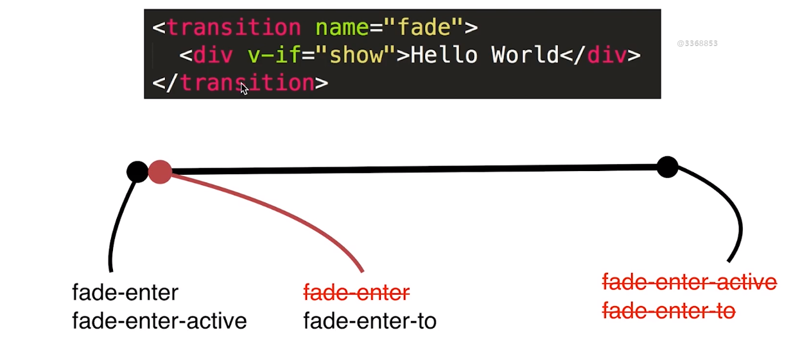
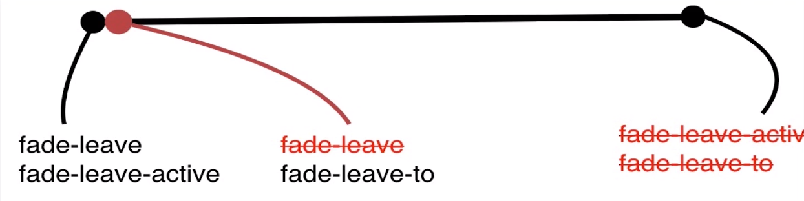

# 5.第5章 Vue 中的动画特效

[TOC]

## 5-1 Vue动画 - Vue 中 CSS 动画原理

Vue 的动画原理是使用给元素添加和删除 class 名称的方式配合 CSS 属性 transition 来实现的，但需要给使用动画的元素包裹一层`transition`标签，并且需要`name`属性来指定 class 名称的开始，然后就需要根据以下两张图示来添加一些 CSS 规则，图示：





通过这两张图示，可以很清楚的看到，当元素出现时的第一帧会给元素添加`name-enter`、`name-enter-active`的类名，而开始动画后就会删除`name-enter`而添加`name-enter-to`，动画结束的那一刻会删除`name-enter-active`和`name-enter-to`，当元素消失时同理。那么如何实现的动画呢？

`name-enter-active`是始终存在的类名，因此我们将过渡动画的 transition 属性放到这个类中，用于定义哪些属性需要执行动画（*transition-property*），执行多久（*transition-duration*），如何执行（*transition-timing-function*），延迟多久开始（*transition-delay*）。

而使用`name-enter`、`name-enter-to`、`name-leave`、`name-leave-to`来决定执行怎么样的效果，是移动到哪里去？是消失？是出现？是改变颜色？旋转？等等。

> 这里我想作一些补充。
>
> - 无论元素出现还是元素消失，实际上在最后都会将所有的 class 类给删除掉。
> - 动画是根据开始状态和开始之后状态来自动我们完成动画的，因此，需要关注的是开始与开始之后第二帧的状态。

以下是实现了简单淡入淡出效果的动画：

```html
<div id="root">
  <transition name="fade">
    <div v-if="isShow">Hello World - {{ isShow }}</div>
  </transition>
  <button @click="isShow = !isShow">Toggle</button>
</div>
```

```css
.fade-enter,
.fade-leave-to{
  opacity: 0;
}
.fade-enter-active,
.fade-leave-active{
  transition: all 1s;
}
```

```js
const vm = new Vue({
  el: '#root',
  data: {
  	isShow: true
  }
})
```

- 在元素中绑定事件时，也可以执行表达式，如上`@click="isShow = !isShow"`
- 实际上，当你想要的动画在出现元素与元素消失是一样的效果，那么
  - `name-enter-active`与`name-leave-active`应该是相同的属性，因为它们实现了相同的动画效果。
  - `name-enter`与`name-leave-to`应该是相同的属性，因为开始与消失是相反的动画，那么`name-enter`与`name-leave`决定了动画开始状态，`name-enter-to`与`name-leave-to`是动画开始之后的状态，`name-enter`与`name-enter-to`应该是相反的，而`name-leave`与`name-leave-to`应该是相反的。在上述情况下，类属性的反面的反面就是其自身，所以`name-enter`与`name-leave-to`相同。


## 5-2 在 Vue 中使用 animate.css 库

上节课实现了使用`<transiton>`组件与 transition 属性的过渡动画，这节课将实现使用`<transition>`组件与 animation 属性的 keyframes 定义的动画，并且将使用`<transition>`的`enter-active-class`与`leave-active-class`属性来自动添加我们自己的类名，从而使用 animated.css 库。

### keyframes 与 animation 实现动画

在使用上节课 HTML 和 JS 的情况下，只需要更改一下其 CSS 即可：

```css
@keyframes bounce-in{
  0%{
    transform: scale(0)
  }
  50%{
    transform: scale(1.2)
  }
  100%{
    transform: scale(1)
  }
}
.fade-enter-active{
  transform-origin: 2% center;
  animation: bounce-in .5s;
}
.fade-leave-active{
  transform-origin: 2% center;
  animation: bounce-in .5s reverse;
}
```

- 创建一个动画 bounce-in
- 然后分别在`fade-enter-active`于`face-leave-active`这两个元素`transition`组件自动帮我们添加的，在出现与消失的一开始并且直到动画结束都会存在的类中，添加`animation`属性，并且记得 leave 时的动画与出现时相反。
- 而修改`transform-origin`是因为其动画的默认原点为元素的中心，即 50% 50% 的地方，而在默认的 div 中，div 其实是占整个页面宽度的，那么原点的位置就会在离这个示例文字位置较远的地方，这样的动画效果不是我们所预期的那样，所以将原点位置改为了 2% center


### 自定义 class 与 animated.css 库实现动画

只需要引入 animated.css 文件，然后再更改一下 html 部分即可：

```html
<transition enter-active-class="animated shake" leave-active-class="animated flash">
  <div v-if="isShow2">Hello World2 - {{ isShow }}</div>
</transition>
<button @click="isShow2 = !isShow2">Toggle</button>
```

- 使用`enter-active-class`与`leave-active-class`来自定义需要在出现与消失时添加的类名。
- 使用 animated.css 库，是添加一个`.animated` 类和一定动画类一起使用。

> 实际上使用 animated.css 这个库和我们直接使用 keyframes 是一样的，animated 只是做了封装。

## 5-3 在Vue中同时使用过渡和动画（animation）

### appear 属性来实现[初始渲染的过渡](https://cn.vuejs.org/v2/guide/transitions.html#%E5%88%9D%E5%A7%8B%E6%B8%B2%E6%9F%93%E7%9A%84%E8%BF%87%E6%B8%A1)

上节课的内容是，当元素要消失和重新出现时才会执行动画，但是如果想要一开始加载页面时元素就能有动画效果的话，我们就需要做两件事，一是给`transition`组件添加`appear`属性表示元素只要一出现就会添加类，二是通过`appear-active-class`属性添加一个类名，如下：

```html
<transition 
            appear
            enter-active-class="animated shake" 
            leave-active-class="animated flash"
            appear-active-class="animated bounce">
  <div v-if="isShow2">Hello World2 - {{ isShow }}</div>
</transition>
```


### 同时使用过渡和动画

其实这里指的同时使用动画和过渡的意思是，同时添加具有动画的类与过渡的类。无论是过渡还是动画，决定动画效果的类，一般都是放在`enter-active-class`与`leave-active-class`中，所以想要同时实现动画与过渡，那么就是同时在这两个活动类中添加实现动画与过渡的类，如下：

```css
.fade-enter,
.fade-leave-to{
  opacity: 0;
}

.fade-enter-active,
.fade-leave-active{
  transition: all 2s;
}
```

```html
<transition
            name="fade"
            appear
            enter-active-class="animated shake fade-enter-active"
            leave-active-class="animated flash fade-leave-active"
            appear-active-class="animated bounce"
            >
  <div v-if="isShow2">Hello World2 - {{ isShow }}</div>
</transition>
```

- 需要注意，过渡动画除了依赖`name-enter-active`class 以外，还依赖于`name-enter`、`name-enter-to`等 class（leave同理），所以需要通过添加`name`属性来让`transition`组件自动添加这些类名，当然也可以通过添加相应的属性来手动添加，比如`name-enter`class 你可以通过添加`name-class`属性来添加（其余同理），但这些类都会在整个元素的动画过程中自动添加。


### 动画时间问题

上面同时执行 keyframes 动画与过渡动画效果存在一个问题，两者之间的时间不同，比如上面 animated 类中定义了 duration 为 1s，而`fade-enter-active`中定义的`transition-duration`为 2s，那整个动画是以哪个时间为结束呢？（因为结束时会删除这些 class）这种情况对于 vue 的本身而言也是不确定的，所以就会产生一会儿是以 2s 一会儿是以 1s 的情况。

那么对于这个问题，其实可以手动来进行设置，通过`type`属性来指定以哪一种动画方式的时间长度为主。比如上述情况，肯定是以长的时间为主，否则会很突兀，那么`type`的值就应该为`transition`，如下：

```html
<transition
            name="fade"
            type="transition"
            appear
            enter-active-class="animated shake fade-enter-active"
            leave-active-class="animated bounce fade-leave-active"
            appear-active-class="animated bounce"
            >
  <div v-if="isShow2">Hello World2 - {{ isShow }}</div>
</transition>
```

- 不过这样会出现一个新的问题，`appear-active-class`所定义的出场动画没起作用，原因应该是时间长短现在是以`transition`为主的，然而一开始是灭有`transition`动画效果的。


那么，实际上也可以自定义时长，使用`:duration`属性，属性值为默认 ms 单位的 number 值，如下：

```html
<transition
            :duration="5000"
            name="fade"
            appear
            enter-active-class="animated shake fade-enter-active"
            leave-active-class="animated bounce fade-leave-active"
            appear-active-class="animated bounce"
 >
  <div v-if="isShow2">Hello World2 - {{ isShow }}</div>
</transition>
```

- 注意，这里的 5000ms 并不是指动画会以 5s 去执行，而是指类的取消时间，5s 以后才确定为动画执行完毕，但实际上动画效果结束是 2s（因为 transition 比 keyframes 长）。所以所谓的动画执行完毕是指告诉 vue，这组元素动画执行完毕了，你应该将一些 class 删除，包括上面的 type 属性也是这个意思。


这个`:duration`还是传入对象的方式来单独对 enter 动画与 leave 动画设置其动画的时长，如下：

```html
<transition
            :duration="{enter:5000, leave: 3000}"
            name="fade"
            appear
            enter-active-class="animated shake fade-enter-active"
            leave-active-class="animated bounce fade-leave-active"
            appear-active-class="animated bounce"
            >
  <div v-if="isShow2">Hello World2 - {{ isShow }}</div>
</transition>
```

- 这样进场动画的类会在 5s 后被删除，而出场动画会在 3s 后被删除。


### 5-4 Vue中的 Js 动画与 Velocity.js 的结合

除了使用 css 来实现动画以外，`transition`组件也提供了一些钩子函数来让我们可以通过 js 的方式实现动画效果。

有如下这些钩子：

```html
<transition
  v-on:before-enter="beforeEnter"
  v-on:enter="enter"
  v-on:after-enter="afterEnter"
  v-on:enter-cancelled="enterCancelled"

  v-on:before-leave="beforeLeave"
  v-on:leave="leave"
  v-on:after-leave="afterLeave"
  v-on:leave-cancelled="leaveCancelled"
>
  <!-- ... -->
</transition>
```

```js
// ...
methods: {
  // --------
  // 进入中
  // --------

  beforeEnter: function (el) {
    // ...
  },
  // 当与 CSS 结合使用时
  // 回调函数 done 是可选的
  enter: function (el, done) {
    // ...
    done()
  },
  afterEnter: function (el) {
    // ...
  },
  enterCancelled: function (el) {
    // ...
  },

  // --------
  // 离开时
  // --------

  beforeLeave: function (el) {
    // ...
  },
  // 当与 CSS 结合使用时
  // 回调函数 done 是可选的
  leave: function (el, done) {
    // ...
    done()
  },
  afterLeave: function (el) {
    // ...
  },
  // leaveCancelled 只用于 v-show 中
  leaveCancelled: function (el) {
    // ...
  }
}
```

- done 回调的执行是告诉 vue，动画已经执行完毕，那么就可以执行下一个钩子了。

  > [官方提示](https://cn.vuejs.org/v2/guide/transitions.html#JavaScript-%E9%92%A9%E5%AD%90)
  >
  > 当只用 JavaScript 过渡的时候，**在 enter 和 leave 中必须使用 done 进行回调**。否则，它们将被同步调用，过渡会立即完成。
  >
  > 推荐对于仅使用 JavaScript 过渡的元素添加 `v-bind:css="false"`，Vue 会跳过 CSS 的检测。这也可以避免过渡过程中 CSS 的影响。


一个简单的例子：

```html
<transition
            @before-enter="beforeEnter"
            @enter="enter"
            @after-enter="afterEnter"
            >
  <div v-if="isShow">Hello World - {{ isShow }}</div>
</transition>
```

```js
const vm = new Vue({
  el: '#root',
  data: {
    isShow: true
  },
  methods: {
    beforeEnter(el) {
      el.style.color = 'red'
    },
    enter(el, done) {
      setTimeout(() => {
        el.style.color = 'green'
      }, 1000)

      setTimeout(() => {
        done()
      }, 2000)
    },
    afterEnter(el) {
      el.style.color = 'black'
    }
  }
})
```

- 注意 setTimeout 其实可以认为是一个异步函数，所以当出现两个 setTimeout 的时候，如果要先后执行，就需要计算好时间，比如上述情况中是相隔 1s，那么一个是 1000ms 另一个是 2000ms，如果都是相同 1000ms，那么会在同一时刻执行。

- 上述是入场动画 enter，那么出场 leave 是相同的。


### 使用 Velocity.js 实现动画

> [官网](http://velocityjs.org/)

先下载。

一个简单的例子：

```html
<transition
            @before-enter="beforeEnter2"
            @enter="enter2"
            @after-enter="afterEnter2"
            >
  <div v-if="isShow2">Hello World2 - {{ isShow }}</div>
</transition>
```

```js
methods:{
  beforeEnter2(el) {
    el.style.opacity = 0
  },
  enter2(el, done) {
    Velocity(el, { opacity: 1 }, { duration: 1000, complete: done })
  },
  afterEnter2(el) {
    console.log('入场动画结束')   },
}
```

- 需要注意通过 complete 属性来执行 done 函数，否则不会执行之后的 afterEnter2 函数。

- 注意 velocity 的版本，比如官方上的例子就是因为版本问题而无法在我的本地执行。


## 5-5 Vue中多个元素或组件的过渡

### 多个元素的过渡及 mode 特定

对于以上的示例，`transition`组件中只有一个子元素，那么如果有多个子元素，并且想要实现在这些元素中切换呢？比如下面这样的 html 结构：

```html
<transition name="fade">
  <div v-if="isShow">Hello World - {{ isShow }}</div>
  <div v-else>Bey World</div>
</transition>
```

- 通过 `v-if`和`v-else`指令，让两个 div 相互切换。
- 不过并不会实现效果，原因在于 vue 会对相同元素进行复用，因此上述 HTML 中，两个 div 在交替时会被当做一个 div 来，isShow 的变化只会让 div 中的内容发生变化，也就不会有动画效果。那么可以通过给这两个 div 添加不同的特性`key`来帮助 vue 将其区别。如下：

```html
<transition name="fade">
  <div v-if="isShow" key="topDiv">Hello World - {{ isShow }}</div>
  <div v-else key="bottomDiv">Bey World</div>
</transition>
```

- 不过呢，这样出现的效果是两个 div 的出场和入场同时发生，当 topDiv 出场时，bottomDiv 在入场。
- 如果我们想要出场 div 动画结束之后再让入场 div 动画开始，就需要使用特性 `mode`，它有两个值`in-out`和`out-in`
  - `in-out`：新元素先进行过渡，完成之后当前元素过渡离开。
  - `out-in`：当前元素先进行过渡，完成之后新元素过渡进入。

所以，如果想要让当前 div 先进行过渡，那么我们就得使用 `mode=“out-in”`，如下

```html
<transition name="fade" mode="out-in">
  <div v-if="isShow" key="topDiv">Hello World - {{ isShow }}</div>
  <div v-else key="bottomDiv">Bey World</div>
</transition>
```


### 多个组件过渡

假设现在我们有两个组件`child-one`与`child-two`，如下：

```js
Vue.component('child-one',{
template:'<div>child-one</div>'
})

Vue.component('child-two',{
template:'<div>child-two</div>'
})
```

如果我们希望实现在这两个组件之间的动画切换，应该如何做？

第一种方式和上面使用多个元素的方式相同，如下：

```html
<transition name="fade" mode="out-in">
  <child-one v-if="isShow" ></child-one>
  <child-two v-else ></child-two>
</transition>
```

- 使用这种方式就是利用`v-if`和`v-else`指令通过一个 data 属性来进行切换
- 多个组件不需要添加 key 来区别标识


第二种方式是使用动态组件`component`元素，通过`:is` 特性，通过改变其值来加载不同的组件，如下：

```html
<transition name="fade" mode="out-in">
  <component :is="childType"></component>
</transition>
<button
        @click="childType === 'child-one' ? (childType ='child-two') : (childType = 'child-one')"
        >
  Toggle
</button>
```

- 这里需要注意，@click 特性中可以执行一个三元表达式，但并不是让其返回 ‘child-two’ 或者 ‘child-one’，而是要给 childType 属性赋值。


## 5-6 Vue中的列表过渡

首先要情绪，使用`<transition>`组件其内部只能渲染一个子元素，如果有多个子元素，则只会渲染第一个，那么如果有多个子元素要怎么办呢？

这种多个子元素最多的情况就是使用一个列表进行循环多个元素，如下这样：

```js
const vm = new Vue({
  el: '#root',
  data: {
    listKey: 0,
    list: []
  },
  methods: {
    addItem() {
      this.list.push({
        id: this.listKey
      })
      this.listKey++
    }
  }
})
```

```html
<transition>
  <div v-for="(item,index) of list" :key="item.id">Hello --- {{index}}</div>
</transition>
```

- `key`特性记得使用 `:key`，否则永远是字符串 “item.id”

- 在`this.list.push`方法中的 `this` 依然指向这个实例

- 这里使用 `<transiton>`来包裹循环列表会出现一下提示：

  > Vue warn: `<transition>` can only be used on a single element. Use `<transition-group>` for lists.
  >
  > Vue警告:<transition>只能在单个元素上使用。列表使用<transition-group>。

所以，改为使用`<transition-group>`，如下：

```html
<transition-group>
  <div v-for="(item,index) of list" :key="item.id">Hello --- {{index}}</div>
</transition-group>
```

上面这样还并不能实现，动画所以我们给它添加`name=“fade”`以后就会有动画效果了。

不过这里我们如果不添加 name 特性也是可以通过一些特别的 class 来实现动画的，比如一下这些 css：

```css
.v-enter,
.v-leave-to {
  opacity: 0;
}
.v-enter-active,
.v-leave-active {
  transition: all 1s;
}
```

- 这应该是因为在不添加任何 name 的情况下，默认 name 为 v


好，通过`<transition-group>`组件能够实现列表的动画效果，其实这种方式我们可以理解成这样，列表中的每一项都自动在其外层添加了一个`<transition>`组件来帮助元素在出场与入场时实现动画，像这样：

```html
<transition-group>
  <div v-for="(item,index) of list" :key="item.id">Hello --- {{index}}</div>
</transition-group>

<!-- 上面可以理解为下面这样 -->

<transition>
	<div key="0">Hello --- 0</div>
</transition>
<transition>
	<div key="1">Hello --- 1</div>
</transition>
<transition>
	<div key="2">Hello --- 2</div>
</transition>
...
```


> 更多炫酷的效果可以去查看 [官方示例](https://cn.vuejs.org/v2/guide/transitions.html#%E5%88%97%E8%A1%A8%E7%9A%84%E8%BF%9B%E5%85%A5-%E7%A6%BB%E5%BC%80%E8%BF%87%E6%B8%A1)
>
> 这里引用一下官方的一句话：唯一的限制是你的想象力。


## 5-7 Vue 中的动画封装

利用动画封装来使动画能够复用。

在 vue 中对于动画的封装可以使用组件的形式。比如：

```js
Vue.component('fade', {
  props: ['show'],
  template: `<transition>
								<slot v-if="show"></slot>
						 </transition>`
})
```

```html
<div class="right">
  <fade :show="isShow"><div>Hello World</div></fade>
  <fade :show="isShow"><h1>Hello World</h1></fade>
</div>
```

- 这里我们创建了一个叫做`fade`的动画组件，然后只需要给这个组件插槽内写一些内容，这些内容就可以实现动画效果。
- 注意这里我们没有给`transition`组件添加`name`特性，因为我们直接使用了默认的`v`值


除了直接利用 css 来封装以外，我们还可以使用 js 动画，将一些动画钩子进行封装，如下：

```js
Vue.component('fade-with-js', {
  props: ['show'],
  template: `<transition
                name="other"
                @before-enter="beforeEnter"
                @enter="enter"
                @leave="leave"
              ><slot v-if="show"></slot></transition>`,
  methods: {
    beforeEnter(el) {
      el.style.opacity = 0
    },
    enter(el, done) {
      Velocity(el, { opacity: 1 }, { duration: 500, complete: done })
    },
    leave(el, done) {
      Velocity(el, { opacity: 0 }, { duration: 500, complete: done })
    }
  }
})
```


## 5-8 本章小节

这节讲解了如下内容：

- `<transition>`组件的 `name`特性 `mode`特定
- 使用过渡来实现动画
- 使用 `@keyframes`来实现动画
- 使用 js 来实现动画
- animated.css 和 velocity.js 动画库
- 多个元素和多个组件切换的动画
- 列表动画


### 动态过渡

当你使用 Velocity.js 来实现 js 动画效果时，里面的所有参数都可以通过变量来动态改变。


### 状态过渡

比如数字的变化，你输入一个 1000，数字会从 1 逐渐动态的变到 1000，又比如颜色，会从一个颜色慢慢的变到另一个颜色。

直接使用 Tweenjs 来实现，更多内容可以去查看 [官方文档](https://cn.vuejs.org/v2/guide/transitioning-state.html)


> 老师就是那种单页应用,页面之间的切换动画怎么做啊？
>
> - 在路由内容的外层包裹一个transition标签，定义动画就可以了


