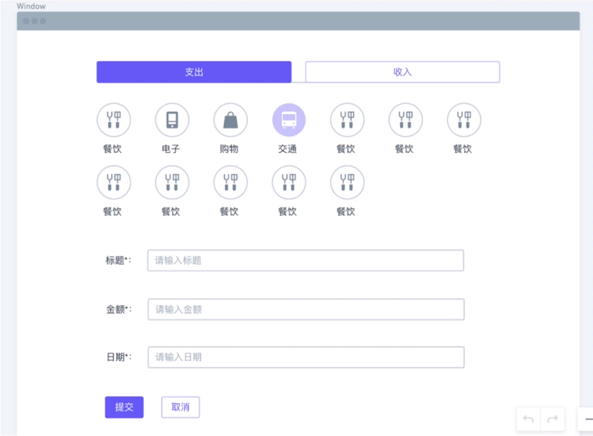

# 第 2 章 设计稿：从蓝图开始

[TOC]

## 2-1 从分析设计稿开始

老板现在想要开发一个记账软件项目，设计师加班加点的完成了第一版的原型图，对于程序员的我们肯定已经迫不及待的想要通过代码来实现它，但是**我们在动手写代码之前应该仔细的观察一些时间和分析一下原型图（wireframe 线框图）的结构**。

### 原型图

#### 首页


- 最上面的 Header 部分
  - 有一个**下拉框**，用于显示当前的年月，当点击这个下拉框则会显示如下下拉菜单：
    - 
    - 当点击月份后会关闭这个下拉列表，并更新下拉菜单框中的内容
  - 除了选择月份的下拉菜单以外，还有显示当月收入与支出的文本内容。
- tab 用于切换不同的视图
- 一个点击后跳转到创建页面的按钮
- 显示本月记账的所有条目列表
  - 图标
  - 标题
  - 金额
  - 日期
  - 编辑与删除按钮

**首页功能分析**

- 显示当前年和月份
- 点击下拉框出现前后五年和 12 个月份，点击月份后，会切换到新的记账记录
- 统计这个月收入支出总和
- 点击 Tab 切换不同视图
- 点击创建按钮跳转到创建页面
- 显示本月记账记录的所有条目，每个条目会显示分类图标、标题、钱数、日期、编辑和删除按钮
- 点击编辑按钮会跳转到编辑页面
- 点击删除按钮会删除该条目

#### 新建记账以及编辑



- tab 用于切换是支出还是收入
- 分类的图标按钮
- 用于填写标题、金额、日期的输入框
- 点击提交和取消的按钮

**功能分析**

- 点击 Tab 切换支出和收入分类
- 显示所有支出收入分类图标，点击分类后该图标会高亮显示并且会取消其他图标的高亮效果
- 三个 input 框，根据类型会做简单的验证，比如不能为空，金额只能输入数字（日期这里的设计有问题）
- 点击提交按钮，如果验证未通过，显示提示；如果通过，跳转到首页。
- 点击取消按钮，直接跳转到首页。

#### 首页的图表视图


- 这是首页上点击「图表模式」后所显示的饼图


### 拆分页面：根据原型图很直观的拆分

- 首页：列表模式
- 新建记账条目页
- 编辑记账条目页（有可能和新建公用）
- 首页：图表模式（有可能和首页公用）


下节课我们将讲解代码的文件结构、编码规范、命名规范


## 2-2 文件代码结构

> tree 命令不是 node 的，它是一个标准的 linux 命令，如果你使用 mac 的话，可以这样安装 
>
> brew install tree
>
> 终端的话 你可以使用 iTerm2 这个软件，然后安装 oh-my-zsh, 里面有各种插件 你可以自己研究哈： https://github.com/robbyrussell/oh-my-zsh

在公司中进行工作，很多项目都是协同合作开发，因此对于每个人而言，其代码风格和命名习惯会有差异，为了使代码更易管理和阅读，需要将代码风格进行统一。

### 组件的划分

React 项目是由一个个组件所构成的，而组件分为两大类：

- 容器组件
- 展示组件

#### 展示组件

比如我们来看原型图中的月份选择器：


这个组件只关心数据的展示方式，并不关心外面的数据是如何加载和变化，只需要通过 props 接受数据和一些回调函数，因此这个组件具有良好的复用性，我们可以将这个组件放到不同的页面和不同的项目中使用。

**展示型组件特点：**

- 关心数据的展示方式
- 不依赖 app 中的其他文件，作为一个个体单独存在
- 不关心数据是如何加载和变化的
- 仅通过 props 接收数据和回调函数
- 除非需要用到 state和生命周期函数，或者为了性能优化，通常写成**函数式组件**

#### 容器组件

比如首页：


虽然对于一个容器组件而言，页面相对比较大，但是我们只需要了解容器组件其作用。

容器组件非常关心数据的运作方式，数据如何加载？如何获取？如何发送请求？这些都是容器组件所需要做的事情。因此，容器组件也是有状态的组件。

容器组件**为展示组件提供数据源和数据操作方法**，给调用的回调函数提供了真正的数据处理方式。比如，首页中我们选择三月份的，然后就发送请求，获取相关数据。

容器组件的复用性很低，因为对于不同的页面而言其数据接口往往不同。

**容器性组件特点：**

- 关心数据的运作方式（比如数据如何加载）
- 为展示型组件提供数据和操作数据的方法
- 为展示型组件提供回调函数
- 通常是有状态的，并且作为数据源存在


#### 组件划分的好处

- 使**关注点分离**，更好的理解 app 和 ui，一拨人开发 ui 组件，一拨人开发 app 组件，互不影响
- 更好的**复用性**，不同的数据源中使用相同的展示型组件，也可以把他们放到不同的容器性组件中进行更进一步复用。
- 展示型组件像一个 app 的调色盘，你可以将其放到一个独立的页面中进行组合。


### 实际操作

```shell
create-react-app my-project

cd my-project/src

mkdir components  //创建一个文件夹，用于只存放展示型组件

cd components

touch ComponentName.js //创建一个组件

mkdir __test__

cd __test__

touch ComponentName.test.js //创建单元测试文件，与外面文件统一，但需加一个特殊的后缀名称

cd ..

cd ..

mkdir containers //创建一个文件夹，用于存放容器组件

cd containers/

touch ComponentName.js

mkdir __test__

cd __test__

touch ComponentName.test.js
```


### 文件结构规范的截图


#### 总结

- `components` 文件夹存放所有的展示型组件
- `containers` 文件夹存放所有的容器型组件
- 这两个文件夹下的 `__test__` 文件夹存放所有组件测试文件
- 文件使用 Pascal Case 命名法（第一个字母大写，后面每一个单词的首字母大小）
- src 根目录下放统一使用的一些文件


在使用 `create-react-app`所创建的项目中已经自带有 ES-lint 的代码规范检测，具体的规则可以到 [Airbnb React/JSX 编码规范](https://github.com/jasonBoy/javascript/tree/master/react) 进行查看。

