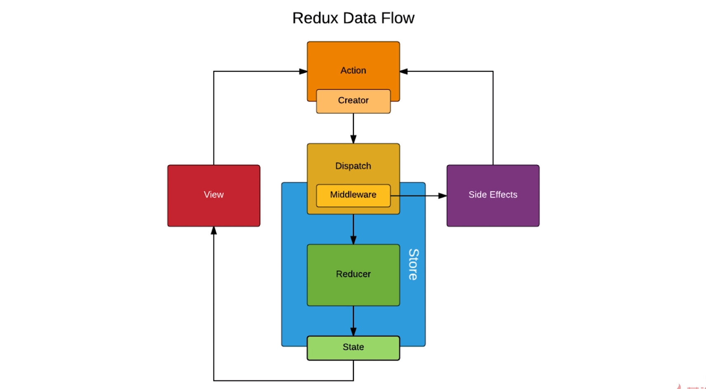

# 6. Redux 进阶

[TOC]

---

## 6.1 UI 组件和容器组件（如何拆分 UI 组件和容器组件？）

### 什么是 UI 组件与容器组件？

- UI 组件（傻瓜组件） - 负责渲染（但也可以负责逻辑）
- 容器组件（聪明组件） - 负责处理逻辑

> 这节课的内容就是将整个 TodoList 中需要渲染的地方（render() 中的 JSX）放入一个新的组件 - TodoListUI.js。
>
> 然后在 TodoList.js 中获取 store 和声明一些方法，最后将这些方法和数据传入 TodoListUI.js 组件中并渲染。

## 6.2 无状态组件

当一个组件中只使用了 render() 没有使用 state 和生命周期函数时，就可以将这个组件重构为无状态组件。

```jsx
const TodoListUI = (props) => (
	<div> {props.content} </div>
)
```

### 无状态组件优势

- 性能更高，因为只是一个函数，无生命周期函数。

### 何时使用无状态组件？

- 当我们定义一个 UI 组件时
- 或者使用的组件只使用了 render()，但这一般就为 UI 组件，并且如果 UI 组件要使用生命周期来处理逻辑则无法使用函数组件。（不过现在有了 Hook 之后，函数组件也可以使用钩子函数和 state）


## 6.3 Redux 中发送异步请求获取数据

这部分的内容其实很简单，也是之前讲过的。

在 componentDidMount() 钩子函数中使用 axios 请求数据，获得数据后将数据传入 actionCreator 中生成一个 action，将 action 分派给 store，reducer 根据 action.type 的类型执行相应的步骤改变 store 中的 state，最后由于 store 的改变执行 store.subscribe 所订阅的函数，调用 this.setState()，重新渲染页面。

```jsx
  componentDidMount(){
    axios.get('/list.json').then( res =>{
      const data = res.data
      store.dispatch(getIniListAction(data))
    })
  }
```

## 6.4 使用 Redux-thunk 中间件实现 ajax 数据请求

> 这个中间件是指 Redux 的中间件而不是 React 的。
>
> Redux-thunk 让我们能够将 action 作为一个函数分派给 store，因此可以执行一些异步操作。

### 使用 Redux-thunk 的原因

> 如果想让模块的职责分离，比如说组件只负责派发任务而不去执行异步请求，而异步请求的任务交给 actionCreator 来执行，我尝试了在 actionCreator 中不使用 thunk 来完成这个任务，但会有两个问题，一是你需要引入 store 来调用 dispatch 派发 action，二是你需要数据，引入 store 来派发任务并不是很困难，问题是数据很难在 actions 模块中获取到，所以还是需要使用 thunk 来做职责分离，并且这也算是一种封装，避免在不同的组件中都要写异步请求部分的代码。

- 如果我们将异步请求都放在 componentDidMount 中进行请求，会发现组件变得非常的臃肿，为了让代码更加整洁、清晰，我们可以利用 thunk 将异步请求放到 action 中，再将 action 放到一个地方进行统一的管理。
- 测试更加方面。如果我们去测试带有很多异步请求的 componentDidMount，会很复杂，但我们如果去测试不同的带有 Ajax 请求的 actionCreator 就会简单和高效的多。
- 提升代码的可维护性，因为将模块的职责分离开，组件并不需要去执行异步任务，只需要传递数据派发 action 即可。

如何使用？ 

- 安装 - `yarn add redux-thunk`

- 在使用 `createStore()` 函数的地方引入 `applyMiddleware` 这个方法，并引入 `thunk`。由于要使用 redux 开发者工具，因此我们还得使用 compose 来帮助我们同时使用 redux 中间件和开发者工具。

  ```jsx
  import { createStore, applyMiddleware, compose } from 'redux'
  import reducer from './reducer'
  import thunk from 'redux-thunk'
  
  // 第一种方式
  const composeEnhancers = window.__REDUX_DEVTOOLS_EXTENSION_COMPOSE__ || compose
  
  const store = createStore(
    reducer,
    composeEnhancers(applyMiddleware(thunk))
  )
  
  // 第二种方式
  const composeEnhancers =
    window.__REDUX_DEVTOOLS_EXTENSION_COMPOSE__ ?   
      window.__REDUX_DEVTOOLS_EXTENSION_COMPOSE__({
        // Specify extension’s options like name, actionsBlacklist, actionsCreators, serialize...
      }) : compose;
  
  const enhancer = composeEnhancers(
    applyMiddleware(thunk),
    // other store enhancers if any
  );
  const store = createStore(reducer, enhancer);
  ```

  更多关于 redux 开发工具扩展的内容： https://github.com/zalmoxisus/redux-devtools-extension

- 引入了中间件以后我们就可以把异步操作放到 actionCreate 中，创建一个函数 action，并将这个函数 action 传递给 store：

  ```jsx
  // 创建一个返回的函数 actionCreator
  const getTodoList = () => {
      const getIniListAction = (list) => ({
          type: INI_LIST,
          list
      })
      return (dispatch) => {
          axios.get('/list.json').then( res => {
              const data = res.data
              dispatch(getIniListAction(data))
          })
      }
  }
  
  // 将返回函数的 actionCreator 分派给 store
  componentDidMount(){
      store.dispatch(getTodoList())
  }
  ```
  
- 返回的函数 action 的第一个参数是 dispatch。实际上可以这样理解，虽然我们通过 store.dispatch(action) 将函数 action 传给了 store，但并没有真正的派发，而是在内部执行了一些操作，比如这里的异步请求，当异步请求成功后我们再将对象 action 真正的分派给 store。

## 6.5 什么是 Redux 的中间件

中间件肯定是指某个东西与 Redux 之间，那么到底是什么呢？

图示：



- 中间件是指 Action 与 Store 之间。

- 在我们使用 Thunk 中间件时，可以向 Dispatch 传递函数，而不是之前的对象，是因为我们对 Dispatch 进行了封装或者说升级。

- 流程：

  - 如果是之前没有使用中间件时，传递对象 action 给 dispatch，它会将 action 直接传递给 store 让 reducer 来改变它的状态。

  - 使用 redux-thunk 中间件的时，传递函数给 dispatch，它会先让这个函数执行，当异步获取数据之后再将数据派发给 reducer。

  - > 在引入中间件以后，dispatch 会根据参数的不同执行不同的操作。

- redux 中间件除了 redux-thunk 之外还有很多，比如 redux-logger、redux-saga（一个很火的解决 redux 异步的中间件，不同于 thunk，thunk 是将异步操作放入 action 中，而 saga 采用的设计思想是单独的把异步的逻辑拆分出来放到另一个文件中进行管理）

## 6.6&6.7 Redux-saga 中间件使用入门（1&2）

> ​	Github 地址：[redux-saga](https://github.com/redux-saga/redux-saga)
>
> 中文文档地址：[redux-saga-in-chi](https://github.com/superRaytin/redux-saga-in-chinese)

### 使用

1.首先配置使用 saga 的环境：

```jsx
import { createStore, applyMiddleware, compose } from 'redux'
import reducer from './reducer'
import createSagaMiddleware from 'redux-saga'
import todoSaga from './sagas'

const sagaMiddleware = createSagaMiddleware()

const composeEnhancers =
  window.__REDUX_DEVTOOLS_EXTENSION_COMPOSE__ ?
    window.__REDUX_DEVTOOLS_EXTENSION_COMPOSE__({
      // Specify extension’s options like name, actionsBlacklist, actionsCreators, serialize...
    }) : compose;

const enhancer = composeEnhancers(
  applyMiddleware(sagaMiddleware),
  // other store enhancers if any
);

const store = createStore(reducer, enhancer);

sagaMiddleware.run(todoSaga)

export default store
```

- 通过`createSagaMiddleware()`创建 saga 中间件
- 使用 enhancer 引入 saga 中间件
- 在创建 store 之后执行`sagaMiddleware.run()`方法并传入从 sagas.js 中导出的用于捕获 action.type 的 generator 函数

2.编写 sagas.js  文件

```jsx
import { takeEvery, put } from "redux-saga/effects"
import { INI_LIST, getInitListActionWithSaga } from "./actionCreators"
import axios from 'axios'

function* getInitList() {
  const res = yield axios.get("/api/todolist.json")
  const action = getInitListActionWithSaga(res.data)
  yield put(action)
}

// generator 函数用于捕获
function* todoSaga() {
  // 使用 takeEvery 捕捉 action
  yield takeEvery(INI_LIST, getInitList)
}

export default todoSaga
```

- R12 - 用于捕获 action 的 generator 函数，需要使用`takeEvery`方法，第一个参数为组件中所派发的`action.type`，第二个参数为派发后所要执行的函数。
- R5 - 可以理解为执行异步任务的监听方法，这里能够做的事情特别多，根据不同的场景可以使用 saga 所提供的 API 来处理不同的任务需求，我们这里只是简单的执行了异步请求。
- R6 - 使用`yield`关键字可以获取到异步获取的数据
- R8 - 需要使用`yield`和`put`方法来完成将 action 派发给 reducer 的任务

3.在组件中派发任务

```jsx
store.dispatch(getIniListAction())
```

- 这里需要注意在组件中派发的 action 与在 saga 中所派发的 action 是不同的，否则会发生循环调用
- 这个派发任务也会被 reducer 接收到，同时被 saga 也接收到

### 官方处理错误的示例

```jsx
import { call, put, takeEvery, takeLatest } from 'redux-saga/effects'
import Api from '...'

// worker Saga: will be fired on USER_FETCH_REQUESTED actions
function* fetchUser(action) {
   try {
      const user = yield call(Api.fetchUser, action.payload.userId);
      yield put({type: "USER_FETCH_SUCCEEDED", user: user});
   } catch (e) {
      yield put({type: "USER_FETCH_FAILED", message: e.message});
   }
}

/*
  Starts fetchUser on each dispatched `USER_FETCH_REQUESTED` action.
  Allows concurrent fetches of user.
*/
function* mySaga() {
  yield takeEvery("USER_FETCH_REQUESTED", fetchUser);
}

/*
  Alternatively you may use takeLatest.

  Does not allow concurrent fetches of user. If "USER_FETCH_REQUESTED" gets
  dispatched while a fetch is already pending, that pending fetch is cancelled
  and only the latest one will be run.
*/
function* mySaga() {
  yield takeLatest("USER_FETCH_REQUESTED", fetchUser);
}

export default mySaga;
```

- R6 - 使用`try…catch`来处理错误，方法是派发不同的 a


## 6.8 如何使用 React-Redux（1）

### 什么是 React-Redux？

React-Redux 是一个第三方的模块。

redux 是数据层框架，react-redux 是工具，方便你在 react 中使用 redux

> 在刚开始学习的时候，不建议去利用自动补全来写，而是一个字一个字的来打，这样有助于记忆。

如何使用 React-Redux？

- 安装 `react-redux` 这个包，然后将 `Provider` 组件引入渲染页面的入口处，将要被渲染的组建使用 `Provider` 包裹起来，传入 store 的值：

  ```jsx
  import {Provider} from 'react-redux'
  import store from './store'
  
  const App =(
  	<Provider store={store}>
      	<TodoList />
      </Provider>
  )
  
  ReactDom.render( App, document.getElementById('root'))
  ```

  - Provider 供应器为其子组件提供 store，其子组件便可直接使用 store 的值。

  - > 使用的是 React context 部分内容实现，据说 16.4 更新了新的功能，react-redux 也会跟着升级。

- 要在组件中使用 store 的值，需要在相应组件中引入 connect 这个函数，并将组件传入到 connect 返回函数的参数中并导出，从而让组件与 store 做一个连接。其连接方式是使用 `mapStateToProps`和 `mapdispatchToProps` 两个函数参数：

  ```jsx
  // 在 TodoList.js 中
  import { connect } from 'react-redux'
  
      const mapStateToProps = (state, ownProps) => {
        return {
          inputValue: state.inputValue,
          list: state.list
        }
      }
      
      const mapDispatchToProps = (dispatch, ownProps) => {
        return {
          // 提交输入框的内容到列表中
          handleClick: () => {
            const action = getAddItemAction()
            dispatch(action)
          },
          // 改变输入框内容
          handleInputChange: e => {
            const action = getInputValueAction(e.target.value)
            dispatch(action)
          },
          // 删除列表项
          handleDeleteItem(index) {
            const action = getDeleteItemAction(index)
            dispatch(action)
          }
        }
      }
  	
  export default connect(mapStateToProps,mapdispatchToProps)(TodoList)
  ```

  - `connect` 方法是将组件与 store 做一个连接，我们所导出的 `connect` 方法的执行结果，它将这些印射关系集成到了 TodoList 组件中，所以这里可以将 TodoList 当作是一个 UI 组件接受，而 `connect` 返回的是一个容器组件。
  - `mapStateToProps` 将 store 中的 state 映射到组件的 props 中，`mapDispatchToProps` 将分派的行为映射到组件的 props 中，从而连接了组件与 store。
  - `ownProps` 函参只包含其组件自身的 props，而不包含其映射的 props。
  -  `mapDispatchToProps` 主要任务是分派 `action`，操作与判断数据在 `reduce`中进行。
  - 使用 `connect` 过后，数据改变就会重新渲染页面。

- 可以在 render() 函数中使用解构赋值来精简代码：

  ```jsx
  class TodoList extends React.Component {
  
    render() {
      const { inputValue, handleInputChange, handleClick, handleDeleteItem, list } = this.props
    }
  }
  ```

> 在学习的过程中，最好是去认真的思考数据的流动、各种函数方法的功能，将函数作为一个工具或者说帮手来看待，了解他们到底在帮助你做什么工作。