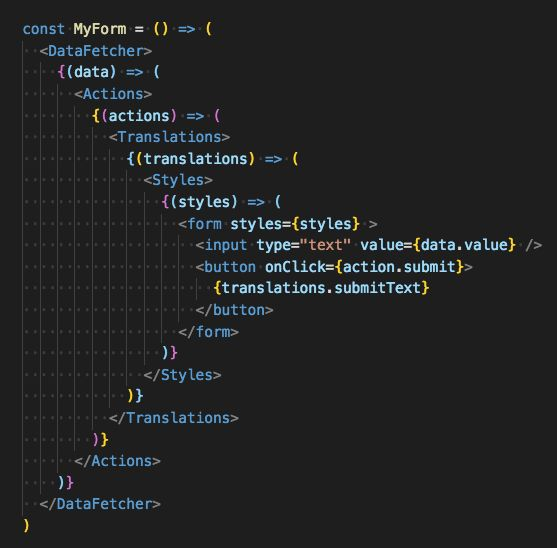
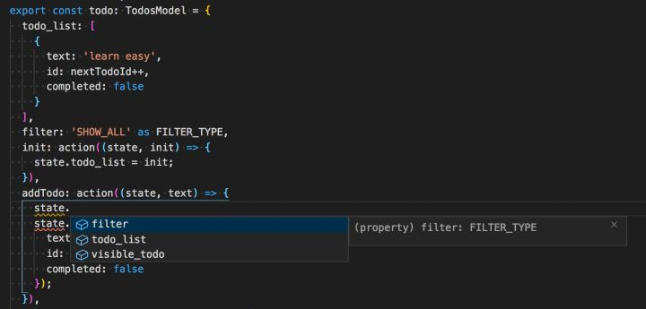
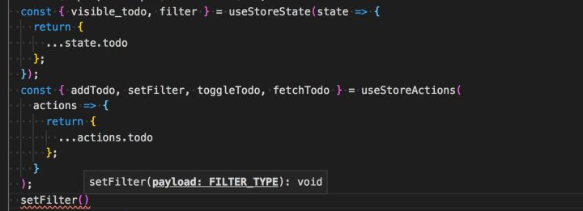

# React Hooks（一） From Redux to Hooks

[toc]

如今的react的状态管理工具基本上分为redux和mobx两个流派，mobx基本上大家都是使用官方的mobx库，但是对于redux却衍生数不胜数的redux框架。如`redux-saga`, `dva`, `mirror`, `rematch`等等，这么多redux的框架一方面说明redux是如此流行，另一方面也表明 redux自身的先天不足，笔者本人也是从最初的刀耕火种时代一路走来。

## 最原始的redux

```text
// action_constant.js
// action_creator.js
// action.js
// reducer.js
// store.js
// 再加上一堆的middleware
```

每次改一点业务动辄就需要改四五个文件，着实令人心累，而且不同业务对redux文件的组织方式也不同，有的按照**组件进行组织**，有的按照**功能进行组织**，每次看新的业务都得熟悉半天，对异步的支持也基本上就使用redux-thunk、redux-promise等，**遇到复杂的异步处理，代码十分的晦涩难懂**。

## redux duck

后来社区为了避免每次修改都要修改一堆文件和制定文件规范，推出了`ducks-modular-redux`规范，将每个子module的文件都放置到一个文件里，这样大大简化了日常开发中一些冗余工作。

```js
// widgets.js

// Actions
const LOAD   = 'my-app/widgets/LOAD';
const CREATE = 'my-app/widgets/CREATE';
const UPDATE = 'my-app/widgets/UPDATE';
const REMOVE = 'my-app/widgets/REMOVE';

// Reducer
export default function reducer(state = {}, action = {}) {
  switch (action.type) {
    // do reducer stuff
    default: return state;
  }
}

// Action Creators
export function loadWidgets() {
  return { type: LOAD };
}

export function createWidget(widget) {
  return { type: CREATE, widget };
}

export function updateWidget(widget) {
  return { type: UPDATE, widget };
}

export function removeWidget(widget) {
  return { type: REMOVE, widget };
}

// side effects, only as applicable
// e.g. thunks, epics, etc
export function getWidget () {
  return dispatch => get('/widget').then(widget => dispatch(updateWidget(widget)))
}
```

笔者的之前维护的一个老项目至今仍然采用这种方式。

## rematch | dva

duck modular proposal虽然一定程度上减小了维护成本，但本质上并没有减小每次开发业务的代码量，异步等问题仍然没有得到解决，因此开始衍生出了一大堆的基于redux的框架，**重点在于解决简化样板代码量和复杂异步流程的处理**。
样板代码简化的思路基本上是一致的。我们发现绝大部分的业务model都满足如下性质

```JS
const model = createModel({
  name: // 全局的key
  state:xxx, // 业务状态
  reducers:xxx, // 同步的action
  effects:xxxx, // 异步的action
  computed: xxx // state的衍生数据
}
```

因此绝大部分框架的都采用了类似的定义，区别只在于语法和名称有所不同

- dva

```js
// dva.js
export default {
  namespace: 'products',
  state: [],
  reducers: {
    'delete'(state, { payload: id }) {
      return state.filter(item => item.id !== id);
    },
  },
 effects: {
   *add(action, { call, put }) {
      yield call(delay, 1000);
      yield put({ type: 'minus' });
    }
 } 
};
```

- rematch

```js
export const count = {
  state: 0, // initial state
  reducers: {
    // handle state changes with pure functions
    increment(state, payload) {
      return state + payload
    }
  },
  effects: (dispatch) => ({
    // handle state changes with impure functions.
    // use async/await for async actions
    async incrementAsync(payload, rootState) {
      await new Promise(resolve => setTimeout(resolve, 1000))
      dispatch.count.increment(payload)
    }
  })
}
```

两者的区别主要在于对异步的处理，dva选择了用generator，而rematch选择了用async/await。
首先我们回顾一下redux-thunk里是如何处理异步流的

```js
const fetch_data = url => (dispatch, getState) =>{
  dispatch({
    type: 'loading',
    payload: true
  })
  fetch(url).then((response) => {
    dispatch({
      type: 'data',
      payload: response
    })
    dispatch({
      type: 'loading',
      payload: false
    })
  }).catch((err) => {
    dispatch({
      type: 'error',
      payload: err.message
    })
    dispatch({
      type: 'loading',
      payload: false
    })
  })
}
```

一个简单的拉取数据的逻辑就显得如此繁杂，更别提如何将多个异步action组合起来构成更加复杂的业务逻辑了（我已经不知道咋写了）
async/await 和generator的最大优点在于1. 其可以使用看似同步的方式组织异步流程 2.各个异步流程能够很容易的组合到一起。具体使用哪一个全看个人喜好了。
如上面同样的逻辑在rematch里的写法如下

```jsx
const todo = createModel({
  effects: ({todo}) => ({
    async fetch_data(url) { 
      todo.setLoading(true);
      try {
        const response = fetch(url);
        todo.setLoading(false);
      }catch(err){
        todo.setLoading(false);
        todo.setError(err.message)
      }
    },
    async serial_fetch_data_list(url_list){
      const result = []
      for(const url of url_list){
        const resp = await todo.fetch_data(url);
        result.push(resp);
      }
      return result;
    }
  })
})
```

得益于async/await的支持，现在无论是异步action本身的编写还是多个异步action的组合现在都不是问题了。

我们现在的绝大部分新业务，基本上都还是采用rematch，相比之前纯redux的开发体验，得到了很大的改善，但是仍然不是尽善尽美，仍然存在如下一些问题。

## Typescript支持

9102年了，Typescript已经大大普及，稍微上点规模的业务，Typescript的使用已经是大势所趋，Typescript的好处就不多赘述，我们基本上所有的业务都是使用Typescript进行开发，在日常开发过程中基本上碰到的最大问题就是库的支持。
俗话所说，Typescript坑不太多（其实也多），库的坑不太多，但是Typescript和库结合者使用，坑就很多了。很不幸Dva和Rematch等都缺乏对Typescript的良好支持，对日常业务开发造成了不小的影响，笔者就曾经针对如何修复Rematch的类型问题，写过一篇文章https://zhuanlan.zhihu.com/p/78741920 ，但是这仍然是个hack的办法，dva的ts支持就更差了，generator的类型安全在ts3.6版本才得以充分支持（还有不少bug），至今也没看到一个能较完美支持ts的dva例子。

## Batteries Included

redux可以说是Batteries Included的标准反例了，为了保证自己的纯粹，一方面把异步处理这个脏活，全部交给了中间件，这导致搞出了一堆的第三方的异步处理方案，另一方面其不愿做更高的抽象，导致需要编写一堆的boilerplate code还导致了各种写法。因此对于日常的业务开发来讲，一个Batteries Included库就足够重要了，即保证了编码规范，也简化了业务方的使用。
Computed State和 immutable 就是日常开发中非常重要的feature，但是rematch把两个功能都交给插件去完成，导致日常使用不够方便和第三方插件的TS支持也不尽如人意。

## 仅支持对redux状态的管理

如今react的状态和业务逻辑基本上存在于三种形态

- redux： 存放业务领域的状态，同时存放一些业务更新逻辑
- context: 主要存放一些全局配置的信息，较少变动或者不变如，主题、语言等信息
- local: 多存放UI相关的状态，如模态框的展示状态，loading状态等等。在class组件里存放于this.state中，在hook组件中存放于useState里


rematch对redux的状态管理方式基本上做到了最简，但是其仅仅只能用于redux状态的管理，对于local state的管理却无可奈何。

### local state的管理

对于大部分的简单业务，local state的管理并不麻烦，基本上就是控制一些弹窗的展示，loading的展示，在用class组件来控制业务逻辑时，处理方式也较为简单

```jsx
class App extends React.Component {
  state = {
    loading: false,
    data: null,
    err: null
  }
  async componentDidMount() {
    this.setState({loading: true})
    try {
      const result = await service.fetch_data() 
      this.setState({
        loading:false
      })
    }catch(err){
      this.setState({loading: false, error: err.message})
    }
  }
  render(){
    if(this.state.loading){
      return <div>loading....</div>
    }else{
      return <div>{this.state.data}</div>
    }
  }
}
```

这里的组件其实同时扮演了三个角色

- 状态容器

```text
state = {
    loading: false,
    data: null,
    err: null
  }
```

- 状态处理

```jsx
async componentDidMount() {
    this.setState({loading: true})
    try {
      const result = await service.fetch_data() 
      this.setState({
        loading:false
      })
    }catch(err){
      this.setState({loading: false, error: err.message})
    }
  }
```

- view

```jsx
render(){
    if(this.state.loading){
      return <div>loading....</div>
    }else{
      return <div>{this.sstate.data}</div>
    }
  }
```

这种做法有利有弊，好处在于其足够的locality,因为状态，状态处理，渲染这几部分是紧密关联的，将它们放在一起，阅读代码的看到这段代码，很自然的就能看懂
但是一个组件放置了太多的功能就导致其复用很困难。
因此衍生出了不同的**复用方式**

### 容器组件和视图组件分离：视图复用

第一种复用方式就是通过状态容器组件和视图组件将状态&&状态处理与view的逻辑进行分离，
容器组件只负责处理状态&&状态处理，视图组件只负责展示的逻辑，这样做法的最大好处在于视图组件的复用极为方便。
UI组件库可谓是这方面的极致了，我们将一些常用视图组件提取出来构成组件库，大部分的UI组件，没有状态，或者一些非受控的组件有一些内部状态。这种组件库极大的简化了日常的UI开发。上面的组件可以重构如下

```jsx
// 视图组件
class Loading extends React.Component {
  render(){
    if(this.props.loading){
      return <div>loading....</div>
    }else{
      return <div>{this.props.data}</div>
    }
  }
}
// 容器组件
class LoadingContainer extends React.Component {
  state = {
    loading: false,
    data: null,
    err: null
  }
  async componentDidMount() {
    this.setState({loading: true})
    try {
      const result = await service.fetch_data() 
      this.setState({
        loading:false
      })
    }catch(err){
      this.setState({loading: false, error: err.message})
    }
  }
  render(){
     return <Loading {...this.state} /> // 渲染逻辑交给视图组件
  }
}
// app.js
<LoadingContainer>
```

### HOC && renderProps && Hooks: 业务复用

视图组件的复用非常方便，但是**容器组件的复用就没那么简单了**。社区中衍生出了HOC和renderProps来解决状态&&状态操作的复用

- HOC

```jsx
// Loading.js
class Loading extends React.Component {
  render(){
    if(this.props.loading){
      return <div>loading....</div>
    }else{
      return <div>{this.props.data}</div>
    }
  }
}
export default withLoading(Loading);

// app.js
<Loading />
```

- renderProps

```text
<WithLoading>
  {(props) => {
    <Loading {...props} />
  }}
</WithLoading>
```

这两种方式都存在一定的问题
对于高阶组件，存在很多需要注意的地方，如[https://zh-hans.reactjs.org/docs/higher-order-components.html#caveats](https://link.zhihu.com/?target=https%3A//zh-hans.reactjs.org/docs/higher-order-components.html%23caveats) ，带来不小的心智负担，对于新手并不友好，另一个问题在于HOC对于Typescript的支持并不友好，实现一个TS友好的HOC组件有相当大的难度可参考https://www.zhihu.com/question/279911703/answer/410372076 在日常使用第三方的支持高阶组件库也经常会碰到各种TS的问题。
而renderProps虽然一定程度上摆脱了HOC存在的问题，但是其会造成render props callback hell,当我们需要同时使用多个renderprops的时候,就会编写出如下代码




这种代码无论是对代码的阅读者，还是调试element结构的时候，都会带来不小的影响。

- Hooks
  官方为了解决状态复用的问题，推出了react hooks，且解决了renderProps和HOC带来的问题，上面组件用hooks重写如下

```jsx
// hooks.js
function useLoading(){
  const [loading, setLoading] = useState(false);
  const [ error, setError] = useState(null);
  const [ data,setData] = useState(null);
  useEffect(() => {
    setLoading(true);
    fetch_data().then(resp => {
      setLoading(false);
      setData(resp);
    }).catch(err => {
      setLoading(false);
      setError(err.message)
    })
  })
}
// Loading.js
function Loading(){
  const [loading, error, data ] = useLoading();
  
    if(loading){
      return <div>loading....</div>
    }else{
      return <div>{data}</div>
    }
  
}
```

hooks的复用性特别强，事实上社区上已经积攒了很多的hook可以直接使用，如可以直接使用[https://github.com/alex-cory/use-http](https://link.zhihu.com/?target=https%3A//github.com/alex-cory/use-http)这个hooks来简化代码

```jsx
function Loading(){ 
   const { error, loading, data} = useHttp(url);
     if(loading){
      return <div>loading....</div>
    }else{
      return <div>{data}</div>
    }
}
```

hooks几乎完美解决了状态复用的问题，但是hooks本身也带来了一些问题，
hooks的心智负担并不比HOC要少，[https://zh-hans.reactjs.org/docs/hooks-faq.html](https://link.zhihu.com/?target=https%3A//zh-hans.reactjs.org/docs/hooks-faq.html) FAQ的长度可见一斑，另一个问题是hook只能使用在function里，这意味着我们需要在function里组织业务代码了

### Function && Class 谁更适合业务逻辑

刚刚从class组件转移到hook组件时，大部分人最先碰到的问题就是如何组织业务逻辑
class里的method天然的帮我们做好了业务隔离

```jsx
import React from 'react';
class App extends React.Component {
  biz1 = () =>{
  }
  biz2= () =>{
    this.biz3()
  }
  biz3= () =>{
  }
  render(){
    return (
      <div>
        <button onClick={() => this.biz1()}>dobiz1</button>
        <button onClick={() => this.biz2()}>dobiz2</button>
      </div>
    )
  }
}
```

但是到了function里，已经缺乏method的这个抽象来帮我们做业务隔离了，很有可能写成如下这种代码

```jsx
function App (){
  const [state1, setState] = useState();
  function biz1(){

  }
  biz1();
  const [state2, setState2] = useState();
  const biz2 = useCallback(() => {
    biz3();
  },[state1,state2])
  biz2();
  return (
      <div>
        <button onClick={() => biz1()}>dobiz1</button>
        <button onClick={() => biz2()}>dobiz2</button>
      </div>
    )
  function biz3(){

  }
}
```

基本上是你想怎么来就怎么来，可以有无数种写法，自己写的还好，其他读代码的人就是一头雾水了，想理清一段业务逻辑，就得反复横跳了。

当然也可以指定一些编写hook的规范如

```jsx
function APP(){
  // 这里放各种hook
 // 同步的业务逻辑
 // render逻辑
 // 业务逻辑定义
}
```

按照这种规范，上述代码如下

```jsx
function App (){
  const [state1, setState] = useState();
  const [state2, setState2] = useState(); 
  biz0();
  return (
      <div>
        <button onClick={() => biz2()}>dobiz1</button>
        <button onClick={() => biz2()}>dobiz2</button>
      </div>
    )
  function biz0(){
    // 同步代码
  }
  function biz1(){
    // 异步代码
  }
  function biz2(){
    // 异步代码
    biz3()
  }
  function biz3(){
    // utilty
  }
}
```

这样组织代码的可读性就好很多，但是这只是人为约定，也没有对应的eslint做保证，而且biz的定义也没法使用useCallback等工具了，仍然存在问题。

### 编写local state存在的问题

上面的讨论我们可以看出，尽管hooks解决了状态复用的问题，但是其代码的组织和维护存在较多问题，如何解决hooks代码的维护问题就成了个问题

### 状态全放在rematch里

rematch的状态管理比较规整，我们因此可以考虑将local state的状态管理页存放到全局的redux里，但这样会带来一些问题

- 有些状态本身不太适合放在全局，如A页面的一些UI状态切换到B页面时，我们期望丢弃掉A页面的状态，如果状态放置到A的组件里，随着A组件的卸载，状态自然而然丢弃掉，而如果放置到全局，则需要手动的进行清理
- 全局状态的泛滥：将一些局部状态放置到全局会造成全局状态的泛滥，导致难以辨别核心的业务逻辑
- 违反了局部性的原则：业务逻辑放在全局，导致阅读组件代码时，需要频繁的在组件和全局状态内进行切换

### model和view的分离

我们虽然不能将状态放在全局，我们仍然可以效仿rematch的方式，将组件拆分为view和model，view负责纯渲染，model里存放业务逻辑，借助于hooks，比较容易实现该效果，大致代码结构如下

```jsx
// models.ts
const model = {
  state:{
    data: null,
    err: null,
    loading: false
  },
  setState: action((state,new_state) => {
     Object.assign(state,new_state)
  }),
  fetch_data: effects(async (actions) => {
     const { setState } = actions;
     setState({loading: true});
     try {
       const resp = await fetch();
       setState({
	       loading: false,
           data:resp
       })
     }catch(err){
	     setState({
	     loading: false,
	     err: err.mssage
	  })
    }
  })
}

// hooks.ts
import model from './model';
export const useLoading = createLocalStore(model);

// loading/ index.ts
import {useLoading} from './hooks';
export default () => {
  const [state, actions] = useLoading();
  return (<Loading {...state} {...actions} />)
}
const Loading = ({
   err,
   data,
   loading,
   fetch_data
}) => {
  if(loading) return (<div>loading...</div>)
  if(err) return (<div>error:{err}</div>)
  return <div onClick={fetch_data}>data:{data}</div>
}
```

代码主要有三部分组成
model: 业务逻辑（状态及状态变化）
hooks: 根据model生成useLoding hooks，实际控制的是从何处去获取状态
view: 使用根据useLoading hooks的返回的state和action进行渲染

这样我们的代码组织就比较清晰，不太可能出现之前hook出现的混乱的情况了

### 重要的是model而非local或者全局

我们发现至此我们组件无论是local state还是全局state，写法几乎一致了，都是划分为了modle和view，区别只在于状态是存在全局还是local，如果我们全局和local的model定义完全一致，那么将很容易实现状态全局和local的切换，这实际上在业务中也比较常见，尤其是在spa里，刚开始某个页面里的状态是local的，但是后来新加了个页面，需要和这个页面共享状态，我们就需要将这个状态和新页面共享，这里可以先将状态提升至两个页面的公共父页面里（通过Context）,或者直接提取到全局。所以此时对于组件，差别仅仅在于我们的状态从何读取而已。
我们通过hook就隔离了这种区别，当我们需要将状态切换至全局或者context或者local时并不需要修改model，仅仅需修改读取的hook即可

```jsx
// hook.ts
import model from './model';
const useLocalLoading = createLocalStore(model); // 从local读取状态
const useConextLoading = createContextStore(model); // 从context读取状态
const useGlobalLoading = createStore(model); // 从redux里读取状态

// loading.ts
export default ()  => {
  const [state, actions] = useLocalLoading(); // 这里可以选用从何处读取状态
  return <Loading {...state} {...actions} />
}
```

此时我们的组件无论是状态复用、UI复用、还是代码组织上都达到了比较合理的水平，mobx里实际上已经采用了类似做法

### 依赖注入

我们在编写model的过程中，effects里不可避免的需要调用service来获取数据，这导致了我们的model直接依赖了service，这一般不会出现问题，但是当我们做同构时就会出现问题。
因为浏览器端和服务端以及测试端的service差别很大，如浏览器端的service通常是http请求，而服务端的service则有可能是rpc服务，且调用过程中需要打日志和一些trace信息而测试端可能是一些mock的http服务。这导致了如果model直接依赖于service将无法构建通用于服务端和浏览器端的model，更好的处理方式应该是将service通过依赖注入的方式注入到model，在创建store的时候将service实际的进行注入

上面说的这些问题包括Typescript支持、Batteries Included、localStore的支持、依赖注入的支持等，rematch| dva等库受限于历史原因，都不太可能支持，很幸运的是[https://github.com/ctrlplusb/easy-peasy](https://link.zhihu.com/?target=https%3A//github.com/ctrlplusb/easy-peasy) 对上述均做了很好的支持。具体例子可参考 [https://github.com/hardfist/hardfist_tools/tree/master/packages/spa/src/components/counter](https://link.zhihu.com/?target=https%3A//github.com/hardfist/hardfist_tools/tree/master/packages/spa/src/components/counter)


### easy-peasy 简介

disclaimer: 我和这库没啥关系，只是发现很符合我的需求，所以推荐一下
easy-peasy的使用方式和rematch相似，但区别于rematch缺乏对hook的内置支持（虽然也能支持react-redux的hook用法），且需要兼容react-redux的写法，
easy-peasy内置了对hook的支持且并不依赖react-redux，而仅仅是对react-redux的用法做简单兼容，导致了其可以摆脱rematch现存的种种问题。

### typescript的first class支持

9102年了，对typescript的支持对于一个库应该成了基本需求，easy-peasy很好的做到了这一点，其专门为TS设计了一套API，用于解决TS的支持问题(内部使用了ts-boolbelt来解决类型推断问题)，简单的使用TS定义一个model如下

```jsx
export interface TodosModel {
  todo_list: Item[]; // state
  filter: FILTER_TYPE; // 同上
  init: Action<TodosModel, Item[]>; // 同步action
  addTodo: Action<TodosModel, string>; // 同上
  setFilter: Action<TodosModel, FILTER_TYPE>; // 同上
  toggleTodo: Action<TodosModel, number>;
  addTodoAsync: Thunk<TodosModel, string>; // 异步
  fetchTodo: Thunk<TodosModel, undefined, Injections>; // 异步并进行service的依赖注入
  visible_todo: Computed<TodosModel, Item[]>; // computed state
}
```

定义好model的结构后，我们在编写model时借助于contextual typing可以享受到自动补全和类型检查的功能了




业务中使用model也不再是通过HOC的方式通过connect来读取state和action，而是直接通过内置的hook来解决状态读取问题，避免了对connect的类型兼容问题（rematch对这里的兼容很坑爹),且保证了类型安全




### 内置computed和immer

区别于rematch，easy-peasy通过immer实现了对immutable的支持，同时内置了对computed state的支持，简化了我们业务的编写

```jsx
export const todo: TodosModel = {
  todo_list: [
    {
      text: 'learn easy',
      id: nextTodoId++,
      completed: false
    }
  ],
  filter: 'SHOW_ALL' as FILTER_TYPE,
  init: action((state, init) => {
    state.todo_list = init;
  }),
  addTodo: action((state, text) => {
    // 看似mutable，实际是immutable，通过immer实现了通过mutable的写法，来实现了immutable结构
    state.todo_list.push({
      text,
      id: nextTodoId++,
      completed: false
    });
  }),
  setFilter: action((state, filter) => {
    state.filter = filter;
  }),
  toggleTodo: action((state, id) => {
    const item = state.todo_list.filter(x => x.id === id)[0];
    item.completed = !item.completed;
  }),
  addTodoAsync: thunk(async (actions, text) => {
    await delay(1000);
    actions.addTodo(text);
  }),
  fetchTodo: thunk(async function test(actions, payload, { injections }) {
    const { get_todo_list } = injections;
    const {
      data: { todo_list }
    } = await get_todo_list();
    actions.init(todo_list);
  }),
  // 内置对computed的支持
  visible_todo: computed(({ todo_list, filter }) => {
    return todo_list.filter(x => {
      if (filter === 'SHOW_ALL') {
        return true;
      } else if (filter === 'SHOW_COMPLETED') {
        return x.completed;
      } else {
        return !x.completed;
      }
    });
  })
};
```

### 同样的方式编写local和全局的state

easy peasy的model定义不仅适用于全局，也适用于context和local，只需要通过hook进行切换即可

```jsx
export const ContextCounter = () => {
  const [state, actions] = useContextCounter();
  return renderCounter(state, actions);
};
export const LocalCounter = () => {
  const [state, actions] = useLocalCounter();
  return renderCounter(state, actions);
};
export const ReduxCounter = () => {
  const [state, actions] = useReduxCounter();
  return renderCounter(state, actions);
};
```

### 依赖注入支持

easy peasy同时通过thunk实现了依赖注入，且保证了依赖注入的类型安全

- 构造store时注入service

```jsx
// src/store/index.ts
import {get_todo_list } from 'service'
export interface Injections {
  get_todo_list: typeof get_todo_list;
} //定义注入的类型，供后续使用

export const store = createStore(models, {
  injections: { // 注入service
    get_todo_list
  }
});
```

- 定义model时，声明要注入的类型

```jsx
import { Injections } from '../store';
// 导入需要注入的类型

export interface TodosModel {
  items: string[];
  addTodo: Action<TodosModel, string>;
  saveTodo: Thunk<TodosModel, string, Injections>; // 类型注入
}
```

- 使用注入的 service,这里是类型安全的

