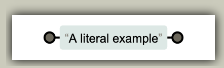
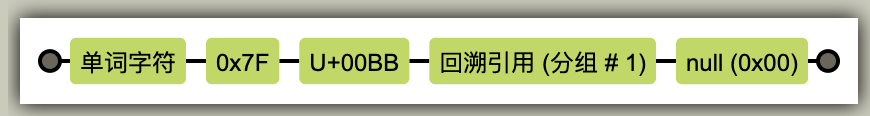
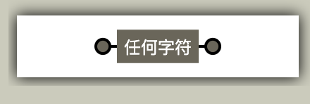
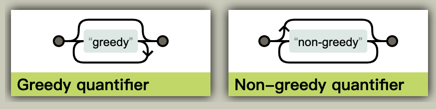

# JavaScript 正则表达式基础

> 课程来源：[HTML 中文网](https://www.html.cn/study/14.html)

> 推介 4 个 JavaScript 正则表达式工具，都是我在开发中常用的，包括轨道图生成工具和正则表达式自动匹配工具，需要拿去～ 
>
> 	1. [regexper.com](https://regexper.com/) 
>  	2. [rubular.com](https://rubular.com/) 
>  	3. [refiddle.com](http://refiddle.com/) 
>  	4. [regex101.com](https://regex101.com/)

[TOC]


## 1-1 正则表达式之初体验

### **知识点**

1. 什么是正则表达式?
2. 正则表达式的应用场景?
3. 如何测试正则表达式?

--------------------------------------------

### 1.什么是正则表达式?
是用于描述一组**字符串**特征的模式,用来**匹配**特定的字符串。（有查询过程）

--------------------------------------------

### 2.正则表达式的应用场景?
- 验证字符串: 如邮箱,手机号,日期,http...
- 查找字符串: 根据预设的特征在目标字符串中进行查找
- 替换字符串: 即查找到符合某特征的字符串之后将之替换
- 提取字符串: 从给定的字符串中提取符合指定特征的子字符串
> 总结: *匹配* 与 *捕获*

- 匹配: test(): `/2018/.test('2018-12-15')`: // true

  - 返回布尔值

- 捕获: exec(): `/2018/.exec('2018-12-15')`:  // ['2018',index:0,input:'2018-12-15',groups:undefined]
  
  - 返回当前字符串中所匹配的内容，一个数组，包含所匹配到的值，index，用于匹配的字符串和一个组
  
  - 通过 `toString` 方法可只返回字符串，比如
  
    ```js
    /2018/.exec('2018-12-15') // 返回 "2018"
    ```

这两个用于**匹配**与**捕获**的方法是正则对象上的方法。

---------------------------------------------

### 3.如何测试正则表达式?
- [国际站](https://regexper.com/)
- [中文站](https://regexper.cn/)
- [如何阅读铁路图](https://regexper.cn/documentation.html)

#### 轨道图

> 查看轨道图的时候有一个想法。轨道图的最左侧圆圈是入口，最右侧圆圈是出口，那么可以想象将一段字符串传入通过入口输入，经过里面的各种“机械”一步一步的进行切割筛选，最后从最右侧的出口输出出来。

- 阅读是以从左往右的方式

- 淡蓝色区域中为**字面量**：
  
  
- 绿色矩形块为**转义**：
  
  
- 灰色为**任意字符**：
  
  
- 重复，不过这里是 0 或 多

  

  - 这里想要说说明一点想法，左图重复多次的那条线路（下方），可以理解为，当通过以后，如果还能被匹配则又回到左侧再次匹配。

-------------------------------------------------------

### 示例源码: code/demo01.html

```javascript
// 用户留言
var comment = '想看更多刺激,精彩的小视频g吗?微信手机同号: 13867442318 , 仅限前100名哟~~';

// 将留言中的手机号过滤掉
var reg = /1[345678][0-9]{9}/g;

comment.replace(reg, '*')
```


1-2.如何创建正则表达式
----------------

[创建正则对象的二种方式](https://www.html.cn/js/javascript/515.html)

## 知识点

1. 正则构造函数
2. 正则表达式字面量
3. 正则对象上的常用方法

---------------------------------------------------

### 1.正则构造函数
- RegExp(pattern, modifiers)
    + pattern(模式): 描述了表达式的模式
    + modifiers(修饰符): 用于指定全局/区分大小写/多行匹配
- 因为参数都是字符串,所以要对反斜线`\`进行转义处理,前面再添加一个`\`即可

```javascript
var reg = new RegExp('\d+');
'1,2,3'.replace(reg, 'a'); // 'a,2,3'
// g: 表示全局匹配, 不会匹配到第一个就停止 
var reg = new RegExp('\d+', 'g');
'1,2,3'.replace(reg, 'a'); // 'a,a,a'
```

---------------------------------------------------

### 2.正则表达式字面量
- 与字义字符串字面量类似,正则表达式字面理也需要使用**定界符**
- 正则表达式字面量使用:`/`正斜线做为定界符
- 上面的案例可以用字面量进行改写:

```javascript
var reg = /\d+/;
'1,2,3'.replace(reg, 'a'); // "a,2,3"

var reg = /\d+/g
'1,2,3'.replace(reg, 'a'); // "a,a,a"
```
> 显然字面量的表达式能力更直观,方便,也是推荐的方式

---------------------------------------------------

### 3.正则对象上的常用方法
- `reg.test(string)`: 检测字符串是否匹配某个正则模式
- `reg.exec()`: 返回由匹配的内容和索引等组成的数组,如果仅获取值,可追加`toString()`方法
- `reg.toString()`: 返回正则表达式的字符串表示,通常用在正则构造函数(RegExp())的参数中


1-3.正则修饰符
----------

[什么是正则修饰符?](https://www.html.cn/js/javascript/516.html)

### 知识点

1. 基本概念
2. 种类与使用场景

-----------------------------------------------------

### 1.基本概念
修饰符,也叫**模式修正符**,必须用在正则表达式之外,用来**调整或扩展功能**

-----------------------------------------------------

### 2.种类与使用场景
- g: 全局匹配(不加则只匹配到第一个就停止)（global）
- i: 忽略大小写（ignore)
- m: 多行匹配（multi）

-----------------------------------------------------

### 示例: 

```javascript
'html,html4,Html5'.replace(/html/, 'php'); //"php,html4,Html5"

'html,html4,Html5'.replace(/html/g, 'php'); //"php,php4,Html5"

'html,html4,Html5'.replace(/html/gi, 'php'); //"php,php4,php5"
```


4.原子字符
--------

原子字符的种类与用途（注意不是「原字符」，而是「原子字符」）

### **知识点**

1. 原子的概念
2. 原子的分类

-----------------------------------------------------

### 1.原子的概念
- 原子是正则表达式**最基本的单位**,一个模式至少要有一个原子
- 主要由除元字符(下节课学习)之外的可打印与不可打印的字符组成

-----------------------------------------------------

### 2.原子的分类
- 普通字符: a~z, A~Z, 0~9
- 特殊字符和元字符: 需要转义, `'\<br\>', \?, \.`
- 非打印字符: \n, \r,\t,\uxxxx(Unicode),\xxx(8),\xdd(10)
    - 上面依次是：换行、回车、制表符、用于表示中文汉字的 Unicode、8 进制数据、10 进制数据
- 自定义原子集合:
    + `[abc]`: 匹配集合中任何一个即可 `[0-9]` `[a-z]` `[A-Z]`
    + `[^abc]`: 不与集合中任何一个匹配，`^`「脱字符」用于取反
      + 注意，取反用于集合之内，如果是在集合之外表示`开始`，比如`^[abc]` 表示以 a | b | c 开始
- 通配字符(匹配一组):
    + `\d`: 匹配任意10进制, `[0-9]`
    + `\D`: 匹配除10进制数以外字符, `[^0-9]`
    + `\s`: 匹配任意空白字符, `[\f\n\r\t\v]`
    + `\S`: 匹配任意非空白字符, `[^\f\n\r\t\v]`
    + `\w`: 匹配从任意一个字母,数字或下划线(合法单词):`[0-9a-zA-Z_]`
    + `\W`: 匹配除字母,数字或下划线之外的任意一个(非单词):`[^0-9a-zA-Z_]`
    
-------------------------------------------------------

### 示例: 控制台执行

```javascript
console.log( 
  /html/.exec('html,css,javascript'),
  //["html", index: 0, input: "html,css,javascript", groups: undefined]

  // 如果只对匹配的内容感兴趣,用toString()仅获取基本值
  /html/.exec('html,css,javascript').toString(),
  // "html"
  
  // + 号是量词,表示一个或多个, 后面还会详细说
  /\d+/.test('html'), // false

  /\d+/.test('abc9'), // true

  /\w+/.test('html5_'), //true

  /\w+/.test('*&%$'), // false

  /[0-9]/.test('123'), // true

  /[a-zA-Z_]/.test('123'), // false

  // 以上二行可以用\d+,\w+替代

  /[^\d+]/.test('acb'), // true

  // 任何一项
  /(html|css|javascript)/.test('html,css'), //true

  /(html|css|javascript)/.test('php,java')// false
);
```


5.什么是元字符?
------------

神秘的元字符

> `* + ? . | {n} {n,} {n,m} ^ $ \b \B [] [^] ()`

### **知识点**

1. 量词
2. 边界
3. 集合
4. 分组
5. 优先级

------------------------------------------------------

### 1.量词
> `* + ? . | {n} {n,} {n,m}`
- `*`: 匹配0次,1次或多次前面的原子
- `+`: 匹配1次或多次前面的原子(至少一次)
- `?`: 匹配0次或1次前面的原子(至多一次)
- `.`: 匹配除换行符之外的任何一个字符（与前一原子字符无关）
- `|`: 匹配2个或多个分支
- `{n}`: 前面的原子**必须出现n次**
- `{n,}`: 前面的原子出现**不少于n次**
- `{n,m}`: 前面原子出现**不少于n次, 不超过m次**

------------------------------------------------------

### 2.边界
> `^ $ \b \B`
- `^`: 匹配输入字符串的开始位置的原子
- `$`: 匹配输入字符串的结束位置的原子
- `\b`: 匹配单词的边界
  - 在单词边界匹配的位置，单词字符后面或前面不与另一个单词字符直接相邻。
  - 也就是说，其所在的位置不能是单词字符
- `\B`: 匹配除单词边界之外的部分
  - \B 元字符匹配非单词边界。匹配位置的上一个和下一个字符的类型是相同的：即必须同时是单词，或必须同时是非单词字符。**字符串的开头和结尾处被视为非单词字符**。
  - \B 元字符通常用于查找不处在单词的开头或结尾的匹配。（因为字符串的开头和结尾被视为非单词字符）

------------------------------------------------------

### 3.集合

> 也称原子表

> `[] [^]`
- `[]`: 匹配方括号中的任意一个原子
- `[^]`: 匹配除了方括号中原子之外的任何一个字符

------------------------------------------------------

### 4.分组
- `()`: 括号内容整体做为一个原子,称为**模式单元**,视为多个单原子组成的大原子

------------------------------------------------------

### 5.优先级
- 相同级别: 从左到右进行匹配
- 不同级别: 先运算高级别,再运算低级别

| 级别 | 元字符               | 说明            |
| ---- | -------------------- | --------------- |
| 1    | \                    | 转义字符        |
| 2    | () []                | 模式单元/原子表 |
| 3    | * + ? {n} {n,} {n,m} | 重复匹配        |
| 4    | ^ $ \b \B            | 边界            |

------------------------------------------------------

### 示例: 

```javascript
console.log(

  // 量词练习
  /ph.p/.exec('php'), //null

  /ph.p/.exec('phap'), // ["phap", index: 0, input: "phap", groups: undefined]

  /ph*p/.exec('php'), //["php", index: 0, input: "php", groups: undefined]

  /ph*p/.exec('pp'), // ["pp", index: 0, input: "pp", groups: undefined]

  /ph*p/.exec('phhhhhhp'), //["phhhhhhp", index: 0, input: "phhhhhhp", groups: undefined]

  /ph+p/.exec('php'), // ["php", index: 0, input: "php", groups: undefined]

  /ph+p/.exec('phhhhhp'), // ["phhhhhp", index: 0, input: "phhhhhp", groups: undefined]

  /ph+p/.exec('pp'),  //   null

  /ph?p/.exec('pp'), // ["pp", index: 0, input: "pp", groups: undefined]

  /ph?p/.exec('php'), //  ["php", index: 0, input: "php", groups: undefined]

  /ph?p/.exec('phhp'), // null

  // 边界
  /^html/.exec('html,css,javascript'), // ["html", index: 0, input: "html,css,javascript", groups: undefined]
  ,
  
  /^html(,|\w)*css$/.exec('html,css,javascript,css') // ["html,css,javascript,css", ",", index: 0, input: "html,css,javascript,css", groups: undefined
  ,
  
  // 单个 `|` 会将整个正则进行分割，从而能够实现匹配左边或者右边的能力
  /^html|css$/.test('html,css,javascript,css') // true
,

  /css/.exec('html,css,javascript'), // ["css", index: 5, input: "html,css,javascript", groups: undefined]

  /^css/.exec('html,css,javascript'), // null

  /^css/.exec('css,javascript'), // ["css", index: 0, input: "css,javascript", groups: undefined]

  // 限制结尾原子也是一样的
  /php$/.exec('html,java,php'), // ["php", index: 10, input: "html,java,php", groups: undefined]

  /php$/.exec('html,java,php,python'), // null

  // 集合之前介绍过了, 下面我们看一下分组
  // 分组最常用的场景,就是改变优先级
  // 只要以a开头, f结束的字符串,都能匹配到
  // 这里是指 a 开头 或 f 结尾，也就是把 ^a 与 f$ 进行了分割
  /^a|f$/.exec('adf'), // ["a", index: 0, input: "adf", groups: undefined]

  /^a|f$/.exec('adda12222f'), // ["a", index: 0, input: "adda12222f", groups: undefined]

  // 加了括号, 将只能匹配a 或者  f, 其它字符串都不能匹配
  /^(a|f)$/.exec('a'),  // ["a", "a", index: 0, input: "a", groups: undefined]

  /^(a|f)$/.exec('f'), // ["f", "f", index: 0, input: "f", groups: undefined]

  /^(a|f)$/.exec('fdd') // null

)
```


6.支持正则参数的 String 对象方法
--------------------------

支持正则参数的字符对象方法

### 知识点

1. search()
2. match()
3. replace()
4. split()

-------------------------------------------------------

### 1.search()
- *功能*:检索文本中指定的子符串或正则相匹配的字符串
- *语法*: string.search(searchvalue)
- *参数*: 字符串/正则表达式
- *返回*: 结果字符串的起始位置,失败返回 -1
- *注意*: 只返回匹配的第一个,后面的忽略,哪怕有修饰符
- `'html'.search(/m/);`: 返回 2

-------------------------------------------------------

### 2.match()
- *功能*: 可视为search()加强版,可返回全部满足的内容
- *语法*: string.match(regexp) 
- *参数*: 只允许正则表达式
- *返回*: 所有匹配内容组成的数组,失败返回 null
- *场景*: 通常会与模式修饰符: gi , 配合使用
- `'htmldmldmd'.match(/m/g)`:返回["m", "m", "m"]`

-------------------------------------------------------

### 3.replace()
- *功能*: 替换与给定字符串或正则匹配的内容
- *语法*: string.replace(searchvalue,newvalue)
- *参数*: (1)要匹配的字符串/正则表达式, (2) 新内容 
- *返回*: 被替换的新字符串

-------------------------------------------------------

### 4.split()
- *功能*: 将一个字符串分割成数组
- *语法*: string.split(separator,limit)
- *参数*: (1)分隔符, (2)限制数组元素的数量
  - *返回*: 字符串数组

--------------------------------------------------------

### 示例:

``` javascript
console.log(
    
    'html'.search(/m/), // 2
    
    'htmldmldmd'.match(/m/g), // ["m", "m", "m"]
    
    'php,java,Python'.replace(/[ph]+/gi,'*'), //"*,java,*yt*on"
    
    'html,css,javascript'.split(',') //["html", "css", "javascript"]
)


```