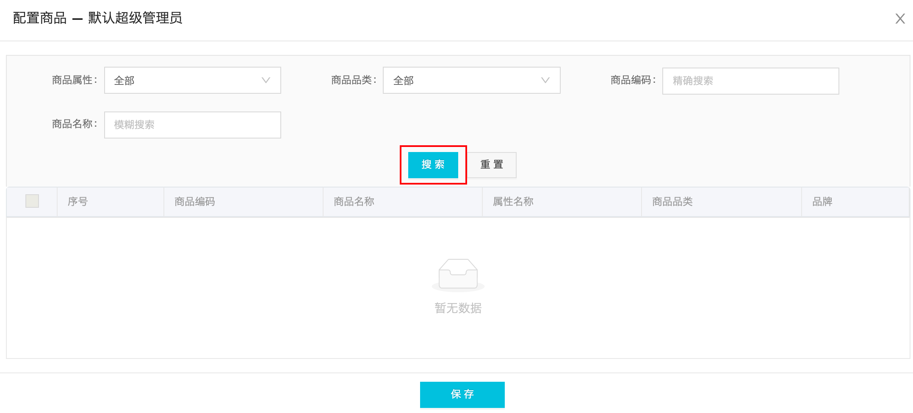

# 数智魔方开发中遇到的问题
[TOC]

## get 接口地址中不能存在 %
```jsx
http.get(`/platform-setting/points-deduction/list?value=10%`);
```
* 在接口地址的最后，传入 params value 值为 10%，但 % 在地址中有特殊含义不能用于传值，所以会访问到其他接口地址中，从而报错。
* 这个问题应该是没有对 `%` 做编码处理

## 在配置字段时一定要给后端说明数据类型
```jsx
{
	description: {
		isDescription: false
	}
}
```
* 这是发送给后端的更改数据，但由于当时没有沟通清楚，后端以为 `description` 对象下的字段都为字符串类型，所以当我传布尔类型给后端，后端会转换为字符串保存，这样，当我请求这个数据时会收到字符串而不是布尔型。

## 还是别用 index 作为删除的 key 来传递
之前就在学习的过程中知道这个问题，但这次还是遇到了，先看代码：
```jsx
imageSettingList.map((setItem: any, index: number) => (
	//...
	{imageSettingList.length > 1 ? (
          <Icon
            className="dynamic-delete-button"
            type="minus-circle-o"
            onClick={() => { store.handleRemoveColumItem(index) }}
          />
        ) : null}
)

handleRemoveColumItem(index) {
  this.imageSettingList = this.imageSettingList.filter((item, i) => i !== index)
}
```
* 删除项的方法所传入的是数组的 `index`，现在假设有一个 `index` 数组为 [0,1,2,3]，当我们删除 `index` 为 2 的那项时, 数组剩余的 `index` 并非 [0,1,3] 而是 [0,1,2] 因为 `index` 是以数组中有多少项，从 0 开始的，所以，这里无论你删除哪一项都会删除最后一项。

## 为什么要使用 async await try catch 的方式
因为异步请求返回的数据是不确定的，这个不确定性主要是指数据类型，因此在处理数据的过程中，如果不对数据进行预检就很容易发生错误，比如你对返回的数据调用字符串方法 `slice`，然而后端返回的确实 `null` 类型，那就会报错从而阻塞程序的运行。为了避免这种情况的发生，我们可以通过 `try` `catch` 来捕获错误，至少能够做到不让程序崩溃。


## 数据大屏中切换动画的实现
视图：


代码：
```tsx
<div className="tag-list">
          <ul>
            {
              list.map((item: any, index: number) => {
                return (
                  <li className={`${(idx % 6) === index ? 'active' : ''}`} key={index}>{item}</li>
                );
              })
            }
          </ul>
        </div>

<div className=“goods-list-content”>
          <ul className=“goods-list” style={{
            transform: ‘translateX(-‘ + translateX + ‘px)’,
            transitionDuration: transitionDuration
          }}>
            {
              hotGoods.map((item: any, index: number) => {
                return (
                  <li key={index}>
                  </li>
                );
              })
            }
```
* 上部分视图是 `div.tag-list` 部分，切换每一个标签的样式来实现切换的，这里需要注意的代码部分是 `index % 6` 通过这个简单的求余可以省去一个一次判断，因为当 `idx` 为 6 时其对应的 `index` 应该为 0，这是由于下方的横向切换视图为了平滑，也就是最后一项切换到最前一项时也是相应的从左往右切换，第一项实际上是在整个区块中存在两项，位于此区块的最开始与最后。
* 那么，下方动画的实现，是利用 `div.goods-list` 宽度为 472 区块包裹一个宽度是 7 * 472 的区块 `ul.goods-list` ，然后让其使用 `translateX` 横向移动。

接下来是切换动画所使用的函数：
```tsx
poll = () => {
    this.timerPoll = setInterval(() => {
      const idx = (this.state.idx || 0) + 1;
      this.setState({
        idx: idx,
        translateX: idx * 472
      });
      if (idx >= (this.state.hotGoods as []).length) {
        setTimeout(() => {
          this.setState({
            idx: 0,
            transitionDuration: ‘0s’,
          });
        }, 400);
        setTimeout(() => {
          this.setState({ transitionDuration: ‘0.3s’ });
        }, 600);
      }
    }, 10 * 1000);
  };
```
* 这个函数的前半部分很好理解，就是每隔 10s，让 `idx` + 1，然后让 `translateX` 的值根据 `idx` 进行计算获得，这样视图中的标签高亮和下方的模块就会切换。
* 这里需要注意是后面的判断逻辑，先判断 `idx` 是否大于等 6，实际上这这里是可以写死的，但这里用的 `this.state.hotGoods.length` 来进行判断也可以。当满足条件后，就会将 `idx` 赋值为 0，关键的关键在于将 `transitionDuration` 设为 0，这样在视觉层面上来说，就会不知不觉的将第七个模块切换到第一个，然后再将 `transitionDuration` 设置回来即可，然后又会接着出现动画的切换效果。


## 对于 .gitignore 无法忽略文件
> 如果你不慎在创建 .gitignore 文件之前就 push 了项目，那么即使你在.gitignore文件中写入新的过滤规则，这些规则也不会起作用，Git 仍然会对所有文件进行版本管理。

也就是说，你需要先将需要 ignore 的文件删除 push 一次，然后 .gitignore 的规则才会起作用。

## ts 的提示信息
ts 的提示是非常有用的，比如对于变量可能为 undefined 的情况，那么就需要预先对数据进行预检，而不是使用 `as` 进行断言。 

## antd-Form 组件实现双向绑定后
当使用 `Form.create()` 方法对组件进行包装并使用 `this.props.form.getFieldDecorator` 和表单进行双向绑定之后，表单的值就会受到其父组件的管理，也就是 `Form.create()` HOC，这时就会有一些问题，比如你并不想它改变某个值但改变了，这里举一个例子。

左边红框部分是一个级连的时间选择器，右边红框中是一个选择展示方式的下拉框，当选择月时，点击查询会向后端发送的时间是 `start: 2019-08-01` `end: 2019-08-31`  ，也就是所选月份的第一天和最后一天。
但这里存在一个问题，当点击 `查询` 的时候，时间选择器的值会被更改为发送给后端的值，可这不是我想要的。那问题是因为什么呢？先看处理时间更改的逻辑：

```tsx
form.validateFields((error, values) => {
 	for( key in values){
		if (values[isLinkSelectKey] === 'month' && key.includes('var_start_date')) {
          resParams['var_start_date'] = values[key].startOf('month').format('YYYYMMDD')
});
```
如果下拉框的值为 `’month’` ，并且 `From` 所对表单值的拼装 `values` 对象的某一个 `key`  有 `var_start_date` 字符，则将 `key` 所对应的值进行更改，更改为这个月的最开始的时候，并且以 `YYYYMMDD` 的格式显示。就是在这里会出现问题，因为当我们对 `values` 进行格式转换的时候，就会更改它，从而更改了 `Form` 所管理的表单，而使表单发生变化。因此，我们需要对 `values` 进行深拷贝，然后对改变拷贝后的值进行操作更改即可：
```tsx
form.validateFields((error, values) => {
	const cloneValues = _cloneDeep(values)
 	for( key in values){
		if (values[isLinkSelectKey] === 'month' && key.includes('var_start_date')) {
          resParams['var_start_date'] = cloneValues[key].startOf('month').format('YYYYMMDD')
});
```


## Select 组件的 Option 重复项

### 哪里出的问题？问题是什么？

在级联组件 `DynamicScade.tsx` 中当点击第三级组件之后会报错，报错提示有相同的 key ，而且错误有 1000 多条，说明相同 key 值的项也有 1000 多条。报错之后，如果点击一级菜单选择除「全部」之外的其他省份，第三级级联依然是全部的省份的数据，而非所选省份的数据。

### 问题分析

`<Select>` 组件中的 `<Option>` 的 `key` 值不能有重复项，这对于任何 React 组件来说都一样，同级组件中不能有完全相同的组件，需要使用 `key` 属性值来区分。但 `Option` 组件除了 `key` 不能重复之外， `value` 的值也不能重复。

出现显示重复 key 的问题，那当然一定是有重复的 key，而且有 1000 多条，则可能就有多余的 1000 多条数据。

### 解决方式

在迭代数组渲染 `<Option>` 组件之前，对数组进行去重处理，这里使用的是 `lodash` 的 `_.uniqBy` 方法，先看一下官方示例：

```tsx
_.uniqBy([2.1, 1.2, 2.3], Math.floor);
// => [2.1, 1.2]
 
// The `_.property` iteratee shorthand.
_.uniqBy([{ 'x': 1 }, { 'x': 2 }, { 'x': 1 }], 'x');
// => [{ 'x': 1 }, { 'x': 2 }]
```

可以看到，通过传入第二个参数来对对象数组中对象的某一属性进行去重，比如在这里我们需要甄别的去重属性是 `value`，那么如下：

去重之前：

```tsx
currentT.length > 0 &&
  currentT.map((o: any, i: number) => {
  return (
    <Option title={o.name} key={o && o.value} value={o && o.value}>{o.name}</Option>
  );
})
```

去重之后，对 `currenT` 进行处理：

```tsx
currentT.length > 0 &&
  _.uniqBy(currentT, 'value').map((o: any, i: number) => {
  return (
    <Option title={o.name} key={o && o.value} value={o && o.value}>{o.name}</Option>
  );
})
```

## 点击搜索按钮重新刷新页面

如图：



点击搜索按钮之后会刷新页面，原因是搜索按钮会触发 `<form>` 表单的 `submit` 事件，而 `submit` 事件默认会更新 url 从而刷新页面，搜索按钮代码如下：

```tsx
<Button loading={tableLoading} type="primary" htmlType="submit">
  搜索
</Button>
```

- 这里的 `htmlType="submit"` 属性值会使按钮点击事件触发时触发所在表单的 `submit` 事件

更改为：

```tsx
<Button loading={tableLoading} type="primary" onClick={this.handleSearch}>
  搜索
</Button>
```

- 搜索按钮被点击后直接调用查询后端商品列表函数


## 导出功能 Modal 的 bug 检测问题

首先想说，不要随意自认为 bug 产生的原因，最好的方式还是通过打断点或是打印的方式来逐步排查。

### 问题描述

点击导出按钮弹出 Modal ，其中有一个 input 输入框，其默认值是从后端获取的。如下：


调用后端接口是在点击「导出」按钮之后，但在点击之后虽然从后端获取到了邮箱地址，但依然显示为空。

这里先说明一下 Modal 内部的代码：

```tsx
<ActionModal
	//...
  >
  <Alert message="导出数量过多，需要您填写邮箱地址并确定，邮箱将用于接收导出的报表链接。填写并确定之后，下一次导出会自动填充到输入框中方便您再次导出，如果想要修改邮箱只需直接更改并确定即可。" type="info" />
  <Form {...formItemLayout} style={{ marginTop: 24 }}>
    <Form.Item label="邮箱" required hasFeedback>
      {getFieldDecorator('email', {
        initialValue: store.email,
        rules: [{
          type: 'email', message: '请输入正确的邮箱格式'
        }],
      })(
        <Input
          placeholder="请输入邮箱"
          />
      )}
    </Form.Item>
  </Form>
</ActionModal>
```

- Modal 内部是被 `Form.create` 接管的表单，初始值是 `store.email` ，`store.email` 在点击导出之后会从后端获取。

所以，**我猜测**为空的原因是由于点击之后在未获取后端数据之前便渲染了 Modal 中的内容，而此时 `store.email` 为 `''`。

问题在于：`我猜测`

而实际造成为空的原因是由于从错误的字段中获取了数据。如下：

```tsx
@action('从服务器获取用户邮箱地址')
async fetchEmail() {
  this.emailLoading = true
  try {
    const res:any = await api.getEmailAddr()
    if (res.success) {
      runInAction(() => {
        this.email = res.data.data || ''
        this.visible = true
        // this.formObj.setFieldsValue({emial: this.email})
      })
    }
  } catch (error) {
    message.error('导出失败')
  }
  runInAction(() => {
    this.emailLoading = false
  })
}
```

- 错误在第 8 行，从 `res.data.data` 中获取邮箱是错误的，因为在 `http.ts` 中我们已经对返回的数据做了劫持，将 `res.data.data` 覆盖了 `res.data`，所以 `res.data.data` 并没有数据。

### 解决

最好的方式当然是从后端获取到数据之后再打开 Modal，所以只需要将打开 Modal 的状态 `visible` 放到成功获取邮箱之后即可。

当然，这个问题并不是解决开发问题，而是处理问题的问题，也就是一开始的猜测，我们更多的应该是从打印数据或是打断点一步一步运行程序来发现问题比较好，否则会投入很多无效的时间。因为从一开始排查错误的方向就已经错误了，之后也将一直错误下去。


## 字体版权问题

对于一些非公开免版权的字体在商业应用中要慎用。


### 状态与组件与视图的一致性

在每一个配置报表的组件中，有很多表单，这些表单的状态有共有的，也就是对于不同类型的报表都需要配置的，也有私有的或是特别的，只是针对不同的报表进行配置，因此就需要将共有的拆分出来放在一起，然后将私有的拆分出来为不同的组件。那么，除了组件的拆分之外，**存储于包裹这些组件的父组件的状态也应该进行拆分**，这样才能达到一致性。视图的一致性可能是基于一些页面设计上的方式，比如用线框将其分割出来，或是用不同的模块使用不同的底色或是字体颜色等方式。


## 短路求值中遇到 falsy 值的问题

```tsx
<RadioGroup 
  value={categoryHeaders && categoryHeaders.process || true}
  onChange={(e) => {
    this.props.onSetConfig({
      categoryHeaders: {
        ...categoryHeaders,
        process: e.target.value
      },
    });
  }}
  >
  <Radio value={true}>处理</Radio>
  <Radio value={false}>不处理</Radio>
</RadioGroup>
```

如上第 2 行，由于 `categoryHeaders` 一开始在组件初始化时可能为 `undefined` ，所以取其属性 `process` 之前需要通过短路求值的方式先判断 `categoryHeaders` 是否定义然后再取其 `process` 属性。接着，如果在 `||` 之前都为 `falsy` 则会取值为 `true` ，这里就是问题所在了。因为此 `<RadioGroup>` 会返回 `false` 值，而此值是我们所需的，但其又是 `falsy` ，所以在单选框中无论如何选择，其结果都为 `true` ，所以这里不能这样做短路求值。更改如下：

```tsx
<RadioGroup 
  value={categoryHeaders && categoryHeaders.process}
  onChange={(e) => {
    this.props.onSetConfig({
      categoryHeaders: {
        ...categoryHeaders,
        process: e.target.value
      },
    });
  }}
  >
  <Radio value={true}>处理</Radio>
  <Radio value={false}>不处理</Radio>
</RadioGroup>
```

只需要将 `|| true` 代码删掉即可，只不过这样就不能当 `categoryHeaders && categoryHeaders.process` 为 `undefined` 时将单选组设置 `true` 为默认值了。所以，可能需要另外一种方式，如下：

```tsx
<RadioGroup 
  value={categoryHeaders && (categoryHeaders.process === false ? false : true)}
  onChange={(e) => {
    this.props.onSetConfig({
      categoryHeaders: {
        ...categoryHeaders,
        process: e.target.value
      },
    });
  }}
  >
  <Radio value={true}>处理</Radio>
  <Radio value={false}>不处理</Radio>
</RadioGroup>
```

只要 `process` 为 `false` 那就返回 `false` 其他情况返回 `true` ，对于只有两种取值的 `Boolean` 来说，这样的方式没有问题，但如果是面对 `number` 类型就可能需要另外的方式了。因为 `number` 有 `0` 这个 `falsy` ，也有多种其他取值的可能。那么假设这里是 `number` 的情况，应该如何写呢？如下：

```tsx
function foo(o){
    return o && (!!o.a ? o.a : 0)
}
```

对于要取值，这里是 `o.a` 进行转换为 `boolean` 类型，如果为 `truth` 则返回其本身，否则返回 `0`。但是，这里情况有点特殊，也就是默认值为 `0` ，如果默认值为 `5` 呢？那会出现一个问题，当 `o.a` 的值为 `0` 时，则永远都取不到这个值了。那么到底应该如何做呢？如下：

```tsx
function foo(o){
  return o && ((o.a === undefined || o.a === null || o.a === '' || o.a === false) ? 5 : o.a)
}
```

这里我们判断几种常见的 `falsy` 值，不过除了可能会取到的 `0` ，当为 `falsy` 则返回默认值（5），否则则返回值本身。

---

## 逗号分割之前记得清除空格


上面表单中的「二级表头」输入框需要使用 `,` 分割来作为分割点将此输入内容（字符串）组成一个数组，但在利用这个数组中的每一个字符串作为 `dataIndex` 进行渲染数据时，后端虽然返回了数据，并且 `index` 没有问题的情况显示为空。这是因为在配置时 `,` 之后有空格（如图中的蓝色方块），而这个空格也添加到了 `dataIndex` 之中，而后端返回的 `index` 并不包含空格，所以造成数据渲染时出现问题，页面显示为空。因此，需要在渲染之前对拼装的 `dataIndex` 进行空格清除处理，如下：

```tsx
return {
  key: `${o.name},${a.name}`,
  title: a.name,
  dataIndex: `${o.name.trim()},${a.name.trim()}`,
```

这是返回的 `<Table />` 组件所需要使用的 `column` props 的数据，其中 `dataIndex` 为后端返回的对象数组中，每一个对象的属性（index）。只有当这个 `dataIndex` 与 `index` 一一对应的时候才会渲染正确的数据。


---


