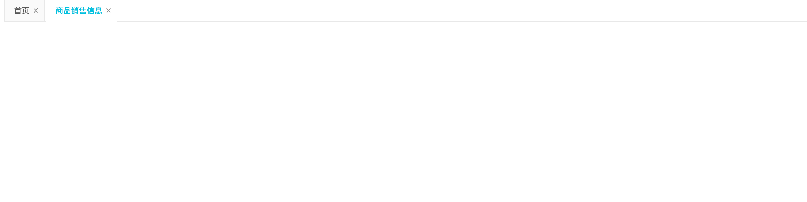

[toc]

## CSS 权重问题



如图，激活 `tab` 的 `pane` 并没有内容显示，是由于首页 `tab` 对应的 `pane` 元素的 `height` 为 `100%` ，而不是非激活状态下由 `antd` 所提供的选择器规定的 `height: 0` 。而 `height` 为 `100%` 是由于我们所写的选择器规则将 `antd` 的选择器规则覆盖了。

但这个问题只出现在测试环境上，本地开发环境并没有这个问题。这和权重有关。

`andt` 选择器：

```css
.ant-tabs-no-animation>.ant-tabs-content>.ant-tabs-tabpane-inactive{
		height: 0;
    padding: 0!important;
    overflow: hidden;
    opacity: 0;
    pointer-events: none;
}
```

我所写的选择器：

```css
.styles_mainTab__35zBs .ant-tabs-top-content .ant-tabs-tabpane{
    height: 100%;
    overflow: auto;
}
```

两个选择器，在权重值都是 30，由三个类选择器组成（一个类选择器权重为 10），所以谁生效则和选择器的位置有关，位于后面的选择器将生效。

### 权重规则总结:

可以看一下这篇文章的总结

> 1. !important 优先级最高，但也会被权重高的important所覆盖
> 2. 行内样式总会覆盖外部样式表的任何样式(除了!important)
> 3. 单独使用一个选择器的时候，不能跨等级使css规则生效
> 4. 如果两个权重不同的选择器作用在同一元素上，权重值高的css规则生效
> 5. 如果两个相同权重的选择器作用在同一元素上：以后面出现的选择器为最后规则.
> 6. 权重相同时，与元素距离近的选择器生效
>
> #### 等级关系:
>
> ```
> !important>行内样式>ID选择器 > 类选择器 | 属性选择器 | 伪类选择器 > 元素选择器 | 伪元素
> ```
>
> 作者：OBKoro1
> 链接：https://juejin.im/post/5afa98bf51882542c832e5ec
> 来源：掘金
> 著作权归作者所有。商业转载请联系作者获得授权，非商业转载请注明出处。

### 解决方式

我们的目的当然是让激活的 tab 对应的 pane 能够正常显示，而在 `Tab` 组件中是通过隐藏非激活状态 tab pane 来实现的。现在，我们的问题是非激活的 tab pane 会被覆盖 css 规则而显示，那问题就出现被覆盖上。

而覆盖是由于我们对所有带有 `.ant-tabs-tabpane` 的元素都设置了高度，所以可以只让设置这个高度在激活的 tab pane 上生效而在非激活的 tab 上不生效，所以将 css 选择器更改为：

```css
.styles_mainTab__35zBs .ant-tabs-top-content .ant-tabs-tabpane-active{
    height: 100%;
    overflow: auto;
}
```

antd 提供的 `Tab` 组件是通过 `.ant-tabs-tabpane-active` 和 `.ant-tabs-tabpane-inactive` 两个类来区分激活与非激活的 pane 元素的，由于我们的 `height:100%; overflow: auto;` 属性只想在激活的 pane 上生效，所以如上所写选择器即可。

### CSS 语法

> CSS是一门基于规则的语言 —— 你能定义用于你的网页中特定元素样式的一组规则. 比如“我希望页面中的主标题是红色的大字”
>
> 下面这段代码使用非常简单的 CSS 规则实现了之前提到的效果:
>
> ```css
> h1 {
>     color: red;
>     font-size: 5em;
> }
> ```
>
> 语法由一个 [选择器(selector)](https://developer.mozilla.org/zh-CN/docs/Glossary/CSS_Selector)起头。 **它 *选择(selects)* 了我们将要用来添加样式的 HTML 元素**。 在这个例子中我们为一级标题（主标题`<h1>`）添加样式。
>
> 接着输入一对大括号`{ }`。 在大括号内部定义一个或多个形式为 **属性(property):值(value);** 的 **声明(eclarations)**。每个声明都指定了我们所选择元素的一个属性，之后跟一个我们想赋给这个属性的值。
>
> 冒号之前是属性，冒号之后是值。不同的 CSS [属性(properties)](https://developer.mozilla.org/en-US/docs/Glossary/property/CSS) 对应不同的合法值。在这个例子中，我们指定了 `color` 属性，它可以接受许多[颜色值](https://developer.mozilla.org/en-US/docs/Learn/CSS/Building_blocks/Values_and_units#Color)；还有 `font-size` 属性，它可以接收许多 [size units](https://developer.mozilla.org/en-US/docs/Learn/CSS/Building_blocks/Values_and_units#Numbers_lengths_and_percentages) 值。

