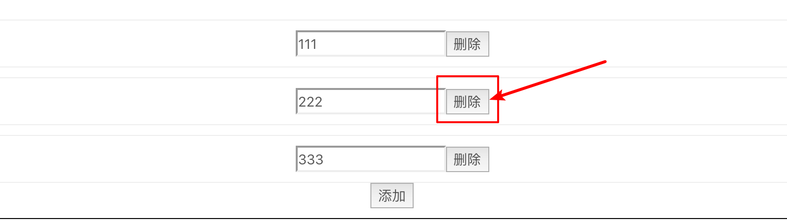

[TOC]

## 习题 1

子组件为何不可以修改父组件传递的 Prop，如果修改了，Vue 是如何监控到属性的修改并给出警告的？

- 使用了 [Object.defineProperty](https://developer.mozilla.org/zh-CN/docs/Web/JavaScript/Reference/Global_Objects/Object/defineProperty) API

### 代码：

> 1.1_a 中的 index.vue Proxy.vue proxy.js

子组件：

```jsx
<template>
  <div>
    info: {{ info }}
    <input :value="info.name" @input="handleChange" />
  </div>
</template>

<script>
import proxy from "./proxy";
export default {
  props: {
    info: Object
  },
  created() {
    // this.temp = { name: "" };
    // Object.keys(this.temp).forEach(key => {
    //   proxy(this.info, this.temp, key);
    // });
  },
  methods: {
    handleChange(e) {
      this.info.name = e.target.value;
      this.$forceUpdate();  
      //this.$emit("change", e.target.value);
    }
  }
};
</script>
```

- 这里我们接收一个父组件的 `prop` - `info`，然后在子组件内进行更改，由于 info 是一个空对象，所以直接对此对象的 name 赋值并不会收到 vue 的报错，因为并没有真的改变这个变量。

- `created` 部分的代码是通过 proxy 方法来模拟 vue 是如何监控属性的修改并给出警告的，具体是使用了 `Object.defineProperty` API

proxy 方法的代码：

```jsx
const sharedPropertyDefinition = {
  enumerable: true,
  configurable: true
};
export default function proxy(target, temp, key) {
  sharedPropertyDefinition.get = function proxyGetter() {
    return temp[key];
  };
  sharedPropertyDefinition.set = function proxySetter(val) {
    temp[key] = val;
    // 用于判断是否从子组件进行更新 - 标志位
    if (!window.isUpdatingChildComponent) {
      console.error(`不可以直接更改: ${key}`);
    }
    window.isUpdatingChildComponent = false;
  };
  Object.defineProperty(target, key, sharedPropertyDefinition);
}
```

- 通过 `window.isUpdatingChildComponent` 标志位进行判断，如果是从子组件执行的赋值则进行报错。

再来看看父组件的部分代码：

```jsx
methods: {
  handleProxyChange(val) {
    window.isUpdatingChildComponent = true;
    this.info.name = val;
    this.info = { name: val };
  },
```

- 如果是以正常单向数据流的方式，也就是通过 `$emit` 触发组件任务，然后调用父组件方法（ `handleProxyChange`）来改变其属性，则会先将 `window.isUpdatingChildComponent` 标志为更改为 `true` 以表示是在父组件中进行的更改，这样就不会触发报错了。


## 习题 2

`this.$emit` 的返回值是什么？

- this
- 如果需要父组件的返回值可以使用回调参数

如果上层组件 return 一个值，`this.$emit` 是否能够接收到？

- 不能，但是可以通过回调来传递给 `this.$emit`

### 代码：

> 1.1_a 中的 Event.vue

子组件中：

```jsx
handleChange(e) {
  const res = this.$emit("change", e.target.value, val => {
    console.log(val);
  });	
  console.log(res, res === this);
},
```

- 可以在第 5 行中通过 `console.log` 查看到 `this.$emit` 返回的是组件实例本身
- `this.$emit` 的第三个参数可以传入一个回调，这个回调可以被组件的事件方法接收到，从而可以向子组件传递一些值，然后子组件便可以通过这个回调来处理一些逻辑。

父组件中：

```jsx
handleEventChange(val, callback) {
  this.name = val;
  callback("hello");
  return "hello";
}
```

- 事件方法的第二个参数可以接受到子组件传递过来的回调，然后在第 3 行中我们通过调用传递了 `"hello"` 

这个过程很像是玩乒乓球，一个人把球击打给另一个人，另一个人又把球打过来，不过和乒乓球不一样的是，球会发生变化，也就是数据会发生变化。


## 习题 3

相同名称的插槽是合并还是替换？（2.5 与 2.6 的行为不同）

- Vue 2.5 版本，普通插槽合并、作用域插槽替换
- Vue 2.6 版本，都是替换，这是因为 2.6 的普通插槽与作用域插槽基本上是一样的

### 代码

> 1.1_a / Slot.vue

这部分内容比较简单，提示一下使用 slot 的方法：

子组件：

```jsx
<template>
  <div>
    <slot />
    <slot name="title" />
    <slot
      name="item"
      v-bind="{ value: 'vue' }"
    />
  </div>
</template>
```

父组件：

```jsx
<SlotDemo>
  <p>default slot</p>
  <template v-slot:title>
    <p>title slot1</p>
    <p>title slot2</p>
  </template>
  <template v-slot:title>
    <p>new title slot1</p>
    <p>new title slot2</p>
  </template>
  <template v-slot:item="props">
    <p>item slot-scope {{ props }}</p>
  </template>
  <template v-slot:item="{vue}">
    <p>new item slot-scope {{ vue }}</p>
  </template>
</SlotDemo>
```

-  `v-slot` 只能在**组件**或者 `<template>` 标签上使用
- 在子组件中向父组件中的作用域插槽传递数据，可以通过在子组件的 `<slot>` 添加 `v-bind` 属性中传值，注意，经过我的测试，似乎只允许传递对象；然后，在父组件中通过 `v-slot:item="prop"` 用一个变量来接收这个对象，也可以使用结构语法 `v-slot:item="{vue}"`


## 习题 4

扩展 PersonalInfo Demo，对手机号做非空合法校验，如不合法，则给出错误提示。

> vue 中 子组件怎么调用父组件的方法：
>
> 1. 用`$emit`向父组件触发一个事件，父组件监听这个事件就行了。
> 2. 直接用`this.$parent.xxxx`这样直接调用父组件的方法。
>
> vue 中 父组件怎么调用子组件的方法：
>
> `this.$refs.child1.handleParentClick("ssss");`

- 看 DEMO 1.2_a

### 代码

父组件：

```jsx
methods: {
  validate(phone = "") {
    return phone && /^1[0-9]{10}$/.test(phone);
  }
}
```

- 创建一个方法用于验证手机号码的输入，并将这个方法传给子组件
- 之所以在父组件中创建验证方法是因为子组件如果是一个输入框，则根据不同的情况需要验证不同的输入信息，也可以说，子组件的行为由父组件来决定，从而**扩展了子组件的使用范围**。

子组件：

```jsx
watch: {
  "phoneInfo.phone": function(val) {
    this.handleValidate(val);
  }
},
methods: {
  handleValidate(val) {
    const res = this.validate(val);
    this.showMessage = !res;
  }
}
```

- 监听 `phoneInfo.phone` 数据的变化，数据一旦改变则将最新的值传给 `this.handleValidate` 方法进行调用
- 在 `handleValidate` 内部会通过父组件传递过来的方法验证手机号码的格式是否正确，返回布尔值，这里需要注意，`this.showMessage` 与返回值是反逻辑，验证不通过需要显示提示，验证通过则不需要，所以需要取反

其实这个示例也有其他一些地方可以学习，比如内部显示的提示文本也是来源于父组件，这样子组件的定制化更高，扩展性更强。


## 课后习题 5

为什么我们不能使用 index 来作为 key？

- 更新 DOM 性能问题
- 会引入状态 Bug 问题，看 Demo 1.3_a

### 代码部分：

子组件代码：

```jsx
<template>
  <div class="border2">
    <input v-model="phone" type="number" />
    <slot></slot>
  </div>
</template>
<script>
export default {
  data() {
    return {
      phone: ""
    };
  }
};
</script>
```

- 一个很简单的带有双向绑定数据 phone 的 input 输入框

父组件代码：

```jsx
<template>
  <div class="border">
    <Children v-for="(key, index) in list" :key="index">
      <button @click="() => handleDelete(key)">删除</button>
    </Children>
    <button @click="handleAdd">添加</button>
  </div>
</template>
<script>
import Children from "./Children";
let key = 1;
export default {
  components: {
    Children
  },
  data() {
    return {
      list: []
    };
  },
  methods: {
    handleAdd() {
      this.list.push(key++);
    },
    handleDelete(key) {
      const index = this.list.findIndex(k => k === key);
      this.list.splice(index, 1);
    }
  }
};
</script>
```

- 第 6 行有一个添加按钮，原理是通过向 `list` 数组添加 `key` 值
- 第 3 行，`<Children>` 组件是通过 `list` 数组进行循环渲染的，但其 `key` 属性为 `index` ，并且其内部有一个用于删除当前组件的按钮。
- 当我们点击删除按钮之后，会删除数组中对应 key 的那一项，比如这里我们有三个子组件，则 `list` 应该为 `[1,2,3]`，当我们点击第二个组件的删除按钮后，则 `list` 会变为 `[1,3]`，会删除第二项，不过这里的 key 是使用的 index，其 index 的变化为 `[1,2,3]` 到 `[1,2]`， vue 经过前后对比后，会删除 index 为 3 的那一项，所以，虽然我们想要删除的是第二项，但实际上删除的为第三项。

图示：



点击过后：


留下的是第一项与第二项，而不是第一项与第三项。（因为组件内部存在状态，所以可以知道哪个组件被删除了）

所以，我们需要使用数组中的 key 值来作为其 key，因为是静态的、不变的。

这里再提示一点，可能使用 DOM 元素来循环渲染因为没有状态，可能并不会存在 bug，但也会有性能上的问题。


## 课后习题 6

数组有哪些方法支持响应式更新？如不支持如何处理，底层原理是如何实现的？

> 问这个问题的原因是，数组的一些方法是不会改变其引用的，其数组本身的引用并没有改变，那么本应该不会触发 Watcher。

- 支持：push()、pop()、shift()、unshift()、splice()、sort()、reverse()
- 不支持：filter()、concat()、slice()
  - 因为这三个方法并不会改变原数组，但其实可以将返回的新数组重新赋值给响应式变量即可

- 原理同样是使用 Object.defineProperty 对数组方法进行改写，其实质就是中间做了一个代理层。


## 补充问题

为什么 vue 不推荐子组件修改父组件传的值？

顶层提供的数据可能会有多个子组件在使用，如果一个子组件直接修改了，其他子组件也会跟着变化。 整个的数据流向就会变得越来越乱。 如果完全遵循单向数据流，当数据有变化需求，都要通过父组件去更改，父组件可以有权限来进一步处理要不要更改。 整个数据的流向就简单直观了。


## 课后习题 7

对 Watch Demo 进行防抖改造，既直到用户停止输入超过 500ms 后，才更新 fullName

- setTimeout
- lodash debounce
- Demo 1.5/Wattch1_pro

```jsx
export default {
  data: function() {
    return {
      firstName: "Foo",
      lastName: "Bar",
      fullName: "Foo Bar"
    };
  },
  watch: {
    firstName: function(val) {
      clearTimeout(this.firstTimeout);
      this.firstTimeout = setTimeout(() => {
        this.fullName = val + " " + this.lastName;
      }, 500);
    },
    lastName: function(val) {
      clearTimeout(this.lastTimeout);
      this.lastTimeout = setTimeout(() => {
        this.fullName = this.firstName + " " + val;
      }, 500);
    }
  }
};
```

- 可以直接让实例的某个属性来接收 `setTimeout` 返回的标示码，比如第 12 行的 `this.firstTimeout`
- 这里也是 `watch` 字段与 `computed` 字段的一个区别，`computed` 如果内部使用 setTimeout 来执行返回操作，则不会将其 computed 字段下的数据是不会进行初始化定义，则无法在模版中使用，可能和其异步有关，因为一开始在执行组件初始化时就需要将 computed 中的数据进行定义，但由于异步，在那个阶段会认为没有返回值。

- 注意，由于使用了 `this`，需要在 `setTimeout` 中使用箭头函数来将 this 指向于当前实例。


## 课后习题 8

设计一个秒杀倒计时组件

- Demo 1.6_a

### 代码

父组件：

```jsx
<template>
  <div>
    <Spike :start-time="startTime" :end-time="endTime" />
  </div>
</template>
<script>
import moment from "moment";
import Spike from "./Spike";
export default {
  components: {
    Spike
  },
  data() {
    return {
      startTime: moment("2019-07-09 14:05:00"),
      endTime: moment("2019-07-08 14:20:00")
    };
  }
};
</script>
```

- 父组件会向子组件传递两个 prop - `startTime` 和 `endTime` 用于表示秒杀的开始时间和结束时间。注意，得是 `Moment` 类型。

子组件：

```jsx
<template>
  <div>
    <!-- disabled 失效状态 -->
    <a-button :disabled="disabled" @click="handleClick">{{
      done ? "已参加活动" : "立即购买"
    }}</a-button>
    <p>{{ tip }}</p>
  </div>
</template>
<script>
import moment from "moment";
export default {
  props: {
    startTime: {
      required: true,
      validator: function(value) {
        // moment 类型
        return moment.isMoment(value);
      }
    },
    endTime: {
      required: true,
      validator: function(value) {
        // moment 类型
        return moment.isMoment(value);
      }
    }
  },
  data() {
    return {
      start: false,
      end: false,
      done: false,
      tip: "",
      timeGap: 0
    };
  },
  computed: {
    disabled() {
      return !(this.start && !this.end && !this.done);
    }
  },
  async created() {
    const serverTime = await this.getServerTime();
    // 服务器端与客户端的延迟
    this.timeGap = Date.now() - serverTime;
    this.updateState();
    this.timeInterval = setInterval(() => {
      this.updateState();
    }, 1000);
  },
  beforeDestroy() {
    // 组件销毁时需要清除定时器
    clearInterval(this.timeInterval);
  },
  updated() {
    // 每一次组件更新判断是否到时或购买
    if (this.end || this.done) {
      clearInterval(this.timeInterval);
    }
  },
  methods: {
    // 用于获取服务端事件，防止用户作弊
    getServerTime() {
      return new Promise((reslove, reject) => {
        // 使用 setTimeout 模拟异步请求
        setTimeout(() => {
          //模拟延迟，减去的 60 * 1000 之后才是服务器时间，所以这里返回的是服务器时间
          reslove(new Date(Date.now() - 60 * 1000).getTime());
        }, 0);
      });
    },
    updateState() {
      // 获取服务器当前时间
      const now = moment(new Date(Date.now() - this.timeGap));
      const diffStart = this.startTime.diff(now);
      const diffEnd = this.endTime.diff(now);
      if (diffStart <= 0) {
        this.start = true;
        this.tip = "秒杀已开始";
      } else {
        this.tip = `距离秒杀开始还剩 ${Math.ceil(diffStart / 1000)} 秒`;
      }
      if (diffEnd <= 0) {
        this.end = true;
        this.tip = "秒杀已结束";
      }
    },
    handleClick() {
      alert("提交成功");
      this.done = true;
    }
  }
};
</script>
```

- 先说明一下 data（包括了 computed 中的数据）：
  - `start` 用于描述是否开始，当现在时间在 start 时间之后则 `start` 为 `true`
  - `end` 用于描述时间是否结束，当现在时间在 end 时间之后则 `end` 为 `true`
  - `done` 用于描述是否秒杀，当点击秒杀之后则 `done` 为 `true`
  - `tip` 是用于描述的信息
  - `timeGap` 是用于记录服务器与客户端的时间差，调整客户端的时间为服务器端时间。
  - `disabled` 用于决定按钮是否为失效状态

- 然后是方法：
  - `getServerTime()` 用于模拟获取服务器端时间，这里假设了整个过程的延迟有 60s，返回一个 promsie
  - `updateState()`  用于更新状态，根据判断是否开始，是否结束
    - 首先获取当前的服务器时间，当然我们不能频繁的请求服务器时间，而是利用服务器与客户端时间的时间差来计算出当前服务器的时间
    - 然后将设定好的开始时间、结束时间与服务器时间比较，来获取开始状态 `this.start` 和结束状态 `this.end`，并且设置显示的信息
- 最后是执行的过程，也就是利用生命周期来执行任务：
  - `created()` 
    - 函数在这里是 `async/await` 函数，首先会异步请求服务器的时间
    - 然后计算出延迟 `this.timeGap`
    - 接着执行 `updateState` 方法来更新状态
    - 然后再通过 `setInterval` 来设置定时器，将标示码存放到 `this.timeInterval` 之中
  - `updated()`
    - 每次页面更新则判断是否结束，或者已经秒杀来清除定时器。
  - `beforeDestroy()` 
    - 当组件被销毁时，清除定时器
- 实际过程中的分析点：
  - 首先是获取服务器时间
  - 计算服务器与客户端时间的时间差用于之后计算服务器的时间
  - 用服务器时间去和设定的开始时间与结束时间做比较来决定状态
  - 点击按钮之后也切换状态

