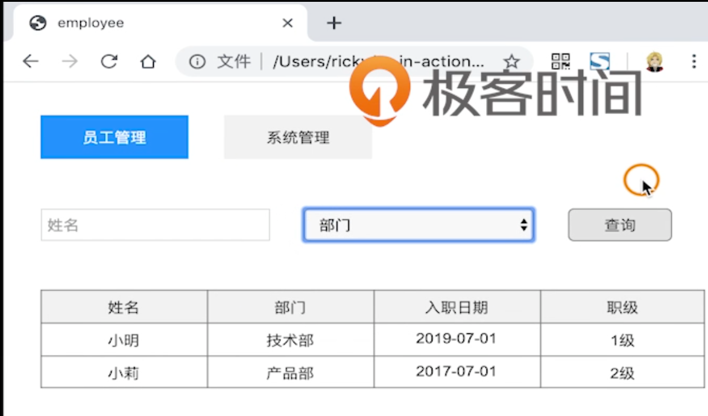
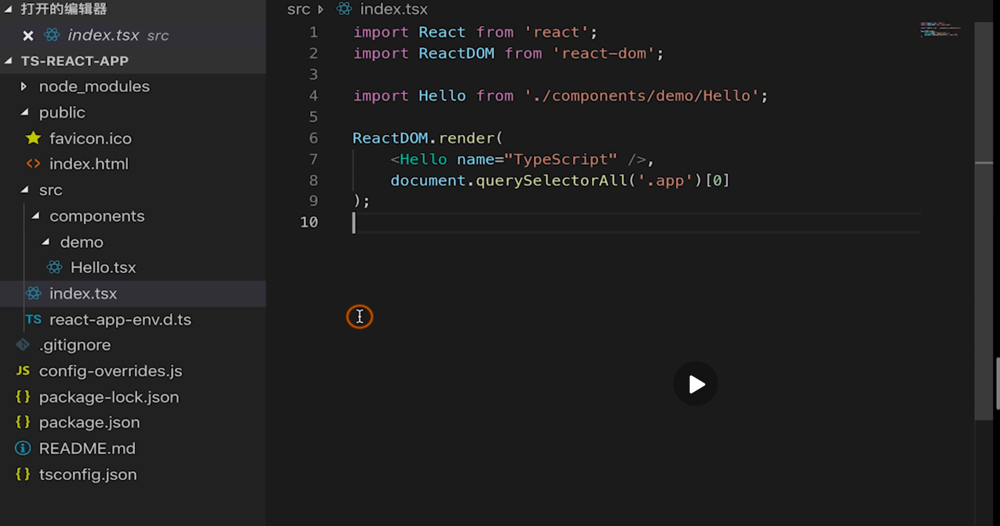

# 32 | 创建项目

[TOC]

接下来，我们进入实战篇，在这第一部分将编写一个 React 应用。

本节课，将要学习如何创建这个应用。

## 项目需求

我们需要实现一个简单的员工管理系统：



我们可以通过输入员工的姓名和部门来查询员工的信息，此外还有一个系统管理页面：


在这里可以进行一些简单的系统配置。

## 创建 React 项目

首先，我们使用手动的方式来创建，这样会对创建的细节有比较清楚的了解。然后，会使用一个脚手架工具来创建，它可以帮助我们减少很多配置工作，这样我们就可以专注于业务代码的开发。

### 手动创建

手动创建是基于 HelloWorld 工程，首先安装一下 React 以及 ReactDom：

```shell
npm i react react-dom
```

这样 react 就安装完毕了，下面需要安装声明文件：

```shell
npm i @types/react @types/react-dom
```

使用 TS 来开发 React 应用需要修改配置项，`tsconfig.json`：

```json
{
  "complierOptions" : {
    "jsx": "react"
  }
}
```

这里我们需要使用到 `jsx` 配置项，这个配置项一共有三个值：

- `preserve` —— 它的含义是生成的代码会保留 JSX 格式，文件的扩展名就是 jsx，这样就可以被后续的转换操作继续使用，比如说可以传递 `babel` 
- `react-native` —— 生成的代码依然是 jsx，但是扩展名是 js
- `react` —— 生成的代码不会保留 jsx，而是纯 js 语法。

这里我们使用 `react` 

#### 创建组件

在 src 目录下创建 components 文件夹，再在 components 中创建 demo 文件夹，在 demo 中我们创建一个组件，扩展名是 tsx—— `Hello.tsx`：

```tsx
import React from 'react'

interface Greeting {
  name: string
}

const Hello = (props: Greeting) => <h1>{props.name}</h1>

export default Hello
```

首先导入 react，然后编写一个简单的无状态组件，这个组件有个参数 `props`，我们需要为这个参数指定一个类型，我们先定义一个接口来指定一个类型 `Greeting` ，这个接口有个成员 `name` 类型是 `string` ，`props` 的类型就是这个接口的类型，然后我们返回一个 html 元素，在这里显示出 `name` ，最后，我们把 `Hello` 导出，这样 `Hello` 组件就编写完毕了。

接下来，我们将 `Hello` 组件导入 `index.ts` 中： 

```tsx
import React form 'react'
import ReactDom from 'react-dom'
import Hello from './components/demo/Hello'

ReactDom.render(
  <Hello name="TypeScript" />,
  document.querySelectorAll('.app')[0]
)
```

首先导入 react 和 react-dom 还有 Hello 组件，然后我们将 Hello 组件渲染到页面中。

接着我们来运行一下，会编译失败，这是因为需要修改 `index.ts` 为 `index.tsx`，并且记得要把 webpack 的配置文件入口文件也修改一下。

接下来，我们来优化一下 webpack 的打包，因为 react 库的体积很大，一般我们会**把库文件和业务文件拆分成两个文件**，这样也可以充分利用浏览器的缓存。

修改 webpack 的配置——`webpack.base.config.js`：

```js
module.export = {
  entry: {
    'app': './src/index.tsx'
  },
  output: {
  	filename: '[name].[chunkhash:8].js'
	},
  optimization: {
    splitChunks: {
      chunks: 'all'
    }
  }
}
```

在这里，需要为入口文件单独提供一个名称，然后需要修改一下输出的文件名，这里不要写死，文件名后面希望加上 hash，hash 的长度我们希望为 8。接下来，做一下 webpack 的拆包，webpack 4 提供一种新的拆包方式，在以前我们需要用插件来实现。在这里我们需要添加一个配置项就可以了，这个配置项叫 `splitChunks` ，这里指定为 `all`， `splitChunks`有非常丰富的配置，这里我们使用最简洁的，通过这个配置，webpack 就会默认把 npm 下的包抽离出来单独打包为 `vendors` 文件。

接下来，我们进行生产环境的构建，来看一下结果，执行：

```shell
npm run build
```

我们看 dist 目录下：


`app` 就是我们的业务代码，`vendors` 就是库的代码，后面都跟上了 hash，这里注意 app 的 hash 是 b18，vendors 的 hash 是 59e。接着我们修改一下 `index.tsx` ，然后重新构建，构建后的文件：


可以看到 app 后面的 hash 已经改变了，而 vendors 后面的 hash 没有改变，那么就可以利用浏览器的缓存加快页面的加载速度。

到此，一个简单的 React 工程就创建完毕，在这个例子中我们仅仅使用了 `ts-loader` 作为编辑器，此外我们还可以使用 `babel-loader` 来构建，这个作为课外作业留着你们去实践。

以上是使用手动的方式创建了这个项目，下面我们使用一个脚手架工具快速项目。

### 脚手架创建项目

我们先返回上一级目录（返回到了手动项目所在目录）：

```shell
cd ..
```

（这里使用 `..` 就能代表上级）

接着，使用一个命令来创建，这个命令就是 `npx` ，它能够避免全局安装，这样我们在装脚手架的时候就能够将其临时下载到一个目录下，使用了之后会删除，这样就能够保证我们安装的脚手架总是最新的版本，这里我们使用 FaceBook 提供的 `create-react-app` 脚手架：

```shell
npx create-react-app ts-react-app --template typescript
```

`create-react-app` 后面紧跟的就是项目的名称，然后我们需要指定一个参数 `--typescript` ，这样就会基于 TS 为我们创建这个工程。

打开这个工程，运行：

```shell
npm start
```

启动这个项目，然后就能看到页面了。

这个脚手架几乎是 0 配置，非常的方便，下面我们来看一下这个工程的目录结构：

- `public` 目录里的内容会拷贝到最终生成的项目根目录下，其中 `index.html` 是必须的，它是首页模块，所有被构建的脚本都会被注入到 `index.html` 中。此外，我们还可以在 `public` 目录中放入一些静态文件，比如图标、字体等，对于静态文件的引用，在前面需要加入 `&PUBLIC_URL&` ，比如：

  ```html
  <link rel="manifest" href="%PUBLIC_URL%/manifest.json" />
  ```

  这里对 `json` 文件引入就加上了 `&PUBLIC_URL&` 这个前缀

- `src` 目录就是项目的源码了

  - `App.tsx` 是组件，`App.test.tsx` 是组件的测试文件。
  - `index.tsx` 是整个工程的入口文件。

- `package.json`：

  ```json
  {
    "name": "react-typescript-app",
    "version": "0.1.0",
    "private": true,
    "dependencies": {
      "@types/jest": "24.0.18",
      "@types/node": "12.7.2",
      "@types/react": "^16.9.2",
      "@types/react-color": "^3.0.1",
      "@types/react-dom": "16.9.0",
      "@types/reactcss": "^1.2.3",
      "react": "^16.9.0",
      "react-color": "^2.17.3",
      "react-dom": "^16.9.0",
      "react-scripts": "3.1.1",
      "reactcss": "^1.2.3",
      "typescript": "3.6.2"
    },
    "scripts": {
      "start": "react-scripts start",
      "build": "react-scripts build",
      "test": "react-scripts test",
      "eject": "react-scripts eject"
    },
    "eslintConfig": {
      "extends": "react-app"
    },
    "browserslist": {
      "production": [
        ">0.2%",
        "not dead",
        "not op_mini all"
      ],
      "development": [
        "last 1 chrome version",
        "last 1 firefox version",
        "last 1 safari version"
      ]
    }
  }
  ```

  这里已经为我们预装了一些包，比如 `react`、`typescript` 等等，但我们需要注意，脚手架为我们安装的包远不只有这些，比如在这里我们就看不到 webpack，甚至在工程中也看不到 webpack 的配置文件，这个是因为脚手架为我们隐藏，都被封装到了 `react-scripts` 这个包里面。npm 的启动脚本也是执行了这个脚本，如果你对配置项不满意，想要自己配置，当然也可以使用 `eject` 命令，这个命令可以暴露出 webpack 的一些隐藏配置，注意这个操作不是很必要，也是不可逆的，在这里就不进行演示了。

我们后面实战篇的内容会基于这个工程来开发，下面就对这个工程进行改造，为了节约时间，改造过程就省略了，我们来看一下改造后的目录；



- 首先我们清理的 `public` 文件夹，只留了 `index.html` （HelloWorld 工程中的首页） 和 `favicon.ico` 
- `src` —— 将 `HelloWorld` 工程中的文件迁移了过来，其他的文件都被清理了。

下面我们就来看一下安装了哪些包

生产依赖：

```json
"dependencies": {
  "@types/jest": "24.0.15",
  "@types/node": "12.6.8",
  "@types/react": "16.8.23",
  "@types/react-dom": "16.8.5",
  "antd": "^3.20.7",
  "axios": "^0.19.0",
  "react": "^16.9.0",
  "react-dom": "^16.9.0",
  "react-router-dom": "^5.0.1",
  "react-scripts": "3.0.1",
  "typescript": "3.5.3"
},
```

- `antd` —— UI 组件库
- `axios` —— 用于发送 ajax 请求
- `react-router` —— 路由

开发依赖：

```json
"devDependencies": {
  "@types/react-router-dom": "^4.3.4",
  "babel-plugin-import": "^1.12.0",
  "customize-cra": "^0.4.1",
  "http-proxy-middleware": "^0.19.1",
  "http-server": "^0.11.1",
  "react-app-rewired": "^2.1.3"
}
```

- `babel-plugin-import` —— 实现 `andt` 的按需加载
- `customize-cra` & `react-app-rewired` —— 可以帮助我们实现对 `create-react-app` 脚手架的自定义
- `http-server` & `http-proxy-middleware` —— 帮助我们搭建 mock-server

根目录下的 `config-overrides.js`：

```js
const { override, fixBabelImports } = require('customize-cra');

module.exports = override(
    fixBabelImports('import', {
        libraryName: 'antd',
        libraryDirectory: 'es',
        style: 'css'
    })
);
```

这个文件是 `andt` 官方提供的解决方案，通过这个文件可以实现 `antd` 的按需加载，只需引入这个包就可以了，相应的样式也会自动的引入。

脚手架默认创建的 `tsconfig.json`：

```json
{
  "compilerOptions": {
    "target": "es5",
    "lib": [
      "dom",
      "dom.iterable",
      "esnext"
    ],
    "allowJs": true,
    "skipLibCheck": true,
    "esModuleInterop": true,
    "allowSyntheticDefaultImports": true,
    "strict": true,
    "forceConsistentCasingInFileNames": true,
    "module": "esnext",
    "moduleResolution": "node",
    "resolveJsonModule": true,
    "isolatedModules": true,
    "noEmit": true,
    "jsx": "preserve"
  },
  "include": [
    "src"
  ]
}
```

这里提供了默认的配置，一般不需要我们去修改。


## 小结

本节课我们通过两种方式创建了 react 工程，一种是手动的方式，一种是脚手架的方式，我们可以根据情况进行选择。