# 03-1.基础篇：webpack 进阶用法

[TOC]

## 22 | 自动清理构建目录产物

### 当前构建时的问题

每次构建的时候不会清理目录，造成构建的输出目录 output 文件越来越多。

### 解决问题

#### 通过 npm scripts 清理构建目录

```shell
rm -rf ./dist && webpack
```

```shell
rimraf ./dis && webpack
```

- `rimraf` 是一个库

这种解决方式是在 `package.json` 的 `scrips` 字段中添加删除输出目录然后再运行 webpack 进行打包的脚本。但这种方式并不优雅。

#### 使用插件自动清理构建目录

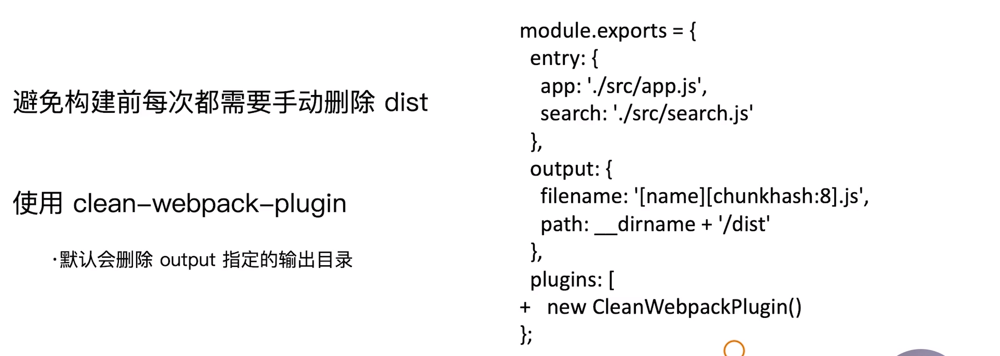

使用 `clean-webpack-plugin` 插件来避免我们每次构建之前都需要手动删除 dist 的操作。

使用方式很简单，安装包，然后在 `plugins` 中引入，接着它就会自动删除 `output` 所指定的目录。

```js
const {CleanWebpackPlugin} = require('clean-webpack-plugin')

module.exports = {
 plugins: [
   new CleanWebpackPlugin()
 ] 
}
```


### 课后问答

看了一下评论区的问题主要集中在

```js
const CleanWebpackPlugin = require('clean-webpack-plugin');
const { CleanWebpackPlugin } = require('clean-webpack-plugin');
```

的问题。

主要是clean-webpack-plugin这个插件进行了大版本升级，作者提供了不同的导出源码

```js
class CleanWebpackPlugin { 
    // ... 
}
// v2+
var _default = CleanWebpackPlugin;
exports.default = _default;
module.exports = exports.default;
module.exports.default = exports.default;
// v3
exports.CleanWebpackPlugin = CleanWebpackPlugin;
```

可知v3只剩下解构一种方式了。

> 作者回复: 是的，可能这个插件的后续的版本会提供其它的类出来，手动滑稽


老师，dev环境文件写在缓存当中，为什么还要清理呢？多谢。

> 并不是说dev环境写在缓存。而是热更新的结果在内存中，不会输出到硬盘上。视频中执行build命令配置指向的是webpack.prod.js，你当然可以将其换成webpack.dev.js，这样打包出来的就是开发环境的结果。


请问老师，这些plugin的引入顺序没有要求吗，我看您加入clean时，直接加到了最后面。

> 作者回复: loader 有严格的顺序要求
>
> plugins 可能会存在顺序要求，不过很少，不是很严格，这个也是 webpack 会让人困惑的地方。因为 plugin 是通过 webpack 的 Tapable 的钩子进行事件控制的，也就是**插件通过事件监听的方式进行执行**。用的plugin会自己绑定相应的事件，所以一般不用关注顺序。


困惑：为什么要重构模块？

> 作者回复: 重新 build 的模块需求很多的。
>
> 1. 本地开发阶段：想看看代码打包出来的体积大小，比如一个页面打包出发发现有 1M 的 js，这个显然是不合理需要优化的。打包出来的图片资源太大(500k)、太小(3k)等等，这些都需要优化相关资源后再次打包看效果。
>
> 2. 机器部署资源到 cdn，每次机器部署也是会进行 npm run build 这个命令去打包代码，打包后进行资源同步的操作(ssh，rsync等)。每次 push 代码到 Git 等平台会重新触发构建。如果构建前不清理构建目录，那么需要部署的文件夹会越来越大，项目一多，机器磁盘都打爆了。
>
> 3. 线上代码发现错误，本地可以进行 npm run build 去代理线上脚本，修改完错误后也需要重新 build 看看结果

## 23 | PostCSS插件autoprefixer自动补齐CSS3前缀

这一小节课学习在 webpack 中对 css 增强的一些功能。

如今由于移动设备的浏览器众多，因此需要面对兼容性问题。而有一些兼容性问题的解决可以在构建阶段进行，比如添加 CSS3 前缀。

### CSS3 的属性为什么需要前缀？

> w3c跟各大浏览器厂商说：这个标准基本上以后会成为标准，但是有可能会有改变，你自己看着办
> 开发者跟各大浏览器厂商说：我不管你现在给不给我这个标准，我只要求一点，如果你给了，你必须保证这个标准以后不会变，也就是说我写一遍代码，确保能工作以后，你以后升级也要保证我这个能工作；
> 浏览器：【日了狗了】只能按照w3c的预定标准修修补补改改优化优化自己写一套标准，但是又不能占用原本的名字，不然的话以后就要改了，怎么办呢？加个前缀吧。。这个自己定义的标准给开发者用，以后w3c标准出来了，按照他们的标准做一个不带前缀的。开发者爱用哪个用哪个
>
>  
>
> 通俗点说，这个前缀有点类似于我们所说的 **“个人观点”**，
> 当官方（W3C）还没有宣布支持这个观点的时候
> 这个CSS样式就只能被这个浏览器自己使用
>
> 比如trasform ，其实chrome浏览器和火狐浏览器**渲染的方式并不完全一样**
> 你可以理解为两种浏览器各有各的渲染方式
>
> 但是一旦官方宣布支持这个CSS样式了，就可以去掉前缀，被所有的主流浏览器使用了
> 比如border-radius，现在不加前缀也可以使用
>
> 
>
> 来自：https://www.zhihu.com/question/32418631

（实际上是 w3c 还没有完全确定标准之前，各浏览器对这一样式的单独、提前的实现，为了在确定标准之前不占用这一样式名称而设计的一种**命名方式**）

现在主要由四种不同内核的浏览器组成：

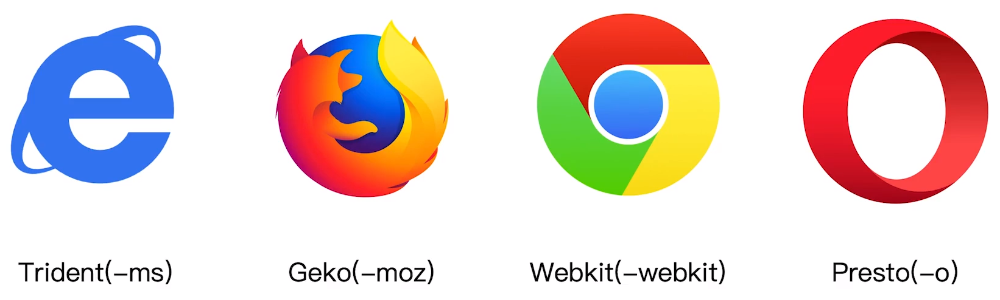

为了让浏览器能够识别并解析我们的 CSS，我们需要添加不同的前缀。举例：

```css
.box {
  -moz-border-radius: 10px;
  -webkit-border-radius: 10px;
  -o-border-radius: 10px;
  border-radius: 10px;
}
```

- 对于 `border-radius` 样式，在前几年前还是需要添加前缀的。

### 如何在编写 CSS 时不需要添加前缀？ —— 自动补全

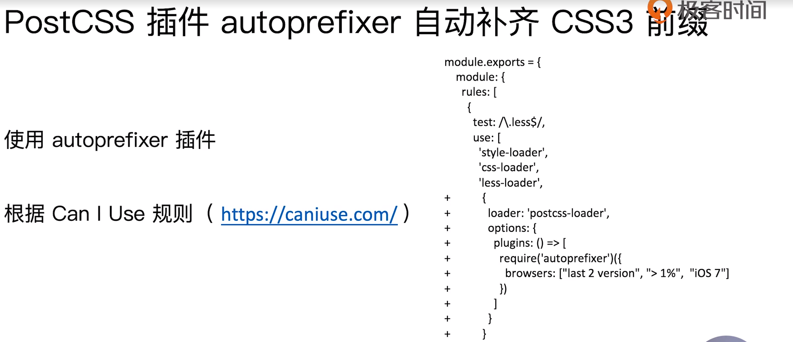

- 使用 `autoprefixer` 就可以帮我们自动补齐前缀。`autoprefixer` 是 css 的一个后置处理器，与 less 和 sass 不同，它们是 css 的预处理器，预处理器是指将代码处理为 css 的工具，而后置处理器是指将处理后的 css 再进行处理。

- 根据 [Can I Use](https://caniuse.com/) 上所展示的兼容性做处理。
- `autoprefixer` 需要和 `postcss-loader` 一起使用，`postcss-loader` 的功能比较强大，除了做 css 样式前缀的补全之外，它还能够做 css module、支持 style-lint 等等。

### 实际操作

安装包：

```shell
npm i postcss-loader autoprefixer -D
```

`webpack.prod.js` :

```js
module: {
    rules: [
      {
        test: /\.less$/,
        use: [
          MiniCssExtractPlugin.loader,
          'css-loader',
          'less-loader',
          { 
            loader: 'postcss-loader',
            options: {
              plugins: () => [
                require('autoprefixer')({
                   //浏览器兼容版本，这里是某一浏览器最近两个版本 | 使用人数 > 1% | 兼容 ios7 以上
                  overrideBrowserslist: ['last 2 version', '>1%', 'ios 7']
                })
              ]
            }
          }
        ]
      },
```

- 15 行，将 browsers 更改为 overrideBrowserslist


### 课后问答

请问你编译的时候，没有提示吗？
Replace Autoprefixer browsers option to Browserslist config.
  Use browserslist key in package.json or .browserslistrc file.

  Using browsers option cause some error. Browserslist config 
  can be used for Babel, Autoprefixer, postcss-normalize and other tools.

  If you really need to use option, rename it to overrideBrowserslist.

  Learn more at:
  https://github.com/browserslist/browserslist#readme
  https://twitter.com/browserslist

> 作者回复: 最新的 autoprefixer 版本里面建议把 browserslist 写在 package.json 或者 . browserslistrc 文件里面去了（刚刚更新，😓）。
>
> 不过你可以直接把browsers改成overrideBrowserslist也可以哈


摘自postcss/postcss-loader的github。
After setting up your postcss.config.js, add postcss-loader to your webpack.config.js. You can use it standalone or in conjunction with css-loader (recommended). Use it after css-loader and style-loader, but before other preprocessor loaders like e.g sass|less|stylus-loader, if you use any.

设置postcss.config.js后，将postcss-loader添加到webpack.config.js中。 您可以单独使用它，也可以将其与css-loader结合使用（推荐）。 如果要使用它，请在css-loader和style-loader之后（指数组中引入的位置），但在其他预处理程序加载器（例如sass | less | stylus-loader）之前使用。

老师，您写的顺序是否是有问题的，可又未见有什么影响。请教老师。

> 作者回复: postcss-loader 执行顺序必须保证在 css-loader 之前，建议还是放在 less 或者 sass 等预处理器之后更好。即 loader 顺序：
> less-loader -> postcss-loader -> css-loader -> style-loader 或者 MiniCssExtractPlugin.loader
>
> 其实 postcss-loader 放在 less-loader 之前问题也不大，平时使用的 less 里面的语法基本不会和 autoprefixer 处理产生冲突的


老师，有关于postcss-loader，有个疑问，为什么这个loader是个Object？这个loader里面的options怎么还会有个plugins？这个和webpack的plugins有啥关联吗？

> 作者回复: 这个是通过loader的options传递postcss所需要用到的插件，**这个插件是postcss生态下的**。
>
> 和webpack插件没有关联。


同问关于postcss-loader的引入位置，为什么要写在less-loader的后面(即先执行postcss-loader)。请教老师。

> 作者回复: postcss-loader 的执行顺序写在 css-loader 之前即可，也就是需要**在 css-loader 将样式转换成 cjs 对象插入到 js 代码前**。

## 24 | 移动端CSS px自动转换成rem

本节课讲解另一个 webpack 辅助 css 开发的功能 —— 自动转换为 rem

### 为什么需要转换为 rem？

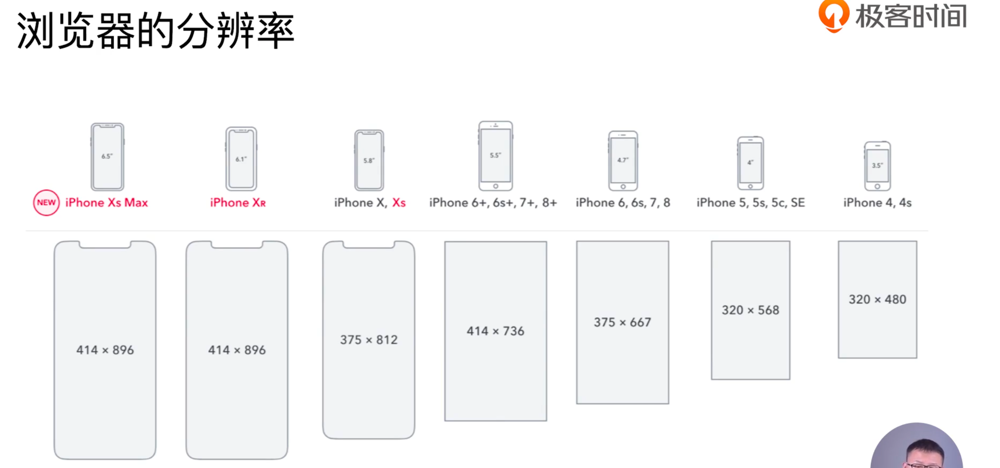

不得不提及分辨率，比如以这里的 iphone 为例，每年都会出不同的机型，不同的机型其分辨率也不同，而不同的分辨率也需要前端进行适配。

以往解决适配的方式是通过媒体查询根据不同的屏幕分辨率书写不同的样式规则：

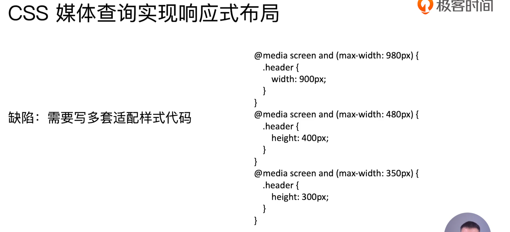

但这种方式需要写多套适配样式代码，非常影响开发效率。（但这种方式对于不同终端之间样式不同问题的处理却是实用的，比如平板电脑、手机、PC 之间）

所以，为了解决开发效率问题，我们可以使用 CSS3 所提供的新单位 rem。

### Rem 是什么？

W3C 对 rem 的定义：font-size of the root element

rem 和 px 的对比：

- rem 是相对单位
- px 是绝对单位

对于 px 绝对单位来说，无论你使用什么设备，无论你的字体大小是多少，无论你所显示的元素的父元素的 px 值是多少，其显示的大小都是固定的。而对于 rem 相对单位来说，其大小是相对于根元素的字体大小来计算的，1 rem = 1 根元素 font-size 大小，所以对于不同的设备设置不同的根元素的字体大小即可实现不同设备上显示的大小不同，也就可以实现整体视图在不同的设备上按一定比例的改变，从而让不同的设备显示的页面能够更好实现设计稿上的视图。

### webpack——移动端 CSS px 自动转换成 rem

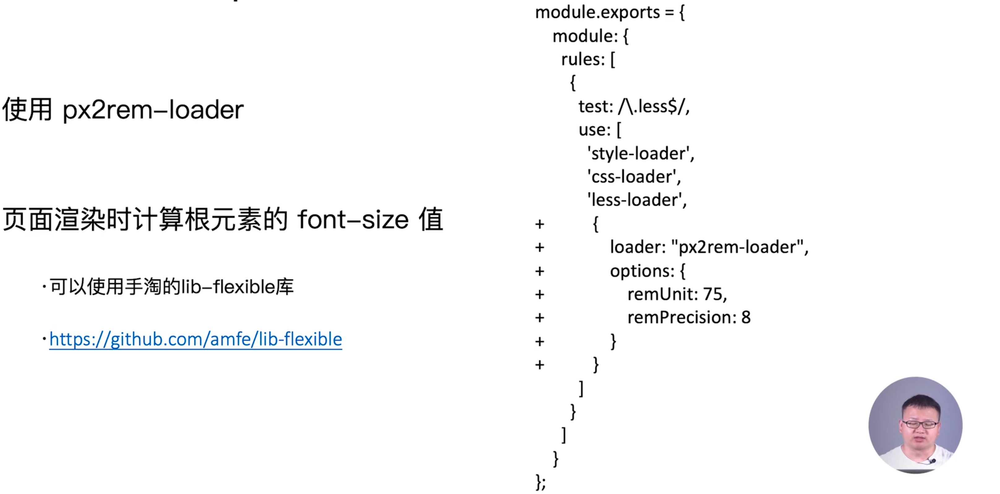

一般设计稿是按照 375px 或是 750px 宽度进行设计的，我们在编写样式的大小值时直接按照设计稿上的 px 值写即可，然后  `px2rem-loader`  会自动将其转换为 rem，这是第一步。

第二步，我们需要知道 1rem 是多少 px，可以在页面打开时由 js 来动态计算根元素字体大小的值从而获取。这里，我们可以使用手淘团队的一个比较成熟的方案——`lib-flexible` 库来帮助我们进行计算。

### 实际操作

安装：

```shell
npm i px2rem-loader -D
```

```shell
npm i lib-flexible -S
```

在 `webpack.dev.js` 中添加配置：

```js
modules.exports = {
  module: {
    rules: [
      {
        test: /\.less$/,
        use: [
          MiniCssExtractPlugin.loader,
          'css-loader',
          {
            loader: 'postcss-loader',
            options: {
              plugins: () => [
                require('autoprefixer')()
                // {
                //   overrideBrowserslist: ['last 2 version', '>1%', 'ios 7'] //浏览器兼容版本，这里是某一浏览器最近两个版本 | 使用人数 > 1% | 兼容 ios7 以上
                // }
              ]
            }
          },
          {
            loader: 'px2rem-loader',
            options: {
              // rem 相对于 px 的转换单位，75 表示 1rem = 75px，这是对于宽度为 750px 的设计稿设置的，在这里就是 10rem
              remUnit: 75,
              // px 转换为 rem 时所保留的小数点位数
              remPrecision: 8
            }
          },
          'less-loader',
        ]
      },
    ]
  }
}
```

在 `index.html` 中添加`lib-flexible` 脚本，本来添加这段脚本最好的方式是让 webpack 自动帮我们将其内联到 `index.html`，但由于目前还并不支持这样的功能，所以这里手动添加：

```html
<!DOCTYPE html>
<html lang="en">
  <head>
    <meta charset="UTF-8" />
    <meta name="viewport" content="width=device-width, initial-scale=1.0" />
    <meta http-equiv="X-UA-Compatible" content="ie=edge" />
    <title>index</title>
    <script type="text/javascript">
      (function(win, lib) {
        var doc = win.document;
        var docEl = doc.documentElement;
        var metaEl = doc.querySelector('meta[name="viewport"]');
        var flexibleEl = doc.querySelector('meta[name="flexible"]');
        var dpr = 0;
        var scale = 0;
        var tid;
        var flexible = lib.flexible || (lib.flexible = {});

        if (metaEl) {
          console.warn('将根据已有的meta标签来设置缩放比例');
          var match = metaEl
            .getAttribute('content')
            .match(/initial\-scale=([\d\.]+)/);
          if (match) {
            scale = parseFloat(match[1]);
            dpr = parseInt(1 / scale);
          }
        } else if (flexibleEl) {
          var content = flexibleEl.getAttribute('content');
          if (content) {
            var initialDpr = content.match(/initial\-dpr=([\d\.]+)/);
            var maximumDpr = content.match(/maximum\-dpr=([\d\.]+)/);
            if (initialDpr) {
              dpr = parseFloat(initialDpr[1]);
              scale = parseFloat((1 / dpr).toFixed(2));
            }
            if (maximumDpr) {
              dpr = parseFloat(maximumDpr[1]);
              scale = parseFloat((1 / dpr).toFixed(2));
            }
          }
        }

        if (!dpr && !scale) {
          var isAndroid = win.navigator.appVersion.match(/android/gi);
          var isIPhone = win.navigator.appVersion.match(/iphone/gi);
          var devicePixelRatio = win.devicePixelRatio;
          if (isIPhone) {
            // iOS下，对于2和3的屏，用2倍的方案，其余的用1倍方案
            if (devicePixelRatio >= 3 && (!dpr || dpr >= 3)) {
              dpr = 3;
            } else if (devicePixelRatio >= 2 && (!dpr || dpr >= 2)) {
              dpr = 2;
            } else {
              dpr = 1;
            }
          } else {
            // 其他设备下，仍旧使用1倍的方案
            dpr = 1;
          }
          scale = 1 / dpr;
        }

        docEl.setAttribute('data-dpr', dpr);
        if (!metaEl) {
          metaEl = doc.createElement('meta');
          metaEl.setAttribute('name', 'viewport');
          metaEl.setAttribute(
            'content',
            'initial-scale=' +
              scale +
              ', maximum-scale=' +
              scale +
              ', minimum-scale=' +
              scale +
              ', user-scalable=no'
          );
          if (docEl.firstElementChild) {
            docEl.firstElementChild.appendChild(metaEl);
          } else {
            var wrap = doc.createElement('div');
            wrap.appendChild(metaEl);
            doc.write(wrap.innerHTML);
          }
        }

        function refreshRem() {
          var width = docEl.getBoundingClientRect().width;
          if (width / dpr > 540) {
            width = 540 * dpr;
          }
          var rem = width / 10;
          docEl.style.fontSize = rem + 'px';
          flexible.rem = win.rem = rem;
        }

        win.addEventListener(
          'resize',
          function() {
            clearTimeout(tid);
            tid = setTimeout(refreshRem, 300);
          },
          false
        );
        win.addEventListener(
          'pageshow',
          function(e) {
            if (e.persisted) {
              clearTimeout(tid);
              tid = setTimeout(refreshRem, 300);
            }
          },
          false
        );

        if (doc.readyState === 'complete') {
          doc.body.style.fontSize = 12 * dpr + 'px';
        } else {
          doc.addEventListener(
            'DOMContentLoaded',
            function(e) {
              doc.body.style.fontSize = 12 * dpr + 'px';
            },
            false
          );
        }

        refreshRem();

        flexible.dpr = win.dpr = dpr;
        flexible.refreshRem = refreshRem;
        flexible.rem2px = function(d) {
          var val = parseFloat(d) * this.rem;
          if (typeof d === 'string' && d.match(/rem$/)) {
            val += 'px';
          }
          return val;
        };
        flexible.px2rem = function(d) {
          var val = parseFloat(d) / this.rem;
          if (typeof d === 'string' && d.match(/px$/)) {
            val += 'rem';
          }
          return val;
        };
      })(window, window['lib'] || (window['lib'] = {}));
    </script>
  </head>
  <body>
    <div id="root"></div>
  </body>
</html>
```

- 这里在 `node_modules` 目录中找到 `lib-flexible` 目录，然后将 `flexible.js` 中的代码复制到 `<script>` 中。
- 由于这段脚本需要在页面刚刚加载时就运行，所以这里是前置放置在 `<head>` 之中。

这里产生了一个问题，对于某些脚本代码想要通过内联到 `html` 中时，是否自动帮我们进行内联。那么接下来的一小节将会讲解在 webpack 中如何做资源的内联，比如**样式内联、JS 库内联、内联图片字体**等等。


### 课后问答

老师，您的px转rem的demo有一个问题，search.less文件的代码，您只写了一层{}的代码，如果里面再嵌套一层{}，那么编译的时候会报错，错误原因是先执行了px2rem-loader编辑，less-loader在后面，module.rules 里less-loader应该写在px2rem-loader后面，我是这样改，然后就可以的


这样统一转化 rem  是方便，但是有的时候有些样式并不想转化，这个时候就感觉不灵活了

> 作者回复: 这个问题可以解决的，可以用 /*no*/ 这种注释语法。比如：
>
> .page {
>  font-size: 12px; /*no*/
>  width: 375px; /*no*/
>  height: 40px; 
> }
>
> 后面有 /*no*/这种注释语法会不进行 rem 的转换


html根节点的大小计算，可以使用html:{font-size:calc(100vw/固定分辨率)}
这样可以不用引入⽤用⼿手淘的lib-flexible库，也能动态计算大小。

> 作者回复: 手淘的这个库有个好处，它会比较方便的解决手机端的1px问题。


现在不是不推荐使用rem了么，现在项目里面用vw用的更多一些

> 作者回复: 主要是兼容性方面的考虑，rem兼容性更好。


这个最大的缺点就是会把第三方ui库的px也给转了

> 作者回复: 这个px2rem-loader 也是可以设置 exclude 的，可以把 node_modules 里面的模块 exclude 掉。
>
> 另外如果不设置 exclude，那么也可以使用 /*no*/的语法去设置某一行样式不进行 px2rem 的转换操作。


这个是移动端适配的吧，如果需要同时兼容pc和移动，还是使用ui框架好些吧

> 作者回复: 同时兼容pc和移动端在实际的中大型web应用并不常见。因为这种应用页面pv/uv很高，产品侧会充分根据端的优势进行功能的设计，导致设计展示的内容完全不一样。
>
> 当然，如果是简单的网站或者后台B端系统应用UI框架是可以的。


这里lib-flex一定要内里联进来吗，可以引入文件吗？

> 作者回复: 这个是必须要内联进来的，因为页面打开的时候就需要马上计算页面的根节点的 font-size 值。如果不内联进来而是打包到了 js 里面去，那么样式解析的时候会有问题，可能存在样式闪动的情况

（其实也可以引入，只是需要将引入放在 `<head>` 中，否则确定会有抖动的情况，因为会出现先渲染页面，再加载更改根节点 font-size 的情况）


请问vm布局和rem哪个适配好，都有什么不同

> 作者回复: 主要是兼容性上。rem兼容性更好，支持android2.2以上的机型。但是vm只支持android4.4和ios8以上的。
>
> 另外rem需要的计算需要在头部内联一个脚本，vm是纯css去实现的。
>
> 如果不考虑兼容性，vm完全没问题


请问内联样式该如何转为rem？

> 作者回复: 内联的样式如果想转换成rem需要自己实现 loader 去解析 html 文件哈。
>
> 你可以实现一个 loader，然后这个 loader 去匹配 html，然后将 html 里面的 px 都转换成 rem 就好了


用了这个插件，写css的时候不用转化rem了，编程变得更简单了

> 作者回复: 哈哈，是呀。我们团队之前没有自动将 css 转成 rem 的时候，功能提交测试后一堆的兼容性 bug 单。
>
> 通过构建将 px 自动转换成 rem 后，兼容问题都少了好多了，基本是一套样式适配所有手机设备屏幕。

## 25 | 静态资源内联

### 什么是资源内联

将 CSS、JS 代码或是图片资源等添加到 html 文件中。

### 资源内联的意义

#### 代码层面

- 页面框架的**初始化**脚本
  - 比如上节课中，通过脚本来初始化根元素的 font-size
- 上报相关打点
  - 比如 css 初始化，css 加载完成，js 初始化与 js 加载完成，等等上报点代码，这些需要内联到 html 中去，而不能放到脚本之中。
- css 内联避免页面闪动

#### 请求层面：减少 HTTP 网络请求次数

- 小图片或者字体内联（url-loader）（作为 database）


### 实际操作

#### HTML 和 JS 内联

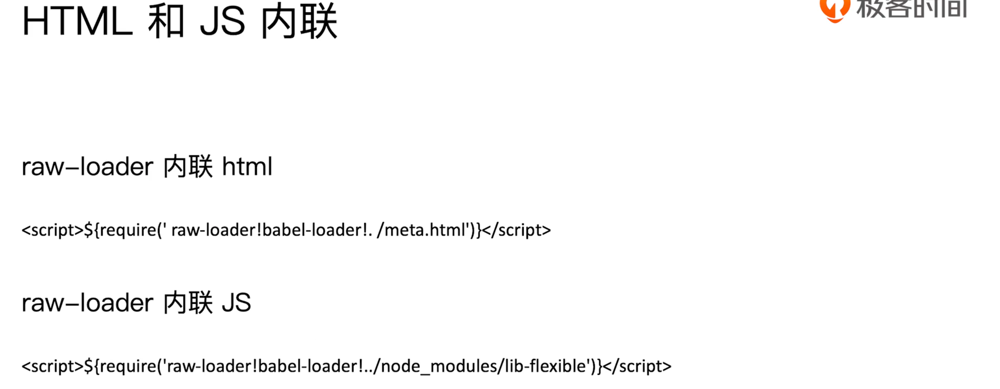

- 这里使用 `raw-loader` 来帮助我们进行内联。
- 对于内联 html 可能存在的使用场景是需要内联一部分 html 片段，比如开发手机端页面时会使用大段的 `meta` 标签来提供一些信息，而如果是多个页面项目，则每个页面都需要这段 `meta` 。那么需要将这些 `meta` 提取为叫 `meta.html` ，然后每个页面的模版将其内联进来即可。
- 对于 js 脚本，也是一样，只是如果你所内联的脚本是自己所写的业务代码并使用了 ES6 的一些特性，则在引入之前就可能需要使用到 `babel-loader` 进行转换，那么就要在引入时添加 `babel-loader`。
- `raw-loader` 也就十几行代码，所以如果不想使用，也可以自己实现。
- 注意，最好使用 0.5 的版本，因为最新版存在问题。（当然现在不一定，可能已经修复了）

#### CSS 内联

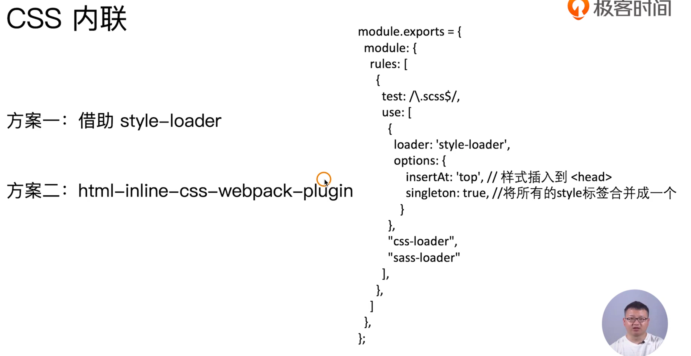

- 方案一：借助 `style-loader` ，添加 `singleton` 设置参数为 `true`，这样会将所有的 `<style>` 标签合并为一个，然后添加 `insertAt: 'top'` 则会将其插入到 `<header>` 中。
- 方案二：针对打包好的 CSS chunk 代码，如何将其添加到 `head` 标签之间。这个时候需要借助 `html-inline-css-webpack-plugin` 插件，将打包好的代码插入到 html 中对应的位置。这也是较多使用的方式。

#### 步骤

1.准备 `meat.html` 文件（来自腾讯 now 直播首页 copy）：

```html
<meta charset="UTF-8" />
<meta
  name="viewport"
  content="viewport-fit=cover,width=device-width,initial-scale=1,user-scalable=no"
/>
<meta name="format-detection" content="telephone=no" />
<meta
  name="keywords"
  content="now,now直播,直播,腾讯直播,QQ直播,美女直播,附近直播,才艺直播,小视频,个人直播,美女视频,在线直播,手机直播"
/>
<meta
  name="name"
  itemprop="name"
  content="NOW直播—腾讯旗下全民视频社交直播平台"
/>
<meta
  name="description"
  itemprop="description"
  content="NOW直播，腾讯旗下全民高清视频直播平台，汇集中外大咖，最in网红，草根偶像，明星艺人，校花，小鲜肉，逗逼段子手，各类美食、音乐、旅游、时尚、健身达人与你24小时不间断互动直播，各种奇葩刺激的直播玩法，让你跃跃欲试，你会发现，原来人人都可以当主播赚钱！"
/>
<meta
  name="image"
  itemprop="image"
  content="https://pub.idqqimg.com/pc/misc/files/20170831/60b60446e34b40b98fa26afcc62a5f74.jpg"
/>
<meta name="baidu-site-verification" content="G4ovcyX25V" />
<meta name="apple-mobile-web-app-capable" content="no" />
<meta http-equiv="X-UA-Compatible" content="IE=Edge,chrome=1" />
```


2.安装 `raw-loader` ：

```shell
npm i raw-loader@0.5.1 -D
```

- `raw-loader` 的功能是读取一个文件，将这个文件转换为一个 string，然后插入到你所设置的位置。


3.引入

```html
<!DOCTYPE html>
<html lang="en">
  <head>
    ${require('raw-loader!./meta.html')}
    <title>index</title>
    <script type="text/javascript">
    ${require('raw-loader!babel-loader!../node_modules/lib-flexible/flexible.js')}
    </script>
  </head>
  <body>
    <div id="root"></div>
  </body>
</html>
```

- 由于我们使用的是 `html-webpack-plugin` 插件，所以可以在 html 中使用 EJS 模版语法来引入 JS 脚本，也就是可以在 `${}`中添加 JS ，在打包时就会自动运行。
- 第 7 行引入 js 脚本时，需要将其包裹在 `<script>` 标签之中，并且需要引入 `babel-loader` 
- 注意 `require` 中 `!` 分隔语法，前面是所引入的 loader，最后是 loader 需要处理的文件模块。


4.`npm run build`


#### CSS 内联

通常情况下，为了更好的加载体验，我们会将打包好的 CSS 内联到 HTML 头部，这样 HTML 加载完成 CSS 就可以直接渲染出来，避免页面闪动的情况。那么 CSS 内联如何实现呢？

CSS 内联的核心思路是：将页面打包过程的产生的所有 CSS 提取成一个独立的文件，然后将这个 CSS 文件内联进 HTML head 里面。这里需要借助 `mini-css-extract-plugin` 和 `html-inline-css-webpack-plugin` 来实现 CSS 的内联功能。

```js
// webpack.config.js

const path = require('path');

module.exports = {
    entry: {
        index: './src/index.js',
        search: './src/search.js'
    },
    output: {
        path: path.join(__dirname, 'dist'),
        filename: '[name]_[chunkhash:8].js'
    },
    mode: 'production',
    plugins: [
        new MiniCssExtractPlugin({
            filename: '[name]_[contenthash:8].css'
        }),
        new HtmlWebpackPlugin(),
        new HTMLInlineCSSWebpackPlugin()	
    ]
};
```

注：`html-inline-css-webpack-plugin` 需要放在 `html-webpack-plugin` 后面。

再注：

```js
const {
  default: HTMLInlineCSSWebpackPlugin
} = require('html-inline-css-webpack-plugin');
```

- 需要这样引入 `HTMLInlineCSSWebpackPlugin` 


### 课后问答

老师好，我想问下这个raw-loader 导入的js ,css 如何进行压缩处理？

> 作者回复: raw-loader 内联进去的样式或者脚本的压缩都是基于 html-webpack-plugin 进行处理的。比如：
>
> ```js
> htmlWebpackPlugins.push(new HtmlWebpackPlugin({
>           template: path.join(projectRoot, `src/pages/${pageName}/index.html`),
>           filename: `${filename}${pageName}.html`,
>           chunks: [pageName],
>           // assetsPrefix: `${assetsPrefix}/`,
>           inject: inject && isEntryFileExists,
>           minify: minifyHtml
>             ? {
>               html5: true,
>               collapseWhitespace: true,
>               preserveLineBreaks: false,
>               minifyCSS: true,
>               minifyJS: true,
>               removeComments: false
>             }
>             : false
>         }));
> ```
>
> 这个插件有一个minify参数，用于压缩 html 里面内联的 css/js/html内容

> 后来自己找到答案了，压缩js可以使用uglify-loader ，使用loader内敛写法就行


raw loader 0.5.1的版本有点老了，在releases上都找不到了。最新版的应该没有问题吧(还没试)
https://github.com/webpack-contrib/raw-loader/releases

> 作者回复: 不能使用最新的 raw-loader 版本哈，它最新的 3.x 版本导出模块直接使用了 export default 的写法，html 里面的模块这么写的话webpack解析不了，需要是 cjs 的写法才行。


有一个疑问、一个问题：
（1）疑问：
style-loader的作用，官方解释：Adds CSS to the DOM by injecting a <style> tag.
所以，style-loader的功能，默认不就是把css插入到html的<style>里吗？为什么还要添加options才行呢？
（2）问题：
css资源内联没有演示。自己试了下方案⼀：借助 style-loader。设置了options有报错，提示不支持singelon属性。
ValidationError: Invalid options object. Style Loader has been initialised using an  options object that does not match the API schema.
 \- options has an unknown property 'singleton'. These properties are valid:
  object { injectType?, attributes?, insert?, base? }

> 作者回复: style-loader 插入样式是一个动态的过程，你可以直接查看打包后的 html 源码并不会看到 html 有 style 样式的。
>
> css-loader 的作用是将 css 转换成 commonjs 对象，也就是样式代码会被放到 js 里面去了。style-loader 是代码运行时动态的创建  style 标签，然后将 css style 插入到 style  标签里面去，对应的源码：https://github.com/webpack-contrib/style-loader/blob/master/src/runtime/injectStylesIntoStyleTag.js#L260
>
> CSS 内联的思路是：先将 css 提取打包成一个独立的 css 文件（使用MiniCssExtractPlugin.loader），然后读取提取出的 css 内容注入到页面的 style 里面去。这个过程在构建阶段完成。
>
> CSS 内联的演示已经以文章的形式更新到博客里面（https://github.com/cpselvis/blog/issues/5）
> CSS 内联的例子（https://github.com/cpselvis/geektime-webpack-course/tree/master/code/chapter03/inline-resource）


资源内联的用法感觉就像是公共模板一样，如果是vue这样的组件开发 应该是用不到。
感觉就跟ejs一样一样的，只不过ejs需要配合node服务端才能使用，这个内联webpack直接把模板引入打包好

> 作者回复: 这个资源内联还是很常见的，以前端监控脚本为例，如果不内联到html里面去而是以请求的方式价值，那假设这个前端监控的脚本请求加载失败的场景是无法监控的到的。


这个能不能想ejs一样，传递参数？替代模板中的某些内容

> 作者回复: 可以的，通过html-webpack-plugin可以把变量传递进去。比如当前的构建环境变量


老师，raw-loader跟以前含义不同了，经测试，最新版的确是不能这么用了，是不是最新版的已经不适用于再用来处理内联了？

> 作者回复: 最新的版本里面可以处理在 js 里面内联其它的资源
>
> 需要使用 raw-loader 的 0.5.1 版本哈，最新的版本的 raw-loader 使用了导出模块的时候使用了 export default 语法， html 里面用的话有问题。
>
> 你可以看看 raw-loader 的源码特别简单的，你完全可以实现一个内联的 loader

## 26 | 多页面应用打包通用方案

### 多页面应用（MPA）概念

每一次页面跳转的时候，后台服务器都会返回一个新的 html 文档，这种类型的网页也就是多页网站，也叫做多页应用。也就是理解为，有多个入口，一个页面对应一个业务。而单页面应用，则是把所有的业务放到一个大入口之中，不同的子业务实际上并不由 html 来呈现，而是由 js 来呈现。

#### MPA 的优势

- 1.每个页面之间解藕（实际上这种解藕的好处，SPA 依然可以做到，因为我们用 JS 来控制 html）
- 2.对 SEO 更加友好

### 多页面打包的基本思路

### 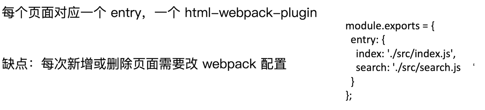

### 多页面打包通用方案

### 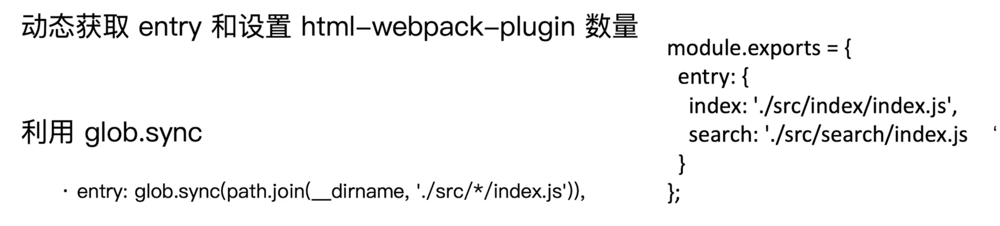

- 使用这种方式，实际上是需要遵守某种规则，比如路径和名称上的规则，比如位于 `src` 目录下的 `index.js` 文件。

- 利用 glob 包的 `glob.sync` 方法，比如这里就是同步匹配项目目录下 `src` 目录下一级目录下的每一个 `index.js` 文件。

### 实战操作

#### 梳理目录及文件结构

将不同的入口 js 文件按照特定的方式放好，比如这里是将每一个入口 js 文件及其 html 模版文件更名为 `index` 放在一个名称为入口名称的目录下（比如目录叫 `index` 和 `search` ），然后再将这个入口目录放在 `src` 目录下。如下：

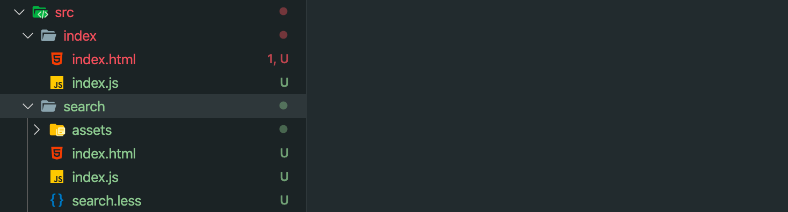

#### 编写代码

安装 `glob`

```shell
npm i glob -D
```

然后编写 `webpack.prod.js` 的代码：

```js
const glob = require('glob');

//动态设置 html 和 entry
const setMPA = () => {
  const entry = {};
  const htmlWebpackPlugin = [];

  // 通过 glob 来获取入口文件， * 代表匹配所有内容
  const entryFiles = glob.sync(path.join(__dirname, './src/*/index.js'));
  // 这里打印出来是一个所匹配文件的绝对路径字符串数组
  console.log('entryFiles', entryFiles);

  entryFiles.map(entryFile => {
    // 利用正则匹配路径字符串中的 pageName，也就是入口目录名称
    // '/Users/harry/Documents/GeekTime-courses/05-玩转 webpack/my-project-test/src/index/index.js'
    const mathResult = entryFile.match(/src\/(.*)\/index\.js/);
    const pageName = mathResult && mathResult[1];
    console.log('pageName', pageName)
    // 利用匹配出来入口名称，将其相应的值添加到返回的 entry 对象和 htmlWebpackPlugin 数组中
    entry[pageName] = entryFile;
    htmlWebpackPlugin.push(
      new HtmlWebpackPlugin({
        template: path.join(__dirname, `src/${pageName}/index.html`), // html 模板所在位置
        filename: `${pageName}.html`, // 指定打包出来之后的 html 名称
        chunks: [pageName], // 指定打包出来的 html 使用哪些 chunk
        inject: true, // 为 true 则将使用的 chunk 自动的注入到 html 之中
        minify: {
          html5: true,
          collapseWhitespace: true,
          preserveLineBreaks: false,
          minifyCSS: true,
          minifyJS: true,
          removeComments: false
        }
      })
    );
  });

  return {
    entry,
    htmlWebpackPlugin
  };
};

const { entry, htmlWebpackPlugin } = setMPA();

module.exports = {
  mode: 'production',
  watch: true,
  entry, 
  //...
  plugins: [
    new MiniCssExtractPlugin({
      filename: '[name]_[contenthash:8].css'
    }),
    new OptimizeCSSAssetsPlugin({
      assetNameRegExp: /\.css$/g,
      cssProcessor: require('cssnano')
    }),
    ...htmlWebpackPlugin,
    new HTMLInlineCSSWebpackPlugin(), // css 内联到 html 中
    new CleanWebpackPlugin() // 清除打包后目录
  ]
}
```

- 3 到 46 行代码，是利用 `glob` 包的 `sync` 方法通过通配符匹配出我们规定好路径的入口文件，会返回绝对路径字符串数组。然后轮训这个数组并匹配出每个路径字符串中的入口名称 pageName，利用 pageName 和 entryFile 动态的生成 webpack 配置中需要的 `entry` 字段和 `plugins` 中所要添加的 `htmlwebapckPlugin` 插件。
- 47 到 64 则是 webpack 配置，将执行 `setMPA` 函数返回的 `entry` 和 `htmlWebpackPlugin` 添加到其中。
- 在 16 行中，使用字符串方法 `match` 进行匹配时，正则中出现的 `*` 是可以单独匹配出来的，这一点值得去研究一下。

通过这样的方式，我们便只需要在 `src` 目录下按照匹配规则添加页面模版和入口文件，既可实现在不需要调整 webpack 配置文件的情况下对多页面应用的打包。


### 课后问答

特别想问一下，webpack和后端项目多页面怎么结合，尤其是更新相应文件缓存，还是说一定要和gulp结合

> 作者回复: 更新文件缓存是生成的文件指纹去控制的，文件变化后，那么文件指纹会发生相应变化，就不会出现缓存还在的问题了。顺便说下通常的文件缓存策略：
>
> html:  header 头的 cache-control 会设置成 no-cache。也就是 html 文件不会走缓存
>
> css/js/img 等静态资源：header头的 cache-control 设置成强缓存，缓存时间通常是1年的样子。通过文件指纹控制缓存是否失效，文件指纹一变，请求就不会走旧文件了。


`const match = entryFile.match(/src\/(.*)\/index\.js/)`
为什么这句我得这么写才能匹配出正确的pageName

> 作者回复: 此处的匹配规则是 src目录的子目录，并且这个子目录含有 index.js 入口文件。
>
> 我们把匹配的内容在src 和 index.js 之间，因此需要用 （.*）包裹起来获取


这里entryFiles直接用map，取第一个参数实测效果一样，用Objec.keys是有什么特别原因么，麻烦老师解释一下。

> 作者回复: 哈哈，这里主要是如果 entry是 **hard code的写法**的话，那么entry是一个 object，例如：
> entry: {
>  index: './src/index/index.js',
>  search: './src/search/index.js'
> }
>
> 那么，我们获取动态设置 html-webpack-plugin 是不是需要通过 Object.keys 去获取key，主要是基于这点去考虑的哈。
>
> 由于我们这里直接演示了最通用的方案，一步到位，其实完全用 map 匹配没问题的，直接用 map 匹配即可。


1、map确实比foreach快，自己用console.time花2分钟做实验就知道了；
2、foreach会改变原数组（我不知道是怎么改变的），在这里我们不想对原数组进行任何修改，只是想拿数据来用；
3、map会返回一个新的数组，如果像有额外操作，可以继续在后面链式的使用filter、reduce等等，很方便。**有返回值不是说一定要把这个返回值拿来用，不要读死书**；（这样说，似乎有一种“只要能获得结果，过程中的一些多余的问题可以忽视”的说法）
4、entryfile可以直接用map，这里遍历keys是考虑到如果entryfile如果是一个对象的情况，其实按照本章案例，用map、foreach、for遍历都行，看你编码习惯，作者在用的时候顺便说明一下就好了，导致评论里有很多人不理解。


老师，你好，比如修改了其中一个页面，这样配置的话会把所有的页面打包呢

> 作者回复: 是的，不过开发环境是增量构建的，只有发布阶段是全量构建。


老师， 有个地方不太懂，希望老师能够私回我。
const  pageName = match && match[1]    
等号右边为啥这样写？直接 const  pageName = match[1] 不可以吗？ 
我基础不太好··希望老是能够解答   

> 作者回复: 这个主要是为了兼容异常的情况哈，比如**这个正则如果返回的结果为 null**，这个时候直接用 match[1]就报错了。
>
> 其实，日常编写的很多 JS 业务代码也需要进行**相关变量存在与否的判断**