# 3.3 改变预期

> 跟着 Ben Jaffe 学习为什么结构良好的代码很重要，以及如何使用 MV 方法创建更简洁的项目。

---

[TOC]

---

## 1. 欢迎

欢迎学习这门课程，你将认真地学习到网络开发知识。

学问这门课程后，你的代码将保持专业水准，专业水准会让你顺利找到新的工作。

- 你将能够构建一个结构合理的应用，无论是否使用组织性 JavaScript 库或框架。
- 你还将能够查看这些库并知道如何使用它们，你将明白为何使用库很有用。

那么，这门课的专业性是什么呢？

- 首先，我们将一起按照已掌握的方式构建一个应用。
- 然后看看所掌握的方式存在的问题，并学习一些解决这些问题的技巧
- 然后我们将学习框架知识。
- 最后我们将学会编写一些从未见过的代码。
- 以及如何处理看起来很可怕的流程。

最终项目是社区地图，将是完全自主创建的项目，非常优秀，可以作为作品集在求职面试中展示出来。

我们将一起从根本上改变你对应用开发的思考方式，所以给自己留些空间和时间，好好学习。同时花些时间自己研究一些课外项目。

这门课程某些时候会很有挑战，如果你在任何时候遇到了难点，别担心，并不是只有你会这样。这是这门课程的设计特点。

你可能会吓到，就像我第一次学习这些知识一样，当你学习任何新内容时，这都是正常现象，但最终会掌握的。

当你成功后，你会非常激动，尽情享受吧。

---

## 2. 介绍 Cat Clicker 和 Andy

回到 2010 年中，一位叫做 Ian Bogost 的视频游戏研究者发布了一款简单的 Facebook 游戏，实际上是对社交游戏的讽刺。在游戏中，你会每隔 6 小时点击一张奶牛图片，他将该游戏命名为 Cow Clicker。令人惊奇的是，该游戏瞬间风靡起来。

当我在为这门课程设置实战项目时，我意识到 Cow Clicker 走红了，那么猫呢？

猫的照片至少占了四分之一的互联网内容，实际上，每个人都喜欢猫的照片，所以，我就想为何不将二者结合起来呢？

所以你的第一个应用将是 Cat Clicker，你的 Cat Clicker 应用有个猫的照片，当你点击该猫时，对应的数字会增大。非常简单，至少第一版很简单。

稍后你会获得该项目的正式规范表格，后续几个练习都将基于这个 Cat Clicker 项目。虽然你可以不用实际地完成该项目，但是我强烈建议你完成。在这节课的后续部分，你将学习构建应用的可扩展方式。

现在通过以默认的方式构建该应用，你将能够将该版本的 Cat Clicker 与学完这门课程后的最终版本进行对比。最终版本可以用三个字形容，酷毙了。但能够检测自己的目前水平始终都很重要。

此外，对于该项目的第一阶段，你并非一个人在战斗。我将打电话给 Andy，他是我的同事，他将与你一起构建该项目。

现在你可能对 JavaScript 不是太熟练，某些可能比较难，但是你能行的。一定要试一试，尽量发挥出最佳水平。

---

## 3. Cat Clicker 要求

### Cat Clicker 项目要求

#### 视觉

- 该应用程序应该显示猫的图片和点击数。
- 布局的细节无关紧要，因此可以按照你喜欢的方式设置样式。

#### 交互

- 点击猫的图片时，点击数应该增加。

#### 灵感


感谢 poplinre 提供本图片。

#### 资源

如果你需要复习事件和事件侦听程序，这里有一些链接。

如果你要通过 vanilla JS（不是 jQuery）编写 Cat Clicker，你将通过 [elem.addEventListener()](https://developer.mozilla.org/zh-CN/docs/Web/API/EventTarget/addEventListener) 添加“点击”事件监听事件。

```
var elem = document.getElementById('my-elem');
elem.addEventListener('click', function(){
  // 该元素已被点击...在这里做东西
}, false);
```

如果你在使用 jQuery，你需要使用 [jQuery.click()](https://www.jquery123.com/click/) / [英](http://api.jquery.com/click/) 添加“点击”事件监听事件。

```
$('#my-elem').click(function(e) {
  // 该元素已被点击...在这里做东西
});
```

---

## 4. 思考

现在你已经构建好了 Cat Clicker，请你思考几个问题。

- 这个项目对你来说有多难？
  - 很简单。
- 你对代码有何感受？
  - 觉得可能整体的代码书写规划上有点问题。
- 你在猫上点击了多少次？
  - 很多次。

这道题的答案没有正确错误之分，只是希望你能对你的经验水平做个总结。

---

### 视频中的图片练习

#### 思考

请你思考几个问题：

这个项目对你来说有多难？

你对代码有何感受？

你在 '猫' 上点击了多少次？

---

## 5. Andy 的思考

Andy 很久没有使用 JavaScript，所以有点生疏，他习惯了 Python 的语法（syntax）。

- 忘记了声明变量
- 忘记了分号
- 对于通过 JS 来控制 DOM 还是不太熟练。要在 Google 上搜索大量内容才能完成一些基本的操作。

---

## 6. 要求会不断变化

恭喜你，你刚刚编写了一个程序。但实际上并不能就此结束了。

编写软件时，需求经常会改变，实际上，通常都是这样。需求会更改，因为

- 你在编写应用时有了一个想法
- 或者你的经理主意不定
- 也有可能是因为自你开始构建该项目起，你的目标群体变了。

这门课程最终是教你怎么编写构建合理能够灵活扩展的代码，这样你就能够对应项目需求中的这些更改。我们采访了几位软件开发领域的专业人士，看看对他们来说，需求更改频率有多高。

- 每个项目的需求都会改变，实际上，每次项目开会都会使需求发生改变。
- 需求随时都会改变，会在项目前几周改变，或在项目发布的前一晚改变。
- 我们对工程师的需求一直都会改变，在优达学城，工程师实际上负责定义自己的需求，但是不管谁来定义需求，他们都会不断改变需求，因为产品在不断发展。需求会改变，因为我们不断发现新的方式来改善用户体验，这样就会经常导致改变项目的规范和需求。

---

## 7. 第一个要求变化

现在你的项目需求有了变化，Andy 的也一样。

项目经理在两个方面改变了项目需求：

- 首先，不再是一只猫，而是两只猫。
- 其次，猫的名称应该位于猫图片上方。

实现方法完全由你来决定，但是我**建议你避免采用最简单的解决方案，不要在 DOM 即文档中硬编码猫的名称。而是存储在 JS 变量中，然后更新文档**。

---

## 8. Cat Clicker 要求 2

### Cat Clicker 项目的新要求

#### 视觉

- 该应用程序应该显示两只猫。每只猫都包括 
  - 猫的名称
  - 猫的图片
  - 显示点击数的文本
- 布局的细节无关紧要，因此可以按照你喜欢的方式设置样式。

#### 交互

- 点击每张猫的图片时，点击数应该增加。

#### 灵感


感谢 chewie 提供本图片。

---

## 9. 练习：思考2

你应该已经完成了 Cat Clicker Duo 程序中包含了两只猫，现在花一分钟时间思考下你的体验。

- 这次有多难？
  - 因为两次点击事件绑定了相同的函数，所以会有一些难度。
- 对你的代码有何感受。
  - 我觉得如果接下来继续升级会出现问题。
- 对你的两只猫方案满意吗？
  - 不是很满意，样式不够好看。
- 现在点击猫多少次了？
  - 比第一次还要多。

---

## 10. Andy 的思考 2

下面是 Andy 对于这次迭代的想法。

能运行，但整个过程有点让人沮丧。- 为何呢？

- 我基本上复制粘贴了第一只猫的代码，然后创建了第二只猫。比如 Cat One 和 Cat Two，Account One 和 Account Two 等等。但是忘记了将某个 One 改成 Two，**当点击其中一只猫时，两只猫的数据都递增了**。所以这并不是最好的实现方法。

再问个问题，假设我请你从两只猫扩展到 5 只猫，你觉得怎么样？代码能扩展吗？

- 我其实想说不行，我不想干了。这个方法明显不是最佳实现方法。可以成功，但我可能想要找个更好的实现方法。

假设我请你和 Andy 扩展到 5 只猫，有一个事项应用要注意。也就是 Closures。

当你在循环的 Closure 中向元素（多个元素）添加事件监听器时，很容易就落入一个陷阱中。下个小节将是阅读小节，将高速你何时可能会落入该陷阱以及如何避免进入该陷阱。

---

## 11. 闭包和事件侦听程序

### 闭包和事件侦听程序

#### 问题：

假如我们要为数组中的每个元素分别创建一个 dom 元素。单击任一个 dom 元素，它会使用 alert() 提示其对应数字。简单的方法是使用 for 循环遍历列表元素。单击时，会提示我们在迭代数组每个元素时的 `num` 值。这里提供了一个示例：

```javascript
// 清屏
document.body.innerHTML = '';
document.body.style.background="white";

var nums = [1,2,3];

// 让我们循环遍历数组中的所有数字
for (var i = 0; i < nums.length; i++) {

   // 这是循环中当前的数字
   var num = nums[i];

   // 我们为这个数字创建一个DOM元素
   var elem = document.createElement('div');
   elem.textContent = num;

   // ... 然后当点击 (click) 的时候，使用 alert() 提示这个数字
   elem.addEventListener('click', （function(numCopy) {
       
      return function(){
		al(numCopy)
   	}
   }）（num）);

   // 最后，我们把这个 dom 元素插入到 document 中去。
   document.body.appendChild(elem);
};
```

你在任何网站中运行这段代码，它都会清除所有内容然后在页面中加入一组数字。试一试吧！打开一个新页面，打开控制台，然后运行前面的代码。接着点击数字看看它弹出了什么提示。阅读代码可以看到，我们期望每个数字在被点击时都弹出它自己的数值。

但是当我们测试的时候，所有的元素都只会弹出相同的东西：最后一个数字。这是为什么呢？

### 实际上发生了什么

让我们抛开不相干的代码，看看到底发生了什么。下面的注释已经改好了，它解释了当时到底发生了什么。

```javascript
var nums = [1,2,3];

for (var i = 0; i < nums.length; i++) {

   // 这个变量在我们进行迭代时一直在改变 !
   //  第一个值是1，接着是2，最后是3
   var num = nums[i];

   // 点击时...
   elem.addEventListener('click', function() {

      // ... 在点击的时候提示num的值!
      alert(num);

      // 很明显，我们提示 num 变量的值
      // 它在内部函数(指的是 addEventListener 中的匿名函数)的外面被定义。
      // 每个内部函数都指向同一个 'num' 变量… 而 'num' 变量在每一次的迭代中都发生了变化，
      // 在循环的最后它被定义为3。无论何时，点击事件调用的匿名函数都会引用同一个 'num' 变量(现在它等于3)
   });
};
```

这就是为什么不管我们点击什么数字都会弹出最后一个`num`值的原因。

### 如何修复这个问题?

**解决方案就是使用闭包。**我们将创建一个内部作用域，以便在**我们添加事件监听的时候**存住`num`的值。其实有很多种方法可以实现这个效果 -- 闭包是其中很好的一种。

让我们简化一下代码，只关注我们添加事件监听的那几行。

```javascript
var num = nums[i];

elem.addEventListener('click', function() {

   alert(num);

});
```

`num`变量改变了，所以我们要想办法将它和我们的事件监听函数给绑起来。这儿有一种方法可以做到，首先请看代码，然后我会解释它是如何运行的。

```javascript
elem.addEventListener('click', (function(numCopy) {
   return function() {
      alert(numCopy)
   };
})(num));
```

加粗的部分是外部函数。我们通过加上圆括号来使它立即被调用，并传入 num。这种包一个匿名函数并立即执行它的方法称为 IIFE(Immediately-Invoked Function Expression,立即执行函数表达式)。这就是我们使用的“魔法”。

我们将 `num` 值传入外部函数。在外部函数里面，这个值被命名为 `numCopy` --这个命名很合适，因为它就是 `num`的拷贝。现在 `num` 在后面的代码中改变就不是问题了。我们已经把 `num` 的值作为 `numCopy` 存在我们的外部函数里面了。

最后，外部函数把内部函数返回 (return) 给事件监听函数。由于 JavaScript 的作用域，内部函数能够访问 `numCopy`。在之后，`num`会增加，但是这已经无关紧要了。**内部函数指向的是`numCopy`，它将保持不变**。

现在，当点击的时候，点击事件执行的其实是返回的内部函数，提示 (alert) 的内容是 `numCopy`。

### 最终版本

这儿是我们用了的闭包技巧之后的源代码。来试一试吧！

```javascript
// 清屏
document.body.innerHTML = '';

var nums = [1,2,3];

// 循环遍历数组中的每一个数
for (var i = 0; i < nums.length; i++) {

   // 这是数组循环中当前的数值...
   var num = nums[i];

   // 我们为这个数创建了一个 DOM 元素
   var elem = document.createElement('div');
   elem.textContent = num;

   // ... 然后当我们点击 (click) 的时候，提示这个数字
   elem.addEventListener('click', (function(numCopy) {
      return function() {
      alert(numCopy);
      };
   })(num));

   document.body.appendChild(elem);

};
```

---


## 12. 第二个要求变化

正如在上一节课里暗示的，你的上司非常喜欢猫，他们想要更多的猫。实际上，他们想要创建 Cat Clicker Premium。

很明显，如果你再添加更多的猫，屏幕空间就不够了，所以你的上司希望你在一侧创建一个猫咪列表。当你从该列表中选择某只猫时，该猫就会出现在猫咪区域。这样你的应用就要出现大量更改。

- 你需要想出构建猫咪列表的方式。
- 需要向该列表添加选择功能。
- 当点击列表时，需要能够显示正确的猫。
- 当然，还需要确保每只猫的数据保持独立准确。

稍后，我将提供新应用的正式规范表，还有相同的建议，要自我重复，确保选一些可爱的猫咪照片。这样能在你感到沮丧的时候安慰你。

完成这一步后，我们将一起看看代码，并讨论一些有用的组织技巧，从而解决你可能会遇到的一些问题。

---


## 13. Cat Clicker 高级版要求

### Cat Clicker 项目高级版要求

#### 视觉

- 该应用程序应该显示
  - 一个包含至少 5 只猫的列表（按名称列出）
  - 一块用于显示所选的猫的区域
- 在猫显示区域，应该会显示以下内容
  - 猫的名称
  - 猫的图片
  - 显示点击数的文本
- 布局的细节无关紧要，因此可以按照你喜欢的方式设置样式。

#### 交互

- 点击列表中的猫名称时，猫显示区域应该更新以显示所选的猫的数据。
- 猫区域内的点击数应该对每只猫具有唯一性，并且应该在点击猫的图片时增加。

#### 灵感


感谢 jetske 提供本图片。

---

## 14. 练习：思考 3

最后一个任务可能比之前的要难，这将是最后的需更改，我们花几分钟时间总结下上一步的难度。

这次有多难？（easy 简单 - so hard 太难了！）

- 比较有难度，但还是完成了。闭包和 dispatchEvent 是好东西。

对你的代码有何感受？

- 应该还有优化的可能。

现在你点击猫多少次了？

- 这次少了一些，因为专注于代码了。

此外，请思考总结下你的项目解决方案。满意吗？

- 比较满意了。

你能预料到某些问题吗？

- 首先是多个不同的盒子绑定相同事件函数时的处理。如果不使用闭包会因为共同使用一个变量来计数而出现错误。
  - 当然也有其他的解决办法，不过目前闭包是我认为比较有效而且好用的方式。
- 然后是关于主要区域中猫咪点击与侧边栏中猫咪盒子中次数的联动，由于次数是在各自点击事件函数作用域中，由 count 来计算的，所以在外部很难去改变这个 count 值。
  - 不过通过 dispatchEvent 解决了这个问题，将主要区域中的猫咪点击事件触发绑定到侧边栏中相应猫咪的点击事件实现。
  - 其中，依然可以用到闭包。把再循环时所用到的各自的索引值 i 赋予到一个 currentCat 变量中，来实现我到底应该改变哪个猫咪盒子点击次数的问题。

如果让你再更改更多内容，会怎样？

- 没有问题，可以增加无数个。

你的代码是脆弱(Brittle)还是灵活(Flexible)？简单(Simple)还是复杂(Complicated)？

- 比简单要复杂一些吧。

这次思考总结之后，我们将开始讨论解决方案。我将演示我是如何组织项目代码的。

我们将成为代码组织技巧方面的专业人士。


---


## 15. Andy 的思考 3

Andy 这次怎么样？

- 非常糟糕，实现五只猫可能比实现两只猫花费的时间长了十倍。
- 我创建了很多 div 是好事吗？很多 div 其中包含猫和按钮。 Cat one Cat two Cat three....\
- 我尝试在 JavaScript 文件中循环浏览所有这些内容，并将按钮绑定到不同猫咪的计数器。但所有内容都汇总到最后一只猫上面。
  - 这是我们之前讨论过的 closure 的问题。
- 最终可以运行了。。但是我不想继续这么创建内容了。

---


## 16. 面条式代码故事时间

讲故事时间。（story time）

这让我想起了我第一次用木头搭建物体的经历，我去了 Home Depot，买了一些木头，买了一个锤子一盒钉子，忽然间，我可以搭建物体了。我变得疯狂起来，开始搭建各种小东西。偶尔会钉到手指头，但一般都成功了。但最终，锤子和钉子并不好使，我存了一些钱，并升级了工具。我买了个钻头和一些螺丝钉，买了切割机。还买了这些玩意（眼镜），并用这些工具制作了各种很酷的东西。我构建的东西越来越棒，因为我的工具升级了。

然后我想构建某种建筑，我可以站在上面。我并不相信我自己的设计，我知道如果我对所有这些小项目的方法作出升级，则构建出来的东西会承受不了我的体重，这很糟糕。

现在我不需要再去买新的工具，我已经拥有了所有东西，至少物体方面。我需要的是一些组织指导和新的构建技巧。所以我花费了一些时间去实验，我发现如果将我的项目分成不同的部分，然后相互连到一起会更容易构建，应该会更稳定，以后更容易更改。

最后，我在 Google 上展开搜索，发现了更棒的技巧。如果我自己去思考的话，肯定要花很长的时间才能琢磨出来。你现在正是出于这样的状态。你拥有了很好的工具，你知道 JS，你知道该语言的特征，但是需要学习更好的组织技巧，这样你的**应用才会稳定**。

- 没有 bug
- 结构清晰
- 能够灵活变通和扩展


---


## 17. 什么是面条式代码

当你知道如何避免面条代码后，就能轻松地避免面条代码了。先来讨论下相关问题。

当你将事物连接到一起时，就很容易非常杂乱。应用最终就是将一段段代码连接到一起。当你将一段段代码与其他代码连到一起后，忽然就没法移动任何代码了。

你可能注意到了，我没有待在办公桌前，没有任何计算机，一切都是白色的，有点奇怪。这是因为我们正处在概念的世界里。进入概念世界就是让你不要去思考代码。所以，好好放松下，我们现在只讨论概念和比喻。下面打个比方：


我们回到发明电话的时代。如果有两部电话，事情就很简单，两部电话直接相互连接就可以了。两部电话意味着一条电话线。

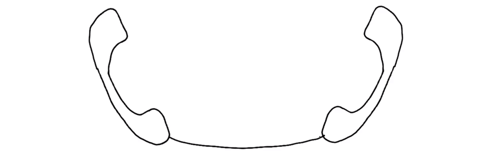


现在再增加一部，有三部电话了。每部电话依然要与另一部连接起来，也就是三条线。

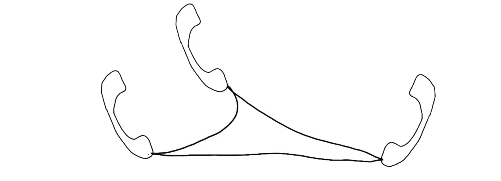

再加一部，有四部电话了。每部电话依然要与其他的所有电话连起来，有四部电话和六条连接线。现在形状很清晰，但是如果有大量电话线，看起来就很乱。

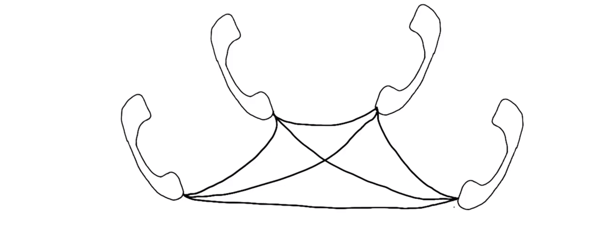

再加几部电话，有十部电话后，连接线就多多了。 实际上有 45 条线。说实话，我花了好长时间才画出来的。你就想像下，如果有 11 部 15 部 20 部 或 2000 部，会是什么情况。

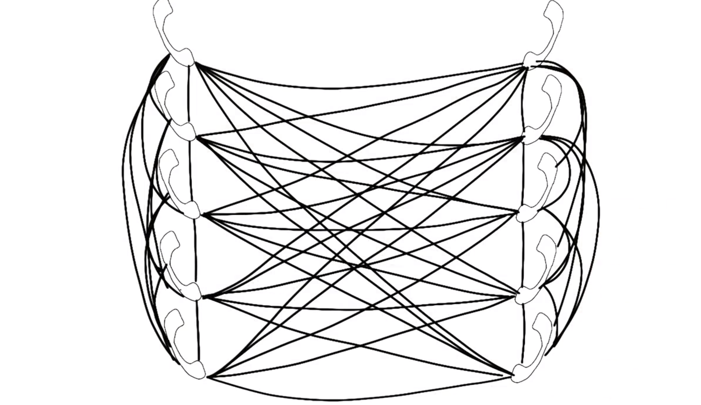

这个表格总结了我们刚刚发现的规律，实际上，连接线数量最终的计算公式为 `n*(n-1)/2` ，n 表示电话的数量。如果你是个数学高手，就知道这等于 `n*(n+1)/2`，但这时候 n 比电话数量小 1 ，所以就简化为了上面那样。

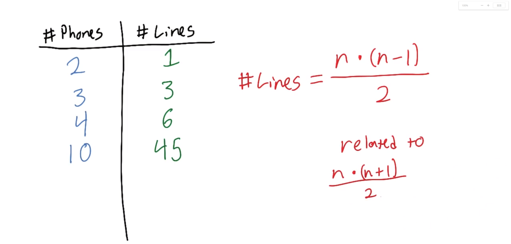

现在知道这一情况后，假设一个小镇有 2000 人，会有多少条连接？结果是 1999000 条连接。

现实中该如何构建呢？相信你肯定已经想到了更好的解决方案。我们让每部电话连接到一个 hub。现在需要多少条连接线？如果仔细思考的话，会发现对于每部手机现在连的是一个物体，而不是 n 个物体。

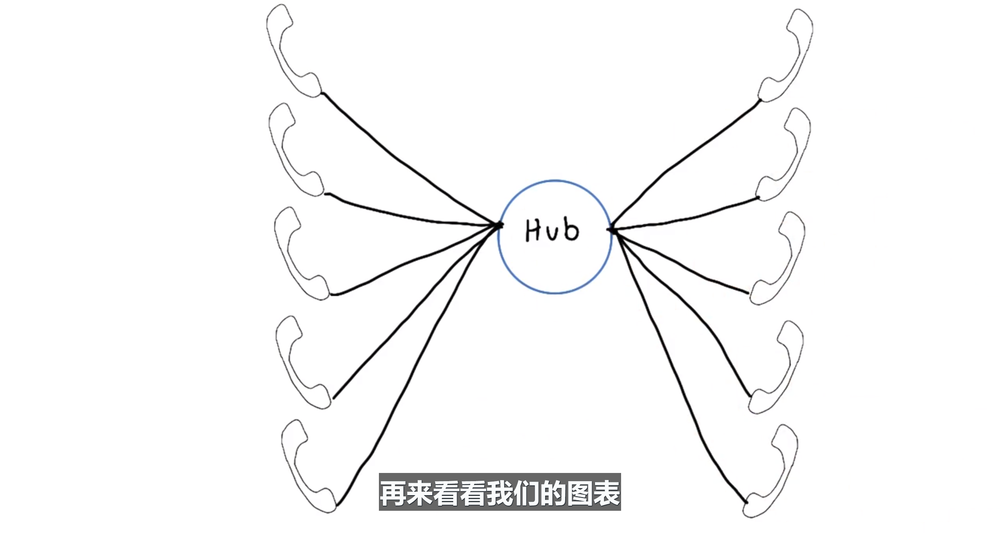


 如果有两部电话，连接线则是 2 条，如果有三步电话，连接线则是 3 条，四部则是 4 条，十部则是 10 条，2000 部则是 2000 条。可以看出，与原来的直接连接方法相比，两部或三部电话的话，结果更好或一样。但总体来说，表明连接性非常复杂。如果使用 xy 的坐标系表示，则第一种为指数性增加，第二种为线性增加。

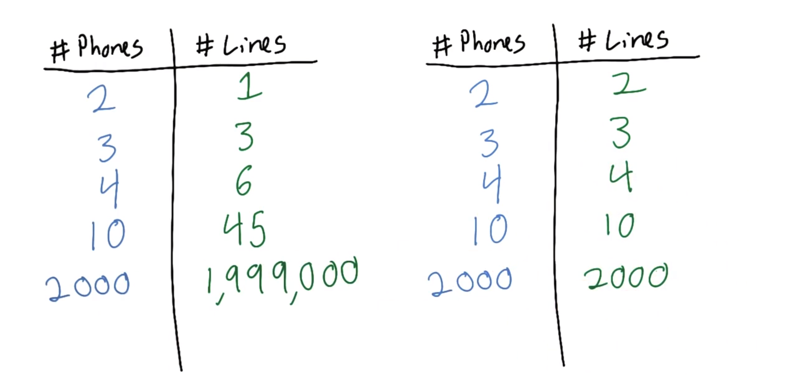

现在我们知道应该尽量减少连接次数，实际上软件开发也非常相似，我们来看看。


---


## 18. MVO 简介

现在我们回到现实世界，我们已经讨论了将事物分隔开来，现在讨论下分隔事物对编写应用有何意义。

我们可以将代码分隔成几个功能不一样的部分。在这门课程里，我们将其称为 M V O Model View 和 Octopus。

Octopus？是的，我们请章鱼 Larry 来帮助我们。我来介绍下 Larry，Larry 非常不喜欢杂乱无章的代码。实际上，Larry 讨厌杂乱无章的代码，以至于决定对其采取一些措施。

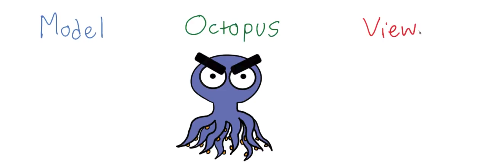

Larry 将我们的需求分开了，这是什么意思啊？无论应用规模多大，程序员都喜欢将所有内容分成几个类别。我们来一个个的讨论下。

- 视图（view）
  - 这是用于看到以及与其互动的所有事物，包括 DOM 元素，输入元素，按钮和图片。
  - 基本是用户与应用之间的接口，用于提供应用数据和读取数据。
- 模型（model）
  - 提到数据，所有数据就是存储在这里的模型中。
  - 包括来自服务器和来自用户的数据。

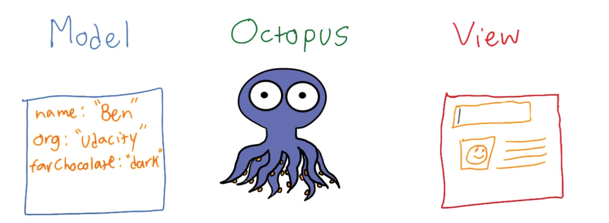

模型和视图是连接起来的，具体通过我们的章鱼相连。章鱼就是将我们在构建应用时，非常需要的内容分开了。你可以将章鱼想象为将事物聚合到一起的角色，同时又会使它们都保持独立，使我们能够更改每个部分而不会影响到其他部分。换句话说，我可以更改我的视图而不会干扰到我的模型。或者，可以更改存储数据的方式而不会干扰这里的视图。

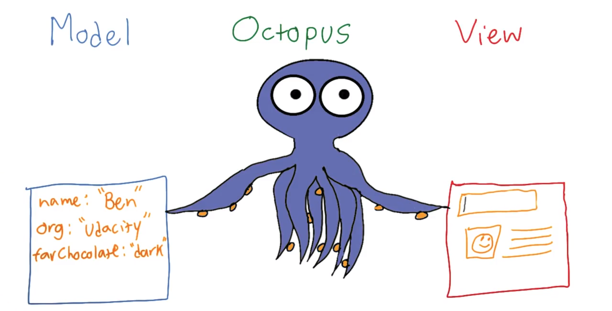

如果你去网上搜索的话，会发现各种缩写，例如 MVC MVVC MVP 和 `MV*`，这些表示 Model View Controller、Model View vView Model，Model View Presenter 或 Model View 什么什么。基本上 C VM P 和 `MV*` 解决的是同一问题，即**将我们的模型与视图分开来**。

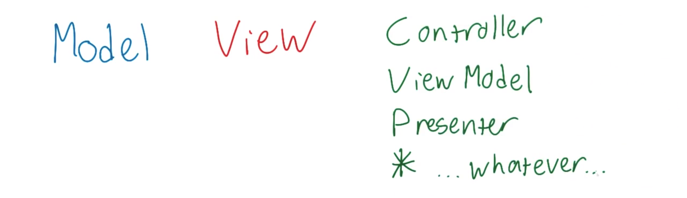

你会在网络上看到各种讨论，分析这些缩写相互之间的区别，在哪些方面有区别。但所有这些讨论的前提都是你已经知道，它们基本上是一回事。所以，我们将稍后讨论相互之间的区别。暂时就认为所有版本都是一样的，我们将其称为章鱼。

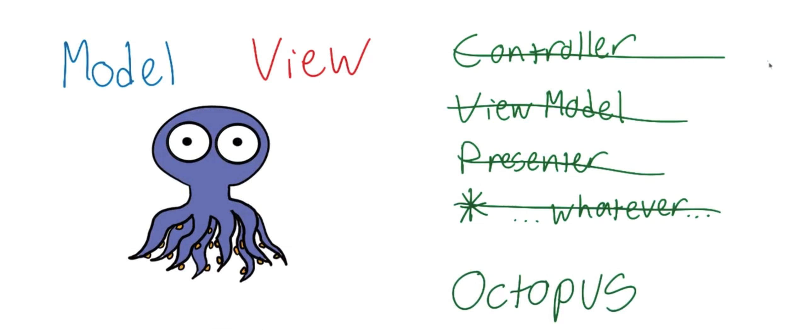


---


## 19. 练习：“模型”练习

假设我想构建日历应用，类似于 Google 日历，你认为在应用的这些部分中 哪个应该属于模型？

- 应用中的日历事件数组？√
- 天/ 星期/ 月份按钮？
- 日历区域的渲染函数？

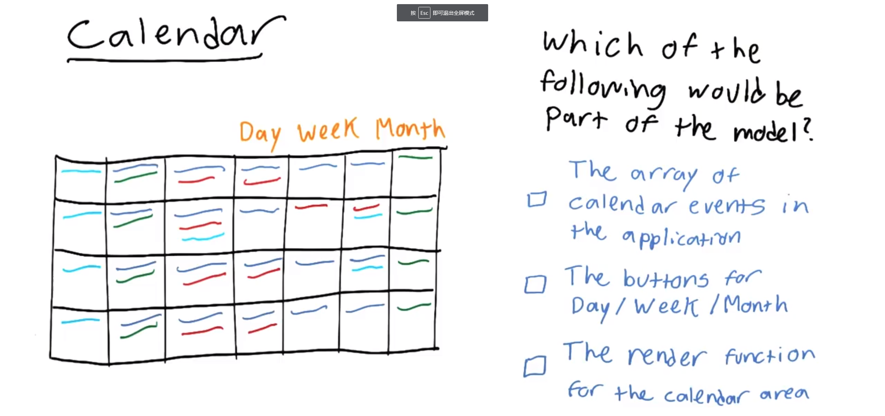

日历事件数组是数据存储的地方，所以属于模型。另外两个选项，按钮和渲染函数都属于视图，**因为它们负责的是用户会实际看到并与之互动的内容**。


---


## 20.练习： “视图”练习

假设我想构建一个 YouTube 播放列表应用，用户可以输入 URL， 然后应用会一个个播放这个播放列表的里的视频， 这个应用的哪个部分可以看做视图？

- 输入元素 √
- 播放的 URL 数组
- 将 URL 添加到列表中的函数
- 视频播放的位置 √

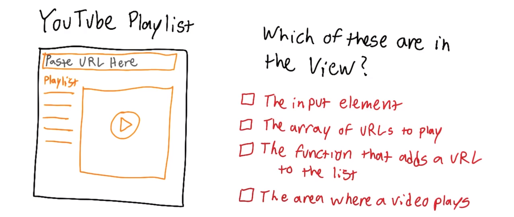

我们一个个看下，输入内容属于视图，因为用户通过它来与应用互动。视频播放区域属于视图，因为这是用户看到的内容。

数组不属于视图，而是属于模型，因为它是应用会用到的数据。

这里的函数属于章鱼部分，即将模型和视图连接到一起。当用户在这里输入 URL 并按下 Enter 视图就会调用该函数，然后该函数会向模型即数据添加 URL。注意，**章鱼的职责是将模型和视图连到一起**。 


---

## 21. 我们代码的模型是什么

现在我们已经掌握了理论概念，我们来看看实际的代码吧。你可以在讲师注释里找到包含这个应用的资源库链接。

这是披萨订单应用。你可以点击这个“Add Pizza”按钮添加披萨，每个披萨都有自己的唯一编号，我们也可以点击这些 X 按钮删除披萨。你会注意到，如果我们添加更多的披萨，应用会从我们离开的地方继续添加 7 和 8。

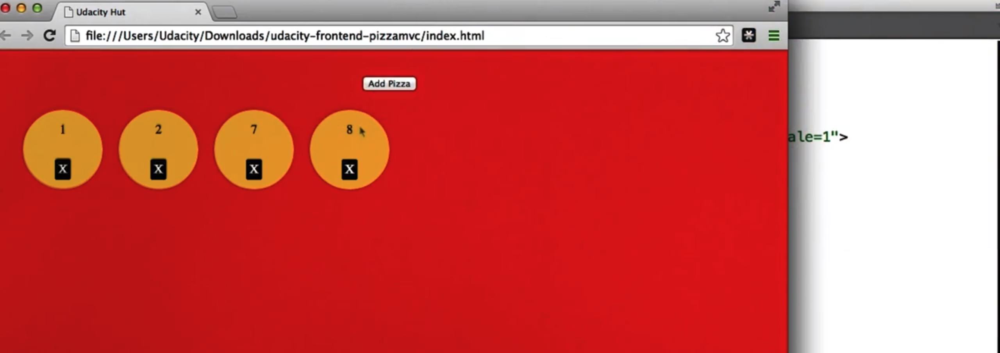

我们现在看看源代码，更具体的说，是背后的模型。在查看 JS 之前，我要提下这里有个 HTML 文件，还有一个 style.css 文件。如果你想知道应用是怎么运行的，可以自己看看这些代码。比较简单，只是一些 HTML DOM 节点和 CSS 选择器及属性。

JS 是该应用的核心所在，这里有 var data，往下有 var octopus 和 var view。

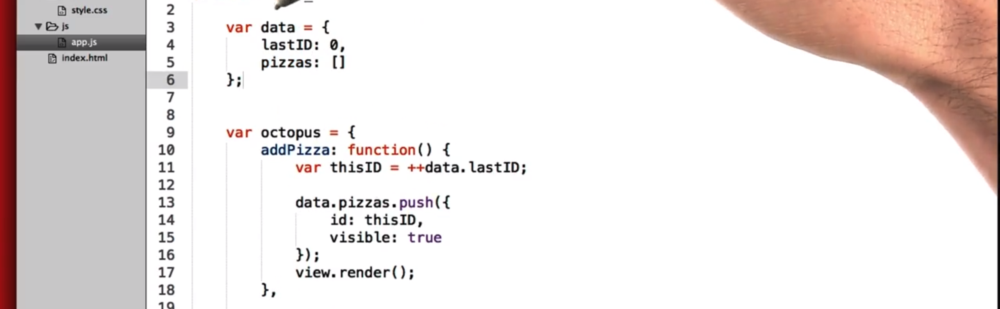

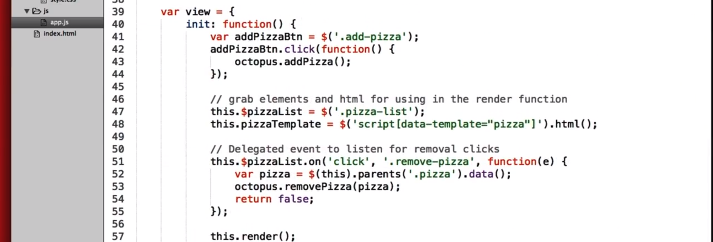

我们来看看这里的模型。在这个应用里，**模型就叫做 data。没必要必须叫做 model，只是功能而已**。可以看到我们的模型只是个简单对象，里面有两个属性。包括最后一个披萨的 ID 以及披萨对象数组。

对于这么简单的示例，可能并不太明显为何要区分开来，但相信我，有时候模型并非如此简单，稍后我们将看到此类示例。


---


## 22. 我们代码的视图是什么

在这个应用里，视图比模型稍微复杂些，是个对象，可以通过这个大括号看出来。有两个方法 init 和 render，我们**调用 init 来设置内容**并**调用 render 来更新视图**。

```javascript
var view = {
        init: function() {
            var addPizzaBtn = $('.add-pizza');
            addPizzaBtn.click(function() {
                octopus.addPizza();
            });

            // 抓取元素和html用于 render 函数
            this.$pizzaList = $('.pizza-list');
            this.pizzaTemplate = $('script[data-template="pizza"]').html();

            // 监听 .remove-pizza 的 点击事件
            this.$pizzaList.on('click', '.remove-pizza', function(e) {
                var pizza = $(this).parents('.pizza').data();
                octopus.removePizza(pizza);
                return false;
            });

            this.render();
        },

        render: function() {
            // 缓存变量用于 forEach() 的回调 (性能)
            var $pizzaList = this.$pizzaList,
                pizzaTemplate = this.pizzaTemplate;

            // 清除和渲染
            $pizzaList.html('');
            octopus.getVisiblePizzas().forEach(function(pizza) {
                // 用数据替换模板标记
                var thisTemplate = pizzaTemplate.replace(/{{id}}/g, pizza.id);
                $pizzaList.append(thisTemplate);
            });
        }
    };
```

HTML 也属于视图的一部分，所以我打我开了 index.html，可以看到有个按钮以及所有披萨的无序列表。下面还有这个 **script 模板**，其实就**是指当我们构建披萨对象时将会重复使用的 HTML**。

```html
<ul class="pizza-list"></ul>

    <script type="text/template" data-template="pizza">
        <li class="pizza" data-id="{{id}}">
            {{id}}
            <div class="pizza-controls">
                <a href="#" class="remove-pizza">X</a>
            </div>
        </li>
    </script>
```

回到 app.js，首先看看这里的 init 函数，暂时不要太注重这里的细节，我们只是去了解应用的整体结构。忽略细节，简化后的代码是这样的。

```javascript
init: function() {
            var addPizzaBtn = $('.add-pizza');
            addPizzaBtn.click(function() {
                octopus.addPizza();
            });

            // 抓取元素和html用于 render 函数
            this.$pizzaList = $('.pizza-list');
            this.pizzaTemplate = $('script[data-template="pizza"]').html();

            // 监听 .remove-pizza 的 点击事件
            this.$pizzaList.on('click', '.remove-pizza', function(e) {
                var pizza = $(this).parents('.pizza').data();
                octopus.removePizza(pizza);
                return false;
            });

            this.render();
        }
```

- 首先，我们为运行 addPizza 函数的按钮添加事件监听器
- 然后从 DOM 那获取数据并存储到变量中，从而能在下一步使用这些数据。
- 然后为披萨列表添加点击监听事件。如果我们点击移除披萨按钮，就会运行相关函数，弄清楚我们点击了什么，最终调用 removePizza 函数。
- 最后，告诉视图进行自我渲染。

对于自我渲染，该 render 函数到底是在干什么？

```javascript
render: function() {
            // 缓存变量用于 forEach() 的回调 (性能)
            var $pizzaList = this.$pizzaList,
                pizzaTemplate = this.pizzaTemplate;

            // 清除和渲染
            $pizzaList.html('');
            octopus.getVisiblePizzas().forEach(function(pizza) {
                // 用数据替换模板标记
                var thisTemplate = pizzaTemplate.replace(/{{id}}/g, pizza.id);
                $pizzaList.append(thisTemplate);
            });
        }
```

在 nutshell 中，它会清除整个披萨列表并重新渲染可见的披萨，不是太明智或足够优化，但是能正常运行。

这里，从 octopus 那获取可见披萨，我们稍后将讨论这块。对于每个披萨，执行下面的操作，**用披萨 ID <u>填写</u>模板 HTML**，然后将其添加到 DOM 中的披萨列表里。

这里的视图不是太明智，但是内容单独分开了，这才是最重要的。所有的视图逻辑都位于一个地方，而不是分散在整个应用中的各个地方。

我们将在下个小节里查看这里的分叉情况。


---

[Pizza 代码库](https://github.com/udacity/ud989-pizzamvo-zh) 

---


## 23. 我们代码的章鱼是什么

我们讨论了模型和视图，你可能还注意到了时不时出现的章鱼对象。它到底是干嘛的呢？

正如之前讨论的，章鱼负责将模型和视图连到一起。你可能注意到了，模型和视图从来都没有互相直接沟通，就是这样设计的，章鱼是他们之间的唯一连接桥梁。

我喜欢将章鱼想象成**缓冲区**，负责连接视图和模型，但相对于互相直接连接起来，这样它们能够更独立地移动，**意味着你可以更改应用的外观而不用打乱模型代码，**反之亦然。

所以章鱼执行了一些操作来帮助视图和模型，我们来看看这些操作。

```javascript
var octopus = {
        addPizza: function() {
            var thisID = ++data.lastID;

            data.pizzas.push({
                id: thisID,
                visible: true
            });
            view.render();
        },

        removePizza: function(pizza) {
            var clickedPizza = data.pizzas[ pizza.id - 1 ];
            clickedPizza.visible = false;
            view.render();
        },

        getVisiblePizzas: function() {
            var visiblePizzas = data.pizzas.filter(function(pizza) {
                return pizza.visible;
            });
            return visiblePizzas;
        },

        init: function() {
            view.init();
        }
    };
```

- addPizza 函数被视图调用并向模型添加披萨，最后告诉视图更新自己。
- 每当你点击某个 X 时，视图还会调用 removePizza 函数，它会弄清楚点击了哪个披萨并将被点击披萨的可见性设为 false，然后调用 view.render

你可能会注意到，只有在这两处，我们的模型“data 对象”更改了。

再次强调下，视图从来不会直接更改模型，只有章鱼会。还有两个函数要研究。

- getVisiblePizzas 是个函数，就像一个**管道**，**视图会通过它从模型那获取数据**，所以并不是视图说：嘿，模型，有哪些披萨啊？（或者说有哪些披萨是可见的啊？），而是模型去问章鱼，然后章鱼去检索并获取披萨。

为何视图不直接去获取呢？有两个原因。

- 首先，正如我们之前讨论的，一定要将视图和模型分开来。如果不分开的话，当你的项目规模变大，代码就会非常杂乱无章。 
- 第二个原因是这个 getVisiblePizzas 函数并非只是将披萨直接返回给视图，它实际上会为我们过滤披萨。它从模型那获取所有披萨，然后进行过滤，并且值返回 pizza.visible 为 true 的披萨。
  - 所以如果我们回到应用界面，添加大量披萨，然后又删除了大量披萨，应用工作方式就是 1 2 7 16 和 17 都会存在于模型中，但是其他我们之前创建的披萨也会存在，章鱼上位于中间的 getVisiblePizzas 函数会获取所有的披萨，但是仅向视图提供可见的披萨。
  - 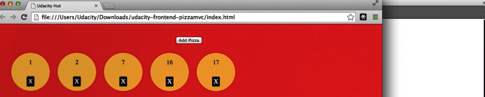


- 最后是 octopus.init，当你调用该函数，它会**进行所有必要的准备，让我们的应用能够运行**。这里，它唯一要做的就是告诉视图进行初始化。

整体总结下。这是模型，这是视图，章鱼负责将它俩连接起来，它俩从来都不直接沟通。所有这些函数都是在模型和视图之间沟通的不同方式。


---

[Pizza 代码库](https://github.com/udacity/ud989-pizzamvo-zh)

---


## 24. 识别新应用中的 MVO

现在该你来分析了，我们来看看另一个现实中的例子。

 这个应用是个开创性的新应用，叫做 Udacity Retain，除了华丽的名称之外，当你查看它的源代码会发现代码结构非常清晰。我们来看看。

有一个 HTML 文件，一个 CSS 文件和一个 JS 文件。

打开 JS 文件，会发现该应用的组织结构与之前看到的披萨应用非常相似。我们刚刚一起查看了披萨应用的代码，请将该资源库复制到你的本地机器上，然后看看它是怎样的结构，你会在此应用和披萨应用之间发现一些相似的地方。

如果你觉得毫无头绪的话，这是正常现象。每次当我第一次查看别人的代码时，也会花一段时间才能理出头绪。

如果你花了几分钟的时间才能弄明白也没关系，可以随便**添加注释，理性结构**。当你知道某项内容是干嘛的，可以添加备注并找出宏观结构。

- 模型直接与视图够通过吗？

---

[Udacity Retain 代码库](https://github.com/udacity/ud989-retain-zh) 

---

## 25. 探索应用的结构

### 探索 Udacity Retain

花几分钟来探索优达学城 Retain 应用的结构。

- 它是如何组织的？
  - 模型是否曾与视图直接对话？
  - 视图是否曾与模型直接对话？
- 如果愿意，请向代码添加注释。

你可以[在这里找到该代码库](https://github.com/udacity/ud989-retain-zh)。

---


## 26. 此功能在何处提供？

现在我们想添加一个新功能，新功能非常简单，现在注释的顺序是从过去到现在，我们希望顺序反过来，所以最新的注释应用出现在列表的第一位，应该在哪做出更改呢？

- 在模型里
- 视图里
- 在章鱼中 √


更改应该出现在章鱼上，原因有几个：

- 首先，我们**不希望打乱已有的数据**。
- 其次，我们实际上不需要更改数据本身。只是要**更改将数据从模型提供给视图的方式**。

为何不是视图呢？为何不放入视图中呢？

- 首先，视图不应该直接从模型那获取数据，记住，**它们不应该直接沟通**。只要是经过章鱼，**仅向视图提供视图所需的数据就比较合理**。不过，理论上你是可以将该功能放在视图里的。但对于我的模型、视图、章鱼示例，我将该功能放在了章鱼上。

在这个组织图表中，我希望将所有明智的控制操作都放在章鱼上。而模型和视图本身则相对比较简单。如果你使用的是其他组织类库，它们对于不同的功能具体应该位于何处都持不同的意见，但在所有的情况下，它们都保持一致并经过全面考虑。对于 MVO 我们会将所有明智的功能、过滤功能等都放在章鱼上。


---


## 27. 实施注释日期

我将展示下我将我的代码放在了何处。

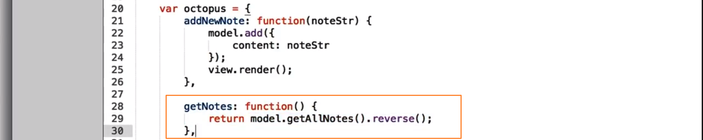

在这里的章鱼 getNotes 中我将返回 model.getAllNotes.reverse，而不是 model.getAllNotes，所以当章鱼将所有的注释都传递给我的视图时，实际上会颠倒注释的顺序再传递给视图。视图不用管这些。

现在请你再添加另一个功能。我们将为新建的每一个注释添加一个日期，并且也会显示该日期。

我们将大致讨论下如何操作，然后请你自己去实现。

- 首先，当我们创建新的注释时，我们需要存储某些日期。我将打开控制台，因为一种简单的实现方式就是使用 `Data.now`，当你运行 `Date.now` 时，它会返回一个庞大的数字表示当前的时间。如果我再次运行它，会发现该数字变得稍微大了一些。这就是我们存储日期的方式。
- 我们需要将其放入 addNewNote 函数中。这里它会创建对象字面量，并成为我们的注释。现在我们不仅存储内容，而且存储一个日期，这样就改变了我们的代码。每次我们添加新的注释都会存储一个日期。我们不需要更改 getNotes 函数，因为它只是返回所有的注释，包括其内容和日期，并且为视图颠倒注释的时间顺序。
- 说到视图，其实视图也需要更改。现在我们为注释存储了日期，我们应该也需要显示该日期。你可以在这里，将其添加到变量 htmlStr 中，我建议将其放入类名为 .note-date 的元素中。这样能够正确地应用我写的 CSS 之中。
- 最后一件事，在我们创建这个功能之前，我们创建的注释没有日期，如果进入控制台运行 `localStorage.clear` 它将会清空所有的永久存储器。当我们按下刷新，则没有任何注释了。所有的注释将包含你添加的日期属性。

### 视频中的图片练习

在所有新的注释中添加日，记住：

- 在注释对象中储存一个日期
- 渲染注释时可以显示日期
- 添加完成 - 我成功啦！


我将演示下我的实现过程。

- 首先我使用了 date.now，并将其存储到这个对象的 dateSubmitted 中，这里就成为了我们的 note。顺表提下，如果你感兴趣的话，那个数字表示自 1970 年 1 月 1 日起到现在的毫秒数。有趣吧。我只是将当前时间存储到 dateSubmitted 属性中。
  - 
- 我在下面的视图中也添加了一些内容，在下面的视图中，我向 render 函数添加了一个小功能。调用 render() 时，日期会被放入 htmlStr，我来稍微解释下这部分内容。我实际上使用该数字创建了新的日期，然后将其转换成字符串。
  - 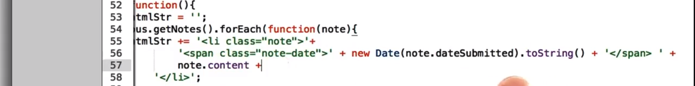

效果就是这样的，虽然不是太美观，不好阅读，但是你也可以使用某些日期方法改善下。

但最酷的是，如果你再去看代码，会发现代码量几乎没有变化，我们只是在视图中添加了这行代码，然后在创建 note 的地方添加了这行代码。

快速解释下为何这个放在了章鱼上。严格来说，你可能会认为这个跟数据相关，或许应该放在模型里，这是完全合理的想法。实际上，有很多组织的结构图和框架会将此类代码放在模型中。但是对于这个示例，为了简单，我没有这么做。我直接在这里创建了对象，但在后面的课程中，你将看到人们构建模型时采用的一些有趣而复杂的方法。

---


## 28. 准备第 2 课

在接下来的学习中，你可以随时回来查看刚刚这几个示例以获得灵感来源和参考。

对于下节课，我表示非常的激动，接着我们将为 Cat Clicker 的不同部分进行分隔，正确地安排应用结构。

你将感受到之前杂乱代码的实现方法与新的有组织的代码实现方法之间的差异，你会感到非常震撼的。下节课见！