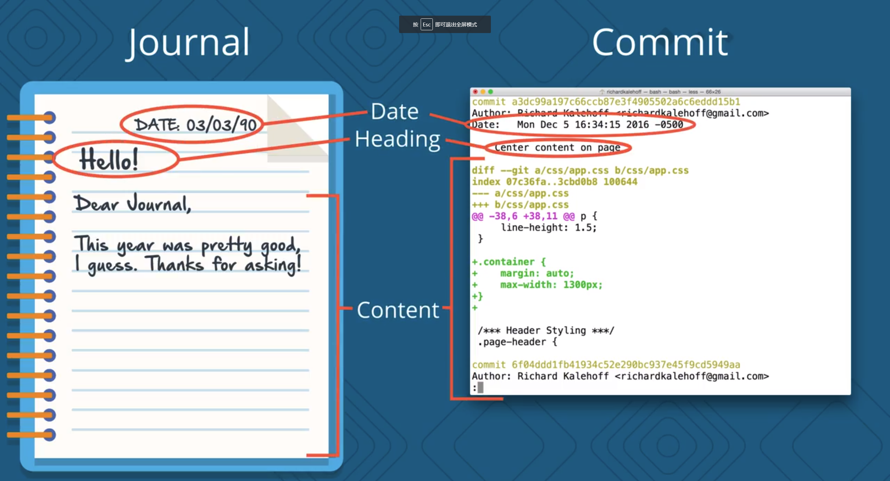
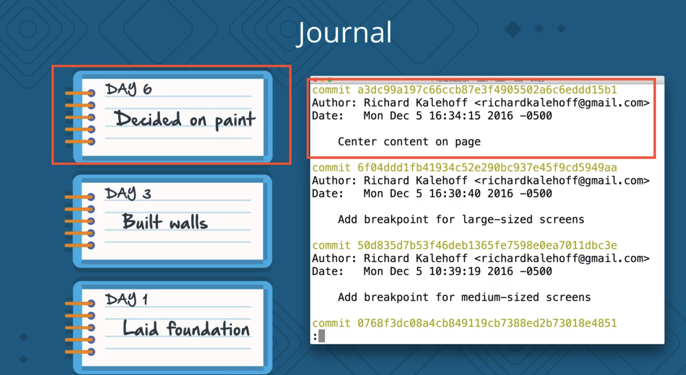
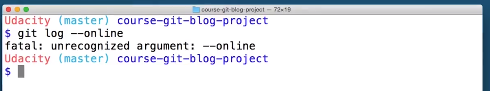
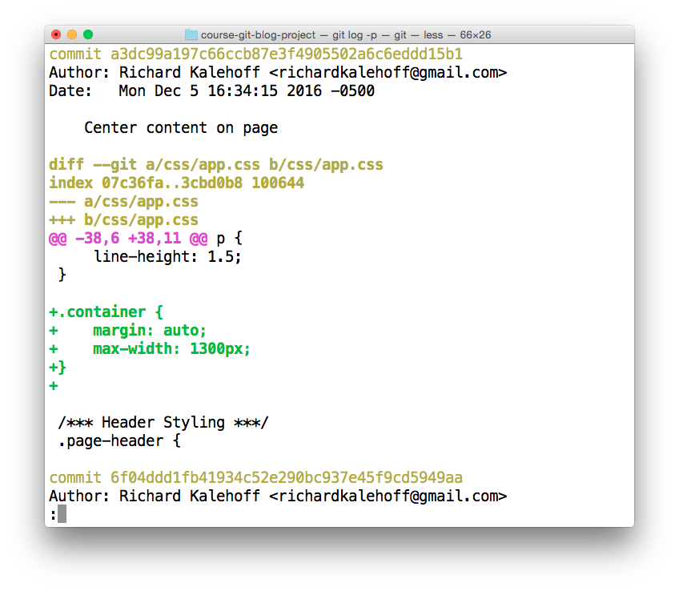
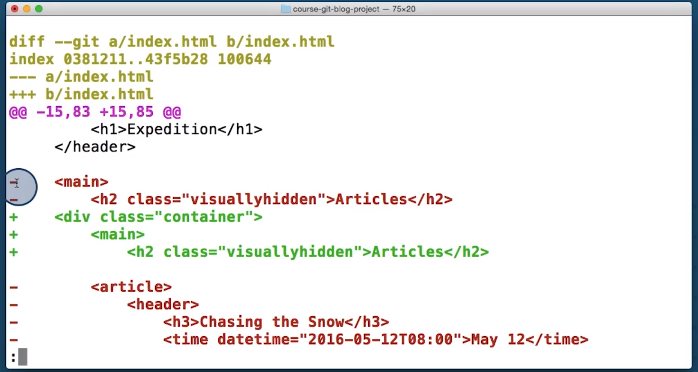

# 课程3：查看仓库的历史记录

> 了解如何查看现有 Git 仓库的 commit 历史记录至关重要。你将在这节课学习如何查看历史记录。

[TOC]

---


## 1. 简介

一篇好的日记应该包含日期——让你知道具体的时间，要有标题——让你可以添加一个简短的描述，然后是包含所有信息的日记主体。

每次在让日记上添加新的条目时，就像在仓库（repo）中进行提交一样，而且就像日记条目一样。你的提交最好也能频繁和详细，让你可以看到项目逐步的进展情况。



git 会自动记录创建提交时的日期和所作的内容更改，所以**你需要做的就是为提交提供详细的标题或说明**。我们希望日记条目频繁一些以便了解不同时期的生活动态，同样，你也希望提交频繁、说明详细，这样可以很容易地回顾这个项目，看看它是如何发展的。



我们先不实际进行提交，而是先来习惯这个概念，就是你应该经常提交并提供详细的提交说明。

但“经常”是多久一次？你又怎么知道什么才是好的提交呢？应该在提交中包含多少文件或代码行？要想知道什么是好的提交，最好的方法之一就是查看现有的提交。

我们将用于查看仓库历史记录的工具是 `git log` 和 `git show`

- 使用 `git log` 你可以显示有关现有提交的信息。它非常强大，你会经常用到它。
- `git show` 命令可以显示有关给定提交的信息。对于这个命令，你需要向其提供提交 ID，也被称为 SHA，该命令就会显示有关这一提交的信息

这两个命令 git log 和 git show，不太起眼，对吧？但这可能是整个课程中最重要的一课，学习如何显示仓库历史记录，和查看特定的提交对各方面都很有用。


---


## 2. 显示仓库的 commit

> 提示：在第 2 节课，你使用 `git clone` 克隆了博客项目。我们将在这节课用到该项目。如果你在上节课没有克隆该项目，则运行以下命令来获得该项目：
>
> ```
> $ git clone https://github.com/udacity/course-git-blog-project
> ```
>
> 克隆之后，别忘了 `cd` 到该项目。
>
> 如果遇到问题，请参阅[克隆现有仓库相关概念](https://classroom.udacity.com/courses/ud123/lessons/437a88fc-15f5-48b8-a6a5-0cf3347e6183/concepts/59082be0-c1af-4839-8ae5-0a182dc5bfe8#) 或在[论坛](https://discussions.youdaxue.com/c/Git-and-GitHub)上咨询他人！

#### 习题 1/7

克隆博客项目仓库后，使用命令行转到项目的目录下。当你位于博客项目中时，你应该在 git 仓库中首先执行什么？

- √ 运行 `git status` 命令
- 在代码编辑器中打开项目
- 判断应该构建什么新功能

提交

[*终端显示了 git status 命令的输出结果。*](https://classroom.udacity.com/courses/ud123/lessons/280d5ccf-6440-4d27-97d1-d9f6118359bc/concepts/ee7a6ad0-b3b6-42b4-9823-a79f7c6d0f27#)

### git status 和打开项目

你可以看到 `git status` 的输出结果是："nothing to commit, working directory clean"，意味着我们可以继续并检出该项目了！

在你喜欢的代码编辑器中打开该项目。花几分钟时间看看项目，包括 CSS 和 JavaScript 文件，但是重点看一下 HTML 文件。

[*在代码编辑器中打开了课程的博客项目。正在显示 index.html 文件。*](https://classroom.udacity.com/courses/ud123/lessons/280d5ccf-6440-4d27-97d1-d9f6118359bc/concepts/ee7a6ad0-b3b6-42b4-9823-a79f7c6d0f27#)

#### 习题 2/7

看看 `index.html` 文件中第 15 行的 `<h1>Expedition</h1>` 标题。

根据你所看到的内容，你觉得该标题是何时被添加的？

- 是在周二添加的，对，周二。
- 三周以前
- √ 只看代码的话，不知道是什么时候。

#### 习题 3/7

所以我们不确定何时添加的标题。那么，再回答一个更简单的问题：谁添加了这个标题？或者说，你能在只看代码的情况下告诉我是谁添加的吗？

- 是 Richard 添加的！
- √ 不清楚

提交

### git log 命令

要回答这些问题，就要用到 `git log` 命令！与其逐条解释它的所有作用，不如直接体验一下吧！请在终端运行 `git log` 命令：

```
$ git log
```

终端应该显示以下界面。

[*终端显示了 git log 命令的输出结果。*](https://classroom.udacity.com/courses/ud123/lessons/280d5ccf-6440-4d27-97d1-d9f6118359bc/concepts/ee7a6ad0-b3b6-42b4-9823-a79f7c6d0f27#)

---


我们来看看这个仓库的提交日志

- 可以看到是由不同的提交所组成
- 单个提交中显示了：
  - 提交的 SHA
  - 作出提交的人
  - 提交的日期
  - 以及提交说明，这是一个简短描述，说明在这个提交中作了哪些更改。

现在屏幕上只显示了前三个提交，其实上还有更多。怎么知道的呢？因为这里有冒号，表明可以显示更多的输出行。

如果你熟悉命令行就会知道，git 使用 less 程序作为其分页器，如果你不熟悉 less 或分页器也没有问题，分页器用于翻页浏览器内容，这只是命令行实现滚屏的特殊方式。

按 J 键或向下箭头可以一次向下滚动一行，要向上滚动，请按 K 键或向上箭头。当冒号变为单词 END 时，你就知道这是最后一个提交了。

要离开分页器，按下 Q 键即可。


---


### 了解日志内容

如果你不习惯在命令行上使用分页器，那么 [less(英)](https://en.wikipedia.org/wiki/Less_(Unix)) 用起来会比较奇怪。以下是一些实用技巧：

- 要**向下**滚动，按下
- `j` 或 `↓` 一次向下移动一行
- `d` 按照一半的屏幕幅面移动
- `f` 按照整个屏幕幅面移动
- 要 **向上**滚动，按上
- `k` 或 `↑` 一次向上移动一行
- `u` 按照一半的屏幕幅面移动
- `b` 按照整个屏幕幅面移动
- 按下 `q` 可以**退出**日志（返回普通的命令提示符）

在进行 commit 时，git 会记录大量信息。看看你能否通过 `git log` 回答以下问题！

#### 习题 4/7

使用 `git log` 查找 SHA 以 `f9720a` 开头的 commit。谁提交了这条 commit？

- James Parkes
- √ Richard Kalehoff
- Colt Steele
- Julia Van Cleve
- Godzilla McFiddlebrunches

提交

### 消息是什么？

使用 `git log` 查找 SHA 以 `8aa6668` 开头的 commit。这条 commit 的消息是什么？

Convert social links from text to images

#### 习题 6/7

使用 `git log` 查找 SHA 以 `f9720a9` 开头的 commit。这条 commit 是何时提交的？

- Mon Dec 5 10:25:22 2016
- √ Mon Dec 5 10:11:51 2016
- Sat Dec 3 16:09:00 2016
- Fri Dec 2 16:58:27 2016

提交

### SHA 是什么？

使用 `git log` 查找消息是 `Set article timestamp color` 的 commit。这条 commit 的 SHA 是多少？请提供该 SHA 的前 7 个字符。

5de135a

### git log 小结

很棒！是不是觉得掌握的 git 知识越来越多了？

我们快速总结下 `git log` 命令。`git log` 命令用于显示仓库中所有 commit 的信息。

```
$ git log
```

*默认情况下*，该命令会显示仓库中每个 commit 的：

- SHA
- 作者
- 日期
- 消息

我强调了“默认情况下”是因为 `git log` 命令显示的信息远不止这些。

git 使用命令行分页器 less 浏览所有信息。以下是 less 的重要快捷键：

- 要按行向下滚动，使用 `j` 或 `↓`
- 要按行向上滚动，使用 `k` 或 `↑`
- 要按页向下滚动，使用空格键或 Page Down 按钮
- 要按页向下滚动，使用 `b` 或 Page Up 按钮
- 要退出，使用 `q`

我们将在下节课中提升我们的 `git log` 使用技巧以显示更多信息。

还在等什么呢？点击下面的链接转到下节课吧！


## 3. 更改 git log 显示信息的方式

你做到了这一切，恭喜你已经走了这么远！说真的，学习 git 是一项挑战。我为你的坚持不懈而鼓掌。

看看这次运行 `git log` 后的输出结果：

[*终端显示了运行 git log 后的输出结果。*](https://classroom.udacity.com/courses/ud123/lessons/280d5ccf-6440-4d27-97d1-d9f6118359bc/concepts/aff71bac-d552-4498-aee2-f26cf30f5e52#)

我们已经仔细了解了 `git log` 显示的详细信息。但是现在，回顾并整合一下我们之前学到的内容。

思考一下这些问题：

- **SHA** - `git log` 将显示每个 commit 的完整 SHA。**每个 SHA 都是唯一的**，因此，**我不需要查看整个 SHA。只需知道前 6-8 个字符即可**。如果我们能只显示 SHA 的前 5 个左右的字符，是不是会节省一些空间？
- **作者** - `git log` 输出结果显示了每个 commit 的作者！其他仓库可能有多个人协作，因此情况可能不同，**但是对于此仓库，只有一个人提交了所有的 commit，因此所有 commit 的作者是一样的。我们需要查看每个 commit 的作者吗？如果我们想隐藏这一信息呢？**
- **日期** - 默认情况下，`git log` 将显示每个 commit 的日期。但是我们真的关心 commit 的日期吗？知道日期有时会很重要，**但是每次都知道日期并不十分重要，在很多情况下都可以忽略。能否隐藏该信息，以便节省空间？**
- **commit 消息** - 这是 commit 消息最重要的部分…我们通常都希望看到此信息

如何使输出结果更简短，并节省大量空间？我们可以使用 **选项**。

> 提示：这并不是一种命令行进程，但是选项可以用来更改程序的工作方式。例如，`ls` 命令将列出当前目录下的所有文件。`ls` 命令具有 `-l` 选项 （即 `ls -l`），**它会运行相同的 `ls` 命令，但是会更改其工作方式；它会显示 *long* 格式的信息（`-l` 表示 *long*）**。
>
> 选项可以用来更改程序的工作方式和显示的信息。要详细了解命令行程序和选项，请参阅我们的 [Linux 命令行基础](https://cn.udacity.com/course/linux-command-line-basics--ud595) 课程。

### git log --oneline

`git log` 命令有一个选项，可以用来更改仓库信息的显示方式。该选项为 `--oneline`：

```
$ git log --oneline
```

看看输出结果有何不同！

[*两个并排显示的终端。左侧显示的是包含所有信息的 git log 命令的结果，右侧显示的是包含简略版 SHA 和 commit 消息的 git log --oneline 命令的结果。*](https://classroom.udacity.com/courses/ud123/lessons/280d5ccf-6440-4d27-97d1-d9f6118359bc/concepts/aff71bac-d552-4498-aee2-f26cf30f5e52#)


---

当我们运行 git log --oneline 后，这一行仅包含一个提交的信息，包括：

- SHA 的前七个字符
- 以及提交说明

在库（repo）中没有任何更改， --oneline 标志指示改变了显示信息的方式。这是一个非常有用的命令，有助于快速查看仓库中的提交。 


#### 练习题

你正处在 `git log --oneline` 命令中，并且想要从 `git log --oneline` 的输出结果中退出，然后返回普通的命令提示符。要回到普通的命令提示符，你应该按下键盘上的哪个键？

- `esc` 键
- √ `q` 键
- `ctrl` + `c` 键
- `ctrl` + `d` 键

---


当我第一次了解 git log 的 oneline 标志（flag）时，我真的很兴奋，因为我不需要一再滚动来读取所有的提交说明了。它顺利运行了几次，直到有一次我得到了这个。



仔细阅读 git 十分有用的错误信息，是因为输入的是 online 而不是 oneline，它显示 `fatal: unrecognized  argument: --online`，无法识别 online 是指 git 不知道这个词、这个错误信息或类似的东西。

在编程时常常遇到这种问题，所以请留意未知或无法识别的参数通常意味着有一个简单的拼写错误。此外，git 也会尝试提供有用的反馈。


---


### git log --oneline 小结

`--oneline` 选项用于更改 `git log` 显示信息的方式：

```
$ git log --oneline
```

此命令：

- 每行显示一个 commit
- 显示 commit 的 SHA 的前 7 个字符
- 显示 commit 的消息


---


## 4. 查看修改后的文件

我们刚刚了解了用于每行显示一个 commit 的 `--oneline` 选项。该命令适合大致了解仓库，但是如果说我们想深入了解某个 commit 更改了哪个/哪些文件呢？

#### 习题 1/4

如果你查看 commit `a3dc99a` 的仓库，会看到消息"Center content on page”。 这条 commit 更改了哪个/哪些文件？

- HTML 文件
- CSS 文件
- JavaScript 文件
- HTML 和 CSS 文件
- HTML 和 JS 文件
- √ 无法确定


### `git log --stat` 简介

The `git log` 命令有一个选项可以用来显示 commit 中更改的文件以及添加或删除的行数。该选项为 `--stat`（stat 是“统计信息 statistics”的简称）：

```
$ git log --stat
```

运行该命令并查看显示结果。

[*两个并排显示的终端。左侧显示的是包含所有信息的 git log 命令的结果，右侧显示的是列出了被更改的文件以及添加/删除的行数的 git log --stat 命令的结果。*](https://classroom.udacity.com/courses/ud123/lessons/280d5ccf-6440-4d27-97d1-d9f6118359bc/concepts/7e127ca9-7d0a-414d-ad30-708d60248a96#)

---


--stat 标志不会像 --oneline 标志那样显著地更改输出，它只是在每个提交的底部添加了一个新的部分。

下面这部分显示了更改的摘要信息。比如第一条提交中，一个文件发生了更改，添加了五行，并且能够看到被修改的文件，CSS 文件被修改。

再比如第二条，此提交修改了两个文件，共 91 个插入和 58 个删除，CSS 文件中添加了 31 行，index.html 中总计添加或删除了 118 行（也就是添加和删除的行的总数）。


---


#### 习题 2/4

根据你到目前为止所学的 `git log` 和其相关的选项知识，你认为 SHA 为 `6f04ddd` 的 commit 修改了多少个文件？

- 1 个文件
- 2 个文件
- 9 个文件
- 10 个文件

提交

### 习题 3/4

第一道题答的很棒，再看一道题！SHA 为 `8d3ea36` 的 commit 修改了多少个文件？

- 1 个文件
- 2 个文件
- 3 个文件
- 5 个文件

提交

### 习题 4/4

现在再看看 `--stat` 选项显示的另一项信息。SHA 为 `8d3ea36` 的 commit 在 `index.html` 中删除了多少行代码？

- 2 行
- 4 行
- 9 行
- 13 行
- 28 行

提交

### `git log --stat` 小结

总结下，`--stat` 选项用于更改 `git log` 显示信息的方式：

```
$ git log --stat
```

此命令会：

- 显示被修改的文件
- 显示添加/删除的行数
- 显示一个摘要，其中包含修改/删除的总文件数和总行数


---


## 5. 查看文件更改

### 查看更改

我们知道 `git log` 将显示仓库中的 commit，如果添加 `--stat` 选项，则可以看出修改了哪些文件以及添加/删除了多少行代码。如果能查看到底进行了哪些更改，是不是更棒？

如果这不是版本控制系统的最精彩部分，那想不出还有什么更精彩的地方了！能够查看到底对文件作出了哪些更改非常重要！这使得我们能够得出结论 “这个 commit 向该按钮添加了 5 像素的圆角！”。

例如，在博客项目中，commit `a3dc99a` 具有消息"center content on page"并通过添加 5 行内容修改了 CSS 文件。到底添加了哪 5 行？如何找出这 5 行？

[*终端中运行了命令 git log --stat，它显示了 commit 并显示出第一个 commit 的统计信息，显示添加了 5 行代码的 CSS 文件。*](https://classroom.udacity.com/courses/ud123/lessons/280d5ccf-6440-4d27-97d1-d9f6118359bc/concepts/dac0d8d4-e9a0-4b6e-bf65-f2d8e7a434c8#)

### `git log -p`

`git log` 命令具有一个可用来显示对文件作出实际更改的选项。该选项是 `--patch`，可以简写为 `-p`：

```
$ git log -p
```

运行该命令并查看显示结果。

[*终端显示了 git log -p 命令的输出结果。注意，你的终端的颜色标记可能不同。*](https://classroom.udacity.com/courses/ud123/lessons/280d5ccf-6440-4d27-97d1-d9f6118359bc/concepts/dac0d8d4-e9a0-4b6e-bf65-f2d8e7a434c8#)

---


让我们运行 git log -p 命令来查看提交，它会同时包括实际的代码更改或对文件所作的补丁，与 --stat 标志一样，-p 或 --patch 标志也会在标准的提交信息下面添加额外的信息。

这是补丁输出的开始（上图中 diff 的地方），我承认这个输出有点难懂，所以暂且听我讲一下。因为我们平时并不怎么看上面这几行，但了解一下总是好的。

差异和补丁指的是同一回事，补丁显示的是文件的原始版本和更改版本之间的差异，我们看到的是 CSS 文件，这是文件的第一个版本。它出现在一个名为 a 的目录中，因为它是第一个，但你并不会在库中实际看到这个目录。然后是第二个版本，它出现在 b 目录中，因为它是第二个。这两个名称相同，因为我们看到的是同一个文件的两个不同版本。如果文件被重命名，这些名称就会不同。是的，git 可以跟踪被重命名的文件。很酷，对吧？

现在让我们回到输出，这一行显示了文件更改前（黄色字体第二行，index 开头），第一个版本的哈希值和更改后的哈希值。这些哈希值与提交 SHA 不同，我基本上不怎么看这一行。

这两个和这些是一样的（第三行和第四行与第一行是一样的），它们是文件的新旧版本。

绿色字体的这部分是 CSS 文件的实际代码，这些前面带有加号的绿色行，表示这些行是此次提交中添加的。

粉色字体开始的这部分，它们可以告诉我们文件哪里作出了编辑。这说明在文件的较旧或原始版本中，这段代码来自第 38 行并显示了六行代码（这六行代码来自从粉色字体第二行开始算，到下面最后黑色字体结束，并跳过绿色字体行的部分）。在文件的较新或当前版本中，它也从第 38 行开始，但现在有 11 行代码，原来的六行加上新的五行，我们可以在这里看到所有 11 行代码（也就是从粉色字体下一行到最后黑色字体结束）。

现在，这个提交只有添加，如果有删除行会是什么样的？



这是 HTML 文件的补丁输出，提交所删除的行是红色的，以减号开头。这里要注意非常重要的一点是，git 按行跟踪编辑，所以如果对一行进行编辑，它会显示该行被移除，然后再被添加。

例如，上图中鼠标位置的地方，这里说 main 被删除，但这里说 main 又被添加（下面），类为 container 的 div 被添加，main 元素及其所有代码都被缩进，使其正确嵌套在 HTML 文件中。缩进此行使其发生了更改，所以，对于 git 来说，被缩进一个的这行是删除的，而被缩进两格的这一行是添加的。

我知道补丁输出中有很多信息，但其中一些是多余的，还有一些可以忽略。补丁输出中的重要内容是，我们正在查看的文件和修改，另外，我们有时也需要知道文件中哪些地方进行了更改。


[*终端显示了 git log -p 命令的输出结果。请查看下面关于输出结果的详细说明。*](https://classroom.udacity.com/courses/ud123/lessons/280d5ccf-6440-4d27-97d1-d9f6118359bc/concepts/dac0d8d4-e9a0-4b6e-bf65-f2d8e7a434c8#)

### 带注释的 `git log -p` 输出

我们通过上述图片快速总结下 `git log -p` 的输出：

- 🔵 - 正在显示的文件
- 🔶 - 文件第一版的哈希值和第二版的哈希值 
  - 通常不重要，因此可以忽略
- ❤️ - 文件的旧版本和当前版本
- 🔍 - 添加的行所在的位置以及添加了多少行 
  - `-15,83` 表示旧版本（用 `-` 表示）从第 15 行开始，文件有 83 行
  - `+15,85` 表示当前版本（用 `+` 表示）从第 15 行开始，现在有 85 行...这 85 行显示在下方
- ✏️ - 在 commit 中实际进行的更改 
  - 用红色标示并以减号 (`-`) 开头的行是位于文件原始版本中，但是被 commit 删除的行
  - 用绿色标示并以加号 (`+`) 开头的行是 commit 新加的行

### 进一步研究

[使用 -p 生成补丁](https://git-scm.com/docs/git-diff#_generating_patches_with_p) Git 文档 (英)

#### 习题 1/4

根据你所学的 `git log` 的 `-p` 选项方面的知识，看看 SHA 为 `50d835d` 的 commit。你应该从 `app.css` 中的哪一行开始查看，从而了解之前做了哪些更改呢？

提示 - 记住，在查看 `git log` 输出时，用 `d` 键可以向下滚动半个页面，而用 `u` 键可以向上滚动半个页面。

- 第 63 行
- 第 89 行
- 第 127 行
- 第 155 行

提交

#### 习题 2/4

使用 `git log` 命令或者调用相关的选项判断 commit `4a60beb` 添加了什么代码？

- color: #352d2d;
- color: #250808;
- color: #333333;
- color: #2e3d49;

提交

#### 习题 3/4

`git log --stat` 和 `git log -p` 都是非常实用的命令。如果能同时获得这两个命令的输出结果，是不是很棒？

运行 `git log -p --stat` 会发生什么？

- 它仅显示补丁信息
- 它仅显示统计信息
- 它同时显示这两种信息，并且补丁信息显示在统计信息上方
- √ 它同时显示这两种信息，并且统计信息显示在补丁信息上方

提交

在上述视频中，我们观看了让很多代码缩进的 commit。补丁输出显示所有行先被删掉，然后在新的缩进位置又被重新添加。但是显示所有的缩进更改让我们很难发现实际添加了什么代码。

#### 习题 4/4

`-w` 选项对补丁信息有何作用？要获取帮助，请参阅[此 Git 文档页面](https://git-scm.com/docs/git-diff)。

- 它以高亮文本显示非空格字符
- 它以粗体显示非空格更改
- √ 它会忽略空格更改
  - `git log -p -w` 将显示补丁信息，但是不会突出显示仅更改了空格的行。 
- 它在单独的补丁区域显示新增/删除的内容

提交

### `git log -p` 小节

总结下，`-p` 选项（和 `--patch` 选项一样）用来更改 `git log` 显示信息的方式：

```
$ git log -p
```

此命令会向默认输出中添加以下信息：

- 显示被修改的文件
- 显示添加/删除的行所在的位置
- 显示做出的实际更改


---


## 6. 查看特定的 commit

### 太多滚动操作

上一部分的最后几个练习需要在补丁输出中不断向下滚动，以便找到正确的 commit 并查看其信息。如果能显示特定 commit 的详情，而不用关心仓库中的所有其他内容，是不是很棒？

实际上有两种实现方式！

- 向 `git log` 提供你要查看的 commit 的 SHA
- 使用新的 `git show` 命令

它们都很简单，我们先学习 `git log` 方式，然后再学习 `git show`。

你已经知道如何使用以下命令输出信息：

- `git log`
- `git log --oneline`
- `git log --stat`
- `git log -p`

但是你是否知道，可以向所有这些命令提供 commit 的 SHA 作为最后一个参数？例如：

```
$ git log -p fdf5493
```

通过提供 SHA，`git log -p` 命令将从这条 commit 开始！无需滚动并逐条查阅！注意，它还会显示在所提供的 SHA 之前提交的所有 commit 信息。

### 新命令：`git show`

另一个显示特定 commit 的命令是 `git show`：

```
$ git show
```

运行上述示例命令将仅显示最近的 commit。通常，将 SHA 作为最后一个参数提供给命令：

```
$ git show fdf5493
```

### `git show` 的作用是？

`git show` 命令将仅显示一个 commit。因此，如果你看不到任何其他 commit，不要惊慌。它只显示一个 commit。`git show` 命令的输出和 `git log -p` 命令的完全一样。因此默认情况下，`git show` 会显示：

- commit
- 作者
- 日期
- commit 消息
- 补丁信息

但是，`git show` 可以与我们了解过的大部分其他选项一起使用：

- `--stat` - 显示更改了多少文件，以及添加/删除的行数
- `-p` 或 `--patch` - 显示默认补丁信息，但是如果使用了 `--stat`，将不显示补丁信息，因此传入 `-p` 以再次添加该信息
- `-w` - 忽略空格变化

你现在已经是 `git log` 达人了！试着求解几道练习题吧。

### 习题 1/3

commit `8d3ea36` 向 CSS 中添加了多少个规则集？

- 1
- 2
- 3
- 4

提交

### 习题 2/3

有一个消息是"Convert social links from text to images"的 commit。这条 commit 更改了多少个文件？

- 2 个文件
- 4 个文件
- 5 个文件
  - 很棒！我首先使用 `git log --oneline` 找到这条 commit 的 SHA，然后使用 `git log --stat` 并提供该 SHA 来找到正确的信息。 
- 9 个文件

提交

### 习题 3/3

看看 commit `fdf5493`。这条 commit 所添加的首个 HTML 标题元素是什么？

- 一个 `<h1>`
- 一个 `<h2>`
- 一个 `<h3>` 
- 一个 `<h4>`


## 7.  总结

请记住，在你刚开始使用 Git 时，能够显示仓库的历史记录可能会特别有用，我们需要知道提交中存储的内容以及在提交之后如何查看它。