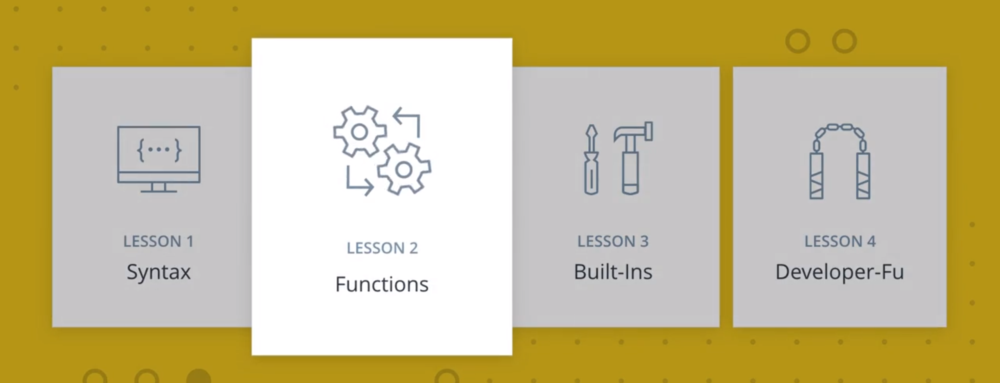
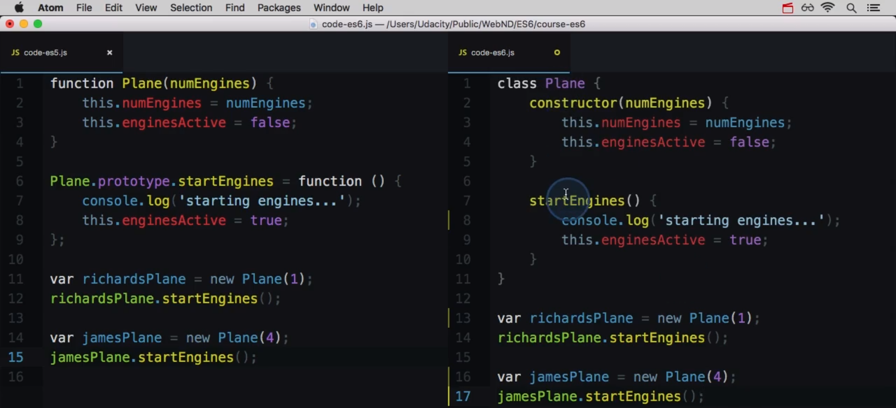
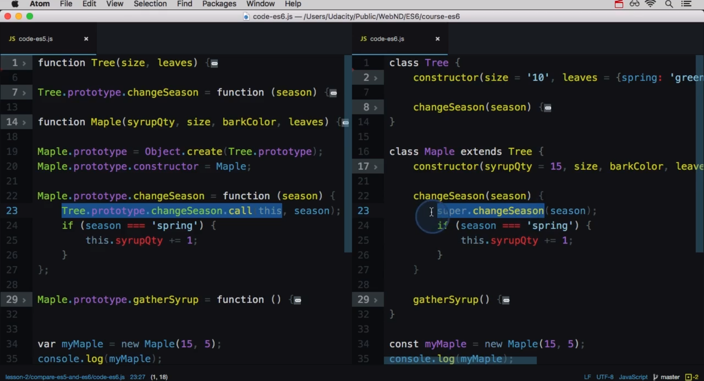

#  ES6 - 函数

> 函数是 JavaScript 的核心！在 ES6 中，函数出现了很多必要的改进。在这节课，你将学习很多新内容，包括箭头函数和类。

---

[TOC]

---


## 1. 函数的更新

在本节课中，我们将涉及到 ES6 中函数相关的更新。



在最新版本的 JavaScript 中，函数发生了很大的变化。

- 我们有了一个新的**函数编写方法**，称之为箭头函数。
- 还有一个新的 class 关键字来常见一个函数类。
- 现在我们设置默认的函数参数可以通过 “super” 和 “extend” 关键字将不同的类关联起来。


## 2. 箭头函数

函数是 JavaScript 中的主要数据结构之一，它们**一直**都存在于 Javascript 中。

### 箭头函数

ES6 引入了一种新的函数，叫做**箭头函数**。箭头函数和普通函数的行为非常相似，但是在语法构成上非常不同。以下代码列出一组名字，使用普通函数把其中每个名字转换为大写形式：

```
const upperizedNames = ['Farrin', 'Kagure', 'Asser'].map(function(name) { 
  return name.toUpperCase();
});
```

下面的代码操作一样，但是向 `map()` 方法中传入的是箭头函数，而不是普通函数。注意以下代码中箭头函数的**箭头** （`=>`）：

```javascript
const upperizedNames = ['Farrin', 'Kagure', 'Asser'].map(
  name => name.toUpperCase()
);
```

上述代码的唯一变化是 `map()` 方法内的代码。它将普通函数换成了箭头函数。

> **注意：** 不知道 `map()` 的原理？它是 **Array 原型上的方法**。向其传递一个函数，它会对数组中的每个元素调用该函数。然后从每个函数调用中收集返回的值，并生成新的数组。要了解详情，请参阅 [MDN 的文档](https://developer.mozilla.org/zh-CN/docs/Web/JavaScript/Reference/Global_Objects/Array/map)。

### 将函数转换为箭头函数

```javascript
const upperizedNames = ['Farrin', 'Kagure', 'Asser'].map(function(name) { 
  return name.toUpperCase();
});
```

对于上述函数，将现有的"普通"函数转换为箭头函数只需几步。

- 删掉关键字 `function`
- 删掉圆括号
- 删掉左右花括号
- 删掉关键字 `return`
- 删掉分号
- 在参数列表和函数主体之间添加一个箭头（`=>`）


将普通函数转换为箭头函数。

#### 练习题

看看下面的代码：

```
const names = ['Afghanistan', 'Aruba', 'Bahamas', 'Chile', 'Fiji', 'Gabon', 'Luxembourg', 'Nepal', 'Singapore', 'Uganda', 'Zimbabwe'];

const longNames = names.filter(function(name) {
  return name.length > 6;
});
```

下面的哪个选项结果一样，但是将 `.filter()` 中的函数替换成了箭头函数？

- const longNames = names.filter( function(name) => return name.length > 6; );
- const longNames = names.filter( return name.length > 6 );
- const longNames = names.filter( name => {name.length > 6} );
- const longNames = names.filter( name => name.length > 6 ); :sparkling_heart:


## 3. 使用箭头函数

普通函数可以是**函数声明**或**函数表达式**，但是箭头函数始终是**表达式**。实际上，它们的**全称**是“箭头函数表达式”，因此**仅在表达式有效时才能使用**，包括：

- 存储在变量中
- 当做参数传递给函数
- 存储在对象的属性中

一个令人迷惑的语法是箭头函数存储在变量中。

```javascript
const greet = name => `Hello ${name}!`;
```

在上述代码中，箭头函数存储在变量 `greet` 中，你可以像以下代码这样调用它：

```javascript
greet('Asser');
```

> **Returns:** Hello Asser!

### 圆括号和箭头函数参数

你可能注意到了 `greet()` 函数的箭头函数看起来如下所示：

```javascript
name => `Hello ${name}!`
```

如果你还记得，参数列表出现在箭头函数的箭头（即 `=>`）前面。如果列表中只有**一个**参数，那么可以像上述示例那样编写代码。但是，如果列表中有**两个或多个**参数，或者有**零个**，则需要将参数列表放在**圆括号**内：

```javascript
// 空参数列表需要括号
const sayHi = () => console.log('Hello Udacity Student!');
sayHi();
```

> **Prints:** Hello Udacity Student!

```javascript
// 多个参数需要括号
const orderIceCream = (flavor, cone) => console.log(`Here's your ${flavor} ice cream in a ${cone} cone.`);
orderIceCream('chocolate', 'waffle');
```

> **Prints:** Here's your chocolate ice cream in a waffle cone.

#### 习题 1/2

以下哪些选项的箭头函数格式正确？ 每个都正确

- setTimeout(() => {
  ​    console.log('starting the test');
  ​    test.start();
  }, 2000);
  - 如果函数没有参数，则仅使用一对圆括号，就像选项 1。 
- setTimeout( _ => {
  ​    console.log('starting the test');
  ​    test.start();
  }, 2000);
  - 有些开发工程师选择使用下划线作为单个参数。下划线从未被使用，因此在函数内是 `undefined`，但这是个**常见技巧**。 
- const vowels = 'aeiou'.split('');
  const bigVowels = vowels.map( (letter) => letter.toUpperCase() );
- const vowels = 'aeiou'.split('');
  const bigVowels = vowels.map( letter => letter.toUpperCase() );
  - 选项 3 和 4 的唯一区别是在 `letter` 周围使用了圆括号。通常，如果只有一个参数，则不使用圆括号，但使用也没错。 


### 简写主体语法和常规主体语法

我们看过的所有箭头函数都只有一个表达式作为函数主体：

```javascript
const upperizedNames = ['Farrin', 'Kagure', 'Asser'].map(
  name => name.toUpperCase()
);
```

这种函数主体形式称为**"简写主体语法"**。简写语法：

- 在函数主体周围没有花括号
- 自动返回表达式。

如果箭头**函数的主体**内**需要多行代码**，则可以使用**"常规主体语法"**。

```javascript
const upperizedNames = ['Farrin', 'Kagure', 'Asser'].map( name => {
  name = name.toUpperCase();
  return `${name} has ${name.length} characters in their name`;
});
```

对于常规主体语法需要记住的重要事项：

- 它将**函数主体**放在**花括号**内
- **需要使用** `return` 语句来返回内容。

#### 习题 2/2

根据你所掌握的箭头函数如何处理自动返回和花括号的知识，判断下面的哪些选项是正确的箭头函数格式？

- const colors = ['red', 'blue', 'green', 'yellow', 'orange', 'black'];
  const crazyColors = colors.map( color => {
  ​    const jumble = color.split('').reverse();
  ​    return jumble.join('') + '!';
  });
  - 选项 1 正确。因为箭头函数**使用了花括号，必须有个 return 语句**，返回某个内容。 
- const colors = ['red', 'blue', 'green', 'yellow', 'orange', 'black'];
  const crazyColors = colors.map( color => {
  ​    color.split('').reverse().join('') + '!';
  });
  - 选项 2 不正确，因为它有花括号，但是没有 return 语句。该函数会运行，但是没有内容返回到 `crazyColors`。 
- const colors = ['red', 'blue', 'green', 'yellow', 'orange', 'black'];
  const crazyColors = colors.map( color => return color.split('').reverse().join('') + '!' );
  - 选项 3 没有花括号。意味着需要使用简写语法，并自动返回表达式，因此不应有 `return` 关键字，因此该选项不正确。 
- const colors = ['red', 'blue', 'green', 'yellow', 'orange', 'black'];
  const crazyColors = colors.map( color => color.split('').reverse().join('') + '!' );
  - 选项 4 正确。这是你将见到的最常见的箭头函数书写形式，一行内容并自动返回内容。 


箭头函数很强大！

- 语法简短多了，
- 更容易编写和阅读的简短单行函数，
- 使用简写主体语法时，自动返回内容！

> **警告**：事情并非总是很完美，有些时候你可能不想使用箭头函数。在忘记如何编写普通函数之前，先看看下面的限制：
>
> - 箭头函数中的 `this` 关键字存在限制条件
>   - 请转到下一节课了解详情！
> - 箭头函数只是**表达式** 
>   - 没有箭头函数声明


## 4. 练习：将函数转换为箭头函数（2-1）

### 指导说明：

将传递给 `map()` 方法的函数转换为箭头函数。

### 我的代码：

```javascript
/*
 * Programming Quiz: Convert Function into an Arrow Function (2-1)
 */

// convert to an arrow function
const squares = [1, 2, 3, 4, 5, 6, 7, 8, 9, 10].map(square => square * square);

console.log(...squares);
```


## 5. 箭头函数总结

箭头函数真的很赞，它能使你的代码变得更加简洁，去除了很多不必要的东西，例如：

- function 关键字
- return 关键字
- 花括号 `{}`

但请不要马上将所有的常规函数改写成箭头函数的形式，因为在箭头函数里还有一个很重要的问题需要弄清楚：

- **箭头函数处理 this 关键字的方式和常规函数不一样**。


## 6. 箭头函数和 “this” 关键字

你可能已经遇到或者必须使用神奇的 this 关键字，它会让你感觉到很迷惑，因为它在常规函数中是一个**动态的值**，取决于一个函数如何调用。

在箭头函数中 this 的值取决于某个函数**如何调用**，同时取决于这个函数在**代码中的位置**。

让我们简单的回顾一下 this 关键字，然后看看它在箭头函数中是如何运作的。


## 7. “this” 和普通函数

要了解箭头函数中的 `this` 有何区别，让我们快速总结下标准函数中的 `this` 是如何使用的。如果你已经非常熟悉 `this` 的使用方法，可以跳过此部分。

`this` 关键字的值完全取决于**它的函数（或方法）是如何被调用的**。`this` 可以是以下任何内容：

### 1. 新的对象

如果函数使用 `new` 被调用：

```javascript
const mySundae = new Sundae('Chocolate', ['Sprinkles', 'Hot Fudge']);
```

在上述代码中，`Sundae` 这个构造函数内的 `this` 的值是**新的对象**，因为它使用 `new` 被调用。

### 2. 指定的对象

如果函数使用 `call`/`apply` 被调用：

```javascript
const result = obj1.printName.call(obj2);
```

在上述代码中，`printName()` 中的 `this` 的值将指的是 `obj2`，因为 `call()` 的第一个参数明确设定 `this` 指代的是什么。

### 3. 上下文对象

如果函数是对象方法：

```javascript
data.teleport();
```

在上述代码中，`teleport()` 中的 `this` 的值将指代 `data`。

### 4. 全局对象或 undefined

如果函数被调用时**没有上下文**：

```javascript
teleport();
```

在上述代码中，`teleport()` 中的 `this` 的值是全局对象，如果在**严格模式**下，是 `undefined`。

------

> **提示：**JavaScript 中的 `this` 是个很复杂的概念。我们只是快速复习了下，要详细了解如何判断 `this`，请参阅 [this 豁然开朗！](https://github.com/getify/You-Dont-Know-JS/blob/1ed-zh-CN/this%20&%20object%20prototypes/ch2.md)（来自 Kyle Simpson 的图书系列 [《你不懂JS》](https://github.com/getify/You-Dont-Know-JS/tree/1ed-zh-CN)。)

#### 习题 1/2

下面的 `Train` 这个构造函数中的 `this` 的值是什么？

```javascript
const redTrain = new Train('red');
```

- 窗口对象
- 新的对象
  - 因为使用了关键字 `new`，所以正确答案是新的对象。 
- undefined


#### 习题 2/2

下面的 `increaseSpeed()` 函数中的 `this` 的值是什么？

```javascript
const redTrain = new Train('red');
redTrain.increaseSpeed(25);
```

- window 对象
- 新的对象
- redTrain 对象
  - 因为从上下文对象 (`redTrain`) 中调用了 the `increaseSpeed()`，该上下文对象将是函数中 `this` 的值。 
- undefined


## 8. “this” 和箭头函数

对于普通函数，`this` 的值基于**函数如何被调用**。对于箭头函数，`this` 的值**基于函数周围的上下文**。换句话说，**箭头函数内的，`this` 的值与函数外面的 `this` 的值一样。**

我们先看一个普通函数中的 `this` 示例，再看一个箭头函数是如何使用 `this` 的。

```javascript
// 构造函数
function IceCream() {
  this.scoops = 0;
}

// 为 IceCream 添加 addScoop 方法
IceCream.prototype.addScoop = function() {
  setTimeout(function() {
    this.scoops++;
    console.log('scoop added!');
  }, 500);
};

const dessert = new IceCream();
dessert.addScoop();
```

> **Prints:**
> scoop added!

运行上述代码后，你会认为半毫秒之后，`dessert.scoops` 会是`1`。但并非这样：

```javascript
console.log(dessert.scoops);
```

> **Prints:**
> 0

能说说原因吗？

传递给 `setTimeout()` 的函数**被调用时**，**没用**到 `new`、`call()` 或 `apply()`，**也没用**到上下文对象。意味着函数内的 `this` 的值是全局对象，**不是** `dessert` 对象。实际上发生的情况是，创建了新的 `scoops` 变量（默认值为 `undefined`），然后递增（`undefined + 1` 结果为 `NaN`）：

```javascript
console.log(scoops);
```

> **Prints:**
> NaN

解决这个问题的方法之一是使用闭包：

```javascript
// 构造函数
function IceCream() {
  this.scoops = 0;
}

// 为 IceCream 添加 addScoop 方法
IceCream.prototype.addScoop = function() {
  const cone = this; // 设置 `this` 给 `cone`变量
  setTimeout(function() {
    cone.scoops++; // 引用`cone`变量
    console.log('scoop added!');
  }, 0.5);
};

const dessert = new IceCream();
dessert.addScoop();
```

上述代码将可行，因为它没有在函数内使用 `this`，而是将 `cone` 变量设为 `this`，然后当函数被调用时查找 `cone` 变量。这样可行，因为使用了函数外面的 `this` 值。如果现在查看甜点中的勺子数量，正确值将为 `1`：

```javascript
console.log(dessert.scoops);
```

> **Prints:**
> 1

这正是箭头函数的作用，我们将传递给 `setTimeout()` 的函数替换为箭头函数：

```javascript
// 构造函数
function IceCream() {
  this.scoops = 0;
}

// 为 IceCream 添加 addScoop 方法
IceCream.prototype.addScoop = function() {
  setTimeout(() => { // 一个箭头函数被传递给setTimeout
    this.scoops++;
    console.log('scoop added!');
  }, 0.5);
};

const dessert = new IceCream();
dessert.addScoop();
```

因为**箭头函数从周围上下文继承了 `this` 值**，所以这段代码可行！

```javascript
console.log(dessert.scoops);
```

> **Prints:**
> 1

当 `addScoop()` 被调用时，`addScoop()` 中的 `this` 的值指的是 `dessert`。因为箭头函数被传递给 `setTimeout()`，它使用**周围上下文**判断它里面的 `this` 指的是什么。因为箭头函数外面的 `this` 指的是 `dessert`，所以箭头函数里面的 `this` 的值也将是 `dessert`。

如果我们将 `addScoop()` 方法改为箭头函数，你认为会发生什么？

```javascript
// 构造函数
function IceCream() {
    this.scoops = 0;
}

// 为 IceCream 添加 addScoop 方法
IceCream.prototype.addScoop = () => { // addScoop 现在是一个箭头函数
  setTimeout(() => {
    this.scoops++;
    console.log('scoop added!');
  }, 0.5);
};

const dessert = new IceCream();
dessert.addScoop();
```

是的，这段代码因为同一原因而不起作用，即**箭头函数从周围上下文中继承了 `this` 值**。在 `addScoop()` 方法外面，`this` 的值是全局对象。因此如果 `addScoop()` 是箭头函数，`addScoop()` 中的 `this` 的值是全局对象。这样的话，传递给 `setTimeout()` 的函数中的 `this` 的值也设为了该全局对象！


## 10. 默认值和解构

### 默认值和解构数组

你可以将**默认函数参数**和**解构**结合到一起， 创建非常强大的函数！

```javascript
function createGrid([width = 5, height = 5]) {
  return `Generates a ${width} x ${height} grid`;
}

createGrid([]); // Generates a 5 x 5 grid
createGrid([2]); // Generates a 2 x 5 grid
createGrid([2, 3]); // Generates a 2 x 3 grid
createGrid([undefined, 3]); // Generates a 5 x 3 grid
```

> **Returns:**
> Generates a 5 x 5 grid
> Generates a 2 x 5 grid
> Generates a 2 x 3 grid 
> Generates a 5 x 3 grid

`createGrid()` 函数预期传入的是数组。它通过解构将数组中的第一项设为 `width`，第二项设为 `height`。如果数组为空，或者只有一项，那么就会使用**默认参数**，并将缺失的参数设为默认值 `5`。

但是存在一个问题，下面的代码将不可行：

```javascript
createGrid(); // throws an error
```

> **Uncaught TypeError:** Cannot read property 'Symbol(Symbol.iterator)' of undefined

出现错误，因为 `createGrid()` 预期传入的是数组，然后对其进行解构。因为函数被调用时没有传入数组，所以出现问题。但是，我们可以**使用默认的函数参数**！

```javascript
function createGrid([width = 5, height = 5] = []) {
  return `Generating a grid of ${width} by ${height}`;
}
```

看到函数参数中的新 `= []` 了吗？如果 `createGrid()` 在被调用时没有任何参数，它将使用这个默认的空数组。因为数组是空的，因此没有任何内容可以解构为 `width` 和 `height`，因此将应用它们的默认值！通过添加 `= []` 为整个参数设定一个默认值，下面的代码将可行：

```javascript
createGrid(); // Generates a 5 x 5 grid
```

> **Returns:** Generates a 5 x 5 grid

#### 习题 1/2

看看下面的代码：

```javascript
function houseDescriptor([houseColor = 'green', shutterColors = ['red']]) {
  return `I have a ${houseColor} house with ${shutterColors.join(' and ')} shutters`;
}
```

下面的哪些选项可以正常运行，不会出现错误？

- houseDescriptor('red', ['white', 'gray', 'pink']);

  - 因为 `houseDescriptor` **预期**只传入一个参数（数组），因此选项 1 不对，它调用函数时传入了两个参数。 

- houseDescriptor(['green', ['white', 'gray', 'pink']]);

  - 选项 2 正确。 

- houseDescriptor(['blue', 'purple']);

  - 选项 3 调用函数传入了一个数组参数，但是列表中的第二项是字符串，而 `.join()` 不是字符串方法，因此代码会出现错误。 

- houseDescriptor(['green']);

  - 选项 4 正确。


### 默认值和解构对象

就像使用数组默认值解构数组一样，函数可以让对象成为一个默认参数，并使用对象解构：

```javascript
function createSundae({scoops = 1, toppings = ['Hot Fudge']}) {
  const scoopText = scoops === 1 ? 'scoop' : 'scoops';
  return `Your sundae has ${scoops} ${scoopText} with ${toppings.join(' and ')} toppings.`;
}

createSundae({}); // Your sundae has 1 scoop with Hot Fudge toppings.
createSundae({scoops: 2}); // Your sundae has 2 scoops with Hot Fudge toppings.
createSundae({scoops: 2, toppings: ['Sprinkles']}); // Your sundae has 2 scoops with Sprinkles toppings.
createSundae({toppings: ['Cookie Dough']}); // Your sundae has 1 scoop with Cookie Dough toppings.
```

> **Returns:**
> Your sundae has 1 scoop with Hot Fudge toppings.
> Your sundae has 2 scoops with Hot Fudge toppings.
> Your sundae has 2 scoops with Sprinkles toppings.
> Your sundae has 1 scoop with Cookie Dough toppings.

就像上面的数组示例，如果尝试调用函数时不传入参数，将不可行：

```javascript
createSundae(); // throws an error
```

> **Uncaught TypeError:** Cannot match against 'undefined' or 'null'.

我们可以通过向函数提供默认对象来防止出现此问题：

```javascript
function createSundae({scoops = 1, toppings = ['Hot Fudge']} = {}) {
  const scoopText = scoops === 1 ? 'scoop' : 'scoops';
  return `Your sundae has ${scoops} ${scoopText} with ${toppings.join(' and ')} toppings.`;
}
```

通过添加空对象作为默认参数，以防未提供参数，现在调用函数时没有任何参数将可行。

```javascript
createSundae(); // Your sundae has 1 scoop with Hot Fudge toppings.
```

> **Returns:** Your sundae has 1 scoop with Hot Fudge toppings.

#### 习题 2/2

看看下面的代码：

```javascript
function houseDescriptor({houseColor = 'green', shutterColors = ['red']} = {}) {
  return `I have a ${houseColor} house with ${shutterColors.join(' and ')} shutters`;
}
```

下面的哪些选项可以正常运行，不会出现错误？

- houseDescriptor({houseColor: 'red', shutterColors: ['white', 'gray', 'pink']});
- houseDescriptor({houseColor: 'red'});
- houseDescriptor();
- houseDescriptor({shutterColors: ['orange', 'blue']});
- houseDescriptor({});

> 都正确

### 数组默认值与对象默认值

默认函数参数只是个简单的添加内容，但是却带来很多便利！与数组默认值相比，**对象默认值具备的一个优势是能够处理跳过的选项**。看看下面的代码：

```javascript
function createSundae({scoops = 1, toppings = ['Hot Fudge']} = {}) { … }
```

在 `createSundae()` 函数使用对象默认值进行解构时，如果你想使用 `scoops` 的默认值，但是更改 `toppings`，那么只需使用 `toppings` 传入一个对象：

```javascript
createSundae({toppings: ['Hot Fudge', 'Sprinkles', 'Caramel']});
```

将上述示例与使用数组默认值进行解构的同一函数相对比。

```javascript
function createSundae([scoops = 1, toppings = ['Hot Fudge']] = []) { … }
```

对于这个函数，如果想使用 `scoops` 的默认数量，但是更改 `toppings`，则必须以这种奇怪的方式调用你的函数：

```javascript
createSundae([undefined, ['Hot Fudge', 'Sprinkles', 'Caramel']]);
```

因为数组是基于位置的，我们需要**传入 `undefined` 以跳过第一个参数（并使用默认值）**来到达第二个参数。

除非你有很充足的理由来使用数组默认值进行数组解构，否则**建议使用对象默认值进行对象解构**！

> 可以传入空值而不一定要传入 undefined


## 11. 练习：使用默认函数参数（2-2）

### 指导说明：

创建一个接受对象作为默认参数的 `buildHouse()` 函数。该对象应该将以下属性设为这些默认值：

- `floors = 1`
- `color = 'red'`
- `walls = 'brick'`

如果没有向函数传入参数或传入空对象，函数应该返回以下内容。

```javascript
Your house has 1 floor(s) with red brick walls.
```

### 我的代码：

```javascript
/*
 * Programming Quiz: Using Default Function Parameters (2-2)
 */

// your code goes here
function buildHouse({floors = 1,color = 'red',walls = 'brick'} = {}) {
    return `Your house has ${floors} floor(s) with ${color} ${walls} walls.`
}


console.log(buildHouse()); // Your house has 1 floor(s) with red brick walls.
console.log(buildHouse({})); // Your house has 1 floor(s) with red brick walls.
console.log(buildHouse({floors: 3, color: 'yellow'})); // Your house has 3 floor(s) with yellow brick walls.

// 我所出现的错误：函数名没有拼写正确；字符串中缺少了一部分文字和最后的句号。
```

### 官方代码：

```javascript
/*
 * Programming Quiz: Using Default Function Parameters (2-2)
 */

// your code goes here
const buildHouse = ({floors = 1,color = 'red',walls = 'brick'} = {}) => `Your house has ${floors} floor(s) with ${color} ${walls} walls.`

//  tests
console.log(buildHouse()); // Your house has 1 floor(s) with red brick walls.
console.log(buildHouse({})); // Your house has 1 floor(s) with red brick walls.
console.log(buildHouse({floors: 3, color: 'yellow'})); // Your house has 3 floor(s) with yellow brick walls.
```


## 12. 类预览

### 类预览

下面快速查看下 JavaScript 类是怎么写的：

```javascript
class Dessert {
  constructor(calories = 250) {
    this.calories = calories;
  }
}

class IceCream extends Dessert {
  constructor(flavor, calories, toppings = []) {
    super(calories);
    this.flavor = flavor;
    this.toppings = toppings;
  }
  addTopping(topping) {
    this.toppings.push(topping);
  }
}
```

注意到 `Dessert` 和 `IceCream`, 前面的新关键字 `class` ，以及 `class IceCream extends Dessert` 中的新关键字 `extends` 了吗？还有 IceCream 的 `constructor()` 方法中 `super()` 的调用。

在创建 JavaScript 类时，可以使用大量新的关键字和语法了。但是，在具体讲解如何编写 JavaScript 类之前，我们需要指出与基于类的语言相比，JavaScript 非常令人困惑的部分。


## 13. 对 JavaScript 类的错觉

JavaScript 中的类，你觉得这个概念是怎么样的？

我觉得它们棒极了，如果你在其他变成语言中学习过类的概念，你可能会觉得有一点迷惑。但是它们的基本理念是一致的。

更详细的说就是，在其他编程语言中，我们**使用类来创建对象和继承关系**。

但是你会说 JavaScript 不也是一样的么？

并不完全一样，在 JavaScript 中我们使用函数来创建对象，所以当我们像这样创建一个新的 dessert，dessert 是一个常规函数。如下：

```javascript
var cookie = new Dessert()
```

它可以继承数据，在 JavaScript 中可以通过原型继承实现这个功能。

准确的说，是因为 ECMAScript 为我们提供了一些新的关键字，像是 `class`、`super` 和 `extends`，但是**这并不意味着整个语言的运作机制发生了变化**。

所以 JavaScript 内核仍热在使用函数和原型继承，**我们只是有了一种更清晰易懂的方式来实现相同的功能**。

但是要保持清醒，语言的基本功能并没有发生改变。

所以 **JavaScript 并不是一门基于类的语言**，它**使用函数来创建对象**，并**通过原型将它们关联在一起**。

JavaScript 只是**给常规函数和原型披上了一层类的外衣**。


## 14. JavaScript 类

### ES5 “类”总结

因为 ES6 类只是一个**“幻景”（语法糖）**，原型继承实际上在底层被隐藏起来了，我们快速了解下如何用 ES5 代码创建“类”：

```javascript
function Plane(numEngines) {
  this.numEngines = numEngines;
  this.enginesActive = false;
}

// 由所有实例 "继承" 的方法
Plane.prototype.startEngines = function () {
  console.log('starting engines...');
  this.enginesActive = true;
};

const richardsPlane = new Plane(1);
richardsPlane.startEngines();

const jamesPlane = new Plane(4);
jamesPlane.startEngines();
```

在上述代码中，`Plane` 函数是一个**构造函数**，它将用来创建新的 Plane 对象。具体的 Plane 对象的数据被传递给 `Plane` 函数，并设置到该对象上。每个 Plane 对象继承的方法被放置在 `Plane.prototype` 对象上。然后，`richardsPlane` 被创建后有一个引擎，而 `jamesPlane` 被创建后有四个引擎。但是，这两个对象都使用相同的 `startEngines` 方法来激活各自的引擎。

需要注意的事项：

- 构造函数**使用 `new` 关键字被调用**
- 按照惯例，构造函数名**以大写字母开头**
- 构造函数控制（的默认值）将被创建的对象的数据设置
- **“继承”的方法被放在构造函数的原型对象上**

当我们了解 ES6 类的原理时，请记住这几点，因为 ES6 类都在底层帮你设置了所有这些。

### ES6 类

以下是同一 `Plane` 类使用新的 `class` 语法编写后的代码：

```javascript
class Plane {
  constructor(numEngines) {
    this.numEngines = numEngines;
    this.enginesActive = false;
  }

  startEngines() {
    console.log('starting engines…');
    this.enginesActive = true;
  }
}
```


## 15. 将函数转化为类

首先让我们把这个函数转换为一个类：



- 构造函数中的所有东西，现在被放置了一个名为 `constructor` 的方法中。
- 当一个新的对象通过这个类创建时，`constructor` 方法**将会自动运行**，如果创建对象时需要一些数据，那么这些数据需要包括在这里面。所以，在创建一个对象时一定要特别留意。
- 现在**所有对象继承的方法都放置在这个类中**，通过预置类方法写成的 startEngine 存在于原型中。现在，它将存在于类中，但是从功能上来说是一样。
- 同样的，startEngines 和 constructor 方法看起来是同一种方法，但是 constructor 方法不在原型上，它是存在于类中的，一个新的特殊方法，用来初始化对象。为了理解这一点，两者从功能上来说是完全一样的（初始化对象）。
- 类语法只是**一种更棒的写法**。事实上，我们用类语法创建新对象的方法和之前完全一样，如果你已经理解了原型继承，那么你就能很好的理解类和类方法是如何运行的。


## 16. 使用 JavaScript 类

### 类只是一种函数

为了证明`类`没有任何特别之处，我们来看看下面的代码：

```javascript
class Plane {
  constructor(numEngines) {
    this.numEngines = numEngines;
    this.enginesActive = false;
  }

  startEngines() {
    console.log('starting engines…');
    this.enginesActive = true;
  }
}

typeof Plane; // function
```

> **Returns:** function

**没错，它只是个函数！**甚至没有向 JavaScript 添加新类型。

> #### ⚠️ 逗号都去哪了？ ⚠️
>
> 你是否注意到，类中的方法定义之间没有任何逗号了？在类中，**不用逗号来区分属性或方法**。如果添加逗号，将出现 `SyntaxError`：`unexpected token`

#### 练习题

看看下面的代码：

```javascript
class Animal {
  constructor(name = 'Sprinkles', energy = 100) {
    this.name = name;
    this.energy = energy;
  }

  eat(food) {
    this.energy += food / 3;
  }
}
```

下面的哪些选项正确？

- `eat()` 方法出现在 `Animal.prototype` 上。
  - 选项 1 正确。出现在类定义中的方法，**在底层**，是放在类的原型对象上的。 
- typeof Animal === 'class'
  - 选项 2 不正确。类其实就是函数。 
- typeof Animal === 'function'
  - 选项 3 正确。类是一个函数。 


#### 静态方法

要添加**静态方法**，请在方法名称前面加上关键字 `static`。请看看下面的代码中的 `badWeather()` 方法。

```javascript
class Plane {
  constructor(numEngines) {
    this.numEngines = numEngines;
    this.enginesActive = false;
  }

  static badWeather(planes) {
    for (plane of planes) {
      plane.enginesActive = false;
    }
  }

  startEngines() {
    console.log('starting engines…');
    this.enginesActive = true;
  }
}
```

注意 `badWeather()` 在前面有单词 `static`，而 `startEngines()` 没有？这样使得 `badWeather()` 成为 `Plane` 类中**可以直接访问的方法**，因此你可以这样调用它：

```javascript
Plane.badWeather([plane1, plane2, plane3]);
```

> **注意：**对构造函数、类方法或原型继承的原理有点困惑？我们专门开设了一门课程。请参阅[面向对象的 JavaScript](https://www.udacity.com/course/object-oriented-javascript--ud015)。

### 类的优势

1. 书写内容更少
   - 创建函数要编写的**代码少多了**
2. 清晰地定义了构造函数
   - 在类定义中，可以清晰地指定构造函数。
3. 全部都**包含起来了**
   - 类需要的所有代码都包含在类声明中。你可以同时设定一切内容，而不用在一个位置编写构造函数，然后向原型一个一个地添加方法，你可以同时做所有的事！

### 使用类时需要注意的事项

1. `class` 不是魔术 
   - 关键字 `class` 带来了其它基于类的语言中的很多思想观念。它没有像变魔术一样向 JavaScript 类添加了此功能。
2. `class` 是**原型继承的抽象形式** 
   - 我们已经多次提到，JavaScript 类实际上使用的就是**原型继承**。
3. 使用类需要用到 `new` 
   - 在创建 JavaScript 类的新实例时，必须使用关键字 `new`

```javascript
class Toy {
   ...
}
const myToy1 = Toy(); // throws an error
```

> **Uncaught TypeError:** Class constructor Toy cannot be invoked without 'new'

但是，添加关键字 `new` 后问题就解决了

```javascript
const myToy2 = new Toy(); // this works!
```

## 17. super 和 extends

### ES6 中的子类

我们已经了解了如何在 JavaScript 中创建类。现在使用新的 `super` 和 `extends` 关键字扩展类。

```javascript
class Tree {
  constructor(size = '10', leaves = {spring: 'green', summer: 'green', fall: 'orange', winter: null}) {
    this.size = size;
    this.leaves = leaves;
    this.leafColor = null;
  }

  changeSeason(season) {
    this.leafColor = this.leaves[season];
    if (season === 'spring') {
      this.size += 1;
    }
  }
}

class Maple extends Tree {
  constructor(syrupQty = 15, size, leaves) {
    super(size, leaves);
    this.syrupQty = syrupQty;
  }

  changeSeason(season) {
    super.changeSeason(season);
    if (season === 'spring') {
      this.syrupQty += 1;
    }
  }

  gatherSyrup() {
    this.syrupQty -= 3;
  }
}

const myMaple = new Maple(15, 5);
myMaple.changeSeason('fall');
myMaple.gatherSyrup();
myMaple.changeSeason('spring');
```

`Tree` 和 `Maple` 都是 JavaScript 类。`Maple` 类是 `Tree` 的子类，并使用关键字 `extends` 将自己设为子类。**要让子类可以访问到父类，需要使用关键字 `super`**。注意到 `super` 有两种使用方式吗？在 `Maple` 的构造方法中，`super` 被**用作函数**。在 `Maple` 的`changeSeason()` 方法中，`super` 被**用作对象**！ 

### 与 ES5 子类对比

我们看看用 ES5 编写相同功能的代码：

```javascript
function Tree(size, leaves) {
  this.size = size || 10;
  this.leaves = leaves || {spring: 'green', summer: 'green', fall: 'orange', winter: null};
  this.leafColor;
}

Tree.prototype.changeSeason = function(season) {
  this.leafColor = this.leaves[season];
  if (season === 'spring') {
    this.size += 1;
  }
}

function Maple (syrupQty, size, leaves) {
  Tree.call(this, size, leaves);
  this.syrupQty = syrupQty || 15;
}

Maple.prototype = Object.create(Tree.prototype);
Maple.prototype.constructor = Maple;

Maple.prototype.changeSeason = function(season) {
  Tree.prototype.changeSeason.call(this, season);
  if (season === 'spring') {
    this.syrupQty += 1;
  }
}

Maple.prototype.gatherSyrup = function() {
  this.syrupQty -= 3;
}

const myMaple = new Maple(15, 5);
myMaple.changeSeason('fall');
myMaple.gatherSyrup();
myMaple.changeSeason('spring');
```

这段代码和上面的类风格的代码都实现了相同的功能。


## 18. 从 ES5 到 ES6 的类扩展

让我们隐藏这些类的内部代码来对比它们构建方式：



- 请记住这里有一个新的特殊方法叫做 constructor，无论什么时候调用该类 constructor 都会运行，它和这里的 Tree 构造器做相同的事情。
- 还要记住，类定义中（添加）一个方法名和在原型中添加该方法是等价的。
- 对于基类，这看起来十分相似。当基类扩展到子类时，区别就会明显的多。
  - 对于旧版本的 ES5 代码，我们必须创建另一个构造函数，然后将这个函数的原型设置为基类原型：
    - `Maple.prototype = Object.create(Tree.prototype)`
  - 因为我们重写了初始的原型对象，所以我们需要重新建立 constructor 属性和初始构造函数之间的连接：
    - `Maple.prototype.constructor = Maple`
  - 接着让我们恢复常态，在原型对象上添加方法，现在让我们比较全部的代码，它使得这两个函数相互连接并让原型和这部分代码链接起来。
  - 对于 ES6，这只是另一种类定义的方式，只是**使用了 extends 关键字连接 Maple 类和基类**。同时**从子类中调用基类**也变得更容易了。
    - ES6 代码使用了新的 super 关键字。在 ES5 中你需要使用 .call 并将“this”作为第一个参数传入。
  - 在新的类格式中，使用更少的代码就能调用原型中的方法。


## 19. 使用 JavaScript 子类

### 使用子类

像大多数新增加的特性，使用 `class`、`super` 和 `extends` 创建子类时设置代码**少了很多，语法更清晰**。

只需记住，在底层，函数和原型之间的连接是一样的。

#### `super` 必须在 `this` 之前被调用

在子类构造函数中，**在使用 `this` 之前，必须先调用<u>超级类</u>。**

```javascript
class Apple {}
class GrannySmith extends Apple {
  constructor(tartnessLevel, energy) {
    this.tartnessLevel = tartnessLevel; // 在 'super' 之前会抛出一个错误！
    super(energy); 
  }
}
```

#### 习题 1/2

看看下面的代码：

```javascript
class Toy {}
class Dragon extends Toy {}
const dragon1 = new Dragon();
```

对于上述代码，下面的语句正确还是错误？

```javascript
dragon1 instanceof Toy;
```

- true
  - `dragon1` 变量是 `Dragon` 类创建的对象，因为 `Dragon` 类扩展自 `Toy` 类，所以, `dragon1` 也是 `Toy` 的一个**实例**。 
- false


#### 习题 2/2

假设存在 `Toy` 类，`Dragon` 类扩展自 `Toy` 类。

哪个是在 `Dragon` 类的 `constructor` 方法中创建 `Toy` 对象的正确方式？

- super();
  - 选项 1 是从子类的构造函数中调用超级类的正确方式。 
- super.call(this);
- parent();
- Toy();


## 20. 练习：构建类和子类（2-3）

### 指导说明：

创建一个扩展自 `Vehicle` 类的 `Bicycle` 子类。`Bicycle` 子类应该覆盖 `Bicycle` 的构造函数：将 `wheels` 的默认值从 `4` 改为 `2`，并将 `horn` 从 `'beep beep'` 改为 `'honk honk'`。

### 我的代码：

```javascript
/*
 * Programming Quiz: Building Classes and Subclasses (2-3)
 */

class Vehicle {
	constructor(color = 'blue', wheels = 4, horn = 'beep beep') {
		this.color = color;
		this.wheels = wheels;
		this.horn = horn;
	}

	honkHorn() {
		console.log(this.horn);
	}
}

// your code goes here
class Bicycle extends Vehicle {
    constructor(color, wheels = 2, horn = 'honk honk'){
        super(color,wheels,horn)
    }
}

const myVehicle = new Vehicle();
myVehicle.honkHorn(); // beep beep
const myBike = new Bicycle();
myBike.honkHorn(); // honk honk
```


## 21. 第 2 节课总结

在这一课中，我们学习了一种编写函数的新方法——箭头函数。也学习如何使用默认的函数参数将默认值传入函数。最后，我们**通过函数模拟（simulated through function）**把这些封装成一个 JavaScript 类。

在下一课中，你将探索在最新版本 JavaScript 中已经生效的 built-ins 集。