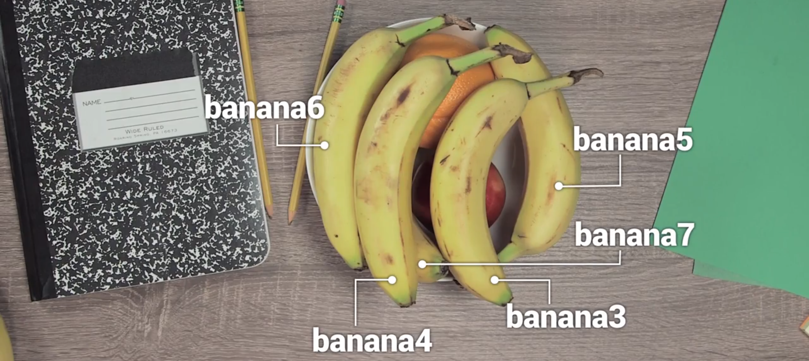
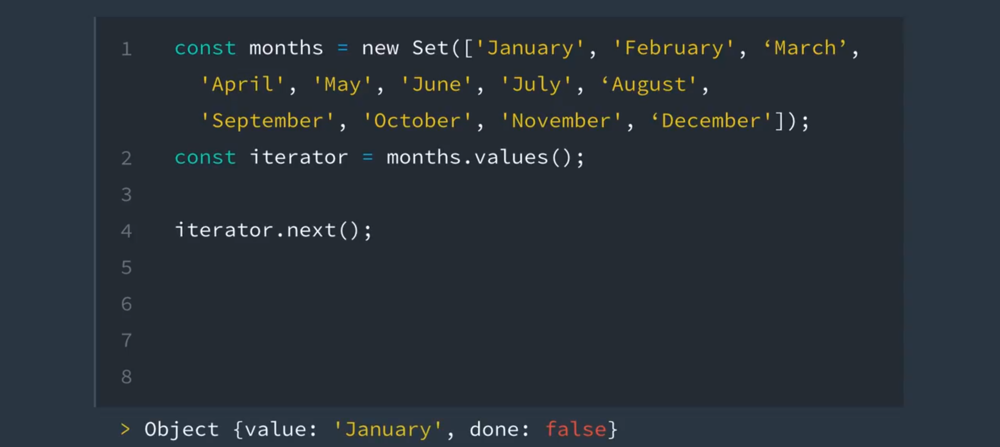
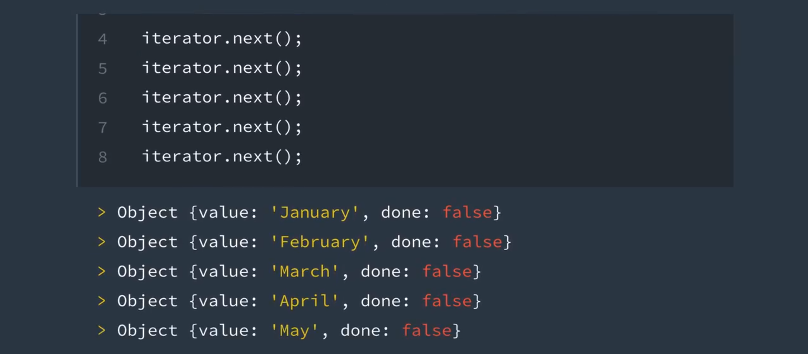
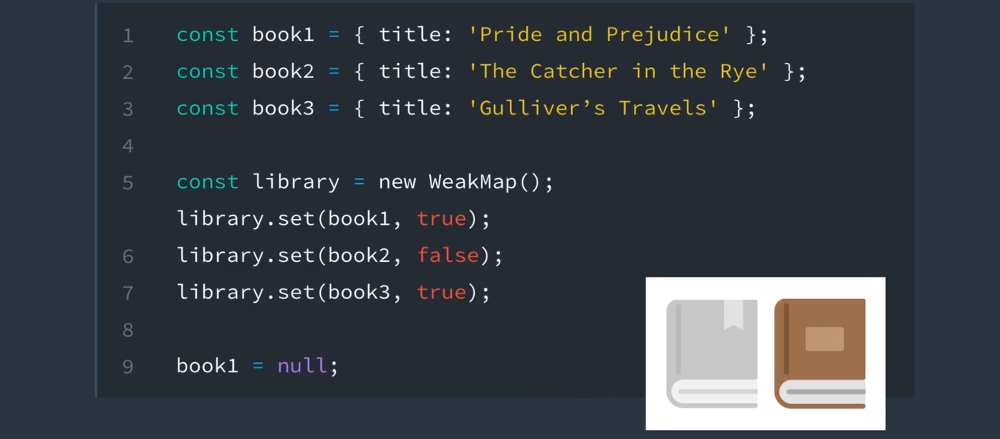

# javascriptES6 - 内置功能

> JavaScript 环境默认地提供了各种功能。在这节课，我们将了解 Set、Map、Proxy、生成器以及迭代器的工作原理和更多知识！

---

[TOC]

---

## 1. 新的内置功能

在这一节课，我们将会学习 ES6 最新提供的**一组内置对象**。

现在我们有了 sets maps promises 还有很多全新的内置方法供我们使用。

适应这些新特性可能需要花上一点时间，但是这些内置对象可以让我们**更容易的完成**在早前版本的 JavaScript 中曾经很苦难的工作。

通过这节课，你将会学习这些新的内置对象是**如何构建**、**如何工作**以及**使用它们的最佳时机**。


## 2. symbol 简介

Symbol 是 JavaScript 中我们可用的**原始数据类型列表中**的最新补充。

以前 JavaScript 只有 numbers（数字）、strings（字符串）、booleans（布尔）、null 和 undefined 作为**原始数据类型的值**（primitive Data Types）。

现在 Symbol 也加入了它们，那么 Symbol 是什么呢？

Symbol 只是一个唯一标识符，最常用于唯一标识对象中的属性。


比如，假设这个碗是一个对象，我们把苹果、桔子和香蕉放在这个碗里。记住，这些水果**也是对象**，但是现在它们是这个碗的属性。


如果我将一根新的香蕉加到碗中，可以看到问题所在吗？如果我叫你拿一根香蕉给我，就会发现到底应该拿哪一根呢？

这就是问题，我们需要一种方式来唯一地识别这两根香蕉，在代码中，我可以做的是用 banana1，表示其中一根香蕉，使用 banana2 表示另一根香蕉。那如果我向碗中添加更多香蕉，会怎么样？



想必你也看出来了。好在，使用 ES6 中添加的 Symbol 我们便可解决此问题。


## 3. Symbol

### Symbols（标识符）

**Symbol** 是一种独特的且不可变的数据类型，**经常用来标识对象属性**。

要创建 Symbol，输入 `Symbol()`，并添加一个可选的字符串作为其**描述**。

```javascript
const sym1 = Symbol('apple');
console.log(sym1);
```

> `Symbol(apple)`

它将**创建唯一的标识符**，并将其存储在 `sym1` 中。描述 `"apple"` **只是用来描述标识符的一种方式**，但是**不能用来访问标识符本身**。

为了展示它的工作原理，如果你对具有相同描述的两个标识符进行比较……

```javascript
const sym2 = Symbol('banana');
const sym3 = Symbol('banana');
console.log(sym2 === sym3);
```

> `false`

结果是 `false`，因为描述只是用来描述符号，它并不是标识符本身的一部分。**无论描述是什么，每次都创建新的标识符。**

当然，依然很难弄明白，所以，我们来看一个之前视频中的示例，看看标识符的作用。下面是代表该示例中的 bowl（碗）的代码。

```javascript
const bowl = {
  'apple': { color: 'red', weight: 136.078 },
  'banana': { color: 'yellow', weight: 183.15 },
  'orange': { color: 'orange', weight: 170.097 }
};
```

碗中包含水果，它们是 bowl 的属性对象。但是，当我们添加第二个香蕉时，遇到了问题。

```javascript
const bowl = {
  'apple': { color: 'red', weight: 136.078 },
  'banana': { color: 'yellow', weight: 183.151 },
  'orange': { color: 'orange', weight: 170.097 },
  'banana': { color: 'yellow', weight: 176.845 }
};
console.log(bowl);
```

> `Object {apple: Object, banana: Object, orange: Object}`

**新添加的香蕉将上一个香蕉覆盖了**。为了解决该问题，我们可以使用标识符。

```javascript
const bowl = {
  [Symbol('apple')]: { color: 'red', weight: 136.078 },
  [Symbol('banana')]: { color: 'yellow', weight: 183.15 },
  [Symbol('orange')]: { color: 'orange', weight: 170.097 },
  [Symbol('banana')]: { color: 'yellow', weight: 176.845 }
};
console.log(bowl);
```

> `Object {Symbol(apple): Object, Symbol(banana): Object, Symbol(orange): Object, Symbol(banana): Object}`

通过更改 bowl 的属性并使用标识符，**每个属性都是唯一的标识符，第一个香蕉不会被第二个香蕉覆盖**。


## 4. 迭代器协议和可迭代协议

在继续之前，我们先花些时间看一下 ES6 中的两个新协议：

- **可迭代**协议
- **迭代器**协议

这两个协议不是内置的，但是它们可以帮助你理解 ES6 中的新迭代概念，就像给你展示标识符的使用案例一样。

### 可迭代协议

**可迭代协议**用来定义和自定义对象的**迭代行为**。也就是说在 ES6 中，你**可以灵活地指定循环访问对象中的值的方式**。对于某些对象，它们已经内置了这一行为。例如，字符串和数组就是内置可迭代类型的例子。

```javascript
const digits = [0, 1, 2, 3, 4, 5, 6, 7, 8, 9];
for (const digit of digits) {
  console.log(digit);
}
```

> 0 
> 1 
> 2 
> 3 
> 4 
> 5 
> 6 
> 7 
> 8 
> 9 

在第一节课，我们提到，任何可迭代的对象都可以使用新的 `for...of` 循环。在这节课的稍后阶段，我们还将学习 Set（集合）和 Map（映射），它们也是**内置可迭代类型**。

#### 工作原理

为了使对象可迭代，它必须实现**可迭代接口**。如果你之前使用的是 Java 或 C 语言等语言，那么你可能熟悉接口，但是如果没用过这些语言，**接口其实就是为了让对象可迭代，它必须包含默认的迭代器方法**。该方法将定义对象**如何被迭代**。

**迭代器方法**（可通过**常量** `[Symbol.iterator]` 获得）是一个无参数的函数，返回的是**迭代器对象**。**迭代器对象是遵守迭代器协议的对象**。

### 迭代器协议

**迭代器协议**用来**定义对象生成一系列值的标准方式**。实际上就是现在有了**定义对象如何迭代的流程**。通过执行 `.next()` 方法来**完成**这一流程。

#### 工作原理

当对象执行 `.next()` 方法时，**就变成了迭代器**。`.next()` 方法是无参数函数，返回具有两个属性的对象：

1. `value`：表示对象内**值序列**的下个值的数据
2. `done`：表示迭代器是否已循环访问完值序列的布尔值
   - 如果 done 为 *true*，则迭代器已到达值序列的末尾处。
   - 如果 done 为 *false*，则迭代器能够生成值序列中的另一个值。

下面是之前的一个示例，但是我们改为使用数组的默认迭代器访问数组中的每个值。

```javascript
const digits = [0, 1, 2, 3, 4, 5, 6, 7, 8, 9];
const arrayIterator = digits[Symbol.iterator]();

console.log(arrayIterator.next());
console.log(arrayIterator.next());
console.log(arrayIterator.next());
```

> ```javascript
> Object {value: 0, done: false}
> Object {value: 1, done: false}
> Object {value: 2, done: false}
> ```

#### 练习 - 制造一个可迭代的对象

```javascript
/*
 * Programming Quiz: Make An Iterable Object
 *
 * Turn the `james` object into an iterable object.
 *
 * Each call to iterator.next should log out an object with the following info:
 *   - key: the key from the `james` object
 *   - value: the value of the key from the `james` object
 *   - done: true or false if there are more keys/values
 *
 * For clarification, look at the example console.logs at the bottom of the code.
 *
 * Hints:
 *   - Use `Object.keys()` to store the object's properties in an array.
 *   - Each call to `iterator.next()` should use this array to know which property to return.
 *   - You can access the original object using `this`.
 *   - To access the values of the original object, use `this` and the key from the `Object.keys()` array.
 */

const james = {
    name: 'James',
    height: `5'10"`,
    weight: 185,
    [Symbol.iterator](){
        let properties = Object.keys(this);
        let index = 0;
        let contex = this;
        return {
          next() {
            return {"value":contex[properties[index]], "key":properties[index], "done":Boolean(index++ >= properties.length - 1) }; // 这里 index++ 会在每一次运行时 +1，从而让每一次 .next() 方法所放回的值不同。
          }
        };
    }
};

const iterator = james[Symbol.iterator]();

 console.log(iterator.next().value); // 'James'
 console.log(iterator.next().value); // `5'10`
 console.log(iterator.next().value); // 185
```


## 5. Set

### 数学意义上的集合（Set）

回忆下之前的数学知识，Set 就是唯一项的集合。例如，`{2, 4, 5, 6}` 是 Set，因为每个数字都是唯一的，只出现一次。但是，`{1, 1, 2, 4}` 不是 Set，因为**它*包含重复的项目***（1 出现了两次！）。

在 JavaScript 中，我们已经可以**使用数组表示类似于数学意义上的集合**。

```
const nums = [2, 4, 5, 6];
```

但是，**数组并不要求项目必须唯一**。如果我们尝试向 `nums` 中添加一个 `2`，JavaScript 不会报错，会正常添加这个 `2`。

```
nums.push(2);
console.log(nums);
```

> `[2, 4, 5, 6, 2]`

现在，`nums` 不再是数学意义上的集合。

### Set（集合）

在 ES6 中，有一个新的内置对象的行为和**数学意义上的集合相同**，使用起来类似于数组。这个新对象就叫做“Set”。Set 与数组之间的最大区别是：

- Set **不基于索引**，**不能根据集合中的条目在集合中的位置引用这些条目**。
- Set 中的条目**不能单独被访问**

基本上，Set 是让你**可以存储唯一条目的对象**。你可以向 Set 中添加条目，删除条目，并循环访问 Set。这些条目可以是原始值或对象。

### 如何创建 Set

可以通过几种不同的方式创建 Set。第一种很简单：

```javascript
const games = new Set();
console.log(games);
```

> `Set {}`

此代码会创建空的 Set `games`，其中没有条目。

如果你想根据值列表创建 Set，**则使用数组**：

```javascript
const games = new Set(['Super Mario Bros.', 'Banjo-Kazooie', 'Mario Kart', 'Super Mario Bros.']);
console.log(games);
```

> `Set {'Super Mario Bros.', 'Banjo-Kazooie', 'Mario Kart'}`

注意上述示例在创建 Set 时，会**自动移除重复的条目** `"Super Mario Bros."`，很整洁！

#### 练习题

下面的哪些集合代表的是 JavaScript 中的 Set

- `{1, 'Basketball', true, false, '1'}`
  - 很棒！你所选择的选项代表了 Set，因为它们里面的条目都是唯一的。 
- `{}`
  - 很棒！你所选择的选项代表了 Set，因为它们里面的条目都是唯一的。 
- `{1, 1, 1, 1}`
- `{false, '0', 0, 'Soccer', 3.14, 25, 0}`
- `{'Gymnastics', 'Swimming', 2}`
  - 很棒！你所选择的选项代表了 Set，因为它们里面的条目都是唯一的。 


## 6. 修改 Set

### 修改 Set

创建 Set 后，你可能想要添加或删除条目。如何操作呢？可以使用名称对应的 `.add()` 和 `.delete()` 方法：

```javascript
const games = new Set(['Super Mario Bros.', 'Banjo-Kazooie', 'Mario Kart', 'Super Mario Bros.']);

games.add('Banjo-Tooie');
games.add('Age of Empires');
games.delete('Super Mario Bros.');

console.log(games);
```

> `Set {'Banjo-Kazooie', 'Mario Kart', 'Banjo-Tooie', 'Age of Empires'}`

另一方面，如果你想要删除 Set 中的所有条目，可以使用 `.clear()` 方法。

```javascript
games.clear()
console.log(games);
```

> `Set {}`

> **提示**：如果你尝试向 Set 中 `.add()` 重复的条目，系统不会报错，但是该条目不会添加到 Set 中。此外，如果你尝试 `.delete()` Set 中不存在的条目，也不会报错，Set 保持不变。
>
> `.add()` 添加不管成功与否，**都会返回该 Set 对象**。另一方面，`.delete()` 则**会返回一个布尔值**，该值取决于是否成功删除（**即如果该元素存在，返回true，否则返回false**）。


## 7. 使用 Set

### 使用 Set

#### 查看长度

构建 Set 后，可以通过几个不同的属性和方法来处理 Set。

**使用 `.size` 属性**可以返回 Set 中的条目数：

```javascript
const months = new Set(['January', 'February', 'March', 'April', 'May', 'June', 'July', 'August', 'September', 'October', 'November', 'December']);
console.log(months.size);
```

> `12`

注意，不能像数组那样通过索引访问 Set，因此要使用 `.size` 属性，而不是 `.length` 属性来获取 Set 的大小。

#### 检查是否存在某个条目

使用 `.has()` 方法可以检查 Set 中是否存在某个条目。如果 Set 中有该条目，则 `.has()` 将返回 `true`。如果 Set 中不存在该条目，则 `.has()` 将返回 `false`。

```javascript
console.log(months.has('September'));
```

> `true`

#### 检索所有值

最后，使用 `.values()` 方法可以返回 Set 中的值。`.values()` 方法的返回值是 `SetIterator` 对象。

```javascript
console.log(months.values());
```

> `SetIterator {'January', 'February', 'March', 'April', 'May', 'June', 'July', 'August', 'September', 'October', 'November', 'December'}`

稍后将讲解 `SetIterator` 对象！

> **提示**：`.keys()` 方法将和 `.values()` 方法的行为完全一样：将 Set 的值返回到新的迭代器对象中。`.keys()` 方法是 `.values()` 方法的别名，和 Map（映射）中的类似。你稍后将在这节课的 Map 部分看到 `.keys()` 方法。


## 8. Set 与迭代器

处理 Set 的最后一步是循环访问 Set。

如果还记得之前介绍的 ES6 中的新可迭代协议和迭代器协议，那么你会想起 **Set 是内置可迭代类型**。这意味着循环时的两件事：

1. 你可以使用 Set 的默认迭代器循环访问 Set 中的每一项。
2. 你可以使用新的 `for...of` 循环来循环访问 Set 中的每一项。

### 使用 SetIterator

因为 `.values()` 方法返回新的迭代器对象（称为 `SetIterator`），你可以将该迭代器对象存储在变量中，并使用 `.next()` 访问 Set 中的每一项。

```
const iterator = months.values();
iterator.next();
```

> `Object {value: 'January', done: false}`

如果再次运行 `.next()` 呢？

```
iterator.next();
```

> `Object {value: 'February', done: false}`

等等，一直运行到 `done` 等于 `true` 时，标志着 Set 的结束。





### 使用 `for...of` 循环

一种更简单的方法去循环访问 Set 中的项目是 `for...of` 循环。

```javascript
const colors = new Set(['red', 'orange', 'yellow', 'green', 'blue', 'violet', 'brown', 'black']);
for (const color of colors) {
  console.log(color);
}
```

> red
> orange
> yellow
> green
> blue
> violet
> brown
> black


## 9. 练习：使用 Set


### 指导说明：

创建一个名称为 `myFavoriteFlavors` 的变量，并将其值设为空的 `Set` 对象。然后使用 `.add()` 方法向其中添加以下字符串：

- "chocolate chip"
- "cookies and cream"
- "strawberry"
- "vanilla"

然后使用 `.delete()` 方法移除 Set 中的 "strawberry"。 

### 我的代码：

```javascript
/*
 * Programming Quiz: Using Sets (3-1)
 *
 * Create a Set object and store it in a variable named `myFavoriteFlavors`. Add the following strings to the set:
 *     - chocolate chip
 *     - cookies and cream
 *     - strawberry
 *     - vanilla
 *
 * Then use the `.delete()` method to remove "strawberry" from the set.
 */

const myFavoriteFlavors = new Set()
myFavoriteFlavors.add('chocolate chip')
myFavoriteFlavors.add('cookies and cream')
myFavoriteFlavors.add('strawberry')
myFavoriteFlavors.add('vanilla')
myFavoriteFlavors.delete('strawberry')
```


## 10. WeakSet


### 什么是 WeakSet（弱集合）？

WeakSet 和普通 Set 很像，但是具有以下关键区别：

1. WeakSet **只能包含对象**
2. WeakSet **无法迭代**，意味着不能循环访问其中的对象
3. WeakSet **没有 `.clear()` 方法**

你可以像创建普通 Set 那样创建 WeakSet，但是**需要使用 `WeakSet` 构造函数**。

```
const student1 = { name: 'James', age: 26, gender: 'male' };
const student2 = { name: 'Julia', age: 27, gender: 'female' };
const student3 = { name: 'Richard', age: 31, gender: 'male' };

const roster = new WeakSet([student1, student2, student3]);
console.log(roster);
```

> `WeakSet {Object {name: 'Julia', age: 27, gender: 'female'}, Object {name: 'Richard', age: 31, gender: 'male'}, Object {name: 'James', age: 26, gender: 'male'}}`

但是如果你**尝试添加对象以外的内容，系统将报错！**

```
roster.add('Amanda');
```

> `Uncaught TypeError: Invalid value used in weak set(…)`

这是预期到的行为，因为 WeakSet 只能包含对象。但是**为何只能包含对象**？如果普通 Set 可以包含对象和其他类型的数据，为何还要使用 WeakSet？这个问题的答案与为何 WeakSet 没有 `.clear()` 方法有很大的关系……

### 垃圾回收

在 JavaScript 中，**创建新的值时会分配内存**，并且**当这些值不再需要时，将自动释放内存**。这种内存不再需要后释放内存的过程称为**垃圾回收**。

WeakSet 通过专门使用对象作为键值来利用这一点。**如果将对象设为 `null`，则本质上是删除该对象。当 JavaScript 的垃圾回收器运行时，该对象之前占用的内存将被释放，以便稍后在程序中使用**。

```
student3 = null;
console.log(roster);
```

> `WeakSet {Object {name: 'Julia', age: 27, gender: 'female'}, Object {name: 'James', age: 26, gender: 'male'}}`


**这种机制的好处在于你不用去担心要删掉对 WeakSet 中已删除对象的引用，JavaScript 会帮你删除！**如果对象被删除，当垃圾回收器运行时，该对象也会从 WeakSet 中删除。这样的话，如果你想要一种高效、轻便的解决方法去创建一组对象，就可以使用 WeakSet。

垃圾回收的发生时间点取决于很多因素。请参阅 [MDN 的文档](https://developer.mozilla.org/zh-CN/docs/Web/JavaScript/Memory_Management#%E5%9E%83%E5%9C%BE%E5%9B%9E%E6%94%B6)，详细了解用于处理 JavaScript 中的垃圾回收的算法。


## 11. 练习：处理 WeakSet

### 指导说明：

创建以下变量：

- `uniqueFlavors`，将其值设为空的 `WeakSet` 对象
- `flavor1`，将其设为对象 `{ flavor: 'chocolate' }`
- `flavor2`，将其设为一个对象，该对象的属性为 `flavor`，值可以自己选择

使用 `.add()` 方法将对象 `flavor1` 和 `flavor2` 添加到 `uniqueFlavors`。

使用 `.add()` 方法再次将 `flavor1` 对象添加到 `uniqueFlavors` Set。

### 我的代码：

```javascript
/*
 * Programming Quiz: Using Sets (3-2)
 *
 * Create the following variables:
 *     - uniqueFlavors and set it to a new WeakSet object
 *     - flavor1 and set it equal to `{ flavor: 'chocolate' }`
 *     - flavor2 and set it equal to an object with property 'flavor' and value of your choice!
 *
 * Use the `.add()` method to add the objects `flavor1` and `flavor2` to `uniqueFlavors`
 * Use the `.add()` method to add the `flavor1` object (again!) to the `uniqueFlavors` set
 */

 let flavor1 = {flavor1: 'chocolate'};
 let flavor2 = {flavor1: 'shala'};
 let uniqueFlavors = new WeakSet([flavor1,flavor2]);
 uniqueFlavors.add(flavor1);
 uniqueFlavors.add(flavor2);
 uniqueFlavors.add(flavor1);
 console.log(uniqueFlavors)
```


## 12. Map

我们刚刚看了 Set 和 WeakSet，Map 和 WeakMap 在很多方面与 Set 和 WeakSet 相同。

Map 和 Set 都是**可迭代的**，这意味着你**可以循环遍历它们**，而 WeakMap 和 WeakSet **不会阻止对象被当做垃圾回收**，但是 Map 是唯一的，因为它们是键值对的集合，而 Set 是唯一值的集合。

**你可以说 Set 类似于数组，而 Map 类似于对象。**


## 13. 创建和修改 Map

### Map（映射）

如果说 Set 类似于数组，那么 Map 就类似于对象，因为 Map **存储键值对**，和**对象包含<u>命名属性</u>及值相类似**。

本质上，Map 是一个**可以存储键值对的对象**，**键和值都可以是对象、原始值或二者的结合**。

### 如何创建 Map

要创建 Map，只需输入：

```javascript
const employees = new Map();
console.log(employees);
```

> `Map {}`

这样就会创建空的 Map `employee`，没有键值对。

### 修改 Map

和 Set 不同，你**无法使用值列表创建 Map**；而是使用 Map 的 `.set()` 方法添加键值。

```javascript
const employees = new Map();

employees.set('james.parkes@udacity.com', { 
    firstName: 'James',
    lastName: 'Parkes',
    role: 'Content Developer' 
});
employees.set('julia@udacity.com', {
    firstName: 'Julia',
    lastName: 'Van Cleve',
    role: 'Content Developer'
});
employees.set('richard@udacity.com', {
    firstName: 'Richard',
    lastName: 'Kalehoff',
    role: 'Content Developer'
});

console.log(employees);
```

> `Map {'james.parkes@udacity.com' => Object {...}, 'julia@udacity.com' => Object {...}, 'richard@udacity.com' => Object {...}}`

`.set()` 方法有**两个参数。第一个参数是键，用来引用第二个参数，即值。**

要移除键值对，只需使用 `.delete()` 方法。

```javascript
employees.delete('julia@udacity.com');
employees.delete('richard@udacity.com');
console.log(employees);
```

> `Map {'james.parkes@udacity.com' => Object {firstName: 'James', lastName: 'Parkes', role: 'Course Developer'}}`

同样，和 Set 类似，你可以使用 `.clear()` 方法从 Map 中删除所有键值对。

```javascript
employees.clear()
console.log(employees);
```

> `Map {}`

> **提示**：如果你使用 `.set()` 向 Map 中添加键已存在的键值对，不会收到错误，但是该键值对将覆盖 Map 中的现有键值对。此外，如果尝试使用 `.delete()` 删除 Map 中不存在的键值，不会收到错误，而 Map 会保持不变。
>
> 如果成功地删除了键值对，`.delete()` 方法会返回 `true`，失败则返回 `false`。`.set()` 如果成功执行，则返回 `Map` 对象本身。


## 14. 处理 Map

### 处理 Map

构建 Map 后，可以使用 `.has()` 方法并向其传入一个键来检查 Map 中是否存在该键值对。

```javascript
const members = new Map();

members.set('Evelyn', 75.68);
members.set('Liam', 20.16);
members.set('Sophia', 0);
members.set('Marcus', 10.25);

console.log(members.has('Xavier'));
console.log(members.has('Marcus'));
```

> `false`
> `true`

还可以通过向 `.get()` 方法传入一个键，检索 Map 中的值。

```javascript
console.log(members.get('Evelyn'));
```

> `75.68`


## 15. 循环访问 Map


### 循环访问 Map

你已经创建了 Map，添加了一些键值对，现在你想循环访问该 Map。幸运的是，可以通过以下三种方式循环访问：

1. 使用 Map 的默认迭代器循环访问每个键或值
2. 使用新的 `for...of` 循环来循环访问每个键值对
3. 使用 Map 的 `.forEach()` 方法循环访问每个键值对

### 1. 使用 MapIterator

在 Map 上使用 `.keys()` 和 `.values()` 方法将返回新的迭代器对象，叫做 `MapIterator`。你**可以将该迭代器对象存储在新的变量中，并使用 `.next()` 循环访问每个键或值。**你所使用的方法将决定迭代器是否能够访问 Map 的键或值。

```javascript
let iteratorObjForKeys = members.keys();
iteratorObjForKeys.next();
```

> `Object {value: 'Evelyn', done: false}`

使用 `.next()` 获得下个键值对。

```javascript
iteratorObjForKeys.next();
```

> `Object {value: 'Liam', done: false}`

等等。

```javascript
iteratorObjForKeys.next();
```

> `Object {value: 'Sophia', done: false}`

另一方面，使用 `.values()` 方法访问 Map 的值，然后重复同一流程。

```javascript
let iteratorObjForValues = members.values();
iteratorObjForValues.next();
```

> `Object {value: 75.68, done: false}`

### 2. 使用 for...of 循环

Map 的第二种循环访问方式是使用 `for...of` 循环。

```javascript
for (const member of members) {
  console.log(member);
}
```

> ```javascript
>  ['Evelyn', 75.68]
>  ['Liam', 20.16]
>  ['Sophia', 0]
>  ['Marcus', 10.25]
> ```

但是，在对 Map 使用 `for...of` 循环时，并不会得到一个键值或一个值。键值对会拆分为一个数组，第一个元素是键，第二个元素是值。有没有什么方法可以解决这一问题？


> 对这道练习题有疑问？点击此处查看 [参考答案](https://discussions.youdaxue.com/t/es6/50044#es6-03)

### 3. 使用 forEach 循环

最后一种循环访问 Map 的方式是使用 `.forEach()` 方法。

```javascript
members.forEach((value, key) => console.log(value, key));
```

> ```javascript
>  'Evelyn' 75.68
>  'Liam' 20.16
>  'Sophia' 0
>  'Marcus' 10.25
> ```

注意，在使用箭头函数后，`forEach` 循环是如何简单地读取数据的。对于 `members` 中的每个 value 和 key，都会被输出到控制台中。


## 16. WeakMap

> **提示**：如果你已经看过 WeakSet 部分，那么这部分相当于复习了。WeakMap（弱映射）的行为和 WeakSet 的一样，只是 WeakMap 处理的是键值对，而不是单个条目。

### 什么是 WeakMap？

WeakMap 和普通 Map 很像，但是具有以下关键区别：

1. WeakMap **只能包含对象作为键**，
2. WeakMap **无法迭代，意味着无法循环访问**，并且
3. WeakMap **没有 `.clear()` 方法**。

你可以像创建普通 Map 那样创建 WeakMap，但是需要使用 `WeakMap` 构造函数。

```
const book1 = { title: 'Pride and Prejudice', author: 'Jane Austen' };
const book2 = { title: 'The Catcher in the Rye', author: 'J.D. Salinger' };
const book3 = { title: 'Gulliver's Travels', author: 'Jonathan Swift' };

const library = new WeakMap();
library.set(book1, true);
library.set(book2, false);
library.set(book3, true);

console.log(library);
```

> `WeakMap {Object {title: 'Pride and Prejudice', author: 'Jane Austen'} => true, Object {title: 'The Catcher in the Rye', author: 'J.D. Salinger'} => false, Object {title: 'Gulliver's Travels', author: 'Jonathan Swift'} => true}`

但是如果你尝试添加对象以外的内容作为键，系统将报错！

```
library.set('The Grapes of Wrath', false);
```

> `Uncaught TypeError: Invalid value used as weak map key(…)`

这是可预期到的行为，因为 WeakMap 只能包含对象作为键。但是为何只能包含对象？同样，和 WeakSet 相似，**WeakMap 利用垃圾回收机制让其可以更简单地使用和易维护。**

### 垃圾回收

在 JavaScript 中，创建新的值时会分配内存，并且当这些值不再需要时，将自动释放内存。这种内存不再需要后释放内存的过程称为**垃圾回收**。

WeakMap 通过专门处理对象作为键来利用这一点。**如果将对象设为 `null`，则本质上是删除该对象。**当 JavaScript 的垃圾回收器运行时，该对象之前占用的内存将被释放，以便稍后在程序中使用。

```
book1 = null;
console.log(library);
```

> `WeakMap {Object {title: 'The Catcher in the Rye', author: 'J.D. Salinger'} => false, Object {title: 'Gulliver’s Travels', author: 'Jonathan Swift'} => true}`




这种机制的**好处**在于你不用去担心要删掉对 WeakMap 中已删除对象的引用键，JavaScript 会帮你删除！如果对象被删除，当垃圾回收器运行时，该对象键也会从弱映射中删除。这样的话，如果你想要一种高效、轻便的解决方法去创建一组具有元数据的对象，就可以使用 WeakMap。

垃圾回收的发生时间点取决于很多因素。请参阅 [MDN 的文档](https://developer.mozilla.org/zh-CN/docs/Web/JavaScript/Memory_Management#%E5%9E%83%E5%9C%BE%E5%9B%9E%E6%94%B6)，详细了解用于处理 JavaScript 中的垃圾回收的算法。


## 17. Promise 简介

Promise 是一个有趣的概念，可以用来解决早前版本的 JavaScript 中一些棘手的问题，使用 JavaScript Promise 是**处理异步请求的一种新方法**，就像其他大部分 ES6 的更新一样，是**对我们过去代码构建方式的一种改良**，让我们看一个示例。


James 正在耐心等候我的点单，so，假如我说，嘿，可以给我拿一个圣代冰激凌吗？so，我发出了一个请求，然后他给我返回了一些东西作为响应：


但是我需要一直在原地等着他给我拿冰淇淋吗？在他做冰淇淋的时候，我可以回去继续忙别的么？


只要当他做好冰淇淋的时候告诉我一声，让我回到原来离开的地方取冰淇淋就行了。

**处理一个请求需要来回等待，让我们在大量的停机时间能够同时进行其他工作，并且通知我们请求处理完成，就是 Promises 在 JavaScript 中的作用。**它处理“**现在做这件事，然后在事情完成之后通知我**“，所以我能回到上次离开的地方接受响应。

让我们看看如何创建和使用 Promises。


## 18. Promise

### Promise

JavaScript Promise 是用新的 [Promise 构造函数](https://developer.mozilla.org/zh-CN/docs/Web/JavaScript/Reference/Global_Objects/Promise) - `new Promise()` **创建而成的**。promise 使你能够展开一些可以**异步**完成的工作，并回到常规工作。**创建 promise 时，必须向其提供异步运行的代码。将该代码当做参数提供给构造函数：**

```javascript
new Promise(function () {
    window.setTimeout(function createSundae(flavor = 'chocolate') {
        const sundae = {};
        // 请求冰淇淋
        // 得到锥形蛋筒
        // 加热冰淇淋
        // 舀一大勺到蛋筒里!
    }, Math.random() * 2000);
});
```

该代码在我发出请求时将会创建一个 promise，并且在几秒钟后启动。然后需要在 `createSundae` 函数中执行几个步骤。

### 指示一个成功请求或者失败请求

但是完成这一切后，JavaScript **如何通知我们它已经完成操作**，准备好让我们恢复工作？它通过向初始函数中传入两个函数来实现这一点，通常我们将这两个函数称为 `resolve` 和 `reject`。

该函数被传递给我们向 Promise 构造函数提供的函数 - 通常单词"resolve”用于表示当请求成功完成时，应该调用此函数。请注意第一行的 `resolve`：

```javascript
new Promise(function (resolve, reject) {
    window.setTimeout(function createSundae(flavor = 'chocolate') {
        const sundae = {};
        // 请求冰淇淋
        // 得到锥形蛋筒
        // 加热冰淇淋
        // 舀一大勺到蛋筒里!
        resolve(sundae);
    }, Math.random() * 2000);
});
```

**当 sundae 被成功创建后，它会调用 `resolve` 方法并向其传递我们要返回的数据**，在本例中，返回的数据是完成的 sundae。因此 `resolve` 方法**用来表示请求已完成**，并且**成功**完成了请求。

如果请求存在问题，无法完成请求，那么我们可以使用传递给该函数的第二个函数。通常，该函数存储在一个叫做"reject"的标识符中，表示如果请求因为某种原因失败了，应该使用该函数。请看看第一行的 `reject`：

```javascript
new Promise(function (resolve, reject) {
    window.setTimeout(function createSundae(flavor = 'chocolate') {
        const sundae = {};
        // 请求冰淇淋
        // 得到锥形蛋筒
        // 加热冰淇淋
        // 舀一大勺到蛋筒里!
        if ( /* iceCreamConeIsEmpty(flavor) */ ) {
            reject(`Sorry, we're out of that flavor :-(`);
        }
        resolve(sundae);
    }, Math.random() * 2000);
});
```

如果请求**无法完成**，则使用 `reject` 方法。**注意，即使请求失败了，我们依然可以返回数据**，在本例中，我们只是返回了一段文字，表示没有我们想要的冰激凌口味。

Promise 构造函数需要一个可以运行的函数，运行一段时间后，将成功完成（使用 `resolve` 方法）或失败（使用 `reject` 方法）。当结果最终确定时（请求成功完成或失败），现在 promise 已经**实现**了，并且将通知我们，这样我们便能决定将如何对结果做处理。 

### Promise 立即返回对象

首先要注意的是，Promise 将立即返回一个对象。

```javascript
const myPromiseObj = new Promise(function (resolve, reject) {
    // 圣代创建代码
});
```

**该对象上具有一个 `.then()` 方法，我们可以让该方法通知我们 promise 中的请求成功与否。**`.then()` 方法会接收两个函数：

1. 请求成功完成时要运行的函数
2. 请求失败时要运行的函数

```javascript
mySundae.then(function(sundae) {
    console.log(`Time to eat my delicious ${sundae}`);
}, function(msg) {
    console.log(msg);
    self.goCry(); // 不是一个真正的方法
});
```

可以看出，传递给 `.then()` 的第一个函数将被调用，并传入 Promise 的 `resolve` 函数需要使用的数据。这里，该函数将接收 `sundae` 对象。第二个函数传入的数据会在 Promise 的 `reject` 函数被调用时使用。这里，该函数收到错误消息"Sorry, we're out of that flavor :-("，在上述 Promise 代码中，`reject` 函数被调用。

## 19. 更多 Promise

Promises 是一个非常强大的新特性，大量已有的和未来的更新都会用到它，所以能否正确的编写 JavaScript Promises 就显得非常重要。

它真的很重要，事实上我们专门制作了一节独立的课程来详细讲解 JavaScript Promises。

因为 Promises 可以让我们更容易的处理异步代码，通过  Promises **阅读和编写代码将变得更容易**。正如你们都知道的，最重要的是**调试代码将变得非常容易**。

当你学习这节课的时候，你将会构建一个叫做 Exoplanet Explore 的应用，这真的是一个非常酷的应用，它能帮助人们了解银河系中某个星球周围的其他星星，某个真实存在的星球。


请参阅我们的 [Promise 课程](https://www.udacity.com/course/javascript-promises--ud898)，详细了解以下内容：

- JavaScript Promise
- 如何处理返回的数据和错误
- 构建一个叫做 Exoplanet Explorer 的应用，并使用 JavaScript Promise 异步获取远程数据


## 20. Proxy 简介

我们换个主题，来聊聊代理（Proxy）。

字典中对代理的定义是...

- 嗨，我需要把这个给 Richard
  - 他现在有点忙
- 那你能签收一下吗？
  - 没问题。... 给

字典中对代码的定义是某人的代表，在 ES6 中...

- 嗨，我能跟 Richard 聊会儿吗？
  - 好的，等等，我问下。
- 他说他还得五分钟左右。
  - 好吧，谢了。
- 我讲到哪儿了？

这个概念在 ES6 中就是指 JavaScript 代理，JavaScript 代理会**让一个对象代表另一个对象来处理另一个对象的所有交互**。

代理可以**直接处理请求，接收或发送目标对象数据以及一大堆其他事情**。

我们来看看如何在 JavaScript 中创建代理。

## 21. Proxy

要创建 Proxy（代理）对象，我们使用 Proxy 构造函数 `new Proxy();`。Proxy 构造函数接收两个项目：

- 它将要代理的对象
- 包含将为被代理对象处理的方法列表的对象

第二个对象叫做**处理器**.

### Proxy 内的一个传递

创建 Proxy 的最简单方式是提供对象和空的 handler（处理器）对象。

```javascript
var richard = {status: 'looking for work'};
var agent = new Proxy(richard, {});

agent.status; // 返回 'looking for work'
```

上述代码并没有对 Proxy 执行任何特殊操作，只是将请求直接传递给源对象！**如果我们希望 Proxy 对象截获请求，这就是 handler 对象的作用了！**

让 Proxy 变得有用的关键是当做第二个对象传递给 Proxy 构造函数的 handler 对象。handler 对象由将用于访问属性的方法构成。我们看看 `get`：

### Get Trap（捕获器）

`get` 用来截获对属性的调用：

```javascript
const richard = {status: 'looking for work'};
const handler = {
    get(target, propName) {
        console.log(target); // `richard` 对象，不是 `handler` 也不是 `agent`
        console.log(propName); // 代理（本例中为`agent`）正在检查的属性名称
    }
};
const agent = new Proxy(richard, handler);
agent.status; // 打印 richard 对象（不是代理对象！）和正在访问的属性的名称（`status`）
```

在上述代码中，`handler` 对象具有一个 `get` 方法（因为被用在 Proxy 中，所以将"function"（方法）称之为"trap"（捕获器））。当代码 `agent.status;` 在最后一行运行时，**因为存在 `get` 捕获器，它将截获该调用以获得 `status`（状态）属性并运行 `get` 捕获器方法。**这样将会输出 Proxy 的目标对象（`richard` 对象），然后输出被请求的属性（`status` 属性）的名称。**它的作用就是这些！**它不会实际地输出属性！这很重要 —— **如果使用了捕获器，你需要确保为该捕获器提供所有的功能**。

#### 从 Proxy 内部访问目标对象

如果我们想真正地提供真实的结果，我们需要返回目标对象的属性：

```javascript
const richard = {status: 'looking for work'};
const handler = {
    get(target, propName) {
        console.log(target);
        console.log(propName);
        return target[propName];
    }
};
const agent = new Proxy(richard, handler);
agent.status; //  (1)打印 richard 对象，(2)打印被访问的属性，(3)返回 richard.status 中的文本
```

注意我们在 `get` trap 中添加了最后一行 `return target[propName];`，这样将会访问目标对象的属性并返回它。

#### 直接获取 Proxy 的返回信息

此外，我们可以使用 Proxy 提供直接的反馈：

```javascript
const richard = {status: 'looking for work'};
const handler = {
    get(target, propName) {
        return `He's following many leads, so you should offer a contract as soon as possible!`;
    }
};
const agent = new Proxy(richard, handler);
agent.status; // 返回文本 `He's following many leads, so you should offer a contract as soon as possible!`
```

对于上述代码，Proxy 甚至**不会检查目标对象，直接对调用代码做出响应。**

**因此每当 Proxy 上的属性被访问，`get` trap 将接管任务。**如果我们**想截获调用以更改属性，则需要使用 `set`trap！**

`set` trap 用来**截获将更改属性的代码**。`set` trap 将接收： 它代理的对象被设置的属性 Proxy 的新值

```javascript
const richard = {status: 'looking for work'};
const handler = {
    set(target, propName, value) {
        if (propName === 'payRate') { // 如果工资正在确定，则需要15%作为佣金。
            value = value * 0.85;
        }
        target[propName] = value;
    }
};
const agent = new Proxy(richard, handler);
agent.payRate = 1000; // 将演员的工资设置为 1,000美元
agent.payRate; // 850美元是演员的实际工资
```

在上述代码中，注意 `set` trap 会检查是否设置了 `payRate` 属性。如果设置了，Proxy 就从中拿走 15% 的费用作为自己的佣金！当演员的薪酬是一千美元时，因为 `payRate` 属性已设置，代码从中扣除 15% 的费用，并将实际 `payRate` 属性设为 `850`；

### 其他 Trap

我们查看了 `get` 和 `set` trap（可能是你最常用到的 Trap），但是实际上总共有 13 种不同的 Trap，它们都可以用在处理程序中！

1. [get trap](https://developer.mozilla.org/zh-CN/docs/Web/JavaScript/Reference/Global_Objects/Proxy/handler/get) - 使 proxy 能处理对属性访问权的调用
2. [set trap](https://developer.mozilla.org/zh-CN/docs/Web/JavaScript/Reference/Global_Objects/Proxy/handler/set) - 使 proxy 能将属性设为新值
3. [apply trap](https://developer.mozilla.org/zh-CN/docs/Web/JavaScript/Reference/Global_Objects/Proxy/handler/apply) - 使 proxy 能被调用（被代理的对象是函数）
4. [has trap](https://developer.mozilla.org/zh-CN/docs/Web/JavaScript/Reference/Global_Objects/Proxy/handler/has) - 使 proxy 能使用 `in` 运算符
5. [deleteProperty trap](https://developer.mozilla.org/zh-CN/docs/Web/JavaScript/Reference/Global_Objects/Proxy/handler/deleteProperty) - 使 proxy 能确定属性是否被删除
6. [ownKeys trap](https://developer.mozilla.org/zh-CN/docs/Web/JavaScript/Reference/Global_Objects/Proxy/handler/ownKeys) - 使 proxy 能处理当所有键被请求时的情况
7. [construct trap](https://developer.mozilla.org/zh-CN/docs/Web/JavaScript/Reference/Global_Objects/Proxy/handler/construct) - 使 proxy 能处理 proxy 与 `new` 关键字一起使用当做构造函数的情形
8. [defineProperty trap](https://developer.mozilla.org/zh-CN/docs/Web/JavaScript/Reference/Global_Objects/Proxy/handler/defineProperty) - 使 proxy 能处理当 defineProperty 被用于创建新的对象属性的情形
9. [getOwnPropertyDescriptor trap](https://developer.mozilla.org/zh-CN/docs/Web/JavaScript/Reference/Global_Objects/Proxy/handler/getOwnPropertyDescriptor) - 使 proxy 能获得属性的描述符
10. [preventExtenions trap](https://developer.mozilla.org/zh-CN/docs/Web/JavaScript/Reference/Global_Objects/Proxy/handler/preventExtensions) - 使 proxy 能对 proxy 对象调用 `Object.preventExtensions()`
11. [isExtensible trap](https://developer.mozilla.org/zh-CN/docs/Web/JavaScript/Reference/Global_Objects/Proxy/handler/isExtensible) - 使 proxy 能对 proxy 对象调用 `Object.isExtensible`
12. [getPrototypeOf trap](https://developer.mozilla.org/zh-CN/docs/Web/JavaScript/Reference/Global_Objects/Proxy/handler/getPrototypeOf) - 使 proxy 能对 proxy 对象调用 `Object.getPrototypeOf`
13. [setPrototypeOf trap](https://developer.mozilla.org/zh-CN/docs/Web/JavaScript/Reference/Global_Objects/Proxy/handler/setPrototypeOf) - 使 proxy 能对 proxy 对象调用 `Object.setPrototypeOf`

可以看出，有很多 trap 可以让 proxy 管理如何处理被代理的对象的调用。


## 22. Proxy 与 ES5 Getter/Setter

一开始，可能不太清楚的是，ES5 中已经提供了 getter 和 setter 方法，为何还要 Proxy。对于 ES5 的 getter 和 setter 方法，你需要提前知道要获取/设置的属性：

```javascript
var obj = {
    _age: 5,
    _height: 4,
    get age() {
        console.log(`getting the "age" property`);
        console.log(this._age);
    },
    get height() {
        console.log(`getting the "height" property`);
        console.log(this._height);
    }
};
```

对于上述代码，注意在初始化对象时，我们需要设置 `get age()` 和 `get height()`。因此，当我们调用下面的代码时，将获得以下结果：

```javascript
obj.age; // 打印 'getting the "age" property' 和 5
obj.height; // 打印 'getting the "height" property' 和 4
```

但是当我们向该对象添加新的属性时，看看会发生什么：

```javascript
obj.weight = 120; // 在对象上设置一个新的属性
obj.weight; // 只打印120
```

注意，并没有显示 `age` 和 `height` 属性那样生成的 `getting the "weight" property` 消息。

对于 ES6 中的 Proxy，我们不需要提前知道这些属性*：

```javascript
const proxyObj = new Proxy({age: 5, height: 4}, {
    get(targetObj, property) {
        console.log(`getting the ${property} property`);
        console.log(targetObj[property]);
    }
});

proxyObj.age; // 打印 'getting the age property' 和 5
proxyObj.height; // 打印 'getting the height property' 和 4
```

就像 ES5 代码那样一切正常，但是当我们添加新的属性时，看看会发生什么：

```javascript
proxyObj.weight = 120; // 在对象上设置一个新的属性
proxyObj.weight; // 打印 'getting the weight property' 和 120
```

看到了吗？向 proxy 对象中添加了 `weight` 属性，稍后检索它时，它显示了一条日志消息！

因此 proxy 对象的某些功能可能看起来类似于现有的 ES5 getter/setter 方法，**但是对于 proxy，在初始化对象时，不需要针对每个属性使用 getter/setter 初始化对象。**


## 23. Proxy 小结

Proxy 对象介于真正的对象和调用代码之间。**调用代码与 Proxy 交互，而不是真正的对象**。要创建 Proxy：

- 使用 `new Proxy()` 构造函数

  - 将被代理的对象传入为第一项
  - 第二个对象是 handler（处理器）对象

- handler 对象由 13 种不同的 trap 之一构成

- trap 是一种函数，将截获对属性的调用，让你运行代码

- **如果未定义 trap，默认行为会被发送给目标对象**

  - > 也就是不会发生捕获现象，而是像原来的对象那样访问属性或方法

Proxy 是一种强大的创建和管理对象之间的交互的新方式。 


## 24. 生成器

**每当函数被调用时，JavaScript 引擎就会在函数顶部启动，并运行每行代码，直到到达底部。无法中途停止运行代码，并稍后重新开始**。一直都是这种**“运行到结束”**的工作方式：

```javascript
function getEmployee() {
    console.log('the function has started');

    const names = ['Amanda', 'Diego', 'Farrin', 'James', 'Kagure', 'Kavita', 'Orit', 'Richard'];

    for (const name of names) {
        console.log(name);
    }

    console.log('the function has ended');
}

getEmployee();
```

运行上述代码将在控制台中输出以下内容：

```javascript
the function has started
Amanda
Diego
Farrin
James
Kagure
Kavita
Orit
Richard
the function has ended
```

如果你想先输出前三名员工的姓名，然后停止一段时间，稍后再从停下的地方继续输出更多员工的姓名呢？普通函数无法这么做，因为无法中途“暂停”运行函数。

### 可暂停的函数

**如果我们希望能够中途暂停运行函数，则需要使用 ES6 中新提供的一种函数，叫做 generator（生成器）函数！**我们来看一个示例：

```javascript
function* getEmployee() {
    console.log('the function has started');

    const names = ['Amanda', 'Diego', 'Farrin', 'James', 'Kagure', 'Kavita', 'Orit', 'Richard'];

    for (const name of names) {
        console.log( name );
    }

    console.log('the function has ended');
}
```

注意到 `function` 关键字后面的**星号（即 `*`）**了吗？星号**表示该函数实际上是生成器！**

现在看看当我们尝试运行该函数时，会发生什么：

```javascript
getEmployee();

// 这是我在 Chrome 中获得的回应:
getEmployee {[[GeneratorStatus]]: "suspended", [[GeneratorReceiver]]: Window}
```

呃，什么？函数顶部的"the function has started"文本去哪了？为何控制台中没有输出任何姓名？问的好，但是先做个小练习。

#### 练习题

以下哪些是有效的生成器？请注意星号的位置。

如果不确定，请尝试在浏览器的控制台中运行它们。

- `function* names() { /* ... */ }`

- `function * names() { /* ... */ }`

- `function *names() { /* ... */ }`

- 生成器的星号实际上可以放在 `function` 关键字和函数名称**之间的任何位置**。因此三个都是有效的生成器声明！

  ES6 社区基本同意将星号放在 `function` 关键字之后（即 `function* 名称() { … }`）。但是，其他人建议将星号放在函数名称前面。因此请务必注意，星号表示函数是生成器，但是星号的位置并不重要。


## 25. 生成器和迭代器

### 生成器和迭代器

> **警告：**我们在上一部分学习了迭代知识，如果你有点忘记了，请再复习一遍，因为在生成器这部分又会提到迭代！

生成器被调用时，它不会运行函数中的任何代码，而是**创建和返回迭代器**。**该迭代器可以用来运行实际生成器的内部代码。**

```javascript
const generatorIterator = getEmployee();
generatorIterator.next();
```

**产生我们期望的代码：**

```javascript
the function has started
Amanda
Diego
Farrin
James
Kagure
Kavita
Orit
Richard
the function has ended
```

如果你自己尝试运行这段代码，迭代器的 `.next()` 方法第一次被调用时，它会运行生成器中的所有代码。注意到什么了吗？代码始终没有暂停！那么我们要怎么才能实现神奇的暂停功能呢？

### 关键字 yield

关键字 `yield` 是 ES6 中新出现的关键字。只能用在生成器函数中。`yield` 会导致生成器暂停下来。我们向我们的生成器中添加 `yield`，试试看：

```javascript
function* getEmployee() {
    console.log('the function has started');

    const names = ['Amanda', 'Diego', 'Farrin', 'James', 'Kagure', 'Kavita', 'Orit', 'Richard'];

    for (const name of names) {
        console.log(name);
        yield;
    }

    console.log('the function has ended');
}
```

注意，现在 `for...of` 循环中出现了 `yield`。如果我们调用该生成器（生成迭代器），然后调用 `.next()`，将获得以下输出：

```javascript
const generatorIterator = getEmployee();
generatorIterator.next();
```

**将输出以下内容到控制台：**

```javascript
the function has started
Amanda
```

暂停了！但是要真的确定下，我们看看下次迭代：

```javascript
generatorIterator.next();
```

**将以下内容输出到控制台：**

```javascript
Diego
```

它能完全记住上次停下的地方！它获取到数组中的下一项（Diego），记录它，然后再次触发了 `yield`，再次暂停。

现在能够很好的暂停了，但是如果将数据从生成器返回到外面的世界呢？我们可以使用 `yield` 实现这一点。

### 向外面的世界生成数据

我们不再向控制台输出姓名并暂停，而是让代码返回姓名并暂停。

```javascript
function* getEmployee() {
    console.log('the function has started');

    const names = ['Amanda', 'Diego', 'Farrin', 'James', 'Kagure', 'Kavita', 'Orit', 'Richard'];

    for (const name of names) {
        yield name;
    }

    console.log('the function has ended');
}
```

注意，现在从 `console.log(name);` 切换成了 `yield name;`。做出这一更改后，当生成器运行时，它会把姓名从函数里返回出去，然后暂停执行代码。我们看看具体效果：

```javascript
const generatorIterator = getEmployee();
let result = generatorIterator.next();
result.value // 是 "Amanda"

generatorIterator.next().value // 是 "Diego"
generatorIterator.next().value // 是 "Farrin"
```

#### 练习题

迭代器的 `.next()` 方法需要被调用多少次，才能完全完成/用尽下面的 `udacity` 生成器函数：

```javascript
function* udacity() {
    yield 'Richard';
    yield 'James'
}
```

- 0 次

- 1 次

- 2 次

- 3 次

  - 它被调用的次数将比生成器函数中的 `yield` 表达式的数量多一次。

  - 对 `.next()` 的第一次调用将启动该函数，并运行为第一个 `yield`。对 `.next()`的第二次调用将从暂停的地方继续，并运行第二个 `yield`。对 `.next()` 的第三次（即最后一次）调用将再次从暂停的地方继续，并运行到函数结尾处。

  - > 因为需要运行到函数的结尾，因此需要多一次的调用。


## 26. 向生成器中发送数据或从中向外发送数据

我们可以使用关键字 yield 从生成器中获取数据。我们还可以将数据发送回生成器中。方式是使用 `.next()` 方法：

```javascript
function* displayResponse() {
    const response = yield;
    console.log(`Your response is "${response}"!`);
}

const iterator = displayResponse();

iterator.next(); // 开始运行生成器函数
iterator.next('Hello Udacity Student'); // 将数据发送到生成器中
// 上面的一行打印到控制台：你的响应是 "Hello Udacity Student"！
```

使用数据调用 `.next()`（即 `.next('Richard')`）**会将该数据发送到生成器函数中上次离开的地方**。它会将 yield 关键字替换为你提供的数据。

**关键字 `yield` 用来暂停生成器并向生成器外发送数据，然后 `.next()` 方法用来向生成器中传入数据。**下面是使用这两种过程来一次次地循环访问姓名列表的示例：

```javascript
function* getEmployee() {
    const names = ['Amanda', 'Diego', 'Farrin', 'James', 'Kagure', 'Kavita', 'Orit', 'Richard'];
    const facts = [];

    for (const name of names) {
        // yield *出* 每个名称并将返回的数据存储到 facts 数组中
        facts.push(yield name); 
    }

    return facts;
}

const generatorIterator = getEmployee();

// 从生成器中获取第一个名称
let name = generatorIterator.next().value;

// 将数据传入 *并* 获取下一个名称
name = generatorIterator.next(`${name} is cool!`).value; 

// 将数据传入 *并* 获取下一个名称
name = generatorIterator.next(`${name} is awesome!`).value; 

// 将数据传入 *并* 获取下一个名称
name = generatorIterator.next(`${name} is stupendous!`).value; 

// 你懂的
name = generatorIterator.next(`${name} is rad!`).value; 
name = generatorIterator.next(`${name} is impressive!`).value;
name = generatorIterator.next(`${name} is stunning!`).value;
name = generatorIterator.next(`${name} is awe-inspiring!`).value;

// 传递最后一个数据，生成器结束并返回数组
const positions = generatorIterator.next(`${name} is magnificent!`).value; 

// 在自己的行上显示每个名称及其描述
positions.join('\n');
```

> 提示：yield 是以一个表达式为单位而不是整行代码或者整块代码。比如：上面的代码中，每次调用 next()，代码都会停留在 `facts.push( !!! )` 中的 !!!  处，也就是还并没有执行 `facts.push()`，只是将小括号中的值返回出去了。

#### 练习题

如果运行以下代码，会发生什么？

```javascript
function* createSundae() {
    const toppings = [];

    toppings.push(yield);
    toppings.push(yield);
    toppings.push(yield);

    return toppings;
}

var it = createSundae();
it.next('hot fudge');
it.next('sprinkles');
it.next('whipped cream');
it.next();
```

- `toppings` 数组的最后一项将是 `undefined `:happy: 
  - 因为第一次调用 `.next()` 传入了一些数据。但是该数据没有存储在任何位置。最后一次调用 `.next()` 应该会获得一些数据，因为生成到对 `toppings.push()` 的最后一次调用中。 
- 将出现错误
- 生成器将被暂停，等待最后一次调用 `.next()`


生成器是强大的新型函数，能够暂停执行代码，同时保持自己的状态。生成器适用于一次一个地循环访问列表项，以便单独处理每项，然后再转到下一项。还可以使用迭代器来处理嵌套回调。例如，假设某个函数需要获得所有仓库的列表和被加星标的次数。在获得每个仓库的星标数量之前，需要获得用户的信息。获得用户的个人资料后，代码可以利用该信息查找所有的仓库。


## 27. 第 3 课总结

目前位置你已经了解了 ES6 中几乎所有东西，但是我们还有一课要学。

你可能认为随着 JavaScript 的所有改进，你现在就能够开始使用 ES6 中的每个新功能了，但事实并非如此。

有时候浏览器还未能跟上 JavaScript 中最新最强的功能。

在第 4 课中，你会看到尽管如此，你仍然可以编写 ES6 代码，即适用于将来浏览器赶上最新改变的情况，同时也适用于浏览器未达到水准时的情况。