# 5. 安全性

> 安全对每个 Web 应用程序都至关重要！你将了解常见的安全缺陷以及如何避免这些缺陷。你也有机会成为白帽子黑客，“入侵”（样本）银行的网站。

[TOC]

## 5.1 安全性简介

欢迎回来，你可能会疑问，为何又要讨论安全性？我们已经讨论过 TLS 以及它在 HTTPS 中的用途，HTTPS 涵盖了各种攻击行为，例如偷听你的流量或者冒充整个网站。但是，如果有一个梯子通到第一层的窗户，那么全世界最安全的大门也无济于事，这个梯子就是你的网络应用。

HTTP 包含一些非常不明显的安全风险，此外 HTTP 协议的发展历史和向后兼容性具有很多不便之处，和现在相比，早期的安全性并不受重视。

在这节课，我们将了解某些设计方式可以如何让攻击者窃取敏感数据，以及作为开发者，你可以如何让你的网络应用免遭此类攻击的破坏。

---

## 5.2 来源

**一般来说，JavaScript 无法访问除本身之外的任何其他来源的数据。**

来源由三部分组成：

- 数据模式（Date Scheme）
- 主机名（host name）
- 端口（port）


对于你目前正在查看的网页，模式是 HTTPS，主机名是 www.udacity.com 端口是 443：


如果你更改任一部分，就会处在不同的来源并且适用不同的规则。

除了之前讨论的混合内容问题之外，这也是不要混合 HTTP 和 HTTPS URL 的另一个原因。

但是当你使用多个来源时，需要遵守哪些规则呢？

首先，不能向其他来源发出 fetch 请求：

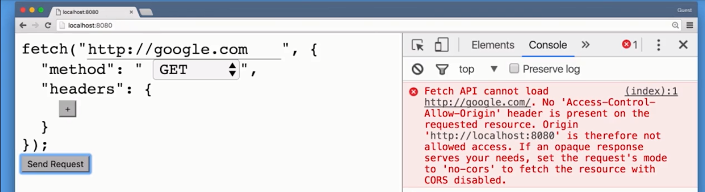

实际上在某些情况下，可以这么做，但是你无法阅读获取的内容：

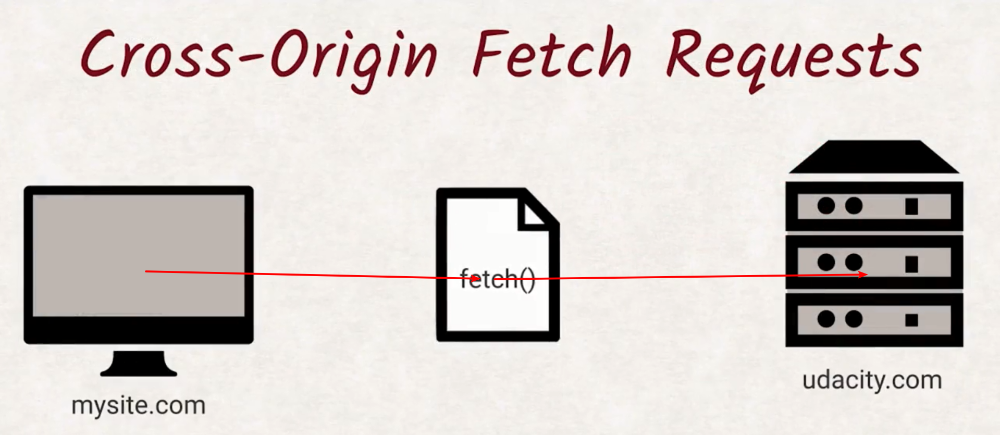

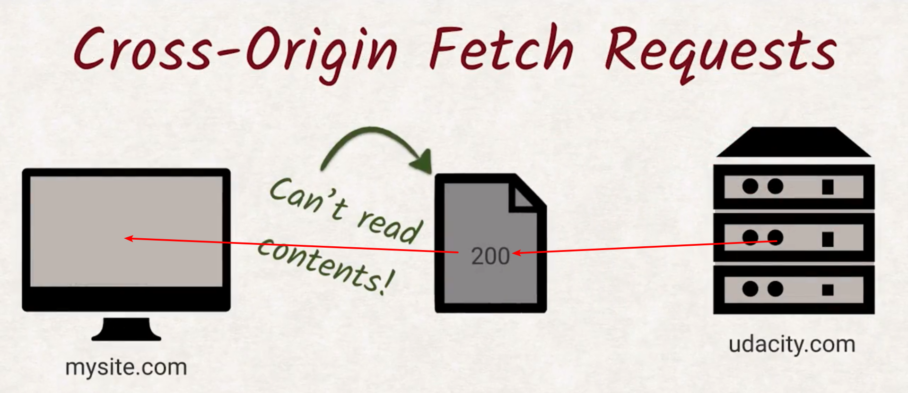

其次，如果包含 JavaScript 的 iframe 或窗口来自其他来源，则无法检测它们。

如果你仔细思考下，就会发现这些规则很合理，假设我可以向其他来源发出 fetch 请求，我可以构建一个网站，向 facebook.com 发出 fetch 请求并窃取你的所有 Facebook 消息，甚至更糟糕，我可以向 udacity.com 发出 fetch 请求并让你缺席所有的优达学城课程。我们肯定不希望发生这种情况。

这种限制/规则称为**同源策略（same-origin policy）**。

- [同源政策](https://www.w3.org/Security/wiki/Same_Origin_Policy)

---

## 5.3 来源 2

Surmon 刚刚介绍了一些规则，但是如果有规则，这些**规则就有例外情况**。

你非常清楚我们可以包含其他来源的样式表、图片、视频、iframe、甚至脚本，以及向其他来源发送表单数据，最终用户无法判断一个图片是从服务器加载的，还是从 Instagram 加载的：

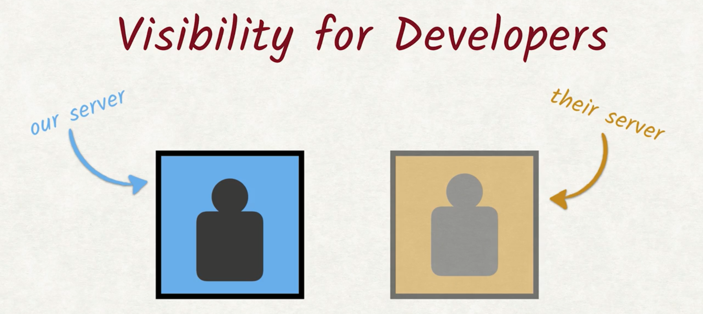

但是，对于网络开发者来说，存在区别，你无法像与同源图片互动那样与显示交叉来源（跨源）的图片标签互动。例如，你无法从 Canvas 元素内检查图片的像素，包含交叉来源脚本资源的脚本标签也一样，内容将自动显示为空，或者对于更现代的 API 来说，直接显示错误。

对于 same-origin 脚本标签，我可以访问它的内容，但是我无法访问 other-origin 的脚本内容：


务必注意，**用户的浏览器负责执行同源策略，客户端（而不是服务器）将不允许你发送请求**：

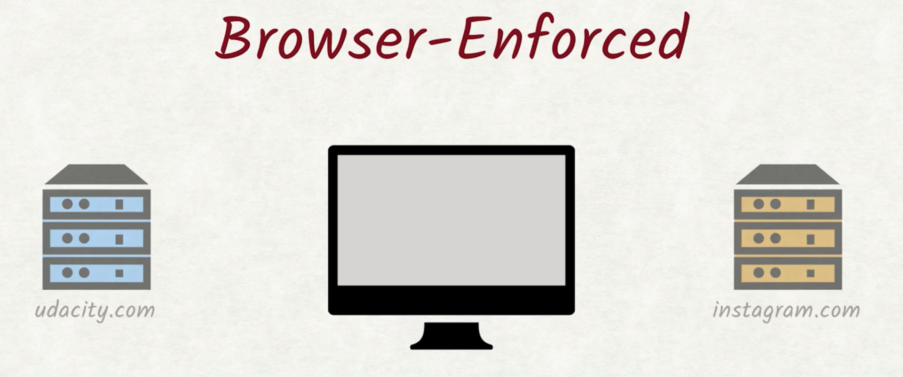

我们将在下个视频中了解为何这一点很重要。

---

## 5.4 JSONP

有时候，你希望其他人能访问你的资源，即使他们来自其他来源：


尤其是 API 提供商，他们希望其他网站能够使用他们的服务，但是同源政策阻止这么做。

如今，你可以利用跨域资源共享（简称 CORS - Cross Origin Resource Sharing）并通过 AGB 报头，轻松地实现资源共享，这是解决单一起源问题最强大的工程解决方案，但是直到几年前很少有浏览器支持 CORS，在此期间，人们需要自己想出技巧来应对单一来源策略。

时间最久的一个技巧是 JSONP（JSON with Padding）JSONP 返回一个包含数据的脚本，而不是直接返回数据，原理是其他来源的脚本将执行并与你的脚本共享执行环境。

基于 JSONP 的 API 会包含函数名称，并作为查询参数，服务器将返回一个调用你所指定的函数的新脚本。

我们来看一个虚构示例。

假设我们要在 yourcourselist.com 上构建应用并列出用户报名的所有高效课程，比较初级的方法是向 api.udacity.com 发出 fetch 请求，并使用返回的数据为用户生成列表。但是，这样做回因为安全异常而失败，因为你的主机与 Udacity 的主机不同：

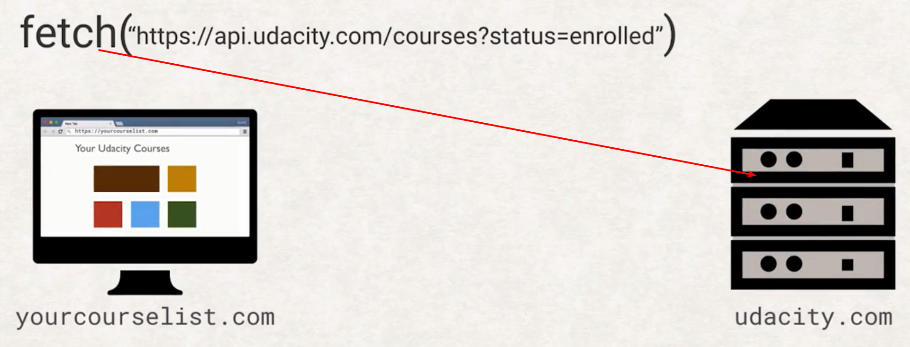

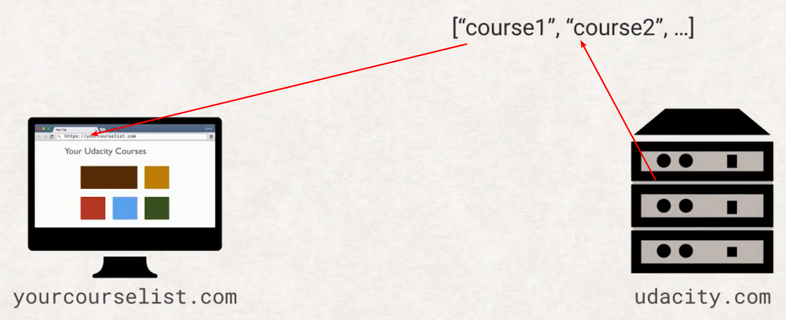

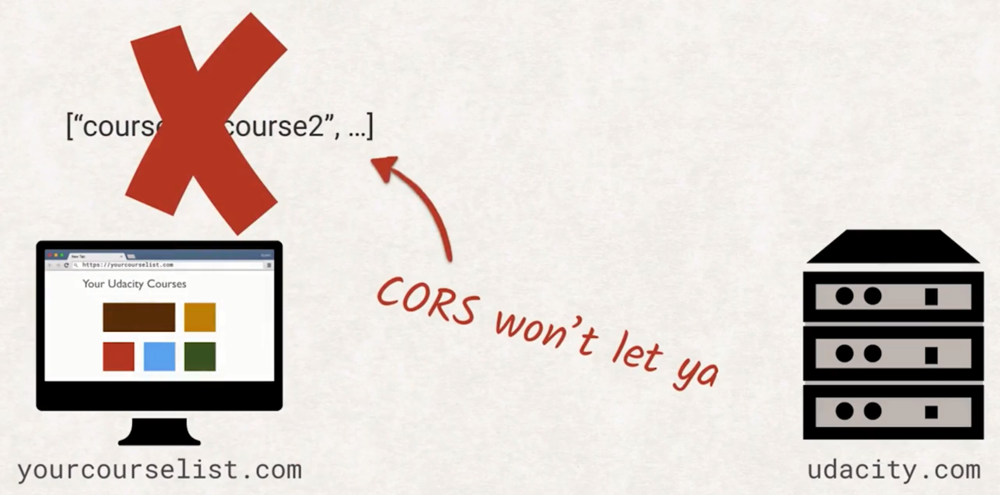

如果该 API 支持 JSONP 会怎样？

向该 URL 中添加一个函数名称，并包含在 script 标签中，服务器将需要返回的所有数据都封装在名称和通过查询参数提供的名称相同的函数调用中，你需要定义此函数，因为当响应返回时，函数调用被执行，现在你可以访问该函数的参数对应的数据了：

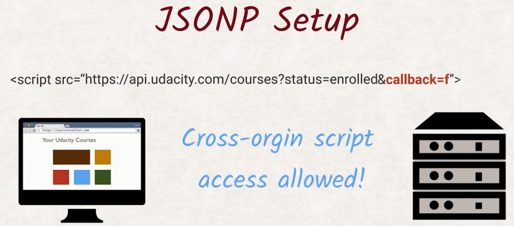

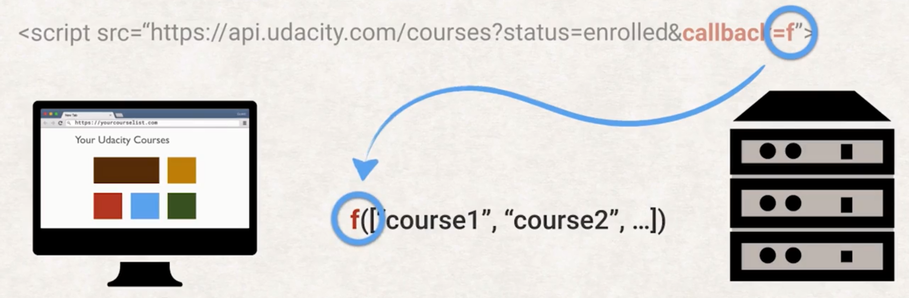

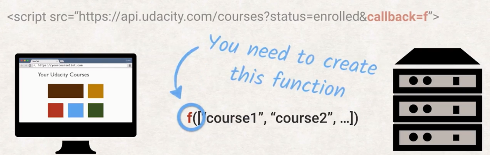

- [JSBin 示例](https://jsbin.com/roxapu/3/edit?html,js,console)

```html
<!DOCTYPE html>
<html>
<head>
  <meta charset="utf-8">
  <meta name="viewport" content="width=device-width">
  <title>JS Bin</title>
</head>
<body>
  <div></div>
  <script>
      function myfunction(data) {
        document.querySelector('div').textContent = 'The most popular reddit article is called: '+ data.data.children[0].data.title;
      }
  </script>
  <script src="https://api.reddit.com/r/all.json?jsonp=myfunction"></script>
</body>
</html>
```


### 消息传递

另一种被明确设计为允许跨源通信的技术称为**消息传递**。`postMessage()`是一个函数，可以调用它来传递消息到其他窗口和 iframe，即使它们来自不同的来源。 这会创建一个**消息**事件，你可以像其他任何事件一样订阅该事件。 为了安全起见，接收者可以检查消息的来源和内容。

虽然 postMessage 比其他跨源选项更干净，并且允许更细微的控制，但遗憾的是还没有被 API 提供商广泛采用。


## 5.5 CORS

很多 API 提供商将 CORS 当做共享资源的主要方式。

CORS 报头允许跨域请求并且不依赖 JavaScript，但是需要在服务器端添加一些代码。CORS 报头允许服务器指定可以访问其资源的一组来源，如果请求的 Referer 报头位于该列表中，它将能够检查结果并使用数据：

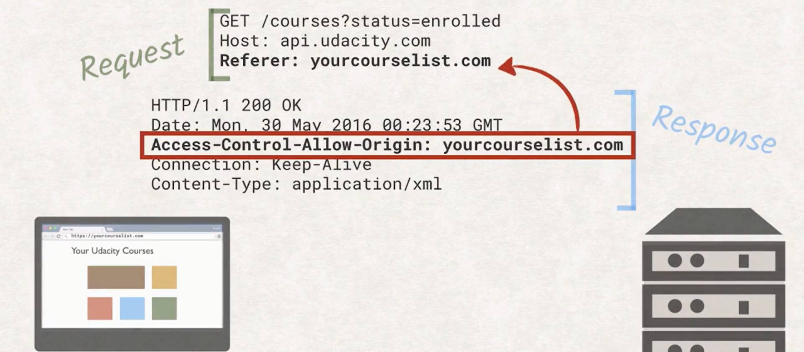

问题得到了解决。

但是，如果你仔细看看，就会发现到服务器发回报头时，请求已经被执行。这样会使结构操作出现问题，因为已经无法忽略请求（这里的意思应该是，你发送的是跨源请求，浏览器会发现这个问题，因此会阻止请求的发出，但有些时候是请求发出后，浏览器会阻止你打开收到的内容）：

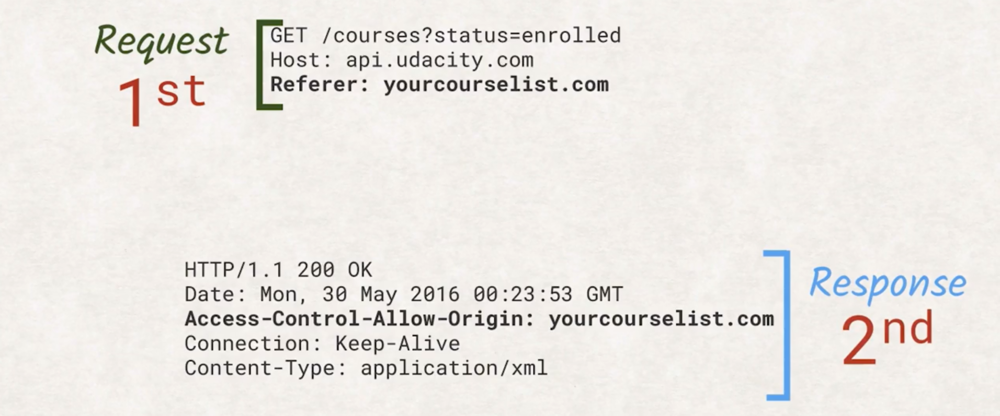

这时候预检请求就派上用场了。

预检请求使用 OPTIONS 方法，并允许浏览器表示它只想检查允许执行什么操作和不允许执行什么操作。服务器不应执行任何类型的业务逻辑，而是仅返回报头，类似于 Head 请求：

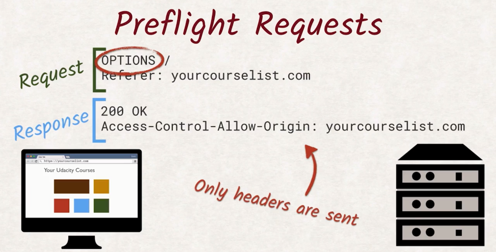

但是，并非所有请求都被预检，因为图片标签或表单发出的请求不会被预检。因此任何类型的 Get 请求都将立即发送，如果 CORS 不允许这种请求，你将无法读取结果。

关于有 CORS 时的预检请求何时会真的被发送比较复杂，知识点很多，因此我在讲师注视中给出了详情链接。

现在，我们可以通过几种方式来应对单一来源限制，如果你以后要发布 API，建议你从一开始就考虑 CORS，并在你的服务器上启用 CORS。

- [预检请求与 CORS](https://developer.mozilla.org/en-US/docs/Web/HTTP/Access_control_CORS#Preflighted_requests)

---

## 5.6 预检请求与 CORS 练习 1

在接下来的几道练习中，你将通过几个不同的 HTTP 请求获得实践经验。你需要判断请求是否被预检，如果被预检，是哪一行导致的？请启动服务器，然后在 fetch 工具中重构此请求：

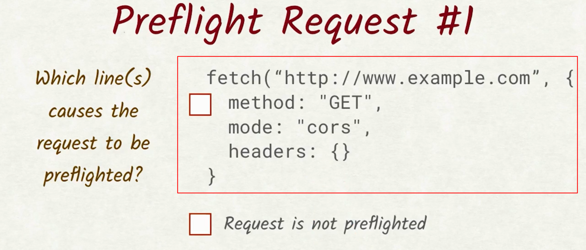

使用开发者工具查看一些请求立即被发送，而其他请求发送了预检请求，如果使用了 OPTIONS 方法，你就知道请求被预检了。

请研究这些请求，直到弄明白什么促使浏览器预检请求。如果 GET 方法导致请求被预检，则选中上图中的第一个选择框，如果请求未预检，则选中第二个选择框。


#### 辅助材料

[ L5-Preflight-Requests-Binary](http://video.udacity-data.com.s3.amazonaws.com/topher/2016/June/575717ae_l5-preflight-requests-binary/l5-preflight-requests-binary.zip)


因为该请你去与我要发送的请求完全一样，因此不需要做出任何更改。因为我们需要查看使用了哪个方法，因此我们将停用一些干扰性列（指右键取消一些类型的查看），并开启 Method 列。

这个 GET 请求被成功发送，因为这里没有列出 OPTIONS 请求：

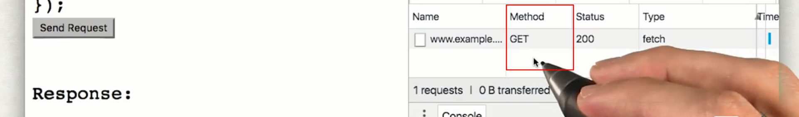

因此该请求没有被预检。

---

## 5.7 预检请求与 CORS 练习 2

和上一道练习一样，你需要判断请求是否被预检，如果被预检，是哪行/哪些行导致被预检，如果 method: "POST" 行导致该请求被预检，则选中第一个方框，如果 X-Forwarded-For 行导致的，则选中第二个方框，如果请求根本没被预检，则选中第三个方框：

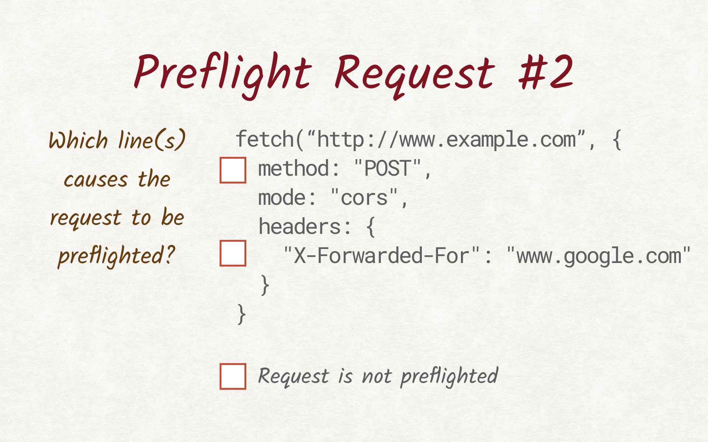

该练习的设置与以前的练习完全相同：

*它使用相同的二进制文件* 你需要检查 `选项(Options)` HTTP动词的`方法(Method)` 列


运行此请求显示了 OPTIONS 方法，因此它被预检了，但是不知道是因为 POST 请求，还是因为 X-Forwarded-For 报头。如果我删除此报头并重新运行请求，它没有使用 OPTIONS 报头，因此 X-Forwarded-For 报头导致请求被预检。

---

## 5.8 预检请求与 CORS 练习 3

和上两道练习一样，你需要判断请求是否被预检，如果被预检，哪行/哪些行导致被预检：

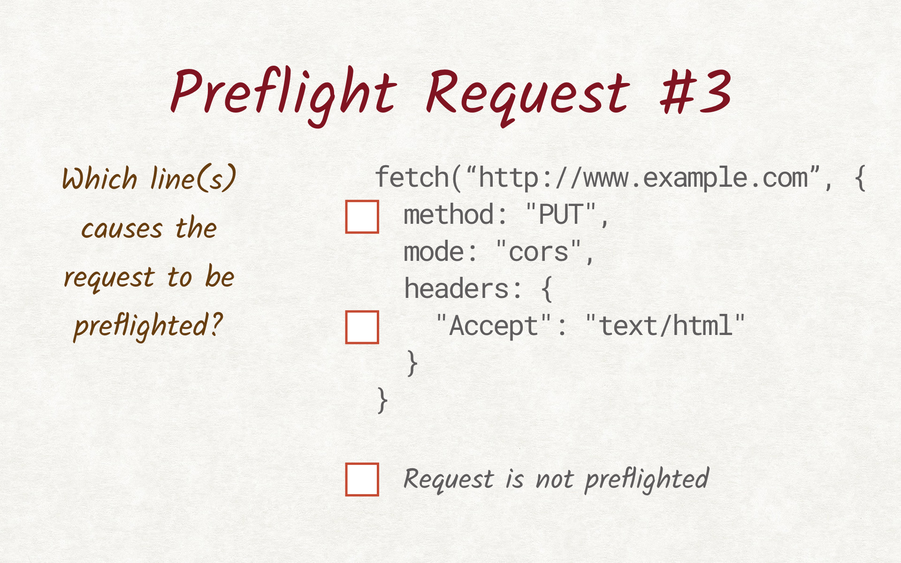


该练习的设置与以前的练习完全相同：

*它使用相同的二进制文件* 你需要检查 `选项(Options)` HTTP动词的`方法(Method)` 列


发送此请求显示了 OPTIONS 方法，因此被预检了。如果删除该报头并重新发送请求，依然被预检，如果重新添加该报头，并将方法改成我知道不会预检的方法，例如 GET，则没有使用 OPTIONS 报头，因此 Accept 报头没有导致预检，而是由 PUT 方法导致的。

---

## 5.9 安全漏洞 - CSRF

正如刚刚了解的，看起来像来自表单的请求将不会被预检。如果 CORS 不允许读取响应，你将无法读取响应，但有时候可能不需要查看响应就能造成严重破坏。

假设银行有一个转账表单，如果你是个坏人，你只想将钱汇到你自己的账户中，你不关心服务器的结果是什么，因此你设置了一个网站，用来伪造 URL 和表单所用的 URL 一样的请求并设置相关参数，将钱汇到你的账户中，用户根本不会发现。因此这种攻击称为跨站请求伪造，简称 CSRF（Cross-site request forgery）。

当然，银行拥有复杂的保护机制，但是对于大多数情况，CSFR 令牌就足够作为保护措施了。CSFR 令牌是由服务器添加到表单上的额外字段并存储在服务器上，如果有人提交了请求，CSFR 就会对照存储的令牌检查该令牌，只有这两个令牌匹配时，才执行请求。

---

## 5.10 练习：CSRF

还记得之前提到的具有可以被攻击的转账表单的银行吗？它真的存在。现在请你来利用它的漏洞。

该项目的服务器有两个端点，银行网站和恶意 URL，你可以在该 URL 上放置你的代码，银行的 URL 提供了银行网站的登录页面，密码是 supersecretpassword，并列在了说明中：

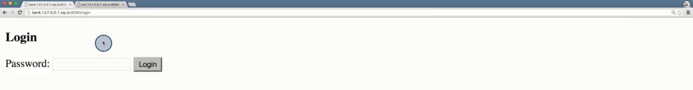

这是设计非常“美观”的银行余额页面。我妹妹将来找我，因此需要一些零花钱，你需要向 Umbrella Corporation 转账 666 元，但是你无法在此网站的此处操作：

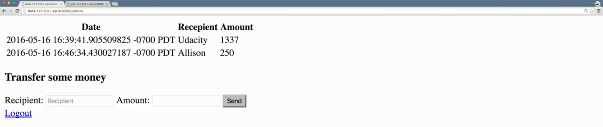

另一个 URL 是恶意网站，此网站会将你输入的任何内容放入恶意目录下，因此你需要创建一个向银行发出 CRF 请求的网站：

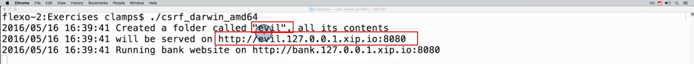

此练习需要好几个步骤才能完成，你将黑一个虚拟银行，太酷了。

1. 你需要登录银行网站，使恶意网站能够访问你的登录 Cookie。
2. 然后在 evil 文件夹中创建一个网站，该网站将向此 URL 发送一个 POST 请求
   - 发布的数据需要将 recipient 设为 Umbrella+Corp
   - amount 为 666
   - 要在 Fetch 请求中发送 Cookie 数据，凭据的标记必须设为 include

如果一切操作正确，服务器将提供给你一个令牌，这是服务器，而不是浏览器的控制台，因此检查终端，然后将令牌填到这里：

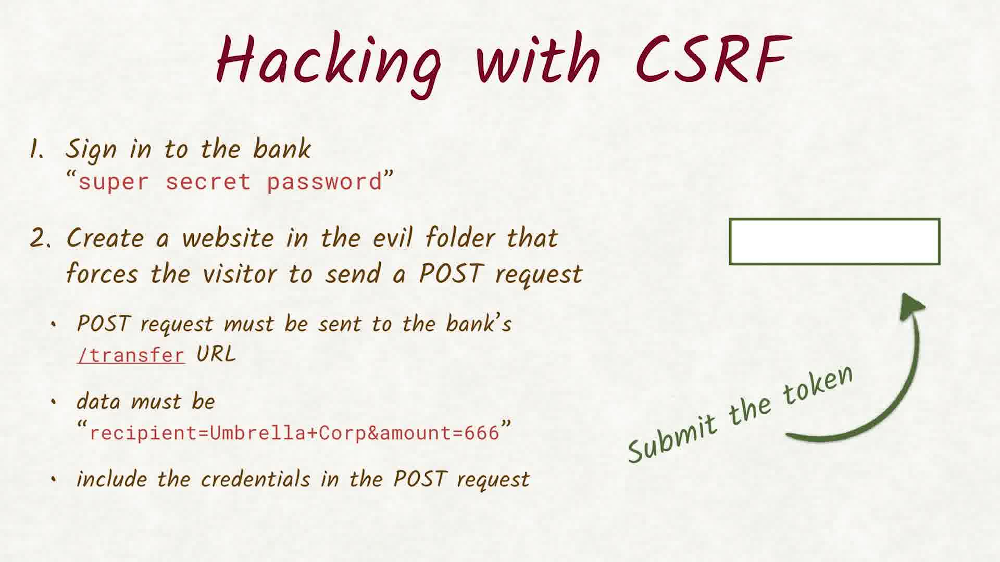

这道练习比大部分练习都要复杂，一步步地操作，确保 Fetch 请求正确无误，请参阅讲师注视了解如何使用 Fetch 构建 POST 请求。


**要启动二进制文件：**

1.使用终端 - 在终端上，切换到有二进制文件的目录，然后用`./ <二进制名称>（例如`./csrf_mac_amd64`）运行``./` 在开头是必备的。 2.双击二进制文件 - 这将在你的主目录中创建“邪恶”文件夹。


我们登录了银行账户，因此我的浏览器中设置了登录 Cookie。打开开发者工具后，可以在这里看到该 Cookie：

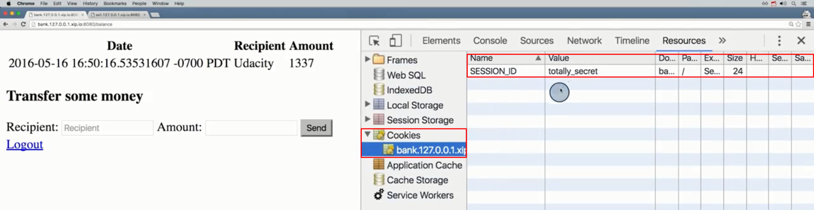

现在我们需要创建一个网站，然后用于发送伪造的请求。如果有人进入我的网站，我希望他们以为他们要玩一个游戏，当他们点击此按钮时，我希望向银行的转账 URL 发送一个请求，转账 URL 预计会收到一个 POST 请求，该请求的主体必须是接收者和转账金额。因为这是 POST 请求，因此 Content-Type 报头必须设为这个值。此代码将发送一个请求，但是银行的网站会检查是否有特定的 Cookie，Credentials: 'include' 会同时发送此网域的 Cookie，如果用户已经登录银行账户，那么浏览器具有登录 Cookie，并且在发送请求时自动包含该 Cookie，最后，当有人点击该按钮时，我将按钮文本改为这个激励性的消息：

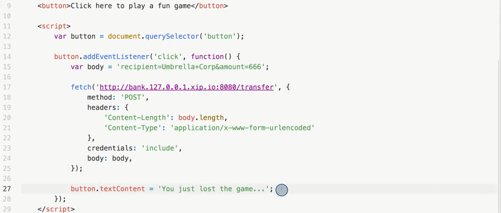

我们来试试，点击该按钮更改了文本，因此发生了操作，在开发者工具中可以看到刚刚发送的请求，这是在其他标签页中设置的 Cookie：

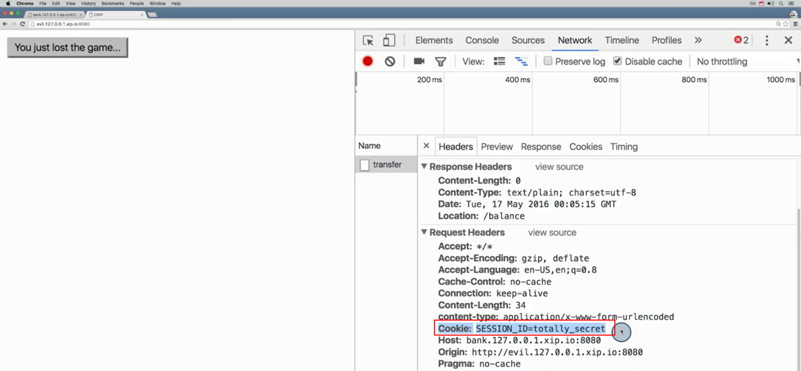

刷新银行网站后，出现了这个新的条目，成功了：

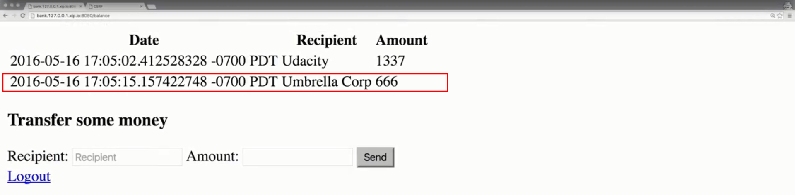

这是练习要寻找的代码：

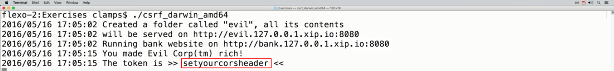

这道练习有点难，所以很棒。

---

## 5.11 安全漏洞 - XSS

每当网站显示用户输入时，你都需要保护谨慎，用户输入可以是任何内容，你需要确保这些内容不会使你的网站崩溃。无心的用户可能会不小心破坏网站，恶意攻击者可能会利用这一漏洞并使网站执行原本意图之外的操作。

不验证用户输入是历史最久的网络漏洞，称为跨站脚本，简称 XSS（Cross-site scripting），得名原因是 JavaScript 可以被注入另一个网站，并在该网站上执行和访问网站的所有数据。

典型例子是当用户想要发表评论时，网站要求提供用户名，如果不验证该输入，攻击者在创建用户名时可能就会包含 JavaScript 代码，意味着所有用户在阅读该评论时都将只看到用户名，但是代码会在用户不知情的情况下执行：

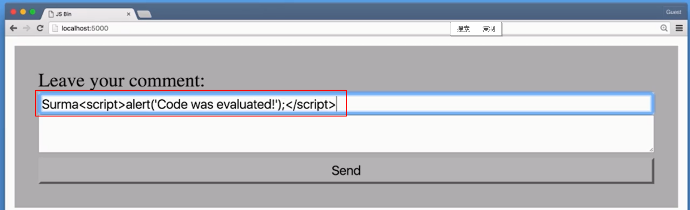

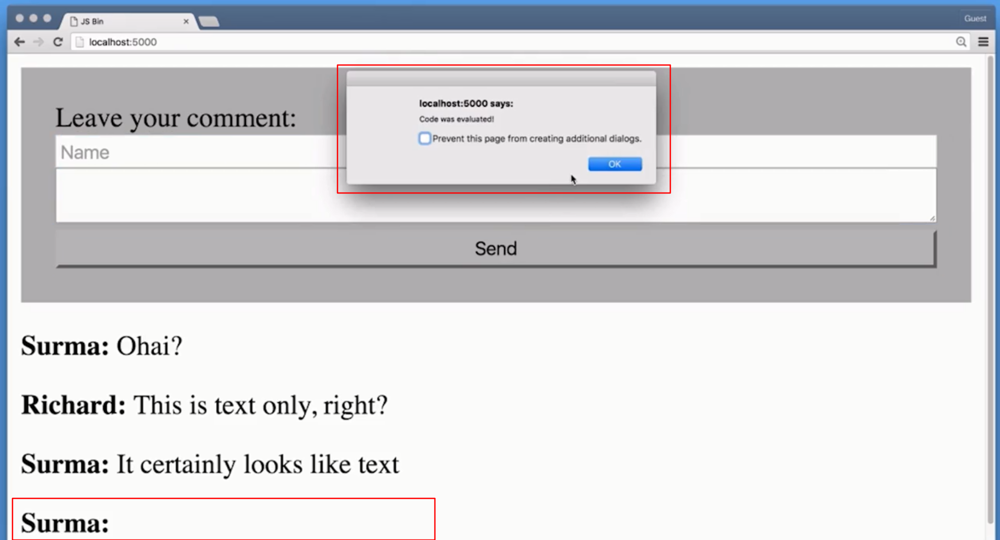

从整体上来说，这个示例没什么危害，但是脚本可以访问网站的所有数据，包括 DOM 和 Cookie，甚至可以从网站的来源发出 fetch 请求，精心编辑的 XSS 代码会带来有害影响，避免出现此类攻击的唯一方式是遵守软件工程中的一项黄金法则，即在服务器端验证用户的输入。

- [XSS (跨站脚本) 在维基百科上的解读](https://en.wikipedia.org/wiki/Cross-site_scripting)

---

## 5.12 练习：XSS

该项目的服务器有两个端点，即 badwebsite URL 和 decoder URL，badwebsite 网页有一个表单，该表单容易受到跨站脚本的攻击，你需要利用该漏洞将此网站的 Cookie 发送到 decoder 网站：

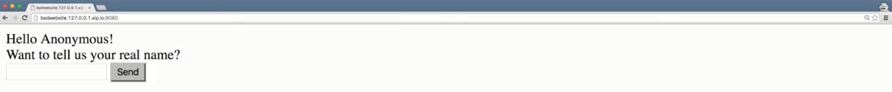

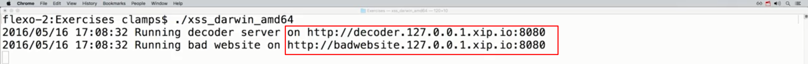

要完成这道联系，请使用该 URL 创建一个 fetch 请求，但需要使用 JavaScript 将 key 设为 badwebsite 的 SESSION_ID Cookie 值，如果一切操作正确，服务器将提供一个密码，注意，是服务器而不是浏览器的控制台，因此请检查中端：

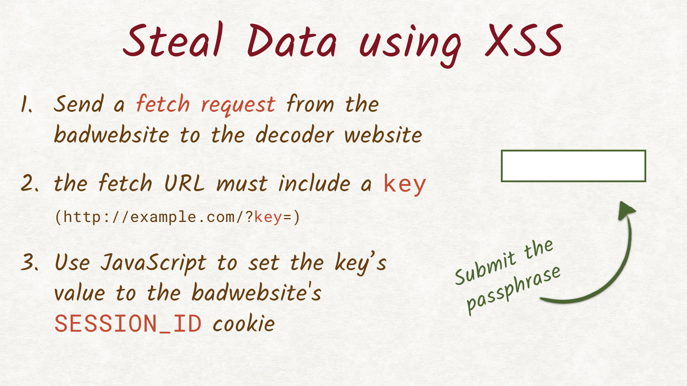


- [http://badwebsite.127.0.0.1.xip.io:8080](http://badwebsite.127.0.0.1.xip.io:8080/)
- http://decoder.127.0.0.1.xip.io:8080
  - 将请求发送到`http://decoder.127.0.0.1.xip.io:8080?key=<cookie value>`，其中`<cookie value>`是存储在SESSION_ID cookie中的值。


#### 辅助材料

[ L5-XSS-Binary](http://video.udacity-data.com.s3.amazonaws.com/topher/2016/June/575717f7_l5-xss-binary/l5-xss-binary.zip)


这是我需要在 decoder 网站上点击的 URL，现在需要将 key 的值设为 SESSION_ID Cookie：

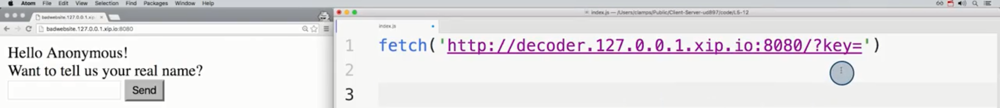

document.cookie 可以获取所有 Cookie，然后 split('=') 并获取 Cookie 值：

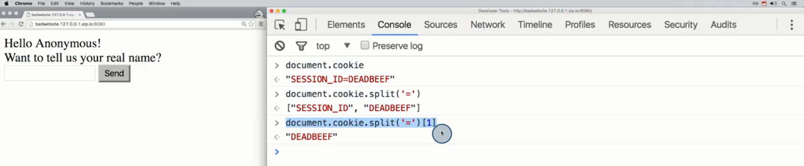

这行代码很初级，认为 SESSION_ID Cookie 是第一个 Cookie 这里是这种情况。（上面代码）

下面这是一个更准确的版本，它首先会搜索 SESSION_ID，因此我将使用该 JavaScript：


这是完整的 URL，因为该表单容易受到跨站脚本的攻击，我只需将这些包含在 script 标记中，因为该表单容易受到跨站脚本的攻击，我只需将这些包含在 script 标记中，发送这个值可以获得密码：

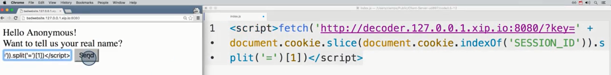

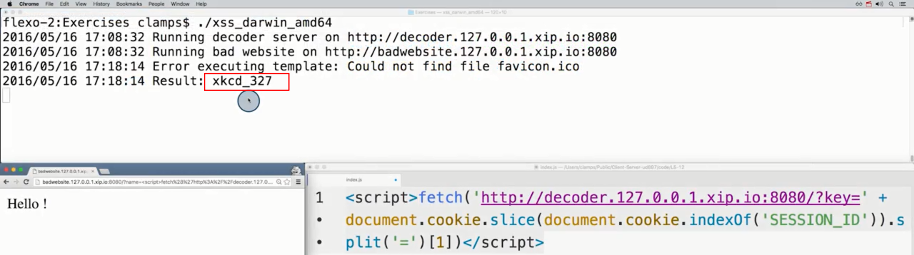

因为我们讨论的是安全性，你应该在 Google 中搜索下该密码，它处理了另一种安全性漏洞。

---

# 5.13 安全性：小结

安全性是个比较复杂的概念，我们在这节课讨论的问题仅仅在前端解决是不够的，你的后端无论是什么，都需要实现验证功能，以便抵御 CSRF 和跨站脚本攻击。

在这节课中你所学习到的知识是如何发现潜在的漏洞，以及如何验证是否容易被攻击，每当你打算向你的网络应用中添加任何类型的输入字段时都要立即思考跨站脚本和 CSRF，以及是否有任何需要避免的潜在风险。这样的话，即保护了你的网站，又保护了用户。


---

# 5.14 课程总结

让服务器和客户端相互通信并不是那么困难，但是以正确、高效和安全的方式通信却比想象的要难得多。

我们在这门课程中讲解了很多内容，我们了解了浏览器和服务器在其中相互连接的请求和响应周期，然后了解了 HTTP 的动词、报头、REST和性能问题。

第三节课讲解了 HTTPS、TLS 和密码学。

第四节课，我们了解了 HTTP/2，以及它给网络生态系统带来的所有强大优势。

第五节课，我们了解了通过同源策略采取的安全预防措施以及绕过该策略的方案，然后介绍了一些漏洞，我们介绍了很多技巧，但最重要的一点是保护用户安全。

感谢你与我们一起学习了这门客户端服务器通信课程，回头见。